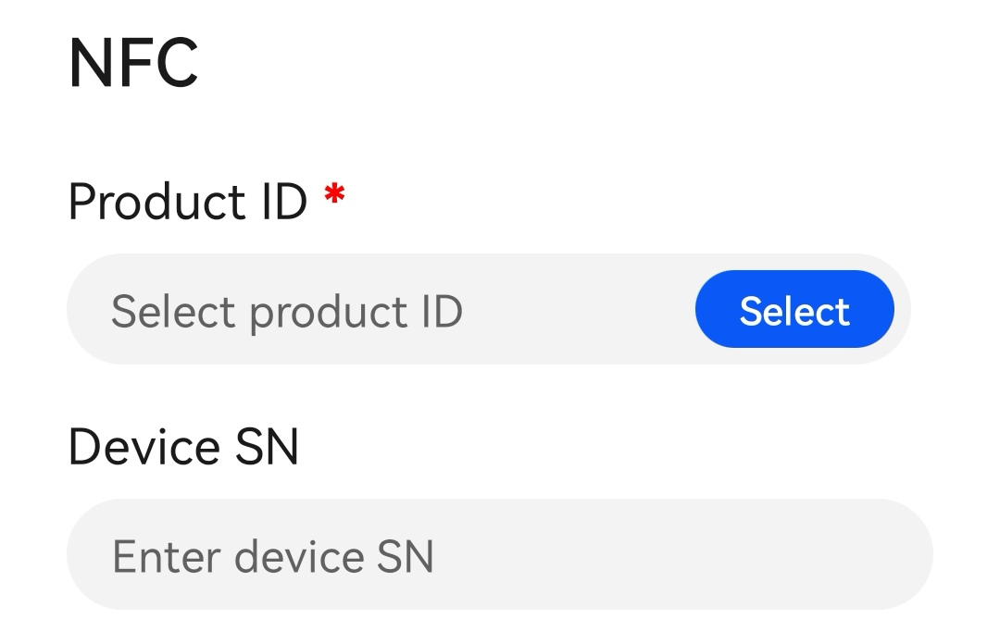
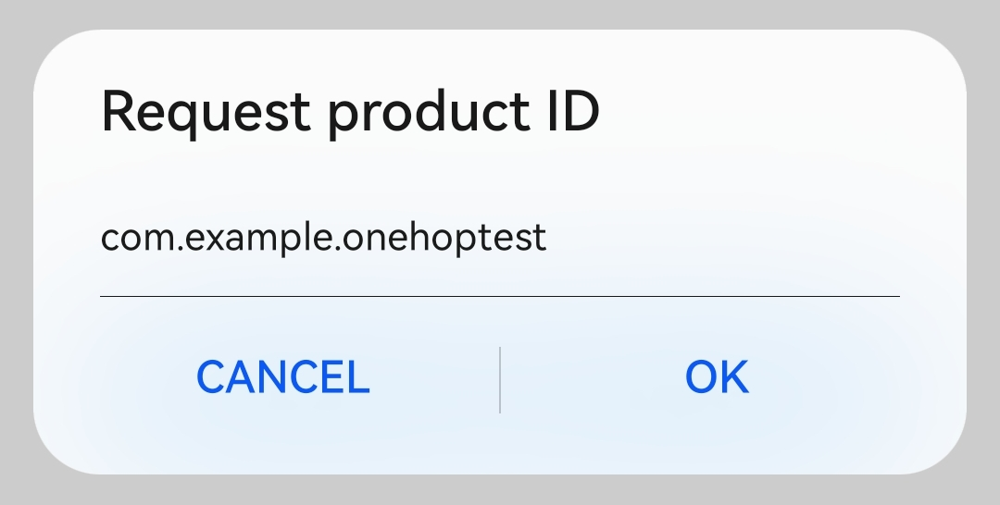
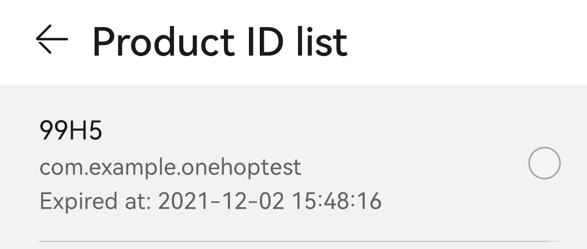
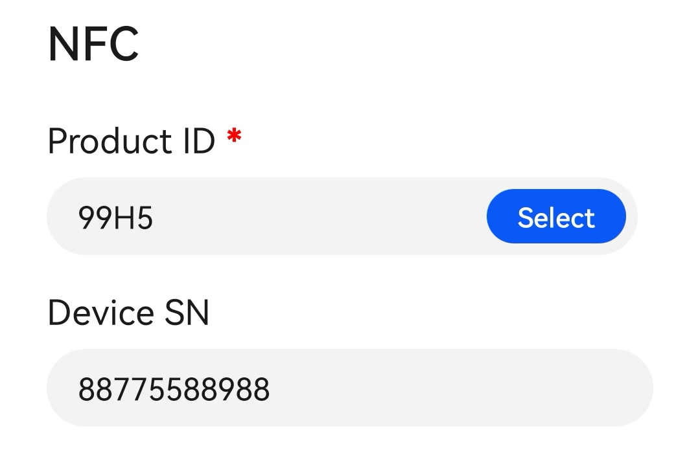
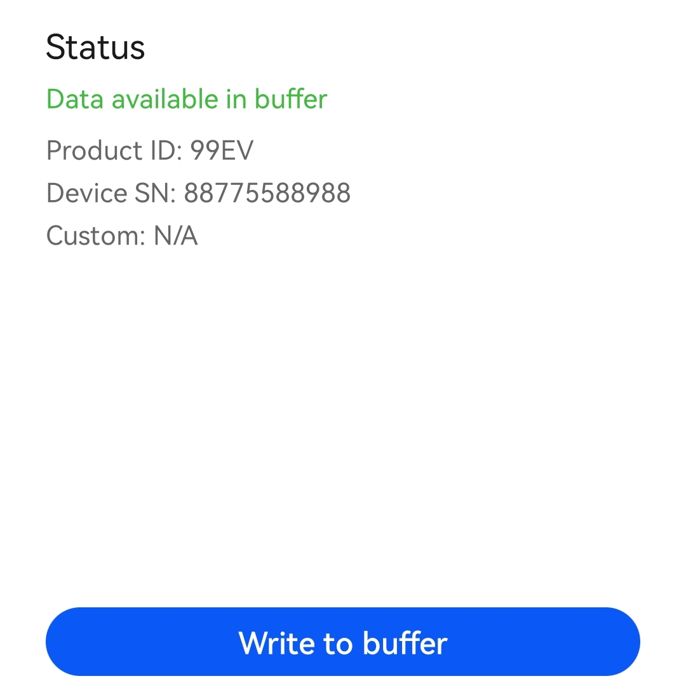
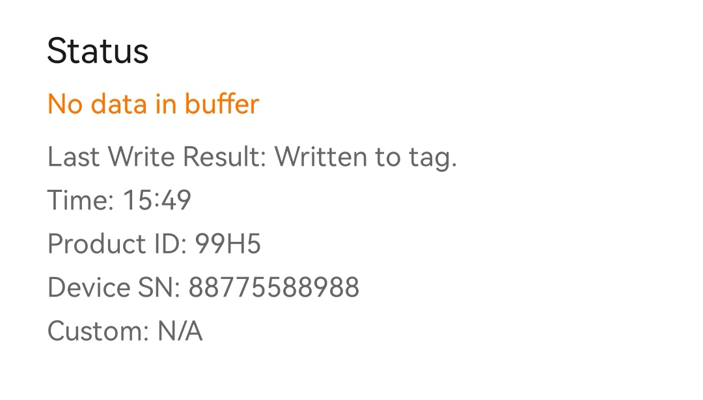

# Writing an NFC Tag

Use the HUAWEI DevEco Assistant app to apply for a product ID and write the product ID to the NFC tag.

1.  Enable NFC on your phone.
2.  Open the HUAWEI DevEco Assistant app and click the  **NFC**  tab at the bottom.

    

3.  Touch  **Select**. If you have not logged in, log in with your HUAWEI ID first.

    

4.  Click  **Request**  and enter the name of the atomic service package. The name must be the same as the value of  **bundleName**  in the  **config.json**  file under  **src \> main**  of the module. The system will automatically allocate a product ID. You can apply for a maximum of three valid product IDs with one HUAWEI ID. The validity period of each product ID is one month. After a product ID expires, you can request a new one.

    

5.  Select a product ID.

    

6.  Enter the SN of the Hi3861 development board. The SN is only required when you need to obtain device information through the NFC tag.

    

7.  Touch  **Write to buffer**  to write the data to the buffer.

    

8.  Place your phone close to the NFC tag. The data in the buffer starts being written to the NFC tag. After the writing is complete, the status changes to  **No data in buffer**.

    

