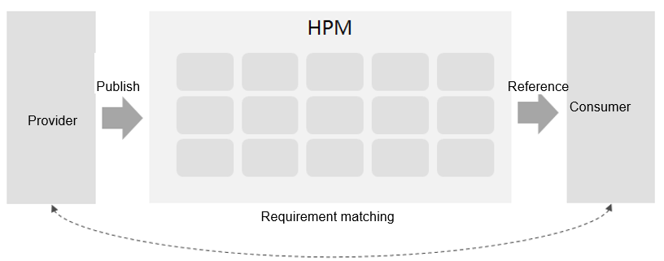

# HPM Part Overview

This section describes the basic concepts related to HPM Part in OpenHarmony.

## Introduction to HPM Part

### HPM Part Category

An HPM Part is used as a distribution unit in OpenHarmony. There are two types of HPM Parts:

- **Part/Module-level HPM Part**: used to achieve module or part reusability. The distributed content can be source code or binary files. Generally, such an HPM Part corresponds to a code repository and is a release of the code repository.

- **Distribution-level HPM Part**: used to describe an OS distribution. It consists of a list of dependent parts and scripts for building the distribution. The distribution contains various components (such as the driver, kernel, framework, and applications) of a complete OS. The image generated after the build can be used for burning.

### HPM Part Composition

An HPM Part consists of two types of files: description file and content file.

The table below lists the description files.

  **Table 1** Description files

| File Name| Description | Mandatory | 
| -------- | -------- | -------- |
| bundle.json | Metadata declaration file| Yes| 
| README.md | Readme file| Yes| 
| LICENSE | License file| Yes| 
| CHANGEME.md | Change log file| No| 

The content files can be any of the following:

- Binary file of the distributed part

- Source code file of the distributed part

- Build script file

  **Figure 1** Relationship between the part/module-level HPM Part and distribution-level HPM Part

  

## Introduction to HPM

OpenHarmony Package Manager (HPM) is an open collaboration platform that connects consumers and providers. HPM Parts are objects managed by HPM.

Through this platform, the provider can publish HPM Parts and the consumer can download and use HPM Parts.

- The provider declares the attributes of an HPM Part and publishes it to the platform.

- The consumer declares the dependencies in the HPM Part of the specified version to obtain the required resources.

The HPM platform matches the requirements of the provider and consumer.

  **Figure 2** HPM functions

  

**HPM consists of the following:**

- **hpm-cli: a cross-platform command line tool released in [@ohos/hpm-cli](https://www.npmjs.com/package/@ohos/hpm-cli)**

  The hpm-cli tool offers a series of commands for creating, building, installing, packing, running, and publishing HPM Parts. You can use these commands to manage the lifecycle of the HPM Parts.

- **[DevEco Marketplace](https://repo.harmonyos.com): a resource repository on the server**

  On [DevEco Marketplace](https://repo.harmonyos.com), you can register, store, and search for HPM Parts by category. Each HPM Part has a page providing access to its readme file, dependencies, historical versions, change history, license, download volume, and source code repository address. You can publish HPM Parts to this resource repository.
