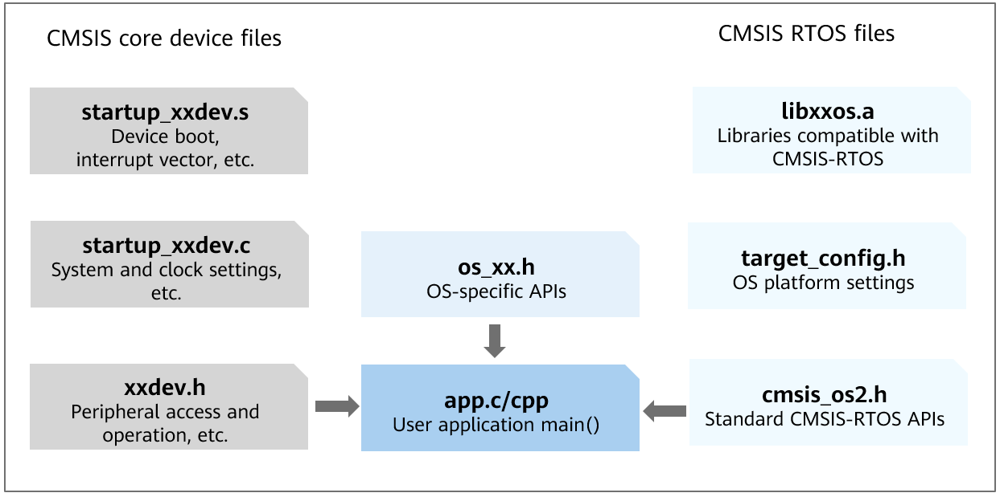

# CMSIS Support<a name="EN-US_TOPIC_0000001124074753"></a>

-   [Basic Concepts](#section131091144111615)
-   [Development Guidelines](#section57653573161)
    -   [Available APIs](#section1795910417173)
    -   [How to Develop](#section48301225131720)
    -   [Development Example](#section524434761713)


## Basic Concepts<a name="section131091144111615"></a>

The Cortex Microcontroller Software Interface Standard \([CMSIS](https://developer.arm.com/tools-and-software/embedded/cmsis)\) is a vendor-independent hardware abstraction layer for microcontrollers based on Arm Cortex processors. Of the CMSIS components, the Real Time Operating System \(RTOS\) defines a set of universal and standardized APIs to reduce the dependency of application developers on specific RTOS and facilitate software porting and reuse. The CMSIS provides CMSIS-RTOS v1 and CMSIS-RTOS v2. The OpenHarmony LiteOS-M supports only the implementation of CMSIS-RTOS v2.

## Development Guidelines<a name="section57653573161"></a>

### Available APIs<a name="section1795910417173"></a>

The following table describes CMSIS-RTOS v2 APIs. For more details about the APIs, see the API reference.

**Table  1**  CMSIS-RTOS v2 APIs

<a name="table14277123518139"></a>
<table><thead align="left"><tr id="row152771935131315"><th class="cellrowborder" valign="top" width="18%" id="mcps1.2.4.1.1"><p id="p1127733591316"><a name="p1127733591316"></a><a name="p1127733591316"></a>Category</p>
</th>
<th class="cellrowborder" valign="top" width="24%" id="mcps1.2.4.1.2"><p id="p22771357138"><a name="p22771357138"></a><a name="p22771357138"></a>API</p>
</th>
<th class="cellrowborder" valign="top" width="57.99999999999999%" id="mcps1.2.4.1.3"><p id="p327714358130"><a name="p327714358130"></a><a name="p327714358130"></a>Description</p>
</th>
</tr>
</thead>
<tbody><tr id="row159539510586"><td class="cellrowborder" rowspan="13" valign="top" width="18%" headers="mcps1.2.4.1.1 "><p id="p1194410585810"><a name="p1194410585810"></a><a name="p1194410585810"></a>Kernel information and control</p>
</td>
<td class="cellrowborder" valign="top" width="24%" headers="mcps1.2.4.1.2 "><p id="p10944105115814"><a name="p10944105115814"></a><a name="p10944105115814"></a>osKernelGetInfo</p>
</td>
<td class="cellrowborder" valign="top" width="57.99999999999999%" headers="mcps1.2.4.1.3 "><p id="p9944105175818"><a name="p9944105175818"></a><a name="p9944105175818"></a>Obtains RTOS kernel information.</p>
</td>
</tr>
<tr id="row17953454580"><td class="cellrowborder" valign="top" headers="mcps1.2.4.1.1 "><p id="p2071181110424"><a name="p2071181110424"></a><a name="p2071181110424"></a>osKernelGetState</p>
</td>
<td class="cellrowborder" valign="top" headers="mcps1.2.4.1.2 "><p id="p12388182124219"><a name="p12388182124219"></a><a name="p12388182124219"></a>Obtains the current RTOS kernel status.</p>
</td>
</tr>
<tr id="row14587143217423"><td class="cellrowborder" valign="top" headers="mcps1.2.4.1.1 "><p id="p19587832194214"><a name="p19587832194214"></a><a name="p19587832194214"></a>osKernelGetSysTimerCount</p>
</td>
<td class="cellrowborder" valign="top" headers="mcps1.2.4.1.2 "><p id="p17587193274218"><a name="p17587193274218"></a><a name="p17587193274218"></a>Obtains the RTOS kernel system timer count.</p>
</td>
</tr>
<tr id="row6379429154617"><td class="cellrowborder" valign="top" headers="mcps1.2.4.1.1 "><p id="p63791299469"><a name="p63791299469"></a><a name="p63791299469"></a>osKernelGetSysTimerFreq</p>
</td>
<td class="cellrowborder" valign="top" headers="mcps1.2.4.1.2 "><p id="p1037932924610"><a name="p1037932924610"></a><a name="p1037932924610"></a>Obtains the RTOS kernel system timer frequency.</p>
</td>
</tr>
<tr id="row59815341465"><td class="cellrowborder" valign="top" headers="mcps1.2.4.1.1 "><p id="p898153494617"><a name="p898153494617"></a><a name="p898153494617"></a>osKernelInitialize</p>
</td>
<td class="cellrowborder" valign="top" headers="mcps1.2.4.1.2 "><p id="p374817118497"><a name="p374817118497"></a><a name="p374817118497"></a>Initializes the RTOS kernel.</p>
</td>
</tr>
<tr id="row11611104112469"><td class="cellrowborder" valign="top" headers="mcps1.2.4.1.1 "><p id="p861114144619"><a name="p861114144619"></a><a name="p861114144619"></a>osKernelLock</p>
</td>
<td class="cellrowborder" valign="top" headers="mcps1.2.4.1.2 "><p id="p165481944917"><a name="p165481944917"></a><a name="p165481944917"></a>Locks the RTOS kernel scheduler.</p>
</td>
</tr>
<tr id="row36112411462"><td class="cellrowborder" valign="top" headers="mcps1.2.4.1.1 "><p id="p1461111416466"><a name="p1461111416466"></a><a name="p1461111416466"></a>osKernelUnlock</p>
</td>
<td class="cellrowborder" valign="top" headers="mcps1.2.4.1.2 "><p id="p1767395194918"><a name="p1767395194918"></a><a name="p1767395194918"></a>Unlocks the RTOS kernel scheduler.</p>
</td>
</tr>
<tr id="row13482155394615"><td class="cellrowborder" valign="top" headers="mcps1.2.4.1.1 "><p id="p13483135312462"><a name="p13483135312462"></a><a name="p13483135312462"></a>osKernelRestoreLock</p>
</td>
<td class="cellrowborder" valign="top" headers="mcps1.2.4.1.2 "><p id="p148385316469"><a name="p148385316469"></a><a name="p148385316469"></a>Restores the RTOS kernel scheduler to the locked state.</p>
</td>
</tr>
<tr id="row194831534464"><td class="cellrowborder" valign="top" headers="mcps1.2.4.1.1 "><p id="p11483115314615"><a name="p11483115314615"></a><a name="p11483115314615"></a>osKernelResume</p>
</td>
<td class="cellrowborder" valign="top" headers="mcps1.2.4.1.2 "><p id="p1248319538464"><a name="p1248319538464"></a><a name="p1248319538464"></a>Restores the RTOS kernel scheduler. (not implemented yet)</p>
</td>
</tr>
<tr id="row174831853134614"><td class="cellrowborder" valign="top" headers="mcps1.2.4.1.1 "><p id="p1483953184611"><a name="p1483953184611"></a><a name="p1483953184611"></a>osKernelStart</p>
</td>
<td class="cellrowborder" valign="top" headers="mcps1.2.4.1.2 "><p id="p448312534464"><a name="p448312534464"></a><a name="p448312534464"></a>Starts the RTOS kernel scheduler.</p>
</td>
</tr>
<tr id="row15483165384620"><td class="cellrowborder" valign="top" headers="mcps1.2.4.1.1 "><p id="p19483145320464"><a name="p19483145320464"></a><a name="p19483145320464"></a>osKernelSuspend</p>
</td>
<td class="cellrowborder" valign="top" headers="mcps1.2.4.1.2 "><p id="p54831953194619"><a name="p54831953194619"></a><a name="p54831953194619"></a>Suspends the RTOS kernel scheduler. (not implemented yet)</p>
</td>
</tr>
<tr id="row13514125894616"><td class="cellrowborder" valign="top" headers="mcps1.2.4.1.1 "><p id="p0514175834615"><a name="p0514175834615"></a><a name="p0514175834615"></a>osKernelGetTickCount</p>
</td>
<td class="cellrowborder" valign="top" headers="mcps1.2.4.1.2 "><p id="p4514258104611"><a name="p4514258104611"></a><a name="p4514258104611"></a>Obtains the RTOS kernel tick count.</p>
</td>
</tr>
<tr id="row951505817469"><td class="cellrowborder" valign="top" headers="mcps1.2.4.1.1 "><p id="p145151258124612"><a name="p145151258124612"></a><a name="p145151258124612"></a>osKernelGetTickFreq</p>
</td>
<td class="cellrowborder" valign="top" headers="mcps1.2.4.1.2 "><p id="p1751545884611"><a name="p1751545884611"></a><a name="p1751545884611"></a>Obtains the RTOS kernel tick frequency.</p>
</td>
</tr>
<tr id="row79531357589"><td class="cellrowborder" rowspan="17" valign="top" width="18%" headers="mcps1.2.4.1.1 "><p id="p139443595820"><a name="p139443595820"></a><a name="p139443595820"></a>Thread management</p>
</td>
<td class="cellrowborder" valign="top" width="24%" headers="mcps1.2.4.1.2 "><p id="p1894435175815"><a name="p1894435175815"></a><a name="p1894435175815"></a>osThreadDetach</p>
</td>
<td class="cellrowborder" valign="top" width="57.99999999999999%" headers="mcps1.2.4.1.3 "><p id="p1194415518581"><a name="p1194415518581"></a><a name="p1194415518581"></a>Detaches a thread (thread storage can be reclaimed when the thread terminates). (not implemented yet)</p>
</td>
</tr>
<tr id="row1095320545814"><td class="cellrowborder" valign="top" headers="mcps1.2.4.1.1 "><p id="p20944355589"><a name="p20944355589"></a><a name="p20944355589"></a>osThreadEnumerate</p>
</td>
<td class="cellrowborder" valign="top" headers="mcps1.2.4.1.2 "><p id="p169441515816"><a name="p169441515816"></a><a name="p169441515816"></a>Enumerates active threads. (not implemented yet)</p>
</td>
</tr>
<tr id="row44751341104510"><td class="cellrowborder" valign="top" headers="mcps1.2.4.1.1 "><p id="p1247514119454"><a name="p1247514119454"></a><a name="p1247514119454"></a>osThreadExit</p>
</td>
<td class="cellrowborder" valign="top" headers="mcps1.2.4.1.2 "><p id="p368152110308"><a name="p368152110308"></a><a name="p368152110308"></a>Terminates execution of the thread that is currently running.</p>
</td>
</tr>
<tr id="row13871526162611"><td class="cellrowborder" valign="top" headers="mcps1.2.4.1.1 "><p id="p88729267264"><a name="p88729267264"></a><a name="p88729267264"></a>osThreadGetCount</p>
</td>
<td class="cellrowborder" valign="top" headers="mcps1.2.4.1.2 "><p id="p587222622618"><a name="p587222622618"></a><a name="p587222622618"></a>Obtains the number of active threads.</p>
</td>
</tr>
<tr id="row343123212610"><td class="cellrowborder" valign="top" headers="mcps1.2.4.1.1 "><p id="p154313292610"><a name="p154313292610"></a><a name="p154313292610"></a>osThreadGetId</p>
</td>
<td class="cellrowborder" valign="top" headers="mcps1.2.4.1.2 "><p id="p34317320269"><a name="p34317320269"></a><a name="p34317320269"></a>Returns the ID of the thread that is running.</p>
</td>
</tr>
<tr id="row243133222613"><td class="cellrowborder" valign="top" headers="mcps1.2.4.1.1 "><p id="p16431132182613"><a name="p16431132182613"></a><a name="p16431132182613"></a>osThreadGetName</p>
</td>
<td class="cellrowborder" valign="top" headers="mcps1.2.4.1.2 "><p id="p730821816303"><a name="p730821816303"></a><a name="p730821816303"></a>Obtains the name of a thread.</p>
</td>
</tr>
<tr id="row962784718266"><td class="cellrowborder" valign="top" headers="mcps1.2.4.1.1 "><p id="p66271347192616"><a name="p66271347192616"></a><a name="p66271347192616"></a>osThreadGetPriority</p>
</td>
<td class="cellrowborder" valign="top" headers="mcps1.2.4.1.2 "><p id="p1075615160301"><a name="p1075615160301"></a><a name="p1075615160301"></a>Obtains the current priority of a thread.</p>
</td>
</tr>
<tr id="row1627174752617"><td class="cellrowborder" valign="top" headers="mcps1.2.4.1.1 "><p id="p18627847122619"><a name="p18627847122619"></a><a name="p18627847122619"></a>osThreadGetStackSize</p>
</td>
<td class="cellrowborder" valign="top" headers="mcps1.2.4.1.2 "><p id="p1162744718265"><a name="p1162744718265"></a><a name="p1162744718265"></a>Obtains the stack size of a thread.</p>
</td>
</tr>
<tr id="row1862784732616"><td class="cellrowborder" valign="top" headers="mcps1.2.4.1.1 "><p id="p146271547162612"><a name="p146271547162612"></a><a name="p146271547162612"></a>osThreadGetStackSpace</p>
</td>
<td class="cellrowborder" valign="top" headers="mcps1.2.4.1.2 "><p id="p16271047172619"><a name="p16271047172619"></a><a name="p16271047172619"></a>Obtains the available stack space of a thread based on the stack waterline record during execution.</p>
</td>
</tr>
<tr id="row462774702618"><td class="cellrowborder" valign="top" headers="mcps1.2.4.1.1 "><p id="p26275475267"><a name="p26275475267"></a><a name="p26275475267"></a>osThreadGetState</p>
</td>
<td class="cellrowborder" valign="top" headers="mcps1.2.4.1.2 "><p id="p25722137304"><a name="p25722137304"></a><a name="p25722137304"></a>Obtains the current status of a thread.</p>
</td>
</tr>
<tr id="row18515175322616"><td class="cellrowborder" valign="top" headers="mcps1.2.4.1.1 "><p id="p651565312611"><a name="p651565312611"></a><a name="p651565312611"></a>osThreadJoin</p>
</td>
<td class="cellrowborder" valign="top" headers="mcps1.2.4.1.2 "><p id="p351555382611"><a name="p351555382611"></a><a name="p351555382611"></a>Waits for the specified thread to terminate. (not implemented yet)</p>
</td>
</tr>
<tr id="row4515115392620"><td class="cellrowborder" valign="top" headers="mcps1.2.4.1.1 "><p id="p85156534260"><a name="p85156534260"></a><a name="p85156534260"></a>osThreadNew</p>
</td>
<td class="cellrowborder" valign="top" headers="mcps1.2.4.1.2 "><p id="p135151053142614"><a name="p135151053142614"></a><a name="p135151053142614"></a>Creates a thread and add it to active threads.</p>
</td>
</tr>
<tr id="row3515105319269"><td class="cellrowborder" valign="top" headers="mcps1.2.4.1.1 "><p id="p151514531263"><a name="p151514531263"></a><a name="p151514531263"></a>osThreadResume</p>
</td>
<td class="cellrowborder" valign="top" headers="mcps1.2.4.1.2 "><p id="p423671023016"><a name="p423671023016"></a><a name="p423671023016"></a>Resumes the execution of a thread.</p>
</td>
</tr>
<tr id="row14515115317264"><td class="cellrowborder" valign="top" headers="mcps1.2.4.1.1 "><p id="p12515185313263"><a name="p12515185313263"></a><a name="p12515185313263"></a>osThreadSetPriority</p>
</td>
<td class="cellrowborder" valign="top" headers="mcps1.2.4.1.2 "><p id="p151515318261"><a name="p151515318261"></a><a name="p151515318261"></a>Changes the priority of a thread.</p>
</td>
</tr>
<tr id="row2516175314262"><td class="cellrowborder" valign="top" headers="mcps1.2.4.1.1 "><p id="p18516353122613"><a name="p18516353122613"></a><a name="p18516353122613"></a>osThreadSuspend</p>
</td>
<td class="cellrowborder" valign="top" headers="mcps1.2.4.1.2 "><p id="p20829179301"><a name="p20829179301"></a><a name="p20829179301"></a>Suspends the execution of a thread.</p>
</td>
</tr>
<tr id="row0516165314267"><td class="cellrowborder" valign="top" headers="mcps1.2.4.1.1 "><p id="p6516125317262"><a name="p6516125317262"></a><a name="p6516125317262"></a>osThreadTerminate</p>
</td>
<td class="cellrowborder" valign="top" headers="mcps1.2.4.1.2 "><p id="p95162537265"><a name="p95162537265"></a><a name="p95162537265"></a>Terminates the execution of a thread.</p>
</td>
</tr>
<tr id="row85168538268"><td class="cellrowborder" valign="top" headers="mcps1.2.4.1.1 "><p id="p5516653152615"><a name="p5516653152615"></a><a name="p5516653152615"></a>osThreadYield</p>
</td>
<td class="cellrowborder" valign="top" headers="mcps1.2.4.1.2 "><p id="p65161534266"><a name="p65161534266"></a><a name="p65161534266"></a>Passes control to the next thread in the ready state.</p>
</td>
</tr>
<tr id="row119525513581"><td class="cellrowborder" rowspan="4" valign="top" width="18%" headers="mcps1.2.4.1.1 "><p id="p109442053586"><a name="p109442053586"></a><a name="p109442053586"></a>Thread flag</p>
</td>
<td class="cellrowborder" valign="top" width="24%" headers="mcps1.2.4.1.2 "><p id="p9944354585"><a name="p9944354585"></a><a name="p9944354585"></a>osThreadFlagsSet</p>
</td>
<td class="cellrowborder" valign="top" width="57.99999999999999%" headers="mcps1.2.4.1.3 "><p id="p6407151912451"><a name="p6407151912451"></a><a name="p6407151912451"></a>Sets the specified thread flags for a thread. (not implemented yet)</p>
</td>
</tr>
<tr id="row55951654134512"><td class="cellrowborder" valign="top" headers="mcps1.2.4.1.1 "><p id="p12595125474520"><a name="p12595125474520"></a><a name="p12595125474520"></a>osThreadFlagsClear</p>
</td>
<td class="cellrowborder" valign="top" headers="mcps1.2.4.1.2 "><p id="p195951854124518"><a name="p195951854124518"></a><a name="p195951854124518"></a>Clears the specified thread flags of the thread that is running. (not implemented yet)</p>
</td>
</tr>
<tr id="row1211243443217"><td class="cellrowborder" valign="top" headers="mcps1.2.4.1.1 "><p id="p1711210349323"><a name="p1711210349323"></a><a name="p1711210349323"></a>osThreadFlagsGet</p>
</td>
<td class="cellrowborder" valign="top" headers="mcps1.2.4.1.2 "><p id="p161121934163213"><a name="p161121934163213"></a><a name="p161121934163213"></a>Obtains the current thread flags of the thread that is running. (not implemented yet)</p>
</td>
</tr>
<tr id="row1725104420324"><td class="cellrowborder" valign="top" headers="mcps1.2.4.1.1 "><p id="p62511944193212"><a name="p62511944193212"></a><a name="p62511944193212"></a>osThreadFlagsWait</p>
</td>
<td class="cellrowborder" valign="top" headers="mcps1.2.4.1.2 "><p id="p3251134423219"><a name="p3251134423219"></a><a name="p3251134423219"></a>Waits for one or more thread flags of the currently running thread to emit a signal. (not implemented yet)</p>
</td>
</tr>
<tr id="row02511144123214"><td class="cellrowborder" rowspan="7" valign="top" width="18%" headers="mcps1.2.4.1.1 "><p id="p1525124443212"><a name="p1525124443212"></a><a name="p1525124443212"></a>Event flag</p>
</td>
<td class="cellrowborder" valign="top" width="24%" headers="mcps1.2.4.1.2 "><p id="p1251104415324"><a name="p1251104415324"></a><a name="p1251104415324"></a>osEventFlagsGetName</p>
</td>
<td class="cellrowborder" valign="top" width="57.99999999999999%" headers="mcps1.2.4.1.3 "><p id="p162511844123210"><a name="p162511844123210"></a><a name="p162511844123210"></a>Obtains the name of an event flag object. (not implemented yet)</p>
</td>
</tr>
<tr id="row135761548173211"><td class="cellrowborder" valign="top" headers="mcps1.2.4.1.1 "><p id="p145766484328"><a name="p145766484328"></a><a name="p145766484328"></a>osEventFlagsNew</p>
</td>
<td class="cellrowborder" valign="top" headers="mcps1.2.4.1.2 "><p id="p19620209133718"><a name="p19620209133718"></a><a name="p19620209133718"></a>Creates and initializes an event flag object.</p>
</td>
</tr>
<tr id="row1257614803220"><td class="cellrowborder" valign="top" headers="mcps1.2.4.1.1 "><p id="p3576048193219"><a name="p3576048193219"></a><a name="p3576048193219"></a>osEventFlagsDelete</p>
</td>
<td class="cellrowborder" valign="top" headers="mcps1.2.4.1.2 "><p id="p85761048153213"><a name="p85761048153213"></a><a name="p85761048153213"></a>Deletes an event flag object.</p>
</td>
</tr>
<tr id="row35761248133212"><td class="cellrowborder" valign="top" headers="mcps1.2.4.1.1 "><p id="p1557744863216"><a name="p1557744863216"></a><a name="p1557744863216"></a>osEventFlagsSet</p>
</td>
<td class="cellrowborder" valign="top" headers="mcps1.2.4.1.2 "><p id="p125772482328"><a name="p125772482328"></a><a name="p125772482328"></a>Sets the specified event flag.</p>
</td>
</tr>
<tr id="row5577174811327"><td class="cellrowborder" valign="top" headers="mcps1.2.4.1.1 "><p id="p25773487329"><a name="p25773487329"></a><a name="p25773487329"></a>osEventFlagsClear</p>
</td>
<td class="cellrowborder" valign="top" headers="mcps1.2.4.1.2 "><p id="p1857704863218"><a name="p1857704863218"></a><a name="p1857704863218"></a>Clears the specified event flag.</p>
</td>
</tr>
<tr id="row4431856193218"><td class="cellrowborder" valign="top" headers="mcps1.2.4.1.1 "><p id="p344115673215"><a name="p344115673215"></a><a name="p344115673215"></a>osEventFlagsGet</p>
</td>
<td class="cellrowborder" valign="top" headers="mcps1.2.4.1.2 "><p id="p1877255143717"><a name="p1877255143717"></a><a name="p1877255143717"></a>Obtains the current event flag.</p>
</td>
</tr>
<tr id="row9441256183215"><td class="cellrowborder" valign="top" headers="mcps1.2.4.1.1 "><p id="p174485613213"><a name="p174485613213"></a><a name="p174485613213"></a>osEventFlagsWait</p>
</td>
<td class="cellrowborder" valign="top" headers="mcps1.2.4.1.2 "><p id="p225211443712"><a name="p225211443712"></a><a name="p225211443712"></a>Waits for one or more event flags to be signaled.</p>
</td>
</tr>
<tr id="row2441256113217"><td class="cellrowborder" rowspan="2" valign="top" width="18%" headers="mcps1.2.4.1.1 "><p id="p1644145614325"><a name="p1644145614325"></a><a name="p1644145614325"></a>General wait function</p>
</td>
<td class="cellrowborder" valign="top" width="24%" headers="mcps1.2.4.1.2 "><p id="p1844185619322"><a name="p1844185619322"></a><a name="p1844185619322"></a>osDelay</p>
</td>
<td class="cellrowborder" valign="top" width="57.99999999999999%" headers="mcps1.2.4.1.3 "><p id="p175964148382"><a name="p175964148382"></a><a name="p175964148382"></a>Waits for timeout (time delay).</p>
</td>
</tr>
<tr id="row1544185633211"><td class="cellrowborder" valign="top" headers="mcps1.2.4.1.1 "><p id="p944105617325"><a name="p944105617325"></a><a name="p944105617325"></a>osDelayUntil</p>
</td>
<td class="cellrowborder" valign="top" headers="mcps1.2.4.1.2 "><p id="p944155663213"><a name="p944155663213"></a><a name="p944155663213"></a>Waits until the specified time.</p>
</td>
</tr>
<tr id="row1644185611327"><td class="cellrowborder" rowspan="6" valign="top" width="18%" headers="mcps1.2.4.1.1 "><p id="p154435610321"><a name="p154435610321"></a><a name="p154435610321"></a>Timer management</p>
</td>
<td class="cellrowborder" valign="top" width="24%" headers="mcps1.2.4.1.2 "><p id="p1441956103217"><a name="p1441956103217"></a><a name="p1441956103217"></a>osTimerDelete</p>
</td>
<td class="cellrowborder" valign="top" width="57.99999999999999%" headers="mcps1.2.4.1.3 "><p id="p4460617134012"><a name="p4460617134012"></a><a name="p4460617134012"></a>Deletes a timer.</p>
</td>
</tr>
<tr id="row44418561329"><td class="cellrowborder" valign="top" headers="mcps1.2.4.1.1 "><p id="p244256133215"><a name="p244256133215"></a><a name="p244256133215"></a>osTimerGetName</p>
</td>
<td class="cellrowborder" valign="top" headers="mcps1.2.4.1.2 "><p id="p111091116104011"><a name="p111091116104011"></a><a name="p111091116104011"></a>Obtains the name of a timer. (not implemented yet)</p>
</td>
</tr>
<tr id="row14475617321"><td class="cellrowborder" valign="top" headers="mcps1.2.4.1.1 "><p id="p11449566322"><a name="p11449566322"></a><a name="p11449566322"></a>osTimerIsRunning</p>
</td>
<td class="cellrowborder" valign="top" headers="mcps1.2.4.1.2 "><p id="p15171191510401"><a name="p15171191510401"></a><a name="p15171191510401"></a>Check whether a timer is running.</p>
</td>
</tr>
<tr id="row18451856123216"><td class="cellrowborder" valign="top" headers="mcps1.2.4.1.1 "><p id="p9452565322"><a name="p9452565322"></a><a name="p9452565322"></a>osTimerNew</p>
</td>
<td class="cellrowborder" valign="top" headers="mcps1.2.4.1.2 "><p id="p7307131416401"><a name="p7307131416401"></a><a name="p7307131416401"></a>Creates and initializes a timer.</p>
</td>
</tr>
<tr id="row77471003317"><td class="cellrowborder" valign="top" headers="mcps1.2.4.1.1 "><p id="p15747130123317"><a name="p15747130123317"></a><a name="p15747130123317"></a>osTimerStart</p>
</td>
<td class="cellrowborder" valign="top" headers="mcps1.2.4.1.2 "><p id="p8300131334014"><a name="p8300131334014"></a><a name="p8300131334014"></a>Starts or restarts a timer.</p>
</td>
</tr>
<tr id="row1274720203310"><td class="cellrowborder" valign="top" headers="mcps1.2.4.1.1 "><p id="p207475018334"><a name="p207475018334"></a><a name="p207475018334"></a>osTimerStop</p>
</td>
<td class="cellrowborder" valign="top" headers="mcps1.2.4.1.2 "><p id="p164211111114012"><a name="p164211111114012"></a><a name="p164211111114012"></a>Stops a timer.</p>
</td>
</tr>
<tr id="row13747603334"><td class="cellrowborder" rowspan="6" valign="top" width="18%" headers="mcps1.2.4.1.1 "><p id="p135951430164112"><a name="p135951430164112"></a><a name="p135951430164112"></a>Mutex management</p>
</td>
<td class="cellrowborder" valign="top" width="24%" headers="mcps1.2.4.1.2 "><p id="p1774719019335"><a name="p1774719019335"></a><a name="p1774719019335"></a>osMutexAcquire</p>
</td>
<td class="cellrowborder" valign="top" width="57.99999999999999%" headers="mcps1.2.4.1.3 "><p id="p17748110103311"><a name="p17748110103311"></a><a name="p17748110103311"></a>Acquires a mutex or waits for timeout (if locked).</p>
</td>
</tr>
<tr id="row57481033314"><td class="cellrowborder" valign="top" headers="mcps1.2.4.1.1 "><p id="p7748160133318"><a name="p7748160133318"></a><a name="p7748160133318"></a>osMutexDelete</p>
</td>
<td class="cellrowborder" valign="top" headers="mcps1.2.4.1.2 "><p id="p1574811013313"><a name="p1574811013313"></a><a name="p1574811013313"></a>Deletes a mutex object.</p>
</td>
</tr>
<tr id="row1074810083314"><td class="cellrowborder" valign="top" headers="mcps1.2.4.1.1 "><p id="p37481018335"><a name="p37481018335"></a><a name="p37481018335"></a>osMutexGetName</p>
</td>
<td class="cellrowborder" valign="top" headers="mcps1.2.4.1.2 "><p id="p1672310911423"><a name="p1672310911423"></a><a name="p1672310911423"></a>Obtains the name of a mutex object. (not implemented yet)</p>
</td>
</tr>
<tr id="row774880143318"><td class="cellrowborder" valign="top" headers="mcps1.2.4.1.1 "><p id="p1774890163310"><a name="p1774890163310"></a><a name="p1774890163310"></a>osMutexGetOwner</p>
</td>
<td class="cellrowborder" valign="top" headers="mcps1.2.4.1.2 "><p id="p1774880123313"><a name="p1774880123313"></a><a name="p1774880123313"></a>Obtains the thread that has a mutex object.</p>
</td>
</tr>
<tr id="row474816043316"><td class="cellrowborder" valign="top" headers="mcps1.2.4.1.1 "><p id="p10748130133317"><a name="p10748130133317"></a><a name="p10748130133317"></a>osMutexNew</p>
</td>
<td class="cellrowborder" valign="top" headers="mcps1.2.4.1.2 "><p id="p16203147194210"><a name="p16203147194210"></a><a name="p16203147194210"></a>Creates and initializes a mutex object.</p>
</td>
</tr>
<tr id="row1974830133315"><td class="cellrowborder" valign="top" headers="mcps1.2.4.1.1 "><p id="p1748405333"><a name="p1748405333"></a><a name="p1748405333"></a>osMutexRelease</p>
</td>
<td class="cellrowborder" valign="top" headers="mcps1.2.4.1.2 "><p id="p138197519427"><a name="p138197519427"></a><a name="p138197519427"></a>Releases the mutex obtained by calling <strong id="b21561427141316"><a name="b21561427141316"></a><a name="b21561427141316"></a>osMutexAcquire</strong>.</p>
</td>
</tr>
<tr id="row16748605332"><td class="cellrowborder" rowspan="6" valign="top" width="18%" headers="mcps1.2.4.1.1 "><p id="p104749439424"><a name="p104749439424"></a><a name="p104749439424"></a>Semaphore</p>
</td>
<td class="cellrowborder" valign="top" width="24%" headers="mcps1.2.4.1.2 "><p id="p1374814018330"><a name="p1374814018330"></a><a name="p1374814018330"></a>osSemaphoreAcquire</p>
</td>
<td class="cellrowborder" valign="top" width="57.99999999999999%" headers="mcps1.2.4.1.3 "><p id="p15474643164212"><a name="p15474643164212"></a><a name="p15474643164212"></a>Obtains a semaphore token or waits for timeout if no token is available.</p>
</td>
</tr>
<tr id="row157492013319"><td class="cellrowborder" valign="top" headers="mcps1.2.4.1.1 "><p id="p1874910023317"><a name="p1874910023317"></a><a name="p1874910023317"></a>osSemaphoreDelete</p>
</td>
<td class="cellrowborder" valign="top" headers="mcps1.2.4.1.2 "><p id="p15749005333"><a name="p15749005333"></a><a name="p15749005333"></a>Deletes a semaphore object.</p>
</td>
</tr>
<tr id="row1674919018338"><td class="cellrowborder" valign="top" headers="mcps1.2.4.1.1 "><p id="p3749140173315"><a name="p3749140173315"></a><a name="p3749140173315"></a>osSemaphoreGetCount</p>
</td>
<td class="cellrowborder" valign="top" headers="mcps1.2.4.1.2 "><p id="p17836151144310"><a name="p17836151144310"></a><a name="p17836151144310"></a>Obtains the number of tokens of the current semaphore.</p>
</td>
</tr>
<tr id="row67492012335"><td class="cellrowborder" valign="top" headers="mcps1.2.4.1.1 "><p id="p1474910043314"><a name="p1474910043314"></a><a name="p1474910043314"></a>osSemaphoreGetName</p>
</td>
<td class="cellrowborder" valign="top" headers="mcps1.2.4.1.2 "><p id="p19131519124316"><a name="p19131519124316"></a><a name="p19131519124316"></a>Obtains the name of a semaphore object. (not implemented yet)</p>
</td>
</tr>
<tr id="row27499003313"><td class="cellrowborder" valign="top" headers="mcps1.2.4.1.1 "><p id="p19749110133315"><a name="p19749110133315"></a><a name="p19749110133315"></a>osSemaphoreNew</p>
</td>
<td class="cellrowborder" valign="top" headers="mcps1.2.4.1.2 "><p id="p174920133315"><a name="p174920133315"></a><a name="p174920133315"></a>Creates and initializes a semaphore object.</p>
</td>
</tr>
<tr id="row16749150133310"><td class="cellrowborder" valign="top" headers="mcps1.2.4.1.1 "><p id="p1374970113311"><a name="p1374970113311"></a><a name="p1374970113311"></a>osSemaphoreRelease</p>
</td>
<td class="cellrowborder" valign="top" headers="mcps1.2.4.1.2 "><p id="p1829193118439"><a name="p1829193118439"></a><a name="p1829193118439"></a>Releases a semaphore token till the initial maximum count.</p>
</td>
</tr>
<tr id="row1174915043319"><td class="cellrowborder" rowspan="9" valign="top" width="18%" headers="mcps1.2.4.1.1 "><p id="p169591053144317"><a name="p169591053144317"></a><a name="p169591053144317"></a>Memory pool</p>
</td>
<td class="cellrowborder" valign="top" width="24%" headers="mcps1.2.4.1.2 "><p id="p207492043320"><a name="p207492043320"></a><a name="p207492043320"></a>osMemoryPoolAlloc</p>
</td>
<td class="cellrowborder" valign="top" width="57.99999999999999%" headers="mcps1.2.4.1.3 "><p id="p17749808337"><a name="p17749808337"></a><a name="p17749808337"></a>Allocates a memory block from the memory pool.</p>
</td>
</tr>
<tr id="row18749701334"><td class="cellrowborder" valign="top" headers="mcps1.2.4.1.1 "><p id="p1475018023312"><a name="p1475018023312"></a><a name="p1475018023312"></a>osMemoryPoolDelete</p>
</td>
<td class="cellrowborder" valign="top" headers="mcps1.2.4.1.2 "><p id="p630111101441"><a name="p630111101441"></a><a name="p630111101441"></a>Deletes a memory pool object.</p>
</td>
</tr>
<tr id="row14211207193314"><td class="cellrowborder" valign="top" headers="mcps1.2.4.1.1 "><p id="p3211071331"><a name="p3211071331"></a><a name="p3211071331"></a>osMemoryPoolFree</p>
</td>
<td class="cellrowborder" valign="top" headers="mcps1.2.4.1.2 "><p id="p1362961674412"><a name="p1362961674412"></a><a name="p1362961674412"></a>Releases the allocated memory block to the memory pool.</p>
</td>
</tr>
<tr id="row1421118783313"><td class="cellrowborder" valign="top" headers="mcps1.2.4.1.1 "><p id="p72111773318"><a name="p72111773318"></a><a name="p72111773318"></a>osMemoryPoolGetBlockSize</p>
</td>
<td class="cellrowborder" valign="top" headers="mcps1.2.4.1.2 "><p id="p9868112814414"><a name="p9868112814414"></a><a name="p9868112814414"></a>Obtains the memory block size in the memory pool.</p>
</td>
</tr>
<tr id="row6211674336"><td class="cellrowborder" valign="top" headers="mcps1.2.4.1.1 "><p id="p112121973338"><a name="p112121973338"></a><a name="p112121973338"></a>osMemoryPoolGetCapacity</p>
</td>
<td class="cellrowborder" valign="top" headers="mcps1.2.4.1.2 "><p id="p19372103510449"><a name="p19372103510449"></a><a name="p19372103510449"></a>Obtains the maximum number of memory blocks in the memory pool.</p>
</td>
</tr>
<tr id="row321213733310"><td class="cellrowborder" valign="top" headers="mcps1.2.4.1.1 "><p id="p18212107203319"><a name="p18212107203319"></a><a name="p18212107203319"></a>osMemoryPoolGetCount</p>
</td>
<td class="cellrowborder" valign="top" headers="mcps1.2.4.1.2 "><p id="p22125715338"><a name="p22125715338"></a><a name="p22125715338"></a>Obtains the number of memory blocks used in the memory pool.</p>
</td>
</tr>
<tr id="row421227113319"><td class="cellrowborder" valign="top" headers="mcps1.2.4.1.1 "><p id="p121212717338"><a name="p121212717338"></a><a name="p121212717338"></a>osMemoryPoolGetName</p>
</td>
<td class="cellrowborder" valign="top" headers="mcps1.2.4.1.2 "><p id="p10212675330"><a name="p10212675330"></a><a name="p10212675330"></a>Obtains the name of a memory pool object.</p>
</td>
</tr>
<tr id="row821219717330"><td class="cellrowborder" valign="top" headers="mcps1.2.4.1.1 "><p id="p182128733318"><a name="p182128733318"></a><a name="p182128733318"></a>osMemoryPoolGetSpace</p>
</td>
<td class="cellrowborder" valign="top" headers="mcps1.2.4.1.2 "><p id="p1746455417441"><a name="p1746455417441"></a><a name="p1746455417441"></a>Obtains the number of available memory blocks in the memory pool.</p>
</td>
</tr>
<tr id="row1121218710331"><td class="cellrowborder" valign="top" headers="mcps1.2.4.1.1 "><p id="p021247123316"><a name="p021247123316"></a><a name="p021247123316"></a>osMemoryPoolNew</p>
</td>
<td class="cellrowborder" valign="top" headers="mcps1.2.4.1.2 "><p id="p1750070144516"><a name="p1750070144516"></a><a name="p1750070144516"></a>Creates and initializes a memory pool object.</p>
</td>
</tr>
<tr id="row1121212743317"><td class="cellrowborder" rowspan="10" valign="top" width="18%" headers="mcps1.2.4.1.1 "><p id="p766918202458"><a name="p766918202458"></a><a name="p766918202458"></a>Message queue</p>
</td>
<td class="cellrowborder" valign="top" width="24%" headers="mcps1.2.4.1.2 "><p id="p142121175334"><a name="p142121175334"></a><a name="p142121175334"></a>osMessageQueueDelete</p>
</td>
<td class="cellrowborder" valign="top" width="57.99999999999999%" headers="mcps1.2.4.1.3 "><p id="p9155142917456"><a name="p9155142917456"></a><a name="p9155142917456"></a>Deletes a message queue object.</p>
</td>
</tr>
<tr id="row1721217719337"><td class="cellrowborder" valign="top" headers="mcps1.2.4.1.1 "><p id="p13213271332"><a name="p13213271332"></a><a name="p13213271332"></a>osMessageQueueGet</p>
</td>
<td class="cellrowborder" valign="top" headers="mcps1.2.4.1.2 "><p id="p17413163634510"><a name="p17413163634510"></a><a name="p17413163634510"></a>Obtains a message from the queue or waits for timeout if the queue is empty.</p>
</td>
</tr>
<tr id="row62134710333"><td class="cellrowborder" valign="top" headers="mcps1.2.4.1.1 "><p id="p2021317743315"><a name="p2021317743315"></a><a name="p2021317743315"></a>osMessageQueueGetCapacity</p>
</td>
<td class="cellrowborder" valign="top" headers="mcps1.2.4.1.2 "><p id="p162138719332"><a name="p162138719332"></a><a name="p162138719332"></a>Obtains the maximum number of messages in a message queue.</p>
</td>
</tr>
<tr id="row421315718337"><td class="cellrowborder" valign="top" headers="mcps1.2.4.1.1 "><p id="p92133723311"><a name="p92133723311"></a><a name="p92133723311"></a>osMessageQueueGetCount</p>
</td>
<td class="cellrowborder" valign="top" headers="mcps1.2.4.1.2 "><p id="p174145104512"><a name="p174145104512"></a><a name="p174145104512"></a>Obtains the number of queued messages in a message queue.</p>
</td>
</tr>
<tr id="row132133733314"><td class="cellrowborder" valign="top" headers="mcps1.2.4.1.1 "><p id="p192131274331"><a name="p192131274331"></a><a name="p192131274331"></a>osMessageQueueGetMsgSize</p>
</td>
<td class="cellrowborder" valign="top" headers="mcps1.2.4.1.2 "><p id="p16243135844517"><a name="p16243135844517"></a><a name="p16243135844517"></a>Obtains the maximum size of the message in the memory pool.</p>
</td>
</tr>
<tr id="row1921310713313"><td class="cellrowborder" valign="top" headers="mcps1.2.4.1.1 "><p id="p1421327153310"><a name="p1421327153310"></a><a name="p1421327153310"></a>osMessageQueueGetName</p>
</td>
<td class="cellrowborder" valign="top" headers="mcps1.2.4.1.2 "><p id="p1590864164616"><a name="p1590864164616"></a><a name="p1590864164616"></a>Obtains the name of a message queue object. (not implemented yet)</p>
</td>
</tr>
<tr id="row121357193317"><td class="cellrowborder" valign="top" headers="mcps1.2.4.1.1 "><p id="p32135712333"><a name="p32135712333"></a><a name="p32135712333"></a>osMessageQueueGetSpace</p>
</td>
<td class="cellrowborder" valign="top" headers="mcps1.2.4.1.2 "><p id="p165021611144610"><a name="p165021611144610"></a><a name="p165021611144610"></a>Obtains the number of available slots for messages in a message queue.</p>
</td>
</tr>
<tr id="row921377183320"><td class="cellrowborder" valign="top" headers="mcps1.2.4.1.1 "><p id="p10214972333"><a name="p10214972333"></a><a name="p10214972333"></a>osMessageQueueNew</p>
</td>
<td class="cellrowborder" valign="top" headers="mcps1.2.4.1.2 "><p id="p9340131915465"><a name="p9340131915465"></a><a name="p9340131915465"></a>Creates and initializes a message queue object.</p>
</td>
</tr>
<tr id="row16214177103311"><td class="cellrowborder" valign="top" headers="mcps1.2.4.1.1 "><p id="p1214476332"><a name="p1214476332"></a><a name="p1214476332"></a>osMessageQueuePut</p>
</td>
<td class="cellrowborder" valign="top" headers="mcps1.2.4.1.2 "><p id="p114312720466"><a name="p114312720466"></a><a name="p114312720466"></a>Puts the message into the queue or waits till timeout if the queue is full.</p>
</td>
</tr>
<tr id="row1621419719335"><td class="cellrowborder" valign="top" headers="mcps1.2.4.1.1 "><p id="p1821497183311"><a name="p1821497183311"></a><a name="p1821497183311"></a>osMessageQueueReset</p>
</td>
<td class="cellrowborder" valign="top" headers="mcps1.2.4.1.2 "><p id="p12214276338"><a name="p12214276338"></a><a name="p12214276338"></a>Resets the message queue to its initial empty state. (not implemented yet)</p>
</td>
</tr>
</tbody>
</table>

### How to Develop<a name="section48301225131720"></a>

The CMSIS-RTOS v2 component can be provided as a library \(shown in the figure\) or source code. By adding the CMSIS-RTOS v2 component \(typically configuration files\), you can implement RTOS capabilities on CMSIS-based applications. You only need to include the  **cmsis\_os2.h**  header file. RTOS APIs can then be called to process RTOS kernel-related events. You do not need to recompile the source code when the kernel is replaced.

The RTOS object control block definition needs to be called for static object allocation. The implementation-specific header file \(**os\_xx.h**  in the following figure\) provides access to such control block definitions. In the OpenHarmony LiteOS-M kernel, the header files whose names start with  **los\_**  provide the definitions of the kernel.



### Development Example<a name="section524434761713"></a>

```
#include ...
#include "cmsis_os2.h"

/*----------------------------------------------------------------------------
 * Application main thread
 *---------------------------------------------------------------------------*/
void app_main (void *argument) {
  // ...
  for (;;) {}
}

int main (void) {
 // Initialize the system.
  MySystemInit();
  // ...

  osKernelInitialize();                // Initialize CMSIS-RTOS.
  osThreadNew(app_main, NULL, NULL);    // Create the main thread of the application.
  osKernelStart();                     // Start to execute the thread.
  for (;;) {}
}
```

