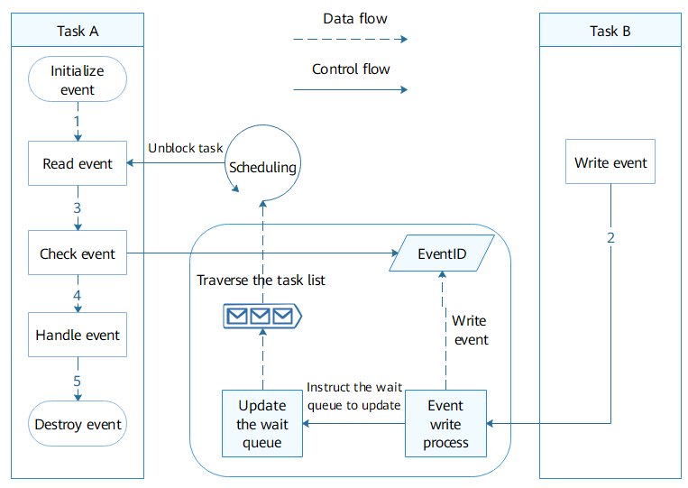

# Basic Concepts<a name="EN-US_TOPIC_0000001123763599"></a>

-   [Working Principles](#section1735611583011)
    -   [Event Control Block](#section1161415384467)
    -   [Working Principles](#section187761153144617)


An event is a mechanism for communication between tasks. It can be used to synchronize tasks. The events have the following features:

-   Events can be synchronized in one-to-many or many-to-many mode. In one-to-many mode, a task can wait for multiple events. In many-to-many mode, multiple tasks can wait for multiple events. However, a write event wakes up only one task from the block.
-   Event read timeout mechanism is used.
-   Events are used only for task synchronization, but not for data transmission.

APIs are provided to initialize, read/write, clear, and destroy events.

## Working Principles<a name="section1735611583011"></a>

### Event Control Block<a name="section1161415384467"></a>

```
/**
* Event control block data structure
  */
typedef struct tagEvent {
    UINT32 uwEventID;        /* Event set, which is a collection of events processed (written and cleared).*/
    LOS_DL_LIST stEventList; /* List of tasks waiting for specific events*/
} EVENT_CB_S, *PEVENT_CB_S;
```

### Working Principles<a name="section187761153144617"></a>

**Initializing an event**: An event control block is created to maintain a collection of processed events and a linked list of tasks waiting for specific events.

**Writing an event**: When a specified event is written to the event control block, the event control block updates the event set, traverses the task linked list, and determines whether to wake up related task based on the task conditions.

**Reading an event**: If the read event already exists, it is returned synchronously. In other cases, the return time is determined based on the timeout period and event triggering status. If the wait event condition is met before the timeout period expires, the blocked task will be directly woken up. Otherwise, the blocked task will be woken up only after the timeout period has expired.

The input parameters  **eventMask**  and  **mode**  determine whether the condition for reading an event is met.  **eventMask**  indicates the mask of the event.  **mode**  indicates the handling mode, which can be any of the following:

-   **LOS\_WAITMODE\_AND**: Event reading is successful only when all the events corresponding to  **eventMask**  occur. Otherwise, the task will be blocked, or an error code will be returned.
-   **LOS\_WAITMODE\_OR**: Event reading is successful when any of the events corresponding to  **eventMask**  occur. Otherwise, the task will be blocked, or an error code will be returned.
-   **LOS\_WAITMODE\_CLR**: This mode must be used with  **LOS\_WAITMODE\_AND**  or  **LOS\_WAITMODE\_OR**  \(LOS\_WAITMODE\_AND | LOS\_WAITMODE\_CLR or LOS\_WAITMODE\_OR | LOS\_WAITMODE\_CLR\). In this mode, if  **LOS\_WAITMODE\_AND**  or  **LOS\_WAITMODE\_OR**  is successful, the corresponding event type bit in the event control block will be automatically cleared.

**Clearing event**: Clear the event set of the event control block based on the specified mask. If the mask is  **0**, the event set will be cleared. If the mask is  **0xffff**, no event will be cleared, and the event set remains unchanged.

**Destroying an event**: Destroy the specified event control block.

**Figure  1**  Event working mechanism<a name="fig17799175324612"></a>  


