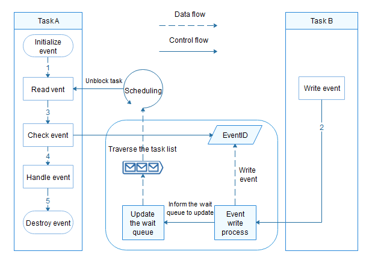

# Event


## Basic Concepts

An event is a communication mechanism used to synchronize tasks. Events have the following features:

- Events can be synchronized in one-to-many or many-to-many mode. In one-to-many mode, a task can wait for multiple events. In many-to-many mode, multiple tasks can wait for multiple events. However, a write event wakes up only one task from the block.

- Event read timeout mechanism is used.

- Events are used for task synchronization, but not for data transmission.

APIs are provided to initialize, read/write, clear, and destroy events.


## Working Principles

### Event Control Block

The event control block is a structure in the event initialization function. It passes in event identifies for operations such as event read and write. The data structure of the event control block is as follows:


```
typedef struct tagEvent {
    UINT32 uwEventID;        /* Event set, which is a collection of events processed (written and cleared). */
    LOS_DL_LIST stEventList; /* List of tasks waiting for specific events. */
} EVENT_CB_S, *PEVENT_CB_S;
```


### Working Principles

**Initializing an Event** 

An event control block is created to maintain a set of processed events and a linked list of tasks waiting for specific events.

**Writing an Event** 

When an event is written to the event control block, the event control block updates the event set, traverses the task linked list, and determines whether to wake up related tasks based on the task conditions.

**Reading an Event** 

If the event to read already exists, it is returned synchronously. In other cases, the event is returned based on the timeout period and event triggering conditions. If the wait condition is met before the timeout period expires, the blocked task will be directly woken up. Otherwise, the blocked task will be woken up only after the timeout period has expired.

The parameters **eventMask** and **mode** determine whether the condition for reading an event is met. **eventMask** specifies the event mask. **mode** specifies the handling mode, which can be any of the following:

- **LOS_WAITMODE_AND**: Read the event only when all the events corresponding to **eventMask** occur. Otherwise, the task will be blocked, or an error code will be returned.

- **LOS_WAITMODE_OR**: Read the event only when any of the events corresponding to **eventMask** occur. Otherwise, the task will be blocked, or an error code will be returned.

- **LOS_WAITMODE_CLR**: This mode must be used with one or all of the event modes (LOS_WAITMODE_AND | LOS_WAITMODE_CLR or LOS_WAITMODE_OR | LOS_WAITMODE_CLR). In this mode, if all event modes or any event mode is successful, the corresponding event type bit in the event control block will be automatically cleared.

**Clearing Events**

The events in the event set of the event control block can be cleared based on the specified mask. The mask **0** means to clear the event set; the mask **0xffff** means the opposite.

**Destroying Events** 

The event control block can be destroyed to release resources.

**Figure 1** Event working mechanism for a mini system




## Available APIs

| Category| API| Description|
| -------- | -------- | -------- |
| Checking an event | LOS_EventPoll | Checks whether the expected event occurs based on **eventID**, **eventMask**, and **mode**.<br>**NOTE**<br>If **mode** contains **LOS_WAITMODE_CLR** and the expected event occurs, the event that meets the requirements in **eventID** will be cleared. In this case, **eventID** is an input parameter and an output parameter. In other cases, **eventID** is used only as an input parameter. |
| Initializing an event control block | LOS_EventInit | Initializes an event control block.|
| Reading an event | LOS_EventRead | Reads an event (wait event). The task will be blocked to wait based on the timeout period (in ticks).<br>If no event is read, **0** is returned.<br>If an event is successfully read, a positive value (event set) is returned.<br>In other cases, an error code is returned.|
| Writing an event | LOS_EventWrite | Writes an event to the event control block.|
| Clearing events | LOS_EventClear | Clears events in the event control block based on the event mask. |
| Destroying events | LOS_EventDestroy | Destroys an event control block.|


## How to Develop

The typical event development process is as follows:

1. Initialize an event control block.

2. Block a read event.

3. Write events.

4. Wake up the blocked task, read the event, and check whether the event meets conditions.

5. Handle the event control block.

6. Destroy an event control block.


> **NOTE**
> - For event read and write operations, the 25th bit (`0x02U << 24`) of the event is reserved and cannot be set.
> 
> - Repeated writes of the same event are treated as one write.


## Development Example


### Example Description

In the **ExampleEvent** task, create an **EventReadTask** task with a timout period of 100 ticks. When the **EventReadTask** task is blocked, **ExampleEvent** task writes an event. You can understand the task switching during event operations based on the sequence in which logs are recorded.

1. In the **ExampleEvent** task, create an **EventReadTask** task with a timeout period of 100 ticks. The **EventReadTask** task has a higher priority than the **ExampleEvent** task.

2. **EventReadTask** is scheduled to read event **0x00000001**, but suspended to wait 100 ticks. The **ExampleEvent** task is scheduled to write event **0x00000001**.

3. When **ExampleEvent** is scheduled to write event **0x00000001**, the wait time of **EventReadTask** expires and **EventReadTask** task is scheduled to run.

4. The **EventReadTask** task is executed.

5. The **ExampleEvent** task is executed.


### Sample Code

The sample code is as follows:

The sample code can be compiled and verified in **./kernel/liteos_m/testsuites/src/osTest.c**. The **ExampleEvent()** function is called in **TestTaskEntry**.


```
#include "los_event.h"
#include "los_task.h"

/* Event control struct */ 
EVENT_CB_S g_exampleEvent;

/* Type of the wait event */
#define EVENT_WAIT 0x00000001

/* Wait timeout time */
#define EVENT_TIMEOUT 100

/* Example task entry function */
VOID EventReadTask(VOID)
{
    UINT32 ret;
    UINT32 event;

    /* Set a timeout period for event reading to 100 ticks. If the specified event is not read within 100 ticks, the read operation times out and the task is woken up. */
    printf("Example_Event wait event 0x%x \n", EVENT_WAIT);

    event = LOS_EventRead(&g_exampleEvent, EVENT_WAIT, LOS_WAITMODE_AND, EVENT_TIMEOUT);
    if (event == EVENT_WAIT) {
        printf("Example_Event, read event :0x%x\n", event);
    } else {
        printf("Example_Event, read event timeout\n");
    }
}

UINT32 ExampleEvent(VOID)
{
    UINT32 ret;
    UINT32 taskId;
    TSK_INIT_PARAM_S taskParam = { 0 };

    /* Initialize the event control block. */
    ret = LOS_EventInit(&g_exampleEvent);
    if (ret != LOS_OK) {
        printf("init event failed .\n");
        return LOS_NOK;
    }

    /* Create a task. */
    taskParam.pfnTaskEntry = (TSK_ENTRY_FUNC)EventReadTask;
    taskParam.pcName       = "EventReadTask";
    taskParam.uwStackSize  = LOSCFG_BASE_CORE_TSK_DEFAULT_STACK_SIZE;
    taskParam.usTaskPrio   = 3;
    ret = LOS_TaskCreate(&taskId, &taskParam);
    if (ret != LOS_OK) {
        printf("task create failed.\n");
        return LOS_NOK;
    }

    /* Write an event. */
    printf("Example_TaskEntry write event.\n");

    ret = LOS_EventWrite(&g_exampleEvent, EVENT_WAIT);
    if (ret != LOS_OK) {
        printf("event write failed.\n");
        return LOS_NOK;
    }

    /* Clear the flag. */
    printf("EventMask:%d\n", g_exampleEvent.uwEventID);
    LOS_EventClear(&g_exampleEvent, ~g_exampleEvent.uwEventID);
    printf("EventMask:%d\n", g_exampleEvent.uwEventID);

    /* Delete the event. */
    ret = LOS_EventDestroy(&g_exampleEvent);
    if (ret != LOS_OK) {
        printf("destory event failed .\n");
        return LOS_NOK;
    }

    return LOS_OK;
}
```


### Verification

The development is successful if the return result is as follows:


```
Example_Event wait event 0x1
Example_TaskEntry write event.
Example_Event, read event :0x1
EventMask:1
EventMask:0
```
