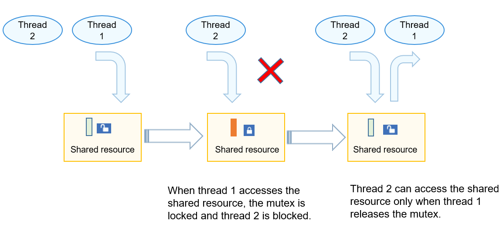

# Mutex


## Basic Concepts

A mutual exclusion (mutex) is a special binary semaphore used for exclusive access to shared resources.

A mutex can be unlocked or locked. When a task holds a mutex, the mutex is locked and the task obtains the ownership of the mutex. When the task releases the mutex, the mutex is unlocked and the task loses the ownership of the mutex. When a task holds a mutex, other tasks cannot unlock or hold the mutex.

In an environment where multiple tasks compete for shared resources, the mutex can protect the shared resources via exclusive access. In addition, the mutex can prevent semaphore priority inversion, which occurs when a low-priority task holds a semaphore but a high-priority task has to wait until the low-priority task releases it.


## Working Principles

In a multi-task environment, multiple tasks may access the same shared resources. However, certain shared resources are not shared, and can only be accessed exclusively by tasks. A mutex can be used to address this issue.

When non-shared resources are accessed by a task, the mutex is locked. Other tasks will be blocked until the mutex is released by the task. The mutex allows only one task to access the shared resources at a time, ensuring integrity of operations on the shared resources.

**Figure 1** Mutex working mechanism for a mini system



## Available APIs

  **Table 1** APIs of the mutex module

| Category| Description|
| -------- | -------- |
| Creating or deleting a mutex| **LOS_MuxCreate**: creates a mutex.<br>**LOS_MuxDelete**: eeletes a mutex.|
| Requesting or releasing a mutex| **LOS_MuxPend**: requests a mutex.<br>**LOS_MuxPost**: releases a mutex.|


## How to Develop

The typical mutex development process is as follows: 

1. Call **LOS_MuxCreate** to create a mutex.

2. Call **LOS_MuxPend** to request a mutex.
   The following modes are available:

   - Non-block mode: A task acquires the mutex if the requested mutex is not held by any task or the task holding the mutex is the same as the task requesting the mutex.
   - Permanent block mode: A task acquires the mutex if the requested mutex is not occupied. If the mutex is occupied, the task will be blocked and the task with a highest priority in the ready queue will be executed. The blocked task can be unlocked and executed only when a mutex is acquired.
   - Scheduled block mode: A task acquires the mutex if the requested mutex is not occupied. If the mutex is occupied, the task will be blocked and the task with the highest priority in the ready queue will be executed. The blocked task can be executed only when the mutex is released within the specified timeout period or when the specified timeout period expires.

3. Call **LOS_MuxPost** to release a mutex.
   - If tasks are blocked by the specified mutex, the task with a higher priority will be unblocked when the mutex is released. The unblocked task changes to the Ready state and is scheduled.
   - If no task is blocked by the specified mutex, the mutex is released successfully.

4. Call **LOS_MuxDelete** to delete a mutex.

> **NOTE**
> - Nested mutexes are supported. That is, if a task that attempts to apply for a mutex and the task that already holds the mutex are the same task, the application is considered successful, and the lock is released based on the number of application times.
> 
> - Mutexes cannot be used in an interrupt handler.
> 
> - The LiteOS-M kernel must ensure real-time task scheduling and avoid long-time task blocking. Therefore, a mutex must be released as soon as possible after use.
> 
> - When a mutex is held by a task, the task priority cannot be changed by using APIs such as **LOS_TaskPriSet**.


## Development Example


### Example Description

This example implements the following:

1. Create a mutex for the **ExampleMutex** task. Lock task scheduling, and create two tasks **ExampleMutexTask1** and **ExampleMutexTask2**. Enable **ExampleMutexTask2** to permanently wait until a mutex is acquired, and enter sleep for 10 ticks after successfully acquiring a mutest. Enable **ExampleMutexTask1** to apply for a mutex with a timeout period of 10 ticks and then wait permanently until obtaining a mutex. **ExampleMutexTask2** has a higher priority than **ExampleMutexTask1**. Then, unlock task scheduling.

2. **ExampleMutexTask2** (which has a higher priority) is scheduled and applies for a mutex. After acquiring the mutex, **ExampleMutexTask2** starts to sleep for 100 ticks. **ExampleMutexTask2** is suspended, and **ExampleMutexTask1** is woken up.

3. **ExampleMutexTask1** applies for the mutex with a timeout period of 10 ticks. Because the mutex is still held by **ExampleMutexTask2**, **ExampleMutexTask1** is suspended. After 10 ticks, **ExampleMutexTask1** is woken up and starts to wait permanently for a mutex. **ExampleMutexTask1** is suspended because the mutex is still held by **ExampleMutexTask2**.

4. After 100 ticks, **ExampleMutexTask2** is woken up and releases the mutex, and **ExampleMutexTask1** is woken up. **ExampleMutexTask1** acquires the mutex and is executed. After the task is complte, **ExampleMutexTask1** releases the mutex. At last, the mutex is deleted.


### Sample Code

The sample code is as follows:

The sample code is compiled and verified in **./kernel/liteos_m/testsuites/src/osTest.c**. Call **ExampleMutex** in **TestTaskEntry**.


```
#include "los_mux.h"

/* Mutex handle. */
UINT32 g_testMux;

VOID ExampleMutexTask1(VOID)
{
    UINT32 ret;

    printf("task1 try to get  mutex, wait 10 ticks.\n");
    /* Request a mutex. */
    ret = LOS_MuxPend(g_testMux, 10);
    if (ret == LOS_OK) {
        printf("task1 get mutex g_testMux.\n");
        /* Release the mutex. This branch is reserved for exceptions. */
        LOS_MuxPost(g_testMux);
        LOS_MuxDelete(g_testMux);
        return;
    }
    
    if (ret == LOS_ERRNO_MUX_TIMEOUT ) {
        printf("task1 timeout and try to get mutex, wait forever.\n");
        /* Request a mutex. */
        ret = LOS_MuxPend(g_testMux, LOS_WAIT_FOREVER);
        if (ret == LOS_OK) {
            printf("task1 wait forever, get mutex g_testMux.\n");
            /* Release the mutex. */
            LOS_MuxPost(g_testMux);
            /* Delete the mutex. */
            LOS_MuxDelete(g_testMux);
            printf("task1 post and delete mutex g_testMux.\n");
            return;
        }
    }
    
    return;
}

VOID ExampleMutexTask2(VOID)
{
    printf("task2 try to get  mutex, wait forever.\n");
    /* Request a mutex. */
    (VOID)LOS_MuxPend(g_testMux, LOS_WAIT_FOREVER);
    printf("task2 get mutex g_testMux and suspend 100 ticks.\n");

    /* Enable the task to enter sleep mode for 100 ticks. */
    LOS_TaskDelay(100);

    printf("task2 resumed and post the g_testMux\n");
    /* Release the mutex. */
    LOS_MuxPost(g_testMux);
    return;
}

UINT32 ExampleMutex(VOID)
{
    UINT32 ret;
    TSK_INIT_PARAM_S task1 = { 0 };
    TSK_INIT_PARAM_S task2 = { 0 };
    UINT32 taskId01;
    UINT32 taskId02;

    /* Create a mutex. */
    LOS_MuxCreate(&g_testMux);

    /* Lock task scheduling. */
    LOS_TaskLock();

    /* Create task 1. */
    task1.pfnTaskEntry = (TSK_ENTRY_FUNC)ExampleMutexTask1;
    task1.pcName       = "MutexTsk1";
    task1.uwStackSize  = LOSCFG_BASE_CORE_TSK_DEFAULT_STACK_SIZE;
    task1.usTaskPrio   = 5;
    ret = LOS_TaskCreate(&taskId01, &task1);
    if (ret != LOS_OK) {
        printf("task1 create failed.\n");
        return LOS_NOK;
    }

    /* Create task 2. */
    task2.pfnTaskEntry = (TSK_ENTRY_FUNC)ExampleMutexTask2;
    task2.pcName       = "MutexTsk2";
    task2.uwStackSize  = LOSCFG_BASE_CORE_TSK_DEFAULT_STACK_SIZE;
    task2.usTaskPrio   = 4;
    ret = LOS_TaskCreate(&taskId02, &task2);
    if (ret != LOS_OK) {
        printf("task2 create failed.\n");
        return LOS_NOK;
    }

    /* Unlock task scheduling. */
    LOS_TaskUnlock();

    return LOS_OK;
}
```


### Verification

  The development is successful if the return result is as follows:

```
task2 try to get  mutex, wait forever.
task2 get mutex g_testMux and suspend 100 ticks.
task1 try to get  mutex, wait 10 ticks.
task1 timeout and try to get mutex, wait forever.
task2 resumed and post the g_testMux
task1 wait forever, get mutex g_testMux.
task1 post and delete mutex g_testMux.
```
