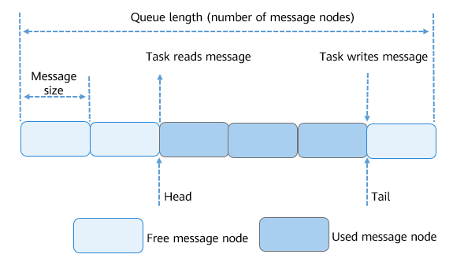

# Basic Concepts<a name="EN-US_TOPIC_0000001078876506"></a>

-   [Working Principles](#section1582619446311)
    -   [Queue Control Block](#section1648304614720)
    -   [Working Principles](#section15384012164811)


A queue, also called a message queue, is a data structure used for communication between tasks. The queue receives messages of unfixed length from tasks or interrupts, and determines whether to store the transferred messages in the queue based on different APIs.

Tasks can read messages from a queue. When the queue has no messages, the tasks are suspended. When the queue has a new message, the suspended tasks are woken up and process the new message. Tasks can also write messages to the queue. When the queue is full, the write task is suspended. When there is an available message node in the queue, the suspended write task is woken up and writes a message.

You can adjust the timeout period of the read queue and write queue to adjust the block mode of the read and write APIs. If the timeout period is set to  **0**  for the read queue and write queue, tasks will not be suspended and the API directly returns. This is the non-block mode. If the timeout period is greater than  **0**, block mode is used.

An asynchronous processing mechanism is provided to allows messages in a queue not to be processed immediately. In addition, queues can be used to buffer messages and implement asynchronous task communication. Queues have the following features:

-   Messages are queued in first-in-first-out \(FIFO\) mode and can be read and written asynchronously.
-   Both the read queue and write queue support the timeout mechanism.
-   Each time a message is read, the message node becomes available.
-   The types of messages to be sent are determined by the parties involved in communication. Messages of different lengths \(not exceeding the message node size of the queue\) are allowed.
-   A task can receive messages from and send messages to any message queue.
-   Multiple tasks can receive messages from and send messages to the same queue.
-   When a queue is created, the required dynamic memory space is automatically allocated in the queue API.

## Working Principles<a name="section1582619446311"></a>

### Queue Control Block<a name="section1648304614720"></a>

```
/**
 * Data structure of the queue control block
  */
typedef struct 
{
    UINT8       *queue;                          /* Pointer to the memory space of queue messages */
    UINT16      queueState;                      /* Queue status*/
    UINT16      queueLen;                        /* Number of message nodes in a queue, that is, the queue length */
    UINT16      queueSize;                       /* Size of a message node */
    UINT16      queueID;                         /*Queue ID */
    UINT16      queueHead;                       /* Position of the message head node (array subscript)*/
    UINT16      queueTail;                       /* Position of the message tail node (array subscript) */
    UINT16      readWriteableCnt[OS_READWRITE_LEN];/* The array element with subscript 0 indicates the number of readable messages in a queue.
                                                    The element with subscript 1 indicates the number of writable messages in a queue. */
    LOS_DL_LIST readWriteList[OS_READWRITE_LEN];    /* A linked list of tasks waiting to read or write messages.
                                                    Subscript 0: list of tasks waiting to read messages. Subscript 1: list of tasks waiting to write messages.*/
    LOS_DL_LIST memList;                         /* A linked list of memory blocks*/
} LosQueueCB;
```

Each queue control block contains information about the queue status.

-   **OS\_QUEUE\_UNUSED**: The queue is not in use.
-   **OS\_QUEUE\_INUSED**: The queue is in use.

### Working Principles<a name="section15384012164811"></a>

-   The queue ID is returned if a queue is created successfully.
-   The queue control block contains  **Head**  and  **Tail**, which indicate the storage status of messages in a queue.  **Head**  indicates the start position of occupied message nodes in the queue.  **Tail**  indicates the end position of the occupied message nodes and the start position of idle message nodes. When a queue is created,  **Head**  and  **Tail**  point to the start position of the queue.
-   When data is to be written to a queue,  **readWriteableCnt\[1\]**  is used to determine whether data can be written to the queue. If  **readWriteableCnt\[1\]**  is  **0**, the queue is full and data cannot be written to it. Data can be written to the head node or tail node of a queue. To write data to the tail node, locate the start idle message node based on  **Tail**  and write data to it. If  **Tail**  is pointing to the tail of the queue, the rewind mode is used. To write data to the head node, locate previous node based on  **Head**  and write data to it. If  **Head**  is pointing to the start position of the queue, the rewind mode is used.
-   When a queue is to be read,  **readWriteableCnt\[0\]**  is used to determine whether the queue has messages to read. Reading an idle queue \(**readWriteableCnt\[0\]**  is** 0**\) will cause task suspension. If the queue has messages to read, the system locates the first node to which data is written based on  **Head**  and read the message from the node. If  **Head**  is pointing to the tail of the queue, the rewind mode is used.
-   When a queue is to be deleted, the system locates the queue based on the queue ID, sets the queue status to  **OS\_QUEUE\_UNUSED**, sets the queue control block to the initial state, and releases the memory occupied by the queue.

Figure 1 Reading and writing data in a queue



The preceding figure illustrates how to write data to the tail node only. Writing data to the head node is similar.

