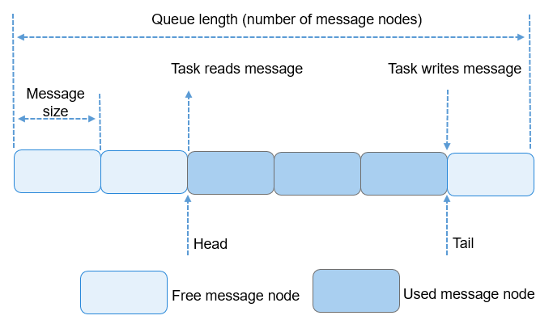

# Queue


## Basic Concepts

A message queue, also called a queue, is a mechanism for communication between tasks. The queue receives messages of unfixed length from tasks or interrupts, and determines whether to put the messages in the queue based on different APIs.

Tasks can read messages from a queue. When the queue has no messages, the read task is suspended. When the queue has a new message, the suspended task is woken up to process new messages. Tasks can also write messages to the queue. When the queue is full, the write task is suspended. When there is an available message node in the queue, the suspended write task is woken up and writes a message.

You can adjust the timeout period of the read queue and write queue to adjust the block mode of the read and write APIs. If the timeout period is set to **0** for the read queue and write queue, tasks will not be suspended and the API directly returns. This is the non-block mode. If the timeout period is greater than **0**, block mode is used.

An asynchronous processing mechanism is provided to allow messages in a queue not to be processed immediately. In addition, queues can be used to buffer messages and implement asynchronous task communication. Queues have the following features:

- Messages are queued in first-in-first-out (FIFO) mode and can be read and written asynchronously.
- Both the read queue and write queue support the timeout mechanism.
- Each time a message is read, the message node becomes available.
- The types of messages to be sent are determined by the parties involved in communication. Messages of different lengths (not exceeding the message node size of the queue) are allowed.
- A task can receive messages from and send messages to any message queue.
- Multiple tasks can receive messages from and send messages to the same queue.
- The system dynamically applies for memory space required for creating normal queues. 
- The space required for creating a static queue is passed in by the user. When the static queue is deleted, the space also needs to be released by the user.


## Working Principles

### Queue Control Block

During the initialization of a queue, a control block, containing the queue name and status, is allocated. The control block is released when the queue is deleted.

The data structure of the queue control block is as follows:


```
typedef struct 
{
    UINT8       *queue;                          		/* Pointer to the memory space of the queue */
    UINT8 		*queueName								/* Queue name */
    UINT16      queueState;                      		/* Queue status */
    UINT16      queueLen;                        		/* Number of message nodes in the queue, that is, the queue length */
    UINT16      queueSize;                       		/* Size of a message node */
    UINT16      queueID;                         		/* Queue ID */
    UINT16      queueHead;                       		 /* Position of the message head node (array subscript) */
    UINT16      queueTail;                       		/* Position of the message tail node (array subscript) */
    UINT16      readWriteableCnt[OS_READWRITE_LEN]; 	/* The element whose array subscript is 0 indicates the number of readable messages in the queue,                             
                                                    		The element whose array subscript is 1 indicates the number of writable messages in the queue */
    LOS_DL_LIST readWriteList[OS_READWRITE_LEN];    	/* A linked list of tasks waiting to read or write messages.
                                                       		Subscript 0: read the linked list. Subscript 1: write the linked list. */
    LOS_DL_LIST memList;                         		/* A linked list of memory blocks */
} LosQueueCB;
```

Each queue control block contains information about the queue status.

- **OS_QUEUE_UNUSED**: The queue is not in use.

- **OS_QUEUE_INUSED**: The queue is in use.


### Working Principles

- The queue ID is returned when a queue is created successfully.

- The queue control block contains **Head** and **Tail**, which indicate the storage status of messages in a queue. **Head** indicates the start position of occupied message nodes in the queue. **Tail** indicates the end position of the occupied message nodes and the start position of idle message nodes. When a queue is created, **Head** and **Tail** point to the start position of the queue.

- When data is to be written to a queue, **readWriteableCnt[1]** is used to determine whether data can be written to the queue. If **readWriteableCnt[1]** is **0**, the queue is full and data cannot be written to it. Data can be written to the head node or tail node of a queue. To write data to the tail node, locate the start idle message node based on **Tail** and write data to it. If **Tail** is pointing to the tail of the queue, the rewind mode is used. To write data to the head node, locate previous node based on **Head** and write data to it. If **Head** is pointing to the start position of the queue, the rewind mode is used.

- When a queue is to be read, **readWriteableCnt[0]** is used to determine whether the queue has messages to read. Reading an idle queue (**readWriteableCnt[0]** is** 0**) will cause task suspension. If the queue has messages to read, the system locates the first node to which data is written based on **Head** and read the message from the node. If **Head** is pointing to the tail of the queue, the rewind mode is used.

- When a queue is to be deleted, the system locates the queue based on the queue ID, sets the queue status to **OS_QUEUE_UNUSED**, sets the queue control block to the initial state, and releases the memory occupied by the queue.

  **Figure 1** Reading and writing data in a queue

  

The preceding figure illustrates how to write data to the tail node only. Writing data to the head node is similar.


## Available APIs

| Category| API Description |
| -------- | -------- |
| Creating or deleting a message queue| **LOS_QueueCreate**: creates a message queue. The system dynamically allocates the queue space.<br>**LOS_QueueCreateStatic**: creates a static message queue. You need to pass in the queue space.<br>**LOS_QueueDelete**: deletes a message queue. After a static message queue is deleted, you need to release the queue space.|
| Reading or writing data (address without the content) in a queue| **LOS_QueueRead**: reads data in the head node of the specified queue. The data in the queue node is an address.<br>**LOS_QueueWrite**: writes the **bufferAddr** (buffer address) to the tail node of the specified queue.<br>**LOS_QueueWriteHead**: writes the **bufferAddr** (buffer address) to the head node of the specified queue.|
| Reading or writing data (data and address) in a queue| **LOS_QueueReadCopy**: reads data from the head node of a specified queue.<br>**LOS_QueueWriteCopy**: writes the data saved in the **bufferAddr** to the tail node of the specified queue.<br>**LOS_QueueWriteHeadCopy**: writes the data saved in the **bufferAddr** to the head node of the specified queue.|
| Obtaining queue information| **LOS_QueueInfoGet**: obtains queue information, including the queue ID, queue length, message node size, head node, tail node, number of readable/writable nodes, and tasks waiting for read/write operations.|


## How to Develop

1. Call **LOS_QueueCreate** to create a queue. The queue ID is returned when the queue is created.

2. Call **LOS_QueueWrite** or **LOS_QueueWriteCopy** to write data to the queue.

3. Call **LOS_QueueRead** or **LOS_QueueReadCopy** to read data from the queue.

4. Call **LOS_QueueInfoGet** to obtain queue information.

5. Call **LOS_QueueDelete** to delete a queue.


> **NOTE**
> - The maximum number of queues supported by the system is the total number of queue resources of the system, not the number of queue resources available to users. For example, if the system software timer occupies one more queue resource, the number of queue resources available to users decreases by one.
> 
> - The input parameters queue name and flags passed when a queue is created are reserved for future use.
> 
> - The input parameter **timeOut** in the queue interface function is relative time.
> 
> - **LOS_QueueReadCopy**, **LOS_QueueWriteCopy**, and **LOS_QueueWriteHeadCopy** are a group of APIs that must be used together. **LOS_QueueRead**, **LOS_QueueWrite**, and **LOS_QueueWriteHead** are a group of APIs that must be used together.
> 
> - As **LOS_QueueWrite**, **LOS_QueueWriteHead**, and **LOS_QueueRead** are used to manage data addresses, you must ensure that the memory directed by the pointer obtained by calling **LOS_QueueRead** is not modified or released abnormally when the queue is being read. Otherwise, unpredictable results may occur.
> 
> - If the read length of **LOS_QueueReadCopy** is less than the actual message length, the message will be truncated.
> 
> - **LOS_QueueWrite**, **LOS_QueueWriteHead**, and **LOS_QueueRead** are called to manage data addresses, which means that the actual data read or written is pointer data. Therefore, before using these APIs, ensure that the message node size is the pointer length during queue creation, to avoid waste and read failures.


## Development Example


### Example Description

Create a queue and two tasks. Enable task 1 to write data to the queue, and task 2 to read data from the queue.

1. Call **LOS_TaskCreate** to create task 1 and task 2.

2. Call **LOS_QueueCreate** to create a message queue.

3. Task 1 sends a message in **SendEntry**.

4. Task 2 receives message in **RecvEntry**.

5. Call **LOS_QueueDelete** to delete the queue.


### Sample Code

The sample code is as follows:

The sample code can be compiled and verified in **./kernel/liteos_m/testsuites/src/osTest.c**. The **ExampleQueue** function is called in **TestTaskEntry**.


```
#include "los_task.h"
#include "los_queue.h"

STATIC UINT32 g_queue;
#define BUFFER_LEN 50

VOID SendEntry(VOID)
{
    UINT32 ret = 0;
    CHAR abuf[] = "test message";
    UINT32 len = sizeof(abuf);

    ret = LOS_QueueWriteCopy(g_queue, abuf, len, 0);
    if (ret != LOS_OK) {
        printf("send message failure, error: %x\n", ret);
    }
}

VOID RecvEntry(VOID)
{
    UINT32 ret = 0;
    CHAR readBuf[BUFFER_LEN] = {0};
    UINT32 readLen = BUFFER_LEN;

    /* Sleep for 1s */
    usleep(1000000);
    ret = LOS_QueueReadCopy(g_queue, readBuf, &readLen, 0);
    if (ret != LOS_OK) {
        printf("recv message failure, error: %x\n", ret);
    }

    printf("recv message: %s.\n", readBuf);

    ret = LOS_QueueDelete(g_queue);
    if (ret != LOS_OK) {
        printf("delete the queue failure, error: %x\n", ret);
    }

    printf("delete the queue success.\n");
}

UINT32 ExampleQueue(VOID)
{
    printf("start queue example.\n");
    UINT32 ret = 0;
    UINT32 task1;
    UINT32 task2;
    TSK_INIT_PARAM_S taskParam1 = { 0 };
    TSK_INIT_PARAM_S taskParam2 = { 0 };

    LOS_TaskLock();

    taskParam1.pfnTaskEntry = (TSK_ENTRY_FUNC)SendEntry;
    taskParam1.usTaskPrio = 9;
    taskParam1.uwStackSize = LOSCFG_BASE_CORE_TSK_DEFAULT_STACK_SIZE;
    taskParam1.pcName = "SendQueue";
    ret = LOS_TaskCreate(&task1, &taskParam1);
    if(ret != LOS_OK) {
        printf("create task1 failed, error: %x\n", ret);
        return ret;
    }

    taskParam2.pfnTaskEntry = (TSK_ENTRY_FUNC)RecvEntry;
    taskParam2.usTaskPrio = 10;
    taskParam2.uwStackSize = LOSCFG_BASE_CORE_TSK_DEFAULT_STACK_SIZE;
    taskParam2.pcName = "RecvQueue";
    ret = LOS_TaskCreate(&task2, &taskParam2);
    if(ret != LOS_OK) {
        printf("create task2 failed, error: %x\n", ret);
        return ret;
    }

    ret = LOS_QueueCreate("queue", 5, &g_queue, 0, 50);
    if(ret != LOS_OK) {
        printf("create queue failure, error: %x\n", ret);
    }

    printf("create the queue success.\n");
    LOS_TaskUnlock();
    return ret;
}
```


### Verification

The development is successful if the return result is as follows:


```
start queue example.
create the queue success.
recv message: test message.
delete the queue success.
```
