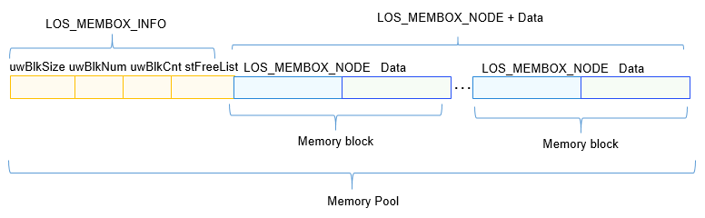
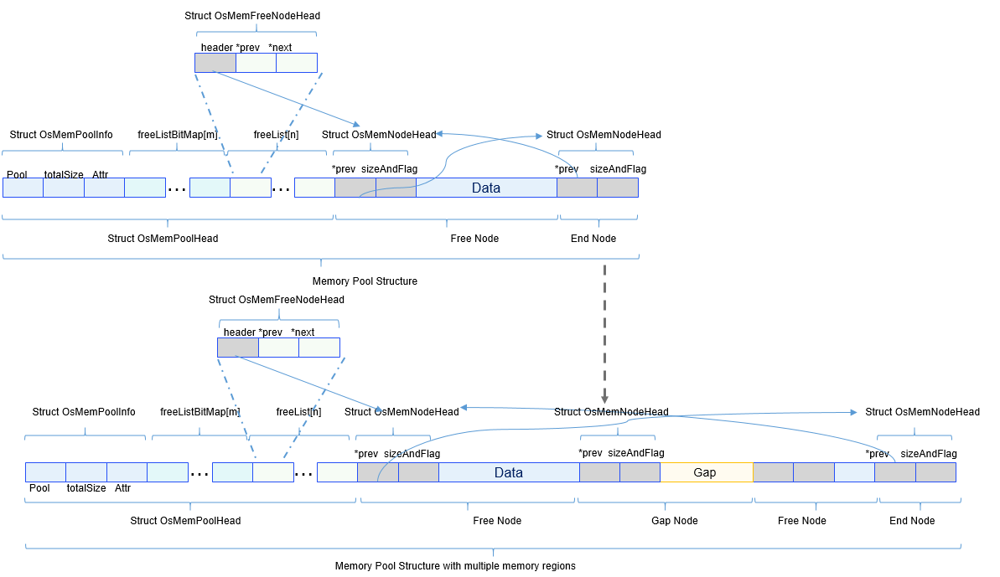

# Memory Management
## Basic Concepts


Memory management, one of the core modules of the OS, manages the memory resources of the system. Memory management primarily involves initializing, allocating, and releasing memory.


While the OS is running, the memory management module manages the memory usage of users and the OS by allocating and releasing memory. This helps achieve the optimal memory usage and usage efficiency and minimize memory fragments.


The OpenHarmony LiteOS-M kernel memory management involves static and dynamic memory management, and provides functions such as memory initialization, allocation, and release.


- Dynamic memory: memory blocks of user-specified size allocated in the dynamic memory pool.
  - Advantage: Resources are allocated on demand.
  - Disadvantage: Fragments may occur in the memory pool.

- Static memory: memory blocks of the fixed size (preset during initialization) allocated in the static memory pool.
  - Advantage: Memory is allocated and released efficiently, and there is no memory fragment in the memory pool.
  - Disadvantage: Only the memory blocks of the fixed size can be allocated. Memory cannot be allocated on demand.
## Static Memory


### Working Principles

The static memory is a static array. The block size in the static memory pool is set during initialization and cannot be changed after initialization.

The static memory pool consists of a control block **LOS_MEMBOX_INFO** and several memory blocks **LOS_MEMBOX_NODE** of the same size. The control block is located at the head of the memory pool and used for memory block management. It contains the memory block size (**uwBlkSize**), number of memory blocks (**uwBlkNum**), number of allocated memory blocks (**uwBlkCnt**), and free list (**stFreeList**).  Memory is allocated and released by block. Each memory block contains the pointer **pstNext** that points to the next memory block.

**Figure 1** Static memory




### Development Guidelines


#### When to Use

Use static memory allocation to obtain memory blocks of the fixed size. When the memory is no longer required, release the static memory.


#### Available APIs

The following table describes APIs available for OpenHarmony LiteOS-M static memory management. For more details about the APIs, see the API reference.

**Table 1** APIs of the static memory module

| Category| API|
| -------- | -------- |
| Initializing the static memory pool| **LOS_MemboxInit**: initializes a static memory pool, that is, sets the start address, total size, and size of each memory block based on input parameters.|
| Clearing static memory blocks| **LOS_MemboxClr**: clears the memory blocks allocated from the static memory pool.|
| Allocating or releasing static memory| **LOS_MemboxAlloc**: allocates a memory block from a specified static memory pool.<br>**LOS_MemboxFree**: releases a memory block allocated from the static memory pool.|
| Obtaining or printing static memory pool information| **LOS_MemboxStatisticsGet**: obtains information about a specified static memory pool, including the total number of memory blocks in the memory pool, number of allocated memory blocks, and size of each memory block.<br>**LOS_ShowBox**: prints information about all nodes in a specified static memory pool (the print level is **LOS_INFO_LEVEL**). The information includes the start address of the memory pool, memory block size, total number of memory blocks, start address of each idle memory block, and start addresses of all memory blocks.|

>  **NOTE**<br>
> The number of memory blocks in the memory pool after initialization is not equal to the total memory size divided by the memory block size. The reason is the control block of the memory pool and the control header of each memory block have memory overheads. When setting the total memory size, you need to consider these factors.


#### How to Develop

The typical development process of static memory is as follows:

1. Plan a memory area as a static memory pool.

2. Call **LOS_MemboxInit** to initialize the static memory pool.
   During initialization, the memory space specified by the input parameter is divided into multiple blocks (the number of blocks depends on the total static memory size and the block size). Insert all memory blocks to the free list, and place the control header at the beginning of the memory.

3. Call **LOS_MemboxAlloc** to allocate the static memory.
   The system obtains the first free block from the free list and returns the start address of the memory block.

4. Call **LOS_MemboxClr**.
   Clear the memory block corresponding to the address contained in the input parameter.

5. Call **LOS_MemboxFree**.
   Add the memory block to the free list.


#### Development Example

This example implements the following:

1. Initialize a static memory pool.

2. Allocate a memory block from the static memory pool.

3. Store a piece of data in a memory block.

4. Print the data in the memory block.

5. Clear the data in the memory block.

6. Release the memory block.
   The sample code is as follows:
   
   The sample code is compiled and verified in **./kernel/liteos_m/testsuites/src/osTest.c**. Call **ExampleStaticMem** in **TestTaskEntry**.


```
#include "los_membox.h"

#define MEMBOX_POOL_SIZE    100
#define MEMBOX_BLOCK_SZIE   10
#define MEMBOX_WR_TEST_NUM  828
VOID ExampleStaticMem(VOID)
{
    UINT32 *mem = NULL;
    UINT32 blkSize = MEMBOX_BLOCK_SZIE;
    UINT32 poolSize = MEMBOX_POOL_SIZE;
    UINT32 boxMem[MEMBOX_POOL_SIZE];
    UINT32 ret;

    /* Initialize the memory pool. */
    ret = LOS_MemboxInit(&boxMem[0], poolSize, blkSize);
    if(ret != LOS_OK) {
        printf("Membox init failed!\n");
        return;
    } else {
        printf("Membox init success!\n");
    }

    /* Request a memory block. */
    mem = (UINT32 *)LOS_MemboxAlloc(boxMem);
    if (mem == NULL) {
        printf("Mem alloc failed!\n");
        return;
    }
    printf("Mem alloc success!\n");

    /*Verify the read and write operations on the memory address. */
    *mem = MEMBOX_WR_TEST_NUM;
    printf("*mem = %d\n", *mem);

    /* Clear the memory. */
    LOS_MemboxClr(boxMem, mem);
    printf("Mem clear success \n*mem = %d\n", *mem);

    / Release the memory. */
    ret = LOS_MemboxFree(boxMem, mem);
    if (LOS_OK == ret) {
        printf("Mem free success!\n");
    } else {
        printf("Mem free failed!\n");
    }

    return;
}

```


#### Verification

The output is as follows:


```
Membox init success!
Mem alloc success!
*mem = 828
Mem clear success   
*mem = 0
Mem free success!
```
## Dynamic Memory


### Working Principles

Dynamic memory management allows memory blocks of any size to be allocated from a large contiguous memory (memory pool or heap memory) configured in the system based on user demands when memory resources are sufficient. The memory block can be released for further use when not required. Compared with static memory management, dynamic memory management allows memory allocation on demand but causes fragmentation of memory.

The dynamic memory of the OpenHarmony LiteOS-M has optimized the memory space partitioning based on the Two-Level Segregate Fit (TLSF) algorithm to achieve higher performance and minimize fragmentation. The figure below shows the core algorithm of the dynamic memory.

**Figure 2** Dynamic memory algorithm for mini systems


Multiple free lists are used for management based on the size of the free memory block. The free memory blocks are divided into two parts: [4, 127] and [2<sup>7</sup>, 2<sup>31</sup>], as indicated by the size class in the above figure.

1. The memory in the range of [4, 127](lower part in the figure) is equally divided into 31 parts. The size of the memory block corresponding to each part is a multiple of 4 bytes. Each part corresponds to a free list and a bit that indicates whether the free list is empty. The value **1** indicates that the free list is not empty.  There are 31 bits corresponding to the 31 memory parts in the range of [4, 127].

2. The memory greater than 127 bytes is managed in power of two increments. The size of each range is [2^n, 2^(n+1) -1], where n is an integer in [7, 30]. This range is divided into 24 parts, each of which is further divided into 8 second-level (L2) ranges, as shown in Size Class and Size SubClass in the upper part of the figure. Each L2 range corresponds to a free list and a bit that indicates whether the free list is empty. There are a total of 192 (24 x 8) L2 ranges, corresponding to 192 free lists and 192 bits.

For example, insert 40-byte free memory to a free list. The 40-byte free memory corresponds to the 10th free list in the range of [40, 43], and the 10th bit indicates the use of the free list. The system inserts the 40-byte free memory to the 10th free list and determines whether to update the bitmap flag. When 40-byte memory is requested, the system obtains the free list corresponding to the memory block of the requested size based on the bitmap flag, and then obtains a free memory node from the free list. If the size of the allocated node is greater than the memory requested, the system splits the node and inserts the remaining node to the free list.  If 580-byte free memory needs to be inserted to a free list, the 580-byte free memory corresponds to the 47th (31 + 2 x 8) free list in L2 range [2^9, 2^9+2^6], and the 47th bit indicates the use of the free list. The system inserts the 580-byte free memory to the 47th free list and determines whether to update the bitmap flag. When 580-byte memory is requested, the system obtains the free list corresponding to the memory block of the requested size based on the bitmap flag, and then obtains a free memory node from the free list. If the size of the allocated node is greater than the memory requested, the system splits the node and inserts the remaining node to the free list. If the corresponding free list is empty, the system checks for a free list meeting the requirements in a larger memory range. In actual application, the system can locate the free list that meets the requirements at a time.

The figure below shows the memory management structure.

**Figure 3** Dynamic memory management structure for mini systems


- Memory pool header
  The memory pool header contains the memory pool information, bitmap flag array, and free list array. The memory pool information includes the start address of the memory pool, total size of the heap memory, and attributes of the memory pool.  The bitmap flag array consists of seven 32-bit unsigned integers. Each bit indicates whether the free list is inserted with free memory block nodes. The free list contains information about 223 free memory head nodes. The free memory head node information contains a memory node header and information about the previous and next nodes in the free list.

- Memory pool nodes
  There are three types of nodes: free node, used node, and end node. Each memory node maintains the size and use flag of the memory node and a pointer to the previous memory node in the memory pool. The free nodes and used nodes have a data area, but the end node has no data area.

The off-chip physical memory needs to be used because the on-chip RAMs of some chips cannot meet requirements. The OpenHarmony LiteOS-M kernel can logically combine multiple discontiguous memory regions so that users are unaware of the discontiguous memory regions in the underlying layer. The OpenHarmony LiteOS-M kernel memory module inserts discontiguous memory regions into a free list as free memory nodes and marks the discontiguous parts as virtual memory nodes that have been used. In this way, the discontinuous memory regions are logically combined as a unified memory pool.  The figure below shows how the discontiguous memory regions are logically integrated.

  **Figure 4** Integrating discontiguous memory regions



The discontiguous memory regions are integrated into a unified memory pool as follows:

1. Call **LOS_MemInit** to initialize the first memory region of multiple discontiguous memory regions.

2. Obtain the start address and length of the next memory region, and calculate the **gapSize** between the current memory region and its previous memory region. The **gapSize** is considered as a used virtual node.

3. Set the size of the end node of the previous memory region to the sum of **gapSize** and **OS_MEM_NODE_HEAD_SIZE**, that is, **sizeof(struct OsMemUsedNodeHead)**.

4. Divide the current memory region into a free memory node and an end node, insert the free memory node to the free list, and set the link relationship between the nodes.

5. Repeat 2 to 4 to integrate more discontiguous memory regions.


### Development Guidelines


#### When to Use

Dynamic memory management allocates and manages memory resources requested by users dynamically. It is a good choice when users need memory blocks of different sizes. You can call the dynamic memory allocation function of the OS to request a memory block of the specified size. You can call the dynamic memory release function to release the memory at any time.


#### Available APIs

The following table describes APIs available for OpenHarmony LiteOS-M dynamic memory management. For more details about the APIs, see the API reference.

**Table 2** APIs of the dynamic memory module

| Category| Description|
| -------- | -------- |
| Initializing or deleting a memory pool| **LOS_MemInit**: initializes a dynamic memory pool of the specified size.<br>**LOS_MemDeInit**: deletes a memory pool. It is valid only when **LOSCFG_MEM_MUL_POOL** is enabled.|
| Allocating or releasing dynamic memory| **LOS_MemAlloc**: allocates memory of the specified size from the dynamic memory pool.<br>**LOS_MemFree**: releases the memory allocated from the specified dynamic memory.<br>**LOS_MemRealloc**: re-allocates a memory block of the required size and copies data from the original block to the newly allocated bock. If the new memory block is successfully allocated, the original memory block will be released.|
| Obtaining memory pool information| **LOS_MemPoolSizeGet**: obtains the total size of the specified dynamic memory pool.<br>**LOS_MemTotalUsedGet**: obtains the total memory usage of the specified dynamic memory pool.<br>**LOS_MemInfoGet**: obtains the memory structure information of the specified memory pool, including the free memory, used memory, number of free memory blocks, number of used memory blocks, and maximum size of the free memory block.<br>**LOS_MemPoolList**: prints information about all initialized memory pools in the system, including the start address, size, total free memory, used memory, maximum size of the free memory block, number of free memory blocks, and number of used memory blocks of each memory pool. This parameter is valid only when **LOSCFG_MEM_MUL_POOL** is enabled.|
| Obtaining memory block information| **LOS_MemFreeNodeShow**: prints the size and number of free memory blocks in a memory pool.<br>**LOS_MemUsedNodeShow**: prints the size and number of used memory blocks in a memory pool.|
| Checking memory pool integrity| **LOS_MemIntegrityCheck**: checks the integrity of a memory pool. This parameter is valid only when **LOSCFG_BASE_MEM_NODE_INTEGRITY_CHECK** is enabled.|
| Adding discontiguous memory regions| **LOS_MemRegionsAdd**: logically integrates multiple discontiguous memory regions into a unified memory pool. This parameter is valid only when **LOSCFG_MEM_MUL_REGIONS** is enabled. If the memory pool pointer **pool** is empty, initialize the first of the multiple memory regions in the memory pool and insert other memory regions as free nodes. If **pool** is not empty, insert the multiple memory regions into the specified memory pool as free nodes.|

>  **NOTE**<br>
> - The dynamic memory module manages memory through control block structures, which consume extra memory. Therefore, the actual memory space available to users is less than the value of **OS_SYS_MEM_SIZE**.
> 
> - The **LOS_MemAllocAlign** and **LOS_MemMallocAlign** APIs consume extra memory for memory alignment, which may cause memory loss. When the memory used for alignment is freed up, the lost memory will be reclaimed.
> 
> - The discontiguous memory regions passed by the **LosMemRegion** array to the **LOS_MemRegionsAdd** API must be sorted in ascending order by memory start address in memory regions, and the memory regions cannot overlap.


#### How to Develop

The typical development process of dynamic memory is as follows:

1. Call **LOS_MemInit** to initialize a memory pool.
   After a memory pool is initialized, a memory pool control header and end node will be generated, and the remaining memory is marked as free nodes. The end node is the last node in the memory pool, and its size is **0**.

1. Call **LOS_MemAlloc** to allocate dynamic memory of any size.
   The system checks whether the dynamic memory pool has free memory blocks greater than the requested size. If yes, the system allocates a memory block and returns the pointer to the memory block. If no, the system returns NULL. If the memory block allocated is greater than the requested size, the system splits the memory block and inserts the remaining memory block to the free list.

1. Call **LOS_MemFree** to release dynamic memory.
   The released memory block can be reused. When **LOS_MemFree** is called, the memory block will be reclaimed and marked as free nodes. When memory blocks are reclaimed, adjacent free nodes are automatically merged.


#### Development Example

This example implements the following:

1. Initialize a dynamic memory pool.

2. Allocate a memory block from the dynamic memory pool.

3. Store a piece of data in the memory block.

4. Print the data in the memory block.

5. Release the memory block.

The sample code is as follows:

The sample code is compiled and verified in **./kernel/liteos_m/testsuites/src/osTest.c**. Call **ExampleDynMem** in **TestTaskEntry**.


```
#include "los_memory.h"

#define TEST_POOL_SIZE (2*1024)
#define MEMBOX_WR_TEST_NUM  828

__attribute__((aligned(4))) UINT8 g_testDynPool[TEST_POOL_SIZE];

VOID ExampleDynMem(VOID)
{
    UINT32 *mem = NULL;
    UINT32 ret;

    /* Initialize the memory pool. */
    ret = LOS_MemInit(g_testDynPool, TEST_POOL_SIZE);
    if (LOS_OK  == ret) {
        printf("Mem init success!\n");
    } else {
        printf("Mem init failed!\n");
        return;
    }

    /* Request a memory block. */
    mem = (UINT32 *)LOS_MemAlloc(g_testDynPool, 4);
    if (mem == NULL) {
        printf("Mem alloc failed!\n");
        return;
    }
    printf("Mem alloc success!\n");

    /*Verify the read and write operations on the memory address. */
    *mem = MEMBOX_WR_TEST_NUM;
    printf("*mem = %d\n", *mem);

    / Release the memory. */
    ret = LOS_MemFree(g_testDynPool, mem);
    if (LOS_OK == ret) {
        printf("Mem free success!\n");
    } else {
        printf("Mem free failed!\n");
    }

    return;
}
```


#### Verification

The output is as follows:


```
Mem init success!
Mem alloc success!
*mem = 828
Mem free success!
```
