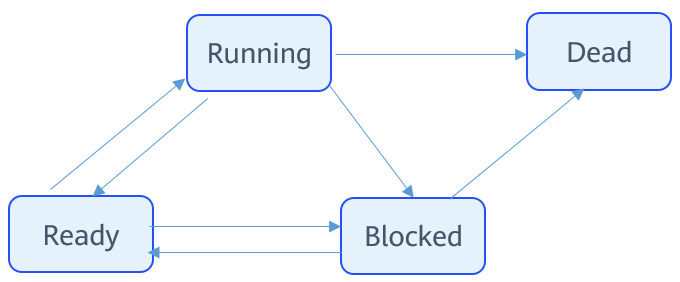

# Basic Concepts

-   [Task-related Concepts](#section673132352511)
-   [Task Running Mechanism](#section176294469251)

From the perspective of the operating system, tasks are the minimum running units that compete for system resources. They can use or wait for CPUs, use system resources such as memory, and run independently.

The task module of the OpenHarmony LiteOS-M provides multiple tasks and supports switching between tasks, helping users manage business process procedures. The task module has the following features:

-   Multiple tasks are supported.
-   A task represents a thread.
-   The preemptive scheduling mechanism is used for tasks. High-priority tasks can interrupt low-priority tasks. Low-priority tasks can be scheduled only after high-priority tasks are blocked or complete.
-   Time slice round-robin is used to schedule tasks with the same priority.
-   A total of 32 \(**0**  to  **31**\) priorities are defined.  **0**  is the highest priority, and  **31**  is the lowest.

## Task-related Concepts

**Task States**

A task has multiple states. After the system initialization is complete, the created tasks can compete for certain resources in the system according to the scheduling procedure regulated by the kernel.

A task can be in any of the following states:

-   Ready: The task is in the ready queue, waiting for execution by a CPU.
-   Running: The task is being executed.
-   Blocked: The task is not in the ready queue. The task may be suspended, delayed, waiting for a semaphore, waiting to read from or write into a queue, or reading from or writing into an event.
-   Dead: The task execution is complete and waiting for the system to reclaim resources.

**Task State Transition**

**Figure  1**  Task state transition  

The task transition process is as follows:

-   Ready → Running

    A task enters Ready state once created. When task switching occurs, the task with the highest priority in the Ready queue will be executed. The task being executed enters the Running state and is removed from the Ready queue.

-   Running → Blocked

    When a running task is blocked \(suspended, delayed, or reading semaphores\), it will be inserted into the corresponding blocking queue and changes from the Running state to the Blocked state. Then, task switching is triggered to run the task with the highest priority in the Ready queue.

-   Blocked → Ready \(Blocked → Running\)

    When a blocked task is recovered \(for example, the task is resumed, the delay period or semaphore read period times out, or the task successfully reads a semaphore\), the task will be added to the Ready queue and change from the Blocked state to the Ready state. If the priority of the recovered task is higher than that of the running task, task switching will be triggered to run the recovered task. Then, the task changes from the Ready state to the Running state.

-   Ready → Blocked

    When a task in the Ready state is blocked \(suspended\), the task changes to the Blocked state and is deleted from the Ready queue. The blocked task will not be scheduled until it is recovered.

-   Running → Ready

    When a task with a higher priority is created or recovered, tasks will be scheduled. The task with the highest priority in the Ready queue changes to the Running state. The originally running task changes to the Ready state and remains in the Ready queue.

-   Running → Dead

    When a running task is complete, it changes to the Dead state. The Dead state includes normal exit state as the task is complete and the Invalid state. For example, if a task is complete but is not automatically deleted, the task is in the Invalid state.

-   Blocked → Dead

    If an API is called to delete a blocked task, the task state change from Blocked to Dead.

**Task ID**

You will receive a task ID after successfully creating a task. The task IDs are unique in the operating system. You can suspend, restore, or query tasks by task ID.

**Task Priority**

Tasks are executed based on their priority. When task switching occurs, the task with the highest priority in the Ready queue will be executed.

**Task Entry Function**

Function to be executed when a task is scheduled. This function is implemented by users and set in the task creation structure when a task is created.

**Task Stack**

An independent memory space for each task. The stack stores information such as local variables, registers, function parameters, and function return addresses.

**Task Context**

Resources, such as registers, used during the running of a task. When a task is suspended, other running tasks might modify the register values of the suspended task. If the original task context is not saved when task switching occurs, an unknown error may occur when the task is recovered. The context information of switched-out tasks is saved into their own task stacks so that the context information can be resumed along with tasks and the system can start from the interrupted code after the tasks are resumed.

**Task Control Block**

Each task has a task control block \(TCB\). A TCB contains task information, such as context stack pointer, state, priority, ID, name, and stack size. The TCB reflects the running status of a task.

**Task Switching**

Task switching involves actions, such as obtaining the task with the highest priority in the Ready queue, saving the context of the switched-out task, and restoring the context of the switched-in task.

## Task Running Mechanism

When a task is created, the system initializes the task stack and presets the context. The system places the task entry function in the corresponding position so that the function will be executed when the task enters the Running state for the first time.

