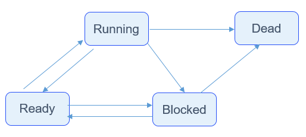

# Task Management


## Basic Concepts

From the perspective of the operating system, tasks are the minimum running units that compete for system resources. They can use or wait for CPUs, use system resources such as memory, and run independently.

The task module of the OpenHarmony LiteOS-M supports switching between tasks to help users manage business process procedures. The task module has the following features:

- Multiple tasks are supported.

- A task represents a thread.

- The preemptive scheduling mechanism is used for tasks. High-priority tasks can interrupt low-priority tasks. Low-priority tasks can be scheduled only after high-priority tasks are blocked or complete.

- Time slice round-robin is used to schedule tasks with the same priority.

- A total of 32 (**0** to **31**) priorities are defined. **0** is the highest priority, and **31** is the lowest.


### Task-related Concepts

**Task States**

A task has multiple states. After the system initialization is complete, the created tasks can compete for certain resources in the system according to the scheduling procedure regulated by the kernel.

A task can be in any of the following states:

- Ready: The task is in the ready queue, waiting for execution by a CPU.

- Running: The task is being executed.

- Blocked: The task is not in the ready queue. The task may be suspended, delayed, waiting for a semaphore, waiting to read from or write into a queue, or reading from or writing into an event.

- Dead: The task execution is complete and waiting for the system to reclaim resources.

**Task State Transitions**

**Figure 1** Task state transitions



A system may have multiple tasks at the same time. Therefore, tasks in the Ready state and Blocked state are added to the **Ready** queue and **Blocked** queue respectively. A queue is a collection of tasks in the same state. The sequence of adding tasks to a queue is irrelevant to the sequence of task status transition. There is only one task running at a time. Therefore, there is no queue for the running task.

The task state transition process is as follows:

- Ready → Running
  
  A task enters Ready state once created. When task switching occurs, the task with the highest priority in the Ready queue will be executed. The task being executed enters the Running state and is removed from the Ready queue.
- Running → Blocked
  
  When a running task is blocked (suspended, delayed, or reading semaphores), it will be inserted to the blocked task queue and changes from the Running state to the Blocked state. Then, task switching is triggered to run the task with the highest priority in the Ready queue.
- Blocked -> Ready (Prerequisites for Blocked -> Running)
  
  When a blocked task is recovered (for example, the task is resumed, the delay period or semaphore read period times out, or the task successfully reads a semaphore), the task will be added to the Ready queue and change from the Blocked state to the Ready state. If the priority of the recovered task is higher than that of the running task, task switching will be triggered to run the recovered task. Then, the task changes from the Ready state to the Running state.
- Ready → Blocked
  
  When a task in the Ready state is blocked (suspended), the task changes to the Blocked state and is removed from the Ready queue. The blocked task will not be scheduled until it is recovered.
- Running → Ready
  
  When a task with a higher priority is created or recovered, tasks will be scheduled. The task with the highest priority in the Ready queue changes to the Running state. The originally running task changes to the Ready state and remains in the Ready queue.
- Running → Dead
  
  When a running task is complete, it changes to the Dead state. The Dead state includes normal exit state as the task is complete and the Invalid state. For example, if a task is complete but is not automatically deleted, the task is in the Invalid state.
- Blocked → Dead
  
  If an API is called to delete a blocked task, the task state change from Blocked to Dead.

**Task ID**

A task ID is returned when a task is created. The task ID uniquely identifies a task in the system. You can suspend, restore, or query tasks by task ID.

**Task Priority**

Tasks are executed based on their priority. When task switching occurs, the task with the highest priority in the Ready queue will be executed.

**Task Entry Function**

Function to be executed when a task is scheduled. This function is implemented by users and set in the task creation structure when a task is created.

**Task Stack**

An independent memory space for each task. The stack stores information such as local variables, registers, function parameters, and function return addresses.

**Task Context**

Resources, such as registers, used during the running of a task. When a task is suspended, other running tasks might modify the register values of the suspended task. If the original task context is not saved when task switching occurs, an unknown error may occur when the task is recovered. The context information of switched-out tasks is saved into their own task stacks so that the context information can be resumed along with tasks and the system can start from the interrupted code after the tasks are resumed.

**TCB**

Each task has a task control block (TCB). A TCB contains task information, such as context stack pointer, state, priority, ID, name, and stack size. The TCB reflects the running status of a task.

**Task Switching**

Task switching involves actions, such as obtaining the task with the highest priority in the Ready queue, saving the context of the switched-out task, and restoring the context of the switched-in task.


### Task Running Mechanism

When a task is created, the system initializes the task stack and presets the context. The system places the task entry function in the corresponding position so that the function can be executed when the task enters the running state for the first time.


## Available APIs

The following table describes APIs available for the OpenHarmony LiteOS-M task module. For more details about the APIs, see the API reference.

**Table 1** APIs of the task management module

| Category| Description|
| -------- | -------- |
| Creating or deleting a task| **LOS_TaskCreateOnly**: creates a task and places the task in the Blocked state.<br>**LOS_TaskCreate**: creates a task and places the task in the Ready state. If there is no task with a higher priority in the Ready queue, the task will be executed.<br>**LOS_TaskDelete**: deletes a task.|
| Controlling task status| **LOS_TaskResume**: resumes a suspended task to place the task in the Ready state.<br>**LOS_TaskSuspend**: suspends the specified task and performs task switching.<br>**LOS_TaskJoin**: suspends this task till the specified task is complete and the task control block resources are reclaimed.<br>**LOS_TaskDelay**: makes a task wait for a period of time (in ticks) and releases CPU resources. When the delay timer expires, the task enters the Ready state again. The input parameter is the number of ticks.<br>**LOS_Msleep**: makes a task wait for a period of time and releases CPU resources. When the delay timer expires, the task enters the Ready state again. The input parameter is the number of milliseconds.<br>**LOS_TaskYield**: sets the time slice of the current task to **0** to release CPU resources and schedule the task with the highest priority in the Ready queue to run.|
| Controlling task scheduling| **LOS_TaskLock**: locks task scheduling. However, tasks can still be interrupted.<br>**LOS_TaskUnlock**: unlocks task scheduling.<br>**LOS_Schedule**: triggers task scheduling.|
| Controlling task priority| **LOS_CurTaskPriSet**: sets the priority for the current task.<br>**LOS_TaskPriSet**: sets the priority for a specified task.<br>**LOS_TaskPriGet**: obtains the priority of a specified task.|
| Obtaining Job information| **LOS_CurTaskIDGet**: obtains the ID of the current task.<br>**LOS_NextTaskIDGet**: obtains the ID of the task with the highest priority in the Ready queue.<br>**LOS_NewTaskIDGet**: equivalent to **LOS_NextTaskIDGet**.<br>**LOS_CurTaskNameGet**: obtains the name of the current task.<br>**LOS_TaskNameGet**: obtains the name of a task.<br>**LOS_TaskStatusGet**: obtains the state of a task.<br>**LOS_TaskInfoGet**: obtains information about a specified task, including the task state, priority, stack size, stack pointer (SP), task entry function, and used stack space.<br>**LOS_TaskIsRunning**: checks whether the task module has started scheduling.|
| Updating task information| **LOS_TaskSwitchInfoGet**: obtains the task switching information. The macro **LOSCFG_BASE_CORE_EXC_TSK_SWITCH** must be enabled.|

## How to Develop

The typical development process of the task module is as follows:

1. Use **LOS_TaskLock** to lock task scheduling and prevent high-priority tasks from being scheduled.

2. Use **LOS_TaskCreate** to create a task.

3. Use **LOS_TaskUnlock** to unlock task scheduling so that tasks can be scheduled by priority.

4. Use **LOS_TaskDelay** to delay a task.

5. Use **LOS_TaskSuspend** to suspend a task.

6. Use **LOS_TaskResume** to resume the suspended task.

> **NOTE**
> - Running idle tasks reclaims the TCBs and stacks in the to-be-recycled linked list.
> 
> - The task name is a pointer without memory space allocated. When setting the task name, do not assign the local variable address to the task name pointer.
> 
> - The task stack size is 8-byte aligned. Follow the "nothing more and nothing less" principle while determining the task stack size.
> 
> - A running task cannot be suspended if task scheduling is locked.
> 
> - Idle tasks and software timer tasks cannot be suspended or deleted.
> 
> - In an interrupt handler or when a task is locked, the operation of calling **LOS_TaskDelay** fails.
> 
> - Locking task scheduling does not disable interrupts. Tasks can still be interrupted while task scheduling is locked.
> 
> - Locking task scheduling must be used together with unlocking task scheduling.
> 
> - Task scheduling may occur while a task priority is being set.
> 
> - The maximum number of tasks that can be set for the operating system is the total number of tasks of the operating system, not the number of tasks available to users. For example, if the system software timer occupies one more task resource, the number of task resources available to users decreases by one.
> 
> - **LOS_CurTaskPriSet** and **LOS_TaskPriSet** cannot be used in interrupts or used to modify the priorities of software timer tasks.
> 
> - If the task corresponding to the task ID sent to **LOS_TaskPriGet** has not been created or the task ID exceeds the maximum number of tasks, **-1** will be returned.
> 
> - Resources such as a mutex or a semaphore allocated to a task must have been released before the task is deleted.


## Development Example

This example describes the priority-based task scheduling and use of task-related APIs, including creating, delaying, suspending, and resuming two tasks with different priorities, and locking/unlocking task scheduling. 

The sample code is compiled and verified in **./kernel/liteos_m/testsuites/src/osTest.c**. Call **ExampleTask** in **TestTaskEntry**.


```
#include "los_task.h"

UINT32 g_taskHiId;
UINT32 g_taskLoId;
#define TSK_PRIOR_HI 3 /* Priority of a high-priority task. */
#define TSK_PRIOR_LO 4 /* Priority of a low-priority task. */

UINT32 ExampleTaskHi(VOID)
{
    UINT32 ret;

    printf("Enter TaskHi Handler.\n");

    /* Delay the task for 100 ticks. The task is then suspended, and the remaining task with the highest priority (TaskLo) will be executed. */
    ret = LOS_TaskDelay(100);
    if (ret != LOS_OK) {
        printf("Delay TaskHi Failed.\n");
        return LOS_NOK;
    }

    /* After 100 ticks elapse, the task is resumed. */
    printf("TaskHi LOS_TaskDelay Done.\n");

    /* Suspend the task. */
    ret = LOS_TaskSuspend(g_taskHiId);
    if (ret != LOS_OK) {
        printf("Suspend TaskHi Failed.\n");
        return LOS_NOK;
    }
    printf("TaskHi LOS_TaskResume Success.\n");
    return ret;
}

/* Entry function of low-priority tasks */
UINT32 ExampleTaskLo(VOID)
{
    UINT32 ret;

    printf("Enter TaskLo Handler.\n");

    /* Delay the task for 100 ticks. The task is then suspended, and the remaining task with the highest priority will be executed. */
    ret = LOS_TaskDelay(100);
    if (ret != LOS_OK) {
        printf("Delay TaskLo Failed.\n");
        return LOS_NOK;
    }

    printf("TaskHi LOS_TaskSuspend Success.\n");

    /* Resume the suspended task g_taskHiId. */
    ret = LOS_TaskResume(g_taskHiId);
    if (ret != LOS_OK) {
        printf("Resume TaskHi Failed.\n");
        return LOS_NOK;
    }
    return ret;
}

/* Task entry function used to create two tasks with different priorities. */
UINT32 ExampleTask(VOID)
{
    UINT32 ret;
    TSK_INIT_PARAM_S taskParam1 = { 0 };
    TSK_INIT_PARAM_S taskParam2 = { 0 };

    /* Lock task scheduling to prevent newly created tasks from being scheduled prior to this task due to higher priority. */
    LOS_TaskLock();

    printf("LOS_TaskLock() Success!\n");

    taskParam1.pfnTaskEntry = (TSK_ENTRY_FUNC)ExampleTaskHi;
    taskParam1.usTaskPrio = TSK_PRIOR_HI;
    taskParam1.pcName = "TaskHi";
    taskParam1.uwStackSize = LOSCFG_BASE_CORE_TSK_DEFAULT_STACK_SIZE;
    taskParam1.uwResved = LOS_TASK_ATTR_JOINABLE; /* Detach attribute. */

    /* Create a task with higher priority. The task will not be executed immediately after being created, because task scheduling is locked. */
    ret = LOS_TaskCreate(&g_taskHiId, &taskParam1);
    if (ret != LOS_OK) {
        LOS_TaskUnlock();

        printf("Example_TaskHi create Failed!\n");
        return LOS_NOK;
    }

    printf("Example_TaskHi create Success!\n");

    taskParam2.pfnTaskEntry = (TSK_ENTRY_FUNC)ExampleTaskLo;
    taskParam2.usTaskPrio = TSK_PRIOR_LO;
    taskParam2.pcName = "TaskLo";
    taskParam2.uwStackSize = LOSCFG_BASE_CORE_TSK_DEFAULT_STACK_SIZE;

    /* Create a low-priority task. The task will not be executed immediately after being created, because task scheduling is locked. */
    ret = LOS_TaskCreate(&g_taskLoId, &taskParam2);
    if (ret != LOS_OK) {
        LOS_TaskUnlock();
        printf("Example_TaskLo create Failed!\n");
        return LOS_NOK;
    }

    printf("Example_TaskLo create Success!\n");

    /* Unlock task scheduling. The task with the highest priority in the Ready queue will be executed. */
    LOS_TaskUnlock();
    ret = LOS_TaskJoin(g_taskHiId, NULL);
    if (ret != LOS_OK) {
        printf("Join Example_TaskHi Failed!, 0x%x\n", ret);
    } else {
        printf("Join Example_TaskHi Success!\n");
    }
    return LOS_OK;
}
```

**Verification**

The development is successful if the return result is as follows:


```     
LOS_TaskLock() Success!
Example_TaskHi create Success!
Example_TaskLo create Success!
Enter TaskHi Handler.
Enter TaskLo Handler.
TaskHi LOS_TaskDelay Done.
TaskHi LOS_TaskSuspend Success.
TaskHi LOS_TaskResume Success.
Join Example_TaskHi Success!
```
