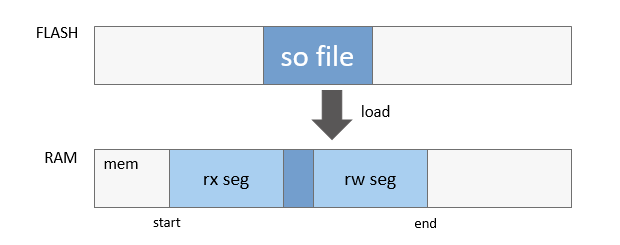

# Dynamic Loading


## Basic Concepts

In small devices with limited hardware resources, dynamic algorithm deployment capability is required to allow multiple algorithms to     be deployed at the same time. The LiteOS-M kernel uses the Executable and Linkable Format (ELF) loading because it is easy to use and compatible with a wide variety of platforms. 

The LiteOS-M provides APIs similar to **dlopen** and **dlsym**. Apps can load and unload required algorithm libraries by using the APIs provided by the dynamic loading module. As shown in the following figure, the app obtains the corresponding information output through the API required by the third-party algorithm library. The third-party algorithm library depends on the basic APIs provided by the kernel, such as **malloc**. After the app loads the API and relocates undefined symbols, it can call the API to complete the function. 

The dynamic loading component supports only the Arm architecture. In addition, the signature and source of the shared library to be loaded must be verified to ensure system security.

  **Figure 1** LiteOS-M kernel dynamic loading architecture

  


## Working Principles


### Exporting the Symbol Table

The kernel needs to proactively expose the API required by the dynamic library when the shared library calls a kernel API, as shown in the following figure. This mechanism compiles the symbol information to the specified section and calls the **SYM_EXPORT** macro to export information of the specified symbol. The symbol information is described in the structure **SymInfo**, which includes the symbol name and address information. The macro **SYM_EXPORT** imports the symbol information to the **.sym.*** section by using **__attribute__**.


```
typedef struct {
  CHAR    *name;
  UINTPTR addr;
} SymInfo;

#define SYM_EXPORT(func)                                            \
const SymInfo sym_##func __attribute__((section(".sym."#func))) = { \
    .name = #func,                                                  \
    .addr = (UINTPTR)func                                           \
};
```

  **Figure 2** Exported symbol table

  


### Loading an ELF File

The **LOAD** section to be loaded to the memory can be obtained based on the ELF file handle and the section offset of the program header table. Generally, there are two sections: read-only and read-write. You can run the **readelf -l** command to view the LOAD section information of the ELF file. The physical memory is requested according to the related alignment attributes. Then, a code section or a data segment is written into the memory based on the loading base address and an offset of each section.


```
$ readelf -l lib.so

Elf file type is DYN (Shared object file)
Entry point 0x5b4
There are 4 program headers, starting at offset 52

Program Headers:
  Type           Offset   VirtAddr   PhysAddr   FileSiz MemSiz  Flg Align
  EXIDX          0x000760 0x00000760 0x00000760 0x00008 0x00008 R   0x4
  LOAD           0x000000 0x00000000 0x00000000 0x0076c 0x0076c R E 0x10000LOAD           0x00076c 0x0001076c 0x0001076c 0x0010c 0x00128 RW  0x10000
  DYNAMIC        0x000774 0x00010774 0x00010774 0x000c8 0x000c8 RW  0x4

 Section to Segment mapping:
  Segment Sections...
   00     .ARM.exidx
   01     .hash .dynsym .dynstr .rel.dyn .rel.plt .init .plt .text .fini .ARM.exidx .eh_frame
   02     .init_array .fini_array .dynamic .got .data .bss
   03     .dynamic
```

  **Figure 3** Process of loading an ELF file<br>
  


### ELF File Linking

A relocation table is obtained by using a **.dynamic** section of the ELF file. Each entry that needs to be relocated in the table is traversed. Then, the symbol is searched, based on the symbol name that needs to be relocated, in the shared library and the exported symbol table provided by the kernel. The relocation information is updated based on the symbol found.

  **Figure 4** ELF file linking process

  


## ELF Specifications


### ELF Type

When compiling a shared library, you can add **-fPIC** (a compilation option) to compile location-independent code. The shared library file type is **ET_DYN**, which can be loaded to any valid address range.

Example: **arm-none-eabi-gcc -fPIC –shared –o lib.so lib.c**


### Options for Linking

- **-nostdlib**: Do not use the lib library in the compiler when linking.

- **-nostartfiles**: Do not use the startup files in the compiler when linking.

- **-fPIC**: compiles location-independent shared libraries.

- **-z max-page-size=4**: sets the number of alignment bytes of the loadable sections in the binary file to **4**. This setting saves memory and can be used for a dynamic library.

- **-mcpu=** specifies the CPU architecture.


## Constraints


- Applications cannot be loaded. Only shared libraries can be loaded.
- The shared library to be loaded cannot depend on the libc library or other shared libraries in the compiler. It can depend only on the external APIs provided by the kernel (provided by the exported symbol table).
- This feature depends on the cross compiler and file system.
