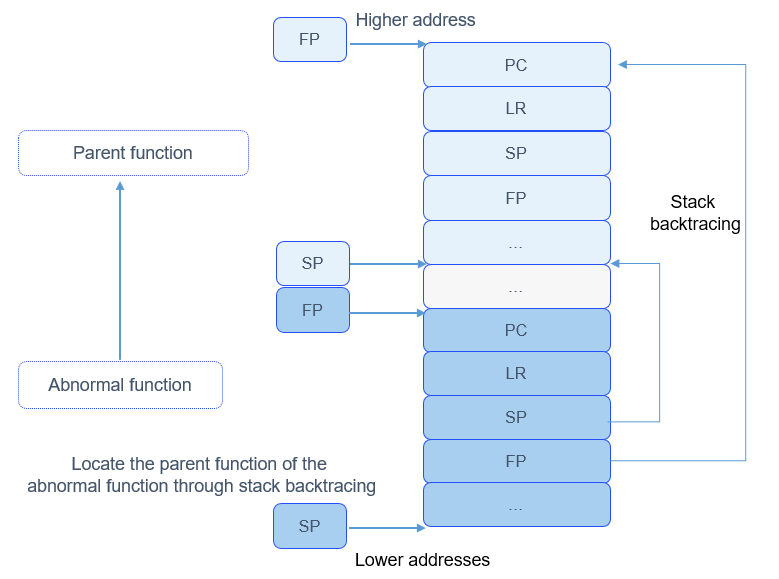

# Exception Debugging


## Basic Concepts

The OpenHarmony LiteOS-M provides exception handling and debugging measures to help locate and analyze problems. Exception handling involves a series of actions taken by the OS to respond to exceptions occurred during the OS running, for example, printing the exception type, system status, call stack information of the current function, CPU information, and call stack information of tasks.


## Working Principles

A stack frame contains information such as function parameters, variables, and return value in a function call process. When a function is called, a stack frame of the subfunction is created, and the input parameters, local variables, and registers of the function are stored into the stack. Stack frames grow towards lower addresses. The ARM32 CPU architecture is used as an example. Each stack frame stores the historical values of the program counter (PC), link register (LR), stack pointer (SP), and frame pointer (FP) registers. The LR points to the return address of a function, and the FP points to the start address of the stack frame of the function's parent function. The FP helps locate the parent function's stack frame, which further helps locate the parent function's FP. The parent function's FP helps locate the grandparent function's stack frame and FP... In this way, the call stack of the program can be traced to obtain the relationship between the functions called.

When an exception occurs in the system, the system prints the register information in the stack frame of the abnormal function as well as the LRs and FPs in the stack frames of its parent function and grandfather function. The relationships between the functions help you locate the cause of the exception.

The following figure illustrates the stack analysis mechanism for your reference. The actual stack information varies depending on the CPU architecture.

**Figure 1** Stack analysis mechanism



In the figure, the registers in different colors indicate different functions. The registers save related data when functions are called. The FP register helps track the stack to the parent function of the abnormal function and further presents the relationships between the functions called.


## Available APIs

The following table describes APIs available for the OpenHarmony LiteOS-M stack trace module. For more details about the APIs, see the API reference.

**Table 1** APIs of the stack trace module

| API| Description|
| -------- | -------- |
| LOS_BackTrace | Prints the call stack relationship at the calling point.|
| LOS_RecordLR  | Obtains the call stack relationship at the calling point when print is unavailable.|


## Development Guidelines


### How to Develop

The typical process for enabling exception debugging is as follows:

1. Configure the macros related to exception handling in the **target_config.h** file.

   | Configuration Item| Description| Value|
   | -------- | -------- | -------- |
   | LOSCFG_BACKTRACE_DEPTH | Depth of the function call stack. The default value is **15**.| 15 |
   | LOSCFG_BACKTRACE_TYPE | Type of the stack tracing.<br>**0**: The stack tracing is disabled.<br>**1**: supports call stack analysis of the Cortex-M series hardware.<br>**2**: supports call stack analysis of the RISC-V series hardware.| Set this parameter to **1** or **2** based on the toolchain type.|
   
2. Use the error code in the example to build and run a project, and check the error information displayed on the serial port terminal. The sample code simulates error code. During actual product development, use the exception debugging mechanism to locate exceptions.
   
   The following example demonstrates the exception output through a task. The task entry function simulates calling of multiple functions and finally calls a function that simulates an exception. The sample code is as follows:
   
   The sample code is built and verified in **./kernel/liteos_m/testsuites/src/osTest.c**. Call **ExampleExcEntry** in **TestTaskEntry**.
   
   ```
   #include <stdio.h>
   #include "los_config.h"
   #include "los_interrupt.h"
   #include "los_task.h"
   
   UINT32 g_taskExcId;
   #define TSK_PRIOR 4
   
   /* Simulate an exception. */
   UINT32 GetResultException0(UINT16 dividend){
       UINT32 result = *(UINT32 *)(0xffffffff);
       printf("Enter GetResultException0. %u\r\n", result);
       return result;
   }
   
   UINT32 GetResultException1(UINT16 dividend){
       printf("Enter GetResultException1.\r\n");
       return GetResultException0(dividend);
   }
   
   UINT32 GetResultException2(UINT16 dividend){
       printf("Enter GetResultException2.\r\n");
       return GetResultException1(dividend);
   }
   
   UINT32 ExampleExc(VOID)
   {
       UINT32 ret;
   
       printf("Enter Example_Exc Handler.\r\n");
   
       /* Simulate the triggering of the exception. */
       ret = GetResultException2(TSK_PRIOR);
       printf("Divided result =%u.\r\n", ret);
   
       printf("Exit Example_Exc Handler.\r\n");
       return ret;
   }
   
   
   /* Create a task with an exception in the task entry function. */
   UINT32 ExampleExcEntry(VOID)
   {
       UINT32 ret;
       TSK_INIT_PARAM_S initParam = { 0 };
   
       /* Lock task scheduling to prevent newly created tasks from being scheduled prior to this task due to higher priority. */
       LOS_TaskLock();
   
       printf("LOS_TaskLock() Success!\r\n");
   
       initParam.pfnTaskEntry = (TSK_ENTRY_FUNC)ExampleExc;
       initParam.usTaskPrio = TSK_PRIOR;
       initParam.pcName = "Example_Exc";
       initParam.uwStackSize = LOSCFG_BASE_CORE_TSK_DEFAULT_STACK_SIZE;
       /* Create a task with a higher priority. The task will not be executed because task scheduling is locked. */
       ret = LOS_TaskCreate(&g_taskExcId, &initParam);
       if (ret != LOS_OK) {
           LOS_TaskUnlock();
   
           printf("Example_Exc create Failed!\r\n");
           return LOS_NOK;
       }
   
       printf("Example_Exc create Success!\r\n");
   
         /* Unlock task scheduling. The task with the highest priority in the Ready queue will be executed. */
         LOS_TaskUnlock();
     
         return LOS_OK;
     }
   ```
   
   The error information output by the serial port terminal is as follows:
   
   ```
   LOS_TaskLock() Success!
   Example_Exc create Success!
   Enter Example_Exc Handler.
   Enter GetResultException2.
   Enter GetResultException1.
   *************Exception Information**************
   Type      = 4
   ThrdPid   = 5
   Phase     = exc in task
   FaultAddr = 0xfffffffc
   Current task info:
   Task name = Example_Exc
   Task ID   = 5
   Task SP   = 0x210549bc
   Task ST   = 0x21053a00
   Task SS   = 0x1000
   Exception reg dump:
   PC        = 0x2101c61a
   LR        = 0x2101c64d
   SP        = 0x210549a8
   R0        = 0x4
   R1        = 0xa
   R2        = 0x0
   R3        = 0xffffffff
   R4        = 0x2103fb20
   R5        = 0x5050505
   R6        = 0x6060606
   R7        = 0x210549a8
   R8        = 0x8080808
   R9        = 0x9090909
   R10       = 0x10101010
   R11       = 0x11111111
   R12       = 0x0
   PriMask   = 0x0
   xPSR      = 0x41000000
   ----- backtrace start -----
   backtrace 0 -- lr = 0x2101c64c
   backtrace 1 -- lr = 0x2101c674
   backtrace 2 -- lr = 0x2101c696
   backtrace 3 -- lr = 0x2101b1ec
   ----- backtrace end -----
   
    TID  Priority   Status StackSize WaterLine StackPoint TopOfStack EventMask  SemID  CPUUSE CPUUSE10s CPUUSE1s   TaskEntry name
    ---  -------- -------- --------- --------- ---------- ---------- --------- ------ ------- --------- --------  ---------- ----
      0        0      Pend    0x1000      0xdc 0x2104730c 0x210463e8         0 0xffff     0.0       0.0      0.0  0x2101a199 Swt_Task
      1       31     Ready     0x500      0x44 0x210478e4 0x21047428         0 0xffff     0.0       0.0      0.0  0x2101a9c9 IdleCore000
      2        5  PendTime    0x6000      0xd4 0x2104e8f4 0x210489c8         0 0xffff     5.7       5.7      0.0  0x21016149 tcpip_thread
      3        3      Pend    0x1000     0x488 0x2104f90c 0x2104e9e8       0x1 0xffff     8.6       8.6      0.0  0x21016db5 ShellTaskEntry
      4       25     Ready    0x4000     0x460 0x21053964 0x2104f9f0         0 0xffff     9.0       8.9      0.0  0x2101c765 IT_TST_INI
      5        4   Running    0x1000     0x458 0x210549bc 0x21053a00         0 0xffff    76.5      76.6      0.0  0x2101c685 Example_Exc
   
   OS exception NVIC dump:
   interrupt enable register, base address: 0xe000e100, size: 0x20
   0x2001 0x0 0x0 0x0 0x0 0x0 0x0 0x0
   interrupt pending register, base address: 0xe000e200, size: 0x20
   0x0 0x0 0x0 0x0 0x0 0x0 0x0 0x0
   interrupt active register, base address: 0xe000e300, size: 0x20
   0x0 0x0 0x0 0x0 0x0 0x0 0x0 0x0
   interrupt priority register, base address: 0xe000e400, size: 0xf0
   0x0 0x0 0x0 0x0 0x0 0x0 0x0 0x0 0x0 0x0 0x0 0x0 0x0 0x0 0x0 0x0 0x0
   0x0 0x0 0x0 0x0 0x0 0x0 0x0 0x0 0x0 0x0 0x0 0x0 0x0 0x0 0x0 0x0
   0x0 0x0 0x0 0x0 0x0 0x0 0x0 0x0 0x0 0x0 0x0 0x0 0x0 0x0 0x0 0x0
   0x0 0x0 0x0 0x0 0x0 0x0 0x0 0x0 0x0 0x0 0x0
   interrupt exception register, base address: 0xe000ed18, size: 0xc
   0x0 0x0 0xf0f00000
   interrupt shcsr register, base address: 0xe000ed24, size: 0x4
   0x70002
   interrupt control register, base address: 0xe000ed04, size: 0x4
   0x1000e805
   
   memory pools check:
   system heap memcheck over, all passed!
   memory pool check end!
   
   The preceding data may vary depending on the running environment.
   ```


### How to Locate Exceptions

The procedure for locating the exception is as follows:

1. Check that the compiler optimization is disabled. Otherwise, the following problems may be optimized during the compilation process.

2. Open the image disassembly file (.asm) generated. If the file is not generated, use the objdump tool to generate it. The command is as follows:
   
   ```
   arm-none-eabi-objdump -S -l XXX.elf
   ```

3. Search for the PC (pointing to the instruction being executed) in the .asm file to locate the abnormal function.

   The PC address directs to the instruction being executed when the exception occurs. In the .asm file corresponding to the currently executed binary file, search for the PC value **0x2101c61a** and locate the instruction being executed by the CPU. Disassemble the code as follows:
   
   ```
   2101c60c <GetResultException0>:
   2101c60c:	b580      	push	{r7, lr}
   2101c60e:	b084      	sub	sp, #16
   2101c610:	af00      	add	r7, sp, #0
   2101c612:	4603      	mov	r3, r0
   2101c614:	80fb      	strh	r3, [r7, #6]
   2101c616:	f04f 33ff 	mov.w	r3, #4294967295	; 0xffffffff
   2101c61a:	681b      	ldr	r3, [r3, #0]
   2101c61c:	60fb      	str	r3, [r7, #12]
   2101c61e:	68f9      	ldr	r1, [r7, #12]
   2101c620:	4803      	ldr	r0, [pc, #12]	; (2101c630 <GetResultException0+0x24>)
   2101c622:	f001 f92b 	bl	2101d87c <printf>
   2101c626:	68fb      	ldr	r3, [r7, #12]
   2101c628:	4618      	mov	r0, r3
   2101c62a:	3710      	adds	r7, #16
   2101c62c:	46bd      	mov	sp, r7
   2101c62e:	bd80      	pop	{r7, pc}
   2101c630:	21025f90 	.word	0x21025f90
   ```
   
   As indicated by the information displayed:
   - When the exception occurs, the CPU is executing the **ldr r3, [r3, #0]** instruction. The value of **r3** is **0xffffffff**, which causes an invalid address.
   - The exception occurs in the **GetResultException0** function.
   
5. Search for the parent function of the abnormal function based on the LR value.
   
   The code disassembly of the LR value **0x2101c64d** is as follows:

   ```
   2101c634 <GetResultException1>:
   2101c634:	b580      	push	{r7, lr}
   2101c636:	b082      	sub	sp, #8
   2101c638:	af00      	add	r7, sp, #0
   2101c63a:	4603      	mov	r3, r0
   2101c63c:	80fb      	strh	r3, [r7, #6]
   2101c63e:	4806      	ldr	r0, [pc, #24]	; (2101c658 <GetResultException1+0x24>)
   2101c640:	f001 f91c 	bl	2101d87c <printf>
   2101c644:	88fb      	ldrh	r3, [r7, #6]
   2101c646:	4618      	mov	r0, r3
   2101c648:	f7ff ffe0 	bl	2101c60c <GetResultException0>
   2101c64c:	4603      	mov	r3, r0
   2101c64e:	4618      	mov	r0, r3
   2101c650:	3708      	adds	r7, #8
   2101c652:	46bd      	mov	sp, r7
   2101c654:	bd80      	pop	{r7, pc}
   2101c656:	bf00      	nop
   2101c658:	21025fb0 	.word	0x21025fb0
   ```
   
   The previous line of LR **2101c648** is **bl 2101c60c \<GetResultException0\>**, which calls the abnormal function. The parent function is **GetResultException1**.
   
7. Repeat step 3 to parse the LR value between **backtrace start** and **backtrace end** in the exception information to obtain the call stack relationship where the exception occurs and find the cause of the exception.
