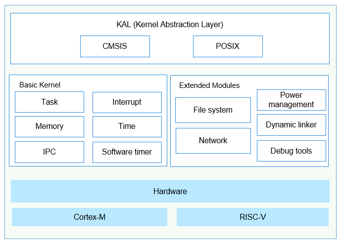

# Kernel Overview

## Overview

The OpenHarmony LiteOS-M kernel is a lightweight operating system \(OS\) kernel designed for the IoT field. It features small size, low power consumption, and high performance. The LiteOS-M kernel has simple code structure, including the minimum function set, kernel abstraction layer \(KAL\), optional components, and project directory. It supports the Hardware Driver Foundation \(HDF\), which provides unified driver standards and access mode for device vendors to simplify porting of drivers and allow one-time development for multi-device deployment.

The OpenHarmony LiteOS-M kernel architecture consists of the hardware layer and hardware-irrelevant layers, as shown in the figure below. The hardware layer is classified based on the compiler toolchain and chip architecture, and provides a unified Hardware Abstraction Layer \(HAL\) interface to improve hardware adaptation and facilitate the expansion of various types of AIoT hardware and compilation toolchains. The other modules are irrelevant to the hardware. The basic kernel module provides basic kernel capabilities. The extended modules provide capabilities of components, such as the network and file systems, as well as exception handling and debug tools. The KAL provides unified standard APIs.

**Figure  1**  Kernel architecture

### CPU Architecture Support

The CPU architecture includes two layers: general architecture definition layer and specific architecture definition layer. The former provides interfaces supported and implemented by all architectures. The latter is specific to an architecture. For a new architecture to be added, the general architecture definition layer must be implemented first and the architecture-specific functions can be implemented at the specific architecture definition layer.

**Table  1**  CPU architecture rules

<table><thead align="left"><tr id="row977192213323"><th class="cellrowborder" valign="top" width="21.592159215921594%" id="mcps1.2.4.1.1">
Rule

</th>
<th class="cellrowborder" valign="top" width="34.713471347134714%" id="mcps1.2.4.1.2">
General Architecture Definition Layer

</th>
<th class="cellrowborder" valign="top" width="43.694369436943695%" id="mcps1.2.4.1.3">
Specific Architecture Definition Layer

</th>
</tr>
</thead>
<tbody><tr id="row1577522103217"><td class="cellrowborder" valign="top" width="21.592159215921594%" headers="mcps1.2.4.1.1 ">
Header file location

</td>
<td class="cellrowborder" valign="top" width="34.713471347134714%" headers="mcps1.2.4.1.2 ">
arch/include

</td>
<td class="cellrowborder" valign="top" width="43.694369436943695%" headers="mcps1.2.4.1.3 ">
arch/&lt;arch&gt;/&lt;arch&gt;/&lt;toolchain&gt;/

</td>
</tr>
<tr id="row16781422193218"><td class="cellrowborder" valign="top" width="21.592159215921594%" headers="mcps1.2.4.1.1 ">
Header file name

</td>
<td class="cellrowborder" valign="top" width="34.713471347134714%" headers="mcps1.2.4.1.2 ">
los_&lt;function&gt;.h

</td>
<td class="cellrowborder" valign="top" width="43.694369436943695%" headers="mcps1.2.4.1.3 ">
los_arch_&lt;function&gt;.h

</td>
</tr>
<tr id="row207882213215"><td class="cellrowborder" valign="top" width="21.592159215921594%" headers="mcps1.2.4.1.1 ">
Function name

</td>
<td class="cellrowborder" valign="top" width="34.713471347134714%" headers="mcps1.2.4.1.2 ">
Halxxxx

</td>
<td class="cellrowborder" valign="top" width="43.694369436943695%" headers="mcps1.2.4.1.3 ">
Halxxxx

</td>
</tr>
</tbody>
</table>

LiteOS-M supports mainstream architectures, such as ARM Cortex-M3, ARM Cortex-M4, ARM Cortex-M7, ARM Cortex-M33, and RISC-V. If you need to expand the CPU architecture, see [Chip Architecture Adaptation](../porting/porting-chip-kernel-overview.md#section137431650339).

### Working Principles

Configure the system clock and number of ticks per second in the  **target\_config.h**  file of the development board. Configure the task, memory, inter-process communication \(IPC\), and exception handling modules based on service requirements. When the system boots, the modules are initialized based on the configuration. The kernel startup process includes peripheral initialization, system clock configuration, kernel initialization, and OS boot, as shown in the figure below.

**Figure  2**  Kernel startup process  

