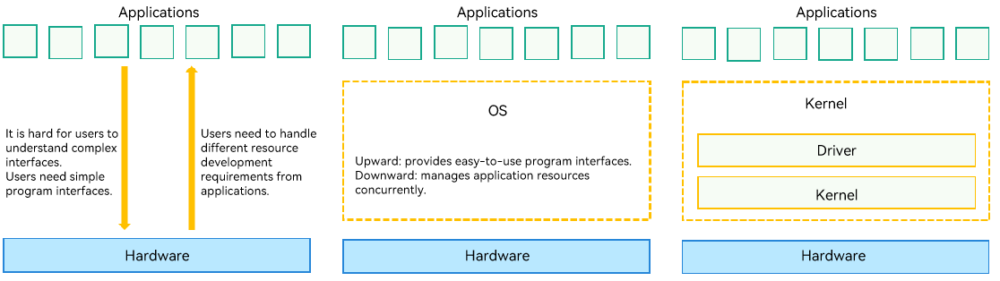
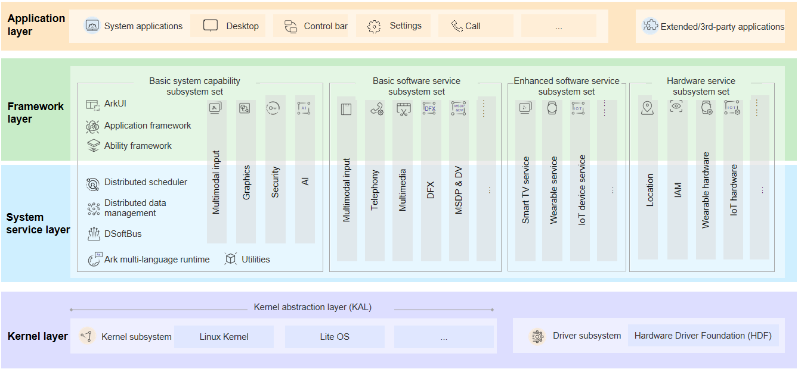
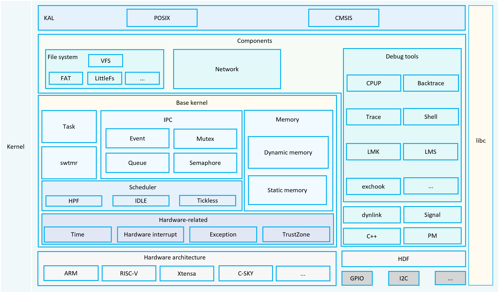

# Kernel Overview


### Overview

The interface through which you interact with an operating system (OS) is the outermost layer of the OS. The most important tasks, like hardware management and system resource allocation, are handled by a module at the core of the OS. This module is called the kernel of the OS.


### Working Principles

An OS is a system software located between applications and hardware. It provides program interfaces and running environments for upper-layer applications and manages underlying hardware resources. Located at a lower layer of the OS, the kernel provides concurrent management of hardware resources for the upper-layer program framework.

**Figure 1** OS architecture




### Multi-Kernel Architecture

There are many kernels in the industry. However, each kernel must have the basic units that provide the following functions:

- Implements data persistence and enables applications to easily access the file system of the persistent data.

- Manages the memory of the process address space.

- Manages multiple processes or tasks.

- Provides the "network" for communication between the OS and another OS.

OpenHarmony supports Linux and LiteOS. You can select OpenHarmony based on product specifications. Both Linux and LiteOS have the basic units, but the implementations are different. The Kernel Abstraction Layer (KAL) provides unified standard APIs for upper-layer applications, shielding the difference between kernels.

The kernel subsystem is located at the lower layer of OpenHarmony. Since OpenHarmony is oriented to devices with different CPUs and storage space, the kernel subsystem supports use of the optimal OS kernel for devices of different resource levels. The KAL shields differences between kernels and provides basic kernel capabilities for the upper layer.

**Figure 2** OpenHarmony architecture





### OpenHarmony Types

OpenHarmony can be classified into the following types based on the supported devices:

- Mini system
  
  The mini system fits into the devices that come with MCU processors, such as Arm Cortex-M and 32-bit RISC-V, and memory greater than or equal to 128 KiB. This system provides a variety of lightweight network protocols, a lightweight graphics framework, and a wide range of read/write components with the Internet of Things (IoT) bus. The mini system applies to smart home products such as LinkIoT module devices and sensors.
- Small system
  
  The small system fits into the devices that come with application processors, such as Arm Cortex-A, and memory greater than or equal to 1 MiB. This system provides higher security capabilities, a standard graphics framework, and video encoding and decoding capabilities. The small system applies to smart home products such as IP cameras, peephole cameras, and routers as well as smart travel products such as event data recorders (EDRs).
- Standard system
  
  The standard system fits into the devices that come with application processors, such as Arm Cortex-A, and memory greater than or equal to 128 MiB. This system provides a complete application framework supporting enhanced interaction, 3D GPU, hardware composer, diverse components, and rich animations. The standard system applies to high-end refrigerator displays. 

Different OpenHarmony systems use kernels of different forms. LiteOS applies to mini and small systems. Linux applies to small and standard systems. The table below lists the kernels and applicable systems.

**Table 1** Kernels and applicable systems

| Level| Mini System| Small System| Standard System|
| -------- | -------- | -------- | -------- |
| LiteOS-M | √ | × | × |
| LiteOS-A | × | √ | x |
| Linux | × | √ | √ |


## LiteOS-M


### Kernel Architecture

OpenHarmony LiteOS-M is a lightweight OS kernel designed for the IoT field. It features small footprint, low power consumption, and high performance. It has a simple code structure, including the minimum kernel function set, kernel abstraction layer, optional components, and project directory. 

The LiteOS-M kernel is divided into the hardware layer and hardware-irrelevant layers. The hardware layer provides a unified HAL interface for easier hardware adaptation. A range of compilation toolchains can be used with different chip architectures to meet the expansion of diversified hardware and compilation toolchains in the Artificial Intelligence of Things (AIoT) field.

**Figure 3** LiteOS-M architecture 




### How to Use

For details about how to use LiteOS-M, see "Usage" in LiteOS-M [Kernel Overview](kernel-mini-overview.md).


## LiteOS-A


### Kernel Architecture

The LiteOS-A kernel applies to the small system. It fits into devices with memory greater than or equal to 1 MiB and supporting memory management unit (MMU) isolation. Similar kernels in the industry include Zircon and Darwin.

To keep pace with the rapid development of the IoT industry, the OpenHarmony lightweight kernel is continuously optimized and expanded to provide application developers with friendly development experience and unified and open ecosystem capabilities. LiteOS-A has the following new features:

- Diversified kernel mechanisms
  - Mechanisms such as virtual memory, system call, multi-core, lightweight Inter-Process Communication (IPC), and Discretionary Access Control (DAC) enrich kernel capabilities.
  - LiteOS-A supports multiple processes, which allows application memory isolation and improves system robustness.

- Unified HDF

  The HDF provides unified driver standards and access mode for device vendors. This simplifies porting of drivers and allows one-time development for multi-device deployment.

- 1200+ standard POSIX APIs

  LiteOS-A supports more Portable Operating System Interface (POSIX) APIs, which facilitate software development and porting and improve developers' experience.

- Decoupling between the kernel and hardware

  LiteOS-A is highly decoupled from the hardware. New boards can be added without modifying the kernel code.

  **Figure 4** LiteOS-A kernel architecture

  


### How to Use

For details about how to use LiteOS-A, see "Usage" in LiteOS-A [Kernel Overview](kernel-small-overview.md).


## Linux


### Linux Kernel

Evolved from the open-source Linux kernel LTS 4.19.y and 5.10.y, the OpenHarmony Linux kernel has incorporated CVE patches and OpenHarmony features as the kernel baseline. Vendors can complete the kernel adaptation by applying the driver patches for boards.

- For more information about Linux LTS 4.19.y, visit the [official kernel website](https://git.kernel.org/pub/scm/linux/kernel/git/stable/linux.git/log/?h=linux-4.19.y).

- For more information about Linux LTS 5.10.y, visit the [official kernel website](https://git.kernel.org/pub/scm/linux/kernel/git/stable/linux.git/log/?h=linux-5.10.y).

During the build process, you can merge the driver code based on the chip platform and build the kernel image. All patches are licensed under GNU General Public License (GPL) 2.0.


### Enhanced Kernel Features

OpenHarmony provides the enhanced swap (ESwap), related thread group (RTG), and lightweight CPU isolation features for the Linux kernel.

**ESwap**

Enhanced Swap (ESwap) allows a custom partition to serve as a swap partition and uses a resident process zswapd to encrypt and swap the anonymous pages compressed by [zram](https://gitee.com/link?target=https%3A%2F%2Fwww.kernel.org%2Fdoc%2Fhtml%2Flatest%2Fadmin-guide%2Fblockdev%2Fzram.html) to the ESwap partition. In this way, a block of memory can be completely released to ensure the available memory (Memavailable) waterline. In addition to this reclaiming mechanism, the entire memory framework is enhanced to improve the reclaiming efficiency of anonymous pages and file pages and streamline the reclaiming ratio of these two types of pages to prevent refaults caused by excessive reclamation.

**RTG**

The RTG provides optimized scheduling of a group of important threads. The load of an RTG can be collected and predicted separately and the preferred CPU cluster can be set to allow the important threads to run on the optimal CPU and the kernel to select a proper CPU frequency based on the group loads.

**Lightweight CPU Isolation**

Lightweight CPU isolation enables dynamic CPU isolation based on the system load and user configuration. The kernel migrates the tasks and interrupts from the isolated CPU to other CPUs for execution. The isolated CPU enters the idle state, which reduces the power consumption. In addition, user-mode configuration and query APIs are provided for better system optimization.


### How to Use

1. Apply HDF patches.
   
     Apply the HDF kernel patches matching your kernel version. For details, see the method in **kernel.mk** in the **kernel/linux/build** repository.
   
   ```
   $(OHOS_BUILD_HOME)/drivers/hdf_core/adapter/khdf/linux/patch_hdf.sh $(OHOS_BUILD_HOME) $(KERNEL_SRC_TMP_PATH) $(KERNEL_PATCH_PATH) $(DEVICE_NAME)
   ```

2. Apply the chip driver patches.

   The following uses Hi3516D V300 as an example.

   Place the patches for the chip component in the corresponding directory based on the path and naming rules for the patches of the chip component in **kernel.mk** in the **kernel/linux/build** repository.
   
   ```
   DEVICE_PATCH_DIR := $(OHOS_BUILD_HOME)/kernel/linux/patches/${KERNEL_VERSION}/$(DEVICE_NAME)_patch
   DEVICE_PATCH_FILE := $(DEVICE_PATCH_DIR)/$(DEVICE_NAME).patch
   ```

3. Modify the **config** file to build.

   Place the **config** file for the chip component in the corresponding directory based on the path and naming rules of the chip component in **kernel.mk** in the **kernel/linux/build** repository.  
   
   ```
   KERNEL_CONFIG_PATH := $(OHOS_BUILD_HOME)/kernel/linux/config/${KERNEL_VERSION}DEFCONFIG_FILE := $(DEVICE_NAME)_$(BUILD_TYPE)_defconfig
   ```
   
   

   > **NOTICE**<br>
   > In the OpenHarmony project build process, patches are installed after "kernel/linux/linux-\*.\*" is copied. Before using the version-level build command of OpenHarmony, ensure that the "kernel/linux/linux-\*.\*" source code is available.
   > 
   > After the build is complete, the kernel is generated in the kernel directory in the **out** directory. Modify the **config** file based on the kernel generated, and copy the generated **.config** file to the corresponding path in the **config** repository. Then, the configuration takes effect.
