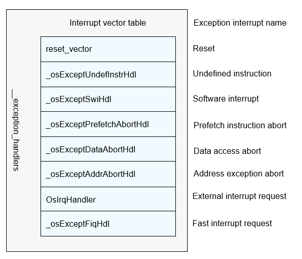

# Interrupt and Exception Handling


## Basic Concepts

An interrupt is a signal to the processor emitted by hardware or software indicating an event that needs immediate attention. An interrupt alerts the processor of a high-priority condition requiring interruption of the code being executed by the processor. In this way, the CPU does not need to spend a lot of time in waiting and querying the peripheral status, which effectively improves the real-time performance and execution efficiency of the system.

OpenHarmony supports the following interrupt operations:

+ Initializing an interrupt.
+ Creating an interrupt.
+ Enabling or disabling interrupts.
+ Restoring the system status before interrupts are disabled. 
+ Deleting an interrupt.

Exception handling involves a series of actions taken by the OS to respond to exceptions (chip hardware faults) that occurred during the OS running, for example, printing the call stack information of the current function, CPU information, and call stack information of tasks when the virtual memory page is missing.


## Working Principles

Peripherals can complete certain work without the intervention of the CPU. In some cases, however, the CPU needs to perform certain work for peripherals. With the interrupt mechanism, the CPU responds to the interrupt request from a peripheral only when required, and execute other tasks when the peripherals do not require the CPU.

The interrupt controller receives the input from the interrupt pins of other peripherals and sends interrupt signals to the CPU. You can enable or disable the interrupt source and set the priority and trigger mode of the interrupt source by programming the interrupt controller. Common interrupt controllers include vector interrupt controllers (VICs) and general interrupt controllers (GICs). The ARM Cortex-A7 uses GICs.

After receiving an interrupt signal sent by the interrupt controller, the CPU interrupts the current task to respond to the interrupt request.

An exception interrupts the normal running process of the CPU to handle exceptions, such as, undefined instructions, an attempt to modify read-only data, and unaligned address access. When an exception occurs, the CPU suspends the current program, handles the exception, and then continues to execute the program interrupted by the exception.

The following uses the ARMv7-a architecture as an example. The interrupt vector table is the entry for interrupt and exception handling. The interrupt vector table contains the entry function for each interrupt and exception handling.

**Figure 1** Interrupt vector table




## Development Guidelines


### Available APIs

Exception handling is an internal mechanism and does not provide external APIs. The following tables describe the APIs available for the interrupt module.

##### Creating or Deleting an Interrupt

| API       | Description                                                    |
|------------ | ----------------------------------------------------------- |
| LOS_HwiCreate | Creates an interrupt and registers the interrupt ID, triggering mode, priority, and interrupt handler. When the interrupt is triggered, the interrupt handler will be called.|
| LOS_HwiDelete | Deletes an interrupt based on the interrupt number.                                  |

##### Enabling or Disabling Interrupts

| API        | Description                                   |
| -------------- | ------------------------------------------- |
| LOS_IntUnlock  | Enables all interrupts for the current processor.                 |
| LOS_IntLock    | Disables all interrupts for the current processor.                 |
| LOS_IntRestore | Restores the status in which the system was before **LOS_IntLock** is called.|

##### Obtaining Interrupt Information

| API                 | Description                |
| ----------------------- | ------------------------ |
| LOS_GetSystemHwiMaximum | Obtains the maximum number of interrupts supported by the system.|


### How to Develop

1. Call **LOS_HwiCreate** to create an interrupt.

2. Call **LOS_HwiDelete** to delete the specified interrupt. Use this API based on actual requirements.


### Development Example


This example implements the following:


1. Create an interrupt.

2. Delete an interrupt.

The following sample code demostrates how to create and delete an interrupt, and call the interrupt handler when the specified interrupt **HWI_NUM_TEST** is triggered. You can add the test function of the sample code to **TestTaskEntry** in **kernel/liteos_a/testsuites/kernel/src/osTest.c** for testing. 

The sample code is as follows: 

```c
#include "los_hwi.h"
/* Interrupt handler function*/
STATIC VOID HwiUsrIrq(VOID)
{
    PRINTK("in the func HwiUsrIrq \n");
}

static UINT32 Example_Interrupt(VOID)
{
    UINT32 ret;
    HWI_HANDLE_T hwiNum = 7; // The interrupt number is 7.
    HWI_PRIOR_T hwiPrio = 3; // The interrupt priority is 3.
    HWI_MODE_T mode = 0;
    HWI_ARG_T arg = 0;

    /* Create an interrupt. */
    ret = LOS_HwiCreate(hwiNum, hwiPrio, mode, (HWI_PROC_FUNC)HwiUsrIrq, (HwiIrqParam *)arg);
    if (ret == LOS_OK) {
        PRINTK("Hwi create success!\n");
    } else {
        PRINTK("Hwi create failed!\n");
        return LOS_NOK;
    }

    /* Delay 50 ticks. Call HwiUsrIrq when a hardware interrupt occurs. */
    LOS_TaskDelay(50);

    /* Delete the interrupt. */
    ret = LOS_HwiDelete(hwiNum, (HwiIrqParam *)arg);
    if (ret == LOS_OK) {
        PRINTK("Hwi delete success!\n");
    } else {
        PRINTK("Hwi delete failed!\n");
        return LOS_NOK;
    }
    return LOS_OK;
}
```


### Verification

The development is successful if the return result is as follows:

```
Hwi create success!
Hwi delete success!
```
