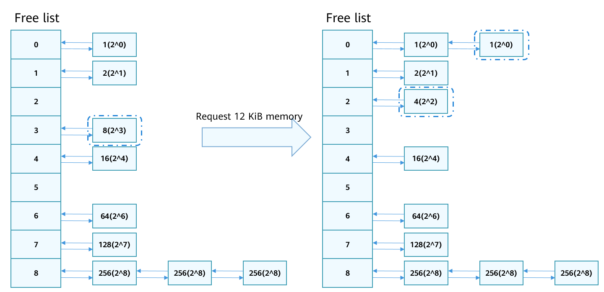

# Physical Memory Management


## Basic Concepts<a name="section210891719217"></a>

Physical memory is one of the most important resources on a computer. It is the memory space that is provided by the physical memory devices and can be directly addressed through the CPU bus. The physical memory provides temporary storage space for the OS and programs. The LiteOS-A kernel manages the physical memory via memory paging. Except the memory occupied by the kernel heap, other available memory is divided into page frames in the unit of 4 KiB. Memory is allocated and reclaimed by page frame. The kernel uses the buddy algorithm to manage free pages to reduce the fragmentation rate and improve the memory allocation and release efficiency. However, a small block may block the merge of a large block, causing a failure to allocate a large memory block.

## Working Principles<a name="section111355315213"></a>

As shown in the following figure, the physical memory distribution of the LiteOS-A kernel consists of the kernel image, kernel heap, and physical pages. For details about the kernel heap, see "Heap Memory Management."

**Figure  1**  Physical memory usage distribution<a name="fig3648124205514"></a>  


The buddy algorithm divides all free page frames into 9 memory block groups, each of which contains 2<sup>N</sup>  page frames. For example, the memory block in group 0 has 2<sup>0</sup>, that is, 1 page frame. The memory block in the eighth group has 2<sup>8</sup>, that is, 256 page frames. Memory blocks of the same size are added to the same linked list for management.

-   Requesting memory

    When 12 KiB memory \(3 page frames\) is requested, the list in group 3 \(with 8 page frames\) meets the requirement. After 12 KiB memory is allocated, 20 KiB memory \(5 page frames\) is left. The 5 page frames can be divided into 4 \(2<sup>2</sup>\) page frames and 1 \(2<sup>0</sup>\) page frame. The 4 page frames have no buddy in the list, and therefore are inserted into list 2. The 1 page frame has a buddy in list 0. If the addresses of the two \(2<sup>0</sup>\) memory blocks are contiguous, the memory blocks are merged as 2 page frames \(2<sup>1</sup>\) and inserted to list 2. If the addresses are not contiguous, the two \(2<sup>0</sup>\) page frames are left in list 0.

    **Figure  2**  Requesting memory<a name="fig1319620135615"></a>  
    


-   Releasing memory 

    When 12 KiB memory \(3 page frames\) is released, the 3 page frames can be divided into 2 \(2<sup>1</sup>\) page frames and 1 \(2<sup>0</sup>\) page frame. The 2 page frames can be merged with the memory in linked list 1 if their addresses are contiguous and inserted to list 2. The one page frame can be merged with the memory in linked list 0 if their addresses are contiguous and inserted to list 1. In this way, the memory is released based on the buddy mechanism.

    **Figure  3**  Releasing memory<a name="fig44001027165614"></a>  
    


## Development Guidelines<a name="section393116496217"></a>

### Available APIs<a name="section13210155619214"></a>

**Table  1**  Physical memory management module APIs

<a name="table1415203765610"></a>
<table><thead align="left"><tr id="row134151837125611"><th class="cellrowborder" valign="top" width="12.821282128212822%" id="mcps1.2.4.1.1"><p id="p16415637105612"><a name="p16415637105612"></a><a name="p16415637105612"></a><strong id="b1878413376595"><a name="b1878413376595"></a><a name="b1878413376595"></a>Function</strong></p>
</th>
<th class="cellrowborder" valign="top" width="29.832983298329836%" id="mcps1.2.4.1.2"><p id="p11415163718562"><a name="p11415163718562"></a><a name="p11415163718562"></a><strong id="b395935974010"><a name="b395935974010"></a><a name="b395935974010"></a>API</strong></p>
</th>
<th class="cellrowborder" valign="top" width="57.34573457345735%" id="mcps1.2.4.1.3"><p id="p1641533755612"><a name="p1641533755612"></a><a name="p1641533755612"></a><strong id="b5959320418"><a name="b5959320418"></a><a name="b5959320418"></a>Description</strong></p>
</th>
</tr>
</thead>
<tbody><tr id="row11567448194112"><td class="cellrowborder" rowspan="3" valign="top" width="12.821282128212822%" headers="mcps1.2.4.1.1 "><p id="p1377313451287"><a name="p1377313451287"></a><a name="p1377313451287"></a>Requesting physical memory</p>
</td>
<td class="cellrowborder" valign="top" width="29.832983298329836%" headers="mcps1.2.4.1.2 "><p id="p69501257634"><a name="p69501257634"></a><a name="p69501257634"></a>LOS_PhysPageAlloc</p>
</td>
<td class="cellrowborder" valign="top" width="57.34573457345735%" headers="mcps1.2.4.1.3 "><p id="p17950155714310"><a name="p17950155714310"></a><a name="p17950155714310"></a>Requests a physical page.</p>
</td>
</tr>
<tr id="row1877155711548"><td class="cellrowborder" valign="top" headers="mcps1.2.4.1.1 "><p id="p687795718546"><a name="p687795718546"></a><a name="p687795718546"></a>LOS_PhysPagesAlloc</p>
</td>
<td class="cellrowborder" valign="top" headers="mcps1.2.4.1.2 "><p id="p11877957115413"><a name="p11877957115413"></a><a name="p11877957115413"></a>Requests a physical page and adds it to the corresponding linked list.</p>
</td>
</tr>
<tr id="row1141513373562"><td class="cellrowborder" valign="top" headers="mcps1.2.4.1.1 "><p id="p1525917111411"><a name="p1525917111411"></a><a name="p1525917111411"></a>LOS_PhysPagesAllocContiguous</p>
</td>
<td class="cellrowborder" valign="top" headers="mcps1.2.4.1.2 "><p id="p72594111245"><a name="p72594111245"></a><a name="p72594111245"></a>Requests memory of contiguous pages.</p>
</td>
</tr>
<tr id="row11129518231"><td class="cellrowborder" rowspan="3" valign="top" width="12.821282128212822%" headers="mcps1.2.4.1.1 "><p id="p329691015710"><a name="p329691015710"></a><a name="p329691015710"></a>Releasing physical memory</p>
</td>
<td class="cellrowborder" valign="top" width="29.832983298329836%" headers="mcps1.2.4.1.2 "><p id="p836211258313"><a name="p836211258313"></a><a name="p836211258313"></a>LOS_PhysPageFree</p>
</td>
<td class="cellrowborder" valign="top" width="57.34573457345735%" headers="mcps1.2.4.1.3 "><p id="p183626251933"><a name="p183626251933"></a><a name="p183626251933"></a>Releases a physical page.</p>
</td>
</tr>
<tr id="row171671014107"><td class="cellrowborder" valign="top" headers="mcps1.2.4.1.1 "><p id="p368411237415"><a name="p368411237415"></a><a name="p368411237415"></a>LOS_PhysPagesFree</p>
</td>
<td class="cellrowborder" valign="top" headers="mcps1.2.4.1.2 "><p id="p12684112320411"><a name="p12684112320411"></a><a name="p12684112320411"></a>Releases the physical pages added to a linked list.</p>
</td>
</tr>
<tr id="row13796135518114"><td class="cellrowborder" valign="top" headers="mcps1.2.4.1.1 "><p id="p379616558114"><a name="p379616558114"></a><a name="p379616558114"></a>LOS_PhysPagesFreeContiguous</p>
</td>
<td class="cellrowborder" valign="top" headers="mcps1.2.4.1.2 "><p id="p1879675510114"><a name="p1879675510114"></a><a name="p1879675510114"></a>Releases memory of contiguous pages.</p>
</td>
</tr>
<tr id="row757517464414"><td class="cellrowborder" rowspan="2" valign="top" width="12.821282128212822%" headers="mcps1.2.4.1.1 "><p id="p128501418185714"><a name="p128501418185714"></a><a name="p128501418185714"></a>Querying memory address</p>
</td>
<td class="cellrowborder" valign="top" width="29.832983298329836%" headers="mcps1.2.4.1.2 "><p id="p147379529411"><a name="p147379529411"></a><a name="p147379529411"></a>LOS_VmPageGet</p>
</td>
<td class="cellrowborder" valign="top" width="57.34573457345735%" headers="mcps1.2.4.1.3 "><p id="p1573711521144"><a name="p1573711521144"></a><a name="p1573711521144"></a>Obtains the physical page structure pointer based on the physical address.</p>
</td>
</tr>
<tr id="row20508104412412"><td class="cellrowborder" valign="top" headers="mcps1.2.4.1.1 "><p id="p1124573417"><a name="p1124573417"></a><a name="p1124573417"></a>LOS_PaddrToKVaddr</p>
</td>
<td class="cellrowborder" valign="top" headers="mcps1.2.4.1.2 "><p id="p71217579414"><a name="p71217579414"></a><a name="p71217579414"></a>Obtains the kernel virtual address based on the physical address.</p>
</td>
</tr>
</tbody>
</table>

### How to Develop<a name="section178441091231"></a>

Use different APIs to request memory. Heap management APIs are recommended for requesting small amount of memory. Physical memory management APIs are recommended for requesting 4 KiB or larger memory.

> **NOTE:** 
>-   APIs used for requesting physical memory can be used only after memory initialization is complete by calling  **OsSysMemInit**.
>-   The basic unit for memory allocation is page frame, that is, 4 KiB.
>-   To leave contiguous memory blocks for the modules that demand them, use  **LOS\_PhysPagesAllocContiguous**  to request contiguous memory blocks and use  **LOS\_PhysPagesAlloc**  to request memory blocks that are not contiguous.

### Development Example<a name="section1258174015319"></a>

This example calls APIs to request and release memory, including requesting one and multiple memory pages.

```
#include "los_vm_phys.h"

#define PHYS_PAGE_SIZE 0x4000

// Request a page.
VOID OsPhysPagesAllocTest3(VOID)
{
    PADDR_T newPaddr;
    VOID *kvaddr = NULL;
    LosVmPage *newPage = NULL;

    newPage = LOS_PhysPageAlloc();
    if (newPage == NULL) {
        printf("LOS_PhysPageAlloc fail\n");
        return;
    }
    printf("LOS_PhysPageAlloc success\n");

    newPaddr = VM_PAGE_TO_PHYS(newPage);
    kvaddr = OsVmPageToVaddr(newPage);

    // Handle the physical memory

    // Free the physical memory
    LOS_PhysPageFree(newPage);
}

// Request multiple pages that do not need to be contiguous.
VOID OsPhysPagesAllocTest2(VOID)
{
    UINT32 sizeCount;
    UINT32 count;
    UINT32 size = PHYS_PAGE_SIZE;
    LosVmPage *vmPageArray[PHYS_PAGE_SIZE >> PAGE_SHIFT] = { NULL };
    UINT32 i = 0;
    LosVmPage *vmPage = NULL;
    PADDR_T pa;

    size = LOS_Align(size, PAGE_SIZE);
    if (size == 0) {
        return;
    }
    sizeCount = size >> PAGE_SHIFT;

    LOS_DL_LIST_HEAD(pageList);

    count = LOS_PhysPagesAlloc(sizeCount, &pageList);
    if (count < sizeCount) {
        printf("failed to allocate enough pages (ask %zu, got %zu)\n", sizeCount, count);
        goto ERROR;
    }
    printf("LOS_PhysPagesAlloc success\n");
    while ((vmPage = LOS_ListRemoveHeadType(&pageList, LosVmPage, node))) {
        pa = vmPage->physAddr;
        vmPageArray[i++] = vmPage;
        // Handle the physical memory
    }

    // Free the physical memory
    for (i = 0; i < sizeCount; ++i) {
        LOS_PhysPageFree(vmPageArray[i]);
    }

    return;

ERROR:
    (VOID)LOS_PhysPagesFree(&pageList);
}

// Request multiple contiguous memory pages.
VOID OsPhysPagesAllocTest1(VOID)
{
    VOID *ptr = NULL;
    LosVmPage *page = NULL;
    UINT32 size = PHYS_PAGE_SIZE;

    ptr = LOS_PhysPagesAllocContiguous(ROUNDUP(size, PAGE_SIZE) >> PAGE_SHIFT);
    if (ptr == NULL) {
        printf("LOS_PhysPagesAllocContiguous fail\n");
        return;
    }

    printf("LOS_PhysPagesAllocContiguous success\n");

    // Handle the physical memory

    // Free the physical memory
    page = OsVmVaddrToPage((VOID *)ptr);
    LOS_PhysPagesFreeContiguous((VOID *)ptr, size >> PAGE_SHIFT);
}

UINT32 ExamplePhyMemCaseEntry(VOID)
{
    OsPhysPagesAllocTest1();
    OsPhysPagesAllocTest2();
    OsPhysPagesAllocTest3();
    return LOS_OK;
}
```

### Verification<a name="section515091342819"></a>

The development is successful if the return result is as follows:

```
LOS_PhysPagesAllocContiguous success
LOS_PhysPagesAlloc success
LOS_PhysPageAlloc success
```

