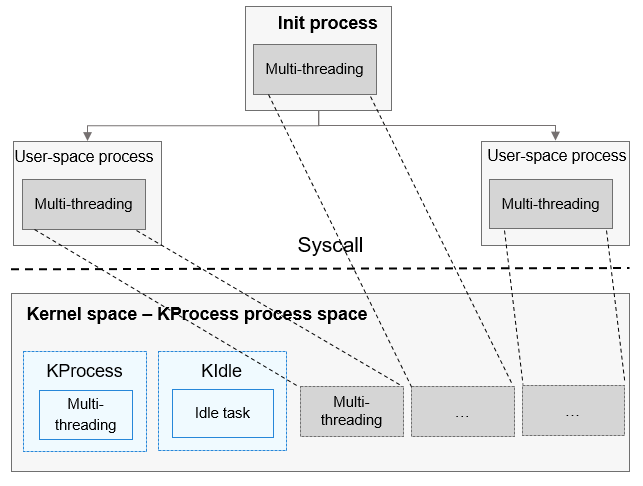

# Process

## Basic Concepts

A process is the minimum unit for system resource management. The process module provided by the OpenHarmony LiteOS-A kernel isolates user-mode processes. The kernel mode is considered as a process space and does not have other processes except KIdle, which is an idle process provided by the system and shares the same process space with KProcess. KProcess is the root process of kernel-mode processes, and KIdle is its child process.

- The process module provides multiple processes for users and implements switching and communication between processes, facilitating your management over service programs.

- The processes use the preemption scheduling mechanism. The processes with a higher priority are scheduled first, and the processes with the same priority are scheduled using the time slice round robin.

- The processes are assigned 32 priorities (**0** to **31**). Among them, user processes can be configured with 22 priorities from **10** (highest) to **31** (lowest).

- A higher-priority process can preempt the resources of a lower-priority process. The lower-priority process can be scheduled only after the higher-priority process is blocked or terminated.

- Each user-mode process has its own memory space, which is invisible to other processes. In this way, processes are isolated from each other.

- The user-mode root process **init** is created by the kernel. Other user-mode processes are created by the **init** process via the **fork** call.

**Process States**

- Init: The process is being created.

- Ready: The process is in the Ready queue and waits for scheduling by the CPU.

- Running: The process is running.

- Pending: The process is blocked and suspended. When all threads in a process are blocked, the process is blocked and suspended.

- Zombies: The process stops running and waits for the parent process to reclaim its control block resources.

  **Figure 1** Process state transition

  

**Process State Transition**

- Init→Ready:
  When a process is created or forked, the process enters the Init state after obtaining the process control block. When the process initialization is complete, the process is added to the scheduling queue, and the process enters the Ready state.

- Ready→Running:
  When process switching occurs, the process that has the highest priority and time slice in the Ready queue is executed and enters the Running state. If this process has no thread in the Ready state, the process is deleted from the Ready queue and resides only in the Running state. If it has threads in the Ready state, the process still stays in the Ready queue. In this case, the process is in both the Ready and Running states, but presented as the Running state.

- Running→Pending:
  When the last thread of a process enters the Pending state, all threads in the process are in the Pending state. Then, the process enters the Pending state, and process switching occurs.

- Pending→Ready:
  When any thread in a Pending process restores to the Ready state, the process is added to the Ready queue and changes to the Ready state.

- Ready→Pending:
  When the last ready thread in a process enters the Pending state, the process is deleted from the Ready queue, and the process changes from the Ready state to the Pending state.

- Running→Ready:
  A process may change from the Running state to the Ready state in either of the following scenarios:

  1. After a process with a higher priority is created or restored, processes will be scheduled. The process with the highest priority in the Ready queue will change to the Running state, and the originally running process will change from the Running state to the Ready state.
  2. If scheduling policy for a process is **LOS_SCHED_RR** (time slice round robin) and its priority is the same as that of another process in the Ready state, this process will change from the Running state to the Ready state after its time slices are used up, and the other process with the same priority will change from the Ready state to the Running state.

- Running→Zombies:
  After the main thread or all threads of a process are stopped, the process changes from the **Running** state to the **Zombies** state and waits for the parent process to reclaim resources.

## Working Principles

The OpenHarmony process module is used to isolate user-mode processes and supports the following functions: creating and exiting user-mode processes, reclaiming process resources, setting and obtaining scheduling parameters and process group IDs, and obtaining process IDs.

A user-mode process is created by forking a parent process. During forking, the virtual memory space of the parent process is cloned to the child process. When the child process is running, the content of the parent process is copied to the virtual memory space of the child process as required through the copy-on-write mechanism.

A process is only a resource management unit, and the actual running is executed by threads in the process. When switching occurs between threads in different processes, the process space will be switched.

**Figure 2** Process management

## Development Guidelines

### Available APIs

**Table 1** APIs for processes and process groups

| API                   | Description              |
| ------------------------- | ---------------------- |
| LOS_GetCurrProcessID      | Obtains the ID of the current process.  |
| LOS_GetProcessGroupID     | Obtains the process group ID of the specified process.|
| LOS_GetCurrProcessGroupID | Obtains the process group ID of the current process.|

**Table 2** APIs for users and user groups

| API           | Description                                |
| ----------------- | ---------------------------------------- |
| LOS_GetUserID     | Obtains the user ID of the current process.                    |
| LOS_GetGroupID    | Obtains the user group ID of the current process.                  |
| LOS_CheckInGroups | Checks whether the specified user group ID is in the user group of the current process.|

**Table 3** APIs for process scheduling

| API                 | API                                        |
| ----------------------- | -------------------------------------------- |
| LOS_GetProcessScheduler | Obtains the scheduling policy of a process.                      |
| LOS_SetProcessScheduler | Sets scheduling parameters, including the priority and scheduling policy, for a process.|
| LOS_SetProcessPriority  | Sets the process priority.                              |
| LOS_GetProcessPriority  | Obtains the priority of a process.                              |

**Table 4** APIs for obtaining system process information

| API                     | Description                  |
| --------------------------- | -------------------------- |
| LOS_GetSystemProcessMaximum | Obtains the maximum number of processes supported by the system.|
| LOS_GetUsedPIDList          | Obtains a list of used process IDs.    |

**Table 5** APIs for managing processes

| API    | Description                  |
| ---------- | -------------------------- |
| LOS_Fork   | Creates a child process.                |
| LOS_Wait   | Waits for the child process to terminate, and reclaims its resources.|
| LOS_Waitid | Wait for the specified process to terminate.      |
| LOS_Exit   | Exits a process.                  |

### How to Develop

Kernel-mode processes cannot be created. Therefore, kernel-mode process development is not involved.

> **NOTE**
> 
> - The number of idle threads depends on the number of CPU cores. Each CPU has a corresponding idle thread.
>- Except KProcess and KIdle, other kernel-mode processes cannot be created.
> - If a thread is created after a user-mode process enters the kernel mode by a system call, the thread belongs to a KProcess not a user-mode process.
