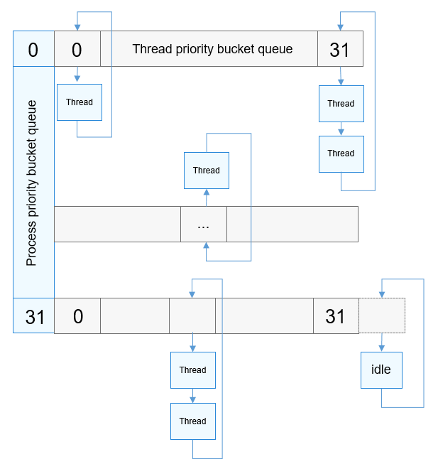

# Scheduler

## Basic Concepts

The OpenHarmony LiteOS-A kernel uses the preemptive scheduling mechanism for tasks. The tasks with a higher priority are scheduled first, and the tasks with the same priority are scheduled using the time slice polling. The system runs based on the real-time timeline from the startup, which ensures good real-time performance of the scheduling algorithm.

The OpenHarmony scheduling algorithm is embedded with the tickless mechanism, which ensures lower power consumption and on-demand response to tick interrupts. This minimizes useless tick interrupt response time and further improves the real-time performance of the system.

OpenHarmony supports **SCHED_RR** (time slice round robin) for process scheduling and **SCHED_RR** and **SCHED_FIFO** (first in, first out) for thread scheduling .

Threads are the minimum scheduling units in OpenHarmony.

## Working Principles

OpenHarmony uses process priority queue and thread priority queue for scheduling. The process priority ranges from 0 to 31, and there are 32 process priority bucket queues. Each bucket queue corresponds to a thread priority bucket queue. The thread priority ranges from 0 to 31, and a thread priority bucket queue also has 32 priority queues.

**Figure 1** Scheduling priority bucket queue

The OpenHarmony system starts scheduling after the kernel initialization is complete. The processes or threads created during running are added to the scheduling queues. The system selects the optimal thread for scheduling based on the priorities of the processes and threads and the time slice consumption of the threads. Once a thread is scheduled, it is deleted from the scheduling queue. If a thread is blocked during running, the thread is added to the corresponding blocking queue and triggers scheduling of another thread. If no thread in the scheduling queue can be scheduled, the system selects the thread of the KIdle process for scheduling.

**Figure 2** Scheduling process

## Development Guidelines

### Available APIs

| API| Description|
| -------- | -------- |
| LOS_Schedule | Triggers system scheduling.|
| LOS_GetTaskScheduler | Obtains the scheduling policy of a task.|
| LOS_SetTaskScheduler | Sets the scheduling policy for a task.|
| LOS_GetProcessScheduler | Obtains the scheduling policy of a process.|
| LOS_SetProcessScheduler | Sets scheduling parameters, including the priority and scheduling policy, for a process.|

### How to Develop

> **NOTE**
>
> Scheduling cannot be triggered during the system initialization process.
