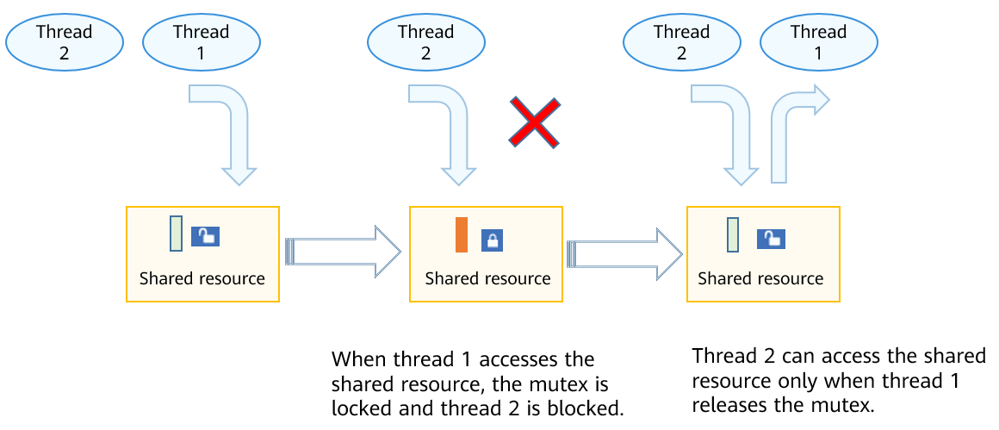

# Mutex


## Basic Concepts

A mutual exclusion (mutex) is a special binary semaphore used for exclusive access to shared resources. When a task holds the mutex, the task obtains the ownership of the mutex. When the task releases the mutex, the task will lose the ownership of the mutex. When a task holds a mutex, other tasks cannot hold the mutex. In an environment where multiple tasks compete for shared resources, the mutex ensures exclusive access to the shared resources.

A mutex has three attributes: protocol attribute, priority upper limit attribute, and type attribute. The protocol attribute is used to handle a mutex requested by tasks of different priorities. The protocol attribute can be any of the following:

- LOS_MUX_PRIO_NONE
  
  Do not inherit or protect the priority of the task requesting the mutex.

- LOS_MUX_PRIO_INHERIT
  
  Inherits the priority of the task that requests the mutex. This is the default protocol attribute. When the mutex protocol attribute is set to this value: If a task with a higher priority is blocked because the mutex is already held by a task, the priority of the task holding the mutex will be backed up to the priority bitmap of the task control block, and then set to be the same as that of the task of a higher priority. When the task holding the mutex releases the mutex, its task priority is restored to its original value.

- LOS_MUX_PRIO_PROTECT
  
  Protects the priority of the task that requests the mutex. When the mutex protocol attribute is set to this value: If the priority of the task that requests the mutex is lower than the upper limit of the mutex priority, the task priority will be backed up to the priority bitmap of the task control block, and then set to the upper limit value of the mutex priority. When the mutex is released, the task priority is restored to its original value.
  
  The type attribute of a mutex specifies whether to check for deadlocks and whether to support recursive holding of the mutex. The type attribute can be any of the following:

- LOS_MUX_NORMAL
  
  Common mutex, which does not check for deadlocks. If a task repeatedly attempts to hold a mutex, the thread will be deadlocked. If the mutex type attribute is set to this value, a task cannot release a mutex held by another task or repeatedly release a mutex. Otherwise, unexpected results will be caused.

- LOS_MUX_RECURSIVE
  
  Recursive mutex, which is the default attribute. If the type attribute of a mutex is set to this value, a task can hold the mutex for multiple times. Another task can hold this mutex only when the number of lock holding times is the same as the number of lock release times. However, any attempt to hold a mutex held by another task or attempt to release a mutex that has been released will return an error code.

- LOS_MUX_ERRORCHECK
  
  Mutex for error checks. When a mutex is set to this type, an error code will be returned if a task attempts to repeatedly hold the mutex, attempts to release the mutex held by another task, or attempts to release the mutex that has been released.


## Working Principles

In a multi-task environment, multiple tasks may access the same shared resources. However, certain shared resources are not shared, and can only be accessed exclusively by tasks. A mutex can be used to address this issue.

When non-shared resources are accessed by a task, the mutex is locked. Other tasks will be blocked until the mutex is released by the task. The mutex allows only one task to access the shared resources at a time, ensuring integrity of operations on the shared resources.

**Figure 1** Mutex working mechanism for the small system




## Development Guidelines


### Available APIs

  **Table 1** APIs of the mutex module

| Category| API Description |
| -------- | -------- |
| Initializing or destroying a mutex| - **LOS_MuxInit**: initializes a mutex.<br>- **LOS_MuxDestroy**: destroys a mutex.|
| Requesting or releasing a mutex| - **LOS_MuxLock**: requests a mutex.<br>- **LOS_MuxTrylock**: requests a mutex without blocking.<br>- **LOS_MuxUnlock**: releases a mutex.|
| Verifying a mutex| - **LOS_MuxIsValid**: checks whether the mutex release is valid.<br>- **LOS_MuxAttrDestroy**: destroys the specified mutex attribute.|
| Setting and obtaining mutex attributes| - **LOS_MuxAttrGetType**: obtains the type attribute of a mutex.<br>- **LOS_MuxAttrSetType**: sets the type attribute for a mutex.<br>- **LOS_MuxAttrGetProtocol**: obtains the protocol attribute of a mutex.<br>- **LOS_MuxAttrSetProtocol**: sets the protocol attribute for a mutex.<br>- **LOS_MuxAttrGetPrioceiling**: obtains the priority upper limit attribute of a mutex.<br>- **LOS_MuxAttrSetPrioceiling**: sets the priority upper limit attribute for a mutex.<br>- **LOS_MuxGetPrioceiling**: obtains the priority upper limit of this mutex.<br>- **LOS_MuxSetPrioceiling**: sets the priority upper limit for this mutex. |


### How to Develop

The typical mutex development process is as follows: 

1. Call **LOS_MuxInit** to initialize a mutex.

2. Call **LOS_MuxLock** to request a mutex.

The following modes are available:

- Non-block mode: A task acquires the mutex if the requested mutex is not held by any task or the task holding the mutex is the same as the task requesting the mutex.

- Permanent block mode: A task acquires the mutex if the requested mutex is not occupied. If the mutex is occupied, the task will be blocked and the task with a highest priority in the ready queue will be executed. The blocked task can be unlocked and executed only when the mutex is released.

- Scheduled block mode: A task acquires the mutex if the requested mutex is not occupied. If the mutex is occupied, the task will be blocked and the task with the highest priority in the ready queue will be executed. The blocked task can be executed only when the mutex is released within the specified timeout period or when the specified timeout period expires.

3. Call **LOS_MuxUnlock** to release a mutex.

- If tasks are blocked by the specified mutex, the task with a higher priority will be unblocked when the mutex is released. The unblocked task changes to the Ready state and is scheduled.

- If no task is blocked by the specified mutex, the mutex is released successfully.

4. Call **LOS_MuxDestroy** to destroy a mutex.

> **NOTE**<br>
> - Two tasks cannot lock the same mutex. If a task attempts to lock a mutex held by another task, the task will be blocked until the mutex is unclocked.
> 
> - Mutexes cannot be used in the interrupt service program.
> 
> - The system using the LiteOS-A kernel must ensure real-time task scheduling and avoid long-time task blocking. Therefore, a mutex must be released as soon as possible after use.


### Development Example

#### Example Description

This example implements the following:

1. Create the **Example_TaskEntry** task. In this task, create a mutex to lock task scheduling, and create two tasks **Example_MutexTask1** (with a lower priority) and **Example_MutexTask2** (with a higher priority) to unlock task scheduling.

2. When being scheduled, **Example_MutexTask2** requests a mutex in permanent block mode. After acquiring the mutex, **Example_MutexTask2** enters the sleep mode for 100 ticks. **Example_MutexTask2** is suspended, and **Example_MutexTask1** is woken up.

3. **Example_MutexTask1** requests a mutex in scheduled block mode, and waits for 10 ticks. Because the mutex is still held by **Example_MutexTask2**, **Example_MutexTask1** is suspended. After 10 ticks, **Example_MutexTask1** is woken up and attempts to request a mutex in permanent block mode. **Example_MutexTask1** is suspended because the mutex is still held by **Example_MutexTask2**.

4. After 100 ticks, **Example_MutexTask2** is woken up and releases the mutex, and then **Example_MutexTask1** is woken up. **Example_MutexTask1** acquires the mutex and then releases the mutex. At last, the mutex is deleted.

#### Sample Code

The sample code can be compiled and verified in **./kernel/liteos_a/testsuites/kernel/src/osTest.c**. The **Example_MutexEntry** function is called in **TestTaskEntry**.

The sample code is as follows:

```
#include <string.h>
#include "los_mux.h"

/* Mutex */
LosMux g_testMutex;
/* Task ID*/
UINT32 g_testTaskId01;
UINT32 g_testTaskId02;

VOID Example_MutexTask1(VOID)
{
    UINT32 ret;
    LOS_TaskDelay(50);

    dprintf("task1 try to get mutex, wait 10 ticks.\n");
    /* Request a mutex. */
    ret = LOS_MuxLock(&g_testMutex, 10);

    if (ret == LOS_OK) {
        dprintf("task1 get mutex g_testMux.\n");
        /* Release the mutex. */
        LOS_MuxUnlock(&g_testMutex);
        return;
    }
    if (ret == LOS_ETIMEDOUT) {
        dprintf("task1 timeout and try to get mutex, wait forever.\n");
        /* Request a mutex. */
        ret = LOS_MuxLock(&g_testMutex, LOS_WAIT_FOREVER);
        if (ret == LOS_OK) {
            dprintf("task1 wait forever, get mutex g_testMux.\n");
            /* Release the mutex. */
            LOS_MuxUnlock(&g_testMutex);
            /* Delete the mutex. */
            LOS_MuxDestroy(&g_testMutex);
            dprintf("task1 post and delete mutex g_testMux.\n");
            return;
        }
    }
    return;
}

VOID Example_MutexTask2(VOID)
{
    dprintf("task2 try to get mutex, wait forever.\n");
    /* Request a mutex. */
    (VOID)LOS_MuxLock(&g_testMutex, LOS_WAIT_FOREVER);

    dprintf("task2 get mutex g_testMux and suspend 100 ticks.\n");

    /* Enable the task to enter sleep mode for 100 ticks. */
    LOS_TaskDelay(100);

    dprintf("task2 resumed and post the g_testMux\n");
    /* Release the mutex. */
    LOS_MuxUnlock(&g_testMutex);
    return;
}

UINT32 Example_MutexEntry(VOID)
{
    UINT32 ret;
    TSK_INIT_PARAM_S task1;
    TSK_INIT_PARAM_S task2;

    /* Initialize the mutex. */
    LOS_MuxInit(&g_testMutex, NULL);

    /* Lock task scheduling. */
    LOS_TaskLock();

    /* Create task 1. */
    memset(&task1, 0, sizeof(TSK_INIT_PARAM_S));
    task1.pfnTaskEntry = (TSK_ENTRY_FUNC)Example_MutexTask1;
    task1.pcName       = "MutexTsk1";
    task1.uwStackSize  = LOSCFG_BASE_CORE_TSK_DEFAULT_STACK_SIZE;
    task1.usTaskPrio   = 5;
    ret = LOS_TaskCreate(&g_testTaskId01, &task1);
    if (ret != LOS_OK) {
        dprintf("task1 create failed.\n");
        return LOS_NOK;
    }

    /* Create task 2. */
    memset(&task2, 0, sizeof(TSK_INIT_PARAM_S));
    task2.pfnTaskEntry = (TSK_ENTRY_FUNC)Example_MutexTask2;
    task2.pcName       = "MutexTsk2";
    task2.uwStackSize  = LOSCFG_BASE_CORE_TSK_DEFAULT_STACK_SIZE;
    task2.usTaskPrio   = 4;
    ret = LOS_TaskCreate(&g_testTaskId02, &task2);
    if (ret != LOS_OK) {
        dprintf("task2 create failed.\n");
        return LOS_NOK;
    }

    /* Unlock task scheduling. */
    LOS_TaskUnlock();

    return LOS_OK;
}
```

**Verification**

The development is successful if the return result is as follows:


```
task2 try to get mutex, wait forever.
task2 get mutex g_testMux and suspend 100 ticks.
task1 try to get mutex, wait 10 ticks.
task1 timeout and try to get mutex, wait forever.
task2 resumed and post the g_testMux
task1 wait forever, get mutex g_testMux.
task1 post and delete mutex g_testMux.
```
