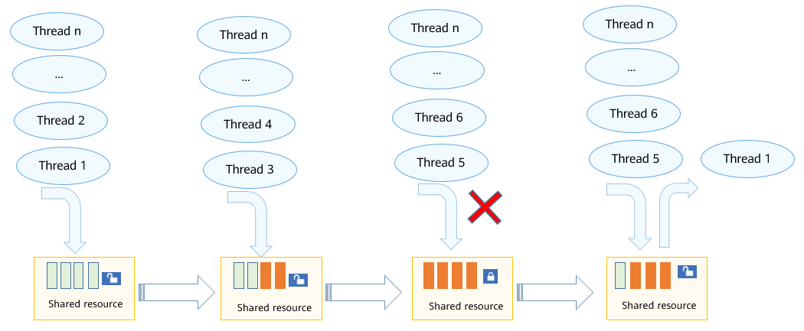

# Semaphore


## Basic Concepts

Semaphore is a mechanism used to implement synchronization between tasks or exclusive access to shared resources.

In the semaphore data structure, there is a value indicating the number of shared resources available. The value can be:

- **0**: The semaphore is unavailable. In this case, tasks waiting for the semaphore may exist.

- Positive number: The semaphore is available.

The semaphore used for exclusive access to resources is different from the semaphore used for synchronization:

-   Semaphore used for exclusive access: The initial semaphore counter value \(non-zero\) indicates the number of shared resources available. A semaphore must be acquired before a shared resource is used, and released when the resource is no longer required. When all shared resources are used, the semaphore counter is reduced to 0 and all tasks requiring the semaphore will be blocked. This ensures exclusive access to shared resources. In addition, if the number of shared resources is 1, a binary semaphore \(similar to the mutex mechanism\) is recommended.

-   Semaphore used for synchronization: The initial semaphore counter value is  **0**. A task without the semaphore will be blocked, and enters the Ready or Running state only when the semaphore is released by another task or an interrupt.


## Working Principles

**Semaphore Control Block**


```
/**
  * Data structure of the semaphore control block
 */
typedef struct {
    UINT16            semStat;          /* Semaphore status */
    UINT16            semType;          /* Semaphore type */
    UINT16            semCount;         /* Semaphore count */
    UINT16            semId;            /* Semaphore ID */
    LOS_DL_LIST       semList;          /* List of blocked tasks */
} LosSemCB;
```

**Working Principles**

Semaphore allows only a specified number of tasks to access a shared resource at a time. When the number of tasks accessing the resource reaches the limit, other tasks will be blocked until the semaphore is released.

- Semaphore initialization
  
  Allocate memory for the semaphores (the number of semaphores is specified by the **LOSCFG_BASE_IPC_SEM_LIMIT** macro), set all semaphores to the unused state, and add them to a linked list.
  
- Semaphore creation

  Obtain a semaphore from the linked list of unused semaphores and assign an initial value to the semaphore.

- Semaphore request

  If the counter value is greater than 0 when a semaphore is requsted, the counter is decreased by 1 and a success message is returned. Otherwise, the task is blocked and added to the end of a task queue waiting for semaphores. The wait timeout period can be set.

- Semaphore release

  If no task is waiting for the semaphore, the counter is incremented by 1. Otherwise, wake up the first task in the wait queue.

- Semaphore deletion

  Set a semaphore in use to the unused state and add it to the linked list of unused semaphores.

The following figure illustrates the semaphore working mechanism.

**Figure 1** Semaphore working mechanism for the small system




## Development Guidelines


### Available APIs

**Table 1** APIs for creating and deleting a semaphore

| API| Description|
| -------- | -------- |
| LOS_SemCreate | Creates a semaphore and returns the semaphore ID.|
| LOS_BinarySemCreate | Creates a binary semaphore. The maximum counter value is **1**.|
| LOS_SemDelete | Deletes a semaphore.|

**Table 2** APIs for requesting and releasing a semaphore

| API| Description|
| -------- | -------- |
| LOS_SemPend | Requests a semaphore and sets a timeout period.|
| LOS_SemPost | Releases a semaphore.|


### How to Develop

1. Call **LOS_SemCreate** to create a semaphore. To create a binary semaphore, call **LOS_BinarySemCreate**.

2. Call **LOS_SemPend** to request a semaphore.

3. Call **LOS_SemPost** to release a semaphore.

4. Call **LOS_SemDelete** to delete a semaphore.

> **NOTE**<br>
> As interrupts cannot be blocked, semaphores cannot be requested in block mode for interrupts.


### Development Example


### Example Description

This example implements the following:

1. Create a semaphore in task **ExampleSem** and lock task scheduling. Create two tasks **ExampleSemTask1** and **ExampleSemTask2** (with higher priority). Enable the two tasks to request the same semaphore. Unlock task scheduling. Enable task **ExampleSem** to enter sleep mode for 400 ticks. Release the semaphore in task **ExampleSem**.

2. Enable **ExampleSemTask2** to enter sleep mode for 20 ticks after acquiring the semaphore. (When **ExampleSemTask2** is delayed, **ExampleSemTask1** is woken up.)

3. Enable **ExampleSemTask1** to request the semaphore in scheduled block mode, with a wait timeout period of 10 ticks. (Because the semaphore is still held by **ExampleSemTask2**, **ExampleSemTask1** is suspended. **ExampleSemTask1** is woken up after 10 ticks.) Enable **ExampleSemTask1** to request the semaphore in permanent block mode after it is woken up 10 ticks later. (Because the semaphore is still held by **ExampleSemTask2**, **ExampleSemTask1** is suspended.)

4. After 20 ticks, **ExampleSemTask2** is woken up and releases the semaphore. **ExampleSemTask1** acquires the semaphore and is scheduled to run. When **ExampleSemTask1** is complete, it releases the semaphore.

5. Task **ExampleSem** is woken up after 400 ticks. After that, delete the semaphore.


### Sample Code

The sample code can be compiled and verified in **./kernel/liteos_a/testsuites/kernel/src/osTest.c**. The **ExampleSem** function is called in **TestTaskEntry**.

The sample code is as follows:

```
#include "los_sem.h"
#include "securec.h"

/* Task ID*/
static UINT32 g_testTaskId01;
static UINT32 g_testTaskId02;

/* Task priority */
#define TASK_PRIO_LOW   5
#define TASK_PRIO_HI    4

/* Semaphore structure ID */
static UINT32 g_semId;

VOID ExampleSemTask1(VOID)
{
    UINT32 ret;

    dprintf("ExampleSemTask1 try get sem g_semId, timeout 10 ticks.\n");

    /* Request the semaphore in scheduled block mode, with a wait timeout period of 10 ticks. */
    ret = LOS_SemPend(g_semId, 10);
    /* The semaphore is acquired. */
    if (ret == LOS_OK) {
         LOS_SemPost(g_semId);
         return;
    }
    /* The semaphore is not acquired when the timeout period has expired. */
    if (ret == LOS_ERRNO_SEM_TIMEOUT) {
        dprintf("ExampleSemTask1 timeout and try get sem g_semId wait forever.\n");

        /* Request the semaphore in permanent block mode. */
        ret = LOS_SemPend(g_semId, LOS_WAIT_FOREVER);
        dprintf("ExampleSemTask1 wait_forever and get sem g_semId.\n");
        if (ret == LOS_OK) {
            dprintf("ExampleSemTask1 post sem g_semId.\n");
            LOS_SemPost(g_semId);
            return;
        }
    }
}

VOID ExampleSemTask2(VOID)
{
    UINT32 ret;
    dprintf("ExampleSemTask2 try get sem g_semId wait forever.\n");

    /* Request the semaphore in permanent block mode. */
    ret = LOS_SemPend(g_semId, LOS_WAIT_FOREVER);
    if (ret == LOS_OK) {
        dprintf("ExampleSemTask2 get sem g_semId and then delay 20 ticks.\n");
    }

    /* Enable the task to enter sleep mode for 20 ticks. */
    LOS_TaskDelay(20);

    dprintf("ExampleSemTask2 post sem g_semId.\n");
    /* Release the semaphore. */
    LOS_SemPost(g_semId);
    return;
}

UINT32 ExampleSem(VOID)
{
    UINT32 ret;
    TSK_INIT_PARAM_S task1;
    TSK_INIT_PARAM_S task2;

   /* Create a semaphore. */
    LOS_SemCreate(0, &g_semId);

    /* Lock task scheduling. */
    LOS_TaskLock();

    /* Create task 1. */
    (VOID)memset_s(&task1, sizeof(TSK_INIT_PARAM_S), 0, sizeof(TSK_INIT_PARAM_S));
    task1.pfnTaskEntry = (TSK_ENTRY_FUNC)ExampleSemTask1;
    task1.pcName       = "TestTask1";
    task1.uwStackSize  = LOSCFG_BASE_CORE_TSK_DEFAULT_STACK_SIZE;
    task1.usTaskPrio   = TASK_PRIO_LOW;
    ret = LOS_TaskCreate(&g_testTaskId01, &task1);
    if (ret != LOS_OK) {
        dprintf("task1 create failed .\n");
        return LOS_NOK;
    }

    /* Create task 2. */
    (VOID)memset_s(&task2, sizeof(TSK_INIT_PARAM_S), 0, sizeof(TSK_INIT_PARAM_S));
    task2.pfnTaskEntry = (TSK_ENTRY_FUNC)ExampleSemTask2;
    task2.pcName       = "TestTask2";
    task2.uwStackSize  = LOSCFG_BASE_CORE_TSK_DEFAULT_STACK_SIZE;
    task2.usTaskPrio   = TASK_PRIO_HI;
    ret = LOS_TaskCreate(&g_testTaskId02, &task2);
    if (ret != LOS_OK) {
        dprintf("task2 create failed.\n");
        return LOS_NOK;
    }

    /* Unlock task scheduling. */
    LOS_TaskUnlock();

     /* Enable the task to enter sleep mode for 400 ticks. */
    LOS_TaskDelay(400);

    ret = LOS_SemPost(g_semId);

     /* Enable the task to enter sleep mode for 400 ticks. */
    LOS_TaskDelay(400);

    /* Delete the semaphore. */
    LOS_SemDelete(g_semId);
    return LOS_OK;
}
```


### Verification

The development is successful if the return result is as follows:


```
ExampleSemTask2 try get sem g_semId wait forever.
ExampleSemTask1 try get sem g_semId, timeout 10 ticks.
ExampleSemTask1 timeout and try get sem g_semId wait forever.
ExampleSemTask2 get sem g_semId and then delay 20 ticks.
ExampleSemTask2 post sem g_semId.
ExampleSemTask1 wait_forever and get sem g_semId.
ExampleSemTask1 post sem g_semId.
```
