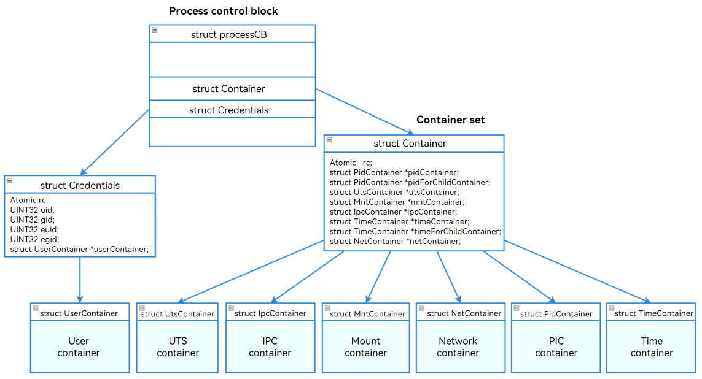
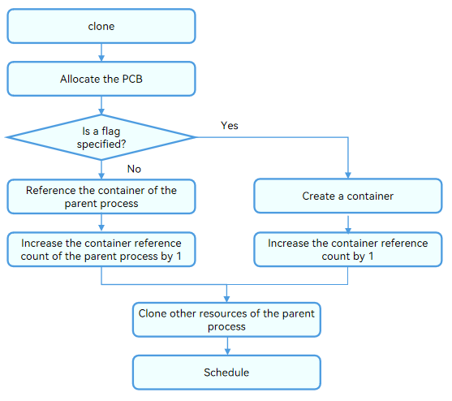
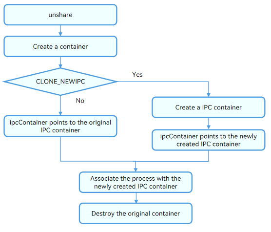

#   Container

## Overview

Container provides a mechanism to isolate global resources, such as process identifiers (PIDs), host information, and user information. The container mechanism allows the processes in different containers to have independent global resources. Changing system resources in a container does not affect processes in other containers.

The LiteOS-A kernel container isolation function involves seven containers: UTS container, PID container, Mount container, Network container, Time container, IPC container, and User container. The container information is stored in the **container** and **credentials** structs of the process control block (**ProcessCB**) struct.

The following table lists the LiteOS-A containers.

|    No.  |       Name    |    Macro Definition/Flag      |          Resource       |    Data Struct     |
| :-------- | :------------- | :------------------- | :----------------------- | :----------------------- |
| 1         | UTS            | CLONE_NEWUTS         | Host names, domain names, and version information.|struct Container          |
| 2         | PID            | CLONE_NEWPID         | PIDs.               |struct Container          |
| 3         | Mount          | CLONE_NEWNS          | File system mount points.          |struct Container          |
| 4         | Network        | CLONE_NEWNET         | Network system resources.    |struct Container          |
| 5         | TIME           | CLONE_NEWTIME        | Clock resources.                |struct Container          |
| 6         | IPC            | CLONE_NEWIPC         | Inter-process communication (IPC) resources.          |struct Container          |
| 7         | User           | CLONE_NEWUSER        | Users and user groups.            |struct Credentials             |

The container-based resource isolation can be further classified into the following types:

 - Global isolation: The containers are parallel (without inheritance relationships), and the container resources are invisible to each other.

 - Non-global isolation: The containers have parent-child relationships. The resources of containers of the same level are invisible, but the upper-level container can access resources of the lower-level container.

For the PID container, **unshare()** or **setns()** changes the container of the child process (not the process).

You can add a **Container** struct and a **Credentials** struct to the **ProcessCB** of a process to implement container functionalities. You can also enable or disable specific container by using compiler switches.

 - The **ProcessCB** struct of each process contains a pointer to the **Container** struct allocated. This allows a process to have an independent **Container** struct or share a **Container** struct. The **Container** struct contains pointers to the UTS, PID, Network, Mount, Time, and IPC containers.

 - The **ProcessCB** struct of each process has a **Credentials** struct for independent User container management. This design facilitates modularization and independent processing of the unique logic of the User container.




### Containers

#### **UTS Container**

The UTS container isolates information, such as host names, domain names, and version information. The information in different UTS containers is isolated from each other.

#### **Mount Container**

The Mount container isolates file mount points. The mount and unmount operations in a container does not affect other containers.

The Mount container allows processes to use the file mounting system independently. Child processes perform mount operations in independent file mounting containers and have their own file mount structs.

- To implement a Mount container, use **clone()** with the **CLONE_NEWNS** flag to create a process, and change the mount information from global information to the information specific to the Mount container.

- After a Mount container is created, change the implementation of obtaining the mount information to enable the mount information to be obtained from the current Mount container. After that, the mount, unmount, and access to the mounted file system of the process do not affect that of other processes.

#### **PID Container**

The PID container isolates PIDs. Processes of different containers can use the same virtual process ID.

  The PID container provides the following features:

- The PIDs of different containers are independent of each other.
- Nested PID containers are supported. The processes in the child PID containers are visible to the parent PID container. For the same process, the PID in the parent PID container is independent from the PID in the child PID container.
- The child PID container cannot view the processes in its parent container.
- All PIDs of the system can be viewed in the root container.

#### **Network Container**

The Network container isolates the system's network devices and network stacks.

The Network container isolates the TCP/IP protocol stacks and network device resources.

 - Transport layer isolation: The Network container isolates port numbers. The available port numbers in a Network container range from 0 to 65535. A process is bound to the port number of its own container. Processes of different Network containers can be bound to the same TCP/UDP port number without affecting each other.
 - IP layer isolation: The Network container isolates IP resources. Each container has its own IP resources. Changing the IP address in a Network container does not affect other Network containers.
 - Network device isolation: The Network container isolates network interface cards (NICs). Each container has its own NICs. The NICs in different Network containers are isolated from each other and cannot communicate with each other. You can configure veth-pair to implement communication between different containers.

#### **User Container**

The User container isolates users and user groups.

The User container isolates management rights by User ID or Group ID (UID/GID) and capability.

- UID/GID

  The User container isolates UIDs/GIDs. Different User containers have different UIDs/GIDs. Each User container has independent UIDs/GIDs starting from 0. In this way, the processes in the container can have the **root** permission, which is restricted to the minimum range. Changing the UID/GID of a User container does not affect the processes of other User containers.

- Capability

  With the User container, you can set different capabilities for processes.

  Each process calls **OsInitCapability()** to initialize its permissions. You can use **SysCapGet()** to obtain the capabilities of a process, and use **SysCapSet()** to modify the process permissions.

The following table describes the capabilities.

| Capability                 | Description                                          |
| --------------------- | ---------------------------------------------- |
| CAP_CHOWN             | Changes the owner of a file.                          |
| CAP_DAC_EXECUTE       | Overrides the Discretionary Access Control (DAC) restriction on file execution.                   |
| CAP_DAC_WRITE         | Overrides the DAC restriction on file write.                     |
| CAP_DAC_READ_SEARCH   | Overrides the DAC restriction on file read or search of a directory.           |
| CAP_FOWNER            | Overrides the requirement that the file owner ID must match the process user ID.|
| CAP_KILL              | Sends a **kill** signal to another process that is not owned by the sender.                |
| CAP_SETGID            | Changes the GID of a process.                             |
| CAP_SETUID            | Changes the UID of a process.                             |
| CAP_NET_BIND_SERVICE  | Binds a socket to a port whose number is less than 1024.                    |
| CAP_NET_BROADCAST     | Allows network broadcast and multicast access.                        |
| CAP_NET_ADMIN         | Allows network management tasks to be executed.                          |
| CAP_NET_RAW           | Allows the use of raw sockets.                            |
| CAP_FS_MOUNT          | Allows **chroot()**.                    |
| CAP_FS_FORMAT         | Allows the use of the file format.                              |
| CAP_SCHED_SETPRIORITY | Sets the process scheduling priority.                                |
| CAP_SET_TIMEOFDAY     | Sets the system time.                              |
| CAP_CLOCK_SETTIME     | Sets the clock time.                              |
| CAP_CAPSET            | Sets any capability.                   |
| CAP_REBOOT            | Restarts the system.                              |
| CAP_SHELL_EXEC        | Executes shell.                                 |

#### **Time Container**

The Time container isolates the time maintenance information of the system.

Each process has its own Time container to hold the **CLOCK_MONOTONIC** and **CLOCK_MONOTONIC_RAW** clocks so that the operations on these clocks do not affect the clocks of other processes.

The clock offset in the time_for_children container of the current process is recorded in the **/proc/PID/timens_offsets** file. You can also modify the file to change the offset of the Time container. These offsets indicate the time difference from the clock value in the initial Time container.

Currently, the only way to create a Time container is to call **unshare()** with the **CLONE_NEWTIME** flag. The Time container created holds the child process created by the calling process instead of the calling process.

You need to set the clock offset (**/proc/PID/timens_offsets**) for this container before the first process of the container is created.

#### **IPC Container** 

The IPC container isolates IPC objects, including the message queues and shared memory.

Each process has its own IPC container to hold the message queue and shared memory.

As a result, the operations on the message queue and shared memory in different containers do not affect each other.

- Message queue isolation: Change the global variable struct **LosQueueCB** to a local variable in each IPC container to implement the message queue isolation.

- Shared memory isolation: Change the global variables **shmInfo**, **sysvShmMux**, **shmSegs**, and **shmUsedPageCount** to local variables in each IPC container to implement the isolation of the shared memory.

### Working Principles

#### Process of Creating a Container

During the system initialization process, a root container is created for initial processes (processes 0, 1, and 2). The root container types include all of the seven containers.

You can use **clone()** with the container flag specified to create a container for a process. If the container flag is not specified, the process reuses its parent process container.




#### Process of Switching a Container

Use **unshare()** to move a process to a newly created container. The following figure uses the IPC container as an example.



## How to Develop

The following describes how to create, switch, and destroy a container.

### Creating a Container

You can create a container when using **clone()** to create a process.

**clone**

A container can be created when you use **clone()** to create a process. The function prototype is as follows:

```
int clone(int (*fn)(void *), void *stack, int flags, void *arg, ... 
             /* pid_t *parent_tid, void *tls, pid_t *child_tid */ );
```

 - When using **clone()** to create a process, you can specify a container to isolate resources (such as the UTS information) for the process.

 - If no container flag is specified, the process shares the containers of its parent process.

### Switching a Container

 You can use either of the following interfaces to move a process to another container:

- **unshare**

  Use **unshare()** to move a process to a newly created container. The function prototype is as follows:

  ```
  int unshare(int flags);
  ```

  > **NOTE**
  >
  > For the PID or Time container, **unshare()** moves the child process (not the process itself) to a new container created.

- **setns**

  Use **setns()** to move a process to another existing container. The function prototype is as follows:

  ```
  int setns(int fd, int nstype);
  ```

  > **NOTE**
  >
  > For the PID or Time container, **setns()** moves the child process (not the process itself) to another container.

### Destroying a Container

When a process is terminated, it exits all containers and the container reference count decrements. When the reference count decrements to 0, you need to destroy the container.

You can use **kill()** to send a specified signal to the process to terminate or exit it. The function prototype is as follows:

```
int kill(pid_t pid, int sig);
```

### Querying Container Information

You can run the **ls** command to view container information in the **/proc/[pid]/container/** directory.

```
ls -l /proc/[pid]/container
```

| Property      | User| User Group| File Name                                  | Description                  |
| :--------- | :------- | :--------- | :--------------------------------------- | :--------------------- |
| lr--r--r-- | u:0      | g:0        | net -> 'net:[4026531847]'                | The referenced object is the container with a unique ID.|
| lr--r--r-- | u:0      | g:0        | user -> 'user:[4026531841]'              | The referenced object is the container with a unique ID.                  |
| lr--r--r-- | u:0      | u:0        | time_for_children -> 'time:[4026531846]' | The referenced object is the container with a unique ID.                  |
| lr--r--r-- | u:0      | g:0        | time -> 'time:[4026531846]'              | The referenced object is the container with a unique ID.                  |
| lr--r--r-- | u:0      | g:0        | ipc -> 'ipc:[4026531845]'                | The referenced object is the container with a unique ID.                  |
| lr--r--r-- | u:0      | g:0        | mnt -> 'mnt:[4026531844]'                | The referenced object is the container with a unique ID.                  |
| lr--r--r-- | u:0      | g:0        | uts -> 'uts:[4026531843]'                | The referenced object is the container with a unique ID.                  |
| lr--r--r-- | u:0      | g:0        | pid_for_children -> 'pid:[4026531842]'   | The referenced object is the container with a unique ID.                  |
| lr--r--r-- | u:0      | g:0        | pid -> 'pid:[4026531842]'                | The referenced object is the container with a unique ID.                  |

### plimits

plimits sets resource limits of process groups. **/proc/plimits** is the root directory of plimits.

- The plimits file system is a pseudo file system used to implement mappings between files and plimits variables. With this file system, you can modify kernel variables through operations on files. For example, you can modify the **memory.limit** file to restrict memory allocation.
- In the plimits file system, files can be read and written, and directories can be added or deleted.
- A plimits directory maps a plimits group. When a directory is created, the files (mapped to the control variables of the limiter) in the directory are automatically created.
- Files for a limiter are created by group. For example, when a memory limiter is created, all files required, instead of a single file, are created.

The macro **LOSCFG_PROCESS_LIMITS** specifies the setting of plimits. **y** means to enable plimits, and **n** (default) means the opposite.

If **LOSCFG_PROCESS_LIMITS** is set to **y**, the **/proc/plimits** directory contains the following files:

| Permission      | User| User Group| File Name          | Description                             | Remarks                                                        |
| ---------- | ---- | ------ | ---------------- | --------------------------------- | ------------------------------------------------------------ |
| -r--r--r-- | u:0  | g:0    | sched.stat       | Scheduling statistics information.                     | Output format: [PID   runTime]                                   |
| -r--r--r-- | u:0  | g:0    | sched.period     | Scheduling period configuration, in μs.                     | /                                                    |
| -r--r--r-- | u:0  | g:0    | sched.quota      | Scheduling quota configuration, in μs.                     | /                                                    |
| -r--r--r-- | u:0  | g:0    | devices.list     | List of the devices accessed by processes in plimits.    | Output format: [type name access]                                |
| -r--r--r-- | u:0  | g:0    | devices.deny     | Devices that cannot be accessed by the processes in plimits.| Format: ["type name access" >> device.deny]               |
| -r--r--r-- | u:0  | g:0    | devices.allow    | Devices that can be accessed by the processes in plimits.| Format: ["type name access" >> device.allow]              |
| -r--r--r-- | u:0  | g:0    | ipc.stat         | Statistics about the IPC objects allocated.               | Output format: [mq count: mq failed count:<br> shm size:  shm failed count: ] |
| -r--r--r-- | u:0  | g:0    | ipc.shm_limit    | Upper limit of the shared memory, in bytes.                 | /                                                  |
| -r--r--r-- | u:0  | g:0    | ipc.mq_limit     | Maximum number of messages in a message queue.                     | 0 to 64-bit positive integer                                            |
| -r--r--r-- | u:0  | g:0    | memory.stat      | Memory statistics, in bytes.                     | /                                                  |
| -r--r--r-- | u:0  | g:0    | memory.limit     | Total memory limit for a process group, in bytes.         | /                                                  |
| -r--r--r-- | u:0  | g:0    | pids.max         | Maximum number of processes in a group.           | /                                                            |
| -r--r--r-- | u:0  | g:0    | pids.priority    | Highest process priority in a group.         | /                                                            |
| -r--r--r-- | u:0  | g:0    | plimits.procs    | PIDs of all processes in a group.          | /                                                            |
| -r--r--r-- | u:0  | g:0    | plimits.limiters | Limiters in the plimits group.          | /                                                            |

The **devices** parameter is described as follows:

| type (Device Type)                           | name (Device Name)| access (Permission)             |
| -------------------------------------------- | ----------------- | ---------------------------------- |
| a - All devices, which can be character devices or block devices.| /                 | r - Allow the process to read the specified device.          |
| b - Block device                                   | /                 | w - Allow the process to write to the specified device.          |
| c - Character device                                | /                 | m - Allow the process to generate a file that does not exist.|

## Reference

### Specifications

#### Parameter Settings

**LOSCFG_KERNEL_CONTAINER_DEFAULT_LIMIT** specifies the maximum number of containers of each type supported by the kernel.

The initialization of the **proc/sys/user** directory generates the **max_net_container**, **max_ipc_container**, **max_time_container**, **max_uts_container**, **max_user_container**, **max_pid_container**, and **max_mnt_container** files, and binds the pseudo files and kernel parameters. You can modify the kernel parameters by configuring the pseudo files. New containers can be created if the number of containers is less than the maximum. Otherwise, NULL is returned.

#### **Unique Container ID**

All the containers are uniquely numbered based on a fixed value.

```
#define CONTAINER_IDEX_BASE (0xF0000000)
inum = CONTAINER_IDEX_BASE + (unsigned int)i;  
```

#### **Rule Settings**

- The PID container and User container support nesting of up to three layers. Other containers do not support nested containers.

- When **clone()**, **setns()**, and **unshare()** are used, flags complying with POSIX must be passed in. The flags are described as follows:

| Flag         | clone                        | setns                            | unshare                          |
| ------------- | ---------------------------- | -------------------------------- | -------------------------------- |
| CLONE_NEWNS   | Create a Mount container for a child process.    | Move this process to the specified Mount container.| Create a Mount container for this process.        |
| CLONE_NEWPID  | Create a PID container for a child process.         | Move this process to the specified PID container.     | Create a PID container for a new child process. |
| CLONE_NEWIPC  | Create an IPC container for a child process.         | Move this process to the specified IPC container.     | Create an IPC container for this process.             |
| CLONE_NEWTIME | Create a Time container for the parent process of this process.| Not supported currently                        | Create a Time container for a new child process.|
| CLONE_NEWUSER | Create a User container for a child process.        | Move this process to the specified User container.    | Create a User container for this process.            |
| CLONE_NEWUTS  | Create a UTS container for a child process.     | Move this process to the specified UTS container. | Create a UTS container for this process.         |
| CLONE_NEWNET  | Create a Network container for a child process. | Move this process to the specified Network container.| Create a Network container for this process.     |

- The container features are controlled by compiler macros.

  ```
  // Macro of the container feature
  LOSCFG_CONTAINER
  // Macro of the container of each type
  LOSCFG_UTS_CONTAINER
  LOSCFG_MNT_CONTAINER
  LOSCFG_PID_CONTAINER
  LOSCFG_NET_CONTAINER
  LOSCFG_USER_CONTAINER
  LOSCFG_TIME_CONTAINER
  LOSCFG_IPC_CONTAINER
  ```
  

### Development Examples

The LiteOS-A smoke test cases contain the examples of the corresponding interfaces. You need to compile and verify the test cases. The recommended test cases are as follows:

[Creating a UTS Container](https://gitee.com/openharmony/kernel_liteos_a/blob/master/testsuites/unittest/container/smoke/It_uts_container_001.cpp)

[Moving a Process to a New UTS Container Using unshare()](https://gitee.com/openharmony/kernel_liteos_a/blob/master/testsuites/unittest/container/smoke/It_uts_container_004.cpp)

[Moving a Process to the UTS Container of the Child Process Using setns()](https://gitee.com/openharmony/kernel_liteos_a/blob/master/testsuites/unittest/container/smoke/It_uts_container_005.cpp)

[Creating a Network Container](https://gitee.com/openharmony/kernel_liteos_a/blob/master/testsuites/unittest/container/smoke/It_net_container_001.cpp)

[Creating a User Container](https://gitee.com/openharmony/kernel_liteos_a/blob/master/testsuites/unittest/container/smoke/It_user_container_001.cpp)

[Creating a PID Container](https://gitee.com/openharmony/kernel_liteos_a/blob/master/testsuites/unittest/container/smoke/It_pid_container_023.cpp)

[Creating a Mount Container](https://gitee.com/openharmony/kernel_liteos_a/blob/master/testsuites/unittest/container/smoke/It_mnt_container_001.cpp)

[Creating an IPC Container](https://gitee.com/openharmony/kernel_liteos_a/blob/master/testsuites/unittest/container/smoke/It_ipc_container_001.cpp)

[Creating a Time Container](https://gitee.com/openharmony/kernel_liteos_a/blob/master/testsuites/unittest/container/smoke/It_time_container_001.cpp)
