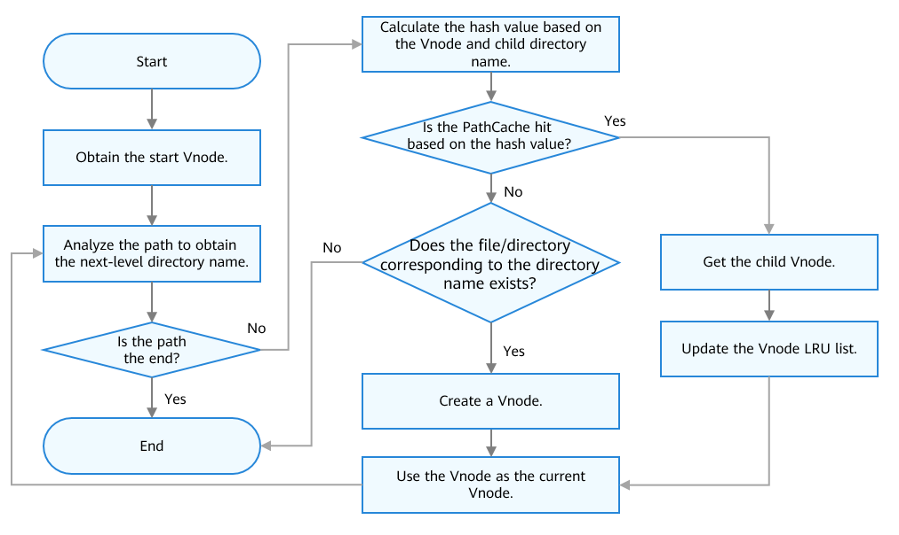

# Virtual File System


## Basic Concepts<a name="section1253851143520"></a>

The Virtual File System \(VFS\) is not a real file system. It is an abstract layer on top of a heterogeneous file system and provides you with a unified Unix-like file operation interface. Different types of file systems provide different interfaces. If there are multiple types of file systems in the system, different and non-standard interfaces are required for accessing these file systems. The VFS can be introduced as an abstract layer in the system to harmonize the differences between these heterogeneous file systems. In this way, the system does not need to care about the storage medium and file system type at the bottom layer when accessing a file system.

In the OpenHarmony kernel, the VFS framework is implemented through the tree structure in the memory. Each node of the tree is a  **Vnode**  structure, and the relationship between the parent and child nodes is stored in the  **PathCache**  structure. The VFS provides the following functions:

-   Node query
-   Unified file system invoking \(standard\)

## Working Principles<a name="section14915913123510"></a>

The VFS layer uses function pointers to call different interfaces for different types of file systems to implement standard APIs. It uses the Vnode and PathCache mechanisms to improve path search and file access performance, manages partitions through mount point management, and isolates File Descriptors \(FDs\) between processes through FD management. These mechanisms are briefly described below.

1.  File system function pointer: The VFS uses function pointers to distribute calls to different file systems for underlying operations based on the file system type. Each file system implements a set of Vnode operation, mount point operation, and file operation APIs, and stores them in the corresponding Vnode, mount point, and file structures in the form of function pointer structures, so that the VFS layer can access the Vnode, mount point, and file structures.
2.  Vnode: A Vnode is an abstract encapsulation of a specific file or directory at the VFS layer. It shields the differences between different file systems and implements unified resource management. Vnodes include the following types:

    -   Mount point: used to mount a specific file system, for example,  **/**  and  **/storage**.
    -   Device node: mapping to a device in the  **/dev**  directory, for example,  **/dev/mmcblk0**.
    -   File/Directory node: corresponds to a file or directory in a file system, for example,  **/bin/init**.

    Vnodes are managed using the hash and least recently used \(LRU\) mechanisms. After a system is started, the Vnode cache is preferentially searched in the hash linked list for an access request for a file or directory. If the cache is not hit, the target file or directory is searched in the corresponding file system, and the corresponding Vnode is created and cached. When the number of cached Vnodes reaches the upper limit, the Vnodes that are not accessed for a long time will be deleted. The mount point Vnodes and device node Vnodes are not deleted. The default number of Vnodes in the system is 512. You can configure the number in  **LOSCFG\_MAX\_VNODE\_SIZE**. Increasing the value can improve search performance but causes high memory usage. The following figure shows the process of creating a Vnode.

    **Figure  1**  Process of creating a Vnode<a name="fig1453197573"></a>  
    


1.  PathCache: The PathCache is a path cache. It is stored in a hash table. Based on the address of the parent Vnode and the file name of the child node in the PathCache, the Vnode corresponding to the child node can be quickly found. The following figure shows how a file or directory is located.

    **Figure  2**  Process of locating a file<a name="fig1881815597396"></a>  
    


1.  PageCache: The PageCache is a cache of files in the kernel. Currently, the PageCache can cache only binary files. When a file is accessed for the first time, the file is mapped to the memory using  **mmap**. When the file is accessed the next time, the file can be directly read from the PageCache. This accelerates the file read and write speed. In addition, PageCache helps implement IPC based on files.
2.  FD management: An FD uniquely identifies an open file or directory in an OS. The OpenHarmony has 896 FDs in the following categories:

    -   512 file descriptors
    -   128 socket descriptors
    -   256 message queue descriptors

    In the OpenHarmony kernel, the FDs of different processes are isolated. That is, a process can access only its own FD. The FDs of all processes are mapped to a global FD table for unified allocation and management. The maximum number of process file descriptors is 256.

3.  Mount point management: The OpenHarmony kernel manages all mount points in a linked list. The mount point structure records all Vnodes in the mounted partition. When a partition is unmounted, all Vnodes in the partition are released.

## Development Guidelines<a name="section1759563620358"></a>

### Available APIs<a name="section17865142133511"></a>

In the following table, "√" indicates that the corresponding file system supports the API, and "×" indicates that the corresponding file system does not support the API.

**Table  1**  File system APIs

<a name="table17301515163415"></a>
<table><thead align="left"><tr id="row1730115183416"><th class="cellrowborder" valign="top" width="22.547745225477453%" id="mcps1.2.9.1.1"><p id="p830131563412"><a name="p830131563412"></a><a name="p830131563412"></a>Function</p>
</th>
<th class="cellrowborder" valign="top" width="22.547745225477453%" id="mcps1.2.9.1.2"><p id="p43011512345"><a name="p43011512345"></a><a name="p43011512345"></a>API</p>
</th>
<th class="cellrowborder" valign="top" width="22.547745225477453%" id="mcps1.2.9.1.3"><p id="p1130101519342"><a name="p1130101519342"></a><a name="p1130101519342"></a>Description</p>
</th>
<th class="cellrowborder" valign="top" width="5.499450054994501%" id="mcps1.2.9.1.4"><p id="p107591639173415"><a name="p107591639173415"></a><a name="p107591639173415"></a>FAT</p>
</th>
<th class="cellrowborder" valign="top" width="5.949405059494051%" id="mcps1.2.9.1.5"><p id="p540384933412"><a name="p540384933412"></a><a name="p540384933412"></a>JFFS2</p>
</th>
<th class="cellrowborder" valign="top" width="6.419358064193579%" id="mcps1.2.9.1.6"><p id="p1912513588343"><a name="p1912513588343"></a><a name="p1912513588343"></a>NFS</p>
</th>
<th class="cellrowborder" valign="top" width="6.95930406959304%" id="mcps1.2.9.1.7"><p id="p1057755183515"><a name="p1057755183515"></a><a name="p1057755183515"></a>TMPFS</p>
</th>
<th class="cellrowborder" valign="top" width="7.529247075292471%" id="mcps1.2.9.1.8"><p id="p25201318183510"><a name="p25201318183510"></a><a name="p25201318183510"></a>PROCFS</p>
</th>
</tr>
</thead>
<tbody><tr id="row53018152343"><td class="cellrowborder" rowspan="16" valign="top" width="22.547745225477453%" headers="mcps1.2.9.1.1 "><p id="p151510381154"><a name="p151510381154"></a><a name="p151510381154"></a>File management</p>
</td>
<td class="cellrowborder" valign="top" width="22.547745225477453%" headers="mcps1.2.9.1.2 "><p id="p5302152348"><a name="p5302152348"></a><a name="p5302152348"></a>open</p>
</td>
<td class="cellrowborder" valign="top" width="22.547745225477453%" headers="mcps1.2.9.1.3 "><p id="p8301815103412"><a name="p8301815103412"></a><a name="p8301815103412"></a>Opens a file.</p>
</td>
<td class="cellrowborder" valign="top" width="5.499450054994501%" headers="mcps1.2.9.1.4 "><p id="p294710215329"><a name="p294710215329"></a><a name="p294710215329"></a>√</p>
</td>
<td class="cellrowborder" valign="top" width="5.949405059494051%" headers="mcps1.2.9.1.5 "><p id="p9261258325"><a name="p9261258325"></a><a name="p9261258325"></a>√</p>
</td>
<td class="cellrowborder" valign="top" width="6.419358064193579%" headers="mcps1.2.9.1.6 "><p id="p1531472803219"><a name="p1531472803219"></a><a name="p1531472803219"></a>√</p>
</td>
<td class="cellrowborder" valign="top" width="6.95930406959304%" headers="mcps1.2.9.1.7 "><p id="p1081010131337"><a name="p1081010131337"></a><a name="p1081010131337"></a>√</p>
</td>
<td class="cellrowborder" valign="top" width="7.529247075292471%" headers="mcps1.2.9.1.8 "><p id="p9730516133310"><a name="p9730516133310"></a><a name="p9730516133310"></a>√</p>
</td>
</tr>
<tr id="row1231181593416"><td class="cellrowborder" valign="top" headers="mcps1.2.9.1.1 "><p id="p1631141515344"><a name="p1631141515344"></a><a name="p1631141515344"></a>read/pread/readv/preadv</p>
</td>
<td class="cellrowborder" valign="top" headers="mcps1.2.9.1.2 "><p id="p731115173413"><a name="p731115173413"></a><a name="p731115173413"></a>Reads a file.</p>
</td>
<td class="cellrowborder" valign="top" headers="mcps1.2.9.1.3 "><p id="p49398914559"><a name="p49398914559"></a><a name="p49398914559"></a>√</p>
</td>
<td class="cellrowborder" valign="top" headers="mcps1.2.9.1.4 "><p id="p17960592553"><a name="p17960592553"></a><a name="p17960592553"></a>√</p>
</td>
<td class="cellrowborder" valign="top" headers="mcps1.2.9.1.5 "><p id="p69811093556"><a name="p69811093556"></a><a name="p69811093556"></a>√</p>
</td>
<td class="cellrowborder" valign="top" headers="mcps1.2.9.1.6 "><p id="p1599119915554"><a name="p1599119915554"></a><a name="p1599119915554"></a>√</p>
</td>
<td class="cellrowborder" valign="top" headers="mcps1.2.9.1.7 "><p id="p121101016557"><a name="p121101016557"></a><a name="p121101016557"></a>√</p>
</td>
</tr>
<tr id="row631215173419"><td class="cellrowborder" valign="top" headers="mcps1.2.9.1.1 "><p id="p1312013310440"><a name="p1312013310440"></a><a name="p1312013310440"></a>write/pwrite/writev/pwritev</p>
</td>
<td class="cellrowborder" valign="top" headers="mcps1.2.9.1.2 "><p id="p1631201513418"><a name="p1631201513418"></a><a name="p1631201513418"></a>Writes a file.</p>
</td>
<td class="cellrowborder" valign="top" headers="mcps1.2.9.1.3 "><p id="p1210121018551"><a name="p1210121018551"></a><a name="p1210121018551"></a>√</p>
</td>
<td class="cellrowborder" valign="top" headers="mcps1.2.9.1.4 "><p id="p1120710185512"><a name="p1120710185512"></a><a name="p1120710185512"></a>√</p>
</td>
<td class="cellrowborder" valign="top" headers="mcps1.2.9.1.5 "><p id="p1529510185513"><a name="p1529510185513"></a><a name="p1529510185513"></a>√</p>
</td>
<td class="cellrowborder" valign="top" headers="mcps1.2.9.1.6 "><p id="p133911014559"><a name="p133911014559"></a><a name="p133911014559"></a>√</p>
</td>
<td class="cellrowborder" valign="top" headers="mcps1.2.9.1.7 "><p id="p94881019559"><a name="p94881019559"></a><a name="p94881019559"></a>√</p>
</td>
</tr>
<tr id="row13820154164814"><td class="cellrowborder" valign="top" headers="mcps1.2.9.1.1 "><p id="p1982084154815"><a name="p1982084154815"></a><a name="p1982084154815"></a>lseek</p>
</td>
<td class="cellrowborder" valign="top" headers="mcps1.2.9.1.2 "><p id="p18201148481"><a name="p18201148481"></a><a name="p18201148481"></a>Sets the file offset.</p>
</td>
<td class="cellrowborder" valign="top" headers="mcps1.2.9.1.3 "><p id="p1477251395513"><a name="p1477251395513"></a><a name="p1477251395513"></a>√</p>
</td>
<td class="cellrowborder" valign="top" headers="mcps1.2.9.1.4 "><p id="p979119136551"><a name="p979119136551"></a><a name="p979119136551"></a>√</p>
</td>
<td class="cellrowborder" valign="top" headers="mcps1.2.9.1.5 "><p id="p138102013175517"><a name="p138102013175517"></a><a name="p138102013175517"></a>√</p>
</td>
<td class="cellrowborder" valign="top" headers="mcps1.2.9.1.6 "><p id="p482041319556"><a name="p482041319556"></a><a name="p482041319556"></a>√</p>
</td>
<td class="cellrowborder" valign="top" headers="mcps1.2.9.1.7 "><p id="p4667132210334"><a name="p4667132210334"></a><a name="p4667132210334"></a>×</p>
</td>
</tr>
<tr id="row18311215103413"><td class="cellrowborder" valign="top" headers="mcps1.2.9.1.1 "><p id="p29893124420"><a name="p29893124420"></a><a name="p29893124420"></a>close</p>
</td>
<td class="cellrowborder" valign="top" headers="mcps1.2.9.1.2 "><p id="p16317151345"><a name="p16317151345"></a><a name="p16317151345"></a>Closes a file.</p>
</td>
<td class="cellrowborder" valign="top" headers="mcps1.2.9.1.3 "><p id="p1830101311552"><a name="p1830101311552"></a><a name="p1830101311552"></a>√</p>
</td>
<td class="cellrowborder" valign="top" headers="mcps1.2.9.1.4 "><p id="p083916133557"><a name="p083916133557"></a><a name="p083916133557"></a>√</p>
</td>
<td class="cellrowborder" valign="top" headers="mcps1.2.9.1.5 "><p id="p7848141318556"><a name="p7848141318556"></a><a name="p7848141318556"></a>√</p>
</td>
<td class="cellrowborder" valign="top" headers="mcps1.2.9.1.6 "><p id="p98581213135515"><a name="p98581213135515"></a><a name="p98581213135515"></a>√</p>
</td>
<td class="cellrowborder" valign="top" headers="mcps1.2.9.1.7 "><p id="p1422632414334"><a name="p1422632414334"></a><a name="p1422632414334"></a>√</p>
</td>
</tr>
<tr id="row1775494216429"><td class="cellrowborder" valign="top" headers="mcps1.2.9.1.1 "><p id="p2755144216427"><a name="p2755144216427"></a><a name="p2755144216427"></a>unlink</p>
</td>
<td class="cellrowborder" valign="top" headers="mcps1.2.9.1.2 "><p id="p1475534213424"><a name="p1475534213424"></a><a name="p1475534213424"></a>Deletes a file.</p>
</td>
<td class="cellrowborder" valign="top" headers="mcps1.2.9.1.3 "><p id="p11868171355516"><a name="p11868171355516"></a><a name="p11868171355516"></a>√</p>
</td>
<td class="cellrowborder" valign="top" headers="mcps1.2.9.1.4 "><p id="p78771813175517"><a name="p78771813175517"></a><a name="p78771813175517"></a>√</p>
</td>
<td class="cellrowborder" valign="top" headers="mcps1.2.9.1.5 "><p id="p488641355510"><a name="p488641355510"></a><a name="p488641355510"></a>√</p>
</td>
<td class="cellrowborder" valign="top" headers="mcps1.2.9.1.6 "><p id="p12895121315517"><a name="p12895121315517"></a><a name="p12895121315517"></a>√</p>
</td>
<td class="cellrowborder" valign="top" headers="mcps1.2.9.1.7 "><p id="p51901414341"><a name="p51901414341"></a><a name="p51901414341"></a>×</p>
</td>
</tr>
<tr id="row730533465319"><td class="cellrowborder" valign="top" headers="mcps1.2.9.1.1 "><p id="p134325815218"><a name="p134325815218"></a><a name="p134325815218"></a>fstat</p>
</td>
<td class="cellrowborder" valign="top" headers="mcps1.2.9.1.2 "><p id="p03438583528"><a name="p03438583528"></a><a name="p03438583528"></a>Queries file information.</p>
</td>
<td class="cellrowborder" valign="top" headers="mcps1.2.9.1.3 "><p id="p190418132555"><a name="p190418132555"></a><a name="p190418132555"></a>√</p>
</td>
<td class="cellrowborder" valign="top" headers="mcps1.2.9.1.4 "><p id="p109131713145518"><a name="p109131713145518"></a><a name="p109131713145518"></a>√</p>
</td>
<td class="cellrowborder" valign="top" headers="mcps1.2.9.1.5 "><p id="p20922161345511"><a name="p20922161345511"></a><a name="p20922161345511"></a>√</p>
</td>
<td class="cellrowborder" valign="top" headers="mcps1.2.9.1.6 "><p id="p129311134558"><a name="p129311134558"></a><a name="p129311134558"></a>√</p>
</td>
<td class="cellrowborder" valign="top" headers="mcps1.2.9.1.7 "><p id="p1634395895213"><a name="p1634395895213"></a><a name="p1634395895213"></a>√</p>
</td>
</tr>
<tr id="row12854143815611"><td class="cellrowborder" valign="top" headers="mcps1.2.9.1.1 "><p id="p12854123817564"><a name="p12854123817564"></a><a name="p12854123817564"></a>fallocate</p>
</td>
<td class="cellrowborder" valign="top" headers="mcps1.2.9.1.2 "><p id="p158541938165619"><a name="p158541938165619"></a><a name="p158541938165619"></a>Pre-allocates a file.</p>
</td>
<td class="cellrowborder" valign="top" headers="mcps1.2.9.1.3 "><p id="p2092312119324"><a name="p2092312119324"></a><a name="p2092312119324"></a>√</p>
</td>
<td class="cellrowborder" valign="top" headers="mcps1.2.9.1.4 "><p id="p58541638155611"><a name="p58541638155611"></a><a name="p58541638155611"></a>×</p>
</td>
<td class="cellrowborder" valign="top" headers="mcps1.2.9.1.5 "><p id="p485410387565"><a name="p485410387565"></a><a name="p485410387565"></a>×</p>
</td>
<td class="cellrowborder" valign="top" headers="mcps1.2.9.1.6 "><p id="p9250515446"><a name="p9250515446"></a><a name="p9250515446"></a>×</p>
</td>
<td class="cellrowborder" valign="top" headers="mcps1.2.9.1.7 "><p id="p12178113643319"><a name="p12178113643319"></a><a name="p12178113643319"></a>×</p>
</td>
</tr>
<tr id="row231161563416"><td class="cellrowborder" valign="top" headers="mcps1.2.9.1.1 "><p id="p15311154341"><a name="p15311154341"></a><a name="p15311154341"></a>truncate</p>
</td>
<td class="cellrowborder" valign="top" headers="mcps1.2.9.1.2 "><p id="p73111513417"><a name="p73111513417"></a><a name="p73111513417"></a>Truncates a file.</p>
</td>
<td class="cellrowborder" valign="top" headers="mcps1.2.9.1.3 "><p id="p4553163085512"><a name="p4553163085512"></a><a name="p4553163085512"></a>√</p>
</td>
<td class="cellrowborder" valign="top" headers="mcps1.2.9.1.4 "><p id="p155722303558"><a name="p155722303558"></a><a name="p155722303558"></a>√</p>
</td>
<td class="cellrowborder" valign="top" headers="mcps1.2.9.1.5 "><p id="p01250585343"><a name="p01250585343"></a><a name="p01250585343"></a>×</p>
</td>
<td class="cellrowborder" valign="top" headers="mcps1.2.9.1.6 "><p id="p815106143319"><a name="p815106143319"></a><a name="p815106143319"></a>√</p>
</td>
<td class="cellrowborder" valign="top" headers="mcps1.2.9.1.7 "><p id="p20697173810337"><a name="p20697173810337"></a><a name="p20697173810337"></a>×</p>
</td>
</tr>
<tr id="row931815133419"><td class="cellrowborder" valign="top" headers="mcps1.2.9.1.1 "><p id="p63151593415"><a name="p63151593415"></a><a name="p63151593415"></a>link</p>
</td>
<td class="cellrowborder" valign="top" headers="mcps1.2.9.1.2 "><p id="p1631101523414"><a name="p1631101523414"></a><a name="p1631101523414"></a>Creates a hard link.</p>
</td>
<td class="cellrowborder" valign="top" headers="mcps1.2.9.1.3 "><p id="p18718522143115"><a name="p18718522143115"></a><a name="p18718522143115"></a>×</p>
</td>
<td class="cellrowborder" valign="top" headers="mcps1.2.9.1.4 "><p id="p1147101520321"><a name="p1147101520321"></a><a name="p1147101520321"></a>√</p>
</td>
<td class="cellrowborder" valign="top" headers="mcps1.2.9.1.5 "><p id="p17125185815342"><a name="p17125185815342"></a><a name="p17125185815342"></a>×</p>
</td>
<td class="cellrowborder" valign="top" headers="mcps1.2.9.1.6 "><p id="p1985892113312"><a name="p1985892113312"></a><a name="p1985892113312"></a>×</p>
</td>
<td class="cellrowborder" valign="top" headers="mcps1.2.9.1.7 "><p id="p17342840113315"><a name="p17342840113315"></a><a name="p17342840113315"></a>×</p>
</td>
</tr>
<tr id="row131151523420"><td class="cellrowborder" valign="top" headers="mcps1.2.9.1.1 "><p id="p113251513342"><a name="p113251513342"></a><a name="p113251513342"></a>symlink</p>
</td>
<td class="cellrowborder" valign="top" headers="mcps1.2.9.1.2 "><p id="p1832215133420"><a name="p1832215133420"></a><a name="p1832215133420"></a>Creates a soft link (also called symbolic link).</p>
</td>
<td class="cellrowborder" valign="top" headers="mcps1.2.9.1.3 "><p id="p5780143585510"><a name="p5780143585510"></a><a name="p5780143585510"></a>√</p>
</td>
<td class="cellrowborder" valign="top" headers="mcps1.2.9.1.4 "><p id="p1879183525516"><a name="p1879183525516"></a><a name="p1879183525516"></a>√</p>
</td>
<td class="cellrowborder" valign="top" headers="mcps1.2.9.1.5 "><p id="p412505873415"><a name="p412505873415"></a><a name="p412505873415"></a>×</p>
</td>
<td class="cellrowborder" valign="top" headers="mcps1.2.9.1.6 "><p id="p13207802451"><a name="p13207802451"></a><a name="p13207802451"></a>×</p>
</td>
<td class="cellrowborder" valign="top" headers="mcps1.2.9.1.7 "><p id="p1947920415337"><a name="p1947920415337"></a><a name="p1947920415337"></a>×</p>
</td>
</tr>
<tr id="row382917545412"><td class="cellrowborder" valign="top" headers="mcps1.2.9.1.1 "><p id="p158308546414"><a name="p158308546414"></a><a name="p158308546414"></a>readline</p>
</td>
<td class="cellrowborder" valign="top" headers="mcps1.2.9.1.2 "><p id="p58301454144111"><a name="p58301454144111"></a><a name="p58301454144111"></a>Reads a soft link.</p>
</td>
<td class="cellrowborder" valign="top" headers="mcps1.2.9.1.3 "><p id="p14802935155512"><a name="p14802935155512"></a><a name="p14802935155512"></a>√</p>
</td>
<td class="cellrowborder" valign="top" headers="mcps1.2.9.1.4 "><p id="p8812193535516"><a name="p8812193535516"></a><a name="p8812193535516"></a>√</p>
</td>
<td class="cellrowborder" valign="top" headers="mcps1.2.9.1.5 "><p id="p68301754134120"><a name="p68301754134120"></a><a name="p68301754134120"></a>×</p>
</td>
<td class="cellrowborder" valign="top" headers="mcps1.2.9.1.6 "><p id="p132078004517"><a name="p132078004517"></a><a name="p132078004517"></a>×</p>
</td>
<td class="cellrowborder" valign="top" headers="mcps1.2.9.1.7 "><p id="p147954143315"><a name="p147954143315"></a><a name="p147954143315"></a>×</p>
</td>
</tr>
<tr id="row1511111910388"><td class="cellrowborder" valign="top" headers="mcps1.2.9.1.1 "><p id="p143496410465"><a name="p143496410465"></a><a name="p143496410465"></a>dup</p>
</td>
<td class="cellrowborder" valign="top" headers="mcps1.2.9.1.2 "><p id="p17349942461"><a name="p17349942461"></a><a name="p17349942461"></a>Copies a file handle.</p>
</td>
<td class="cellrowborder" valign="top" headers="mcps1.2.9.1.3 "><p id="p1299875075513"><a name="p1299875075513"></a><a name="p1299875075513"></a>√</p>
</td>
<td class="cellrowborder" valign="top" headers="mcps1.2.9.1.4 "><p id="p5183517557"><a name="p5183517557"></a><a name="p5183517557"></a>√</p>
</td>
<td class="cellrowborder" valign="top" headers="mcps1.2.9.1.5 "><p id="p133845110558"><a name="p133845110558"></a><a name="p133845110558"></a>√</p>
</td>
<td class="cellrowborder" valign="top" headers="mcps1.2.9.1.6 "><p id="p15488511558"><a name="p15488511558"></a><a name="p15488511558"></a>√</p>
</td>
<td class="cellrowborder" valign="top" headers="mcps1.2.9.1.7 "><p id="p15817510554"><a name="p15817510554"></a><a name="p15817510554"></a>√</p>
</td>
</tr>
<tr id="row512919173399"><td class="cellrowborder" valign="top" headers="mcps1.2.9.1.1 "><p id="p350604555614"><a name="p350604555614"></a><a name="p350604555614"></a>fsync</p>
</td>
<td class="cellrowborder" valign="top" headers="mcps1.2.9.1.2 "><p id="p12506184516569"><a name="p12506184516569"></a><a name="p12506184516569"></a>Saves the update of a file to a device.</p>
</td>
<td class="cellrowborder" valign="top" headers="mcps1.2.9.1.3 "><p id="p13875181213213"><a name="p13875181213213"></a><a name="p13875181213213"></a>√</p>
</td>
<td class="cellrowborder" valign="top" headers="mcps1.2.9.1.4 "><p id="p0506145165613"><a name="p0506145165613"></a><a name="p0506145165613"></a>×</p>
</td>
<td class="cellrowborder" valign="top" headers="mcps1.2.9.1.5 "><p id="p6506124555620"><a name="p6506124555620"></a><a name="p6506124555620"></a>×</p>
</td>
<td class="cellrowborder" valign="top" headers="mcps1.2.9.1.6 "><p id="p1925165204418"><a name="p1925165204418"></a><a name="p1925165204418"></a>×</p>
</td>
<td class="cellrowborder" valign="top" headers="mcps1.2.9.1.7 "><p id="p1795065310333"><a name="p1795065310333"></a><a name="p1795065310333"></a>×</p>
</td>
</tr>
<tr id="row11374165313411"><td class="cellrowborder" valign="top" headers="mcps1.2.9.1.1 "><p id="p3724551105613"><a name="p3724551105613"></a><a name="p3724551105613"></a>ioctl</p>
</td>
<td class="cellrowborder" valign="top" headers="mcps1.2.9.1.2 "><p id="p8724165112564"><a name="p8724165112564"></a><a name="p8724165112564"></a>Controls a device.</p>
</td>
<td class="cellrowborder" valign="top" headers="mcps1.2.9.1.3 "><p id="p8724251165616"><a name="p8724251165616"></a><a name="p8724251165616"></a>×</p>
</td>
<td class="cellrowborder" valign="top" headers="mcps1.2.9.1.4 "><p id="p2725185119569"><a name="p2725185119569"></a><a name="p2725185119569"></a>×</p>
</td>
<td class="cellrowborder" valign="top" headers="mcps1.2.9.1.5 "><p id="p6725125118565"><a name="p6725125118565"></a><a name="p6725125118565"></a>×</p>
</td>
<td class="cellrowborder" valign="top" headers="mcps1.2.9.1.6 "><p id="p172511584419"><a name="p172511584419"></a><a name="p172511584419"></a>√</p>
</td>
<td class="cellrowborder" valign="top" headers="mcps1.2.9.1.7 "><p id="p795045363314"><a name="p795045363314"></a><a name="p795045363314"></a>×</p>
</td>
</tr>
<tr id="row1566230193619"><td class="cellrowborder" valign="top" headers="mcps1.2.9.1.1 "><p id="p8804322192315"><a name="p8804322192315"></a><a name="p8804322192315"></a>fcntl</p>
</td>
<td class="cellrowborder" valign="top" headers="mcps1.2.9.1.2 "><p id="p2891723102316"><a name="p2891723102316"></a><a name="p2891723102316"></a>Performs file control operations.</p>
</td>
<td class="cellrowborder" valign="top" headers="mcps1.2.9.1.3 "><p id="p16968175595517"><a name="p16968175595517"></a><a name="p16968175595517"></a>√</p>
</td>
<td class="cellrowborder" valign="top" headers="mcps1.2.9.1.4 "><p id="p69788557556"><a name="p69788557556"></a><a name="p69788557556"></a>√</p>
</td>
<td class="cellrowborder" valign="top" headers="mcps1.2.9.1.5 "><p id="p4987135555516"><a name="p4987135555516"></a><a name="p4987135555516"></a>√</p>
</td>
<td class="cellrowborder" valign="top" headers="mcps1.2.9.1.6 "><p id="p1599755565514"><a name="p1599755565514"></a><a name="p1599755565514"></a>√</p>
</td>
<td class="cellrowborder" valign="top" headers="mcps1.2.9.1.7 "><p id="p551453173620"><a name="p551453173620"></a><a name="p551453173620"></a>√</p>
</td>
</tr>
<tr id="row98781157114116"><td class="cellrowborder" rowspan="17" valign="top" width="22.547745225477453%" headers="mcps1.2.9.1.1 "><p id="p10322754163618"><a name="p10322754163618"></a><a name="p10322754163618"></a>Directory management</p>
</td>
<td class="cellrowborder" valign="top" width="22.547745225477453%" headers="mcps1.2.9.1.2 "><p id="p98795579417"><a name="p98795579417"></a><a name="p98795579417"></a>mkdir</p>
</td>
<td class="cellrowborder" valign="top" width="22.547745225477453%" headers="mcps1.2.9.1.3 "><p id="p12879757144119"><a name="p12879757144119"></a><a name="p12879757144119"></a>Creates a directory.</p>
</td>
<td class="cellrowborder" valign="top" width="5.499450054994501%" headers="mcps1.2.9.1.4 "><p id="p1361756205516"><a name="p1361756205516"></a><a name="p1361756205516"></a>√</p>
</td>
<td class="cellrowborder" valign="top" width="5.949405059494051%" headers="mcps1.2.9.1.5 "><p id="p717956115512"><a name="p717956115512"></a><a name="p717956115512"></a>√</p>
</td>
<td class="cellrowborder" valign="top" width="6.419358064193579%" headers="mcps1.2.9.1.6 "><p id="p32813566552"><a name="p32813566552"></a><a name="p32813566552"></a>√</p>
</td>
<td class="cellrowborder" valign="top" width="6.95930406959304%" headers="mcps1.2.9.1.7 "><p id="p537115611555"><a name="p537115611555"></a><a name="p537115611555"></a>√</p>
</td>
<td class="cellrowborder" valign="top" width="7.529247075292471%" headers="mcps1.2.9.1.8 "><p id="p9879165719415"><a name="p9879165719415"></a><a name="p9879165719415"></a>×</p>
</td>
</tr>
<tr id="row362155116544"><td class="cellrowborder" valign="top" headers="mcps1.2.9.1.1 "><p id="p166210511546"><a name="p166210511546"></a><a name="p166210511546"></a>opendir</p>
</td>
<td class="cellrowborder" valign="top" headers="mcps1.2.9.1.2 "><p id="p11621651135417"><a name="p11621651135417"></a><a name="p11621651135417"></a>Opens a directory.</p>
</td>
<td class="cellrowborder" valign="top" headers="mcps1.2.9.1.3 "><p id="p1863161175612"><a name="p1863161175612"></a><a name="p1863161175612"></a>√</p>
</td>
<td class="cellrowborder" valign="top" headers="mcps1.2.9.1.4 "><p id="p16655191105612"><a name="p16655191105612"></a><a name="p16655191105612"></a>√</p>
</td>
<td class="cellrowborder" valign="top" headers="mcps1.2.9.1.5 "><p id="p267518118566"><a name="p267518118566"></a><a name="p267518118566"></a>√</p>
</td>
<td class="cellrowborder" valign="top" headers="mcps1.2.9.1.6 "><p id="p18686011561"><a name="p18686011561"></a><a name="p18686011561"></a>√</p>
</td>
<td class="cellrowborder" valign="top" headers="mcps1.2.9.1.7 "><p id="p369611105616"><a name="p369611105616"></a><a name="p369611105616"></a>√</p>
</td>
</tr>
<tr id="row183271724212"><td class="cellrowborder" valign="top" headers="mcps1.2.9.1.1 "><p id="p23313179429"><a name="p23313179429"></a><a name="p23313179429"></a>readdir</p>
</td>
<td class="cellrowborder" valign="top" headers="mcps1.2.9.1.2 "><p id="p1433617124218"><a name="p1433617124218"></a><a name="p1433617124218"></a>Reads a directory.</p>
</td>
<td class="cellrowborder" valign="top" headers="mcps1.2.9.1.3 "><p id="p1470631135613"><a name="p1470631135613"></a><a name="p1470631135613"></a>√</p>
</td>
<td class="cellrowborder" valign="top" headers="mcps1.2.9.1.4 "><p id="p0715810565"><a name="p0715810565"></a><a name="p0715810565"></a>√</p>
</td>
<td class="cellrowborder" valign="top" headers="mcps1.2.9.1.5 "><p id="p67251414566"><a name="p67251414566"></a><a name="p67251414566"></a>√</p>
</td>
<td class="cellrowborder" valign="top" headers="mcps1.2.9.1.6 "><p id="p14734511565"><a name="p14734511565"></a><a name="p14734511565"></a>√</p>
</td>
<td class="cellrowborder" valign="top" headers="mcps1.2.9.1.7 "><p id="p1474419165617"><a name="p1474419165617"></a><a name="p1474419165617"></a>√</p>
</td>
</tr>
<tr id="row11310111512553"><td class="cellrowborder" valign="top" headers="mcps1.2.9.1.1 "><p id="p183101215155514"><a name="p183101215155514"></a><a name="p183101215155514"></a>closedir</p>
</td>
<td class="cellrowborder" valign="top" headers="mcps1.2.9.1.2 "><p id="p2031018155555"><a name="p2031018155555"></a><a name="p2031018155555"></a>Closes a directory.</p>
</td>
<td class="cellrowborder" valign="top" headers="mcps1.2.9.1.3 "><p id="p177544125617"><a name="p177544125617"></a><a name="p177544125617"></a>√</p>
</td>
<td class="cellrowborder" valign="top" headers="mcps1.2.9.1.4 "><p id="p576311175619"><a name="p576311175619"></a><a name="p576311175619"></a>√</p>
</td>
<td class="cellrowborder" valign="top" headers="mcps1.2.9.1.5 "><p id="p18772171115612"><a name="p18772171115612"></a><a name="p18772171115612"></a>√</p>
</td>
<td class="cellrowborder" valign="top" headers="mcps1.2.9.1.6 "><p id="p1978310112562"><a name="p1978310112562"></a><a name="p1978310112562"></a>√</p>
</td>
<td class="cellrowborder" valign="top" headers="mcps1.2.9.1.7 "><p id="p27921517569"><a name="p27921517569"></a><a name="p27921517569"></a>√</p>
</td>
</tr>
<tr id="row1774355219252"><td class="cellrowborder" valign="top" headers="mcps1.2.9.1.1 "><p id="p1074365218251"><a name="p1074365218251"></a><a name="p1074365218251"></a>telldir</p>
</td>
<td class="cellrowborder" valign="top" headers="mcps1.2.9.1.2 "><p id="p5743125232520"><a name="p5743125232520"></a><a name="p5743125232520"></a>Obtains the directory offset.</p>
</td>
<td class="cellrowborder" valign="top" headers="mcps1.2.9.1.3 "><p id="p1880251135614"><a name="p1880251135614"></a><a name="p1880251135614"></a>√</p>
</td>
<td class="cellrowborder" valign="top" headers="mcps1.2.9.1.4 "><p id="p681110105618"><a name="p681110105618"></a><a name="p681110105618"></a>√</p>
</td>
<td class="cellrowborder" valign="top" headers="mcps1.2.9.1.5 "><p id="p1682112135612"><a name="p1682112135612"></a><a name="p1682112135612"></a>√</p>
</td>
<td class="cellrowborder" valign="top" headers="mcps1.2.9.1.6 "><p id="p1583019165610"><a name="p1583019165610"></a><a name="p1583019165610"></a>√</p>
</td>
<td class="cellrowborder" valign="top" headers="mcps1.2.9.1.7 "><p id="p148397175618"><a name="p148397175618"></a><a name="p148397175618"></a>√</p>
</td>
</tr>
<tr id="row463867132610"><td class="cellrowborder" valign="top" headers="mcps1.2.9.1.1 "><p id="p463919772612"><a name="p463919772612"></a><a name="p463919772612"></a>seekdir</p>
</td>
<td class="cellrowborder" valign="top" headers="mcps1.2.9.1.2 "><p id="p163917702620"><a name="p163917702620"></a><a name="p163917702620"></a>Sets the directory offset.</p>
</td>
<td class="cellrowborder" valign="top" headers="mcps1.2.9.1.3 "><p id="p08494113563"><a name="p08494113563"></a><a name="p08494113563"></a>√</p>
</td>
<td class="cellrowborder" valign="top" headers="mcps1.2.9.1.4 "><p id="p19858121175618"><a name="p19858121175618"></a><a name="p19858121175618"></a>√</p>
</td>
<td class="cellrowborder" valign="top" headers="mcps1.2.9.1.5 "><p id="p16867131175616"><a name="p16867131175616"></a><a name="p16867131175616"></a>√</p>
</td>
<td class="cellrowborder" valign="top" headers="mcps1.2.9.1.6 "><p id="p487621145618"><a name="p487621145618"></a><a name="p487621145618"></a>√</p>
</td>
<td class="cellrowborder" valign="top" headers="mcps1.2.9.1.7 "><p id="p1088611118566"><a name="p1088611118566"></a><a name="p1088611118566"></a>√</p>
</td>
</tr>
<tr id="row1361903616456"><td class="cellrowborder" valign="top" headers="mcps1.2.9.1.1 "><p id="p186191936144513"><a name="p186191936144513"></a><a name="p186191936144513"></a>rewinddir</p>
</td>
<td class="cellrowborder" valign="top" headers="mcps1.2.9.1.2 "><p id="p186198365451"><a name="p186198365451"></a><a name="p186198365451"></a>Resets the directory offset.</p>
</td>
<td class="cellrowborder" valign="top" headers="mcps1.2.9.1.3 "><p id="p82717515564"><a name="p82717515564"></a><a name="p82717515564"></a>√</p>
</td>
<td class="cellrowborder" valign="top" headers="mcps1.2.9.1.4 "><p id="p1128175145610"><a name="p1128175145610"></a><a name="p1128175145610"></a>√</p>
</td>
<td class="cellrowborder" valign="top" headers="mcps1.2.9.1.5 "><p id="p729113545616"><a name="p729113545616"></a><a name="p729113545616"></a>√</p>
</td>
<td class="cellrowborder" valign="top" headers="mcps1.2.9.1.6 "><p id="p163003585620"><a name="p163003585620"></a><a name="p163003585620"></a>√</p>
</td>
<td class="cellrowborder" valign="top" headers="mcps1.2.9.1.7 "><p id="p10950175314334"><a name="p10950175314334"></a><a name="p10950175314334"></a>×</p>
</td>
</tr>
<tr id="row1145016117201"><td class="cellrowborder" valign="top" headers="mcps1.2.9.1.1 "><p id="p9545171282019"><a name="p9545171282019"></a><a name="p9545171282019"></a>scandir</p>
</td>
<td class="cellrowborder" valign="top" headers="mcps1.2.9.1.2 "><p id="p9451131102012"><a name="p9451131102012"></a><a name="p9451131102012"></a>Reads directory data.</p>
</td>
<td class="cellrowborder" valign="top" headers="mcps1.2.9.1.3 "><p id="p230917512566"><a name="p230917512566"></a><a name="p230917512566"></a>√</p>
</td>
<td class="cellrowborder" valign="top" headers="mcps1.2.9.1.4 "><p id="p1831815155615"><a name="p1831815155615"></a><a name="p1831815155615"></a>√</p>
</td>
<td class="cellrowborder" valign="top" headers="mcps1.2.9.1.5 "><p id="p53275555611"><a name="p53275555611"></a><a name="p53275555611"></a>√</p>
</td>
<td class="cellrowborder" valign="top" headers="mcps1.2.9.1.6 "><p id="p1033611512565"><a name="p1033611512565"></a><a name="p1033611512565"></a>√</p>
</td>
<td class="cellrowborder" valign="top" headers="mcps1.2.9.1.7 "><p id="p345131118206"><a name="p345131118206"></a><a name="p345131118206"></a>√</p>
</td>
</tr>
<tr id="row623472084218"><td class="cellrowborder" valign="top" headers="mcps1.2.9.1.1 "><p id="p92341220134219"><a name="p92341220134219"></a><a name="p92341220134219"></a>rmdir</p>
</td>
<td class="cellrowborder" valign="top" headers="mcps1.2.9.1.2 "><p id="p1234220144217"><a name="p1234220144217"></a><a name="p1234220144217"></a>Deletes a directory.</p>
</td>
<td class="cellrowborder" valign="top" headers="mcps1.2.9.1.3 "><p id="p1034615175618"><a name="p1034615175618"></a><a name="p1034615175618"></a>√</p>
</td>
<td class="cellrowborder" valign="top" headers="mcps1.2.9.1.4 "><p id="p123567595611"><a name="p123567595611"></a><a name="p123567595611"></a>√</p>
</td>
<td class="cellrowborder" valign="top" headers="mcps1.2.9.1.5 "><p id="p63654555619"><a name="p63654555619"></a><a name="p63654555619"></a>√</p>
</td>
<td class="cellrowborder" valign="top" headers="mcps1.2.9.1.6 "><p id="p1737485135619"><a name="p1737485135619"></a><a name="p1737485135619"></a>√</p>
</td>
<td class="cellrowborder" valign="top" headers="mcps1.2.9.1.7 "><p id="p179508533337"><a name="p179508533337"></a><a name="p179508533337"></a>×</p>
</td>
</tr>
<tr id="row1991017101176"><td class="cellrowborder" valign="top" headers="mcps1.2.9.1.1 "><p id="p09101210171712"><a name="p09101210171712"></a><a name="p09101210171712"></a>chdir</p>
</td>
<td class="cellrowborder" valign="top" headers="mcps1.2.9.1.2 "><p id="p1091014106172"><a name="p1091014106172"></a><a name="p1091014106172"></a>Changes the current directory.</p>
</td>
<td class="cellrowborder" valign="top" headers="mcps1.2.9.1.3 "><p id="p1338219545610"><a name="p1338219545610"></a><a name="p1338219545610"></a>√</p>
</td>
<td class="cellrowborder" valign="top" headers="mcps1.2.9.1.4 "><p id="p173911585618"><a name="p173911585618"></a><a name="p173911585618"></a>√</p>
</td>
<td class="cellrowborder" valign="top" headers="mcps1.2.9.1.5 "><p id="p13400053567"><a name="p13400053567"></a><a name="p13400053567"></a>√</p>
</td>
<td class="cellrowborder" valign="top" headers="mcps1.2.9.1.6 "><p id="p2040916516565"><a name="p2040916516565"></a><a name="p2040916516565"></a>√</p>
</td>
<td class="cellrowborder" valign="top" headers="mcps1.2.9.1.7 "><p id="p497687155612"><a name="p497687155612"></a><a name="p497687155612"></a>√</p>
</td>
</tr>
<tr id="row735414923319"><td class="cellrowborder" valign="top" headers="mcps1.2.9.1.1 "><p id="p19181108339"><a name="p19181108339"></a><a name="p19181108339"></a>getcwd</p>
</td>
<td class="cellrowborder" valign="top" headers="mcps1.2.9.1.2 "><p id="p19354129143316"><a name="p19354129143316"></a><a name="p19354129143316"></a>Obtains the current directory.</p>
</td>
<td class="cellrowborder" valign="top" headers="mcps1.2.9.1.3 "><p id="p5419165105610"><a name="p5419165105610"></a><a name="p5419165105610"></a>√</p>
</td>
<td class="cellrowborder" valign="top" headers="mcps1.2.9.1.4 "><p id="p64281059561"><a name="p64281059561"></a><a name="p64281059561"></a>√</p>
</td>
<td class="cellrowborder" valign="top" headers="mcps1.2.9.1.5 "><p id="p174375585616"><a name="p174375585616"></a><a name="p174375585616"></a>√</p>
</td>
<td class="cellrowborder" valign="top" headers="mcps1.2.9.1.6 "><p id="p5446452567"><a name="p5446452567"></a><a name="p5446452567"></a>√</p>
</td>
<td class="cellrowborder" valign="top" headers="mcps1.2.9.1.7 "><p id="p5986171564"><a name="p5986171564"></a><a name="p5986171564"></a>√</p>
</td>
</tr>
<tr id="row080771185710"><td class="cellrowborder" valign="top" headers="mcps1.2.9.1.1 "><p id="p19826155733610"><a name="p19826155733610"></a><a name="p19826155733610"></a>realpath</p>
</td>
<td class="cellrowborder" valign="top" headers="mcps1.2.9.1.2 "><p id="p766310254365"><a name="p766310254365"></a><a name="p766310254365"></a>Converts between the relative and absolute paths.</p>
</td>
<td class="cellrowborder" valign="top" headers="mcps1.2.9.1.3 "><p id="p04551758568"><a name="p04551758568"></a><a name="p04551758568"></a>√</p>
</td>
<td class="cellrowborder" valign="top" headers="mcps1.2.9.1.4 "><p id="p124644516565"><a name="p124644516565"></a><a name="p124644516565"></a>√</p>
</td>
<td class="cellrowborder" valign="top" headers="mcps1.2.9.1.5 "><p id="p204731052562"><a name="p204731052562"></a><a name="p204731052562"></a>√</p>
</td>
<td class="cellrowborder" valign="top" headers="mcps1.2.9.1.6 "><p id="p34822575610"><a name="p34822575610"></a><a name="p34822575610"></a>√</p>
</td>
<td class="cellrowborder" valign="top" headers="mcps1.2.9.1.7 "><p id="p2996107145611"><a name="p2996107145611"></a><a name="p2996107145611"></a>√</p>
</td>
</tr>
<tr id="row194318220214"><td class="cellrowborder" valign="top" headers="mcps1.2.9.1.1 "><p id="p153666165451"><a name="p153666165451"></a><a name="p153666165451"></a>rename</p>
</td>
<td class="cellrowborder" valign="top" headers="mcps1.2.9.1.2 "><p id="p1136671615455"><a name="p1136671615455"></a><a name="p1136671615455"></a>Renames a file or directory.</p>
</td>
<td class="cellrowborder" valign="top" headers="mcps1.2.9.1.3 "><p id="p349119515619"><a name="p349119515619"></a><a name="p349119515619"></a>√</p>
</td>
<td class="cellrowborder" valign="top" headers="mcps1.2.9.1.4 "><p id="p95004515561"><a name="p95004515561"></a><a name="p95004515561"></a>√</p>
</td>
<td class="cellrowborder" valign="top" headers="mcps1.2.9.1.5 "><p id="p6509253569"><a name="p6509253569"></a><a name="p6509253569"></a>√</p>
</td>
<td class="cellrowborder" valign="top" headers="mcps1.2.9.1.6 "><p id="p155199525619"><a name="p155199525619"></a><a name="p155199525619"></a>√</p>
</td>
<td class="cellrowborder" valign="top" headers="mcps1.2.9.1.7 "><p id="p3342940193313"><a name="p3342940193313"></a><a name="p3342940193313"></a>×</p>
</td>
</tr>
<tr id="row944217272374"><td class="cellrowborder" valign="top" headers="mcps1.2.9.1.1 "><p id="p1044272714376"><a name="p1044272714376"></a><a name="p1044272714376"></a>chmod</p>
</td>
<td class="cellrowborder" valign="top" headers="mcps1.2.9.1.2 "><p id="p1044214273374"><a name="p1044214273374"></a><a name="p1044214273374"></a>Modifies the file or directory property.</p>
</td>
<td class="cellrowborder" valign="top" headers="mcps1.2.9.1.3 "><p id="p43281412135617"><a name="p43281412135617"></a><a name="p43281412135617"></a>√</p>
</td>
<td class="cellrowborder" valign="top" headers="mcps1.2.9.1.4 "><p id="p1234641219566"><a name="p1234641219566"></a><a name="p1234641219566"></a>√</p>
</td>
<td class="cellrowborder" valign="top" headers="mcps1.2.9.1.5 "><p id="p17442927123717"><a name="p17442927123717"></a><a name="p17442927123717"></a>×</p>
</td>
<td class="cellrowborder" valign="top" headers="mcps1.2.9.1.6 "><p id="p1644262714375"><a name="p1644262714375"></a><a name="p1644262714375"></a>×</p>
</td>
<td class="cellrowborder" valign="top" headers="mcps1.2.9.1.7 "><p id="p1844218271376"><a name="p1844218271376"></a><a name="p1844218271376"></a>×</p>
</td>
</tr>
<tr id="row74691154211"><td class="cellrowborder" valign="top" headers="mcps1.2.9.1.1 "><p id="p1747111124210"><a name="p1747111124210"></a><a name="p1747111124210"></a>chown</p>
</td>
<td class="cellrowborder" valign="top" headers="mcps1.2.9.1.2 "><p id="p0471911114215"><a name="p0471911114215"></a><a name="p0471911114215"></a>Changes the file or directory owner.</p>
</td>
<td class="cellrowborder" valign="top" headers="mcps1.2.9.1.3 "><p id="p836713125561"><a name="p836713125561"></a><a name="p836713125561"></a>√</p>
</td>
<td class="cellrowborder" valign="top" headers="mcps1.2.9.1.4 "><p id="p12377171265616"><a name="p12377171265616"></a><a name="p12377171265616"></a>√</p>
</td>
<td class="cellrowborder" valign="top" headers="mcps1.2.9.1.5 "><p id="p122061697438"><a name="p122061697438"></a><a name="p122061697438"></a>×</p>
</td>
<td class="cellrowborder" valign="top" headers="mcps1.2.9.1.6 "><p id="p2206159114316"><a name="p2206159114316"></a><a name="p2206159114316"></a>×</p>
</td>
<td class="cellrowborder" valign="top" headers="mcps1.2.9.1.7 "><p id="p920609134316"><a name="p920609134316"></a><a name="p920609134316"></a>×</p>
</td>
</tr>
<tr id="row1036123420529"><td class="cellrowborder" valign="top" headers="mcps1.2.9.1.1 "><p id="p730583495314"><a name="p730583495314"></a><a name="p730583495314"></a>stat/lstat</p>
</td>
<td class="cellrowborder" valign="top" headers="mcps1.2.9.1.2 "><p id="p1630513410532"><a name="p1630513410532"></a><a name="p1630513410532"></a>Queries file or directory information.</p>
</td>
<td class="cellrowborder" valign="top" headers="mcps1.2.9.1.3 "><p id="p338719123568"><a name="p338719123568"></a><a name="p338719123568"></a>√</p>
</td>
<td class="cellrowborder" valign="top" headers="mcps1.2.9.1.4 "><p id="p113961712125612"><a name="p113961712125612"></a><a name="p113961712125612"></a>√</p>
</td>
<td class="cellrowborder" valign="top" headers="mcps1.2.9.1.5 "><p id="p19388161745612"><a name="p19388161745612"></a><a name="p19388161745612"></a>√</p>
</td>
<td class="cellrowborder" valign="top" headers="mcps1.2.9.1.6 "><p id="p163981517185615"><a name="p163981517185615"></a><a name="p163981517185615"></a>√</p>
</td>
<td class="cellrowborder" valign="top" headers="mcps1.2.9.1.7 "><p id="p16287141955616"><a name="p16287141955616"></a><a name="p16287141955616"></a>√</p>
</td>
</tr>
<tr id="row16466943145113"><td class="cellrowborder" valign="top" headers="mcps1.2.9.1.1 "><p id="p4871175874615"><a name="p4871175874615"></a><a name="p4871175874615"></a>access</p>
</td>
<td class="cellrowborder" valign="top" headers="mcps1.2.9.1.2 "><p id="p187125818465"><a name="p187125818465"></a><a name="p187125818465"></a>Queries the access permission on a file or directory.</p>
</td>
<td class="cellrowborder" valign="top" headers="mcps1.2.9.1.3 "><p id="p240531211562"><a name="p240531211562"></a><a name="p240531211562"></a>√</p>
</td>
<td class="cellrowborder" valign="top" headers="mcps1.2.9.1.4 "><p id="p141515129564"><a name="p141515129564"></a><a name="p141515129564"></a>√</p>
</td>
<td class="cellrowborder" valign="top" headers="mcps1.2.9.1.5 "><p id="p1640821725613"><a name="p1640821725613"></a><a name="p1640821725613"></a>√</p>
</td>
<td class="cellrowborder" valign="top" headers="mcps1.2.9.1.6 "><p id="p114181417125618"><a name="p114181417125618"></a><a name="p114181417125618"></a>√</p>
</td>
<td class="cellrowborder" valign="top" headers="mcps1.2.9.1.7 "><p id="p1829741985617"><a name="p1829741985617"></a><a name="p1829741985617"></a>√</p>
</td>
</tr>
<tr id="row780042214211"><td class="cellrowborder" rowspan="5" valign="top" width="22.547745225477453%" headers="mcps1.2.9.1.1 "><p id="p206804542364"><a name="p206804542364"></a><a name="p206804542364"></a>Partition management</p>
</td>
<td class="cellrowborder" valign="top" width="22.547745225477453%" headers="mcps1.2.9.1.2 "><p id="p1380192264218"><a name="p1380192264218"></a><a name="p1380192264218"></a>mount</p>
</td>
<td class="cellrowborder" valign="top" width="22.547745225477453%" headers="mcps1.2.9.1.3 "><p id="p38011522104210"><a name="p38011522104210"></a><a name="p38011522104210"></a>Mounts a partition.</p>
</td>
<td class="cellrowborder" valign="top" width="5.499450054994501%" headers="mcps1.2.9.1.4 "><p id="p10424191245618"><a name="p10424191245618"></a><a name="p10424191245618"></a>√</p>
</td>
<td class="cellrowborder" valign="top" width="5.949405059494051%" headers="mcps1.2.9.1.5 "><p id="p24341126561"><a name="p24341126561"></a><a name="p24341126561"></a>√</p>
</td>
<td class="cellrowborder" valign="top" width="6.419358064193579%" headers="mcps1.2.9.1.6 "><p id="p3428151785614"><a name="p3428151785614"></a><a name="p3428151785614"></a>√</p>
</td>
<td class="cellrowborder" valign="top" width="6.95930406959304%" headers="mcps1.2.9.1.7 "><p id="p12437111785613"><a name="p12437111785613"></a><a name="p12437111785613"></a>√</p>
</td>
<td class="cellrowborder" valign="top" width="7.529247075292471%" headers="mcps1.2.9.1.8 "><p id="p4307161913563"><a name="p4307161913563"></a><a name="p4307161913563"></a>√</p>
</td>
</tr>
<tr id="row4684182822512"><td class="cellrowborder" valign="top" headers="mcps1.2.9.1.1 "><p id="p1468412813252"><a name="p1468412813252"></a><a name="p1468412813252"></a>umount</p>
</td>
<td class="cellrowborder" valign="top" headers="mcps1.2.9.1.2 "><p id="p26846284258"><a name="p26846284258"></a><a name="p26846284258"></a>Unmounts a partition.</p>
</td>
<td class="cellrowborder" valign="top" headers="mcps1.2.9.1.3 "><p id="p044321275614"><a name="p044321275614"></a><a name="p044321275614"></a>√</p>
</td>
<td class="cellrowborder" valign="top" headers="mcps1.2.9.1.4 "><p id="p84531312125615"><a name="p84531312125615"></a><a name="p84531312125615"></a>√</p>
</td>
<td class="cellrowborder" valign="top" headers="mcps1.2.9.1.5 "><p id="p244720173564"><a name="p244720173564"></a><a name="p244720173564"></a>√</p>
</td>
<td class="cellrowborder" valign="top" headers="mcps1.2.9.1.6 "><p id="p104571517155619"><a name="p104571517155619"></a><a name="p104571517155619"></a>√</p>
</td>
<td class="cellrowborder" valign="top" headers="mcps1.2.9.1.7 "><p id="p173412575334"><a name="p173412575334"></a><a name="p173412575334"></a>×</p>
</td>
</tr>
<tr id="row5177163172511"><td class="cellrowborder" valign="top" headers="mcps1.2.9.1.1 "><p id="p617843117252"><a name="p617843117252"></a><a name="p617843117252"></a>statfs</p>
</td>
<td class="cellrowborder" valign="top" headers="mcps1.2.9.1.2 "><p id="p181781531192519"><a name="p181781531192519"></a><a name="p181781531192519"></a>Queries information about a mounted partition.</p>
</td>
<td class="cellrowborder" valign="top" headers="mcps1.2.9.1.3 "><p id="p144623124566"><a name="p144623124566"></a><a name="p144623124566"></a>√</p>
</td>
<td class="cellrowborder" valign="top" headers="mcps1.2.9.1.4 "><p id="p1747251235611"><a name="p1747251235611"></a><a name="p1747251235611"></a>√</p>
</td>
<td class="cellrowborder" valign="top" headers="mcps1.2.9.1.5 "><p id="p446813179565"><a name="p446813179565"></a><a name="p446813179565"></a>√</p>
</td>
<td class="cellrowborder" valign="top" headers="mcps1.2.9.1.6 "><p id="p147781716561"><a name="p147781716561"></a><a name="p147781716561"></a>√</p>
</td>
<td class="cellrowborder" valign="top" headers="mcps1.2.9.1.7 "><p id="p4178133182515"><a name="p4178133182515"></a><a name="p4178133182515"></a>√</p>
</td>
</tr>
<tr id="row1769881513348"><td class="cellrowborder" valign="top" headers="mcps1.2.9.1.1 "><p id="p156992015143419"><a name="p156992015143419"></a><a name="p156992015143419"></a>format</p>
</td>
<td class="cellrowborder" valign="top" headers="mcps1.2.9.1.2 "><p id="p16935183513394"><a name="p16935183513394"></a><a name="p16935183513394"></a>Formats a partition.</p>
</td>
<td class="cellrowborder" valign="top" headers="mcps1.2.9.1.3 "><p id="p19289615195611"><a name="p19289615195611"></a><a name="p19289615195611"></a>√</p>
</td>
<td class="cellrowborder" valign="top" headers="mcps1.2.9.1.4 "><p id="p14186550113916"><a name="p14186550113916"></a><a name="p14186550113916"></a>×</p>
</td>
<td class="cellrowborder" valign="top" headers="mcps1.2.9.1.5 "><p id="p382435053911"><a name="p382435053911"></a><a name="p382435053911"></a>×</p>
</td>
<td class="cellrowborder" valign="top" headers="mcps1.2.9.1.6 "><p id="p1246615123918"><a name="p1246615123918"></a><a name="p1246615123918"></a>×</p>
</td>
<td class="cellrowborder" valign="top" headers="mcps1.2.9.1.7 "><p id="p13818525391"><a name="p13818525391"></a><a name="p13818525391"></a>×</p>
</td>
</tr>
<tr id="row4270132114219"><td class="cellrowborder" valign="top" headers="mcps1.2.9.1.1 "><p id="p958455012219"><a name="p958455012219"></a><a name="p958455012219"></a>sync</p>
</td>
<td class="cellrowborder" valign="top" headers="mcps1.2.9.1.2 "><p id="p125840501224"><a name="p125840501224"></a><a name="p125840501224"></a>Saves the partition information to a device.</p>
</td>
<td class="cellrowborder" valign="top" headers="mcps1.2.9.1.3 "><p id="p8300115125612"><a name="p8300115125612"></a><a name="p8300115125612"></a>√</p>
</td>
<td class="cellrowborder" valign="top" headers="mcps1.2.9.1.4 "><p id="p25044812404"><a name="p25044812404"></a><a name="p25044812404"></a>×</p>
</td>
<td class="cellrowborder" valign="top" headers="mcps1.2.9.1.5 "><p id="p17501248184019"><a name="p17501248184019"></a><a name="p17501248184019"></a>×</p>
</td>
<td class="cellrowborder" valign="top" headers="mcps1.2.9.1.6 "><p id="p1850154824012"><a name="p1850154824012"></a><a name="p1850154824012"></a>×</p>
</td>
<td class="cellrowborder" valign="top" headers="mcps1.2.9.1.7 "><p id="p18505483404"><a name="p18505483404"></a><a name="p18505483404"></a>×</p>
</td>
</tr>
</tbody>
</table>

### How to Develop<a name="section64113023616"></a>

The file system development process involves mounting and unmounting partitions and managing directories and files.

### Development Example<a name="section236041883618"></a>

The sample code is as follows:

```
#include <stdio.h>
#include <string.h>
#include "sys/stat.h"
#include "fcntl.h"
#include "unistd.h"

#define LOS_OK 0
#define LOS_NOK -1

int main(void)
{
    int ret;
    int fd = -1;
    ssize_t len;
    off_t off;
    char mntName[20] = "/storage";
    char devName[20] = "/dev/mmcblk0p0";
    char dirName[20] = "/storage/test";
    char fileName[20] = "/storage/test/file.txt";
    char writeBuf[20] = "Hello OpenHarmony!";
    char readBuf[20] = {0};

    /* Create the directory /storage.
    ret = mkdir(mntName, 0777);
    if (ret != LOS_OK) {
        printf("mkdir failed.\n");
        return LOS_NOK;
    }

    /* Mount the /dev/mmcblk0p0 device to the /storage directory.*/
    ret = mount(devName, mntName, "vfat", 0, 0);
    if (ret != LOS_OK) {
        printf("mount failed.\n");
        return LOS_NOK;
    }

    /* Create the directory /storage/test.
    ret = mkdir(dirName, 0777);
    if (ret != LOS_OK) {
        printf("mkdir failed.\n");
        return LOS_NOK;
    }

    /* Create the file /storage/test/file.txt and make it readable and writable.*/
    fd = open(fileName, O_RDWR | O_CREAT, 0777);
    if (fd < 0) {
        printf("open file failed.\n");
        return LOS_NOK;
    }

    /* Write the content from writeBuf to the file. */
    len = write(fd, writeBuf, strlen(writeBuf));
    if (len != strlen(writeBuf)) {
        printf("write file failed.\n");
        return LOS_NOK;
    }

    /* Save the update of the file to the storage device.*/
    ret = fsync(fd);
    if (ret != LOS_OK) {
        printf("fsync failed.\n");
        return LOS_NOK;
    }

    /* Move the read/write pointer to the file header. */
    off = lseek(fd, 0, SEEK_SET);
    if (off != 0) {
        printf("lseek failed.\n");
        return LOS_NOK;
    }

    /* Read the file content, with the same size as readBuf, to readBuf.*/
    len = read(fd, readBuf, sizeof(readBuf));
    if (len != strlen(readBuf)) {
        printf("read file failed.\n");
        return LOS_NOK;
    }
    printf("%s\n", readBuf);

    /* Close the file. */
    ret = close(fd);
    if (ret != LOS_OK) {
        printf("close failed.\n");
        return LOS_NOK;
    }

    /*Delete the file /storage/test/file.txt.*/
    ret = unlink(fileName);
    if (ret != LOS_OK) {
        printf("unlink failed.\n");
        return LOS_NOK;
    }

    /*Delete the /storage/test directory.*/
    ret = rmdir(dirName);
    if (ret != LOS_OK) {
        printf("rmdir failed.\n");
        return LOS_NOK;
    }

    /* Unmount the /storage partition.*/
    ret = umount(mntName);
    if (ret != LOS_OK) {
        printf("umount failed.\n");
        return LOS_NOK;
    }

    /*Delete the /storage/ directory.*/
    ret = rmdir(mntName);
    if (ret != LOS_OK) {
        printf("rmdir failed.\n");
        return LOS_NOK;
    }

    return LOS_OK;
}
```

**Verification**

The development is successful if the return result is as follows:

```
Hello OpenHarmony!
```

