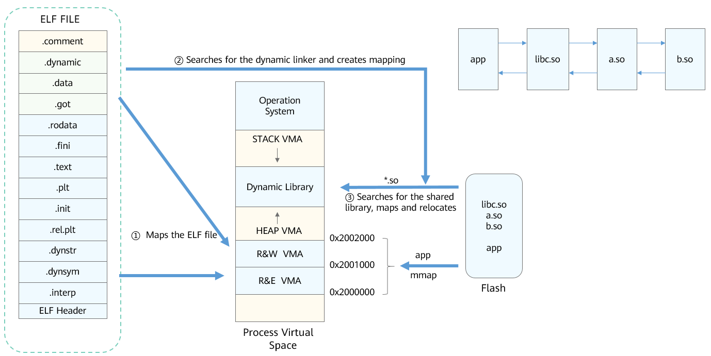
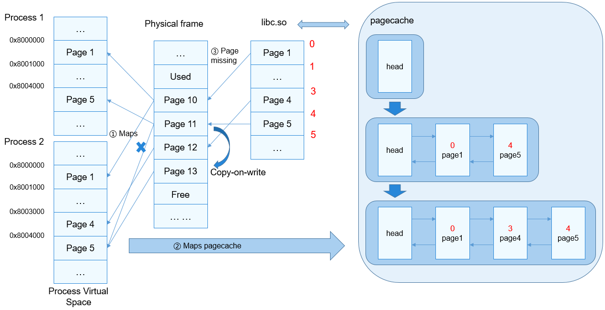

# Dynamic Loading and Linking

## Basic Concepts

The OpenHarmony dynamic loading and linking mechanism includes a kernel loader and a dynamic linker. The kernel loader loads application programs and the dynamic linker. The dynamic linker loads the shared library on which the application programs depend, and performs symbol relocation for the application programs and shared libraries. Compared with static linking, dynamic linking is a mechanism for delaying the linking of applications and dynamic libraries to run time.

**Advantages of Dynamic Linking**

- Dynamic linking allows multiple applications to share code. The minimum loading unit is page. Dynamic linking saves disk and memory space than static linking.

- When a shared library is upgraded, the new shared library overwrites the earlier version (the APIs of the shared library are downward compatible). You do not need to re-link the shared library.

- The loading address can be randomized to prevent attacks and ensure security.

## Working Principles

**Figure 1** Dynamic loading process

1. The kernel maps the **PT_LOAD** section in the ELF file of the application to the process space. For files of the ET_EXEC type, fixed address mapping is performed based on **p_vaddr** in the **PT_LOAD** section. For files of the ET_DYN type (position-independent executable programs, obtained through **-fPIE**), the kernel selects the **base** address via **mmap** for mapping (load_addr = base + p_vaddr).

2. If the application is statically linked (static linking does not support **-fPIE**), after the stack information is set, the system redirects to the address specified by **e_entry** in the ELF file of the application and runs the application. If the program is dynamically linked, the application ELF file contains the **PT_INTERP** section, which stores the dynamic linker path information (ET_DYN type). The dynamic linker of musl is a part of the **libc-musl.so**. The entry of **libc-musl.so** is the entry of the dynamic linker. The kernel selects the **base** address for mapping via the **mmap** API, sets the stack information, redirects to the **base + e_entry** (entry of the dynamic linker) address, and runs the dynamic linker.

3. The dynamic linker bootstraps and searches for all shared libraries on which the application depends, relocates the imported symbols, and finally redirects to the **e_entry** (or **base + e_entry**) of the application to run the application.

**Figure 2** Program execution process

1. The loader and linker call **mmap** to map the **PT_LOAD** section.

2. The kernel calls **map_pages** to search for and map the existing PageCache.

3. If there is no physical memory for mapping in the virtual memory region during program execution, the system triggers a page missing interrupt, which allows the ELF file to be read into the physical memory and adds the memory block to the pagecache.

4. Map the physical memory blocks of the file read to the virtual address region.

5. The program continues to run.

## Development Guidelines

### Available APIs

**Table 1** API of the kernel loader module

| Category  | API    | Description                            |
| ---------- | ---------------- | -------------------------------- |
| Starting initialization| LOS_DoExecveFile | Executes the specified user program based on the input parameters.|

### How to Develop

The kernel cannot directly call the **LOS_DoExecveFile** API to start a new process. This API is generally called through the **exec()** API to create a new process using the system call mechanism.
