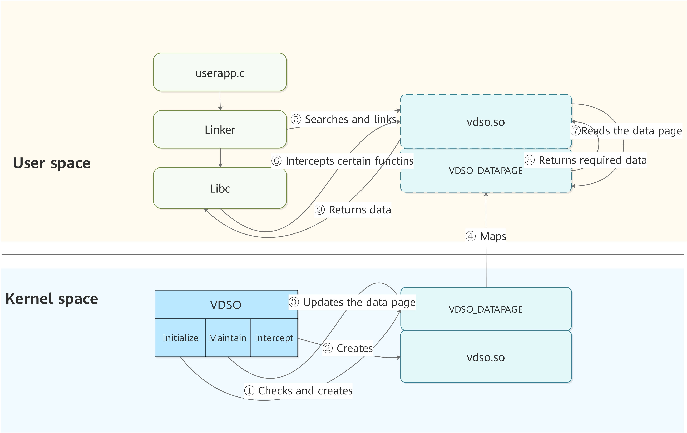

# Virtual Dynamic Shared Object

## Basic Concepts

Different from a common dynamic shared library, which stores its .so files in the file system, the virtual dynamic shared object (VDSO) has its .so files stored in the system image. The kernel determines the .so files needed and provides them to the application program. That is why the VDSO is called a virtual dynamic shared library.

The VDSO mechanism allows OpenHarmony user-mode programs to quickly obtain kernel-related data. It can accelerate certain system calls and implement quick read of non-sensitive data (hardware and software configuration).

## Working Principles

The VDSO can be regarded as a section of memory (read-only) maintained by the kernel and mapped to the address space of the user-mode applications. By linking **vdso.so**, the applications can directly access this mapped memory instead of invoking system calls, accelerating application execution.

VDSO can be divided into:

- Data page: provides the kernel-time data mapped to the user process.
- Code page: provides the logic for shielding system calls.

**Figure 1** VDSO system design

The VDSO mechanism involves the following steps:

1. Creates the VDSO data page during kernel initialization.

2. Creates the VDSO code page during kernel initialization.

3. Updates kernel data to the VDSO data page based on the system clock interrupts.

4. Maps the code page to the user space when a user process is created.

5. Binds the VDSO symbols when the user program creates dynamic linking.

6. The VDSO code page intercepts specific system calls (for example, **clock_gettime(CLOCK_REALTIME_COARSE, &amp;ts)**).

7. The VDSO code page allows direct read of the mapped VDSO data page rather than invoking a system call.

8. Returns data from the VDSO data page to the VDSO code page.

9. Returns the data obtained from the VDSO data page to the user program.

> **NOTE** 
>
>  - The VDSO mechanism supports the **CLOCK_REALTIME_COARSE** and **CLOCK_MONOTONIC_COARSE** functions of the **clock_gettime** API in the LibC library. For details about how to use the **clock_gettime** API, see the POSIX standard.
>
>  - You can call **clock_gettime(CLOCK_REALTIME_COARSE, &amp;ts)** or **clock_gettime(CLOCK_MONOTONIC_COARSE, &amp;ts)** of the Libc library to use the VDSO.
>
>  - When VDSO is used, the time precision is the same as that of the tick interrupt of the system. The VDSO mechanism is applicable to the scenario where there is no demand for high time precision and **clock_gettime** or **gettimeofday** is frequently triggered in a short period of time. The VDSO mechanism is not recommended for the system demanding high time precision.
