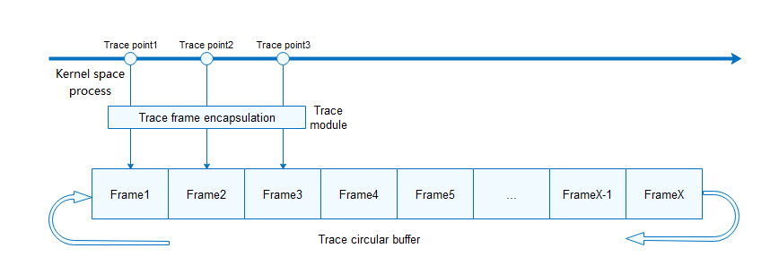

# Trace

## Basic Concepts

Trace is a functional framework provided by the kernel for tracing key processes of modules. You can implement trace at key positions for modules based on mechanism requirements, and export the traced information as files or in other modes for further analysis.

The requirements for trace are as follows:

1.  The information needs to be recorded as soon as possible to minimize the impact on the system time sequence.
2.  Use as little space as possible to store as much as possible data to reduce memory consumption.

## Working Principles

Initialize the trace function at the beginning of the kernel startup. When the modules that support the trace function are initialized, register the trace type and callback functions. The position of the trace point that triggers trace recording can be determined by each module.

When a trace point is triggered, the trace module encapsulates the input information and adds the trace frame header information, including the trace type, ID of the running CPU, ID of the running task, relative timestamp of the running task, and ID of the running process. Then, the trace frame is recorded in a pre-requested cyclic buffer.

If too many frames are recorded in the cyclic buffer, earlier frames will be overwritten to ensure that the information in the buffer is always the latest. The traced data in the cyclic buffer can be exported, for example, by using file dumping, for further analysis. The exported files are sorted by timestamp.

## Usage

1.  Configure the trace macro  **LOSCFG\_KERNEL\_TRACE**, which is disabled by default. You can enable it by choosing  **Kernel**  \>  **Enable Trace Feature**  on the  **menuconfig**.
2.  Call  **OsTraceInit**  to complete trace initialization.
3.  Define the traceframe structure of the module in  **los\_trace\_frame.h**, and implement the trace callback function of the module in  **los\_trace\_frame.c**.
4.  Call  **LOS\_TraceReg**  to register trace in the initialization or earlier phase for the modules to be traced.
5.  Enable the trace function at the position where the tracing starts and disable the trace function at the position where the tracing stops.
6.  Call  **LOS\_Trace2File**  to export traced data to a file.
7.  Perform further data analysis based on the frame header and frame body structure.

**Available APIs**

The following table describes APIs available for the OpenHarmony LiteOS-A trace framework. For more details about the APIs, see the API reference.

**Table  1**  Trace Interface Description

<table><thead align="left"><tr id="row151841613163315"><th class="cellrowborder" valign="top" width="33.33333333333333%" id="mcps1.2.4.1.1">
Category

</th>
<th class="cellrowborder" valign="top" width="33.33333333333333%" id="mcps1.2.4.1.2">
API

</th>
<th class="cellrowborder" valign="top" width="33.33333333333333%" id="mcps1.2.4.1.3">
Description

</th>
</tr>
</thead>
<tbody><tr id="row1918541303315"><td class="cellrowborder" valign="top" width="33.33333333333333%" headers="mcps1.2.4.1.1 ">
Tracing information

</td>
<td class="cellrowborder" valign="top" width="33.33333333333333%" headers="mcps1.2.4.1.2 ">
LOS_Trace

</td>
<td class="cellrowborder" valign="top" width="33.33333333333333%" headers="mcps1.2.4.1.3 ">
Traces information.

</td>
</tr>
<tr id="row13185111320331"><td class="cellrowborder" rowspan="2" valign="top" width="33.33333333333333%" headers="mcps1.2.4.1.1 ">
Registration and unregistration

</td>
<td class="cellrowborder" valign="top" width="33.33333333333333%" headers="mcps1.2.4.1.2 ">
LOS_TraceReg

</td>
<td class="cellrowborder" valign="top" width="33.33333333333333%" headers="mcps1.2.4.1.3 ">
Registers the trace type.

</td>
</tr>
<tr id="row201858136336"><td class="cellrowborder" valign="top" headers="mcps1.2.4.1.1 ">
LOS_TraceUnreg

</td>
<td class="cellrowborder" valign="top" headers="mcps1.2.4.1.2 ">
Unregisters the trace type.

</td>
</tr>
<tr id="row1518581363317"><td class="cellrowborder" rowspan="2" valign="top" width="33.33333333333333%" headers="mcps1.2.4.1.1 ">
Switch

</td>
<td class="cellrowborder" valign="top" width="33.33333333333333%" headers="mcps1.2.4.1.2 ">
LOS_TraceTypeSwitch

</td>
<td class="cellrowborder" valign="top" width="33.33333333333333%" headers="mcps1.2.4.1.3 ">
Enables or disables the specified type of trace.

</td>
</tr>
<tr id="row14185101310339"><td class="cellrowborder" valign="top" headers="mcps1.2.4.1.1 ">
LOS_TraceSwitch

</td>
<td class="cellrowborder" valign="top" headers="mcps1.2.4.1.2 ">
Enables or disables the trace function.

</td>
</tr>
<tr id="row71858133339"><td class="cellrowborder" rowspan="2" valign="top" width="33.33333333333333%" headers="mcps1.2.4.1.1 ">
Data export

</td>
<td class="cellrowborder" valign="top" width="33.33333333333333%" headers="mcps1.2.4.1.2 ">
LOS_TraceBufDataGet

</td>
<td class="cellrowborder" valign="top" width="33.33333333333333%" headers="mcps1.2.4.1.3 ">
Exports trace data to the heap cache. (The cache space is allocated internally and must be released explicitly.)

</td>
</tr>
<tr id="row10185131373310"><td class="cellrowborder" valign="top" headers="mcps1.2.4.1.1 ">
LOS_Trace2File

</td>
<td class="cellrowborder" valign="top" headers="mcps1.2.4.1.2 ">
Saves the trace data to the file system (depending on the file system).

</td>
</tr>
</tbody>
</table>

> **NOTE:** 
>-   The frame buffer is a cyclic buffer. When it is full, a subsequent write will cause overwrite of the oldest data. You can configure the buffer size in the  **LOS\_TRACE\_BUFFER\_SIZE**  macro in  **los\_config.h**. The default size is  **512**  KiB.
>-   Although trace has completed the assembly and recording as soon as possible, it still has impact on the overall performance of the system.
>-   Trace supports concurrent recording of multiple modules. You can reduce the data analysis volume by enabling or disabling the trace function for different modules on demand.
>-   The task, memory, and liteipc modules of the kernel support the trace recording function.

