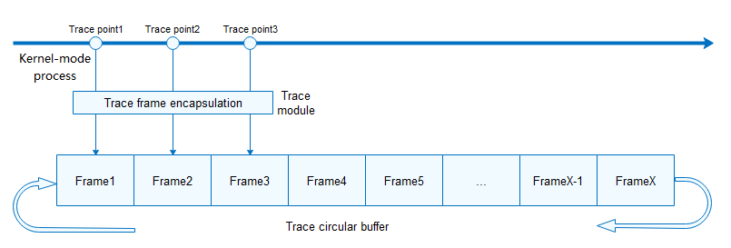

# Trace


## Basic Concepts

Trace helps you learn about the kernel running process and the execution sequence of modules and tasks. With the information, you can better understand the code running process of the kernel and locate time sequence problems.


## Working Principles

The kernel provides a hook framework to embed hooks in the main process of each module. In the initial startup phase of the kernel, the trace function is initialized and the trace handlers are registered with the hooks.

When a hook is triggered, the trace module encapsulates the input information and adds the trace frame header information, including the event type, ID of the running CPU, ID of the running task, and relative timestamp.

The trace module provides two working modes: offline mode and online mode.

In offline mode, trace frames are stored in a circular buffer. If too many frames are stored in the circular buffer, earlier frames will be overwritten to ensure that the information in the buffer is always the latest. Data in the circular buffer can be exported by running the shell command for further analysis. The exported information is sorted by timestamp.



The online mode must be used with the integrated development environment (IDE). Trace frames are sent to the IDE in real time. The IDE parses the records and displays them in a visualized manner.


## Available APIs


### Kernel Mode

The trace module of the OpenHarmony LiteOS-A kernel provides the following APIs. For more details, see [API reference](https://gitee.com/openharmony/kernel_liteos_a/blob/master/kernel/include/los_trace.h).

**Table 1** APIs of the trace module

| Category| Description|
| -------- | -------- |
| Starting/Stopping trace| **LOS_TraceStart**: starts trace.<br>**LOS_TraceStop**: stops trace.|
| Managing trace records| **LOS_TraceRecordDump**: dumps data from the trace buffer.<br>**LOS_TraceRecordGet**: obtains the start address of the trace buffer.<br>**LOS_TraceReset**: clears events in the trace buffer.|
| Filtering trace records| **LOS_TraceEventMaskSet**: sets the event mask to trace only events of the specified modules.|
| Masking events of specified interrupt IDs| **LOS_TraceHwiFilterHookReg**: registers a hook to filter out events of specified interrupt IDs.|
| Performing function instrumentation| **LOS_TRACE_EASY**: performs simple instrumentation.<br>**LOS_TRACE**: performs standard instrumentation.|

- You can perform function instrumentation in the source code to trace specific events. The system provides the following APIs for instrumentation:
  - **LOS_TRACE_EASY(TYPE, IDENTITY, params...)** for simple instrumentation
     - You only need to insert this API into the source code.
     - **TYPE** specifies the event type. The value range is 0 to 0xF. The meaning of each value is user-defined.
     - **IDENTITY** specifies the object of the event operation. The value is of the **UIntPtr** type.
     - **Params** specifies the event parameters. The value is of the **UIntPtr** type.
        Example:

        ```
        Perform simple instrumentation for reading and writing files fd1 and fd2.
        Set TYPE to 1 for read operations and 2 for write operations.
        Insert the following to the position where the fd1 file is read:
        LOS_TRACE_EASY(1, fd1, flag, size);
        Insert the following to the position where the fd2 file is read:
        LOS_TRACE_EASY(1, fd2, flag, size);
        Insert the following to the position where the fd1 file is written:
        LOS_TRACE_EASY(2, fd1, flag, size);
        Insert the following in the position where the fd2 file is written:
        LOS_TRACE_EASY(2, fd2, flag, size);
        ```
  - **LOS_TRACE(TYPE, IDENTITY, params...)** for standard instrumentation.
     - Compared with simple instrumentation, standard instrumentation supports dynamic event filtering and parameter tailoring. However, you need to extend the functions based on rules.
     - **TYPE** specifies the event type. You can define the event type in **enum LOS_TRACE_TYPE** in the header file **los_trace.h**. For details about methods and rules for defining events, see other event types.
     - The **IDENTITY** and **Params** are the same as those of simple instrumentation.
        Example:	  

        ```
        1. Set the event mask (module-level event type) in enum LOS_TRACE_MASK.
          Format: TRACE_#MOD#_FLAG (MOD indicates the module name)
          Example:
          TRACE_FS_FLAG = 0x4000
        2. Define the event type in **enum LOS_TRACE_TYPE**.
          Format: #TYPE# = TRACE_#MOD#_FLAG | NUMBER
          Example:
          FS_READ  = TRACE_FS_FLAG | 0; // Read files.
          FS_WRITE = TRACE_FS_FLAG | 1; // Write files.
        3. Set event parameters in the #TYPE#_PARAMS(IDENTITY, parma1...) IDENTITY, ... format.
          #TYPE# is the #TYPE# defined in step 2.
          Example:
          #define FS_READ_PARAMS(fp, fd, flag, size)    fp, fd, flag, size
          The parameters defined by the macro correspond to the event parameters recorded in the trace buffer. You can modify the parameters as required.
          If no parameter is specified, events of this type are not traced.
          #define FS_READ_PARAMS(fp, fd, flag, size) // File reading events are not traced.
        4. Insert a code stub in a proper position.
          Format: LOS_TRACE(#TYPE#, #TYPE#_PARAMS(IDENTITY, parma1...))
          LOS_TRACE(FS_READ, fp, fd, flag, size); // Code stub for reading files.
          #The parameters following #TYPE# are the input parameter of the **FS_READ_PARAMS** function in step 3.
        ```

        > **NOTE**<br>
        > The preset trace events and parameters can be tailored in the same way. For details about the parameters, see [kernel\include\los_trace.h](https://gitee.com/openharmony/kernel_liteos_a/blob/master/kernel/include/los_trace.h).

- For **LOS_TraceEventMaskSet(UINT32 mask)**, only the most significant 28 bits (corresponding to the enable bit of the module in **LOS_TRACE_MASK**) of the mask take effect and are used only for module-based tracing. Currently, fine-grained event-based tracing is not supported. For example, in **LOS_TraceEventMaskSet(0x202)**, the effective mask is **0x200 (TRACE_QUE_FLAG)** and all events of the QUE module are collected. The recommended method is **LOS_TraceEventMaskSet(TRACE_EVENT_FLAG | TRACE_MUX_FLAG | TRACE_SEM_FLAG | TRACE_QUE_FLAG);**.

- To enable trace of only simple instrumentation events, set **Trace Mask** to **TRACE_MAX_FLAG**.

- The trace buffer has limited capacity. When the trace buffer is full, events will be overwritten. You can use **LOS_TraceRecordDump** to export data from the trace buffer and locate the latest records by **CurEvtIndex**.

- The typical trace operation process includes **LOS_TraceStart**, **LOS_TraceStop**, and **LOS_TraceRecordDump**.

- You can filter out interrupt events by interrupt ID to prevent other events from being overwritten due to frequent triggering of a specific interrupt in some scenarios. You can customize interrupt filtering rules.
    Example:

  ```c
  BOOL Example_HwiNumFilter(UINT32 hwiNum)
  {
      if ((hwiNum == TIMER_INT) || (hwiNum == DMA_INT)) {
          return TRUE;
      }
      return FALSE;
  }
  LOS_TraceHwiFilterHookReg(Example_HwiNumFilter);
  ```

The interrupt events with interrupt ID of **TIMER_INT** or **DMA_INT** are not traced.


### User Mode

The trace character device is added in **/dev/trace**. You can use **read()**, **write()**, and **ioctl()** on the device node to read, write, and control trace in user mode.

- **read()**: reads the trace data in user mode.

- **write()**: writes an event in user mode.

- **ioctl()**: performs user-mode trace operations, including:


```c
#define TRACE_IOC_MAGIC   'T'
#define TRACE_START      _IO(TRACE_IOC_MAGIC, 1)
#define TRACE_STOP       _IO(TRACE_IOC_MAGIC, 2)
#define TRACE_RESET      _IO(TRACE_IOC_MAGIC, 3)
#define TRACE_DUMP		 _IO(TRACE_IOC_MAGIC, 4)
#define TRACE_SET_MASK	 _IO(TRACE_IOC_MAGIC, 5)
```

The operations specified by the input parameter of **ioctl()** correspond to **LOS_TraceStart**, **LOS_TraceStop**, **LOS_TraceReset**, **LOS_TraceRecordDump**, and **LOS_TraceEventMaskSet**, respectively.

For details, see [User-Mode Development Example](kernel-small-debug-trace.md#user-mode).


## Development Guidelines


### Kernel-Mode Development Process

The typical trace process is as follows:

1. Configure the macro related to the trace module.
   Configure the macro **LOSCFG_KERNEL_TRACE**, which is disabled by default. Run the **make update_config** command in the **kernel/liteos_a** directory, choose **Kernel** > **Enable Hook Feature**, and set **Enable Trace Feature** to **YES**.

   | Item| menuconfig Option| Description| Value|
   | -------- | -------- | -------- | -------- |
   | LOSCFG_KERNEL_TRACE | Enable Trace Feature | Specifies whether to enable the trace feature.| YES/NO |
   | LOSCFG_RECORDER_MODE_OFFLINE | Trace work mode -> Offline mode | Specifies whether to enable the online trace mode.| YES/NO |
   | LOSCFG_RECORDER_MODE_ONLINE | Trace work mode -> Online mode | Specifies whether to enable the offline trace mode.| YES/NO |
   | LOSCFG_TRACE_CLIENT_INTERACT | Enable Trace Client Visualization and Control | Enables interaction with Trace IDE (dev tools), including data visualization and process control.| YES/NO |
   | LOSCFG_TRACE_FRAME_CORE_MSG | Enable Record more extended content -> Record cpuid, hardware interrupt status, task lock status | Specifies whether to enable recording of the CPU ID, interruption state, and lock task state.| YES/NO |
   | LOSCFG_TRACE_FRAME_EVENT_COUNT | Enable Record more extended content -> Record event count, which indicate the sequence of happend events | Specifies whether to enables recording of the event sequence number.| YES/NO |
   | LOSCFG_TRACE_FRAME_MAX_PARAMS | Record max params | Specifies the maximum number of parameters for event recording.| INT |
   | LOSCFG_TRACE_BUFFER_SIZE | Trace record buffer size | Specifies the trace buffer size.| INT |

2. (Optional) Preset event parameters and stubs (or use the default event parameter settings and event stubs).

3. (Optional) Call **LOS_TraceStop** to stop trace and call **LOS_TraceReset** to clear the trace buffer. (Trace is started by default.)

4. (Optional) Call **LOS_TraceEventMaskSet** to set the mask of the events to be traced. The default event mask enables only trace of interrupts and task events. For details about the event masks, see **LOS_TRACE_MASK** in [los_trace.h](https://gitee.com/openharmony/kernel_liteos_a/blob/master/kernel/include/los_trace.h).

5. Call **LOS_TraceStart** at the start of the code where the event needs to be traced.

6. Call **LOS_TraceStop** at the end of the code where the event needs to be traced.

7. Call **LOS_TraceRecordDump** to output the data in the buffer. (The input parameter of the function is of the Boolean type. The value **FALSE** means to output data in the specified format, and the value **TRUE** means to output data to Trace IDE.)

The methods in steps 3 to 7 are encapsulated with shell commands. You can run these commands on shell. The mappings between the methods and commands are as follows:

- LOS_TraceReset —— trace_reset

- LOS_TraceEventMaskSet —— trace_mask

- LOS_TraceStart —— trace_start

- LOS_TraceStop —— trace_stop

- LOS_TraceRecordDump —— trace_dump


### Kernel-Mode Development Example

This example implements the following:

1. Create a trace task.

2. Set the event mask.

3. Start trace.

4. Stop trace.

5. Output trace data in the specified format.


### Kernel-Mode Sample Code

You can add the test function of the sample code to **TestTaskEntry** in **kernel/liteos_a/testsuites /kernel /src/osTest.c** for testing.

The sample code is as follows:


```c
#include "los_trace.h"
UINT32 g_traceTestTaskId;
VOID Example_Trace(VOID)
{
    UINT32 ret;
    LOS_TaskDelay(10);
    /* Start trace. */
    ret = LOS_TraceStart();
    if (ret != LOS_OK) {
        dprintf("trace start error\n");
        return;
    }
    /* Trigger a task switching event. */
    LOS_TaskDelay(1);
    LOS_TaskDelay(1);
    LOS_TaskDelay(1);
    /* Stop trace. */
    LOS_TraceStop();
    LOS_TraceRecordDump(FALSE);
}
UINT32 Example_Trace_test(VOID)
{
    UINT32 ret;
    TSK_INIT_PARAM_S traceTestTask;
    /* Create a trace task. */
    memset(&traceTestTask, 0, sizeof(TSK_INIT_PARAM_S));
    traceTestTask.pfnTaskEntry = (TSK_ENTRY_FUNC)Example_Trace;
    traceTestTask.pcName       = "TestTraceTsk";    /* Test task name. */
    traceTestTask.uwStackSize  = 0x800; // 0x800: trace test task stack size
    traceTestTask.usTaskPrio   = 5; // 5: trace test task priority
    traceTestTask.uwResved   = LOS_TASK_STATUS_DETACHED;
    ret = LOS_TaskCreate(&g_traceTestTaskId, &traceTestTask);
    if (ret != LOS_OK) {
        dprintf("TraceTestTask create failed .\n");
        return LOS_NOK;
    }
    /* Trace is started by default. Therefore, you can stop trace, clear the buffer, and then start trace. */                   	  
    LOS_TraceStop();
    LOS_TraceReset();
    /* Enable trace of the Task module events. */
    LOS_TraceEventMaskSet(TRACE_TASK_FLAG);
    return LOS_OK;
}
LOS_MODULE_INIT(Example_Trace_test, LOS_INIT_LEVEL_KMOD_EXTENDED);
```


### Verification

The output is as follows:


```
***TraceInfo begin***
clockFreq = 50000000
CurEvtIndex = 7
Index   Time(cycles)      EventType      CurTask   Identity      params
0       0x366d5e88        0x45           0x1       0x0           0x1f         0x4       0x0
1       0x366d74ae        0x45           0x0       0x1           0x0          0x8       0x1f
2       0x36940da6        0x45           0x1       0xc           0x1f         0x4       0x9
3       0x3694337c        0x45           0xc       0x1           0x9          0x8       0x1f
4       0x36eea56e        0x45           0x1       0xc           0x1f         0x4       0x9
5       0x36eec810        0x45           0xc       0x1           0x9          0x8       0x1f
6       0x3706f804        0x45           0x1       0x0           0x1f         0x4       0x0
7       0x37070e59        0x45           0x0       0x1           0x0          0x8       0x1f
***TraceInfo end***
```

The output event information includes the occurrence time, event type, task in which the event occurs, object of the event operation, and other parameters of the event.

- **EventType**: type of the event. For details, see **enum LOS_TRACE_TYPE** in [los_trace.h](https://gitee.com/openharmony/kernel_liteos_a/blob/master/kernel/include/los_trace.h).

- **CurrentTask**: ID of the running task.

- **Identity**: object of the event operation. For details, see **\#TYPE\#_PARAMS** in [los_trace.h](https://gitee.com/openharmony/kernel_liteos_a/blob/master/kernel/include/los_trace.h).

- **params**: event parameters. For details, see **\#TYPE\#_PARAMS** in [los_trace.h](https://gitee.com/openharmony/kernel_liteos_a/blob/master/kernel/include/los_trace.h).

The following uses output No. 0 as an example.


```
Index   Time(cycles)      EventType      CurTask   Identity      params
0       0x366d5e88        0x45           0x1       0x0           0x1f         0x4
```

- **Time (cycles)** can be converted into time (in seconds) by dividing the cycles by clockFreq.

- **0x45** indicates the task switching event. **0x1** is the ID of the task in running. 

- For details about the meanings of **Identity** and **params**, see the **TASK_SWITCH_PARAMS** macro.

```c
#define TASK_SWITCH_PARAMS(taskId, oldPriority, oldTaskStatus, newPriority, newTaskStatus) \
taskId, oldPriority, oldTaskStatus, newPriority, newTaskStatus
```

Because of **#TYPE#_PARAMS(IDENTITY, parma1...) IDENTITY, ...**, **Identity** is **taskId (0x0)** and the first parameter is **oldPriority (0x1f)**.

> **NOTE**
>
> The number of parameters in **params** is specified by **LOSCFG_TRACE_FRAME_MAX_PARAMS**. The default value is **3**. Excess parameters are not recorded. You need to set **LOSCFG_TRACE_FRAME_MAX_PARAMS** based on service requirements.

Task 0x1 is switched to Task 0x0. The priority of task 0x1 is **0x1f**, and the state is **0x4**. The priority of the task 0x0 is **0x0**.
