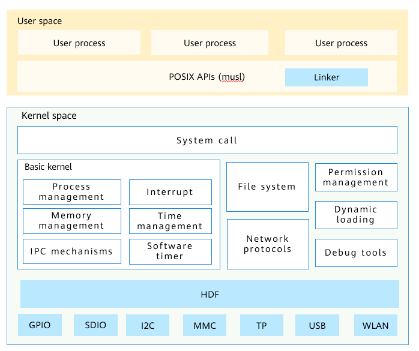

# Kernel Overview

-   [Overview](#section6614133913129)
-   [Kernel Architecture](#section827143517385)

## Overview

The OpenHarmony lightweight kernel is a next-generation kernel developed based on the lightweight IoT operating system Huawei LiteOS. Two types of kernels are available: LiteOS-M and LiteOS-A. The LiteOS-M kernel is designed for lightweight systems, which support MCU memory of hundreds of KB and MPU isolation. FreeRTOS and ThreadX are counterparts in the industry. The LiteOS-A kernel is ideal for small systems, which support memory in MB and MMU isolation. Similar kernels include Zircon and Darwin. This development guide applies to the LiteOS-A kernel.

To adapt to the rapid development of the IoT industry, the OpenHarmony lightweight kernel is continuously optimized and expanded to provide application developers with friendly development experience and unified and open ecosystem capabilities. The LiteOS-A has the following new features:

-   Diversified kernel mechanisms

    Mechanisms such as virtual memory, system calling, multi-core, lightweight Inter-Process Communication \(IPC\), and Discretionary Access Control \(DAC\) are added to enrich kernel capabilities. To improve compatibility with software and developer experience, multiple processes are supported to isolate memory between applications and improve system robustness.

-   Unified hardware driver foundation \(HDF\)

    The HDF provides unified driver standards and access mode for device vendors. This simplifies porting of drivers and allows one-time development for multi-device deployment.

-   1200+ standard POSIX APIs

    The kernel supports more Portable Operating System Interface \(POSIX\) APIs, which facilitate software development and porting and improve developers' experience.

-   Decoupling between the kernel and hardware

    The lightweight kernel is highly decoupled from the hardware. New board can be added without modifying the kernel code.

## Kernel Architecture

The lightweight kernel consists of the basic kernel, extension components, HDF, and POSIX interface. Different from the microkernel which is running in the user space, the extended functions, such as file system and network protocols, of the lightweight kernel are running in the kernel address space. The direct function calling between components is much faster than inter-process communication \(IPC\) or remote procedure calls \(RPCs\).

**Figure  1**  Architecture of the OpenHarmony LiteOS-A kernel  

-   The basic kernel implements basic kernel mechanisms, such as scheduling, memory management, and interrupts.
-   Extended components include file systems, network protocols, and security functions.
-   The HDF provides a unified standard framework for peripheral drivers.
-   The POSIX interface allows POSIX-compliant applications to be easily ported to the OpenHarmony.

**Basic Kernel**

The basic kernel implements the following mechanisms:

-   Process management: supports processes and threads and task-based process implementation. Processes have independent 4 GB address space.
-   Multi-core scheduling: supports task and affinity-based interrupt-core binding settings.
-   Real-time scheduling: Tasks are scheduled based on priorities. The tasks of the same priority are scheduled by using the time slice round-robin.
-   Virtual memory: supports page fault. The kernel space is statically mapped to 0-1 GiB addresses, and the user space is mapped to 1-4 GiB addresses.
-   Kernel communication: supports events, semaphores, mutexes, and queues.
-   Time management: supports software timers and system clock.

**File systems**

The LiteOS-A supports multiple file systems, such as FAT, JFFS2, NFS, ramfs, and procfs, and provides complete POSIX standard APIs externally. The VFS layer is used as the unified adaptation layer framework, which facilitates the porting of new file systems. Each file system can automatically use the rich functions provided by the VFS layer.

The following features are supported:

-   Complete POSIX API support
-   File-level cache \(page cache\)
-   Disk-level cache \(Bcache\)
-   Directory cache \(path cache\)
-   DAC capability
-   Nested mounting and file system stacking
-   Feature tailoring and flexible configuration of resource usage

**Network Protocols**

The LiteOS-A network protocols are constructed based on the open-source lightweight IP \(lwIP\) and have also optimized the RAM usage and improved the transmission performance over LWIP.

-   Protocols: IP, IPv6, ICMP, ND, MLD, UDP, TCP, IGMP, ARP, PPPoS, and PPPoE
-   API: socket API
-   Extended features: IP forwarding based on multiple network ports, TCP congestion control, round-trip time \(RTT\) estimation, and fast recovery/retransmission
-   Application programs: HTTP\(S\) service, SNTP client, SMTP\(S\) client, ping tool, NetBIOS name service, mDNS response program, MQTT client, TFTP service, DHCP client, DNS client, AutoIP/APIPA \(zero configuration\), and SNMP agent

**HDF**

The LiteOS-A integrates the HDF framework. The HDF framework provides a more precise and efficient development environment, aiming to realize one-time development for multi-device deployment. The HDF supports:

-   Multi-kernel platform
-   User-mode drivers
-   Configurable component-based driver model
-   Message-based driver interface model
-   Object-based driver and device management
-   Unified hardware driver interface \(HDI\)
-   Power management and plug and play \(PnP\)

**Extension Components**

Extension components provide optional but important mechanism for extending kernel functions.

-   Dynamic linking: supports standard Executable and Linkable Format \(ELF\) execution and randomization of loading addresses.
-   IPC: supports LiteIPC and standard mechanisms such as Mqueue, Pipe, Fifo, and Signal.
-   System calling: supports 170+ system calls and the virtual dynamic shared object \(vDSO\) mechanism.
-   Permission management: supports process-based privilege division and control, and file owner, group, and owner \(UGO\) permission configuration.

