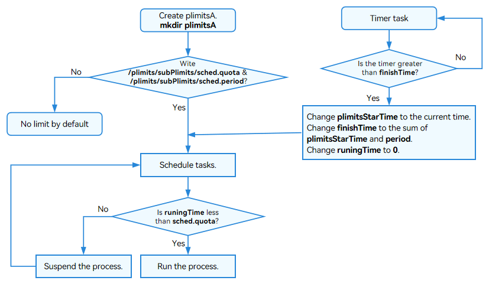
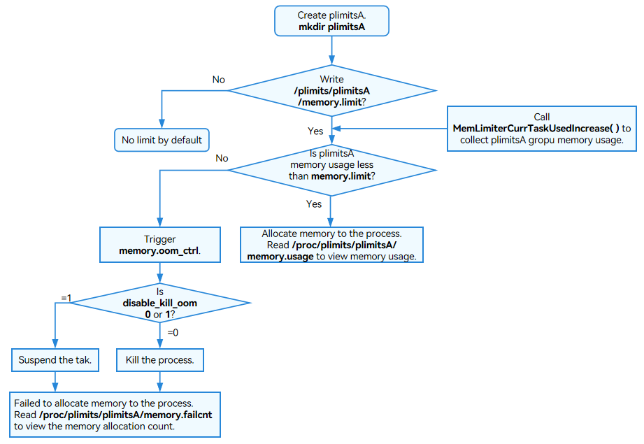
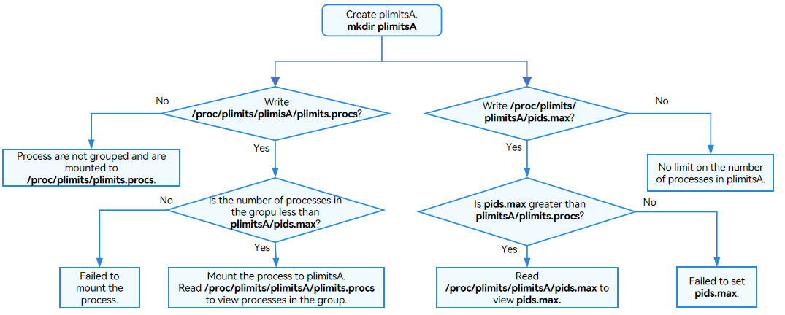

# plimits

## Overview

The complexity of app environments and growing number of processes will cause contention and waste of resources if restrictions are applied on containers. Process Limits (plimits) is a mechanism provided by the kernel to limit the resources used by a single process or multiple processes. It can implement refined control on resources such as CPUs and memory. 

plimitsfs is a file system that provides an interface for creating and deleting plimits. plimitsfs enables processes and process resources to be grouped for management through operations on files. Plimiters are configured to restrict the usage of resources, such as memory and sched, in process groups.

## Basic Concepts

- plimits: a feature provided by the kernel to limit, record, and isolate the resources used by a group of processes.
- plimitsfs: a file system, which provides an interface for users to create and delete plimits and displays the plimits directories.
- plimiter: a collection of resource limiters. plimiter includes the memory limiter, pids limiter, and sched limiter.
- sched limiter: limits the time to use CPUs for all processes in a plimits group in a specified period.
- memory limiter: limits the total memory that can be used by all processes in a plimits group.
- pids limiter: limits the maximum number of processes that can be mounted in a plimits group.

## Working Principles

During the system initialization process, the **plimits** directory is mounted to the **proc** directory.

```
├─proc
│  ├─plimits
│  │  ├─plimits.plimiter_add
│  │  ├─plimits.plimiter_delete
│  │  ├─plimits.procs
│  │  ├─plimits.limiters
│  │  ├─pids.max
│  │  ├─sched.period
│  │  ├─sched.quota
│  │  ├─sched.stat
│  │  ├─memory.failcnt
│  │  ├─memory.limit
│  │  ├─memory.peak
│  │  ├─memory.usage
│  │  ├─memory.oom_ctrl
│  │  └─memory.stat
```

- plimits groups

  **Figure 1** Creating or deleting plimits

  

- sched limiter

  **Figure 2** sched limiter configuration

  

- Memory limiter

  **Figure 3** Memory limiter configuration

  

- pids limiter

  **Figure 4** pids limiter configuration

  


## How to Develop


### Available APIs

The plimits root directory of LiteOS-A is in **/proc/plimits**. All files in this directory are read-only. The values setting in the limiter file are maximum values by default. You can view the status of process resources in the group from the files.
Run the **mkdir** command to create a **plimitsA** directory to group process resources and restrict resource allocation. The created **plimitsA** directory inherits its parent **plimits** directory. 

The following table lists the files in the **plimitsA** directory.

| Permissions | Size| User| User Group|         File        | Description|
| --------- | ---- | ---- | ------ | ---------------------- | --------- |
|-r--r--r-- | 0    | u:0  | g:0    | sched.stat             | Time slice of each thread in the last period. The time slice information is used for test and verification.|
|-rw-r--r-- | 0    | u:0  | g:0    | sched.quota            | Sum of time slices of all processes in a group in a period, in ns.|
|-rw-r--r-- | 0    | u:0  | g:0    | sched.period           | Statistical period of the time slice, in ns.|
|-r--r--r-- | 0    | u:0  | g:0    | memory.stat            | Memory usage statistics, in bytes.|
|-r--r--r-- | 0    | u:0  | g:0    | memory.usage           | Memory quota used, in bytes.|
|-r--r--r-- | 0    | u:0  | g:0    | memory.peak            | Historical peak memory usage, in bytes.|
|-rw-r--r-- | 0    | u:0  | g:0    | memory.limit           | Memory usage limit, in bytes.|
|-r--r--r-- | 0    | u:0  | g:0    | memory.failcnt         | Number of memory allocation failures when the memory usage exceeds the limit.|
|-rw-r--r-- | 0    | u:0  | g:0    | pids.max               | Maximum number of processes that can be mounted to a group.|
|-rw-r--r-- | 0    | u:0  | g:0    | plimits.procs          | All processes mounted to a group.|
|-rw-r--r-- | 0    | u:0  | g:0    | plimits.limiter_delete | Used to delete a limiter. |
|-rw-r--r-- | 0    | u:0  | g:0    | plimits.limiter_add    | Used to add a limiter. |
|-r--r--r-- | 0    | u:0  | g:0    | plimits.limiters       | Used to view the limiters of a group. |

All the files in the **plimitsA** directory in **/proc/plimits/** are readable, and some are writable. You can allocate and restrict process resources by writing data to the files in the **plimitsA** directory. You can:
- Write time, in ns, to the **sched.quota** file to limit the time for all processes in the group to use CPUs.
- Write time, in ns, to the **sched.period** file to set the period for collecting statistics in a group.
- Write the memory, in bytes, to the **memory.limit** file to limit the memory that can be used by a group.
- Write a decimal number to the **pids.max** file to limit the number of processes that can be mounted to a group.
- Write process IDs (PIDs) to the **plimits.procs** file to mount processes to different plimits groups.
- Read files to view the resource usage configuration of a group.

#### Deleting the **plimitsA** Group

Write **sched**, **memory**, and **pids** to the **/proc/plimits/plimitsA/plimits.limiter_delete** file in sequence to delete the limiters, and then run the **rmdir** command to delete **plimitsA**.

|    Permissions  |   Size |  User | User Group|         File         |
| --------- | ------- | ------ | ------ | ----------------------- |
|-rw-r--r-- | 0       | u:0    | g:0    | plimits.procs           |
|-rw-r--r-- | 0       | u:0    | g:0    | plimits.limiter_delete  |
|-rw-r--r-- | 0       | u:0    | g:0    | plimits.limiter_add     |
|-r--r--r-- | 0       | u:0    | g:0    | plimits.limiters        |

### How to Develop

1. Create **plimitsA** and write PIDs to **/plimitsA/plimits.procs** to group process resources.
2. Write the **/plimitsA/memory.limit** file to limit the maximum memory that can be used by the **plimitsA** group.
3. Write a decimal number to the **/plimitsA/pids.max** file to limit the number of processes that can be mounted to the **plimitsA** group.
4. Configure the limiter files in the **plimitsA** group to allocate and limit resources. If you do not want to limit the use of resources, delete **plimitsA**.

### Development Example

The following example demonstrates how to create the **plimitsA** group and implement resource control of this group by reading and writing the files of **plimitsA**.

```
#include <stdio.h>
#include <unistd.h>
#include <stdlib.h>
#include <string.h>
#include <sys/types.h>
#include <sys/stat.h>
#include <fcntl.h>

#define LOS_OK 0
#define LOS_NOK -1

int main ()
{
    int ret;
    ssize_t len;
    int fd = -1;
    //get main pid
    int mainpid = getpid();
    char plimitsA[128] = "/proc/plimits/plimitsA";
    char plimitsAPids[128] = "/proc/plimits/plimitsA/pids.max";
    char plimitsAMemoryLimit[128] = "/proc/plimits/plimitsA/memory.limit";
    char plimitsAMemoryUsage[128] = "/proc/plimits/plimitsA/memory.usage";
    char plimitsAProcs[128] = "/proc/plimits/plimitsA/plimits.procs";
    char plimitsAAdd[128] = "/proc/plimits/plimitsA/plimits.limiter_add";
    char plimitsADelete[128] = "/proc/plimits/plimitsA/plimits.limiter_delete";
    char plimitsMem[128] = "/proc/plimits/memory.usage";
    char plimitsPid[128] = "/proc/plimits/plimits.procs";
    char *mem = NULL;
    char writeBuf[128];
    char readBuf[128];

    /* Check the processes in the plimits group. */
    memset(readBuf, 0, sizeof(readBuf));
    fd = open(plimitsPid, O_RDONLY);
    len = read(fd, readBuf, sizeof(readBuf));
    if (len != strlen(readBuf)) {
        printf("read file failed.\n");
        return LOS_NOK;
    }
    close(fd);
    printf ("Processes in /proc/plimits: %s\n," readBuf);

    /* Check the memory usage of the plimits group. */
    memset(readBuf, 0, sizeof(readBuf));
    fd = open(plimitsMem, O_RDONLY);
    len = read(fd, readBuf, sizeof(readBuf));
    if (len != strlen(readBuf)) {
        printf("read file failed.\n");
        return LOS_NOK;
    }
    close(fd);
    printf ("Memory used in /proc/plimits: %s\n," readBuf);


    /* Create plimitsA "/proc/plimits/plimitsA". */
    ret = mkdir(plimitsA, 0777);
    if (ret != LOS_OK) {
        printf("mkdir failed.\n");
        return LOS_NOK;
    }

    /* Set the number of processes that can be mounted to the plimitsA group. */
    memset(writeBuf, 0, sizeof(writeBuf));
    sprintf(writeBuf, "%d", 3);
    fd = open(plimitsAPids, O_WRONLY);
    len = write(fd, writeBuf, strlen(writeBuf));
    if (len != strlen(writeBuf)) {
        printf("write file failed.\n");
        return LOS_NOK;
    }
    close(fd);

    /* Mount processes to the plimitsA group. */
    memset(writeBuf, 0, sizeof(writeBuf));
    sprintf(writeBuf, "%d", mainpid);
    fd = open(plimitsAProcs, O_WRONLY);
    len = write(fd, writeBuf, strlen(writeBuf));
    if (len != strlen(writeBuf)) {
        printf("write file failed.\n");
        return LOS_NOK;
    }
    close(fd);

    /* Set the memory allocation limit in the plimitsA group. */
    memset(writeBuf, 0, sizeof(writeBuf));
    //limit memory
    sprintf(writeBuf, "%d", (1024*1024*3));
    fd = open(plimitsAMemoryLimit, O_WRONLY);
    len = write(fd, writeBuf, strlen(writeBuf));
    if (len != strlen(writeBuf)) {
        printf("write file failed.\n");
        return LOS_NOK;
    }
    close(fd);

    /* Check the maximum memory that can be used in the plimitsA group. */
    memset(readBuf, 0, sizeof(readBuf));
    fd = open(plimitsAMemoryLimit, O_RDONLY);
    len = read(fd, readBuf, sizeof(readBuf));
    if (len != strlen(readBuf)) {
        printf("read file failed.\n");
        return LOS_NOK;
    }
    close(fd);
    printf ("Maximum memory allowed for /proc/plimits/plimitsA: %s\n," readBuf);

    /* Check the processes mounted to the plimitsA group. */
    memset(readBuf, 0, sizeof(readBuf));
    fd = open(plimitsAProcs, O_RDONLY);
    len = read(fd, readBuf, sizeof(readBuf));
    if (len != strlen(readBuf)) {
        printf("read file failed.\n");
        return LOS_NOK;
    }
    close(fd);
    printf ("Process mounted to /proc/plimits/plimitsA: %s\n," readBuf);

    /* Check the memory usage of the plimitsA group. */
    mem = (char*)malloc(1024*1024);
    memset(mem, 0, 1024);
    memset(readBuf, 0, sizeof(readBuf));
    fd = open(plimitsAMemoryUsage, O_RDONLY);
    len = read(fd, readBuf, sizeof(readBuf));
    if (len != strlen(readBuf)) {
        printf("read file failed.\n");
        return LOS_NOK;
    }
    close(fd);
    printf ("Memory used by /proc/plimits/plimitsA: %s\n," readBuf);

    /* Delete the memory limiter for the plimitsA group. */
    memset(writeBuf, 0, sizeof(writeBuf));
    sprintf(writeBuf, "%s", "memory");
    fd = open(plimitsADelete, O_WRONLY);
    len = write(fd, writeBuf, strlen(writeBuf));
    if (len != strlen(writeBuf)) {
        printf("write file failed.\n");
        return LOS_NOK;
    }
    close(fd);

    /* Add a memory limiter to the plimitsA group. */
    memset(writeBuf, 0, sizeof(writeBuf));
    sprintf(writeBuf, "%s", "memory");
    fd = open(plimitsAAdd, O_WRONLY);
    len = write(fd, writeBuf, strlen(writeBuf));
    if (len != strlen(writeBuf)) {
        printf("write file failed.\n");
        return LOS_NOK;
    }
    close(fd);

    /* Delete the plimitsA group. You need to delete the memory, pids, and sched limiters first. */
    memset(writeBuf, 0, sizeof(writeBuf));
    sprintf(writeBuf, "%s", "memory");
    fd = open(plimitsADelete, O_WRONLY);
    len = write(fd, writeBuf, strlen(writeBuf));
    if (len != strlen(writeBuf)) {
        printf("write file failed.\n");
        return LOS_NOK;
    }
    memset(writeBuf, 0, sizeof(writeBuf));
    sprintf(writeBuf, "%s", "pids");
    fd = open(plimitsADelete, O_WRONLY);
    len = write(fd, writeBuf, strlen(writeBuf));

    memset(writeBuf, 0, sizeof(writeBuf));
    sprintf(writeBuf, "%s", "sched");
    fd = open(plimitsADelete, O_WRONLY);
    len = write(fd, writeBuf, strlen(writeBuf));
    close(fd);
    ret = rmdir(plimitsA);
    if (ret != LOS_OK) {
        printf("rmdir failed.\n");
        return LOS_NOK;
    }

    return 0;
}
```


### Verification

The development is successful if the return result is as follows:


```
Processes in the /proc/plimits group:
1
2
3
4
5
6
7
8
9
10
11
12
13
14
15

Memory used in /proc/plimits: 28016640

Maximum memory allowed for /proc/plimits/plimitsA: 3145728

Process mounted to /proc/plimits/plimitsA:
15

Memory used by /proc/plimits/plimitsA: 4096
```
