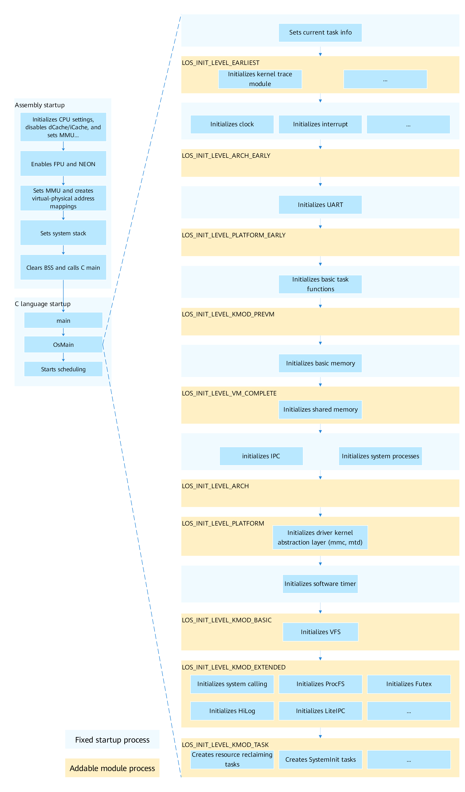

# Startup in Kernel Mode


## Kernel Startup Process

The kernel startup process consists of the assembly startup and C language startup, as shown in **Figure 1**. 

The assembly startup involves the following operations: initializing CPU settings, disabling dCache/iCache, enabling the FPU and NEON, setting the MMU to establish the virtual-physical address mapping, setting the system stack, clearing the BSS segment, and calling the main function of the C language. 

The C language startup involves the following operations: starting the **OsMain** function and starting scheduling. 

**OsMain()** is used for basic kernel initialization and architecture- and board-level initialization. The kernel startup framework leads the initialization process. The right part of the figure shows the phase in which external modules can register with the kernel startup framework and starts. **Table 1** describes each phase.

**Figure 1** Kernel startup process




**Table 1** Kernel startup framework

| API| Description|
| -------- | -------- |
| LOS_INIT_LEVEL_EARLIEST | Earliest initialization.<br>The initialization is architecture-independent. The board and subsequent modules initialize the pure software modules on which they depend.<br>Example: trace module|
| LOS_INIT_LEVEL_ARCH_EARLY | Early initialization of the architecture.<br>The initialization is architecture-dependent. Subsequent modules initialize the modules on which they depend. It is recommended that functions not required for startup be placed at **LOS_INIT_LEVEL_ARCH**.|
| LOS_INIT_LEVEL_PLATFORM_EARLY | Early initialization of the platform.<br>The initialization depends on the board platform and drivers. Subsequent modules initialize the modules on which they depend. It is recommended that functions required for startup be placed at **LOS_INIT_LEVEL_PLATFORM**.<br>Example: UART module|
| LOS_INIT_LEVEL_KMOD_PREVM | Kernel module initialization before memory initialization.<br>Initialize the modules that need to be enabled before memory initialization.|
| LOS_INIT_LEVEL_VM_COMPLETE | Initialization after the basic memory is ready.<br>After memory initialization, initialize the modules that need to be enabled and do not depend on inter-process communication (IPC) and system processes.<br>Example: shared memory function|
| LOS_INIT_LEVEL_ARCH | Late initialization of the architecture.<br>The initialization is related to the architecture extension functions. Subsequent modules initialize the modules on which they depend.|
| LOS_INIT_LEVEL_PLATFORM | Late initialization of the platform.<br>The initialization depends on the board platform and drivers. Subsequent modules initialize the modules on which they depend.<br>Example: initialization of the driver kernel abstraction layer (MMC and MTD)|
| LOS_INIT_LEVEL_KMOD_BASIC | Initialization of the kernel basic modules.<br>Initialize the basic modules that can be detached from the kernel.<br>Example: VFS initialization|
| LOS_INIT_LEVEL_KMOD_EXTENDED | Initialization of the kernel extended modules.<br>Initialize the extended modules that can be detached from the kernel.<br>Example: initialization of system call, ProcFS, Futex, HiLog, HiEvent, and LiteIPC|
| LOS_INIT_LEVEL_KMOD_TASK | Kernel task creation.<br>Create kernel tasks (kernel tasks and software timer tasks).<br>Example: creation of the resident resource reclaiming task, SystemInit task, and CPU usage statistics task|
| LOS_INIT_LEVEL_FINISH | Complete of the kernel initialization.|


## Development Example

**Example Description**

Add a kernel module and register the initialization function of the module to the kernel startup process through the kernel startup framework, so as to complete the module initialization during the kernel initialization process.

You can compile and verify the sample code in **kernel/liteos_a/testsuites/kernel/src/osTest.c**.

**Sample Code**

```c
/* Header file of the kernel startup framework */
#include "los_init.h"

/* Initialization function of the new module */
unsigned int OsSampleModInit(void)
{
    PRINTK("OsSampleModInit SUCCESS!\n");
}

/* Register the new module at the target level of the kernel startup framework. */
LOS_MODULE_INIT(OsSampleModInit, LOS_INIT_LEVEL_KMOD_EXTENDED);
```

**Verification**

```

main core booting up...

/* The print information may vary depending on the running environment.  */
...

/* Print the initialization function of the new module in the test code. */
OsSampleModInit SUCCESS!
```


According to the information displayed during the system startup, the kernel calls the initialization function of the registered module during the startup to initialize the module.


> **NOTE**
>
> Modules of the same level cannot depend on each other. It is recommended that a new module be split based on the preceding startup phase and be registered and started as required.
>
> You can view the symbol table in the **.rodata.init.kernel.*** segment of the **OHOS_Image.map** file generated after the build is complete, so as to learn about the initialization entry of each module that has been registered with the kernel startup framework and check whether the newly registered initialization entry has taken effect.
