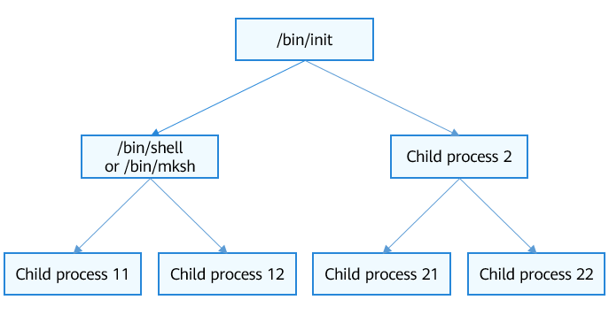

# Startup in User Mode


## Startup of the Root Process in User Mode

The root process is the first user-mode process in the system. The process ID is 1. The root process is the ancestor of all user-mode processes.

**Figure 1** Process tree




### Startup Process of the Root Process

Use the link script to place the following init startup code to the specified location in the system image.


```c
#define LITE_USER_SEC_ENTRY   __attribute__((section(".user.entry")))
LITE_USER_SEC_ENTRY VOID OsUserInit(VOID *args)
{
#ifdef LOSCFG_KERNEL_DYNLOAD
    sys_call3(__NR_execve, (UINTPTR)g_initPath, 0, 0);
#endif
    while (true) {
    }
}
```

> **NOTE**
>
> The preceeding code is in **kernel/liteos_a/kernel/user/src/los_user_init.c**. The value of **g_initPath** can be **/dev/shm/init** or **/bin/init**, depending on the startup settings.

Use **OsUserInitProcess** to start the **init** process. The procedure is as follows:

1. The kernel calls **OsLoadUserInit** to load the code for startup.

2. A process space is created to start the **/bin/init** process.


### Responsibilities of the Root Process

- The root process starts key system programs or services, such as shell.
  > **NOTE**
  > In OpenHarmony, the **init** process reads **/etc/init.cfg** and runs commands or starts processes based on the configuration. For details, see [init Configuration File](../subsystems/subsys-boot-init-cfg.md).

- The root process monitors the process for reclaiming the orphan process and clears the zombie processes in child processes.


## Running Programs in User Mode

A user-mode program can be started in either of the following ways:

- Using shell commands

  ```
  OHOS $ exec helloworld
  OHOS $ ./helloworld
  OHOS $ /bin/helloworld
  ```

- Using POSIX APIs
  Use **Fork()** to create a process, and call **exec()** to execute a process.

