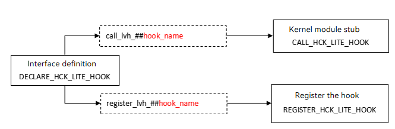

# HCK


## Background

Vendors have different kernel requirements and feature solutions when adapting their platforms to OpenHarmony.

If their code is directly integrated into the kernel repository or patches are applied, problems such as low build and development efficiency, complex routine maintenance, and poor feature portability will be caused.

To incorporate third-party kernel features into OpenHarmony without or with little interference with the kernel repository, OpenHarmony provides the OpenHarmony Common Kernel (HCK) framework, which provides a complete set of instrumentation, registration, and invoking interfaces to reduce modification to the kernel. The HCK provides instrumentation interfaces applicable to multiple platforms, implementing decoupling of the kernel.

This document describes how to implement the HCK based on the native hook mode.

## Application Scope

You can use the HCK framework when your Linux kernel patches, features, and modules require modification on the native kernel.

## Available APIs

**DECLARE_HCK_LITE_HOOK**: macro used to declare an instrumentation interface. It generates the registration and call interfaces.

**REGISTER_HCK_LITE_HOOK**: macro used to register an instrumentation interface instance. The HCK supports only the registration of a singleton for a singleton, and the registered interfaces cannot be deregistered.

**REGISTER_HCK_LITE_DATA_HOOK**: macro used to register an instrumentation interface instance with parameters. Only a singleton can be registered, and the registered interfaces cannot be deregistered.

**CALL_HCK_LITE_HOOK**: macro used to call an instrumentation interface, which replaces the code that intrudes into the native kernel code.

**Figure 1** HCK interface definition, registration, and invocation



## Usage Guide

### Configuration

Before using the HCK, enable the following settings in the **config** file of your platform in the **kernel_linux_config** repository:

```c
CONFIG_HCK=y
CONFIG_HCK_VENDOR_HOOKS=y
```

### Interface Definition

Define the hook interface in **kernel-x.x/include/linux/hck/lite_hck_xxx.h** by using the following macro:

```c
#include <linux/hck/lite_vendor_hooks.h> // Include HCK header file.

// You can customize data types for passing in parameters in interface registration.
struct hck_data {
   int   stat;
   char* name;
};

// Declare the hook interface. The declaration macro contains the EXPORT interface, and you do not need to call EXPORT separately to declare the interface.
DECLARE_HCK_LITE_HOOK(boot_config_info0_lhck, TP_PROTO(Type Parameter, ...), TP_ARGS(Parameter, ...));
```

### Interface Declaration

Add the interface declaration header file to the new vendor hck module. The file path is **drivers/hck/vendor_hooks.c**.

```c
#define CREATE_LITE_VENDOR_HOOK
#include <linux/hck/lite_hck_sample.h> // Add the interface declaration header file after the macro definition.
```

### Interface Registration

Define the instrumentation function and register the hook functions in the hook module.

```c
// Include the interface declaration header file.
#include <linux/hck/lite_hck_sample.h>

// Implement the interfaces:
boot_config_info0([void* data], ...)
{
    // Call the input parameters for the registration.
    ((struct hck_data*)data)->stat ... ;
}

// Register the interface. Generally, register the interface in the init() function of the module. Ensure that the registration is completed before the interface is called.
xxx_init()
{
    REGISTER_HCK_LITE_HOOK(boot_config_info0_lhck, boot_config_info0);
    // Register the interface with parameters. The input parameters can be obtained and used in the interface instance.
    REGISTER_HCK_LITE_DATA_HOOK(boot_config_info1_lhck, boot_config_info1, data);
}
```

### Interface Calling

Add the hook function in other kernel modules.

For example, add the previously defined interface to **linux-x.y/drivers/xxx/xxx.c**.

```c
#include <linux/hck/lite_hck_sample.h>
...
int foo(...)
{
    CALL_HCK_LITE_HOOK(boot_config_info0_lhck, parameter...);
}
```

### Example

kernel/linux/linux-5.10(or linux-6.6)/samples/hck

To enable the sample code, enable the following settings in **config** (do not enable the settings in the official version):

```c
CONFIG_SAMPLES=y
CONFIG_SAMPLE_HCK=y
CONFIG_SAMPLE_HCK_CALL=y
CONFIG_SAMPLE_HCK_REGISTER=y
```

## Specifications

### Naming Rules

1. Comply with the kernel interface naming rules. The interface names should be descriptive.

2. Add **suffix _lhck** to the end of the interface names of lite hck interfaces. For example:
```c
DECLARE_HCK_LITE_HOOK(boot_config_info0_lhck, TP_PROTO(int* s ), TP_ARGS(s));
```

3. Use English words and grammar, not Hanyu Pinyin.

4. Use commonly accepted abbreviations. Do not create abbreviations.

5. Avoid using negative expressions.

For example, name the interface for obtaining the boot configuration as follows:get_boot_config_lhck

### File Directory Specifications

1. Place the interface definition header file in **kernel-x.x/include/linux/hck/**.

2. Name header files in the **lite_hck_*module-description*.h** format, for example, **lite_hck_mmc.h**.
