# New IP Kernel Protocol Stack


## Basic Concepts

On basis of the traditional IP, New IP employs lightweight packet headers and variable-length, multi-semantic addresses and integrates Layer 2 and Layer 3 protocols to simplify protocols, reduce redundant bytes, and improve the energy efficiency ratio (EER), net throughput, and communication efficiency. New IP strives to implement end-to-end interconnection between heterogeneous networks to support ultimate experience of Super Device via efficient communication between devices.

The Wi-Fi protocol packets cause low transmission efficiency due to high overheads in Layer 3 packet headers and addressing.

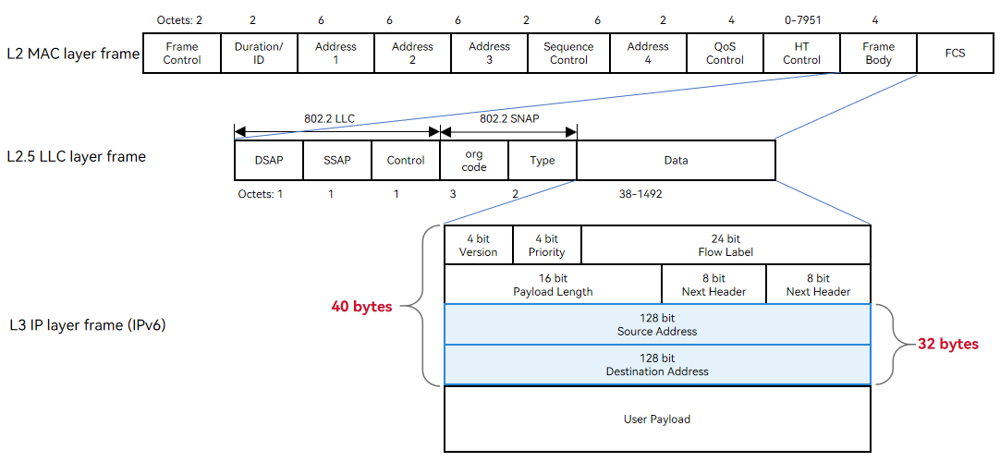

```
An IPv4 address has a fixed length of 4 bytes, and an IPv6 address has a fixed length of 16 bytes.
The network layer header ranges from 20 to 60 bytes for an IPv4 packet and is 40 bytes for an IPv6 packet.
```

New IP supports variable-length multi-semantic addresses (min. 1 byte) and customized header encapsulation (min. 5 bytes). Simplified packet headers reduce overheads and improve transmission efficiency.

New IP provides 25.9% fewer packet header overheads than IPv4 and 44.9% less than IPv6.

New IP provides at least 1% higher payload transmission efficiency than IPv4 and 2.33% higher than IPv6.

| Scenario       | Header Overhead (Bytes)    | Payload Transmission Efficiency<br>(Wi-Fi MTU = 1500 Bytes, BT MTU = 255 Bytes)|
| --------------- | ------------ | ------------------------------------------- |
| IPv4 for Wi-Fi   | 30 + 8 + 20 = 58 | (1500 - 58)/1500 = 96.13%                       |
| IPv6 for Wi-Fi   | 30 + 8 + 40 = 78 | (1500 - 78)/1500 = 94.8%                        |
| New IP for Wi-Fi | 30 + 8 + 5 = 43 | (1500 - 43)/1500 = 97.13%                       |

## Variable-Length Header Format

The following figure shows a New IP Wi-Fi packet header. "EtherType = 0xEADD" in the LLC header identifies the New IP packet. A bitmap is a binary sequence. The value of each binary bit indicates whether a field is carried in the New IP header. That is, the New IP header can be customized based on service requirements.

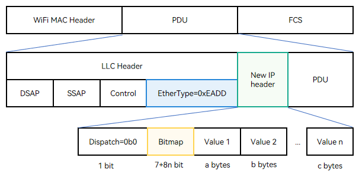

- **Dispatch** indicates the encapsulation type. The value **0b0** indicates the New IP encapsulation child class, which is 1 bit long (**0b** indicates that the following values are binary).

- **Bitmap** is of variable length. By default, it is seven bits following the **Dispatch** valid bit. The length of **Bitmap** can be extended contiguously. If the last bit of **Bitmap** is **0**, it indicates the end of **Bitmap**. If the last bit is **1**, it means one more byte until the last bit **0**.
- **Value** indicates the field value. The length is an integer multiple of 1 byte. The value type and length are determined by the semantic table of the header field.

The **Bitmap** field is defined as follows:

| Bitmap Identifier              | Bitops | Length of the Field Carried (Byte)  | Setting      | Remarks                                   |
| ---------------------------- | ------ | ---------------- | -------------- | --------------------------------------- |
| Bitmap first byte            | -      | -                | -              | The eight bits are from the most significant bit to the least significant bit.           |
| Dispatch              | 0      | -                | Set to **0**.           | **0**: indicates a New IP packet; **1**: indicates a non-New-IP packet.   |
| Whether the packet header carries the TTL           | 1      | 1          | Set to **1**.           | Indicates the number of remaining hops.                             |
| Whether the packet header carries the total length  | 2      | 2          | Set to **0** for UDP and **1** for TCP.| Total length of the New IP packet (including the header)     |
| Whether the packet header carries the Next Header   | 3      | 1          | Set to **1**.           | Protocol type.                             |
| Reserve                      | 4      | Reserved            | Set to **0**.           | Reserved.                             |
| Whether the packet header carries the destination address  | 5      | Variable length (1 to 8 bytes)| Set to **1**.           | Destination address.                             |
| Whether the packet header carries the source address| 6      | Variable length (1 to 8 bytes)| Determined by the protocol.| Source address.                               |
| Flag bit, indicating whether there is the second byte  | 7      | -                | -              | **0**: indicates the end of the bitmap. **1**: indicates another 8-bit bitmap.|
| Bitmap second byte             | -      | -                | -              | The eight bits are from the most significant bit to the least significant bit.           |
| Whether the packet header carries the header Length | 0      | 1          | -              | New IP header length.                       |
| Reserve                      | 1      | Reserved            | Set to **0**.           | -                                       |
| Reserve                      | 2      | Reserved            | Set to **0**.           | -                                       |
| Reserve                      | 3      | Reserved            | Set to **0**.           | -                                       |
| Reserve                      | 4      | Reserved            | Set to **0**.           | -                                       |
| Reserve                      | 5      | Reserved            | Set to **0**.           | -                                       |
| Reserve                      | 6      | Reserved            | Set to **0**.           | -                                       |
| Flag bit, indicating whether there is the third byte  | 7      | -                | -              | **0**: indicates the end of the bitmap. **1**: indicates another 8-bit bitmap.|

The New IP header is parsed as follows:

Only the bitmap fields defined in New IP are parsed. All the bitmap fields with unknown semantics are skipped. The start position of the packet is located for parsing based on the header length. If the packet header contains bitmap fields with unknown semantics and does not contain the header length, the packet will be discarded.

## Variable-Length Address Format

Different from IPv4 and IPv6, which use fixed-length addresses, New IP supports variable-length addresses and parse of the address length. The packet header may not carry the address length field. The encoding format of New IP addresses is as follows:

| First Byte | Semantics                                                    | Valid Range of Address                                               |
| ---------- | ------------------------------------------------------------ | ------------------------------------------------------------ |
| 0x00       | Address is 0                                                 | [1 byte] 0 to 220 (0x00 to 0xDC)                              |
| 0x01       | Address is 1                                                 | -                                                            |
| 0x02       | Address is 2                                                 | -                                                            |
| ...        | ...                                                          | -                                                            |
| 0xDC       | Address is 220                                               | -                                                            |
| 0xDD       | An 16-bit address, which is 0 + 256 * (0xDD - 0xDD) + the last byte value | [2 bytes] 221 to 255 (0x**DD**DD to 0x**DD**FF)                |
| 0xDE       | An 16-bit address, which is 0 + 256 * (0xDE - 0xDD) + the last byte value | [2 bytes] 256 to 511 (0x**DE**00 to 0x**DE**FF)                |
| 0xDF       | An 16-bit address, which is 0 + 256 * (0xDF - 0xDD) + the last byte value | [2 bytes] 512 to 767 (0x**DF**00 to 0x**DF**FF)                |
| ...        | ...                                                          | -                                                            |
| 0xF0       | An 16-bit address, which is 0 + 256 * (0xF0 - 0xDD) + the last byte value | [2 bytes] 4864 to 5119 (0x**F0**00 to 0x**F0**FF)              |
| 0xF1       | An 16-bit address is followed                                | [3 bytes] 5120 to 65535 (0x**F1** 1400 to 0x**F1** FFFF)       |
| 0xF2       | An 32-bit address is followed                                | [5 bytes] 65536 to 4,294,967,295 (0x**F2** 0001 0000 to 0x**F2** FFFF FFFF)|
| 0xF3       | An 48-bit address is followed                                | [7 bytes] 4,294,967,296 to 281,474,976,710,655 (0x**F3** 0001 0000 0000 to 0x**F3** FFFF FFFF FFFF)|
| 0xFE       | An 56-bit address is followed                                | [8 bytes] 0 to 72,057,594,037,927,935 (0x**FE**00 0000 0000 0000 to 0x**FE**FF FFFF FFFF FFFF)|


## New IP Configuration

### Enabling New IP

Only the Linux 5.10 kernel of the RK3568 development board supports the New IP kernel protocol stack. To enable New IP, search for "NEWIP" in the kernel module configuration file of the RK3568 development board and set related parameters as follows:

```
# kernel/linux/config/linux-5.10/arch/arm64/configs/rk3568_standard_defconfig
CONFIG_NEWIP=y          // Enable the New IP kernel protocol stack.
CONFIG_NEWIP_HOOKS=y    // Enable New IP stub functions to be dynamically registered non-disruptively. This feature must be enabled when New IP is enabled.
HCK_VENDOR_HOOKS=y      // Enable the basic kernel instrumentation framework. New IP depends on this framework. It is enabled by default on the RK3568 development board.
```

Run the following command to check whether the New IP protocol stack is successfully enabled:

```
find out/ -name *nip*.o
...
out/kernel/OBJ/linux-5.10/net/newip/nip_addrconf_core.o
out/kernel/OBJ/linux-5.10/net/newip/nip_hdr_decap.o
out/kernel/OBJ/linux-5.10/net/newip/nip_addr.o
out/kernel/OBJ/linux-5.10/net/newip/nip_checksum.o
out/kernel/OBJ/linux-5.10/net/newip/tcp_nip_output.o
...
```

> **NOTE**
>
> All native kernel code must be non-disruptively modified into stub functions. For example, when New IP is added to the common process of IPv4/IPv6 stacks, you need to break into New IP stubs instead of calling New IP functions directly. After New IP is enabled, register the New IP functions with the function pointers during module initialization. Then, the New IP functions can be called in the common IPv4/IPv6 process through the function pointers.

```c
/* Register the New IP ehash function with the kernel. */
/* Call the newip hook function in sk_ehashfn function (net\ipv4\inet_hashtables.c):
 */
void nip_ninet_ehashfn(const struct sock *sk, u32 *ret)
{
	*ret = ninet_ehashfn(sock_net(sk), &sk->SK_NIP_RCV_SADDR,
			     sk->sk_num, &sk->SK_NIP_DADDR, sk->sk_dport);
}

void nip_ninet_ehashfn_lhck_register(void)
{
	REGISTER_HCK_LITE_HOOK(nip_ninet_ehashfn_lhck, nip_ninet_ehashfn);
}

/* Add the New IP stack processing to the general entry function of IPv4/IPv6 stacks. */
static u32 sk_ehashfn(const struct sock *sk)
{
    /* IPv6 */
#if IS_ENABLED(CONFIG_IPV6)
	if (sk->sk_family == AF_INET6 &&
	    !ipv6_addr_v4mapped(&sk->sk_v6_daddr))
		return inet6_ehashfn(sock_net(sk),
				     &sk->sk_v6_rcv_saddr, sk->sk_num,
				     &sk->sk_v6_daddr, sk->sk_dport);
#endif

	if (sk->sk_family == AF_NINET) {
		u32 ret = 0;

        /* Register the New IP ehash function. */
		CALL_HCK_LITE_HOOK(nip_ninet_ehashfn_lhck, sk, &ret);
		return ret;
	}
    /* IPv4 */
	return inet_ehashfn(sock_net(sk),
			    sk->sk_rcv_saddr, sk->sk_num,
			    sk->sk_daddr, sk->sk_dport);
}
```

### Disabling New IP

To disable New IP, search for "NEWIP" in the kernel module configuration file of the RK3568 development board and delete or comment out "CONFIG_NEWIP=y" and "CONFIG_NEWIP_HOOKS=y".

```
# kernel/linux/config/linux-5.10/arch/arm64/configs/rk3568_standard_defconfig
# CONFIG_NEWIP is not set
# CONFIG_NEWIP_HOOKS is not set
```

## New IP APIs

The user-mode application calls **socket()** to create a New IP socket and uses the New IP frame header encapsulation to send and receive packets. The following table lists the socket APIs for New IP.

| API    | Input                                                        | Output                                          | Return Value          | Description                                                |
| -------- | ------------------------------------------------------------ | ---------------------------------------------- | ---------------- | ------------------------------------------------------------ |
| socket   | int **domain**, int type, int **protocol**                   | NA                                             | Socket handle **sockfd**.| Creates a New IP socket. <br>**domain** must be **AF_NINET**, which indicates a New IP socket.<br>**protocol** can be **IPPROTO_TCP** or **IPPROTO_UDP**.<br>This API returns the handle of the **socket** instance created. |
| bind     | int sockfd, const **struct sockaddr_nin** *myaddr, socklen_t addrlen | NA                                             | Error code, which is an integer. | Binds the **socket** instance to the specified IP address and port.<br>**myaddr->sin_family** must be **AF_NINET**. |
| listen   | int socket, int backlog                                      | NA                                             | Error code, which is an integer. | Listens for the New IP address and port from the server.                                |
| connect  | int sockfd, const **struct sockaddr_nin** *addr, aocklen_t addrlen | NA                                             | Error code, which is an integer. | Sets up a connection between the client and the server.                                  |
| accept   | int sockfd, **struct sockaddr_nin** *address, socklen_t *address_len | NA                                             | **sockfd**.  | Accepts the connection request from the client.                              |
| send     | int sockfd, const void *msg, int len, unsigned int flags, const **struct sockaddr_nin** *dst_addr, int addrlen | NA                                             | Error code, which is an integer. | Sends New IP packets via the socket using TCP.                      |
| recv     | int sockfd, size_t len, int flags, **struct sockaddr_nin** *src_addr, | void  **buf, int* *fromlen                     | Error code, which is an integer. | Receives New IP packets via the socket using TCP.                      |
| close    | int sockfd                                                   | NA                                             | Error code, which is an integer. | Closes the socket to release resources.                                      |
| ioctl    | int sockfd, unsigned long cmd, ...                           | NA                                             | Error code, which is an integer. | Queries or modifies information about the New IP protocol stack.                      |
| sendto   | int sockfd, const void *msg, int len, unsigned int flags, const **struct sockaddr** *dst_addr, int addrlen | NA                                             | Error code, which is an integer. | Sends New IP packets via the socket using UDP.                      |
| recvfrom | int sockfd, size_t len, int flags,                           | void *buf, struct sockaddr *from, int *fromlen | Error code, which is an integer. | Receives New IP packets via the socket using UDP.                      |

The structure of the New IP short address is as follows:

```c
enum nip_8bit_addr_index {
	NIP_8BIT_ADDR_INDEX_0 = 0,
	NIP_8BIT_ADDR_INDEX_1 = 1,
	NIP_8BIT_ADDR_INDEX_2 = 2,
	NIP_8BIT_ADDR_INDEX_3 = 3,
	NIP_8BIT_ADDR_INDEX_4 = 4,
	NIP_8BIT_ADDR_INDEX_5 = 5,
	NIP_8BIT_ADDR_INDEX_6 = 6,
	NIP_8BIT_ADDR_INDEX_7 = 7,
	NIP_8BIT_ADDR_INDEX_MAX,
};

enum nip_16bit_addr_index {
	NIP_16BIT_ADDR_INDEX_0 = 0,
	NIP_16BIT_ADDR_INDEX_1 = 1,
	NIP_16BIT_ADDR_INDEX_2 = 2,
	NIP_16BIT_ADDR_INDEX_3 = 3,
	NIP_16BIT_ADDR_INDEX_MAX,
};

enum nip_32bit_addr_index {
	NIP_32BIT_ADDR_INDEX_0 = 0,
	NIP_32BIT_ADDR_INDEX_1 = 1,
	NIP_32BIT_ADDR_INDEX_MAX,
};

#define nip_addr_field8 v.u.field8
#define nip_addr_field16 v.u.field16
#define nip_addr_field32 v.u.field32

#pragma pack(1)
struct nip_addr_field {
	union {
		unsigned char   field8[NIP_8BIT_ADDR_INDEX_MAX];
		unsigned short field16[NIP_16BIT_ADDR_INDEX_MAX]; /* Big-endian */
		unsigned int   field32[NIP_32BIT_ADDR_INDEX_MAX]; /* Big-endian */
	} u;
};

struct nip_addr {
	unsigned char bitlen;	/* The address length is in bit (not byte). */
	struct nip_addr_field v;
};
#pragma pack()

/* The following structure must be larger than V4. System calls use V4.
 * If the definition is smaller than V4, the read process will have memory overruns
 * v4: include\linux\socket.h --> sockaddr (16Byte)
 */
#define POD_SOCKADDR_SIZE 3
struct sockaddr_nin {
	unsigned short sin_family; /* [2 bytes] AF_NINET */
	unsigned short sin_port;   /* [2 bytes] Transport layer port, big-endian */
	struct nip_addr sin_addr;  /* [9 bytes] New IP address */

	unsigned char sin_zero[POD_SOCKADDR_SIZE]; /* [3 bytes] Byte alignment */
};
```

## New IP Development

Only the OpenHarmony Linux-5.10 kernel supports New IP kernel protocol stack. You must manually configure IP address and route data for New IP in user mode, and connect the two devices through the router Wi-Fi. If you want to automatically switch to the New IP kernel protocol stack after configuring the New IP address and route, see the description in the blue box in the following figure.

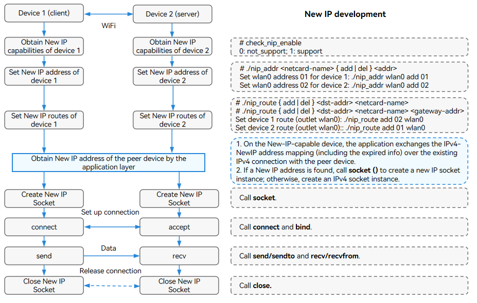

For details about the address and route configuration, see [examples](https://gitee.com/openharmony/kernel_linux_common_modules/tree/master/newip/examples). Modify the CC definition in Makefile based on the CPU you use, compile the CC definition into a binary file, and push the file to the development board. Refer to the figure above to configure the address and route data for New IP.

| File            | Description                                                    |
| ------------------ | -------------------------------------------------------- |
| nip_addr.c         | Sample code for configuring variable-length New IP addresses (any valid New IP address can be configured).|
| nip_route.c        | Sample code for configuring New IP route information (any valid New IP address can be configured).     |
| check_nip_enable.c | Code for obtaining the New IP capabilities of the local host.                                     |

Check the New IP address and route information on device 1.

```sh
# cat /proc/net/nip_addr
01          wlan0
# cat /proc/net/nip_route
02      ff09       1 wlan0        # Route to device 2.
01      01      2149580801 wlan0  # Route for sending packets to itself and receiving the packets.
```

Check the New IP address and route information on device 2.

```sh
# cat /proc/net/nip_addr
02          wlan0
# cat /proc/net/nip_route
01      ff09       1 wlan0        # Route to device 1.
02      02      2149580801 wlan0  # Route for sending packets to itself and receiving the packets.
```

## Sample Code for Receiving and Sending New IP Packets

The following table lists the related sample code. For details about how to use the user-mode APIs of the New IP stack, see [examples](https://gitee.com/openharmony/kernel_linux_common_modules/tree/master/newip/examples). Fixed addresses and routes are configured in the demo code. You do not need to manually specify the addresses and routes when executing the binary program.

| File               | Description                          |
| --------------------- | ------------------------------ |
| nip_addr_cfg_demo.c   | Sample code for configuring variable-length IP addresses.  |
| nip_route_cfg_demo.c  | Sample code for configuring NEW IP routes.        |
| nip_udp_server_demo.c | Sample code for the server to send and receive New IP packets using UDP.|
| nip_udp_client_demo.c | Sample code for the client to send and receive New IP packets using UDP.|
| nip_tcp_server_demo.c | Sample code for the server to send and receive New IP packets using TCP.|
| nip_tcp_client_demo.c | Sample code for the client to send and receive New IP packets using TCP.|
| nip_lib.c             | API demo code, for example, obtaining the interface index. |

**Basic Procedure**

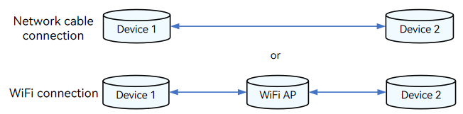

1. Copy the demo code to the Linux compiler, and run **make clean** and **make all** to compile the demo code.

2. Upload the generated binary files to device 1 and device 2.

3. Run the **ifconfig wlan0 up** command to start the network adapter.

4. Run the **./nip_addr_cfg_demo server** command on shell of device 1 to configure a variable-length address **0xDE00** (2 bytes) for the server. Run the **./nip_addr_cfg_demo client** command on shell of device 2 to configure a variable-length address **0x50** (1 byte) for the client. Run **cat /proc/net/nip_addr** to view the configuration result.

5. Run the **./nip_route_cfg_demo server** command on shell of device 1 to configure the server route data. Run the **./nip_route_cfg_demo client** command on shell of device 2 to configure the client route data. Then, run the **cat /proc/net/nip_route** command to check the kernel route configuration.

Now, you can send and receive packets over UDP/TCP. By default, the addresses and routes configured are used for sending and receiving packets.


**Sending and Receiving Packets over UDP**

Run the **./nip_udp_server_demo** command on the server and then the **./nip_udp_client_demo** command on the client. The client sends 10 New IP packets. After receiving the packets, the server sends them to the client.

```
The following information is displayed in the shell window on the server:
Received -- 1661826989 498038 NIP_UDP #      0 -- from 0x50:57605
Sending  -- 1661826989 498038 NIP_UDP #      0 -- to 0x50:57605
Received -- 1661826990  14641 NIP_UDP #      1 -- from 0x50:57605
Sending  -- 1661826990  14641 NIP_UDP #      1 -- to 0x50:57605
Received -- 1661826990 518388 NIP_UDP #      2 -- from 0x50:57605
Sending  -- 1661826990 518388 NIP_UDP #      2 -- to 0x50:57605
...
Received -- 1661827011 590576 NIP_UDP #      9 -- from 0x50:37758
Sending  -- 1661827011 590576 NIP_UDP #      9 -- to 0x50:37758

The following information is displayed in the shell window on the client:
Received --1661827007  55221 NIP_UDP #      0 sock 3 success:     1/     1/no=     0
Received --1661827007 557926 NIP_UDP #      1 sock 3 success:     2/     2/no=     1
Received --1661827008  62653 NIP_UDP #      2 sock 3 success:     3/     3/no=     2
...
Received --1661827011 590576 NIP_UDP #      9 sock 3 success:    10/    10/no=     9
```


**Sending and Receiving Packets over TCP**

Run the **./nip_tcp_server_demo** command on the server and then the **./nip_tcp_client_demo** command on the client. The client sends 10 New IP packets. After receiving the packets, the server sends them to the client.

```
The following information is displayed in the shell window on the server:
Received -- 1661760202 560605 NIP_TCP #      0 --:1024
Sending  -- 1661760202 560605 NIP_TCP #      0 --:1024
Received -- 1661760203  69254 NIP_TCP #      1 --:1024
Sending  -- 1661760203  69254 NIP_TCP #      1 --:1024
Received -- 1661760203 571604 NIP_TCP #      2 --:1024
Sending  -- 1661760203 571604 NIP_TCP #      2 --:1024
...
Received -- 1661760207  86544 NIP_TCP #      9 --:1024
Sending  -- 1661760207  86544 NIP_TCP #      9 --:1024

The following information is displayed in the shell window on the client:
Received --1661760202 560605 NIP_TCP #      0 sock 3 success:     1/     1/no=     0
Received --1661760203  69254 NIP_TCP #      1 sock 3 success:     2/     2/no=     1
...
Received --1661760207  86544 NIP_TCP #      9 sock 3 success:    10/    10/no=     9
```

## SELinux Policy

The SELinux policy must be added for the user-mode process to use New IP sockets. Otherwise, the operation will be intercepted.

```sh
# base\security\selinux\sepolicy\ohos_policy\xxx\xxx.te
# socket operation
# avc:  denied  { create } for  pid=540 comm="thread_xxx" scontext=u:r:thread_xxx:s0 tcontext=u:r:thread_xxx:s0 tclass=socket permissive=0
allow thread_xxx thread_xxx:socket { create bind connect listen accept read write shutdown setopt getopt };

# ioctl operation
# The operation code is defined in linux-xxx\include\uapi\linux\sockios.h.
# 0x8933 : name -> if_index mapping
# 0x8916 : set PA address
# 0x890B : add routing table entry
allowxperm thread_xxx thread_xxx:socket ioctl { 0x8933 0x8916 0x890B };
```

## WireShark Packet Parsing Template

The default packet parsing rules of Wireshark cannot parse New IP packets. You can add a New IP packet parsing template to Wireshark to parse New IP packets. For details about the template, see [New IP packet parsing template](https://gitee.com/openharmony/kernel_linux_common_modules/blob/master/newip/tools/wireshark_cfg_for_newip.lua).

The procedure is as follows:

1. Choose **Help** > **About Wireshark** > **Folders**, and open the **init.lua** file in the **Global Configuration** directory. 
2. Add **dofile (DATA_DIR.."newip.lua")** to the end of the file. *DATA_DIR* is the path of the **newip.lua** file.

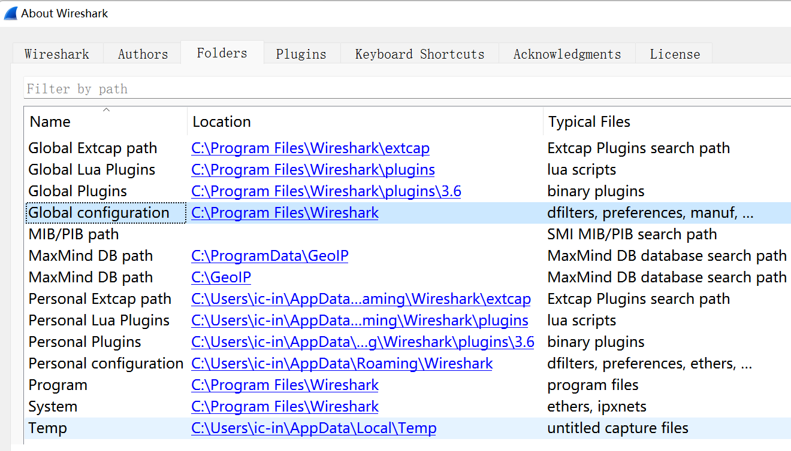

Example:

```
Path of the New IP packet parsing template:
D:\tools\WireShark\wireshark_cfg_for_newip.lua

Path of the WireShark configuration file:
C:\Program Files\Wireshark\init.lua

Add the following to the end of the init.lua file (Windows 11, for example):
dofile("D:\\tools\\WireShark\\wireshark_cfg_for_newip.lua")
```

### Packet Parsing Example

#### ND Request

The following figure shows the format of a New IP Neighbor Discovery (ND) request packet. The header contains a 1-byte bitmap (**0x76**), which is followed by the TTL, total length of the packet, upper-layer protocol type, destination address, and source address. The New IP ND request packet contains the packet type, operation code, checksum, and request address.

> **NOTE**
>
> New IP supports variable-length addresses (1 to 8 bytes). The 1-byte address in Bitmap 1 indicates that the address carried in the current packet header is of 1 byte.

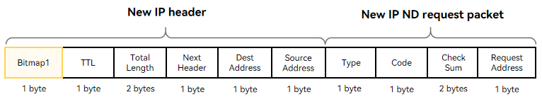


#### ND Response

The following figure shows the format of a New IP ND response packet. The New IP header contains two bitmaps (**0x77** and **0x00**). Bitmap1 is followed by the TTL, total packet length, upper-layer protocol type, destination address, and source address. Bitmap2 is used for byte alignment and does not carry any data. (For the rk3568 development board, the data transmitted in the link layer must be of an even number of bytes.) A New IP ND response packet contains the packet type, operation code, checksum, neighbor MAC address length, and neighbor MAC address.

> **NOTE**
>
> New IP supports variable-length addresses (1 to 8 bytes). The 1-byte address in Bitmap 1 indicates that the address carried in the current packet header is of 1 byte.

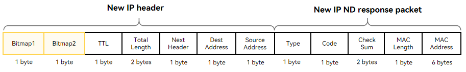

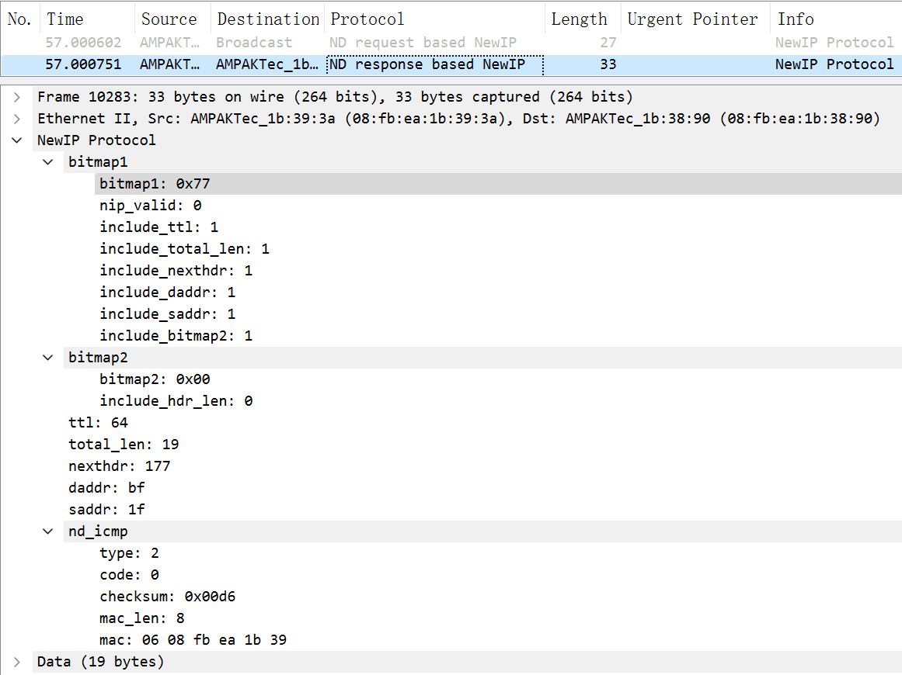

#### TCP Handshake

The figure below shows the format of a TCP three-way handshake SYN packet. The New IP packet header contains two bitmaps (**0x77** and **0x00**). Bitmap1 is followed by the TTL, total packet length, upper-layer protocol type, destination address, and source address. Bitmap2 is used for byte alignment and does not carry any data. (For the rk3568 development board, the data transmitted in the link layer must be of an even number of bytes.)

> **NOTE**
>
> New IP supports variable-length addresses (1 to 8 bytes). The 1-byte address in Bitmap 1 indicates that the address carried in the current packet header is of 1 byte.

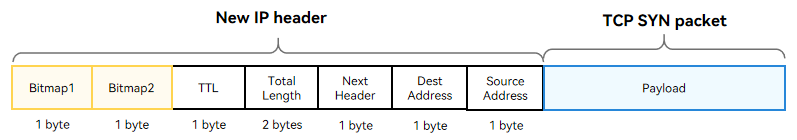


#### TCP Data Packet

The figure below shows the TCP data format. The New IP header contains two bitmaps (**0x77** and **0x00**). Bitmap 1 is followed by the TTL, total packet length, upper-layer protocol type, destination address, and source address. Bitmap2 is used for byte alignment and does not carry any data. (For the rk3568 development board, the data transmitted in the link layer must be of an even number of bytes.)

> **NOTE**
>
> New IP supports variable-length addresses (1 to 8 bytes). The 1-byte address in Bitmap 1 indicates that the address carried in the current packet header is of 1 byte.

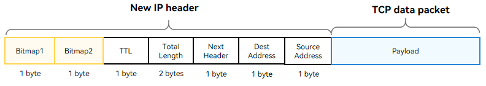

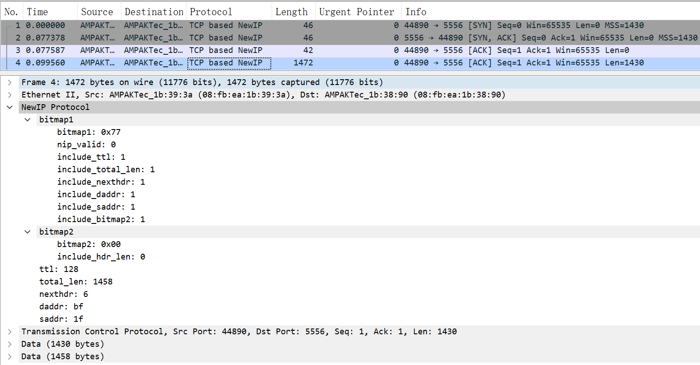
