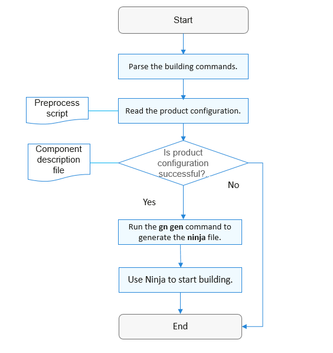

# Compilation and Building Subsystem<a name="EN-US_TOPIC_0000001063302771"></a>

-   [Building Process](#section1111311235313)
-   [Building Adaptation Process](#section2159183845319)

## Building Process<a name="section1111311235313"></a>

The compilation and building subsystem is a building system based on Generate Ninja \(GN\) and Ninja. The following figure shows the building process.

**Figure  1**  Building process<a name="fig23781931124913"></a>  


-   **Parse the building commands**: Parse the product name, building type \(debug or release\), specified compiler, and whether a component will be compiled independently.

    > **NOTE:** 
    >If the building type is debug, XTS will be involved in the building. If the building type is release, the symbol table and debugging information of the file generated after building will be removed.

-   **Read the product configuration**: Read the  **vendor/_x\_company_/_x\_product_.json**  file that contains the development board, kernel type, kernel version, and components to configure.
-   **Run the gn gen command to generate the ninja file**: Based on the parsed product configuration, add the selected components to build according to the corresponding building toolchain and configure global building options.
-   **Use Ninja to start building**: Build and link the components one by one.

For details about GN, see  [GN Quick Start Guide](https://gn.googlesource.com/gn/+/master/docs/quick_start.md).

## Building Adaptation Process<a name="section2159183845319"></a>

You need to create a directory for the development board. Taking the  **RTL8720**  development board of Realtek for example, the  **device/realtek/rtl8720**  directory must be created. To complete the building adaptation, perform the following steps:

1.  Configure the toolchain and building options.

    The  **ohos-clang**  toolchain is used by default. SoC vendors can also customize the configuration based on their development boards. The building-related variables in the building configuration file of the development board are described as follows:

    -   **kernel\_type**: kernel type used by the development board, for example,  **"liteos\_a"**,  **"liteos\_m"**, or  **"Linux"**.
    -   **kernel\_version**: kernel version used for development, for example,  **"4.19"**.
    -   **board\_cpu**: CPU type of the development board, for example,  **"cortex-a7"**  or  **"riscv32"**.
    -   **board\_arch**: chip architecture of the development board, for example,  **"armv7-a"**, or  **"rv32imac"**.
    -   **board\_toolchain**: name of the customized building toolchain used by the development board, for example,  **"gcc-arm-none-eabi"**. If this variable is not specified,  **ohos-clang**  will be used by default.
    -   **board\_toolchain\_prefix**: prefix of the building toolchain, for example,  **"gcc-arm-none-eabi"**.
    -   **board\_toolchain\_type**: building toolchain type. Currently, GNU compiler collection \(GCC\) and clang are supported, for example,  **"gcc"**  and  **"clang"**.
    -   **board\_cflags**: building options of the  **.c**  file configured for the development board.
    -   **board\_cxx\_flags**: building options of the  **.cpp**  file configured for the development board.
    -   **board\_ld\_flags**: link options configured for the development board.

        The corresponding  **config.gni**  file will be loaded based on the development board selected by the product. The variables in this file are globally visible to system components.


    Taking the RTL8720 development board of Realtek as an example, the  **device/realtek/rtl8720/liteos\_m/config.gni**  file is configured as follows:

    ```
    # Kernel type, e.g. "linux", "liteos_a", "liteos_m".
    kernel_type = "liteos_m"
    
    # Kernel version.
    kernel_version = ""
    
    # Board CPU type, e.g. "cortex-a7", "riscv32".
    board_cpu = "real-m300"
    
    # Board arch, e.g. "armv7-a", "rv32imac".
    board_arch = ""
    
    # Name of the toolchain that is used for system building
    # E.g. gcc-arm-none-eabi, arm-linux-harmonyeabi-gcc, ohos-clang, riscv32-unknown-elf.
    # Note: The "ohos-clang" toolchain is used by default. You can also customize the toolchain.
    board_toolchain = "gcc-arm-none-eabi"
    
    # Path where the toolchain is installed, which can be left blank if the installation path has been added to ~/.bashrc.
    board_toolchain_path =
        rebase_path("//prebuilts/gcc/linux-x86/arm/gcc-arm-none-eabi/bin",
                    root_build_dir)
    
    # Prefix of the toolchain
    board_toolchain_prefix = "gcc-arm-none-eabi-"
    
    # Type of the toolchain
    board_toolchain_type = "gcc"
    
    # Building flags related to the board
    board_cflags = []
    board_cxx_flags = []
    board_ld_flags = []
    ```

2.  Compile the development board script.

    For a newly added development board, the  **BUILD.gn**  file that functions as the entry for building must be added to the board directory. Taking the RTL8720 development board of Realtek as an example, the content in the  **device/realtek/rtl8720/BUILD.gn**  file is as follows:

    ```
    group("rlt8720") {
      ...
    }
    ```

3.  Start building and debugging

    1. Run the  **hb set**  command in any directory to set the source code path and the product to build.

    2. Run the  **hb build**  command in the development board directory to start the building.


