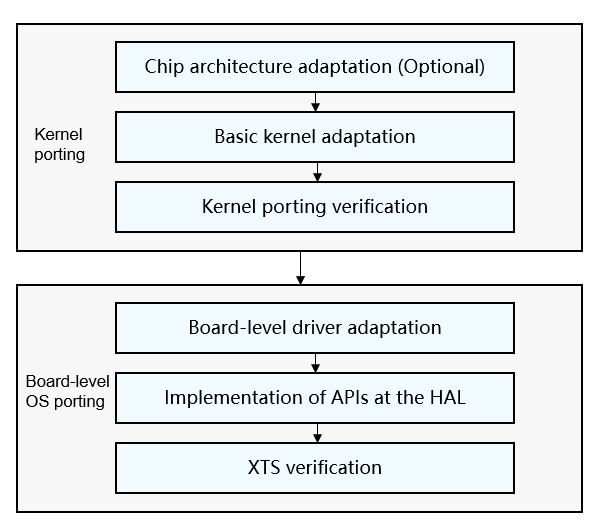

# Before You Start<a name="EN-US_TOPIC_0000001199722625"></a>

This document provides basic guidance for OpenHarmony developers and system on a chip \(SoC\) or module vendors to port OpenHarmony to typical chip architectures, such as the cortex-M and RISC-V series. Currently, the Bluetooth service is not supported. Due to the complexity of the OpenHarmony project, this document is subject to update as the version and APIs change.

This guide is intended for readers who have experience in developing embedded systems. Therefore, it mainly describes operations and key points during platform porting instead of basic introduction to the OS.

## Porting Directory<a name="section284217487490"></a>

The implementation of the OpenHarmony project directories and functions relies on the OS itself. If no enhancement for a complex feature is involved, you only need to focus on the directories described in the following table.

**Table  1**  Key directories in the porting process

<a name="table97326295179"></a>
<table><thead align="left"><tr id="row207334298172"><th class="cellrowborder" valign="top" width="27.71%" id="mcps1.2.3.1.1"><p id="p3733192991710"><a name="p3733192991710"></a><a name="p3733192991710"></a>Directory</p>
</th>
<th class="cellrowborder" valign="top" width="72.28999999999999%" id="mcps1.2.3.1.2"><p id="p37331329101713"><a name="p37331329101713"></a><a name="p37331329101713"></a>Description</p>
</th>
</tr>
</thead>
<tbody><tr id="row17331029181714"><td class="cellrowborder" valign="top" width="27.71%" headers="mcps1.2.3.1.1 "><p id="p873314296175"><a name="p873314296175"></a><a name="p873314296175"></a>/build/lite</p>
</td>
<td class="cellrowborder" valign="top" width="72.28999999999999%" headers="mcps1.2.3.1.2 "><p id="p1573342917172"><a name="p1573342917172"></a><a name="p1573342917172"></a>Basic building framework for <span id="text8913173395513"><a name="text8913173395513"></a><a name="text8913173395513"></a>OpenHarmony</span></p>
</td>
</tr>
<tr id="row427301117194"><td class="cellrowborder" valign="top" width="27.71%" headers="mcps1.2.3.1.1 "><p id="p11274411181915"><a name="p11274411181915"></a><a name="p11274411181915"></a>/kernel/liteos_m</p>
</td>
<td class="cellrowborder" valign="top" width="72.28999999999999%" headers="mcps1.2.3.1.2 "><p id="p92741311181915"><a name="p92741311181915"></a><a name="p92741311181915"></a>Basic kernel. The implementation related to the chip architecture is in the <strong id="b155382041192418"><a name="b155382041192418"></a><a name="b155382041192418"></a>arch</strong> directory.</p>
</td>
</tr>
<tr id="row44321715131917"><td class="cellrowborder" valign="top" width="27.71%" headers="mcps1.2.3.1.1 "><p id="p20432181501911"><a name="p20432181501911"></a><a name="p20432181501911"></a>/device</p>
</td>
<td class="cellrowborder" valign="top" width="72.28999999999999%" headers="mcps1.2.3.1.2 "><p id="p64331415171913"><a name="p64331415171913"></a><a name="p64331415171913"></a>Board-level code implementation, which is provided by third-party vendors based on the <span id="text117091750175520"><a name="text117091750175520"></a><a name="text117091750175520"></a>OpenHarmony</span> specifications. For detailed structure about the <strong id="b118614195115"><a name="b118614195115"></a><a name="b118614195115"></a>device</strong> directory and porting process, see <a href="porting-chip-board-overview.md">Board-Level OS Porting</a>.</p>
</td>
</tr>
<tr id="row19497111381917"><td class="cellrowborder" valign="top" width="27.71%" headers="mcps1.2.3.1.1 "><p id="p12498181381916"><a name="p12498181381916"></a><a name="p12498181381916"></a>/vendor</p>
</td>
<td class="cellrowborder" valign="top" width="72.28999999999999%" headers="mcps1.2.3.1.2 "><p id="p1849841341920"><a name="p1849841341920"></a><a name="p1849841341920"></a>Product-level implementation, which is contributed by Huawei or product vendors.</p>
</td>
</tr>
</tbody>
</table>

The  **device**  directory is in the internal structure of  **device/\{Chip solution vendor\}/\{Development board\}**. The following uses 	HiSilicon  **hispark\_taurus**  as an example:

```
device
└── hisilicon                      # Name of the chip solution vendor
    ├── common                     # Common part of the chip solution development board
    └── hispark_taurus             # Name of the development board
        ├── BUILD.gn               # Entry to building the development board
        ├── hals                   # OS hardware adaptation of the chip solution vendor
        ├── linux                  # Linux version
        │   └── config.gni         # Configurations of the building toolchain and building options for the Linux version
        └── liteos_a               # LiteOS Cortex-A version
            └── config.gni         # Configurations of the building toolchain and building options for the LiteOS Cortex-A version
```

The  **vendor**  directory is in the internal structure of  **vendor/\{Product solution vendor\}/\{Product name\}**. The following uses Huawei Wi-Fi IoT product as an example:

```
vendor                       # Product solution vendor
└── huawei                   # Name of the product solution vendor
    └── wifiiot              # Product name
          ├── hals           # OS adaptation of the product solution vendor
          ├── BUILD.gn       # Product building script
          └── config.json    # Product configuration file
```

## Porting Process<a name="section639315306506"></a>

The  **device**  directory of OpenHarmony is the adaptation directory for the basic SoC. You can skip the porting process and directly develop system applications if complete SoC adaptation code is already available in the directory. If there is no corresponding SoC porting implementation in the directory, complete the porting process by following the instructions provided in this document. The following figure shows the process of porting OpenHarmony to a third-party SoC.

**Figure 1**  Key steps for SoC porting<a name="fig24801925498"></a>  


## Porting Specifications<a name="section187870185219"></a>

-   The porting must comply with the basic OpenHarmony principles described in  [Contribution](../../contribute/how-to-contribute.md).
-   The code required for third-party SoC adaptation is stored in the  **device**,  **vendor**, and  **arch**  directories. Naming and usage of these directories must comply with specified naming and usage specifications. For details, see  [Directory Specifications](porting-chip-kernel-overview.md)  and  [Board-Level Directory Specifications](porting-chip-board-overview.md#section6204129143013).

