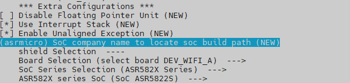

# Combo Solution – ASR Chip Porting Case

The IoT combo solution (Wi-Fi+BLE) is developed based on the OpenHarmony LiteOS-M kernel. This document exemplifies how to port code of the DEV.WIFI.A development board powered by the ASR582X chip.

## Compilation and Porting

### Directory Planning

In the directory structure of this solution, the board vendor code is decoupled from the SoC vendor code.

```
device
├── board                                --- Board vendor directory
│   └── lango                            --- Board vendor: Lango
│       └── dev_wifi_a                   --- Board name: DEV.WIFI.A
└── soc                                  --- SoC vendor directory
    └── asrmicro                         --- SoC vendor: ASR
        └── asr582x                      --- SoC series: ASR582X
```

The planned product demo directory is as follows:

```
vendor
└── asrmicro                             --- Vendor of the product demo.
    ├── wifi_demo                        --- Product demo name.
    └── xts_demo                         --- Product name.
```

### Product Definition

The following uses `vendor/asrmicro/wifi_demo` as an example to describe the kernel, board, and subsystem used by the product. The kernel, board model, and board vendor need to be planned in advance, which are involved in the precompilation instruction (`hb set`). The information entered here corresponds to the planned directory. Example:

```
{
    "product_name": "wifi_demo",          --- Product name.
    "type": "mini",                       --- System type: mini.
    "version": "3.0",                     --- System version: 3.0
    "device_company": "lango",            --- Board vendor: Lango.
    "board": "dev_wifi_a",                --- Board name: dev_wifi_a.
    "kernel_type": "liteos_m",            --- Kernel type: liteos_m.
    "kernel_version": "3.0.0",            --- Kernel version: 3.0.0.
    "subsystems": []                      --- Subsystem.
}
```
**device_company** and **board** are used to associate the **//device/board/<device_company>/<board> directory**.

### Board Configuration

In this example, the `device/board/lango/dev_wifi_a` directory is used. Place the **config.gni** file in the **liteos_m** directory. This configuration file is used to describe the board information, including the CPU, toolchain, kernel, and compile flags. Sample code:

```
# Kernel type
kernel_type = "liteos_m"

# Kernel version
kernel_version = "3.0.0"

# Board CPU Type
board_cpu = "cortex-m4"

# Toolchain. Here, arm-none-eabi is used.
board_toolchain = "arm-none-eabi"

# Toolchain path. You can use the system path by entering "", or a custom path.
board_toolchain_path = rebase_path("//device/soc/asrmicro/gcc/gcc-arm-none-eabi/Linux64/bin")

# Board-specific compilation parameters
board_cflags = []

# Board-specific link parameters
board_ld_flags = []

# Board-specific header file
board_include_dirs = []
```

### Precompiling

After the product directory, product definition, and board settings are correctly configured, run the precompilation command `hb set` in the project root directory. Then you can find the related product in the displayed list.


After selecting a product, press **Enter**. The `ohos_config.json` file is automatically generated in the root directory. Information about the product to be compiled is listed here.


## Kernel Porting

### Kconfig Adaptation

During the compilation of `//kernel/liteos_m`, you need to use the `Kconfig` file for indexing in the corresponding board and SoC directory.

`Kconfig` in the board directory, for example, `//device/board/lango`:
```
├── dev_wifi_a                                   --- dev_wifi_a board configuration
│   ├── Kconfig.liteos_m.board                   --- Board configuration options
│   ├── Kconfig.liteos_m.defconfig.board         --- Default configuration of the board
│   └── liteos_m
│       └── config.gni                           --- Board configuration file
├── Kconfig.liteos_m.boards                      --- Boards configuration of the board vendor
└── Kconfig.liteos_m.defconfig.boards            --- Default boards configuration of the board vendor
```

In `dev_wifi_a/Kconfig.liteos_m.board`, **BOARD_DEV_WIFI_A** can be selected only when **SOC_ASR5822S** is selected.

```
config BOARD_DEV_WIFI_A
    bool "select board DEV_WIFI_A"
    depends on SOC_ASR5822S
```

`Kconfig` in the SoC directory, for example, `//device/soc/asrmicro`:

```
├── asr582x                                      --- ASR582X series
│   ├── Kconfig.liteos_m.defconfig.asr5822s      --- Default configuration of the ASR5822S chip
│   ├── Kconfig.liteos_m.defconfig.series        --- Default configuration of the ASR582X series
│   ├── Kconfig.liteos_m.series                  --- Configuration of the ASR582X series
│   └── Kconfig.liteos_m.soc                     --- ASR582X chip configuration
├── Kconfig.liteos_m.defconfig                   --- SoC default configuration
├── Kconfig.liteos_m.series                      --- Series configuration
└── Kconfig.liteos_m.soc                         --- SoC configuration
```

In **asr582x/Kconfig.liteos_m.series**:

```
config SOC_SERIES_ASR582X
    bool "ASR582X Series"
    select ARM
    select SOC_COMPANY_ASRMICRO              --- Select SOC_COMPANY_ASRMICRO.
    select CPU_CORTEX_M4
    help
        Enable support for ASR582X series
```

**SOC_ASR5822S** can be selected in **asr582x/Kconfig.liteos_m.soc** only when **SOC_SERIES_ASR582X** is selected.

```
choice
    prompt "ASR582X series SoC"
    depends on SOC_SERIES_ASR582X

config SOC_ASR5822S                         --- Select SOC_ASR5822S.
    bool "SoC ASR5822S"

endchoice
```

To compile the board BOARD_DEV_WIFI_A, you need to select **SOC_COMPANY_ASRMICRO**, **SOC_SERIES_ASR582X**, and **SOC_ASR5822S**. You can do so by running `make menuconfig` in `kernel/liteos_m`.



The configurations are saved in `//vendor/asrmicro/wifi_demo/kernel_configs/debug.config` by default. You can directly modify the configurations in **debug.config**.

```
LOSCFG_BOARD_DEV_WIFI_A=y
LOSCFG_SOC_COMPANY_ASRMICRO=y
LOSCFG_SOC_SERIES_ASR582X=y
LOSCFG_SOC_ASR5822S=y
```

### Modular Compilation

The compilation of `Board` and `SoC` adopts the modular compilation method, starting from `kernel/liteos_m/BUILD.gn` and increasing by level. The adaptation process of this solution is as follows:

1. Create the **BUILD.gn** file in `//device/board/lango` and add the following content to the file:

   ```
   if (ohos_kernel_type == "liteos_m") {
     import("//kernel/liteos_m/liteos.gni")
     module_name = get_path_info(rebase_path("."), "name")
     module_group(module_name) {
       modules = [
         "dev_wifi_a",                     --- Board module
         "hcs",                            --- Module corresponding to the hcs file
       ]
     }
   }
   ```

   In the preceding **BUILD.gn** file, **dev_wifi_a** and **hcs** are the module names organized by directory level.

2. In `//device/soc/asrmicro`, use the same method to create the **BUILD.gn** file and add the following content to the file:

   ```
   if (ohos_kernel_type == "liteos_m") {
     import("//kernel/liteos_m/liteos.gni")
     module_name = get_path_info(rebase_path("."), "name")
     module_group(module_name) {
       modules = [
         "asr582x",
       ]
     }
   }
   ```

3. In the `//device/soc/asrmicro` module at each level, add the **BUILD.gn** file and compile the module. The following uses `//device/soc/asrmicro/asr582x/liteos_m/sdk/startup/BUILD.gn` as an example:

   ```
   import("//kernel/liteos_m/liteos.gni")

   config("public") {
     include_dirs = [ "." ]                 --- Common header file
   }

   kernel_module("asr_startup") {           --- Module for compilation
     sources = [                            --- Source file for compilation
         "startup.c",
         "board.c",
         "startup_cm4.S",
     ]

     include_dirs = [                       --- Header files used in the include
       "...",
     ]
   }
   ```

4. To organize links and some compilation options, the following parameters are set in **config("public")** in `//device/soc/asrmicro/asr582x/liteos_m/sdk/config/BUILD.gn`:

   ```
   config("public") {
     include_dirs = []                       --- Common header file
     ldflags = []                            ---  Link parameters, including the ld file
     libs = []                               --- Link library
     defines = []                            --- Definition
   ```

    **NOTE**
	It is recommended that common parameter options and header files not be repeatedly filled in all components.

5. To organize some product applications, this solution adds **list** to the **config.json** file of the vendor. The following uses `//vendor/asrmicro/wifi_demo/config.json` as an example to describe how to add **list** to the **config.json** file:
   ```
   "tests_list": [                       --- demo list
     {
       "enable": "true", --- list switch
       "test_modules": [
         "example",                      --- OS basic demo
         "wifi_test"                     --- Wi-Fi demo
       ]
     }
   ]
   ```

   The demo is managed as a module. To enable or disable a demo, add or delete items in **tests_list**.**tests_list** can be directly read in GN. You need to add the following content to `//device/board/lango/dev_wifi_a/liteos_m/config.gni`:

   ```
   product_conf = read_file("${product_path}/config.json", "json")
   product_name = product_conf.product_name
   tests_list = product_conf.tests_list
   ```

   After reading the **list**, you can add related component libraries to the corresponding link options. Add the following content to `//device/soc/asrmicro/asr582x/liteos_m/sdk/config/BUILD.gn`:

   ```
   foreach(test_item, tests_list) {
       test_enable = test_item.enable
       if(test_enable == "true")
       {
         foreach(test_module, test_item.test_modules) {
         ldflags += [ "-l${test_module}" ]
         }
       }
   }
   ```

### C Library Adaptation

To ensure that the entire system does not distinguish the user mode and kernel mode, the upper-layer components and kernel share the same musl-based C library. This solution uses the musl C library. For details about the third-party library, see `//third_party/musl/porting/liteos_m/kernel/BUILD.gn`.

In addition, the kernel modifies and adapts the code for malloc. For details about the adaptation file, see `//kernel/liteos_m/kal/libc/musl/porting/src/malloc.c`.

In this solution, printf-related APIs are implemented using open-source code. For details about the adaptation file, see `//device/soc/asrmicro/asr582x/liteos_m/sdk/drivers/platform/system/printf-stdarg.c`.

The **wrap** links of the printf-related APIs need to be added to the `//device/board/lango/dev_wifi_a/liteos_m/config.gni` file so that these APIs can be invoked.

```
board_ld_flags += [
  "-Wl,--wrap=printf",
  "-Wl,--wrap=sprintf",
  "-Wl,--wrap=snprintf",
  "-Wl,--wrap=vprintf",
  "-Wl,--wrap=vsprintf",
  "-Wl,--wrap=vsnprintf",
]
```
### Shell Adaptation

To facilitate debugging, this solution integrates the shell component of the kernel. You can select **Enable Shell** in **Debug** of **make menuconfig** or enter **LOSCFG_SHELL=y** in the `//vendor/asrmicro/wifi_demo/kernel_configs/debug.config` file.
The shell component needs to be initialized. For details, see `device/soc/asrmicro/asr582x/liteos_m/sdk/startup/board.c`.

```
ret = LosShellInit();
if (ret != LOS_OK) {
    printf("LosShellInit failed! ERROR: 0x%x\n", ret);
}
ret = OsShellInit();
if (ret != LOS_OK) {
    printf("OsShellInit failed! ERROR: 0x%x\n", ret);
}
```

After initialization, each shell command needs to be registered, for example, `vendor/asrmicro/wifi_demo/tests/wifi/wifi_app.c`:

```
osCmdReg(CMD_TYPE_STD, "wifi_open", 0, (CMD_CBK_FUNC)ap_conn_func);    --- Connect to the AP. Input parameters can be carried.
osCmdReg(CMD_TYPE_EX, "wifi_close", 0, (CMD_CBK_FUNC)ap_close_func);   --- Disconnect from the AP.
```

### Kernel Boot Adaptation

After the board enters the **main** function, it is initialized. After that, interrupts are registered, and then the kernel is initialized and scheduled.
For details about interrupt registration, see `//device/soc/asrmicro/asr582x/liteos_m/sdk/startup/board.c`.

```
ArchHwiCreate(UART1_IRQn,configLIBRARY_NORMAL_INTERRUPT_PRIORITY,0,UART1_IRQHandler,0);   --- UART interrupt
ArchHwiCreate(GPIO_IRQn,configLIBRARY_NORMAL_INTERRUPT_PRIORITY,0,GPIO_IRQHandler,0);     --- GPIO interrupt
```

The following is an example of kernel initialization:
```
osStatus_t ret = osKernelInitialize();                                                    --- Kernel initialization

if(ret == osOK)
{
    threadId = osThreadNew((osThreadFunc_t)sys_init,NULL,&g_main_task);                   --- Create the init thread.

    if(threadId!=NULL)
    {
        osKernelStart();                                                                  --- Thread scheduling
    }
}
```

In `sys_init`, you need to initialize the OpenHarmony system components.

```
...
DeviceManagerStart();           --- Initialize HDF.

OHOS_SystemInit();              --- Initialize OpenHarmony system components.
....
```

### HDF Framework Adaptation

HDF provides a set of unified APIs for applications to access hardware, simplifying application development. To add the HDF component, you need to add it to `//vendor/asrmicro/wifi_demo/kernel_configs/debug.config`:

```
LOSCFG_DRIVERS_HDF=y
LOSCFG_DRIVERS_HDF_PLATFORM=y
```

In addition, you need to add the hardware configuration description file of the corresponding development board to `board`. The file is stored in `//device/board/lango/hcs`. This example takes the GPIO and UART as an example. The porting process is as follows:

#### GPIO Adaptation

1. The chip driver adaptation file is stored in the `//drivers/hdf_core/adapter/platform` directory. Add the `gpio_asr.c` file to the `gpio` directory, and add the compilation conditions of the new driver file to `BUILD.gn`.

   ```
   if (defined(LOSCFG_SOC_COMPANY_ASRMICRO)) {
     sources += [ "gpio_asr.c" ]
   }
   ```

2. The driver description file in `gpio_asr.c` is as follows:

   ```
   struct HdfDriverEntry g_GpioDriverEntry = {
       .moduleVersion = 1,
       .moduleName = "ASR_GPIO_MODULE_HDF",
       .Init = GpioDriverInit,
       .Release = GpioDriverRelease,
   };
   HDF_INIT(g_GpioDriverEntry);
   ```

3. Add the GPIO hardware description file `gpio.hcs` to `//device/board/lango/hcs`. The mapped GPIO0 controls the programmable LED on the board. GPIO1 corresponds to the user key. The HCS content is as follows:

   ```
   root {
       platform {
           gpio_config {
               match_attr = "gpio_config";
               pin = [0, 1];
               // led3: GPIO9
               // user key: GPIO7
               realPin = [9, 7];
               config = [5, 1];
               pinNum = 2;
           }
       }
   }
   ```

4. The configuration information of `gpio.hcs` is loaded in GpioDriverInit, and the corresponding GPIO pins are initialized. The application layer needs only the following simple code to control LED indicators and read key information:

   ```
   int32_t GpioKeyIrqFunc(uint16_t gpio, void *data)
   {
       printf("user key %d pressed\n", gpio);
   }
   GpioSetIrq(1, OSAL_IRQF_TRIGGER_FALLING, GpioKeyIrqFunc, NULL);

   GpioWrite(0, 0);
   lega_rtos_delay_milliseconds(1000);
   GpioWrite(0, 1);
   ```

#### UART Adaptation

1. The chip driver adaptation file is stored in the `//drivers/adapter/platform` directory. Add the `uart_asr.c` and `uart_asr.h` files to the `uart` directory, and add the compilation conditions of the new driver file to `BUILD.gn`.

   ```
   if (defined(LOSCFG_SOC_COMPANY_ASRMICRO)) {
     sources += [ "uart_asr.c" ]
   }
   ```

2. The driver description file in `uart_asr.c` is as follows:

   ```
   struct HdfDriverEntry g_hdfUartDevice = {
       .moduleVersion = 1,
       .moduleName = "HDF_PLATFORM_UART",
       .Bind = HdfUartDeviceBind,
       .Init = HdfUartDeviceInit,
       .Release = HdfUartDeviceRelease,
   };

   HDF_INIT(g_hdfUartDevice);
   ```

3. Add the GPIO hardware description file `uart.hcs` to `//device/board/lango/hcs`. The HCS content is as follows:

   ```
   controller_uart0 :: uart_controller {
       match_attr = "asr582x_uart_0";
       port = 0;                       /* UART_ID_0 */

       pin_tx_pin = 0;                /* IO_PIN_10 */
       pin_tx_mux = 25;                 /* IO_MUX_2  */

       pin_rx_pin = 1;                /* IO_PIN_11 */
       pin_rx_mux = 25;                 /* IO_MUX_2 */
       tx_rx = 3;                     /* TX_RX MODE */
   }
   ```

4. The configuration information of `gpio.hcs` is loaded in `HdfUartDeviceInit`, and the corresponding serial port pins are initialized. The code for testing the serial port at the application layer is as follows:

   ```
   DevHandle uart_handle = UartOpen(0);
   UartSetBaud(uart_handle, 115200);
   ...
   attr.dataBits = UART_ATTR_DATABIT_8;
   attr.parity = UART_ATTR_PARITY_NONE;
   attr.stopBits = UART_ATTR_STOPBIT_1;
   ret = UartSetAttribute(uart_handle, &attr);
   ret = UartWrite(uart_handle, send_data, strlen(send_data));
   ret = UartRead(uart_handle, recv_data, sizeof(recv_data) - 1);
   ...
   ```

## OpenHarmony Component Porting

The compilation option entry of the subsystem is in the `config.json` file of the corresponding product. The following uses `//vendor/asrmicro/wifi_demo/config.json` as an example.

### LWIP component

The source code of the lwIP component is stored in `//third_party/lwip`. The kernel in OpenHarmony is customized in `//kernel/liteos_m/components/net/lwip-2.1`, including the redefinition of some interfaces and structures.

In this example, the path for setting lwip in the `config.json` file is as follows:

   ```
   "subsystem": "kernel",
   "components": [
     {
       "component": "liteos_m",
       "features": [
         "ohos_kernel_liteos_m_lwip_path = \"//device/soc/asrmicro/asr582x/liteos_m/components/net/lwip-2.1\""
       ]
     }
   ]
   ```

Enable lwIP compilation in the `kernel_config/debug.config` file.

```
LOSCFG_NET_LWIP=y
```

### Security Component

For the security component, enable the corresponding options in `config.json`. In this example, mbedtls (`//third_party/mbedtls`) in the third-party library is used as the encryption module. The options are as follows:

```
"subsystem": "security",
"components": [
  { "component": "huks", "features":
    [
      ...
      "ohos_security_huks_mbedtls_porting_path = \"//device/soc/asrmicro/asr582x/liteos_m/components/mbedtls\""
    ]
  }
]
```

In the preceding directory, you need to configure mbedtls. For details, see `config/config_liteos_m.h`. Note that if the RNG capability of mbedtls is used (for example, the dsoftbus component is used in `//foundation/communication/dsoftbus/adapter/common/mbedtls/softbus_adapter_crypto.c`), the entropy source for generating random numbers must be specified. In this example, the hardware random number capability of the ASR582X is used. You need to enable the following macro:

```
#define MBEDTLS_ENTROPY_HARDWARE_ALT
```

After this macro is enabled, the `entropy_hardware_alt` interface needs to be implemented. For details, see `library/entropy_hardware_alt.c`.

### wifi_lite Component

The options of the wifi_lite component are as follows:

```
"subsystem": "communication",
"components": [
  { "component": "wifi_lite", "features":[] }
  ]
```

Wi-Fi-related functions are implemented in `//device/soc/asrmicro/asr582x/liteos_m/sdk/hal/src/wifi_adapter.c`.

This example also provides a demo that uses the `wifi_lite` interfaces. For details, see `//vendor/asrmicro/wifi_demo/tests/wifi/wifi_app.c`. The following two connection test commands are provided:

Table 1 ASR Wi-Fi connection commands

| Command        | Parameter    | Description    |
|------------|--------|--------|
| wifi_open  | sta [SSID] [KEY] | Connection routing command, for example, `wifi_open sta ASR_AP test123456`.|
| wifi_close | N/A     | Command for disconnecting a connection.  |

### XTS component

To adapt the XTS component, for example, `//vendor/asrmicro/xts_demo/config.json`, add the following component options:

```
"subsystem": "xts",
"components": [
  { "component": "xts_acts", "features":
    [
      "enable_ohos_test_xts_acts_use_thirdparty_lwip = true"
    ]
  },
  { "component": "xts_tools", "features":[] }
]
```

The XTS function is also organized using `list`. You can add or delete modules in the `config.json` file by referring to [Modular Compilation].

```
"xts_list": [
  {
    "enable": "true",
    "xts_modules": [
      "ActsKvStoreTest",
      "ActsDfxFuncTest",
      "ActsHieventLiteTest",
      "ActsSamgrTest",
      "ActsParameterTest",
      "ActsWifiServiceTest",
      "ActsWifiIotTest",
      "ActsBootstrapTest"
    ]
  }
],
```

### dsoftbus component

The dsoftbus component provides the discovery, connection, networking, and transmission capabilities between devices. This solution uses the DSoftBus capability between Wi-Fi devices as an example.

Dependent components: lwIP, security, and wifi_lite.

Prerequisites: The device is connected to a router, and all networking devices are in the same LAN.

The options of the dsoftbus component are as follows:

```
"subsystem": "communication",
"components": [
  { "component": "dsoftbus", "features":[] }
  ]
```

The dsoftbus test demo is provided in `//vendor/asrmicro/wifi_demo`. To enable this function, modify `//vendor/asrmicro/wifi_demo/tests/BUILD.gn`.

```
declare_args() {
  asr_dsoftbus_test = true              --- Enable dsoftbus demo compilation.
}
```

Add the dsoftbus_test module to the `//vendor/asrmicro/wifi_demo/config.json` file.

```
"tests_list": [
    {
    "enable": "true",
    "test_modules": [
        "wifi_test",
        "dsoftbus_test"                 --- Enable the dsoftbus_test module.
    ]
    }
]
```

For details about the startup interface of the dsoftbus component, see `//vendor/asrmicro/wifi_demo/tests/dsoftbus/dsoftbus_app.c`.

```
InitSoftBusServer();
```

At least 80 KB RAM needs to be reserved for the running of the DSoftBus component. If the resources are insufficient, other parts such as the lwIP component can be tailored.
`//kernel_liteos_m/blob/master/components/net/lwip-2.1/porting/include/lwip/lwipopts.h`:

```
#define TCPIP_THREAD_STACKSIZE          0x2000              --- Reduce the size of the TCP/IP task stack.
```

The `-fPIC` compilation option is added to the `communication_dsoftbus` repository. In this way, the compiler generates position-independent code and uses relative addresses. However, the LiteOS-M core uses a static library, which is not recommended.
You are advised to manually comment out the `-fPIC` compilation option in the following files:
`//foundation/communication/dsoftbus/core/common/BUILD.gn`
`//foundation/communication/dsoftbus/core/frame/BUILD.gn`
`//foundation/communication/dsoftbus/sdk/BUILD.gn`
`//foundation/communication/dsoftbus/components/nstackx_mini/nstackx_ctrl/BUILD.gn`

The DSoftBus networking requires device authentication. In the R&D phase, you can skip the authentication and  focus on the networking and transmission capabilities. You need to replace the `HandleReceiveDeviceId` function in the `//foundation/communication/dsoftbus/core/authentication/src/auth_manager.c` file with the following implementation:

```
void HandleReceiveDeviceId(AuthManager *auth, uint8_t *data)
{
    uint8_t tempKey[SESSION_KEY_LENGTH] = {0};
    if (auth == NULL || data == NULL) {
        SoftBusLog(SOFTBUS_LOG_AUTH, SOFTBUS_LOG_ERROR, "invalid parameter");
        return;
    }
    if (AuthUnpackDeviceInfo(auth, data) != SOFTBUS_OK) {
        SoftBusLog(SOFTBUS_LOG_AUTH, SOFTBUS_LOG_ERROR, "AuthUnpackDeviceInfo failed");
        AuthHandleFail(auth, SOFTBUS_AUTH_UNPACK_DEVID_FAILED);
        return;
    }
    if (auth->side == SERVER_SIDE_FLAG) {
        if (EventInLooper(auth->authId) != SOFTBUS_OK) {
            SoftBusLog(SOFTBUS_LOG_AUTH, SOFTBUS_LOG_ERROR, "auth EventInLooper failed");
            AuthHandleFail(auth, SOFTBUS_MALLOC_ERR);
            return;
        }
        if (AuthSyncDeviceUuid(auth) != SOFTBUS_OK) {
            AuthHandleFail(auth, SOFTBUS_AUTH_SYNC_DEVID_FAILED);
        }
        (void)memset_s(tempKey, SESSION_KEY_LENGTH, 1, SESSION_KEY_LENGTH);
        AuthOnSessionKeyReturned(auth->authId, tempKey, SESSION_KEY_LENGTH); 
        return;
    }
    //VerifyDeviceDevLvl(auth);                                            --- Comment out the authentication process.
    (void)memset_s(tempKey, SESSION_KEY_LENGTH, 1, SESSION_KEY_LENGTH);
    AuthOnSessionKeyReturned(auth->authId, tempKey, SESSION_KEY_LENGTH);
}
```

After correct configuration, compilation, and burning, the device uses the wifi_open command to connect to the router. After the connection is successful, the device automatically performs networking.


The adaptation process of other components is similar to that of other vendors.
