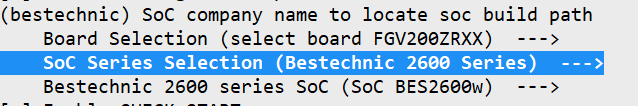

# Mini-System Devices with Screens – Bestechnic SoC Porting Case

This document exemplifies the porting procedure for a development board on a mini-system device with a screen – an intelligent switch panel. It uses the BES multi-modal V200Z-R development board powered by the Bestechnic BES2600W SoC as an example. Components such as `ace_engine_lite`, `arkui_ui_lite`, `aafwk_lite`, `appexecfwk_lite`, and `HDF` are adapted based on the OpenHarmony LiteOS-M kernel. This example uses the board-SoC separation solution as the porting architecture, the Newlib C or Musl C library as the toolchain, and GN and Kconfig graphical configuration for LiteOS-M kernel compilation.

## Compilation and Building

### Directory Planning

This example uses an improved SoC porting architecture. The original SoC adaptation directory is as follows:

```
device
└── <device_company>
    └── <device_name>
```

This adaptation directory has a downside: To use the Hi3861 SoC on the BearPi-HM Nano or HiSpark Pegasus development board, you need to place a copy of the code in the directory of both development boards. To solve this problem, the board vendor is decoupled from the SoC vendor in this example, by following the board-SoC decoupling design ideas. The SoC adaptation directory used in this example is as follows:

```
device
├── board                                --- Board vendor directory
│   └── fnlink                           --- Board vendor name: Fn-Link
│       └── v200zr                       --- Board name: v200zr
└── soc									 --- SoC vendor directory
    └── bestechnic                       --- SoC vendor: Bestechnic
        └── bes2600						 --- SoC Series: The bes2600 series includes bes2600w.
```

The planned product demo directory is as follows:

```
vendor
└── bestechnic							 --- Vendor of the product demo.
    └── display_demo         			 --- Product demo name.
```

### Precompilation Adaptation

Before porting, you need to perform precompilation adaptation.

To do so, use the `hb set` command to set environment variables such as the root directory, board directory, product directory, and board company name of the entire project.

The specific procedure is as follows:

1. Add the `config.json` file to the `vendor/bestechnic/display_demo` directory to describe the board and kernel information used by the product demo. The following is an example of the description:

```
{
  "product_name": "display_demo",       --- Product name to display in the hb set drop-down list.
  Type of the "type": "mini", --- Build system type, which can mini, small, or standard.
  Version of the "version": "3.0", --- Build system version, which can be 1.0, 2.0, or 3.0.
  "device_company": "fnlink",           --- Board vendor name, which is used to find the /device/board/fnlink directory during compilation.
  "board": "v200zr",                    --- Board name, which is used to find the /device/board/fnlink/v200zr directory during compilation.
  "kernel_type": "liteos_m",            --- Kernel type. OpenHarmony supports multiple kernels, and one board may be adapted to multiple kernels. Therefore, you need to specify a kernel for compilation.
  "kernel_version": "3.0.0",            --- Kernel version. A board may be adapted to multiple Linux kernel versions. Therefore, you need to specify a kernel version for compilation.
  "subsystems": [ ]                     --- Subsystem to be compiled and built.
}
```

2. Add the `config.gni` file to the `device/board/fnlink/v200zr/liteos_m` directory to describe the board and kernel used in the product demo. The following is an example of the description:

```
# Kernel type, e.g. "linux", "liteos_a", "liteos_m".
kernel_type = "liteos_m"                --- Kernel type, which corresponds to kernel_type in the config.json file.

# Kernel version.
kernel_version = "3.0.0"                --- Kernel version, which corresponds to kernel_version in the config.json file.
```

3. Verify the `hb set` configuration:

   Run the `hb set` command, enter the project root directory, and press `Enter`. The `hb` command traverses all `config.json` files in the `//vendor/<product_company>/<product_name>` directory and provides product compilation options. In the `config.json` file, `product_name` indicates the product name, `device_company` and `board` are used to locate the `//device/board/<device_company>/<board>` directory and find the matching `<any_dir_name>/config.gni` file. If multiple file matches are found, it indicates that the board has been adapted to multiple kernels. In this case, `kernel_type` and `kernel_version` in the `config.json` file can be used to uniquely match the `config.gni` file and thereby determine the board with which kernel needs to be compiled and adapted. If the information shown below is displayed, the `hb set` configuration is correct.

   

			You can run the `hb env` command to view the selected precompilation environment variables.


Before running the `hb build` command, complete the LiteOS-M kernel adaptation. For details, see [Kernel Porting](https://gitee.com/openharmony/docs/blob/master/en/device-dev/porting/porting-bes2600w-on-minisystem-display-demo.md#%E5%86%85%E6%A0%B8%E7%A7%BB%E6%A4%8D).

## Kernel Porting

To port the kernel, you need to complete the LiteOS-M Kconfig adaptation, GN compilation and building, and minimum adaptation for kernel startup.

### LiteOS-M Kconfig Adaptation

Run the `make menuconfig` command in the `//kernel/liteos_m` directory to select compilation configuration options. In the `Makefile` file, the `hb env` result is converted into environment variables, that is, `PRODUCT_PATH`, `DEVICE_PATH`, and `BOARD_COMPANY`. The sample code is as follows:

```
$(foreach line,$(shell hb env | sed 's/\[OHOS INFO\]/ohos/g;s/ /_/g;s/:_/=/g' || true),$(eval $(line)))
ifneq ($(ohos_kernel),liteos_m)
$(error The selected product ($(ohos_product)) is not a liteos_m kernel type product)
endif
--- Convert each line of hb env to a variable. For example, convert [OHOS INFO] device company: fnlink to ohos_device_company=fnlink.

...

ifeq ($(BOARD_COMPANY),)
BOARD_COMPANY:=$(ohos_device_company)
endif
...
export BOARD_COMPANY
--- Convert ohos_device_company to the BOARD_COMPANY environment variable.
```

Use the exported environment variables in the `//kernel/liteos_m/Kconfig` file. `Kconfiglib` uses `ulfalizer` to develop the Python-based version. In the [source code](https://github.com/ulfalizer/Kconfiglib), as described in [function description](https://github.com/zephyrproject-rtos/zephyr/blob/main/scripts/kconfig/kconfiglib.py), the keyword `orsource` is used. In this keyword, `o` indicates `optional`, that is, the file is optional. `r` indicates `relative`, that is, the path of the file relative to the current file.

```
config SOC_COMPANY
    string "SoC company name to locate soc build path"
    help
      This option specifies the SoC company name, used to locate the build path for soc. This option is set by the
      SoC's Kconfig file, and should be exactly the same with SoC company path, and the user should generally avoid
       modifying it via the menu configuration.

orsource "../../device/board/*/Kconfig.liteos_m.shields"                                 --- Load the configurations of all extension boards. To allow the extension boards provided by board vendor A to be used by board vendor B, the asterisk (*) instead of BOARD_COMPANY is used. As OpenHarmony supports the multi-kernel design, the Kconfig file uses liteos_m as the suffix. During board adaptation, the actual kernel name can be used as the suffix for extension during kernel adaptation.

orsource "../../device/board/$(BOARD_COMPANY)/Kconfig.liteos_m.defconfig.boards"         --- Load all predefined board configurations of BOARD_COMPANY.

choice
    prompt "Board Selection"

The orsource "../../device/board/$(BOARD_COMPANY)/Kconfig.liteos_m.boards" --- Provide a list of available boards.

endchoice

orsource "../../device/soc/*/Kconfig.liteos_m.defconfig"                                 --- Load the default configuration definitions of all SoCs.

choice
    prompt "SoC Series Selection"

orsource "../../device/soc/*/Kconfig.liteos_m.series"                                    --- Provide a list of available SoC series.

endchoice

orsource "../../device/soc/*/Kconfig.liteos_m.soc"                                       --- Load all SoC configurations.
```

According to the `//kernel/liteos_m/Kconfig` file, the following `Kconfig` files need to be added to the `//device/board/fnlink` directory for adaptation:

```
.
├── v200zr                                       --- Configuration of the v200zr 
│   ├── Kconfig.liteos_m.board                   --- Configuration options of the v200zr board
│   ├── Kconfig.liteos_m.defconfig.board         --- Default configuration items of the v200zr board
│   └── liteos_m
│       └── config.gni
├── Kconfig.liteos_m.boards                      --- Board configuration of Fn-Link
├── Kconfig.liteos_m.defconfig.boards			 --- Default board configuration of Fn-Link
├── Kconfig.liteos_m.shields					 --- Extension board configuration of Fn-Link
└── shields										 --- Extension board directory of Fn-Link
    ├── v200zr-t0								 --- Expansion board v200zr-t0 of Fn-Link
    │   ├── Kconfig.liteos_m.defconfig.shield	 --- Default configuration of the expansion board v200zr-t0
    │   └── Kconfig.liteos_m.shield				 --- Configuration of the expansion board v200zr-t0
    ├── v200zr-t1
    │   ├── Kconfig.liteos_m.defconfig.shield
    │   └── Kconfig.liteos_m.shield
    └── Kconfig.liteos_m.shields
```

In `v200zr/Kconfig.liteos_m.board`, you need to set the board configuration options and the dependent `SoC` as follows:

```
config BOARD_v200zr
    bool "select board v200zr"
    depends on SOC_BES2600W		 --- The v200zr board uses the bes2600w SoC. Therefore, the v200zr board configuration options are available only when the bes2600w SoC is selected.
```

In `v200zr/Kconfig.liteos_m.defconfig.board`, the default name of `BOARD` is defined as `"v200zr"`.

```
if BOARD_v200zr
config BOARD
    string		 --- No content is defined for string. Therefore, it is not visible to users.
    default "v200zr"

endif # BOARD_v200zr
```

According to the `//kernel/liteos_m/Kconfig` file, the following `Kconfig` files need to be added to the `//device/soc/bestechnic` directory for adaptation:

```
.
├── bes2600									 --- bes2600 SoC series
│   ├── Kconfig.liteos_m.defconfig.bes2600w	 --- Configuration of the bes2600w SoC series provided by Bestechnic
│   ├── Kconfig.liteos_m.defconfig.series	 --- Default configuration of the bes2600 provided by Bestechnic
│   ├── Kconfig.liteos_m.series				 --- Configuration of the bes2600 SoC series provided by Bestechnic
│   └── Kconfig.liteos_m.soc				 --- Configuration of the bes2600 SoC provided by Bestechnic
├── Kconfig.liteos_m.defconfig				 --- Default SoC configuration of Bestechnic
├── Kconfig.liteos_m.series					 --- Configuration of the SoC series provided by Bestechnic
└── Kconfig.liteos_m.soc					 --- Configuration of the SoC provided by Bestechnic
```

In the `bes2600/Kconfig.liteos_m.series` file, configure the `bes2600 SoC series` and SoC architecture as follows:

```
config SOC_SERIES_BES2600			 --- bes2600 SoC series configuration options
    bool "Bestechnic 2600 Series"
    select ARM						 --- When bes2600 is selected, the ARM architecture is selected by default.
    select SOC_COMPANY_BESTECHNIC    --- When bes2600 is selected, bestechnic is selected by default. The driver depends on the macro configuration. You can select the configuration to compile the driver of the corresponding vendor.
    select CPU_CORTEX_M33			 --- When bes2600 is selected, cortex-m33 CPU is selected by default.
    help
        Enable support for Bestechnic 2600 series
```

In the `bes2600/Kconfig.liteos_m.soc` file, provide the number of specific SoCs under the `bes2600 SoC series` as follows:

```
choice
    prompt "Bestechnic 2600 series SoC"
    depends on SOC_SERIES_BES2600	 --- The following configuration options are displayed only when bes2600 Series is selected:

config SOC_BES2600W					 --- Add the bes2600w SoC configuration option.
    bool "SoC BES2600w"

endchoice
```

In the `bes2600/Kconfig.liteos_m.defconfig.series` file, provide the following configuration that is used by default when the bes2600 SoC series is selected:

```
if SOC_SERIES_BES2600							 --- The following default configuration options are added only when the bes2600 series is selected:

rsource "Kconfig.liteos_m.defconfig.bes2600w"	 --- Add the default configuration that is used by default when bes2600 SoC series is selected.

config SOC_SERIES								 --- Add the configuration that is used by default when SOC_SERIES is selected:
    string
    default "bes2600"

endif
```

When the configuration is complete, set the `defconfig` storage path of `make menuconfig` based on the `kernel/liteos_m/Makefile` file.

```
ifeq ($(TEE:1=y),y)
tee = _tee
endif
ifeq ($(RELEASE:1=y),y)
CONFIG ?= $(PRODUCT_PATH)/kernel_configs/release$(tee).config
else
CONFIG ?= $(PRODUCT_PATH)/kernel_configs/debug$(tee).config		 --- The configuration file is saved in $(CONFIG) and is defined by the product.
endif

...

update_config menuconfig:
	$(HIDE)test -f "$(CONFIG)" && cp -v "$(CONFIG)" .config && menuconfig $(args) && savedefconfig --out "$(CONFIG)"
```

In this example, the configuration file of `defconfig` is saved in `$(PRODUCT_PATH)/kernel_configs/debug.config`. It is empty by default upon creation. The directory and file structure of the product is as follows:

```
.
└── display_demo
    ├── config.json
    └── kernel_configs
        └── debug.config
```

When the configuration is complete, run the `make menuconfig` command in the `kernel/liteos_m` directory to select `SoC Series`/`SoC`/`Board`.



The result is automatically saved in `$(PRODUCT_PATH)/kernel_configs/debug.config` and will be exported when `make menuconfig` is executed.

### GN Build Adaptation

The graphical configuration result of `Kconfig` generated in the previous step can be used as the input of GN build to determine whether to build different modules. In addition, to solve the problem of arbitrary use of `include` during GN build, modular compilation is used for kernel compilation, streamlining the entire compilation logic. For details, see *LiteOS-M Kernel BUILD.gn Compilation Guide*.

In the `kernel/liteos_m/BUILD.gn` file, the compilation entrances of `Board` and `SoC` are specified as `//device/board/fnlink` and `//device/soc/bestechnic`.

```
deps += [ "//device/board/$device_company" ]
deps += [ "//device/soc/$LOSCFG_SOC_COMPANY" ]
```

Add the following content to `//device/board/fnlink/BUILD.gn`:

```
if (ohos_kernel_type == "liteos_m") {                    --- In the multi-kernel design, macros need to be used to isolate the adapted LiteOS-M kernel.
  import("//kernel/liteos_m/liteos.gni")				 --- Import the kernel GN template.
  module_name = get_path_info(rebase_path("."), "name")	 --- Dynamically obtain the current directory and use it as the module name, eliminating the need for manual synchronization between the directory and module name.
  module_group(module_name) {							 --- Use the module_group template.
    modules = [											 --- Add the modules to be built.
    ]
  }
}
```

Modify the `//device/soc/bestechnic/BUILD.gn` file in a similar manner.

### Kernel Boot Adaptation

The system boot process consists of three phases:

| Phase | Partitioning Planning                | Description                         |
| --------- | ------------------------ | ----------------------------- |
| BOOT1     | [0, 0x10000]             | The firmware is started.   |
| BOOT2     | [0x2C010000, 0x2C020000] | The OTA update starts.|
| RTOS_MAIN | [0x2C080000, 0x2C860000] | The kernel is started.   |

In the third phase where the kernel is started, the file to be adapted is saved in `//device/soc/bestechnic/bes2600/liteos_m/sdk/bsp/rtos/liteos/liteos_m/board.c`.

The general idea of kernel boot adaptation is as follows:

1. `os_vector_init` is used to initialize interrupt vectors and interrupt processing functions.
2. `osKernelInitialize` is used to initialize the kernel.
3. The `board_main` thread is created to initialize the chip platform.
4. The kernel starts up and schedules the `osKernelStart` thread.

This section describes step 3 in detail. Other steps involve invoking of kernel functions and are not described here.

In step 3, before starting `OHOS_SystemInit`, `board_main` needs to complete the necessary actions as follows:

```
...
    if(!ret) {
        ...
        OhosSystemAdapterHooks();    --- Configure the hook during system boot and complete the printing and driver initialization before OHOS_SystemInit is started.
        ...
        OHOS_SystemInit(); 			 --- Start the OpenHarmony service and initialize components.
    }
....
```

The `OhosSystemAdapterHooks` function is in the `device/soc/bestechnic/bes2600/liteos_m/components/utils/src/hm_sys.c` file, as shown below:

```
int OhosSystemAdapterHooks(void)
{
    init_trace_system(); 	 --- Initialize the printing function.
    DeviceManagerStart(); 	 --- Call the DeviceManagerStart function to initialize the HDF driver. This process is implemented by calling the driver configuration file hdf.hcs in the board code and implementing the drivers source code.
    return 0;
}

```

### littlefs File System Porting

 The `V200Z-R` development board uses the `Nor Flash` that supports `XIP` and has a maximum size of `32 MB`. The `example` file system can be used. During the adaptation, place the file system configuration file in the specified path. The file system image is then automatically generated based on the configuration and packaged into the burning package.

1. Specify the directory for storing the file system `config.json` by using `flash_partition_dir`.

```
  "flash_partition_dir": "fs" 	 --- Store the file system configuration file in the vendor/bestechnic/display_demo/fs directory.
```

2. Place the following items in the `vendor/bestechnic/display_demo/fs` directory:

  - `wifi_Download_cfg.yaml`: configuration file for image burning. The partitions can be adjusted as required.
  - `/data/data`: The first /`data` is the root directory to mount. The second `data` is the `data` directory in the root directory. You can place the configuration file in the second `data` directory or in any directory at the same level. During packaging, the whole root directory is packaged.

3. Set the following items in the `config.json` file based on the `wifi_Download_cfg.yaml` file:

  - `fs_src`: name under which the file system is mounted.
  - `fs_name`: name of the generated file system.
  - `block_size`: size of the read data block. Set it to `4K` alignment and do not change the value.
  - `fs_size`: size of the generated file system.
  - `burn_name`: size of the burnt `bin` name.
  - `enable`: whether to generate the file system.

4. In the `//device/soc/bestechnic/bes2600/liteos_m/components/hdf_config/hdf.hcs` file, configure the start address for burning the file system, size of the file system, and size of the read data block (`block_size`). The reference configuration is as follows:

```
    misc {
        fs_config {
            example_config {
                match_attr = "littlefs_config";
                mount_points = ["/data"];
                partitions = [10];
                block_size = [4096];
                block_count = [1024];
            }
        }
        storage_config {
            flash_config {
                match_attr = "flash_config";
                partitions = [10];
                owner = [0];
                description = ["littlefs"];
                start_addr = [0xB60000];
                length = [0x400000];
                options = [3];
            }
        }
    }
```

In `device/soc/bestechnic/bes2600/liteos_m/components/fs/fs_init.c`, load data through `hdf` and read and write to `flash` as follows:

```
static int32_t FsDriverInit(struct HdfDeviceObject *object)
{
    if (object == NULL) {
        return HDF_FAILURE;
    }
    if (object->property) {
        if (FsGetResource(fs, object->property) != HDF_SUCCESS) {
            HDF_LOGE("%s: FsGetResource failed", __func__);
            return HDF_FAILURE;
        }
    }
    for (int i = 0; i < sizeof(fs) / sizeof(fs[0]); i++) {
        if (fs[i].mount_point == NULL)
            continue;

        fs[i].lfs_cfg.read = littlefs_block_read;
        fs[i].lfs_cfg.prog = littlefs_block_write;
        fs[i].lfs_cfg.erase = littlefs_block_erase;
        fs[i].lfs_cfg.sync = littlefs_block_sync;

        fs[i].lfs_cfg.read_size = 256;
        fs[i].lfs_cfg.prog_size = 256;
        fs[i].lfs_cfg.cache_size = 256;
        fs[i].lfs_cfg.lookahead_size = 16;
        fs[i].lfs_cfg.block_cycles = 1000;

        int ret = mount(NULL, fs[i].mount_point, "littlefs", 0, &fs[i].lfs_cfg);
        HDF_LOGI("%s: mount fs on '%s' %s\n", __func__, fs[i].mount_point, (ret == 0) ? "succeed" : "failed");
    }
    return HDF_SUCCESS;
}
```


### C Library Adaptation

In the mini system, adapting the C library is a complex process. For details, see *Solution to Smooth Switchover Between musl and newlib for LiteOS-M Kernel*. The toolchain uses the `newlib` C library of the [gcc-arm-none-eabi-10.3-2021.10-x86_64-linux.tar.bz2](https://gitee.com/link?target=https%3A%2F%2Fdeveloper.arm.com%2F-%2Fmedia%2FFiles%2Fdownloads%2Fgnu-rm%2F10.3-2021.10%2Fgcc-arm-none-eabi-10.3-2021.10-x86_64-linux.tar.bz2). In light of this, the `newlib` C library is used for system porting. Select `newlib` in `make menuconfig` of the kernel, as shown below.


#### malloc Adaptation

For details, see [The Red Hat newlib C Library-malloc](https://sourceware.org/newlib/libc.html#malloc). You can use either of the following methods to implement malloc adaptation:

- Implement the `_sbrk_r` function. In this method, the memory allocation function in `newlib` is used.

- Implement `_malloc_r`, `_realloc_r`, `_reallocf_r`, `_free_r`, `_memalign_r`, and `_malloc_usable_size_r`. In this method, the memory allocation function in the kernel can be used.

To facilitate memory allocation algorithm optimization and fault locating based on services, the latter method is used in this example.

First, as the symbols of the functions in the second method already exist in `newlib`, you need to use the `wrap` link option of `gcc` to replace these function symbols with the kernel implementation code in `//kernel/liteos_m/kal/libc/newlib/porting/src/malloc.c`.

Then, add the `wrap` link option of these functions to `//device/board/fnlink/v200zr/liteos_m/config.gni`.

```
board_ld_flags += [
     "-Wl,--wrap=_malloc_r",
     "-Wl,--wrap=_realloc_r",
     "-Wl,--wrap=_reallocf_r",
     "-Wl,--wrap=_free_r",
     "-Wl,--wrap=_memalign_r",
     "-Wl,--wrap=_malloc_usable_size_r",
]
```

#### vsprintf and Related Adaptation

Implement `vprintf`, `vfprintf`, `printf`, `snprintf`, and `sprintf`. For details, see [vfprintf](https://sourceware.org/newlib/libc.html#vfprintf).

Similar to `malloc` adaptation, the implementation of these functions must be provided first, that is, `//device/soc/bestechnic/bes2600/liteos_m/components/utils/src/printf.c`. In this example, the friendly implementation of the open-source protocol is used. Different from `malloc` adaptation, this function is provided by the SoC vendor. This is because the implementation size varies in terms of printing based on the project requirements, and therefore the kernel cannot provide a unified implementation.

Then, add the `wrap` link option of these functions to `//device/board/fnlink/v200zr/liteos_m/config.gni`.

```
board_ld_flags += [
     "-Wl,--wrap=printf",
     "-Wl,--wrap=sprintf",
     "-Wl,--wrap=snprintf",
     "-Wl,--wrap=vsnprintf",
     "-Wl,--wrap=vprintf",
]
```

#### open and Related Adaptation

The adaptation is implemented by the kernel and does not need attention from the SoC. The kernel file `//kernel/liteos_m/kal/libc/newlib/porting/src/fs.c` has been adapted to the `_read`, `_write`, and other related functions of `newlib`, as shown below.

```
...
ssize_t _read(int fd, void *buf, size_t nbyte)
{
    return LOS_Read(fd, buf, nbyte);
}

ssize_t _write(int fd, const void *buf, size_t nbyte)
{
    return LOS_Write(fd, buf, nbyte);
}

off_t _lseek(int fd, off_t offset, int whence)
{
    return LOS_Lseek(fd, offset, whence);
}
...
```

## Board-Level OS Porting

### Driver Porting

#### Porting the HDF Driver for the SoC Platform

Driver adaptation files are stored in `drivers/adapter/platform`, including `gpio`, `i2c`, `pwm`, `spi`, `uart`, and `watchdog`, which are loaded using the `HDF` mechanism. This section uses `gpio` as an example.

##### GPIO Driver Adaptation

The `gpio` driver adaptation requires building adaptation and source code adaptation.

The `//drivers/adapter/platform/gpio/BUILD.gn` file describes the building adaptation of the `gpio` driver, as shown below:

```
module_switch = defined(LOSCFG_DRIVERS_HDF_PLATFORM_GPIO)	 --- If the GPIO configuration switch of the HDF is enabled, the following is built:
module_name = get_path_info(rebase_path("."), "name")

hdf_driver(module_name) {
  sources = []
  if (defined(LOSCFG_SOC_COMPANY_BESTECHNIC)) {				 --- If the Bestechnic SoC configuration switch is enabled, the Bestechnic GPIO driver is built.
    sources += [ "gpio_bes.c" ]
  }

  include_dirs = [ "." ]
}
```

The `//drivers/adapter/platform/gpio/gpio_bes.c` file describes the source code adaptation of the Bestechnic GPIO driver.
First, load the basic driver adaptation framework based on OpenHarmony `HDF`, as shown below:

```
struct HdfDriverEntry g_GpioDriverEntry = {
    .moduleVersion = 1,
    .moduleName = "BES_GPIO_MODULE_HDF",
    .Bind = GpioDriverBind,
    .Init = GpioDriverInit,
    .Release = GpioDriverRelease,
};
HDF_INIT(g_GpioDriverEntry); 	 --- Load the GPIO driver through HDF_INIT.
```

Then, obtain the `hcs` parameter for initialization as follows:

```
static int32_t GpioDriverInit(struct HdfDeviceObject *device)
{
    int32_t ret;
    struct GpioCntlr *gpioCntlr = NULL;

    if (device == NULL) {
        HDF_LOGE("%s: device is NULL", __func__);
        return HDF_ERR_INVALID_PARAM;
    }

    gpioCntlr = GpioCntlrFromDevice(device); 	 --- Obtain the GPIO configuration.
    if (gpioCntlr == NULL) {
      ...
```


#### Porting the HDF Drivers of Peripheral Components on the Board

Peripheral components are connected to the board through the `SoC` bus. In this example, the peripheral component is a display, whose driver adaptation code is stored in the `//device/board/fnlink/drivers/liteos_m` directory.

##### Display Driver Adaptation

The display driver adaptation process is similar to the `SoC` driver adaptation process. In the `//device/board/fnlink/drivers/liteos_m/display/BUILD.gn` file, load the driver module based on the `hdf_driver` template, as shown below:

```
module_name = get_path_info(rebase_path("."), "name")
hdf_driver(module_name) {
  sources = [
    "zzw395.c",
  ]
  include_dirs = [
    "//drivers/peripheral/display/interfaces/include",
  ...
  ]
}
```

In the `//device/board/fnlink/drivers/liteos_m/display/zzw395.c` file, load the display driver based on HDF, as shown below:

```
static struct HdfDriverEntry g_ZZW395DriverEntry = {
    .moduleVersion = 1,
    .moduleName = "HDF_PANEL_ZZW395",
    .Bind = PanelDriverBind,
    .Init = PanelDriverInit,
    .Release = PanelDriverRelease,
};

HDF_INIT(g_ZZW395DriverEntry);
```

Configure the driver parameters based on `hcs`, which are loaded during `PanelDriverInit` initialization. The sample code is as follows:

```
static int32_t PanelDriverInit(struct HdfDeviceObject *object)
{
    if (object == NULL) {
        return HDF_FAILURE;
    }
    HDF_LOGD("%s entry !!!", __func__);
    if (object->property) {
        if (PanelGetResource(&priv, object->property) != HDF_SUCCESS) {
            HDF_LOGE("%s: PanelGetResource failed", __func__);
            return HDF_FAILURE;
        }
    }
...
```

### Adapting OpenHarmony Subsystems

The adaptation of OpenHarmony subsystems consists of two parts:

- Add the target subsystem and component to the `config.json` file so that the component can be included in the compilation by the compilation system.
- Perform hardware adaptation or optional software adaptation for the `HAL` layer APIs of the component.

#### Communication Subsystem Adaptation

##### wifi_lite Component Adaptation

Add the `wifi_lite` component of the `communication` subsystem to the `config.json` file.

```
    {
      "subsystem": "communication",
      "components": [
        {
          "component": "wifi_lite",
          "optional": "true"
        }
      ]
    },
```

The `wifi_lite` component is described in the `//build/lite/components/communication.json` file as follows:

```
    {
      "component": "wifi_lite",
...
      "targets": [
        "//foundation/communication/wifi_lite:wifi"		 --- wifi_lite in the compilation targets
      ],
...
    },

```

In the `//foundation/communication/wifi_lite/BUILD.gn` file, describe the path of the API header file to be adapted as follows:

```
config("include") {
  include_dirs = [ "interfaces/wifiservice" ]	 --- The wifi_lite component provides the header file but not the implementation. Therefore, it exposes the adaptation directory to the hardware vendor for adaptation. The vendor provides the Wi-Fi protocol stack source code for implementation.
}

group("wifi") {
  public_configs = [ ":include" ]
}
```

In this example, Wi-Fi is provided by `SoC`. Therefore, the Wi-Fi adaptation source code is stored in the `//device/soc/bestechnic/hals/communication/wifi_lite/wifiservice` directory of `SoC`, which contains `wifi_device.c` and `wifi_hotspot.c` to adapt to `wifi_device.h` and `wifi_hotspot.h`, respectively. The sample code is as follows:

```
...
WifiErrorCode Scan(void)	 --- Wi-Fi hotspot scanning function in wifi_device.c, which is used to adapt to the Scan function in wifi_device.h.
{
    WifiErrorCode ret = ERROR_WIFI_BUSY;


    if (IsWifiActive() != WIFI_STA_ACTIVE)
        return ERROR_WIFI_IFACE_INVALID;

    if (g_HalHmosWifiInfo.scan_state == SCAN_REQUEST ||
        g_HalHmosWifiInfo.scan_state == SCAN_TRIGGER)
        return ERROR_WIFI_BUSY;

    HalHmosWifiLock();
    ret = ((HalHmosSendEvent(HMOS_ON_WIFI_SCAN_STATE_CHANGED, NULL) == 0) ? WIFI_SUCCESS : ERROR_WIFI_BUSY);
    HalHmosWifiUnLock();

    return ret;
}
...
int GetSignalLevel(int rssi, int band)	 --- Function in wifi_hotspot.c for obtaining Wi-Fi hotspot parameters, which is used to adapt to the GetSignalLevel function in wifi_hotspot.h.
{
    if (band == HOTSPOT_BAND_TYPE_2G) {
        if (rssi >= RSSI_LEVEL_4_2_G)
            return RSSI_LEVEL_4;
        if (rssi >= RSSI_LEVEL_3_2_G)
            return RSSI_LEVEL_3;
        if (rssi >= RSSI_LEVEL_2_2_G)
            return RSSI_LEVEL_2;
        if (rssi >= RSSI_LEVEL_1_2_G)
            return RSSI_LEVEL_1;
    }

    if (band == HOTSPOT_BAND_TYPE_5G) {
        if (rssi >= RSSI_LEVEL_4_5_G)
            return RSSI_LEVEL_4;
        if (rssi >= RSSI_LEVEL_3_5_G)
            return RSSI_LEVEL_3;
        if (rssi >= RSSI_LEVEL_2_5_G)
            return RSSI_LEVEL_2;
        if (rssi >= RSSI_LEVEL_1_5_G)
            return RSSI_LEVEL_1;
    }
    return ERROR_WIFI_INVALID_ARGS;
}
```

##### lwIP Component Adaptation

By default, `lwip` is configured in the `LiteOS-M kernel` directory. Therefore, you can include the `lwip` directory in the `kernel` component for compilation. The sample code is as follows:

```
    {
      "subsystem": "kernel",
      "components": [
        {
          "component": "liteos_m",
          "features": [
            "ohos_kernel_liteos_m_lwip_path = \"//device/soc/bestechnic/bes2600/liteos_m/components/net/lwip-2.1\""		 --- Specify the SoC vendor directory for compilation.
          ]
        }
      ]
    },
```

The `//device/soc/bestechnic/bes2600/liteos_m/components/net/lwip-2.1/BUILD.gn` file describes the compilation of `lwip` as follows:

```
import("//kernel/liteos_m/liteos.gni")
import("$LITEOSTHIRDPARTY/lwip/lwip.gni")
import("$LITEOSTOPDIR/components/net/lwip-2.1/lwip_porting.gni")

module_switch = defined(LOSCFG_NET_LWIP_SACK)
module_name = "lwip"
kernel_module(module_name) {
  sources = LWIP_PORTING_FILES + LWIPNOAPPSFILES -
            [ "$LWIPDIR/api/sockets.c" ] + [ "porting/src/ethernetif.c" ]		 --- Add the ethernetif.c file to adapt to the initialization of the Ethernet adapter.
  defines = [ "LITEOS_LWIP=1" ]
  defines += [ "CHECKSUM_BY_HARDWARE=1" ]
}

config("public") {
  defines = [ "_BSD_SOURCE=1" ]
  include_dirs =
      [ "porting/include" ] + LWIP_PORTING_INCLUDE_DIRS + LWIP_INCLUDE_DIRS
}

```

In the `//device/soc/bestechnic/bes2600/liteos_m/components/net/lwip-2.1/porting/include/lwip/lwipopts.h` file, retain the original `lwip` configuration, on which the software bus depends, and add the following hardware adaptation options:

```
#ifndef _PORTING_LWIPOPTS_H_
#define _PORTING_LWIPOPTS_H_

#include_next "lwip/lwipopts.h"				 --- Retain the original configuration.

#define LWIP_NETIF_STATUS_CALLBACK      1
#define LWIP_CHECKSUM_ON_COPY           0
#define CHECKSUM_GEN_UDP                0	 --- Add hardware adaptation options.

#endif /* _PORTING_LWIPOPTS_H_ */

```

In the `//device/soc/bestechnic/bes2600/liteos_m/components/net/lwip-2.1/porting/src/ethernetif.c` file, add the adaptation to the initialization of the Ethernet adapter as follows:

```
err_t
ethernetif_init(struct netif *netif)
{
...
#ifdef CHECKSUM_BY_HARDWARE
    eth_hw_checksum_init();
#endif
...
    netif->linkoutput = low_level_output;

    netif->drv_send = liteos_low_level_output;
    netif->hwaddr_len = NETIF_MAX_HWADDR_LEN;
    low_level_init(netif);
    driverif_init(netif);
    return ERR_OK;
...
}
```

##### dsoftbus Component Adaptation

Add the `dsoftbus` component to the `config.json` file as follows:

```
{
  "component": "dsoftbus",
  "features": [
    "softbus_adapter_config = \"//vendor/bestechnic/mini_distributed_music_player/dsoftbus_lite_config\""
  ]
},
```

The `dsoftbus` component provides the `softbus_adapter_config` configuration option in the `//foundation/communication/dsoftbus/dsoftbus.gni` file for configuration during porting. The configuration specifies the path for DSoftBus porting adaptation.

In this example, `softbus_adapter_config` is set to `//vendor/bestechnic/mini_distributed_music_player/dsoftbus_lite_config`. The structure of this path is as follows:

```
.
├── feature_config					--- DSoftBus configuration, for example, whether to enable self-discovery.
│   └── mini
│       └── config.gni
└── spec_config						--- DSoftBus configuration, for example, the DSoftBus log level.
    ├── softbus_config_adapter.c
    ├── softbus_config_adapter.h
    └── softbus_config_type.h
```

The following configuration items are defined in the `config.gni` file:

| Item                                    | Description                    |
| ------------------------------------------ | ------------------------ |
| dsoftbus_feature_disc_ble         | Whether to enable BLE discovery.     |
| dsoftbus_feature_disc_coap        | Whether to enable CoAP discovery.    |
| dsoftbus_feature_conn_tcp         | Whether to enable TCP connection.     |
| dsoftbus_feature_conn_br          | Whether to enable BR connection.      |
| dsoftbus_feature_conn_ble         | Whether to enable BLE connection.     |
| dsoftbus_feature_conn_p2p         | Whether to enable P2P connection.     |
| dsoftbus_feature_trans_udp        | Whether to enable UDP transmission.     |
| dsoftbus_feature_trans_udp_stream | Whether to enable the UDP transport stream.   |
| dsoftbus_feature_trans_udp_file   | Whether to enable UDP file transfer. |
| dsoftbus_feature_ip_auth          | Whether to enable transmission channel authentication.|
| dsoftbus_feature_auth_account     | Whether to enable account-based authentication.|
| dsoftbus_feature_qos              | Whether to enable QoS.         |

The following configuration items are defined in the `softbus_config_adapter.c` file:

| Item                              | Description                         |
| ------------------------------------ | ----------------------------- |
| SOFTBUS_INT_MAX_BYTES_LENGTH         | SendBytes: maximum number of bytes that can be sent.   |
| SOFTBUS_INT_MAX_MESSAGE_LENGTH       | SendMessage: maximum length of a message that can be sent.|
| SOFTBUS_INT_CONN_BR_MAX_DATA_LENGTH  | Maximum volume of data received over Bluetooth.           |
| SOFTBUS_INT_CONN_RFCOM_SEND_MAX_LEN  | Maximum volume of data sent over Bluetooth.           |
| SOFTBUS_INT_ADAPTER_LOG_LEVEL        | Log level.                 |
| SOFTBUS_STR_STORAGE_DIRECTORY        | Storage directory.                 |

After DSoftBus is configured, it is not started by default. Therefore, you need to invoke the `InitSoftBusServer` function through the startup framework as follows:

```
static void DSoftBus(void)
{
    osThreadAttr_t attr;
    attr.name = "dsoftbus task";
    attr.attr_bits = 0U;
    attr.cb_mem = NULL;
    attr.cb_size = 0U;
    attr.stack_mem = NULL;
    attr.stack_size = 65536;
    attr.priority = 24;

    extern void InitSoftBusServer(void);
    if (osThreadNew((osThreadFunc_t) InitSoftBusServer, NULL, &attr) == NULL) {
        printf("Failed to create WifiSTATask!\n");
    }
}

APP_FEATURE_INIT(DSoftBus);
```

##### RPC Component Adaptation

Add the following `rpc` configuration to the `config.json` file:

```
{
  "component": "rpc"
},
```

Similarly, for the `rpc` component, you need to invoke the `StartDBinderService` function through the startup framework. The running of this function depends on the `IP` address obtained by the host. Therefore, invoke this function in the callback of the IP address change event registered by the lwIP protocol stack as follows:

```
static void RpcServerWifiDHCPSucCB(struct netif *netif, netif_nsc_reason_t reason,
                                   const netif_ext_callback_args_t *args)
{
    (void) args;
    if (netif == NULL) {
        printf("%s %d, error: input netif is NULL!\n", __FUNCTION__, __LINE__);
        return;
    }
    if (reason == LWIP_NSC_IPSTATUS_CHANGE) {
        if (netif_is_up(netif) && !ip_addr_isany(&netif->ip_addr)) {
            printf("%s %d, start rpc server!\n", __FUNCTION__, __LINE__);
            StartDBinderService();
        }
    }
}

static void WifiDHCPRpcServerCB(void)
{
    NETIF_DECLARE_EXT_CALLBACK(WifiReadyRpcServerCallback);
    netif_add_ext_callback(&WifiReadyRpcServerCallback, RpcServerWifiDHCPSucCB);
}

APP_FEATURE_INIT(WifiDHCPRpcServerCB);
```

#### Startup Subsystem Adaptation

For the `startup` subsystem, adapt the `bootstrap_lite` and `syspara_lite` components. Add the corresponding configuration items to the `vendor/bestechnic_bak/display_demo/config.json` file, as shown below:

```
{
  "subsystem": "startup",
  "components": [
	{
	  "component": "bootstrap_lite"		 --- bootstrap_lite component
	},
	{
	  "component": "syspara_lite",		 --- syspara_lite component
	  "features": [
		"enable_ohos_startup_syspara_lite_use_posix_file_api = true"
	  ]
	}
  ]
},
```

When adapting the `bootstrap_lite` component, you need to add the following code snippet to the `//device/soc/bestechnic/bes2600/liteos_m/sdk/bsp/out/best2600w_liteos/_best2001.lds` file:

```
       __zinitcall_bsp_start = .;
      KEEP (*(.zinitcall.bsp0.init))
      KEEP (*(.zinitcall.bsp1.init))
      KEEP (*(.zinitcall.bsp2.init))
      KEEP (*(.zinitcall.bsp3.init))
      KEEP (*(.zinitcall.bsp4.init))
      __zinitcall_bsp_end = .;
      __zinitcall_device_start = .;
      KEEP (*(.zinitcall.device0.init))
      KEEP (*(.zinitcall.device1.init))
      KEEP (*(.zinitcall.device2.init))
      KEEP (*(.zinitcall.device3.init))
      KEEP (*(.zinitcall.device4.init))
      __zinitcall_device_end = .;
      __zinitcall_core_start = .;
      KEEP (*(.zinitcall.core0.init))
      KEEP (*(.zinitcall.core1.init))
      KEEP (*(.zinitcall.core2.init))
      KEEP (*(.zinitcall.core3.init))
      KEEP (*(.zinitcall.core4.init))
      __zinitcall_core_end = .;
      __zinitcall_sys_service_start = .;
      KEEP (*(.zinitcall.sys.service0.init))
      KEEP (*(.zinitcall.sys.service1.init))
      KEEP (*(.zinitcall.sys.service2.init))
      KEEP (*(.zinitcall.sys.service3.init))
      KEEP (*(.zinitcall.sys.service4.init))
      __zinitcall_sys_service_end = .;
      __zinitcall_sys_feature_start = .;
      KEEP (*(.zinitcall.sys.feature0.init))
      KEEP (*(.zinitcall.sys.feature1.init))
      KEEP (*(.zinitcall.sys.feature2.init))
      KEEP (*(.zinitcall.sys.feature3.init))
      KEEP (*(.zinitcall.sys.feature4.init))
      __zinitcall_sys_feature_end = .;
      __zinitcall_run_start = .;
      KEEP (*(.zinitcall.run0.init))
      KEEP (*(.zinitcall.run1.init))
      KEEP (*(.zinitcall.run2.init))
      KEEP (*(.zinitcall.run3.init))
      KEEP (*(.zinitcall.run4.init))
      __zinitcall_run_end = .;
      __zinitcall_app_service_start = .;
      KEEP (*(.zinitcall.app.service0.init))
      KEEP (*(.zinitcall.app.service1.init))
      KEEP (*(.zinitcall.app.service2.init))
      KEEP (*(.zinitcall.app.service3.init))
      KEEP (*(.zinitcall.app.service4.init))
      __zinitcall_app_service_end = .;
      __zinitcall_app_feature_start = .;
      KEEP (*(.zinitcall.app.feature0.init))
      KEEP (*(.zinitcall.app.feature1.init))
      KEEP (*(.zinitcall.app.feature2.init))
      KEEP (*(.zinitcall.app.feature3.init))
      KEEP (*(.zinitcall.app.feature4.init))
      __zinitcall_app_feature_end = .;
      __zinitcall_test_start = .;
      KEEP (*(.zinitcall.test0.init))
      KEEP (*(.zinitcall.test1.init))
      KEEP (*(.zinitcall.test2.init))
      KEEP (*(.zinitcall.test3.init))
      KEEP (*(.zinitcall.test4.init))
      __zinitcall_test_end = .;
      __zinitcall_exit_start = .;
      KEEP (*(.zinitcall.exit0.init))
      KEEP (*(.zinitcall.exit1.init))
      KEEP (*(.zinitcall.exit2.init))
      KEEP (*(.zinitcall.exit3.init))
      KEEP (*(.zinitcall.exit4.init))
      __zinitcall_exit_end = .;
```

The added code snippet is for storing the external APIs provided by `bootstrap_init`, which are injected. For details about the APIs, see `//utils/native/lite/include/ohos_init.h`. The following table lists the main macros for automatic service initialization.

| API                | Description                            |
| ---------------------- | -------------------------------- |
| SYS_SERVICE_INIT(func) | Entry for initializing and starting a core system service.|
| SYS_FEATURE_INIT(func) | Entry for initializing and starting a core system feature.|
| APP_SERVICE_INIT(func) | Entry for initializing and starting an application-layer service.  |
| APP_FEATURE_INIT(func) | Entry for initializing and starting an application-layer feature.  |

 **NOTE**<br/>
	You need to add a forcible link to the` lib` file generated by building the previous loaded components.

​	If the `bootstrap_lite` component is configured in the `vendor/bestechnic/display_demo/config.json` file, as shown below:

```
    {
      "subsystem": "startup",
      "components": [
        {
          "component": "bootstrap_lite"
        },
        ...
      ]
    },
```

​	The `bootstrap_lite` component will compile the `//base/startup/bootstrap_lite/services/source/bootstrap_service.c` file. In this file, inject the `Init` function symbol to `__zinitcall_sys_service_start` and `__zinitcall_sys_service_end` through `SYS_SERVICE_INIT`. Because the `Init` function is not explicitly called, it needs to be forcibly linked to the final image. The sample code is as follows:

```
static void Init(void)
{
    static Bootstrap bootstrap;
    bootstrap.GetName = GetName;
    bootstrap.Initialize = Initialize;
    bootstrap.MessageHandle = MessageHandle;
    bootstrap.GetTaskConfig = GetTaskConfig;
    bootstrap.flag = FALSE;
    SAMGR_GetInstance()->RegisterService((Service *)&bootstrap);
}
SYS_SERVICE_INIT(Init);   --- Once SYS (SYS_INIT) is started, the generated library needs to be forcibly linked.
```

​	In the `//base/startup/bootstrap_lite/services/source/BUILD.gn` file, the save path of `libbootstrap.a` is set to `out/v200zr/display_demo/libs` as follows:

```
static_library("bootstrap") {
  sources = [
    "bootstrap_service.c",
    "system_init.c",
  ]
  ....
```

​	In this case, you need to add `bootstrap` under `force_link_libs` in `vendor/bestechnic/display_demo/config.json`, as shown below:

```
  "bin_list": [
    {
      "elf_name": "wifiiot",
      "bsp_target_name": "best2600w_liteos",
      "signature": "false",
      "burn_name": "rtos_main",
      "enable": "true",
      "force_link_libs": [
        "bootstrap",	 --- Forcibly link to libbootstrap.a.
        ...
      ]
    },
```


When the `syspara_lite` component is adapted, system parameters are written to a file for persistent storage. In the mini system, file operation APIs include `POSIX` and `HalFiles`.

For access to the file system in the kernel, use the `POSIX` API, which means you need to add `enable_ohos_startup_syspara_lite_use_posix_file_api = true` to the `features` field.

If you are using the `HalFiles` API, no modification is required.

During adaptation of the `GetSerial` API, no `Serial Number` is written to the development board, which is different from the case in the production line. Therefore, you need to assign an attribute to uniquely identify the development board. In this example, the Wi-Fi MAC address is used.

```
#define ETH_ALEN 6
#define MAC_BITS 4
#define MAC_HIGH_MASK 0xf0
#define MAC_LOW_MASK 0x0f
#define HEX_A 0xa
#define CHAR_NUM_OFFSET 0x30
#define CHAR_CAPITAL_OFFSET 0x37
#define STR_END_FLAG '\0'

typedef unsigned char               u8;

static char serialNumber[2*ETH_ALEN + 1];		 --- The last character is used as the end character '\0'.


static char Hex2Char(u8 hex)
{
    if (hex < HEX_A) {
        return hex + CHAR_NUM_OFFSET;			 --- Convert the value 0 to char '0'.
    } else {
        return hex + CHAR_CAPITAL_OFFSET;		 --- Convert the value 0xa to char 'A'.
    }
}

const char* HalGetSerial(void)
{
    char macAddr[ETH_ALEN];
    // as devboard has no production serial number, we just
    // use wifi mac address as device serial number.
    if (serialNumber[0] == STR_END_FLAG) {		 --- The MAC address is obtained only when the API is invoked for the first time.
        extern int bwifi_get_own_mac(u8 *addr);
        bwifi_get_own_mac(macAddr);				 --- Obtain the MAC address.
        int j = 0;
        for (int i = 0; i < ETH_ALEN; i++) {
            u8 lowFour, highFour;
            highFour = (macAddr[i] & MAC_HIGH_MASK) >> MAC_BITS;
            serialNumber[j] = Hex2Char(highFour);
            j++;
            lowFour = macAddr[i] & MAC_LOW_MASK;
            serialNumber[j] = Hex2Char(lowFour);
            j++;
        }		 --- Convert the MAC address to the serial number.
    }
    return serialNumber;
}
```

#### DFX Subsystem Adaptation

To adapt the DFX subsystem, you need to add the `hilog_lite` component in the `config.json` file.

```
{
  "subsystem": "hiviewdfx",
  "components": [
	{
	  "component": "hilog_lite",
	  "optional": "true"
	}
  ]
},
```

Register the log output implementation function in `//device/soc/bestechnic/bes2600/liteos_m/components/utils/src/hm_sys.c`.

```
boolean HilogProc_Impl(const HiLogContent *hilogContent, uint32 len)
{
    char tempOutStr[LOG_FMT_MAX_LEN] = {0};
    if (LogContentFmt(tempOutStr, sizeof(tempOutStr), hilogContent) > 0) {
        printf(tempOutStr);
    }
	return TRUE;   
}

HiviewRegisterHilogProc(HilogProc_Impl);
```

#### systemabilitymgr Subsystem Adaptation

To adapt the `systemabilitymgr` subsystem, you need to add the `samgr_lite` component in the `config.json` file, as shown below:

```
{
  "subsystem": "systemabilitymgr",
  "components": [
	{
	  "component": "samgr_lite",
	  "features": [
		"config_ohos_systemabilitymgr_samgr_lite_shared_task_size = 4096"
	  ]
	}
  ]
},
```

In the mini system, the default size of the shared task stack for `samgr_lite` is `0x800`. To avoid stack overflow, adjust the size to `0x1000`.

#### Security Subsystem Adaptation

To adapt the `security` subsystem, you need to add the `huks/deviceauth_lite` component in the `config.json` file, as shown below:

```
    {
      "subsystem": "security",
      "components": [
        {
          "component": "huks",
          "features": [
            "huks_use_lite_storage = true",
            "huks_use_hardware_root_key = true",
            "huks_config_file = \"hks_config_lite.h\"",
            "huks_key_store_path = \"/data/\"",
            "ohos_security_huks_mbedtls_porting_path = \"//device/soc/bestechnic/hals/mbedtls\""
          ]
        },
        {
          "component": "deviceauth_lite",
          "features": [
            "deviceauth_storage_path = \"/data/\"",
            "deviceauth_hichain_thread_stack_size = 9472"
          ]
        }
      ]
    }
```

During `huks` component adaptation, set `huks_key_store_path` to the path for storing the key and `ohos_security_huks_mbedtls_porting_path` to the directory for `mbedtls` adaptation, so that the chip can adapt `mbedtls` to hardware random numbers.

During `deviceauth_lite` component adaptation, set `deviceauth_storage_path` to the path for storing device authentication information and `deviceauth_hichain_thread_stack_size` to the thread stack size.

#### Multimedia Subsystem Adaptation

To adapt the multimedia subsystem, you need to add the `histreamer` component in the `config.json` file, as shown below:

```
{
  "subsystem": "multimedia",
  "components": [
    {
      "component": "histreamer",
      "features": [
        "histreamer_enable_plugin_hdi_adapter = true",
        "histreamer_enable_plugin_minimp3_adapter = true",
        "histreamer_enable_plugin_ffmpeg_adapter = false",
        "config_ohos_histreamer_stack_size = 65536"
      ]
    }
  ]
},
```

The configuration items of the `histreamer` component are described as follows:

| Item                                     | Description                                                   |
| ---------------------------------------- | ------------------------------------------------------------- |
| histreamer_enable_plugin_hdi_adapter     | Whether to enable histreamer to connect to the HDMI interface.|
| histreamer_enable_plugin_minimp3_adapter | Whether to enable the plug-in to adapt to miniMP3.            |
| histreamer_enable_plugin_ffmpeg_adapter  | Whether to enable the plug-in to adapt to FFmpeg.             |
| config_ohos_histreamer_stack_size        | Size of the histreamer stack.                                 |

#### utils Subsystem Adaptation

To adapt the `utils` subsystem, you need to add the `kv_store`, `js_builtin`, `timer_task`, and `kal_timer` components in the `config.json` file, as shown below:

```
{
  "subsystem": "utils",
  "components": [
	{
	  "component": "kv_store",
	  "features": [
		"enable_ohos_utils_native_lite_kv_store_use_posix_kv_api = true"
	  ]
	},
	{
	  "component": "js_builtin"
	},
	{
	  "component": "timer_task"
	},
	{
	  "component": "kal_timer",
	}
  ]
},
```

Similar to that in the `syspara_lite` component, the key-value pair is written to a file during adaptation of the `kv_store` component. In the mini system, file operation APIs include `POSIX` and `HalFiles`. For access to the file system in the kernel, use the `POSIX` API, which means that you need to add `enable_ohos_utils_native_lite_kv_store_use_posix_kv_api = true` to the `features` field. If you are using the `HalFiles` API, no modification is required.

#### Graphics Subsystem Adaptation

To adapt the `graphic` subsystem, you need to add the `graphic_utils` component in the `config.json` file, as shown below:

```
      "components": [
        {
          "component": "graphic_utils",
          "features": [
            "enable_ohos_graphic_utils_product_config = true"
          ]
        },
        {
          "component": "ui"
        }
      ]
    }
```

For details about `graphic` configuration, see `//vendor/bestechnic/display_demo/graphic_config/product_graphic_lite_config.h`.

For details about `graphic` adaptation, see `//device/soc/bestechnic/bes2600/liteos_m/components/ui`, . The main functions are as follows:

- `display_device`: instantiates `BaseGfxEngine`.
- `touch_input`: instantiates `PointerInputDevice`.
- `UiMainTask`: initializes the font engine and executes rendering tasks.

Layers of the `graphic` subsystem:

```
aafwk_lite + appexecfwk_lite    (AAFWK + APPEXECFWK)
      |
ace_engine_lite + jerryscript + i18n_lite + resmgr_lite + utils/native/lite/... (ACE and JS engines and their dependencies)
      |
arkui_lite + graphic_graphic_utils_lite      (Graphic framework)
      |
giflib + libjpeg + libpng + qrcodegen + freetype... (Third-party graphics library)
```

For details about the graphic application demo, see the `//vendor/bestechnic/display_demo/tests/app.cpp` file, as shown below:

```
/* ui app entry */
void RunApp()
{
#ifdef UI_TEST
    AnimatorDemoStart(); 	 --- native ui demo
#elif defined(ABILITY_TEST)
    StartJSApp(); 			 --- js demo
#endif
}

void AppEntry(void)
{
    UiMain();
}

APP_FEATURE_INIT(AppEntry);
```

#### ACE Subsystem Adaptation

To adapt the ACE subsystem, you need to add the `ace_engine_lite` component in the `config.json` file, as shown below:

    {
      "subsystem": "ace",
      "components": [
        {
          "component": "ace_engine_lite",
          "features": [
            "enable_ohos_ace_engine_lite_product_config = true"
          ]
        }
      ]
    },

For details about the `ace_engine_lite` configuration, see `//vendor/bestechnic/display_demo/ace_lite_config/product_acelite_config.h`.

The `ace_lite` application is developed in JavaScript. The detailed procedure is as follows:

1. Use DevEco Studio to compile a JavaScript application. For details, see [Lite Wearable Development Specifications](https://developer.harmonyos.com/en/docs/documentation/doc-references/lite-wearable-file-0000001176751380).
2. Use the Previewer feature to preview the application and obtain the JS package `entry\.preview\intermediates\res\debug\lite\assets\js\default`.
3. Place the JS package to the corresponding file system path `vendor/bestechnic/display_demo/fs/data/data/js`, as shown below:

```
├── app.js
├── common
├── i18n
├── manifest.json
└── pages
```

4. Start building to generate the system image. Burn the system image the development board, and the system will load and start the `ace` application from `app.js`.

#### aafwk Subsystem Adaptation

To adapt the `aafwk` subsystem, you need to add the `aafwk_lite` component in the `config.json` file, as shown below:

```
    {
      "subsystem": "aafwk",
      "components": [
        {
          "component": "aafwk_lite",
          "features": [
            "ability_lite_enable_ohos_appexecfwk_feature_ability = true",	 --- Enable the FA to support the graphics capability.
            "ability_lite_config_ohos_aafwk_ams_task_size = 4096"			 --- Configure the size of the aafwk stack.
          ]
        }
      ]
    },
```

For details about the `aafwk_lite` use cases, see the `vendor/bestechnic/display_demo/tests/ability` directory, which includes the `launcher` and `js app` applications. The function invocation process of the applications is described as follows:

1. `launcher` application: Use `InstallLauncher` to install the `native ui` application, whose `BundleName` is `"com.example.launcher"`. After `AbilityMgrSliteFeature` is started, `AbilityMgrHandler::StartLauncher()` is invoked to start the `launcher` application.
  
2. `StartJSApp` application: Use `StartAbility` to start any `Want` and pass `want data` to `JS_APP_PATH`,
   `SetWantData(&want, JS_APP_PATH, strlen(JS_APP_PATH) + 1)`.

#### appexecfwk Subsystem Adaptation

To adapt the `appexecfwk` subsystem, you need to add the `appexecfwk_lite` component in the `config.json` file, as shown below:

```
    {
      "subsystem": "appexecfwk",
      "components": [
        {
          "component": "appexecfwk_lite"
        }
      ]
    },
```

## Compatibility Test

### Product Compatibility Specifications

For details about product compatibility specifications, see [Introduction to Product Compatibility SIG](https://gitee.com/openharmony-sig/compatibility/tree/master).

### XTS Test Cases

For details about the `XTS` test cases, see [XTS](../device-test/xts.md). To adapt the `XTS` subsystem, you need to add the `xts_acts`/`xts_tools` component in the `config.json` file, as shown below:

    {
      "subsystem": "xts",
      "components": [
        { "component": "xts_acts", "features":
          [
            "config_ohos_xts_acts_utils_lite_kv_store_data_path = \"/data\"",
            "enable_ohos_test_xts_acts_use_thirdparty_lwip = true"
          ]
        },
        { "component": "xts_tools", "features":[] }
      ]
    }

Where:

- `config_ohos_xts_acts_utils_lite_kv_store_data_path` is the name of the root directory to which the file system is mounted.
- `enable_ohos_test_xts_acts_use_thirdparty_lwip` indicates whether to use the source code in the `thirdparty/lwip` directory. The value `true` means to use the source code in the `thirdparty/lwip` directory, and `false` means the opposite.

After the execution is complete, `xx Tests xx Failures xx Ignored` is displayed, as shown below:

```
...
[16:53:43:438]../../../test/xts/acts/utils_lite/kv_store_hal/src/kvstore_func_test.c:793:testKvStoreMaxSize004:PASS
[16:53:43:438]+-------------------------------------------+
[16:53:43:438]
[16:53:43:438]-----------------------
[16:53:43:438]32 Tests 0 Failures 0 Ignored 
[16:53:43:438]OK
[16:53:43:439]All the test suites finished!
```

### Report Submission

Save the preceding `XTS` test result as a test report and upload it to the OpenHarmony compatibility test website. This is a prerequisite for synchronizing the code from the `sig` repository to the `master` repository. The procedure is as follows:

Step 1: Compress the `XTS` test report into a `zip` file.

Step 2: Generate the SHA checksum of the test report. In this example, the SHA checksum is generated by uploading the `zip` file to the [SHA checksum online generator](https://tool.lmeee.com/jiami/filehash).

Step 3: Go to the `OpenHarmony` [compatibility test website](https://www.openharmony.cn/old/#/Compatibility_test) and upload the report.

 - Set `API Level` to the `"sdkApiLevel"` value in the report.
 - Set `OS` to the `"OS Version"` value in the report.

## Coming Soon

The following aspects will be added in the future:

- Bluetooth
- `bms` package installation
- Verifying `bytecode` for running `JS`
- Distributed capabilities: `dms` and `dm`
- Example of a distributed music player
