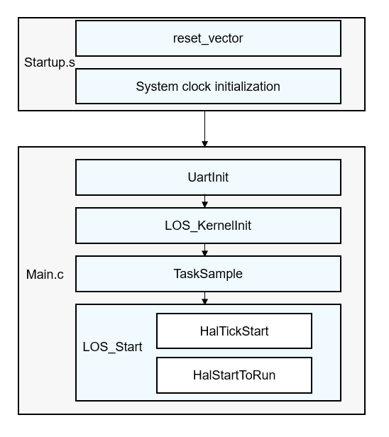

# Basic Kernel Adaptation

The LiteOS Cortex-M kernel provides the system initialization process and customized configuration options required for system running. During kernel porting, you must pay attention to the functions related to hardware configuration in the initialization process and understand the kernel configuration options so that the minimum kernel that matches the board can be tailored.

## Adaptation Process

Basic adaptation consists of the following steps:

1.  Modify the code in the  **startup.S**  and corresponding link configuration files.
2.  Initialize the serial port and register the handler function for the tick interrupt response in the  **main.c**  file

**Figure  1**  Startup process  

In the  **startup.S**  file, you must ensure that the entry function \(for example,  **reset\_vector**\) of the interrupt vector table is stored in the RAM start address specified by the link configuration files. The link configuration files of IAR, Keil, and GCC projects are  **xxx.icf**,  **xxx.sct**, and  **xxx.ld**, respectively. The startup file provided by the vendor does not need to be modified if the  **startup.S**  file has initialized the system clock and returned to the  **main**  function. Otherwise, the preceding functions need to be implemented.

In the  **main.c**  file, you need to register the UartInit function used for initializing the serial port and the handler function used for the system tick.

-   The UartInit function initializes the board serial port, and the function name can be defined based on the board. This function is optional. You can determine whether to call it based on whether the board supports the serial port. If the board supports the serial port, this function must enable TX and RX channels of the serial port and set the baud rate.
-   You can call  **HalTickStart**  to set the  **OsTickHandler**  function for the tick interrupt response.

For the chip whose interrupt vector table cannot be redirected, you need to disable the  **LOSCFG\_PLATFORM\_HWI**  macro, and add the  **OsTickHandler**  function for the tick interrupt response in the  **startup.S**  file.

## Feature Configuration

The  **los\_config.h**  file defines both complete configuration and default configuration of  **liteos\_m**. All configuration items in this file can be customized for different boards as required.

You can define configuration items in the  **device/xxxx/target\_config.h**  file of the corresponding board. For other undefined configuration items, default values in the  **los\_config.h**  file will be used.

The following table shows some typical configuration items:

**Table  1**  Typical configuration items

<table><thead align="left"><tr id="row1244014425196"><th class="cellrowborder" valign="top" width="34.81%" id="mcps1.2.3.1.1">
Item

</th>
<th class="cellrowborder" valign="top" width="65.19%" id="mcps1.2.3.1.2">
Description

</th>
</tr>
</thead>
<tbody><tr id="row1944094221913"><td class="cellrowborder" valign="top" width="34.81%" headers="mcps1.2.3.1.1 ">
LOSCFG_BASE_CORE_SWTMR

</td>
<td class="cellrowborder" valign="top" width="65.19%" headers="mcps1.2.3.1.2 ">
Switch of the software timer. The values <strong id="b10860112593720">1</strong> and <strong id="b297273113393">0</strong> indicate that the switch is turned on and turned off, respectively.

</td>
</tr>
<tr id="row1225026133717"><td class="cellrowborder" valign="top" width="34.81%" headers="mcps1.2.3.1.1 ">
LOSCFG_BASE_CORE_SWTMR_ALIGN

</td>
<td class="cellrowborder" valign="top" width="65.19%" headers="mcps1.2.3.1.2 ">
Switch of the time alignment feature, which depends on the switch status of the software timer. The values <strong id="b10462312174018">1</strong> and <strong id="b3462151215403">0</strong> indicate that the switch is turned on and turned off, respectively.

</td>
</tr>
<tr id="row7440742191919"><td class="cellrowborder" valign="top" width="34.81%" headers="mcps1.2.3.1.1 ">
LOSCFG_BASE_IPC_MUX

</td>
<td class="cellrowborder" valign="top" width="65.19%" headers="mcps1.2.3.1.2 ">
Switch of the mux feature. The values <strong id="b12108629184012">1</strong> and <strong id="b510882954014">0</strong> indicate that the switch is turned on and turned off, respectively.

</td>
</tr>
<tr id="row3440642161918"><td class="cellrowborder" valign="top" width="34.81%" headers="mcps1.2.3.1.1 ">
LOSCFG_BASE_IPC_QUEUE

</td>
<td class="cellrowborder" valign="top" width="65.19%" headers="mcps1.2.3.1.2 ">
Switch of the queue feature. The values <strong id="b1514814454405">1</strong> and <strong id="b114824504011">0</strong> indicate that the switch is turned on and turned off, respectively.

</td>
</tr>
<tr id="row14294143784110"><td class="cellrowborder" valign="top" width="34.81%" headers="mcps1.2.3.1.1 ">
LOSCFG_BASE_CORE_TSK_LIMIT

</td>
<td class="cellrowborder" valign="top" width="65.19%" headers="mcps1.2.3.1.2 ">
Maximum number of available tasks, excluding idle tasks. You can set this item based on your actual service requirements, or you can initially set it to a large value and adjust the value at a later time.

</td>
</tr>
<tr id="row16440124216198"><td class="cellrowborder" valign="top" width="34.81%" headers="mcps1.2.3.1.1 ">
LOSCFG_BASE_IPC_SEM

</td>
<td class="cellrowborder" valign="top" width="65.19%" headers="mcps1.2.3.1.2 ">
Switch of the semaphore feature. The values <strong id="b0766102114312">1</strong> and <strong id="b1876612254312">0</strong> indicate that the switch is turned on and turned off, respectively.

</td>
</tr>
<tr id="row444064216197"><td class="cellrowborder" valign="top" width="34.81%" headers="mcps1.2.3.1.1 ">
LOSCFG_PLATFORM_EXC

</td>
<td class="cellrowborder" valign="top" width="65.19%" headers="mcps1.2.3.1.2 ">
Switch of the exception feature. The values <strong id="b15509164154316">1</strong> and <strong id="b1651024115436">0</strong> indicate that the switch is turned on and turned off, respectively.

</td>
</tr>
<tr id="row744111422199"><td class="cellrowborder" valign="top" width="34.81%" headers="mcps1.2.3.1.1 ">
LOSCFG_KERNEL_PRINTF

</td>
<td class="cellrowborder" valign="top" width="65.19%" headers="mcps1.2.3.1.2 ">
Switch of the print feature. The values <strong id="b71401245104416">1</strong> and <strong id="b141401545194417">0</strong> indicate that the switch is turned on and turned off, respectively.

</td>
</tr>
</tbody>
</table>

