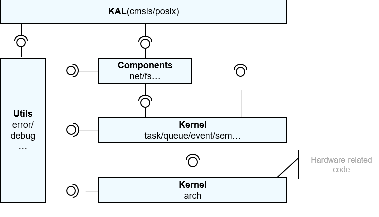

# Porting Overview<a name="EN-US_TOPIC_0000001153842840"></a>

## Porting Scenario<a name="section93781277367"></a>

The chip architecture adaptation process is optional. If the particular chip architecture is supported in the  **liteos\_m/arch**  directory, you can directly implement the board adaptation. Otherwise, chip architecture porting is required.

## Directory Specifications<a name="section18127744153119"></a>

The kernel used by module chips is LiteOS Cortex-M, which consists of four modules, namely kernel abstraction layer \(KAL\), components, kernel, and utils.

-   **KAL**: provides APIs exposed externally and depends on the components and kernel modules.
-   **Components**: is pluggable and relies on the kernel module.

-   **Kernel**: stores hardware-related code in the  **arch**  directory and other code. The implementation of kernel function sets \(such as task and sem\), for example, task context switching and atomic operations, depends on the hardware-related code in the  **arch**  directory.
-   **Utils**: functions as a basic code block where other modules rely.

**Figure  1**  Architecture of the LiteOS Cortex-M kernel<a name="fig10838105524917"></a>  



The directory structure of the kernel is described as follows:

```
.
├── arch                    --- Code of the kernel instruction architecture layer
│   ├── arm                 --- Code of the ARM32 architecture
│   │   ├── cortex-m3       --- Code of the Cortex-M3 architecture
│   │   │   ├── iar         --- Implementation of the IAR toolchain
│   │   │   ├── keil        --- Implementation of the Keil toolchain
│   │   │   └── xxx         --- Implementation of the particular toolchain
│   │   └── cortex-m4       --- Code of the Cortex-M4 architecture
│   │        ├── iar        --- Implementation of the IAR toolchain
│   │        ├── keil       --- Implementation of the Keil toolchain
│   │        └── xxx        --- Implementation of the particular toolchain
│   ├── include             --- Header files that declare the APIs required, kernel-independent
│   └── risc-v              --- RISK_V architecture
│        └── gcc            --- Implementation of the GCC toolchain
├── components              --- Components available for porting and header files exposed externally
├── kal                     --- APIs exposed externally, including CMSIS APIs and part of POSIX APIs
├── kernel                  --- Code for defining the minimum kernel function set
│   ├── include             --- Code for defining the minimum kernel function set
│   └── src                 --- Code for implementing the minimum kernel function set
└──utils                    --- Basic code
```

## Chip Architecture Adaptation<a name="section137431650339"></a>

As shown in the  [Directory Specifications](#section18127744153119), the  **arch/include**  directory defines the functions that need to be implemented on the common chip architecture. The code related to the chip architecture contains assembly code, which varies based on building toolchains. Therefore, the code for adapting to different toolchains \(for example, IAR, Keil, GCC, etc.\) must be implemented in a specific chip architecture.

The  **arch/include**  directory defines common files and functions. All functions in this directory need to be implemented to adapt to a newly added architecture. For details, refer to the following header files.

```
los_arch.h                        --- Defines the functions required for initializing the chip architecture.
los_atomic.h                      --- Defines the atomic operation functions required by the chip architecture.
los_context.h                     --- Defines the context functions required by the chip architecture.
los_interrupt.h                   --- Defines the interrupt and exception functions required by the chip architecture.
los_timer.h                       --- Defines the timer functions required by the chip architecture.
```

