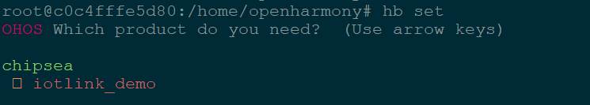
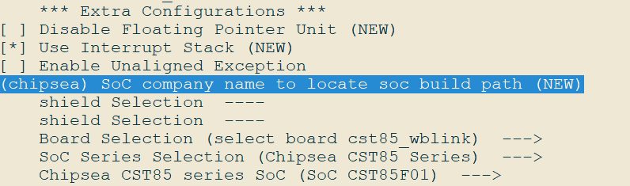

# IoT Solution - Chipsea CST85 Chip Porting Case

This document describes how to port the OpenHarmony LiteOS-M mini system on the cst85_wblink development board based on the Chipsea CST85 chip. In this document, Wi-Fi connection and XTS test samples are developed, and the adaptation of components such as wifi_lite, lwIP, startup, Utils, XTS, and HDF is implemented based on the OpenHarmony LiteOS-M kernel. The porting architecture uses the Board and SoC separation solution and the Newlib C library as the toolchain. The LiteOS-M kernel is compiled in gn+Kconfig graphical configuration mode.

## Compilation and Building Adaptation

### Directory Planning

This solution designs the directory structure using the [board and SoC decoupling idea](https://gitee.com/openharmony-sig/sig-content/blob/master/devboard/docs/board-soc-arch-design.md).

```
device
├── board                                --- Board vendor directory.
│   └── chipsea                          --- Board vendor name Chipsea.
│       └── cst85_wblink                 --- Board name cst85_wblink.
└── soc                                  --- SoC vendor directory.
    └── chipsea                          --- SoC vendor name Chipsea.
        └── cst85                        --- SoC series name CST85.
```

The planned product demo directory is as follows:

```
vendor
└── chipsea                              --- Vendor of the product demo, which is Chipsea here.
    ├── iotlink_demo                     --- Product name: Wi-Fi sample.
    └── xts_demo                         --- Product name: XTS test sample.
```

### Product Definition
The vendor/chipsea/iotlink_demo describes the kernel, board, and subsystem information used by the product. The kernel, board model, and board vendor are required by the precompilation command and must be planned in advance. The information entered here corresponds to the planned directory. Example:
```
{
  "product_name": "iotlink_demo",        --- Product name.
  "version": "3.0",                         --- OS version: 3.0
  "device_company": "chipsea",           --- Board vendor: Chipsea
  "board": "cst85_wblink",               --- Board name: cst85_wblink
  "kernel_type": "liteos_m",                --- Kernel type: liteos_m
  "kernel_version": "3.0.0",                --- Kernel version: 3.0.0
  "subsystems": []                          --- Subsystems
}
```

### Board Configuration
In the directory associated with the product definition, for example, **/device/board/chipsea/cst85_wblink**, you need to place the **config.gni** file in the **liteos_m** directory. This configuration file describes the board information, including the CPU, toolchain, kernel, and compile_flags. Example:
```
# Kernel type
kernel_type = "liteos_m"

# Kernel version
kernel_version = "3.0.0"

# Board CPU type
board_cpu = "cortex-m4"

# Toolchain: arm-none-eabi
board_toolchain = "arm-none-eabi"

# Path of the toolchain. You can use the system path '''' or customize the path.
board_toolchain_path = ""

# Compilation parameters about the board
board_cflags = []

# Link parameters about the board
board_ld_flags = []

# Header files about the board
board_include_dirs = []

# Board adapter dir for OHOS components.
board_adapter_dir = "${ohos_root_path}device/soc/chipsea"
```

### Precompilation
After the product directory, product definition, and board configuration are correctly configured, enter the precompilation command **hb set** in the root directory of the project. Then you can find the related product in the displayed list.



After you select a product and press **Enter**, a `ohos_config.json` file will be generated in the root directory. The file will list the product information to be compiled.

```
{
  "root_path": "/home/openharmony",
  "board": "cst85_wblink",
  "kernel": "liteos_m",
  "product": "iotlink_demo",
  "product_path": "/home/openharmony/vendor/chipsea/iotlink_demo",
  "device_path": "/home/openharmony/device/board/chipsea/cst85_wblink/liteos_m",
  "device_company": "chipsea",
  "os_level": "mini",
  "version": "3.0",
  "patch_cache": null,
  "product_json": "/home/openharmony/vendor/chipsea/iotlink_demo/config.json",
  "target_cpu": null,
  "target_os": null,
  "out_path": "/home/openharmony/out/cst85_wblink/iotlink_demo"
}
```


## Kernel Porting

### Kconfig Adaptation

During the compilation of **//kernel/liteos_m**, you need to use the `Kconfig` file for configurations in the corresponding board and SoC directories. Let's see the related configurations in the board and SoC directories.

The following uses `//device/board/chipsea` as an example for the `Kconfig` in the board directory:
```
device/board/chipsea
├── cst85_wblink                                 --- Board configuration directory **cst85_wblink**.
│   ├── Kconfig.liteos_m.board                   --- Board configuration options.
│   ├── Kconfig.liteos_m.defconfig.board         --- Default board configuration items.
│   └── liteos_m
│       └── config.gni                           --- Board configuration file.
├── Kconfig.liteos_m.boards                      --- Board configurations of the board vendor.
└── Kconfig.liteos_m.defconfig.boards            --- Board configurations of the board vendor.
```

In `cst85_wblink/Kconfig.liteos_m.board`, configure that **BOARD_CST85_WBLINK** can be selected only when **SOC_CST85F01** is selected.
```
config BOARD_CST85_WBLINK
    bool "select board cst85_wblink"
    depends on SOC_CST85F01
```

The following uses `//device/soc/chipsea` as an example for the `Kconfig` in the SoC directory:

```
device/soc/chipsea/
├── cst85                                        --- CST85 series.
│   ├── Kconfig.liteos_m.defconfig.cst85f01      --- Default CST85F01 SoC configuration.
│   ├── Kconfig.liteos_m.defconfig.series        --- Default configuration of the CST85 series.
│   ├── Kconfig.liteos_m.series                  --- Configuration of the CST85 series.
│   └── Kconfig.liteos_m.soc                     --- CST85 SoC configuration.
├── Kconfig.liteos_m.defconfig                   --- Default SoC configuration.
├── Kconfig.liteos_m.series                      --- Series configuration.
└── Kconfig.liteos_m.soc                         --- SoC configuration.
```

The `cst85/Kconfig.liteos_m.series` configuration is as follows:

```
config SOC_SERIES_CST85
    bool "Chipsea CST85 Series"
    select ARM
    select SOC_COMPANY_CHIPSEA
    select CPU_CORTEX_M4
    help
        Enable support for Chipsea CST85 series
```

**SOC_CST85F01** can be selected in **cst85/Kconfig.liteos_m.soc** only when **SOC_SERIES_CST85** is selected.

```
choice
    prompt "Chipsea CST85 series SoC"
    depends on SOC_SERIES_CST85

config SOC_CST85F01
    bool "SoC CST85F01"

endchoice
```

To compile **BOARD_CST85_WBLINK**, select **SOC_COMPANY_CHIPSEA**, **SOC_SERIES_CST85** and **SOC_CST85F01**. You can run the `make menuconfig` command in `kernel/liteos_m` for configurations.



The configured file is saved to `//vendor/chipsea/iotlink_demo/kernel_configs/debug.config` by default. You can also directly configure **debug.config**.

```
LOSCFG_SOC_SERIES_CST85=y
LOSCFG_KERNEL_BACKTRACE=y
LOSCFG_KERNEL_CPUP=y
LOSCFG_PLATFORM_EXC=y
```

### Modular Compilation

The compilation of `Board` and `SoC` adopts the modular compilation method, starting from **kernel/liteos_m/BUILD.gn** and increasing by level. The adaptation process of this solution is as follows:

1. Create the **BUILD.gn** file in `//device/board/chipsea` and add the following content to the file:

   ```
   if (ohos_kernel_type == "liteos_m") {
     import("//kernel/liteos_m/liteos.gni")
     module_name = get_path_info(rebase_path("."), "name")
     module_group(module_name) {
       modules = [
         "cst85_wblink"
       ]
     }
   }
   ```

   In the preceding **BUILD.gn** file, **cst85_wblink** is the module name organized by directory level.

2. Create the **BUILD.gn** file in `//device/soc/chipsea` in the same way and add the following content to the file by directory level:

   ```
   if (ohos_kernel_type == "liteos_m") {
     import("//kernel/liteos_m/liteos.gni")
     module_name = get_path_info(rebase_path("."), "name")
     module_group(module_name) {
       modules = [
         "cst85",
         "hals",
       ]
     }
   }
   ```

3. In the `//device/soc/chipsea` module at each level, add the **BUILD.gn** file and compile the module. The following uses `//device/soc/chipsea/cst85/liteos_m/sdk/bsp/arch/BUILD.gn` as an example:

   ```
   import("//kernel/liteos_m/liteos.gni")
   module_name = "sdk_bsp_arch"
   
   kernel_module(module_name) {
     sources = [
       "boot/armgcc_4_8/boot_startup.S",
       "boot/armgcc_4_8/exception.S",
       "boot/fault_handler.c",
   
       "cmsis/cmsis_nvic.c",
   
       "ll/ll.c",
   
       "main/arch_main.c",
     ]
   
     include_dirs = [
       "boot",
       "boot/armgcc_4_8",
     ]
   
     deps = [
       "//base/startup/bootstrap_lite/services/source:bootstrap",
     ]
   }
   
   config("public") {
     include_dirs = [
       ".",
       "boot",
       "compiler",
       "cmsis",
       "ll",
     ]
   }
   ```

   To organize links and some compilation options, set the following parameters in **config("public")**:

   ```
   config("public") {
     include_dirs = []                       --- Common header file.
     ldflags = []                            --- Link parameters, including the Id file.
     libs = []                               --- Link library.
     defines = []                            --- Definitions.
   }
   ```

    **NOTE**
   It is recommended that common parameter options and header files not be repeatedly filled in each component.

### Kernel Startup Adaptation

The kernel startup adaptation file is stored in `//device/soc/chipsea/cst85/liteos_m/sdk/modules/rtos/src/rtos.c`.

The general idea of kernel startup adaptation is as follows:

1. Use `OsVectorInit();` to initialize the interrupt vector and initialize the interrupt processing function.
2. Use `osKernelInitialize` to initialize the kernel.
3. Create a thread for OS component platform initialization using `OHOS_SystemInit`.
4. Use `DeviceManagerStart()` for HDF initialization.
5. The kernel starts to schedule the `LOS_Start` thread.

This section describes step 3 in detail. Other steps are used to call kernel functions and are not described here.

Initialize necessary actions before **OHOS_SystemInit** is started in step 3, as shown below:

```
...
    LOS_KernelInit();
    DeviceManagerStart();
    OHOS_SystemInit();
    LOS_Start();

....
```

### Interrupt Adaptation
To ensure the normal running of LiteOS-M, two interrupt service routines must be redirected to the ISRs specified by LiteOS-M: HalPendSV and OsTickerHandler. This depends on whether LiteOS-M takes over the interrupt vector table when LiteOS-M is adapted.
```
/**
 * @ingroup los_config
 * Configuration item for using system defined vector base address and interrupt handlers.
 * If LOSCFG_USE_SYSTEM_DEFINED_INTERRUPT is set to 0, vector base address will not be
 * modified by system. In arm, it should be noted that PendSV_Handler and SysTick_Handler should
 * be redefined to HalPendSV and OsTickHandler respectably in this case, because system depends on
 * these interrupt handlers to run normally. What's more, LOS_HwiCreate will not register handler.
 */
#ifndef LOSCFG_USE_SYSTEM_DEFINED_INTERRUPT
#define LOSCFG_USE_SYSTEM_DEFINED_INTERRUPT                 1
#endif
```

#### Whether the OS Takes Over Interrupt Vectors
You can configure the **target_config.h** file to determine whether to take over LiteOS. The options are: **1**: yes; **0**: no.
```
#define LOSCFG_USE_SYSTEM_DEFINED_INTERRUPT                 0
```


If this parameter is set to **1**, LiteOS changes **SCB->VTOR** to **g_hwiForm**. Therefore, the ArchHwiCreate API of the LITEOS needs to be called to configure the original ISRs of the SoC to the new interrupt vector table **g_hwiForm** during startup, and the interrupt service routines of PendSV and SysTicke are redirected to HalPendSV and OsTickerHandler. Otherwise, the original ISRs of the SoC do not respond.

If this parameter is set to **0**, the original interrupt vector table of the SoC is used. For CST85F01, the interrupt vector table is **__vectors_start___** (**NVIC_Vectors_Init** copies the content of **__isr_vector** to this table). To adapt LiteOS, you must redirect the interrupt service routines of PendSV and SysTick to HalPendSV and OsTickHandler. Otherwise, the system cannot run.

In this example, LiteOS is not allowed to take over interrupt processing. Therefore, you need to redirect the interrupt service routines of PendSV and SysTick to HalPendSV and OsTickHandler during startup.
```
#ifdef CFG_LITEOS
static void OsVectorInit(void)
{
    NVIC_SetVector(PendSV_IRQn, (uint32_t)HalPendSV);
    NVIC_SetVector(SysTick_IRQn, (uint32_t)OsTickHandler);
}
#endif
```

#### Interrupt Vector Table Address Alignment
As described in the documents related to Cortex-M, the minimum address of the interrupt vector table is 32-byte aligned, that is, 0x80.
For example, if 21 more interrupts are required, a total of 37 interrupts are required because there are already 16 system interrupts. One 0x80 is insufficient for 37\*4 entries, and two 0x80s, that is, 0x100, are required.

In CST85F01 adaptation, the maximum number of interrupt vectors is 128 (defined in **target_config.h**).
```
#define LOSCFG_PLATFORM_HWI_LIMIT                           128
```
Here, 128 interrupts and system interrupts are required, that is, a total of 144 (128 + 16) interrupts, and 144\*4 entries are required. These entries need to be covered by four 0x80s, that is, 0x200 alignment. Otherwise, the system restarts.
Therefore, the interrupt alignment needs to be overridden to 0x200.
```
#ifndef LOSCFG_ARCH_HWI_VECTOR_ALIGN
#define LOSCFG_ARCH_HWI_VECTOR_ALIGN                         0x200
#endif
```

### LittleFS Adaptation

In the XTS test, the syspara test involves the read and write of files in the KV storage. Therefore, a file system needs to be adapted to store the KV to a certain position in the flash memory. Therefore, the LittleFS is adapted.

During the adaptation, an adaptation API needs to be added to `device/soc/chipsea/cst85/liteos_m/components/drivers/littlefs`.

```
  #define LFS_DEFAULT_START_ADDR 0x081E3000 ---LittleFS start address
  #define LFS_DEFAULT_BLOCK_SIZE 4096 --- Block size
  #define LFS_DEFAULT_BLOCK_COUNT 25        ---Number of blocks

```

Finally, the LittleFS API of the kernel is implemented in `device/soc/chipsea/cst85/liteos_m/components/drivers/littlefs/hal_vfs.c`.

```
int32_t hal_vfs_init(void)
{
    VfsOps = malloc(sizeof(struct lfs_manager));
    if (VfsOps == NULL) {
        printf("+++ hal_vfs_init: NO memory!!\n");
        return -1;
    } else {
        memset(VfsOps, 0, sizeof(struct lfs_manager));
    }

    VfsOps->LfsOps.read = lfs_block_read; // Flash read API
    VfsOps->LfsOps.prog = lfs_block_write; // Flash write API
    VfsOps->LfsOps.erase = lfs_block_erase; // Flash erase API
    VfsOps->LfsOps.sync = lfs_block_sync; 
    VfsOps->LfsOps.read_size = 256;  
    VfsOps->LfsOps.prog_size = 256;
    VfsOps->LfsOps.cache_size = 256;
    VfsOps->LfsOps.lookahead_size = 16;
    VfsOps->LfsOps.block_cycles = 500;
    VfsOps->start_addr = LFS_DEFAULT_START_ADDR;
    VfsOps->LfsOps.block_size = LFS_DEFAULT_BLOCK_SIZE;
    VfsOps->LfsOps.block_count = LFS_DEFAULT_BLOCK_COUNT;

    SetDefaultMountPath(0,"/data");
    if (LOS_FsMount(NULL, "/data", "littlefs", 0, VfsOps) != FS_SUCCESS) {
        printf("+++ hal_vfs_init: Mount littlefs failed!\n");
        free(VfsOps);
        return -1;
    }

    if (LOS_Mkdir("/data", 0777) != 0 ) {
        printf("+++ hal_vfs_init: Make dir failed!\n");
    }

    flash_user_data_addr_length_set(LFS_DEFAULT_START_ADDR,
            LFS_DEFAULT_BLOCK_SIZE * LFS_DEFAULT_BLOCK_COUNT);

    printf("+++ hal_vfs_init: Mount littlefs success!\n");
    return 0;
}

```


### C Library Adaptation

In a mini system, the C library adaptation is complex. For details about the design idea, see [LiteOS-M Kernel Supports Smooth Switching Between musl and newlib](https://gitee.com/arvinzzz/ohos_kernel_design_specification/blob/master/liteos_m/%E6%94%AF%E6%8C%81newlib/%E5%86%85%E6%A0%B8%E9%80%82%E9%85%8Dnewlib%E6%96%B9%E6%A1%88%E6%80%9D%E8%B7%AF.md). The built-in `newlib` C library is used for system porting. Select **LOSCFG_LIBC_NEWLIB=y** in `vendor/chipsea/iotlink_demo/kernel_configs/debug.config`.


### printf Adaptation

To easily use standard functions in the C library to output information, implement adaptation to output the standard function information to the hardware (serial port). Therefore, the printf function is adapted.

Add the `wrap` link option of the printf function to `//device/board/chipsea/cst85_wblink/liteos_m/config.gni`.

```
board_ld_flags += [
     "-Wl,--wrap=printf",
]
```

Implement *_wrap* printf in `device/soc/chipsea/cst85/liteos_m/sdk/bsp/wrapper/lite_sys.c`.


### HDF Adaptation of GPIO
To easily use the HDF to use GPIO functions, adapt the HDF for the GPIO.

1. The chip driver adaptation file is stored in the `//drivers/adapter/platform` directory. Add the **gpio_chipsea.c** and **gpio_chipsea.h** files to the **gpio** directory, and add compilation conditions of the new driver file to **BUILD.gn**.

   ```
   if (defined(LOSCFG_SOC_COMPANY_CHIPSEA)) {
    sources += [ "gpio_chipsea.c" ]
   }
   ```

2. Describe the driver description file in **gpio_chipsea.c** as follows:

   ```
   struct HdfDriverEntry g_gpioDriverEntry = {
       .moduleVersion = 1,
       .moduleName = "HDF_PLATFORM_GPIO",
       .Bind = GpioDriverBind,
       .Init = GpioDriverInit,
       .Release = GpioDriverRelease,
   };
   
   HDF_INIT(g_gpioDriverEntry);
   ```

3. Add the GPIO hardware description file **gpio.hcs** to **cst85/liteos_m/components/hdf_config/device_info.hcs**. The mapped gpio0 controls the programmable LED on the card. The hcs file content is as follows:

   ```
   root {
       platform :: host {
            hostName = "platform_host";
            priority = 50;
            device_gpio :: device {
                gpio0 :: deviceNode {
                    policy = 0;
                    priority = 100;
                    moduleName = "HDF_PLATFORM_GPIO";
                    serviceName = "HDF_PLATFORM_GPIO";
                    deviceMatchAttr = "gpio_config";
            }
       }
   }
   ```


## OpenHarmony Subsystem Adaptation

### Communication Subsystem

In the communication subsystem, the wifi_lite component needs to be enabled and adapt related APIs.

The configuration items of the wifi_lite component are as follows:

```
"subsystem": "communication",
"components": [
  { "component": "wifi_lite", "features":[] }
  ]
```

The implementation related to Wi-Fi is under `//device/soc/chipsea/hals/communication/wifi_lite/wifiservice/wifi_device.c`.

```
......
WifiErrorCode Scan(void)
{
    WIFI_STATE_INVALID_CHECK(WIFI_INACTIVE);

    int testNum = MEMP_NUM_NETCONN;
    dbg("testNum %d\r\n", testNum);
    ChipseaWifiMsg msg = {
        .eventId = WIFI_START_SCAN,
        .payLoad = 0,
    };

    if (WifiCreateLock() != WIFI_SUCCESS) {
        return ERROR_WIFI_NOT_AVAILABLE;
    }
    if (rtos_queue_write(g_wifiData.wifiQueue, &msg, 1, false) != 0) {
        dbg("wifiDevice:rtos_queue_write err\r\n");
        WifiUnlock();
        return ERROR_WIFI_NOT_AVAILABLE;
    }
    WifiUnlock();
    return WIFI_SUCCESS;
}

......
int GetSignalLevel(int rssi, int band)
{
    if (band == HOTSPOT_BAND_TYPE_2G) {
        if (rssi >= RSSI_LEVEL_4_2_G)
            return RSSI_LEVEL_4;
        if (rssi >= RSSI_LEVEL_3_2_G)
            return RSSI_LEVEL_3;
        if (rssi >= RSSI_LEVEL_2_2_G)
            return RSSI_LEVEL_2;
        if (rssi >= RSSI_LEVEL_1_2_G)
            return RSSI_LEVEL_1;
    }

    if (band == HOTSPOT_BAND_TYPE_5G) {
        if (rssi >= RSSI_LEVEL_4_5_G)
            return RSSI_LEVEL_4;
        if (rssi >= RSSI_LEVEL_3_5_G)
            return RSSI_LEVEL_3;
        if (rssi >= RSSI_LEVEL_2_5_G)
            return RSSI_LEVEL_2;
        if (rssi >= RSSI_LEVEL_1_5_G)
            return RSSI_LEVEL_1;
    }
    return ERROR_WIFI_INVALID_ARGS;
}

```

### Kernel Subsystem

For the kernel subsystem, you need to configure the lwIP component closely related to Wi-Fi, use the third-party lwIP component of the community, and specify the directory for adapting the third-party lwIP and Wi-Fi systems.

By default, `lwip` is configured in the `LiteOS-M kernel` directory. Therefore, the compilation function is available. You can specify the `lwip` compilation directory in the `kernel` component. The sample code is as follows:

```
    {
      "subsystem": "kernel",
      "components": [
        {
          "component": "liteos_m",
          "features": [
             "ohos_kernel_liteos_m_lwip_path = \"//device/soc/chipsea/cst85/liteos_m/sdk/modules/lwip-2.1\""
		 --- Specify that adaptation is performed in the chip vendor directory.
          ]
        }
      ]
    },
```

The `//device/soc/chipsea/cst85/liteos_m/sdk/modules/lwip-2.1/BUILD.gn` file describes the compilation of `lwip` as follows:

```
import("//kernel/liteos_m/liteos.gni")
import("$LITEOSTHIRDPARTY/lwip/lwip.gni")
import("$LITEOSTOPDIR/components/net/lwip-2.1/lwip_porting.gni")

module_switch = defined(LOSCFG_NET_LWIP_SACK)
module_name = "lwip"
kernel_module(module_name) {
  sources = LWIP_PORTING_FILES + LWIPNOAPPSFILES -
            [ "$LWIPDIR/api/sockets.c" ] + [ "porting/src/ethernetif.c" ]		 --- Add the **ethernetif.c** file for Ethernet network adapter initialization and adaptation.
  defines = [ "LITEOS_LWIP=1" ]
  defines += [ "CHECKSUM_BY_HARDWARE=1" ]
}

config("public") {
  defines = [ "_BSD_SOURCE=1" ]
  include_dirs =
      [ "porting/include" ] + LWIP_PORTING_INCLUDE_DIRS + LWIP_INCLUDE_DIRS
}

```

In the `//device/soc/chipsea/cst85/liteos_m/sdk/modules/lwip-2.1/porting/include/lwip/lwipopts.h` file, the original `lwip` configuration items remain unchanged, the DSoftBus depends on these configuration items, and a hardware adaptation configuration item is added as follows:

```
#ifndef _PORTING_LWIPOPTS_H_
#define _PORTING_LWIPOPTS_H_

#include_next "lwip/lwipopts.h"				 --- Original configuration items remain unchanged.

#define LWIP_NETIF_STATUS_CALLBACK      1
#define LWIP_CHECKSUM_ON_COPY           0
#define CHECKSUM_GEN_UDP                0	 --- New hardware adaptation item.

#endif /* _PORTING_LWIPOPTS_H_ */

```

In the `//device/soc/chipsea/cst85/liteos_m/sdk/modules/lwip-2.1/porting/net_al.c` file, the adaptation to the initialization of the `Ethernet` network adapter is described as follows:

```
static err_t net_if_init(struct netif *net_if)
{
    err_t status = ERR_OK;
    struct fhost_vif_tag *vif = (struct fhost_vif_tag *)net_if->state;

    #if LWIP_NETIF_HOSTNAME
    {
        /* Initialize interface hostname */
        net_if->hostname = "CsWlan";
    }
    #endif /* LWIP_NETIF_HOSTNAME */

    net_if->name[ 0 ] = 'w';
    net_if->name[ 1 ] = 'l';

    net_if->output = etharp_output;
    net_if->flags = NETIF_FLAG_BROADCAST | NETIF_FLAG_ETHARP | NETIF_FLAG_LINK_UP | NETIF_FLAG_IGMP;
    net_if->hwaddr_len = ETHARP_HWADDR_LEN;
    net_if->mtu = LLC_ETHER_MTU;
    net_if->linkoutput = net_if_output;
    memcpy(net_if->hwaddr, &vif->mac_addr, ETHARP_HWADDR_LEN);

    return status;
}

```

### Startup Subsystem

To run application frameworks such as XTS or APP_FEATURE_INIT, the bootstrap_lite and syspara_lite components of the startup subsystem are adapted.

Add the corresponding configuration items to the `vendor/chipsea/wblink_demo/config.json` file:

```
{
  "subsystem": "startup",
  "components": [
	{
	  "component": "bootstrap_lite"		 --- bootstrap_lite component
	},
	{
	  "component": "syspara_lite",		 --- syspara_lite component
	  "features": [
		"enable_ohos_startup_syspara_lite_use_posix_file_api = true"
	  ]
	}
  ]
},
```

When adapting the **bootstrap_lite** component, you need to manually add the following content to the link script file `//device/soc/chipsea/cst85/liteos_m/sdk/bsp/out/cst85f01/cst85f01.ld`:

```
       __zinitcall_bsp_start = .;
      KEEP (*(.zinitcall.bsp0.init))
      KEEP (*(.zinitcall.bsp1.init))
      KEEP (*(.zinitcall.bsp2.init))
      KEEP (*(.zinitcall.bsp3.init))
      KEEP (*(.zinitcall.bsp4.init))
      __zinitcall_bsp_end = .;
      __zinitcall_device_start = .;
      KEEP (*(.zinitcall.device0.init))
      KEEP (*(.zinitcall.device1.init))
      KEEP (*(.zinitcall.device2.init))
      KEEP (*(.zinitcall.device3.init))
      KEEP (*(.zinitcall.device4.init))
      __zinitcall_device_end = .;
      __zinitcall_core_start = .;
      KEEP (*(.zinitcall.core0.init))
      KEEP (*(.zinitcall.core1.init))
      KEEP (*(.zinitcall.core2.init))
      KEEP (*(.zinitcall.core3.init))
      KEEP (*(.zinitcall.core4.init))
      __zinitcall_core_end = .;
      __zinitcall_sys_service_start = .;
      KEEP (*(.zinitcall.sys.service0.init))
      KEEP (*(.zinitcall.sys.service1.init))
      KEEP (*(.zinitcall.sys.service2.init))
      KEEP (*(.zinitcall.sys.service3.init))
      KEEP (*(.zinitcall.sys.service4.init))
      __zinitcall_sys_service_end = .;
      __zinitcall_sys_feature_start = .;
      KEEP (*(.zinitcall.sys.feature0.init))
      KEEP (*(.zinitcall.sys.feature1.init))
      KEEP (*(.zinitcall.sys.feature2.init))
      KEEP (*(.zinitcall.sys.feature3.init))
      KEEP (*(.zinitcall.sys.feature4.init))
      __zinitcall_sys_feature_end = .;
      __zinitcall_run_start = .;
      KEEP (*(.zinitcall.run0.init))
      KEEP (*(.zinitcall.run1.init))
      KEEP (*(.zinitcall.run2.init))
      KEEP (*(.zinitcall.run3.init))
      KEEP (*(.zinitcall.run4.init))
      __zinitcall_run_end = .;
      __zinitcall_app_service_start = .;
      KEEP (*(.zinitcall.app.service0.init))
      KEEP (*(.zinitcall.app.service1.init))
      KEEP (*(.zinitcall.app.service2.init))
      KEEP (*(.zinitcall.app.service3.init))
      KEEP (*(.zinitcall.app.service4.init))
      __zinitcall_app_service_end = .;
      __zinitcall_app_feature_start = .;
      KEEP (*(.zinitcall.app.feature0.init))
      KEEP (*(.zinitcall.app.feature1.init))
      KEEP (*(.zinitcall.app.feature2.init))
      KEEP (*(.zinitcall.app.feature3.init))
      KEEP (*(.zinitcall.app.feature4.init))
      __zinitcall_app_feature_end = .;
      __zinitcall_test_start = .;
      KEEP (*(.zinitcall.test0.init))
      KEEP (*(.zinitcall.test1.init))
      KEEP (*(.zinitcall.test2.init))
      KEEP (*(.zinitcall.test3.init))
      KEEP (*(.zinitcall.test4.init))
      __zinitcall_test_end = .;
      __zinitcall_exit_start = .;
      KEEP (*(.zinitcall.exit0.init))
      KEEP (*(.zinitcall.exit1.init))
      KEEP (*(.zinitcall.exit2.init))
      KEEP (*(.zinitcall.exit3.init))
      KEEP (*(.zinitcall.exit4.init))
      __zinitcall_exit_end = .;
```

Adding the preceding content is because external APIs provided by `bootstrap_init` will be saved to the link segment. For details, see `//utils/native/lite/include/ohos_init.h`.

The following table lists the automatic initialization macros of bootstrap.

| API                | Description                            |
| ---------------------- | -------------------------------- |
| SYS_SERVICE_INIT(func) | Entry for initializing and starting a core system service.|
| SYS_FEATURE_INIT(func) | Entry for initializing and starting a core system feature.|
| APP_SERVICE_INIT(func) | Entry for initializing and starting an application-layer service.  |
| APP_FEATURE_INIT(func) | Entry for initializing and starting an application-layer feature.  |

The **lib** file compiled using the loaded components needs to be manually add to the forcible link.

​If the `bootstrap_lite` component is configured in `vendor/chipsea/wblink_demo/config.json`:

```
    {
      "subsystem": "startup",
      "components": [
        {
          "component": "bootstrap_lite"
        },
        ...
      ]
    },
```

​The `bootstrap_lite` component compiles the `//base/startup/bootstrap_lite/services/source/bootstrap_service.c` file. In this file, `SYS_SERVICE_INIT` is used to inject the `Init` function symbol to `__zinitcall_sys_service_start` and `__zinitcall_sys_service_end`.
```
static void Init(void)
{
    static Bootstrap bootstrap;
    bootstrap.GetName = GetName;
    bootstrap.Initialize = Initialize;
    bootstrap.MessageHandle = MessageHandle;
    bootstrap.GetTaskConfig = GetTaskConfig;
    bootstrap.flag = FALSE;
    SAMGR_GetInstance()->RegisterService((Service *)&bootstrap);
}
SYS_SERVICE_INIT(Init);   --- Forcible link to the generated lib file is required if **SYS_INIT** is used for startup.
```

In the `//base/startup/bootstrap_lite/services/source/BUILD.gn` file, add the file to the compilation sources.

```
static_library("bootstrap") {
  sources = [
    "bootstrap_service.c",
    "system_init.c",
  ]
  ....
```

Since the `Init` function does not support explicit calls, you need to forcibly link it to the final image. Configure **ld_flags** in the `device/board/chipsea/cst85_wblink/config.gni` file as follows:

```
   board_ld_flags += [
    "-Wl,--whole-archive",
    "-lexample",
    "-lhiview_lite",
    "-lhilog_lite",
    "-lhievent_lite",
    "-lbroadcast",
    "-lbootstrap",
    "-Wl,--no-whole-archive",
  ]

```

### Utils Subsystem

To adapt the `utils` subsystem, you need to add the `kv_store`, `js_builtin`, `timer_task`, and `kal_timer` components to the `config.json` file.

```
{
  "subsystem": "utils",
  "components": [
	{
	  "component": "kv_store",
	  "features": [
		"enable_ohos_utils_native_lite_kv_store_use_posix_kv_api = true"
	  ]
	},
	
  ]
},
```

Similar to the adaptation of the `syspara_lite` component, when the `kv_store` component is adapted, the key-value pair is written to the file. In the mini system, file operation APIs include `POSIX` and `HalFiles`. For access to the file system in the kernel, use the `POSIX` API, which means you need to add `enable_ohos_utils_native_lite_kv_store_use_posix_kv_api = true` to the `features` field. If you are using the `HalFiles` API, no modification is required.


### XTS Subsystem

For the adaptation to the XTS subsystem, for example, `//vendor/chipsea/xts_demo/config.json`, you need to add the following component options:

```
"subsystem": "xts",
"components": [
  { "component": "xts_acts", "features":
    [
	  "config_ohos_xts_acts_utils_lite_kv_store_data_path = \"/data\"",
      "enable_ohos_test_xts_acts_use_thirdparty_lwip = true"
    ]
  },
  { "component": "xts_tools", "features":[] }
]
```
The XTS lib needs to be forcibly linked in `device/board/chipsea/cst85_wblink/liteos_m/config.gni`.

```
 board_ld_flags += [
    "-Wl,--whole-archive",
     "-lhctest",
     "-lmodule_ActsParameterTest",
     "-lmodule_ActsBootstrapTest",
     "-lmodule_ActsDfxFuncTest",
     "-lmodule_ActsKvStoreTest",
     "-lmodule_ActsSamgrTest",
     "-lmodule_ActsWifiServiceTest",
     "-lmodule_ActsDsoftbusMgrTest",
 ]
```
