# Standard System Solution – Rockchip RK3568 Porting Case

This document describes how to port standard system functions based on the DAYU200 development board of the RK3568 chip from Rockchip. The porting processing mainly includes product configuration adding, kernel startup and upgrade, ADM-based conversion of audio, case summary of the camera, TP, LCD, Wi-Fi, Bluetooth, vibrator, sensor, and graphics display modules, as well as related function adaptation.

## Product Configuration and Directory Planning

### Product Configuration

Create a JSON file named after RK3568 in the `//productdefine/common/device` directory and specify the CPU architecture. The `//productdefine/common/device/rk3568.json` file is configured is as follows:

```
{
    "device_name": "rk3568",
    "device_company": "rockchip",
    "target_os": "ohos",
    "target_cpu": "arm",
    "kernel_version": "",
    "device_build_path": "device/board/hihope/rk3568",
    "enable_ramdisk": true,   // Specifies whether to support ramdisk secondary boot.
    "build_selinux": true    // Indicates whether SELinux permission management is supported.
}
```

Create a **rk3568.json** file in the **//productdefine/common/products** directory. This file is used to describe the SoC used by the product and the required subsystems. Configure the file as follows:

```
{
  "product_name": "rk3568",
  "product_company" : "hihope",
  "product_device": "rk3568",
  "version": "2.0",
  "type": "standard",
  "parts":{
    "ace:ace_engine_standard":{},
    "ace:napi":{},
    ...
    "xts:phone_tests":{}
  }
}
```

The main configurations are as follows:

1. **product_device**: SoC used by the product.
2. **type**: system type. In this example, set it to **standard**.
3. **parts**: subsystem to enable. A subsystem can be treated as an independently built functional block.

You can find predefined subsystems in **//build/subsystem_config.json**. You can also customize subsystems.

You are advised to copy the configuration file of Hi3516D V300 and delete the **hisilicon_products** subsystem, which is used to compile the kernel for Hi3516D V300.

### Directory Planning

This solution designs the directory structure using the [board and SoC decoupling idea](https://gitee.com/openharmony-sig/sig-content/blob/master/devboard/docs/board-soc-arch-design.md), and plans the SoC adaptation directory as follows:

```
device
├── board                                --- Board vendor directory
│   └── hihope                           --- Board vendor
│       └── rk3568                       --- Board name, RK3568, which contains driver service code
└── soc									 --- SoC vendor directory
    └── rockchip                       --- SoC vendor: Rockchip
        └── rk3568						 --- SoC series: RK3568, mainly solutions provided by the chip vendor and closed-source libraries
        
        
```

```
vendor
└── hihope					
    └── rk3568         			 --- Product name: product, HCS, and demo
```

## **Kernel Startup**

### Secondary Boot

Unlike traditional boot that directly mounts **system** and boots using **init** of **system**, secondary boot is to mount **ramdsik**, boot using **init** of **ramdsik**, perform necessary initialization operations (such as mounting the **system** and **vendor** partitions), and then switch to **init** of **system**.

RK3568 adaptation is to pack **ramdisk** compiled in the mainline version into **boot_linux.img**. The procedure is as follows:

1. Enable secondary boot.

   Set **enable_ramdisk** in **productdefine/common/device/rk3568.json**.

    ```
    {
      "device_name": "rk3568",
      "device_company": "hihope",
      "target_os": "ohos",
      "target_cpu": "arm",
      "kernel_version": "",
      "device_build_path": "device/hihope/build",
      "enable_ramdisk": true,
      "build_selinux": true
    }
    ```

2. Pack the **ramdsik.img** file compiled in the mainline version to **boot_linux.img**.

   View the configuration as follows:

   RK supports **uboot** from **ramdisk**. You only need to add **ramdisk.img** to the configuration file of the packed **boot_linux.img**. Therefore, the **its** format of the mainline version is not used. Specifically, add the following content to the kernel compilation script **make-ohos.sh**:
   
     ```
     function make_extlinux_conf()
     {
   	dtb_path=$1
   	uart=$2
   	image=$3
   	
   	echo "label rockchip-kernel-5.10" > ${EXTLINUX_CONF}
   	echo "	kernel /extlinux/${image}" >> ${EXTLINUX_CONF}
   	echo "	fdt /extlinux/${TOYBRICK_DTB}" >> ${EXTLINUX_CONF}
   	if [ "enable_ramdisk" == "${ramdisk_flag}" ]; then
   		echo "	initrd /extlinux/ramdisk.img" >> ${EXTLINUX_CONF}
   	fi
   	cmdline="append earlycon=uart8250,mmio32,${uart} root=PARTUUID=614e0000-0000-4b53-8000-1d28000054a9 rw rootwait rootfstype=ext4"
   	echo "  ${cmdline}" >> ${EXTLINUX_CONF}
     }
     ```

### Packing

Add the **make-boot.sh** script for packing the boot image. This script can be called when the boot image is packed after **ramdisk** is compiled. The main content is as follows:

```
genext2fs -B ${blocks} -b ${block_size} -d boot_linux -i 8192 -U boot_linux.img
```

For details about modification for calling **make-boot.sh**, see the following:

https://gitee.com/openharmony/build/pulls/569/files

### INIT Configuration

For details about the init configuration, see the [specifications of the startup subsystem](https://gitee.com/openharmony/docs/blob/master/en/readme/startup.md).

## **Audio**

### Overall structure of the RK3568 audio module

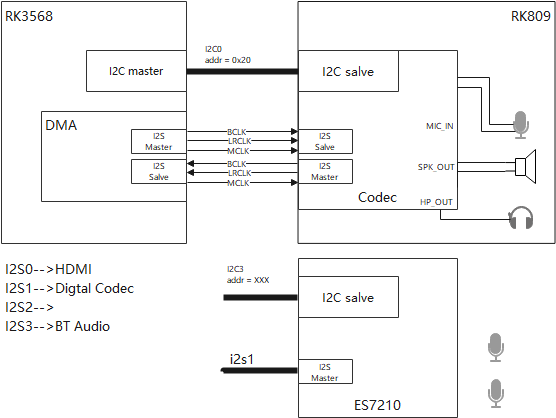

### Introduction to ADM Adaptation Solution

#### ADM framework adaptation of the RK3568 platform


1. ADM Drivers adapter

   Register the Codec/DMA/I2S driver so that the ADM can load the driver node. Register the API functions for the interaction between the ADM and drivers.

2. ADM Drivers impl

   Implement the ADM Drivers adapter API function, obtain configuration information such as **Codec_config.hcs/dai_config.hcs**, and register the information with the corresponding device.

3. Linux Drivers

   You can use **ADM Drivers impl** to complete end-to-end driver configuration based on the hardware manual. It can also use the native Linux driver implementation and APIs to reduce your workload.

#### Directory Structure

```
./device/board/hihope/rk3568/audio_drivers
├── codec
│   └── rk809_codec
│       ├── include
│       │   ├── rk809_codec_impl.h
│       │   └── rk817_codec.h
│       └── src
│           ├── rk809_codec_adapter.c
│           ├── rk809_codec_linux_driver.c
│           └── rk809_codec_ops.c
├── dai
│   ├── include
│   │   ├── rk3568_dai_linux.h
│   │   └── rk3568_dai_ops.h
│   └── src
│       ├── rk3568_dai_adapter.c
│       ├── rk3568_dai_linux_driver.c
│       └── rk3568_dai_ops.c
├── dsp
│   ├── include
│   │   └── rk3568_dsp_ops.h
│   └── src
│       ├── rk3568_dsp_adapter.c
│       └── rk3568_dsp_ops.c
├── include
│   ├── audio_device_log.h
│   └── rk3568_audio_common.h
└── soc
    ├── include
    │   └── rk3568_dma_ops.h
    └── src
        ├── rk3568_dma_adapter.c
        └── rk3568_dma_ops.c
```

### Detailed Process of Adapting RK3568 to ADM

#### Audio Framework Sorting

Sort out the audio structure of the target platform and specify the data stream and control stream path.

1. For the RK3568 platform, the audio structure is relatively simple. For details, see the overall audio structure of the RK3568 platform. The Codec functions as an independent device. The I2C controls the device, and the I2S implements the interaction between the codec device and the CPU.
2. Sort out the hardware information such as the I2S channel ID, corresponding pin ID, I2C channel ID, and address based on the schematic diagram.
3. Obtain the datasheet corresponding to the codec and the datasheet of the RK3568 platform (including the introduction to the registers such as the I2S and DMA channels).

#### ADM Structure

The following figure shows the ADM structure. Audio Peripheral Drivers and Platform Drivers are required for platform adaptation.

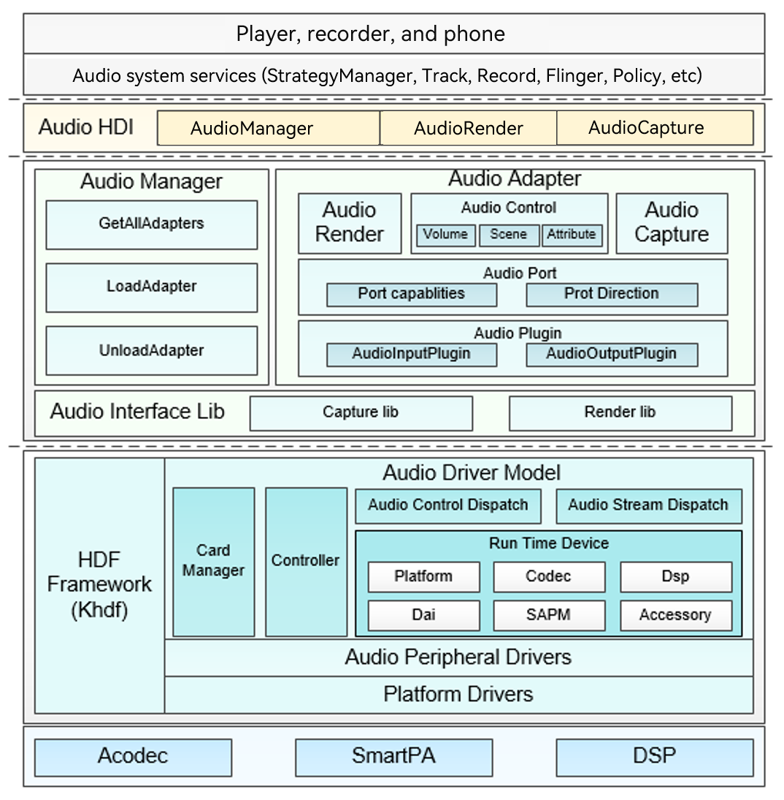

Based on the audio structure analysis in step 1, Audio Peripheral Drivers contain the RK809 driver, and Platform Drivers contain the DMA driver and I2S driver.

| Driver to Adapt| ADM Module| API File Path                                        |
| -------------- | ----------- | ---------------------------------------------------- |
| RK809 driver     | Accessory   | drivers/framework/include/audio/audio_accessory_if.h |
| DMA driver       | platform    | drivers/framework/include/audio/audio_platform_if.h  |
| I2S driver       | DAI         | drivers/framework/include/audio/audio_dai_if.h.h     |

#### Driver Code Framework Setup

##### Configuring the HCS File

Register the driver node under **audio** in the **device_info.hcs** file.

```c
        audio :: host {
            hostName = "audio_host";
            priority = 60;
            device_dai0 :: device {
                device0 :: deviceNode {
                    policy = 1;
                    priority = 50;
                    preload = 0;
                    permission = 0666;
                    moduleName = "DAI_RK3568";
                    serviceName = "dai_service";
                    deviceMatchAttr = "hdf_dai_driver";
                }
            }
            device_codec :: device {
                device0 :: deviceNode {
                    policy = 1;
                    priority = 50;
                    preload = 0;
                    permission = 0666;
                    moduleName = "CODEC_RK809";
                    serviceName = "codec_service_0";
                    deviceMatchAttr = "hdf_codec_driver";
                }
            }
            device_codec_ex :: device {
                device0 :: deviceNode {
                    policy = 1;
                    priority = 50;
                    preload = 0;
                    permission = 0666;
                    moduleName = "CODEC_RK817";
                    serviceName = "codec_service_1";
                    deviceMatchAttr = "hdf_codec_driver_ex";
                }
            }
            device_dsp :: device {
                device0 :: deviceNode {
                    policy = 1;
                    priority = 50;
                    preload = 0;
                    permission = 0666;
                    moduleName = "DSP_RK3568";
                    serviceName = "dsp_service_0";
                    deviceMatchAttr = "hdf_dsp_driver";
                }
            }
            device_dma :: device {
                device0 :: deviceNode {
                    policy = 1;
                    priority = 50;
                    preload = 0;
                    permission = 0666;
                    moduleName = "DMA_RK3568";
                    serviceName = "dma_service_0";
                    deviceMatchAttr = "hdf_dma_driver";
                }
            }
            ......
        }

```

Select the Codec node or Accessory node based on the connected device, and configure the private attributes (including the start address of the register and the address of the related control register) corresponding to the device. **Codec_config.hcs** and **DAI_config.hcs** are involved.

For details about the configuration, see the HCS configuration section and **audio_parse** module code of the ADM framework in [Audio](https://gitee.com/openharmony/docs/blob/master/en/device-dev/driver/driver-peripherals-audio-des.md).

##### Codec/Accessory Module

1. Register the driver with the HDF framework. The code snippet is as follows. The **moduleName** is the same as that in the HCS file.

   ```
   struct HdfDriverEntry g_codecDriverEntry = {
      .moduleVersion = 1,
      .moduleName = "CODEC_HI3516",
      .Bind = CodecDriverBind,
      .Init = CodecDriverInit,
      .Release = CodecDriverRelease,
   };
   HDF_INIT(g_codecDriverEntry);
   ```

2. Fill the Codec module with:

   **g_codecData**: operation function set and private data set of the codec device.

   **g_codecDaiDeviceOps**: codec DAI device operation function set, including APIs for starting transmission and setting parameters.

   **g_codecDaiData**: operation function set and private data set of the digital audio API of the codec.

3. Implement the bind, init, and release functions.

4. Verification

   Add debug logs to the bind and init functions, compile the version, and obtain system logs.

   ```
   [    1.548624] [E/"rk809_codec_adapter"]  [Rk809DriverBind][line:258]: enter
   [    1.548635] [E/"rk809_codec_adapter"]  [Rk809DriverBind][line:260]: success
   [    1.548655] [E/"rk809_codec_adapter"]  [Rk809DriverInit][line:270]: enter
   [    1.549050] [E/"rk809_codec_adapter"]  [GetServiceName][line:226]: enter
   [    1.549061] [E/"rk809_codec_adapter"]  [GetServiceName][line:250]: success
   [    1.549072] [E/"rk809_codec_adapter"]  [Rk809DriverInit][line:316]: g_chip->accessory.drvAccessoryName = codec_service_1
   [    1.549085] [E/audio_core]  [AudioSocRegisterDai][line:86]: Register [accessory_dai] success.
   [    1.549096] [E/audio_core]  [AudioRegisterAccessory][line:120]: Register [codec_service_1] success.
   [    1.549107] [E/"rk809_codec_adapter"]  [Rk809DriverInit][line:323]: success!
   ```


##### DAI Module

1. Register the I2S driver with the HDF framework. The code snippet is as follows. The **moduleName** is the same as that in the HCS file.

   ```c
   struct HdfDriverEntry g_daiDriverEntry = {
       .moduleVersion = 1,
       .moduleName = "DAI_RK3568",
       .Bind = DaiDriverBind,
       .Init = DaiDriverInit,
       .Release = DaiDriverRelease,
   };
   HDF_INIT(g_daiDriverEntry);
   ```

2. Fill the DAI module with:

   ```c
   struct AudioDaiOps g_daiDeviceOps = {
       .Startup = Rk3568DaiStartup,
       .HwParams = Rk3568DaiHwParams,
       .Trigger = Rk3568NormalTrigger,
   };
   
   struct DaiData g_daiData = {
       .Read = Rk3568DeviceReadReg,
       .Write = Rk3568DeviceWriteReg,
       .DaiInit = Rk3568DaiDeviceInit,
       .ops = &g_daiDeviceOps,
   };
   ```

3. Implement the bind, init, and release functions.

4. Verification

   Add debug logs to the bind and init functions, compile the version, and obtain system logs.

   ```
   [    1.549193] [I/device_node] launch devnode dai_service
   [    1.549204] [E/HDF_LOG_TAG]  [DaiDriverBind][line:38]: entry!
   [    1.549216] [E/HDF_LOG_TAG]  [DaiDriverBind][line:55]: success!
   [    1.549504] [E/audio_core]  [AudioSocRegisterDai][line:86]: Register [dai_service] success.
   [    1.549515] [E/HDF_LOG_TAG]  [DaiDriverInit][line:116]: success.
   ```

##### Platform Module

1. Register the DMA driver with the HDF framework. The code snippet is as follows. The **moduleName** is the same as that in the HCS file.

   ```
   struct HdfDriverEntry g_platformDriverEntry = {
       .moduleVersion = 1,
       .moduleName = "DMA_RK3568",
       .Bind = PlatformDriverBind,
       .Init = PlatformDriverInit,
       .Release = PlatformDriverRelease,
   };
   HDF_INIT(g_platformDriverEntry);
   ```

2. Fill the DMA module with:

   ```c
   struct AudioDmaOps g_dmaDeviceOps = {
       .DmaBufAlloc = Rk3568DmaBufAlloc,
       .DmaBufFree = Rk3568DmaBufFree,
       .DmaRequestChannel = Rk3568DmaRequestChannel,
       .DmaConfigChannel = Rk3568DmaConfigChannel,
       .DmaPrep = Rk3568DmaPrep,
       .DmaSubmit = Rk3568DmaSubmit,
       .DmaPending = Rk3568DmaPending,
       .DmaPause = Rk3568DmaPause,
       .DmaResume = Rk3568DmaResume,
       .DmaPointer = Rk3568PcmPointer,
   };
   
   struct PlatformData g_platformData = {
       .PlatformInit = AudioDmaDeviceInit,
       .ops = &g_dmaDeviceOps,
   };
   ```

3. Implement the bind, init, and release functions.

4. Verification

   Add debug logs to the bind and init functions, compile the version, and obtain system logs.

   ```
   [    1.548469] [E/rk3568_platform_adapter]  [PlatformDriverBind][line:42]: entry!
   [    1.548481] [E/rk3568_platform_adapter]  [PlatformDriverBind][line:58]: success!
   [    1.548492] [E/rk3568_platform_adapter]  [PlatformDriverInit][line:100]: entry. 
   [    1.548504] [E/rk3568_platform_adapter]  [PlatformGetServiceName][line:67]: entry!
   [    1.548515] [E/rk3568_platform_adapter]  [PlatformGetServiceName][line:91]: success!
   [    1.548528] [E/audio_core]  [AudioSocRegisterPlatform][line:63]: Register [dma_service_0] success.
   [    1.548536] [E/rk3568_platform_adapter]  [PlatformDriverInit][line:119]: success.
   ```

#### Driver Adaptation

##### Codec/Accessory Module

1. Read the DTS file to obtain the corresponding device node, and use the native driver registration function of Linux to obtain the corresponding device.

   ```
   static int rk817_platform_probe(struct platform_device *pdev) {
       rk817_pdev = pdev;
       dev_info(&pdev->dev, "got rk817-codec platform_device");
       return 0;
   }
   
   static struct platform_driver rk817_codec_driver = {
   	.driver = {
   		   .name = "rk817-codec",                     // codec node in dts file
   		   .of_match_table = rk817_codec_dt_ids,
   		   },
   	.probe = rk817_platform_probe,
   	.remove = rk817_platform_remove,
   };
   ```

2. Encapsulate the functions for reading and writing registers.
   Use the **regmap** function of Linux based on the obtained device. You do not need to obtain the base address of the module.
   Obtain the regmap code snippet of RK817.

   ```
   g_chip = devm_kzalloc(&rk817_pdev->dev, sizeof(struct Rk809ChipData), GFP_KERNEL);
       if (!g_chip) {
           AUDIO_DEVICE_LOG_ERR("no memory");
           return HDF_ERR_MALLOC_FAIL;
       }
       g_chip->pdev = rk817_pdev;
   
       struct rk808 *rk808 = dev_get_drvdata(g_chip->pdev->dev.parent);
       if (!rk808) {
           AUDIO_DEVICE_LOG_ERR("%s: rk808 is NULL\n", __func__);
           ret = HDF_FAILURE;
           RK809ChipRelease();
   		return ret;
       }
       g_chip->regmap = devm_regmap_init_i2c(rk808->i2c,
   		&rk817_codec_regmap_config);
       if (IS_ERR(g_chip->regmap)) {
           AUDIO_DEVICE_LOG_ERR("failed to allocate regmap: %ld\n", PTR_ERR(g_chip->regmap));
           RK809ChipRelease();
   		return ret;
       }
   ```

   Code snippet of read and write functions of the register

   ```
   int32_t Rk809DeviceRegRead(uint32_t reg, uint32_t *val) 
     {
         if (regmap_read(g_chip->regmap, reg, val)) {
             AUDIO_DRIVER_LOG_ERR("read register fail: [%04x]", reg);
             return HDF_FAILURE;
         }
   
         return HDF_SUCCESS;
     }
   
     int32_t Rk809DeviceRegWrite(uint32_t reg, uint32_t value) {
         if (regmap_write(g_chip->regmap, reg, value)) {
             AUDIO_DRIVER_LOG_ERR("write register fail: [%04x] = %04x", reg, value);
             return HDF_FAILURE;
         }
   
         return HDF_SUCCESS;
     }
   
     int32_t Rk809DeviceRegUpdatebits(uint32_t reg, uint32_t mask, uint32_t value) {
         if (regmap_update_bits(g_chip->regmap, reg, mask, value)) {
             AUDIO_DRIVER_LOG_ERR("update register bits fail: [%04x] = %04x", reg, value);
             return HDF_FAILURE;
         }
   
         return HDF_SUCCESS;
     }
   ```

3. Define the register Initialization function.

   The **regmap** function of Linux is used. Therefore, you need to define the **RegDefaultInit** function and read the initSeqConfig register and value in the HCS for configurations.

   RK809RegDefaultInit code snippet

   ```c
   int32_t RK809RegDefaultInit(struct AudioRegCfgGroupNode **regCfgGroup)
   {
     int32_t i;
     struct AudioAddrConfig *regAttr = NULL;
   
     if (regCfgGroup == NULL || regCfgGroup[AUDIO_INIT_GROUP] == NULL ||
        regCfgGroup[AUDIO_INIT_GROUP]->addrCfgItem == NULL || regCfgGroup[AUDIO_INIT_GROUP]->itemNum <= 0) {
        AUDIO_DEVICE_LOG_ERR("input invalid parameter.");
   
        return HDF_ERR_INVALID_PARAM;
     }
   
     regAttr = regCfgGroup[AUDIO_INIT_GROUP]->addrCfgItem;
   
     for (i = 0; i < regCfgGroup[AUDIO_INIT_GROUP]->itemNum; i++) {
        Rk809DeviceRegWrite(regAttr[i].addr, regAttr[i].value);
     }
   
     return HDF_SUCCESS;
   }
   ```

4. Encapsulate the read and write functions of the control API.

   Set the control read/write functions to **RK809CodecReadReg** and **RK809CodecWriteReg**.

   ```c
   struct CodecData g_rk809Data = {
       .Init = Rk809DeviceInit,
       .Read = RK809CodecReadReg,
       .Write = RK809CodecWriteReg,
   };
   
   struct AudioDaiOps g_rk809DaiDeviceOps = {
       .Startup = Rk809DaiStartup,
       .HwParams = Rk809DaiHwParams,
   	.Trigger = RK809NormalTrigger,
   };
   
   struct DaiData g_rk809DaiData = {
       .DaiInit = Rk809DaiDeviceInit,
       .ops = &g_rk809DaiDeviceOps,
   };
   ```

   Encapsulate the read and write functions of the control API.

   The original read/write prototype involves three parameters (**unsigned long virtualAddress**, **uint32_t reg**, and **uint32_t *val**). The virtual address is not required. Therefore, you only need to encapsulate one API as follows:

   ```c
   int32_t RK809CodecReadReg(unsigned long virtualAddress,uint32_t reg, uint32_t *val)
   {
       if (val == NULL) {
           AUDIO_DRIVER_LOG_ERR("param val is null.");
           return HDF_FAILURE;
       }
       if (Rk809DeviceRegRead(reg, val)) {
           AUDIO_DRIVER_LOG_ERR("read register fail: [%04x]", reg);
           return HDF_FAILURE;
       }
       ADM_LOG_ERR("read reg 0x[%02x] = 0x[%02x]",reg,*val);
       return HDF_SUCCESS;
   }
   
   int32_t RK809CodecWriteReg(unsigned long virtualAddress,uint32_t reg, uint32_t value)
   {
       if (Rk809DeviceRegWrite(reg, value)) {
           AUDIO_DRIVER_LOG_ERR("write register fail: [%04x] = %04x", reg, value);
           return HDF_FAILURE;
       }    
       ADM_LOG_ERR("write reg 0x[%02x] = 0x[%02x]",reg,value);
       return HDF_SUCCESS;
   }
   ```

5. For other OPS functions:

  - **Rk809DeviceInit**: Read the HCS file, initialize the codec register, and add the corresponding control configuration (/* reg, rreg, shift, rshift, min, max, mask, invert, value */) to kcontrol to facilitate dispatch control.
  - **Rk809DaiStartup**: Read the HCS file, and configure the control register of the codec/accessory.
  - **Rk809DaiHwParams**: Configure the corresponding register based on the audio attributes (such as the sampling rate, format, and channel) delivered by the HAL.
  - **RK809NormalTrigger**: Operate the corresponding register based on the operation command code delivered by the HAL to start or stop the codec and switch between recording and playing.

##### DAI (i2s) Module

1. Read and write registers.
   
   The idea is the same as that of the Codec module. Read the Linux DTS file and use the **regmap** function of Linux to read and write registers.
   
      ```c
      int32_t Rk3568DeviceReadReg(unsigned long regBase, uint32_t reg, uint32_t *val)
       {
           AUDIO_DEVICE_LOG_ERR("entry");
           (void)regBase;
           struct device_node *dmaOfNode = of_find_node_by_path("/i2s@fe410000");
           if(dmaOfNode == NULL) {
               AUDIO_DEVICE_LOG_ERR("of_node is NULL.");
           }
           struct platform_device *platformdev = of_find_device_by_node(dmaOfNode);
           struct rk3568_i2s_tdm_dev *i2s_tdm = dev_get_drvdata(&platformdev->dev);
           
           (void)regBase;
           if (regmap_read(i2s_tdm->regmap, reg, val)) {
               AUDIO_DEVICE_LOG_ERR("read register fail: [%04x]", reg);
               return HDF_FAILURE;
           }
           return HDF_SUCCESS;
       }
      
       int32_t Rk3568DeviceWriteReg(unsigned long regBase, uint32_t reg, uint32_t value)
       {    
           AUDIO_DEVICE_LOG_ERR("entry");
           (void)regBase;
           struct device_node *dmaOfNode = of_find_node_by_path("/i2s@fe410000");
           if(dmaOfNode == NULL) {
               AUDIO_DEVICE_LOG_ERR("of_node is NULL.");
           }
           struct platform_device *platformdev = of_find_device_by_node(dmaOfNode);
           struct rk3568_i2s_tdm_dev *i2s_tdm = dev_get_drvdata(&platformdev->dev);
           if (regmap_write(i2s_tdm->regmap, reg, value)) {
               AUDIO_DEVICE_LOG_ERR("write register fail: [%04x] = %04x", reg, value);
               return HDF_FAILURE;
           }
           return HDF_SUCCESS;
       }
      ```
   
2. For other OPS functions:

  - Rk3568DaiDeviceInit
    
    Original framework, which reads the **DAI_config.hcs** parameter list and works with HwParams to set parameters.
        
    
  - Rk3568DaiHwParams

    Configure the I2S MCLK/BCLK/LRCLK clocks.
        

    1. Calculate the MCLK based on different sampling rates.

       ```c
           int32_t RK3568I2sTdmSetSysClk(struct rk3568_i2s_tdm_dev *i2s_tdm, const struct AudioPcmHwParams *param)
           {
               /* Put set mclk rate into rockchip_i2s_tdm_set_mclk() */
               uint32_t sampleRate = param->rate;
               uint32_t mclk_parent_freq = 0;
               switch (sampleRate) {
                   case AUDIO_DEVICE_SAMPLE_RATE_8000:
                   case AUDIO_DEVICE_SAMPLE_RATE_16000:
                   case AUDIO_DEVICE_SAMPLE_RATE_24000:
                   case AUDIO_DEVICE_SAMPLE_RATE_32000:
                   case AUDIO_DEVICE_SAMPLE_RATE_48000:
                   case AUDIO_DEVICE_SAMPLE_RATE_64000:
                   case AUDIO_DEVICE_SAMPLE_RATE_96000:
                   mclk_parent_freq = i2s_tdm->bclk_fs * AUDIO_DEVICE_SAMPLE_RATE_192000;
                   break;
                   case AUDIO_DEVICE_SAMPLE_RATE_11025:
                   case AUDIO_DEVICE_SAMPLE_RATE_22050:
                   case AUDIO_DEVICE_SAMPLE_RATE_44100:
       
                   mclk_parent_freq = i2s_tdm->bclk_fs * AUDIO_DEVICE_SAMPLE_RATE_176400;
                   break;
                   default:
                   AUDIO_DEVICE_LOG_ERR("Invalid LRCK freq: %u Hz\n", sampleRate);
                       return HDF_FAILURE;
               }
               i2s_tdm->mclk_tx_freq = mclk_parent_freq;
               i2s_tdm->mclk_rx_freq = mclk_parent_freq;
       
               return HDF_SUCCESS;
           }
       ```

    2. Calculate the BCLK/LRclk frequency division coefficient based on the obtained MCLK.

  - Rk3568NormalTrigger

    Complete a series of configurations based on the input and output types and commands (start/stop/pause/resume).
    

    1. Start and stop the MCLK.
    2. Start and stop DMA transfer.
    3. Start and stop transmission.
      See the code for detailed implementation, and refer to the API functions of the native Linux I2S driver.
    
    ```c
        // Start or restore the process.
        if (streamType == AUDIO_RENDER_STREAM) {
            clk_prepare_enable(i2s_tdm->mclk_tx);
            regmap_update_bits(i2s_tdm->regmap, I2S_DMACR,
                       I2S_DMACR_TDE_ENABLE,
                       I2S_DMACR_TDE_ENABLE);
        } else {
            clk_prepare_enable(i2s_tdm->mclk_rx);
            regmap_update_bits(i2s_tdm->regmap, I2S_DMACR,
                       I2S_DMACR_RDE_ENABLE,
                       I2S_DMACR_RDE_ENABLE);
            if (regmap_read(i2s_tdm->regmap, I2S_DMACR, &val)) {
                AUDIO_DEVICE_LOG_ERR("read register fail: [%04x]", I2S_DMACR);
                return ;
                }
            AUDIO_DEVICE_LOG_ERR("i2s reg: 0x%x = 0x%x ", I2S_DMACR, val);
        }
    
        if (atomic_inc_return(&i2s_tdm->refcount) == 1) {
            regmap_update_bits(i2s_tdm->regmap, I2S_XFER,
                       I2S_XFER_TXS_START |
                       I2S_XFER_RXS_START,
                       I2S_XFER_TXS_START |
                       I2S_XFER_RXS_START);
            if (regmap_read(i2s_tdm->regmap, I2S_XFER, &val)) {
                AUDIO_DEVICE_LOG_ERR("read register fail: [%04x]", I2S_XFER);
                return ;
                }
            AUDIO_DEVICE_LOG_ERR("i2s reg: 0x%x = 0x%x ", I2S_XFER, val);
        }
    ```
##### Platform (DMA) Module

For other OPS functions:

1. Rk3568DmaBufAlloc/Rk3568DmaBufFree

    Obtain the DMA device node. Use the system function **dma_alloc_wc** or **dma_free_wc** to apply for or release the DMA virtual memory and physical memory by referring to the method of obtaining the I2S device.

2. Rk3568DmaRequestChannel

    Use the native Linux DMA API function to obtain the DMA transfer channel **dma_request_slave_channel**.

   ```
   dmaRtd->dmaChn[streamType] = dma_request_slave_channel(dmaDevice, dmaChannelNames[streamType]);
   ```

3. Rk3568DmaConfigChannel

   ```
      // Set channel parameters.
      // Set voice playing channel parameters.
      slave_config.direction = DMA_MEM_TO_DEV;
      slave_config.dst_addr_width = DMA_SLAVE_BUSWIDTH_4_BYTES;
      slave_config.dst_addr = I2S1_ADDR + I2S_TXDR;
      slave_config.dst_maxburst = 8;
      // Set recording channel parameters.
      slave_config.direction = DMA_DEV_TO_MEM;
      slave_config.src_addr_width = DMA_SLAVE_BUSWIDTH_4_BYTES;
      slave_config.src_addr = I2S1_ADDR + I2S_RXDR;
      slave_config.src_maxburst = 8;
   
      // Use the native Linux DMA API function to configure the DMA channel.
      ret = dmaengine_slave_config(dmaChan, &slave_config);
      if (ret != 0) {
          AUDIO_DEVICE_LOG_ERR("dmaengine_slave_config failed");
          return HDF_FAILURE;
      }
   ```

4. Rk3568DmaSubmit/Rk3568DmaPending

      Initialize a periodic DMA transfer descriptor by using the native Linux DMA API function **dmaengine_prep_dma_cyclic**. The **dmaengine_submit** API places the descriptor in the transfer queue, and then calls **dma_async_issue_pending** to start the transfer.

5. Rk3568PcmPointer

      After step 4 is complete, the ADM framework calls Rk3568PcmPointer to cyclically write CirBuf and calculate the pointer.

         ```
           
            dma_chn = dmaRtd->dmaChn[DMA_TX_CHANNEL];
            buf_size = data->renderBufInfo.cirBufSize;
            dmaengine_tx_status(dma_chn, dmaRtd->cookie[DMA_TX_CHANNEL], &dma_state);
            if (dma_state.residue) {
                currentPointer = buf_size - dma_state.residue;
                *pointer = BytesToFrames(data->pcmInfo.frameSize, currentPointer);
            } else {
                *pointer = 0;
            }
         ```

6. Rk3568DmaPause

   Use the native Linux DMA API function **dmaengine_terminate_async** to stop DMA transfer.

   ```
    dmaengine_terminate_async(dmaChan);
   ```

7. Rk3568DmaResume

   Restart DMA transfer. You can perform operations related to **Rk3568DmaSubmit/Rk3568DmaPending**.

##### FAQs for Adaptation

1. After the audio plays for a period of time, the audio stops playing and there is a sharp and small sound.
        Cause: After the playback stops, the components related to the codec are not powered off.
        Solution: Register the **trigger** function of the codec. When the received command is **Stop**, power off the codec.

2. After the audio plays for a period of time and stops, no sound can be heard when the playback is resumed.
         Cause: The **PAUSE** API function of the DMA driver does not stop DMA transfer.
         Solution: When the playback stops, the **PAUSE** function of the DMA is not used. Instead, the DAM transfer stop API is used. Accordingly, the service logic of the resume function is equivalent to restarting the DMA transfer. You can perform operations related to **Rk3568DmaSubmit/Rk3568DmaPending**.

3. Noise occurs during playback.
          Cause: The pointer position during DMA data transfer is incorrect.
          Solution: The return value of the **Rk3568PcmPointer** function is the memory location for DMA transfer, which is calculated based on the difference between **buf** and **dma_state.residue**.

4. The audio can be played, but the MCLK pin does not have clock signals.
           Cause: The pin-ctrl in the DTS file is not configured with the MCLK pin.
           Solution: Modify the DTS file.

### Camera

**Basic Concepts**

The OpenHarmony camera driver model implements the HDI and the camera pipeline model to manage camera devices. The basic concepts of each layer are as follows:

1. HDI implementation layer: implements standard device APIs of OHOS cameras.

2. Framework layer: connects to the HDI implementation layer for control instruction and stream transfer, establishes data channels, and manages camera devices.

3. Adaptation layer: shields the differences between bottom-layer chips and OSs for multi-platform adaptation.

### Camera Driver Framework

#### Source Code Framework

The camera driver framework is stored in **drivers_peripheral**, and the source code directory is **drivers/peripheral/camera**.

```
|-- README_zh.md
|-- figures
|  -- logic-view-of-modules-related-to-this-repository_zh.png
|-- hal
|  |-- BUILD.gn               # Entry for building the camera driver framework
|  |-- adapter                 # Platform adaptation layer
|  |-- buffer_manager
|  |-- camera.gni               # Global variables used by the component
|  |-- device_manager
|  |-- hdi_impl
|  |-- include
|  |-- init                   #demo sample
|  |-- pipeline_core
|  |-- test                   # Test code
|  |-- utils
|-- hal_c                    # Dedicated C API for HiSilicon
|  |-- BUILD.gn
|  |-- camera.gni
|  |-- hdi_cif
|  |-- include
|-- interfaces                  # HDI APIs
  |-- hdi_ipc
|-- hdi_passthrough
   |-- include
```

The camera .hcs file is configurable for each chipset. Therefore, it is placed in the chipset-related repository. The following takes RK3568 as an example. The repository name is **vendor_hihope**, and the source code directory is **vendor/hihope/rk3568/hdf_config/uhdf/camera**.

    ├── hdi_impl
    │   └── camera_host_config.hcs
    └── pipeline_core
        ├── config.hcs
        ├── ipp_algo_config.hcs
        └── params.hcs
The code repository related to the camera chipset of RK3568 is **device_hihope**. Path: device/board/hihope/rk3568/camera/
```
├── BUILD.gn
├── demo
│   └── include
│       └── project_camera_demo.h
├── device_manager
│   ├── BUILD.gn
│   ├── include
│   │   ├── imx600.h
│   │   ├── project_hardware.h
│   │   └── rkispv5.h
│   └── src
│       ├── imx600.cpp
│       └── rkispv5.cpp
├── driver_adapter
│   └── test
│       ├── BUILD.gn
│       ├── unittest
│       │   ├── include
│       │   │   └── utest_v4l2_dev.h
│       │   └── src
│       │       └── utest_v4l2_dev.cpp
│       └── v4l2_test
│           └── include
│               └── project_v4l2_main.h
└── pipeline_core
    ├── BUILD.gn
    └── src
        ├── ipp_algo_example
        │   └── ipp_algo_example.c
        └── node
            ├── rk_codec_node.cpp
            └── rk_codec_node.h     
```
  ####  Camera Driver Framework Configuration

Path of the RK3568 configuration file: "vendor/hihope/rk3568/hdf_config/uhdf/device_info.hcs".

For other platforms, refer to the RK3568 adaptation.

```
        hdi_server :: host {
            hostName = "camera_host";
            priority = 50;
            caps = ["DAC_OVERRIDE", "DAC_READ_SEARCH"];
            camera_device :: device {
                 device0 :: deviceNode {
                     policy = 2;
                     priority = 100;
                     moduleName = "libcamera_hdi_impl.z.so";
                     serviceName = "camera_service";
                 }
             }
            ...
        }
```

Parameter description:

**Host**: A host node is an independent process. If an independent process is required, add a host node.

**Policy**: service publish policy. Set this parameter to **2** for the HDI service.

**moduleName**: name of the driver implementation library.

**serviceName**: service name, which must be globally unique.  

Entry for implementing the Camera_host driver

File path: drivers/peripheral/camera/interfaces/hdi_ipc/server/src/camera_host_driver.cpp

Dispatch device service messages.

**cmd Id:** command ID of the request.

**Data:** pointer to other services or I/O requests.

**Reply:** pointer to the content of the returned message.

```
static int32_t CameraServiceDispatch(struct HdfDeviceIoClient *client, int cmdId,
    struct HdfSBuf *data, struct HdfSBuf *reply)
{
    HdfCameraService *hdfCameraService = CONTAINER_OF(client->device->service, HdfCameraService, ioservice);
      return CameraHostServiceOnRemoteRequest(hdfCameraService->instance, cmdId, data, reply);
 }
```

Bind a device service: initializes the device service object and resource object.

```
int HdfCameraHostDriverBind(HdfDeviceObject *deviceObject)
{
    HDF_LOGI("HdfCameraHostDriverBind enter!");
    if (deviceObject == nullptr) {
        HDF_LOGE("HdfCameraHostDriverBind: HdfDeviceObject is NULL !");
        return HDF_FAILURE;
}
```

Driver initialization function: detects and initializes the driver.

```
int HdfCameraHostDriverInit(struct HdfDeviceObject *deviceObject)
{
      return HDF_SUCCESS;
}
```

Driver resource release function: releases the bound device service object.

```
  void HdfCameraHostDriverRelease(HdfDeviceObject *deviceObject)
  {
          if (deviceObject == nullptr || deviceObject->service == nullptr) {
          HDF_LOGE("%{public}s deviceObject or deviceObject->service  is NULL!", __FUNCTION__);
                return;
      }
          HdfCameraService *hdfCameraService = CONTAINER_OF(deviceObject->service, HdfCameraService, ioservice);
      if (hdfCameraService == nullptr) {
           HDF_LOGE("%{public}s hdfCameraService is NULL!", __FUNCTION__);
           return;
       }
```

Define the driver descriptor: registers the driver code with the driver framework.


     struct HdfDriverEntry g_cameraHostDriverEntry = {
          .moduleVersion = 1,
          .moduleName = "camera_service",
          .Bind = HdfCameraHostDriverBind,
          .Init = HdfCameraHostDriverInit,
          .Release = HdfCameraHostDriverRelease,
      };   


####   Camera Configuration

In the camera module, all configuration files use the HCS configuration files supported by the system. The HCS configuration files are converted into HCB files during compilation. The configuration files burnt to the development board are in HCB format. In the code, the HCB files are parsed by using the HCS parsing API, to obtain the information in the configuration file.


     hc_gen("build_camera_host_config") {
        sources = [ rebase_path(
                      "$camera_product_name_path/hdf_config/uhdf/camera/hdi_impl/camera_host_config.hcs") ]
      }
            
      ohos_prebuilt_etc("camera_host_config.hcb") {
              deps = [ ":build_camera_host_config" ]
        hcs_outputs = get_target_outputs(":build_camera_host_config")
              source = hcs_outputs[0]
        relative_install_dir = "hdfconfig"
              install_images = [ chipset_base_dir ]
        subsystem_name = "hdf"
              part_name = "camera_device_driver"
      }

### Camera Adaptation

####   New Product Platform Adaptation


In the **drivers/peripheral/camera/hal/camera.gni** file, call **product.gni** of different chipsets based on the input **product_company**, **product_name**, and **device_name** during compilation.    

      if (defined(ohos_lite)) {
              import("//build/lite/config/component/lite_component.gni")
        import(
                  "//device/soc/hisilicon/common/hal/media/camera/hi3516dv300/linux_standard/camera/product.gni")
      } else {
              import("//build/ohos.gni")
        if ("${product_name}" == "ohos-arm64") {
                import(
              "//drivers/peripheral/camera/hal/adapter/chipset/rpi/rpi3/device/camera/product.gni")
              } else if ("${product_name}" == "Hi3516DV300") {
          import(
                    "//device/soc/hisilicon/common/hal/media/camera/hi3516dv300/linux_standard/camera/product.gni")
        } else if ("${product_name}" == "watchos") {
                import(
              "//device/soc/hisilicon/common/hal/media/camera/hi3516dv300/linux_standard/camera/product.gni")
              } else {
          import(
                    "//device/board/${product_company}/${device_name}/camera/product.gni")
        }
            }

The **product.gni** file in the following path specifies the path for compiling the code related to different chipsets:

```
 device/${product_company}/${device_name}/camera/
```

The following is the **product.gni** file content of RK3568:

      camera_device_name_path = "//device/board/${product_company}/${device_name}"
            is_support_v4l2 = true
      if (is_support_v4l2) {
              is_support_mpi = false
        defines += [ "SUPPORT_V4L2" ]
              chipset_build_deps = "$camera_device_name_path/camera/:chipset_build"
        camera_device_manager_deps =
                  "$camera_device_name_path/camera/src/device_manager:camera_device_manager"
        camera_pipeline_core_deps =
                  "$camera_device_name_path/camera/src/pipeline_core:camera_pipeline_core"
      }

Three code compilation paths **chipset_build_deps**, **camera_device_manager_deps**, and **camera_pipeline_core_deps** are specified in **product.gni**. The paths are used in **drivers/peripheral/camera/hal/BUILD.gn**.

####  Framework Adaptation

        
​      

Take V4l2 as an example. The pipeline connection mode is to configure the connection in the HCS configuration file. The data source is called SourceNode, including hardware device control and data stream transfer.
 You can determine whether to add the ISPNode as required because the ISPNode and SensorNode can be unified as the SourceNode in many operations. SinkNode is the key point of data transmission in the pipeline. Data is transmitted back to the buffer queue.

A node in the pipeline is the abstraction of the hardware/software module. Therefore, the hardware module node needs to control the hardware module. Before controlling the hardware module, you need to obtain the **deviceManager** of the corresponding hardware module and transmit the control command/data buffer through the **deviceManager**, therefore, the **deviceManager** has a v4l2 device manager abstract module, which is used to create the manager and controller of each hardware device, such as sensorManager, IspManager, and sensorController. Therefore, the v4l2 device manager is the general manager of each hardware device.

The controller in deviceManager directly interacts with the driver adaptation layer.

Based on the preceding description, to adapt a chip platform based on the Linux v4l2 framework, you only need to modify certain modules and HCS configuration file. If the standard v4l2 framework is used, the adapted code can be used. The following describes how to modify the modules.

The following directories are added:

- **vendor/hihope/rk3568/hdf_config/uhdf/camera/**: HCS configuration file directory of the current chip product.

- **device/hihope/rk3568/camera/**: code adaptation directory of the current chip product.

- **drivers/peripheral/camera/hal/adapter/platform/v4l2**: common platform code.

####  HCS Configuration File Adaptation  

```
  ├── hdi_impl
  │   └── camera_host_config.hcs
  └── pipeline_core
      ├── config.hcs
      ├── ipp_algo_config.hcs
      └── params.hcs
```

Take the RK3568 development board as an example. The HCS file must be stored in the corresponding path.

```
 vendor/${product_company}/${product_name}/ hdf_config/uhdf/camera/  
```

  ```
  template ability {
    logicCameraId = "lcam001";
    physicsCameraIds = [
    "CAMERA_FIRST",
    "CAMERA_SECOND"
    ];
  metadata {
     aeAvailableAntiBandingModes = [
         "OHOS_CONTROL_AE_ANTIBANDING_MODE_OFF",
         "OHOS_CONTROL_AE_ANTIBANDING_MODE_50HZ",
         "OHOS_CONTROL_AE_ANTIBANDING_MODE_60HZ",
         "OHOS_CONTROL_AE_ANTIBANDING_MODE_AUTO"
          ];
          
  ```

The **camera_host_config.hcs** file under **hdi_impl** contains the physical/logical camera configuration and capability configuration. The physical/logical camera configuration needs to be used in the HAL, and the logical camera and capability configuration need to be reported to the upper layer. Add the capability configuration based on the adapted chip product. The used capability values are key-value pairs, which are defined in **//drivers/peripheral/camera/hal/hdi_impl/include/camera_host/metadata_enum_map.h**.

```
      normal_preview :: pipeline_spec {
      name = "normal_preview";
            v4l2_source :: node_spec {
          name = "v4l2_source#0";
                status = "new";
          out_port_0 :: port_spec {
                    name = "out0";
              peer_port_name = "in0";
                    peer_port_node_name = "sink#0";
              direction = 1;
                    width = 0;
              height = 0;
                    format = 0;
          }
            }
      sink :: node_spec {
                name = "sink#0";
          status = "new";
                stream_type = "preview";
          in_port_0 :: port_spec {
                    name = "in0";
              peer_port_name = "out0";
                    peer_port_node_name = "v4l2_source#0";
              direction = 0;
                }
      }
    }
```

 The **config.hcs** file under **pipeline_core** uses the pipeline connection mode. Nodes of each flow and connection modes are classified by scenario.

The preceding is an example of the preview scenario. **normal_preview** is the scenario name, **source** and **sink** are nodes, **source** is the data source, and **sink** is the end. The source is the first node, and the node name is **source#0**. **status** and **in/out_port** indicate the node status and input/output port configurations, respectively.

 Take **in_port_0** as an example. **name = "in0"** indicates that the input port is port0, the peer end is the out0 port of the source node, and **direction** indicates whether the source node and the peer node are directly connected. If a new chip is added, you must configure this file based on the actual connection mode.

When adding a function node, you need to inherit the **NodeBase** class and register the node in the .cpp file. For details, see the implemented nodes in **//drivers/peripheral/camera/hal/pipeline_core/nodes/src**.


     root {
      module = "";
            template stream_info {
          id = 0;
                name = "";
      }
            template scene_info {
          id = 0;
                name = "";
      }
            preview :: stream_info {
          id = 0;
                name = "preview";
      }
            video :: stream_info {
          id = 1;
                name = "video";
      }


The **param.hcs** file defines the scenario, flow type name, and flow ID. In the pipeline, the flow ID is used to identify the flow type. Therefore, you need to add the definition here.

####  Chipset and Platform Adaptation

The platform contains the platform common code, such as the Linux standard v4l2 adaptation API definition, common nodes adapted the v4l2 framework, and common **device_manager** adapted the v4l2 framework. The directory structure is as follows:

      drivers/peripheral/camera/hal/adapter/platform
      ├── mpp
      │   └── src
      │       ├── device_manager
      │       └── pipeline_core
      └── v4l2
          └── src
              ├── device_manager
              ├── driver_adapter
              └── pipeline_core

The **v4l2** in the **platform** directory contains **src**. **driver_adapter** in **src** is the standard adaptation API of Linux v4l2. If custom functions are required, you can inherit **driver_adapter**, and implement the custom function APIs in the chipset. If there is no chip custom function, you can directly use the existing **driver_adapter**.

Nodes in the **platform** directory are hardware modules **v4l2_source_node** and **uvc_node** implemented based on the Linux v4l2 standard. The **uvc_node** is used for USB hot swap devices and is also a standard Linux API and can be directly used. The following shows the API declaration header file of **v4l2_source_node**.


     namespace OHOS::Camera {
      class V4L2SourceNode : public SourceNode {
            public:
          V4L2SourceNode(const std::string& name, const std::string& type);
                ~V4L2SourceNode() override;
          RetCode Init(const int32_t streamId) override;
                RetCode Start(const int32_t streamId) override;
          RetCode Flush(const int32_t streamId) override;
                RetCode Stop(const int32_t streamId) override;
          RetCode GetDeviceController();
                void SetBufferCallback() override;
          RetCode ProvideBuffers(std::shared_ptr<FrameSpec> frameSpec) override;
            
      private:
                std::mutex                              requestLock_;
          std::map<int32_t, std::list<int32_t>>   captureRequests_ = {};
                std::shared_ptr<SensorController>       sensorController_ = nullptr;
          std::shared_ptr<IDeviceManager>     deviceManager_ = nullptr;
            };
      } // namespace OHOS::Camera

 **Init**: initializes modules.

**Start**: enables functions, such as start stream.

 **Stop**: disables functions.

 **GetDeviceController** is the controller API for obtaining the deviceManager.

Chipset is the code related to a specific chip platform, for example, the RK3568 development board. The **device_manager** directory stores the configuration files of the sensors adapted the development board. The **pipeline_core** directory can store pipeline nodes added to meet specific requirements.

```
 device/board/hihope/rk3568/camera
  ├── BUILD.gn
  ├── camera_demo
  │   └── project_camera_demo.h
  ├── include
  │   └── device_manager
  ├── product.gni
  └── src
      ├── device_manager
      ├── driver_adapter
      └── pipeline_core
```

The **device/board/hihope/rk3568/camera/** directory contains **include** and **src**. In **camera_demo** and **src**, **device ­manager** contains the sensor files adapted the chipset, works with the device management directory of **device manager** on the platform, and connects to the pipeline to implement platform-specific hardware processing APIs, data buffer delivery and reporting, and metadata interaction.

The following figure shows the implementation of **device_manager**. The pipeline controls and manages each hardware module. First, you need to obtain the manager of the corresponding device, and obtain the corresponding controller through the manager. The controller interacts with the corresponding driver.

 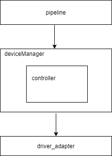

Key APIs that need to be implemented in DeviceManager:

```
      class SensorController : public IController {
      public:
          SensorController();
          explicit SensorController(std::string hardwareName);
          virtual ~SensorController();
          RetCode Init();
          RetCode PowerUp();
          RetCode PowerDown();
          RetCode Configure(std::shared_ptr<CameraStandard::CameraMetadata> meta);
          RetCode Start(int buffCont, DeviceFormat& format);
          RetCode Stop();
          RetCode SendFrameBuffer(std::shared_ptr<FrameSpec> buffer);
          void SetNodeCallBack(const NodeBufferCb cb);
          void SetMetaDataCallBack(const MetaDataCb cb);
          void BufferCallback(std::shared_ptr<FrameSpec> buffer);
          void SetAbilityMetaDataTag(std::vector<int32_t> abilityMetaDataTag);
    } 
```

   **PowerUp** is used for power-on. You can call this API to power on a device for OpenCamera.
   **PowerDown** is used for power-off. You can call this API to power off a device for CloseCamera.
   The **Configures** API is used to deliver metadata. If metadata parameters need to be set on hardware devices, this API can be used to parse and deliver metadata parameters.
   The **Start** API is used to enable the hardware module, and is called when each node in the pipeline is enabled. You can define the implementation as required. For example, the start operation of the sensor can be implemented here.
   **Stop** and **Start** are reverse operations. You can call **Stop** for a stop operation.
   **SendFrameBuffer** is an API for delivering the buffer of each frame. All buffer interaction operations with the driver are performed through this API.
   SetNodeCallBack is a pipeline. This API is used to set the buffer callback function to DeviceManager.
   SetMetaDataCallBack is a metadata callback. This API is used to report the metadata obtained from the bottom layer to the upper layer.
   BufferCallback is used to upload the filled data buffer of each frame. This API is used to report the buffer to the pipeline.
   **SetAbilityMetaDataTag** specifies the types of metadata to be obtained from the bottom layer. The framework can obtain information about one or more types of hardware devices separately. Therefore, you can use this API to obtain the required metadata.

  For details about other APIs, see **drivers/peripheral/camera/hal/adapter/platform/v4l2/src/device_manager/**.

#### IPP Adaptation  

The IPP is an algorithm plugin module in the pipeline. It is loaded by the ippnode to perform algorithm processing on stream data. The ippnode supports simultaneous input of multiple channels of data and output of only one channel of data. The algorithm plugin loaded by the ippnode is specified in the following .hcs file:
vendor/${product_company}/${product_name}/hdf_config/uhdf/camera/pipeline_core/ipp_algo_config.hcs

```
  root {
     module="sample";
     ipp_algo_config {
     algo1 {
          name = "example";
          description = "example algorithm";
          path = "libcamera_ipp_algo_example.z.so";
          mode = "IPP_ALGO_MODE_NORMAL";
     }
     }
  }

```

  **name**: algorithm plugin name.
  **description**: functions of the algorithm plugin.
  **path**: path of the algorithm plugin.
  **mode**: running mode of the algorithm plugin.  

The running modes of the algorithm plugin are provided by IppAlgoMode in **drivers/peripheral/camera/hal/pipeline_core/ipp/include/ipp_algo.h** and can be extended as required.

```
  enum IppAlgoMode {
      IPP_ALGO_MODE_BEGIN,
      IPP_ALGO_MODE_NORMAL = IPP_ALGO_MODE_BEGIN,
      IPP_ALGO_MODE_BEAUTY,
      IPP_ALGO_MODE_HDR,
      IPP_ALGO_MODE_END
  };
```

The algorithm plugin is compiled by the GN file **device/${product_company}/${device_name}/camera/BUILD.gn**. The algorithm plugin needs to implement the following APIs (specified by **ipp_algo.h**) for the ippnode to call:

      typedef struct IppAlgoFunc {
          int (*Init)(IppAlgoMeta* meta);
          int (*Start)();
          int (*Flush)();
          int (*Process)(IppAlgoBuffer* inBuffer[], int inBufferCount, IppAlgoBuffer* outBuffer, IppAlgoMeta* meta);
          int (*Stop)();
      } IppAlgoFunc;

  1) **Init**: initializes the algorithm plugin. It is called by the ippnode before the start operation. **IppAlgoMeta** is defined in **ipp_algo.h** to provide a channel for transferring non-image data between the ippnode and algorithm plugin, such as the current running scenario and face coordinates output after algorithm processing, which can be extended as required.
  2) **Start**: called by the ippnode for the start operation.
  3) **Flush**: refreshes data. This API is called by the ippnode before the stop operation. When this API is called, the algorithm plugin needs to stop processing as quickly as possible.
  4) **Process**: data processing API. Each frame of data is input to the algorithm plugin for processing through this API. **inBuffer** is a group of input buffers, **inBufferCount** is the number of input buffers, **outBuffer** is the output buffer, **meta** is the non-image data generated during algorithm processing, and **IppAlgoBuffer** is defined in **ipp_algo.h**.
  5) **Stop**: called by the ippnode for the stop operation.


```
typedef struct IppAlgoBuffer {
      void* addr;
      unsigned int width;
      unsigned int height;
      unsigned int stride;
      unsigned int size;
      int id;
  } IppAlgoBuffer;
```

In the preceding code, **id** indicates the ID of the port corresponding to the ippnode. For example, if the ID of **inBuffer[0]** is 0, **inBuffer[0]** corresponds to input port 0 of the ippnode. Note that **outBuffer** can be empty. In this case, one input buffer is transferred to the next node by the ippnode as the output buffer. At least one buffer in **inBuffer** is not empty. The input and output buffers are determined by the pipeline configuration.
For example, in the common preview scenario where there is no algorithm processing and only one channel of photographing data is transmitted to the ippnode, there is only one input buffer and the output buffer is empty. That is, the input buffer of the algorithm plugin is transparently transmitted.
For example, in the scenario where the algorithm plugin combines two channels of preview image data, the first channel of buffer needs to be previewed and sent for display. Copy the image of the second channel to the buffer of the first channel. In this case, there are two input buffers and the output buffer is empty.
For example, in the preview data format conversion scenario in the algorithm plugin, YUV data is converted into RGBA data. If there is only one YUV input buffer, the RGBA buffer cannot be output. In this case, a new buffer is required, and the output port buffer of the ippnode is transferred to the algorithm plugin as **outBuffer**. That is, there is only one input buffer and one output buffer.

For details about the port configuration of the ippnode, see the description of **config.hcs** in section 3.3.

#### V4L2 Driver Adaptation Instance     

This section describes how to adapt the RK3568 development board in the v4l2 framework.

 Distinguish the code related to the V4L2 platform and place it in the **drivers/peripheral/camera/hal/adapter/platform/v4l2** directory, which contains the **device_manager**, **driver_adapter**, and **pipeline_core** directories. The **driver_adapter** directory stores the code related to the v4l2 protocol. They can be used to interact with the v4l2 underlying driver. The **Pipeline_core** directory in this directory and the code in **drivers/peripheral/camera/hal/pipeline_core** form the pipeline framework. **v4l2_source_node** and **uvc_node** are dedicated nodes for v4l2. The **device_manager** directory stores the code for interaction between **device_manager** and **pipeline** and between the south and v4l2 adapter.

```
  drivers/peripheral/camera/hal/adapter/platform/v4l2/src/
  ├── device_manager
  │   ├── enumerator_manager.cpp
  │   ├── flash_controller.cpp
  │   ├── flash_manager.cpp
  │   ├── idevice_manager.cpp
  │   ├── include
  │   ├── isp_controller.cpp
  │   ├── isp_manager.cpp
  │   ├── sensor_controller.cpp
  │   ├── sensor_manager.cpp
  │   └── v4l2_device_manager.cpp
  ├── driver_adapter
  │   ├── BUILD.gn
  │   ├── include
  │   ├── main_test
  │   └── src
  └── pipeline_core
      └── nodes
```

 Distinguish the code related to the V4L2 chipset and place it in the **device/ ${product_company}/${device_name} /camera** directory. 

```
  ├── BUILD.gn
  ├── camera_demo
  │   └── project_camera_demo.h
  ├── include
  │   └── device_manager
  ├── product.gni
  └── src
      ├── device_manager
      ├── driver_adapter
      └── pipeline_core
```

The **driver_adapter** directory contains the header files of the test cases related to the RK3568 driver adapter. The **Camera_demo** directory stores the chipset-related header files of the demo test cases in the camera HAL. **device_manager** stores the code for the camera sensor adapted RK3568 to read device capabilities. In the directory, **project_hardware.h** is critical and stores the list of devices supporting the chipset. The sample code is as follows:

```
 namespace OHOS::Camera {
    std::vector<HardwareConfiguration> hardware = {
        {CAMERA_FIRST, DM_M_SENSOR, DM_C_SENSOR, (std::string) "rkisp_v5"},
        {CAMERA_FIRST, DM_M_ISP, DM_C_ISP, (std::string) "isp"},
        {CAMERA_FIRST, DM_M_FLASH, DM_C_FLASH, (std::string) "flash"},
        {CAMERA_SECOND, DM_M_SENSOR, DM_C_SENSOR, (std::string) "Imx600"},
        {CAMERA_SECOND, DM_M_ISP, DM_C_ISP, (std::string) "isp"},
        {CAMERA_SECOND, DM_M_FLASH, DM_C_FLASH, (std::string) "flash"}
   };
  } // namespace OHOS::Camera
```

You can modify compilation options so that the compilation of V4L2 and other framework code can be distinguished based on different compilation chipsets. Add **device/${product_company}/${device_name}/camera/product.gni**.

```
  camera_product_name_path = "//vendor/${product_company}/${product_name}"
  camera_device_name_path = "//device/board/${product_company}/${device_name}"
  is_support_v4l2 = true
  if (is_support_v4l2) {
      is_support_mpi = false
      defines += [ "SUPPORT_V4L2" ]
      chipset_build_deps = "$camera_device_name_path/camera/:chipset_build"
      camera_device_manager_deps =
          "$camera_device_name_path/camera/src/device_manager:camera_device_manager"
      camera_pipeline_core_deps =
          "$camera_device_name_path/camera/src/pipeline_core:camera_pipeline_core"
  }
```

When **product.gni** is loaded by **//drivers/peripheral/camera/hal/camera.gni**, the V4L2 code needs to be compiled. In **//drivers/peripheral/camera/hal/camera.gni**, load the corresponding GNI file based on **product_name** and **device_name** input during compilation.

  ```
    import("//build/ohos.gni")
    if ("${product_name}" == "ohos-arm64") {
      import(
          "//drivers/peripheral/camera/hal/adapter/chipset/rpi/rpi3/device/camera/product.gni")
    } else if ("${product_name}" == "Hi3516DV300") {
      import(
          "//device/soc/hisilicon/common/hal/media/camera/hi3516dv300/linux_standard/camera/product.gni")
  ```

 Different chipsets are compiled based on **chipset_build_deps**, **camera_device_manager_deps**, and **camera_pipeline_core_deps** in **drivers/peripheral/camera/hal/BUILD.gn**.

         print("product_name : , ${product_name}")
          group("camera_hal") {
            if (is_standard_system) {
              deps = [
                "$camera_path/../interfaces/hdi_ipc/client:libcamera_client",
                "buffer_manager:camera_buffer_manager",
                "device_manager:camera_device_manager",
                "hdi_impl:camera_hdi_impl",
                "init:ohos_camera_demo",
                "pipeline_core:camera_pipeline_core",
                "utils:camera_utils",
              ]
              deps += [ "${chipset_build_deps}" ]
            }


The camera HAL layer shields the differences between the platform and chip and provides unified APIs for external systems (camera service or test program). The APIs are defined in **drivers/peripheral/camera/interfaces/include**.

            ├── icamera_device_callback.h
            ├── icamera_device.h
            ├── icamera_host_callback.h
            ├── icamera_host.h
            ├── ioffline_stream_operator.h
            ├── istream_operator_callback.h
            ├── istream_operator.h

During the test, you only need to test the provided external APIs to test the complete code of the camera HAL layer. For details about the APIs, see **README_zh.md** in **drivers/peripheral/camera/interfaces** and header file API definition. For details about the API call process, see the test demo **drivers/peripheral/camera/hal/init**.

###  FAQs of Camera Adaptation

#### Modifying the SUBWINDOW_TYPE and Display Format

Change the RGBA888 display mode from **video** to **normal** (specified by **SUBWINDOW_TYPE**).

The OpenHarmony implements the camera of the Hi3516 platform earlier, which uses the PIXEL_FMT_YCRCB_420_SP format for display. However, the RK3568 needs to convert YUV420 preview streams into PIXEL_FMT_RGBA_8888 and send them to the screen for correct display. Modify the following content in the **foundation/ace/ace_engine/frameworks/core/components/camera/standard_system/camera.cpp** file. This file is compiled in **libace.z.so**.


      #ifdef PRODUCT_RK
          previewSurface_->SetUserData(SURFACE_FORMAT, std::to_string(PIXEL_FMT_RGBA_8888));
          previewSurface_->SetUserData(CameraStandard::CameraManager::surfaceFormat,
                                       std::to_string(OHOS_CAMERA_FORMAT_RGBA_8888));
      #else
          previewSurface_->SetUserData(SURFACE_FORMAT, std::to_string(PIXEL_FMT_YCRCB_420_SP));
          previewSurface_->SetUserData(CameraStandard::CameraManager::surfaceFormat,
                                       std::to_string(OHOS_CAMERA_FORMAT_YCRCB_420_SP));
      #endif

The following content in the **foundation/multimedia/camera_standard/services/camera_service/src/hstream_repeat.cpp** file is compiled in **libcamera_service.z.so**:   

```
void HStreamRepeat::SetStreamInfo(std::shared_ptr<Camera::StreamInfo> streamInfo)
    {
        int32_t pixelFormat;
        auto it = g_cameraToPixelFormat.find(format_);
        if (it != g_cameraToPixelFormat.end()) {
            pixelFormat = it->second;
        } else {
    #ifdef RK_CAMERA
            pixelFormat = PIXEL_FMT_RGBA_8888;
    #else
            pixelFormat = PIXEL_FMT_YCRCB_420_SP;
    #endif
```

In the preceding information, the Hi3516 platform uses the VO module driver to directly send display signals. Therefore, the subwindows mode configured in the ACE is **SUBWINDOW_TYPE_VIDEO**. Modify the **foundation/ace/ace_engine/frameworks/core/components/camera/standard_system/camera.cpp** file. This file is compiled in **libace.z.so**.

      #ifdef PRODUCT_RK
          option->SetWindowType(SUBWINDOW_TYPE_NORMAL);
      #else
          option->SetWindowType(SUBWINDOW_TYPE_VIDEO);
      #endif

#### Adding rk_codec_node

RGB conversion and H.264 and JPEG encoding and decoding are performed on this node. Each node in the pipeline model of the camera HAL is in camera data rotation. Currently, the camera HAL V4L2 adapter supports data rotation of only one stream. Therefore, the photographing and recording streams must be copied from a single preview stream. Currently, OpenHarmony does not have a dedicated server for codec and RGB conversion and JPEG compression. In this case, you can only create a dedicated node in the camera HAL, that is, **rk_codec_node**.
Add the **rk_codec_node** connection model to HCS.
Modify the **vendor/hihope/rk3568/hdf_config/uhdf/camera/pipeline_core/config.hcs** file.


              normal_preview_snapshot :: pipeline_spec {
                    name = "normal_preview_snapshot";
                    v4l2_source :: node_spec {
                        name = "v4l2_source#0";
                        status = "new";
                        out_port_0 :: port_spec {
                            name = "out0";
                            peer_port_name = "in0";
                            peer_port_node_name = "fork#0";
                            direction = 1;
                        }
                    }
                    fork :: node_spec {
                        name = "fork#0";
                        status = "new";
                        in_port_0 :: port_spec {
                            name = "in0";
                            peer_port_name = "out0";
                            peer_port_node_name = "v4l2_source#0";
                            direction = 0;
                        }
                        out_port_0 :: port_spec {
                            name = "out0";
                            peer_port_name = "in0";
                            peer_port_node_name = "RKCodec#0";
                            direction = 1;
                        }
                        out_port_1 :: port_spec {
                            name = "out1";
                            peer_port_name = "in0";
                            peer_port_node_name = "RKCodec#1";
                            direction = 1;
                        }
                    }
                    RKCodec_1 :: node_spec {
                        name = "RKCodec#0";
                        status = "new";
                        in_port_0 :: port_spec {
                            name = "in0";
                            peer_port_name = "out0";
                            peer_port_node_name = "fork#0";
                            direction = 0;
                        }
                        out_port_0 :: port_spec {
                            name = "out0";
                            peer_port_name = "in0";
                            peer_port_node_name = "sink#0";
                            direction = 1;
                        }
                    }
                    RKCodec_2 :: node_spec {
                        name = "RKCodec#1";


The preview and photographing streams are used as an example. **v4l2_source_node** is the data source and flows to **fork_node**. **rork_node** directly sends the preview data to the RKCodec node and copies the photographing data stream to the RKCodec node for conversion. The converted data is sent to the sink node and then to the consumer of the buffer.

Add the compilation of **rk_codec_node.cpp** and related dependent libraries to **device/board/hihope/rk3568/camera/src/pipeline_core/BUILD.gn**. **librga** is the library for converting YUV images into RGB images, **libmpp** is the library for encoding and decoding YUV images into H.264 images, and **libjpeg** is the library for compressing YUV images into JPEG images.


        ohos_shared_library("camera_pipeline_core") {
            sources = [
              "$camera_device_name_path/camera/src/pipeline_core/node/rk_codec_node.cpp",
              "$camera_path/adapter/platform/v4l2/src/pipeline_core/nodes/uvc_node/uvc_node.cpp",
                      "$camera_path/adapter/platform/v4l2/src/pipeline_core/nodes/v4l2_source_node/v4l2_source_node.cpp",
               deps = [
                "$camera_path/buffer_manager:camera_buffer_manager",
                "$camera_path/device_manager:camera_device_manager",
                "//device/soc/rockchip/hardware/mpp:libmpp",
                "//device/soc/rockchip/hardware/rga:librga",
                "//foundation/multimedia/camera_standard/frameworks/native/metadata:metadata",
                "//third_party/libjpeg:libjpeg_static",


 Main APIs of the **openharmony/device/board/hihope/rk3568/camera/src/pipeline_core/node/rk_codec_node.cpp** file:


       void RKCodecNode::DeliverBuffer(std::shared_ptr<IBuffer>& buffer)
        {
            if (buffer == nullptr) {
                CAMERA_LOGE("RKCodecNode::DeliverBuffer frameSpec is null");
                return;
            }
        
            int32_t id = buffer->GetStreamId();
            CAMERA_LOGE("RKCodecNode::DeliverBuffer StreamId %{public}d", id);
            if (buffer->GetEncodeType() == ENCODE_TYPE_JPEG) {
                Yuv420ToJpeg(buffer);
            } else if (buffer->GetEncodeType() == ENCODE_TYPE_H264) {
                Yuv420ToH264(buffer);
            } else {
                Yuv420ToRGBA8888(buffer);
            }

The data stream generated by **fork_node** is delivered to the **DeliverBuffer** API of the rk_codec_node. The API performs conversion based on the value of **EncodeType**. The converted buffers are delivered to the next-level node for processing until they are delivered to the buffer consumer.

####  Inconsistent H.264 Frame and Audio Timestamps

Issue: When creating a recorder, ACE obtains both audio and video data and combines them into an .mp4 file. However, during the actual synthesis, the timestamps in the audio and video information must be consistent. If they are inconsistent, the Recorder fails. After the recording button is clicked in the camera app, the recording cannot be stopped properly. After the recording is forcibly stopped, the MP4 file is empty.

Solution: Find the method of obtaining the audio timestamp of the audio module.

```
   int32_t AudioCaptureAsImpl::GetSegmentInfo(uint64_t &start)
    {
        CHECK_AND_RETURN_RET(audioCapturer_ != nullptr, MSERR_INVALID_OPERATION);
        AudioStandard::Timestamp timeStamp;
        auto timestampBase = AudioStandard::Timestamp::Timestampbase::MONOTONIC;
        CHECK_AND_RETURN_RET(audioCapturer_->GetAudioTime(timeStamp, timestampBase), MSERR_UNKNOWN);
        CHECK_AND_RETURN_RET(timeStamp.time.tv_nsec >= 0 && timeStamp.time.tv_sec >= 0, MSERR_UNKNOWN);
        if (((UINT64_MAX - timeStamp.time.tv_nsec) / SEC_TO_NANOSECOND) <= static_cast<uint64_t>(timeStamp.time.tv_sec)) {
            MEDIA_LOGW("audio frame pts too long, this shouldn't happen");
        }
        start = timeStamp.time.tv_nsec + timeStamp.time.tv_sec * SEC_TO_NANOSECOND;
        MEDIA_LOGI("timestamp from audioCapturer: %{public}" PRIu64 "", start);
        return MSERR_OK;
    }
```

In the **audio_capture_as_impl.cpp** file, and the camera module uses **CLOCK_REALTIME**, that is, the actual system time.


                mppStatus_ = 1;
                buf_size = ((MpiEncTestData *)halCtx_)->frame_size;
        
                ret = hal_mpp_encode(halCtx_, dma_fd, (unsigned char *)buffer->GetVirAddress(), &buf_size);
                SearchIFps((unsigned char *)buffer->GetVirAddress(), buf_size, buffer);
        
                buffer->SetEsFrameSize(buf_size);
                clock_gettime(CLOCK_MONOTONIC, &ts);
                timestamp = ts.tv_nsec + ts.tv_sec * TIME_CONVERSION_NS_S;
                buffer->SetEsTimestamp(timestamp);
                CAMERA_LOGI("RKCodecNode::Yuv420ToH264 video capture on\n");

 Solution: Change the time type in **rk_codec_node.cpp** of camera HAL to **CLOCK_MONOTONIC**.

####  Linux 4.19 Match Error After the Value of time_t Is Changed to 64-Bit

Background: When RK3568 encounters this problem, the upper-layer 32-bit system is running, and the bottom-layer kernel is 64-bit kernel of Linux 4.19. In a 32-bit system environment, the value of **time_t** is of the long type, that is, 32-bit. However, after the value of **time_t** is changed to the 64-bit, an error is reported by camera V4l2 in the IOCTL.

      TYPEDEF _Int64 time_t;
      TYPEDEF _Int64 suseconds_t;    

  The specific error and temporary solution are as follows:

  1. When an error occurs, search for **camera_host** in Hilog. It is found that a **Not a tty** error is reported when the **VIDIOC_QUERYBUF** CMD is delivered in the **V4L2AllocBuffer** API. The sample code is as follows:

```
V4L2AllocBuffer error:ioctl VIDIOC_QUERYBUF failed: Not a tty

```

    RetCode HosV4L2Buffers::V4L2AllocBuffer(int fd, const std::shared_ptr<FrameSpec>& frameSpec)
    {
        struct v4l2_buffer buf = {};
        struct v4l2_plane planes[1] = {};
        CAMERA_LOGD("V4L2AllocBuffer\n");
    
        if (frameSpec == nullptr) {
            CAMERA_LOGE("V4L2AllocBuffer frameSpec is NULL\n");
            return RC_ERROR;
        }
    
        switch (memoryType_) {
            case V4L2_MEMORY_MMAP:
                // to do something
                break;
            case V4L2_MEMORY_USERPTR:
                buf.type = bufferType_;
                buf.memory = memoryType_;
                buf.index = (uint32_t)frameSpec->buffer_->GetIndex();
    
                if (bufferType_ == V4L2_BUF_TYPE_VIDEO_CAPTURE_MPLANE) {
                    buf.m.planes = planes;
                    buf.length = 1;
                }
                CAMERA_LOGD("V4L2_MEMORY_USERPTR Print the cnt: %{public}d\n", buf.index);
    
                if (ioctl(fd, VIDIOC_QUERYBUF, &buf) < 0) {
                    CAMERA_LOGE("error: ioctl VIDIOC_QUERYBUF failed: %{public}s\n", strerror(errno));
                    return RC_ERROR;
 2. Generally, the CMD called by the IOCTL system uses **sizeof** of the third parameter as the CMD value and transfers the value to the kernel to search for the corresponding switch case in the kernel. As shown below, **v4l2_buffer** is the main part of the **VIDIOC_QUERYBUF** macro value. If the size of **v4l2_buffer** changes, the value of **VIDIOC_QUERYBUF** also changes accordingly.

```
  #define VIDIOC_S_FMT        _IOWR('V',  5, struct v4l2_format)
  #define VIDIOC_REQBUFS      _IOWR('V',  8, struct v4l2_requestbuffers)
  #define VIDIOC_QUERYBUF     _IOWR('V',  9, struct v4l2_buffer)
  #define VIDIOC_G_FBUF        _IOR('V', 10, struct v4l2_framebuffer)
```

  3. When the **CONFIG_COMPAT** macro is enabled in the kernel, the 32-bit system is compatible with the 64-bit kernel. For the IOCTL delivered by the 32-bit system, the API in the following is used to convert the CMD value from 32-bit to 64-bit.

      long v4l2_compat_ioctl32(struct file *file, unsigned int cmd, unsigned long arg)
      {
          struct video_device *vdev = video_devdata(file);
          long ret = -ENOIOCTLCMD;
      
          if (!file->f_op->unlocked_ioctl)
              return ret;
          
          if (_IOC_TYPE(cmd) == 'V' && _IOC_NR(cmd) < BASE_VIDIOC_PRIVATE)
              ret = do_video_ioctl(file, cmd, arg);
          else if (vdev->fops->compat_ioctl32)
              ret = vdev->fops->compat_ioctl32(file, cmd, arg);

 4. In this case, a value of **VIDIOC_QUERYBUF** considered by the kernel is defined in the kernel.

        #define VIDIOC_S_FMT32      _IOWR('V',  5, struct v4l2_format32)
        #define VIDIOC_QUERYBUF32   _IOWR('V',  9, struct v4l2_buffer32)
        #define VIDIOC_QUERYBUF32_TIME32 _IOWR('V',  9, struct v4l2_buffer32_time32)
5. As mentioned above, the value of **time_t** in the upper-layer MUSL has been changed from 32-bit to 64-bit, and **time_t** is used in struct timeval in the v4l2_buffer structure. In this case, the size of v4l2_buffer at the application layer is different from that at the kernel layer because **kernel_time_t** defined by the kernel in **time.h** is used during compilation in struct timeval of the kernel. As a result, the **sizeof** calculation of v4l2_buffer at the application layer is inconsistent with that at the driver layer, and CMD error cannot be found after the kernel mode is called.

```
   struct v4l2_buffer {
            __u32           index;
             __u32           type;
            __u32           bytesused;
            __u32           flags;
            __u32           field;
            struct timeval      timestamp;
            struct v4l2_timecode    timecode;
            __u32           sequence;
```
6. The temporary solution is to change struct timeval in **videodev2.h** to a temporarily defined structure to ensure that the sizes of the upper and lower layers are the same. The sample code is as follows:

```
            struct timeval1 {
                long tv_sec;
                long tv_usec;
            }
            struct v4l2_buffer {
                __u32           index;
                __u32           type;
                __u32           bytesused;
                __u32           flags;
                __u32           field;
                struct timeval1      timestamp;
                struct v4l2_timecode    timecode;
```

 Solution:

 There are only two ways to completely solve this problem. 1. Upgrade the system to 64-bit to ensure that the size of the **time_t** variable in user mode is the same as that in kernel mode. 2. Upgrade the kernel to a version later than 5.10.
 This problem is solved in the **videodev2.h** file of kernel 5.10. As shown below, the 64-bit **time_t** value is considered during kernel compilation.   

```
struct v4l2_buffer {
            __u32           index;
            __u32           type;
            __u32           bytesused;
            __u32           flags;
            __u32           field;
        #ifdef __KERNEL__
            struct __kernel_v4l2_timeval timestamp;
        #else
            struct timeval      timestamp;
        #endif
            struct v4l2_timecode    timecode;
 }

 struct __kernel_v4l2_timeval {
      long long   ._sec;
  #if defined(__sparc__) && defined(__arch64__)
      int     tv_usec;
      int     __pad;
  #else
      long long   tv_usec;
  #endif
  };
```
####  H.264 Key Frame Obtaining and Reporting

 In addition to the encoded and decoded data, H.264 also needs to report the key frame information. So, how can we know whether a frame is a key frame? The information is required during MP4 encoding. You can determine a key frame as follows: Analyze the NALU header information. NALU type & 0x1f indicate the frame type. The NALU header starts with 0x00000001 or 0x000001.  This figure shows the frame types when **nal_unit_type** is set to different values. Pay attention to the IDR frame information when **nal_unit_type** is set to **5**.
         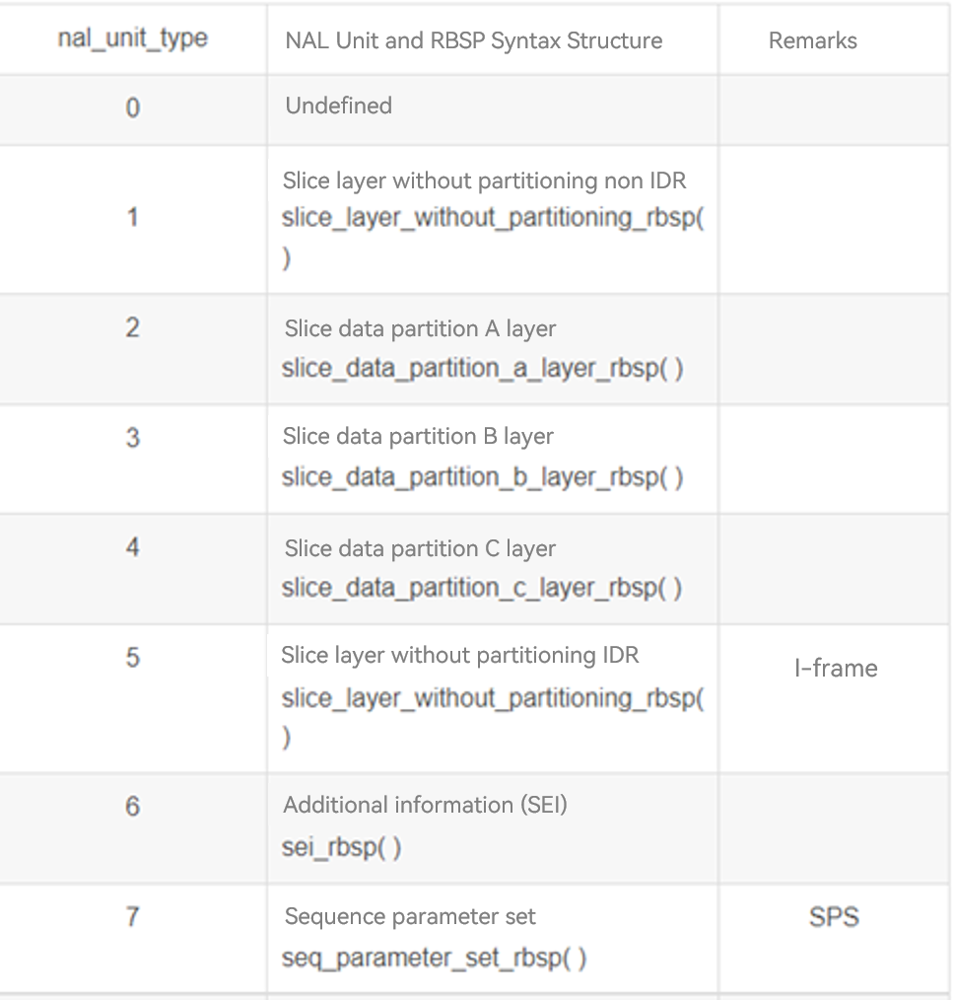


  IDR frame analysis is coded in the **rk_cedec_node.cpp** file.

        static constexpr uint32_t nalBit = 0x1F;
        #define NAL_TYPE(value)             ((value) & nalBit)
        void RKCodecNode::SearchIFps(unsigned char* buf, size_t bufSize, std::shared_ptr<IBuffer>& buffer)
        {
            size_t nalType = 0;
            size_t idx = 0;
            size_t size = bufSize;
            constexpr uint32_t nalTypeValue = 0x05;
        
            if (buffer == nullptr || buf == nullptr) {
                CAMERA_LOGI("RKCodecNode::SearchIFps parameter == nullptr");
                return;
            }
        
            for (int i = 0; i < bufSize; i++) {
                int ret = findStartCode(buf + idx, size);
                if (ret == -1) {
                    idx += 1;
                    size -= 1;
                } else {
                    nalType = NAL_TYPE(buf[idx + ret]);
                    CAMERA_LOGI("ForkNode::ForkBuffers nalu == 0x%{public}x buf == 0x%{public}x \n", nalType, buf[idx + ret]);

Each buffer converted by H.264 is transferred to the **SearchIFps** API to search for IDR frames. The **findStartCode()** API scans the content in the buffer byte by byte to find the NALU header.

  ```
     int RKCodecNode::findStartCode(unsigned char *data, size_t dataSz)
        {
            constexpr uint32_t dataSize = 4;
            constexpr uint32_t dataBit2 = 2;
            constexpr uint32_t dataBit3 = 3;
        
            if (data == nullptr) {
                CAMERA_LOGI("RKCodecNode::findStartCode parameter == nullptr");
                return -1;
            }
        
            if ((dataSz > dataSize) && (data[0] == 0) && (data[1] == 0) && \
                (data[dataBit2] == 0) && (data[dataBit3] == 1)) {
                return 4; // 4:start node
            }
        
            return -1;
        }
  ```
After the NALU header is found, **nal_unit_type** is found for &0x1F. If the value of **nal_unit_type** is **5**, key frame information is marked and reported through the **buffer->SetEsKeyFrame(1)** API.

##     TP 

### TP Driver Model

This model mainly defines and implements the following types of HDIs of the input module, allowing upper-layer input services to perform operations for the input devices:

- **Input Manager**: manages input devices, including enabling and disabling input devices and obtaining the device list.
- **Input Reporter**: reports input events, including registering and unregistering data reporting callbacks.
- **Input Controller**: controls input devices, including obtaining the device information and device type, and setting power supply status.

**Figure 1** HDI architecture of the input module

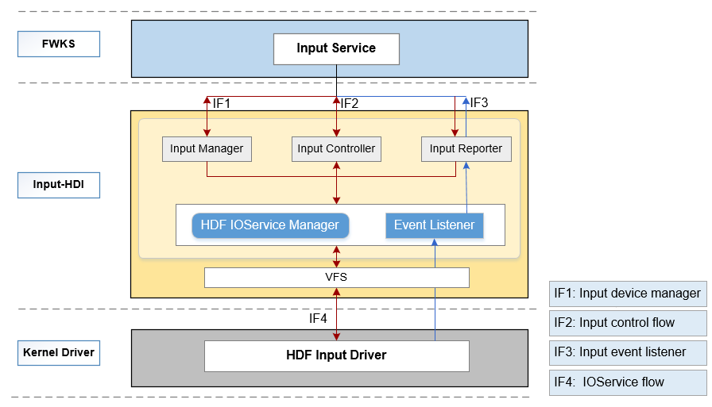

The source code directory structure is as follows:

```
/drivers/peripheral/input
├── hal                # HAL code
│   └── include       # HAL header files
│   └── src           # HAL code implementation
├── interfaces         # Driver capability APIs provided for upper-layer services
│   └── include       # APIs exposed externally
├── test               # Test code
│   └── unittest      # Unit test code
```

For details, see [README](https://gitee.com/openharmony/drivers_peripheral/blob/master/input/README_zh.md) of the input subsystem.

### TP HDF Driver Adaptation

#### Files and Directories Involved in the TP Driver

By default, the DAYU 200 platform supports the GT5688 TP IC.

Files and directories involved in porting the touch driver on the development board:

1. Makefile: drivers\adapter\khdf\linux\model\input\Makefile

2. vendor\hihope\rk3568\hdf_config\khdf\device_info\device_info.hcs

3. vendor\hihope\rk3568\hdf_config\khdf\input\input_config.hcs

4. drivers\framework\model\input\driver\touchscreen

The adaptation of the TP driver involves the TP driver and HCS configuration.

The adaptation of the TP driver depends on the HDF input model. The HDF input model supports device registration, management, data forwarding layer, and HCS parsing in TP, key, and HID scenarios. The input model of the HDF can be abstracted into three layers: driver management layer, common driver layer, and component driver layer.

The following figure shows the framework of the HDF input module from the perspective of functions. 

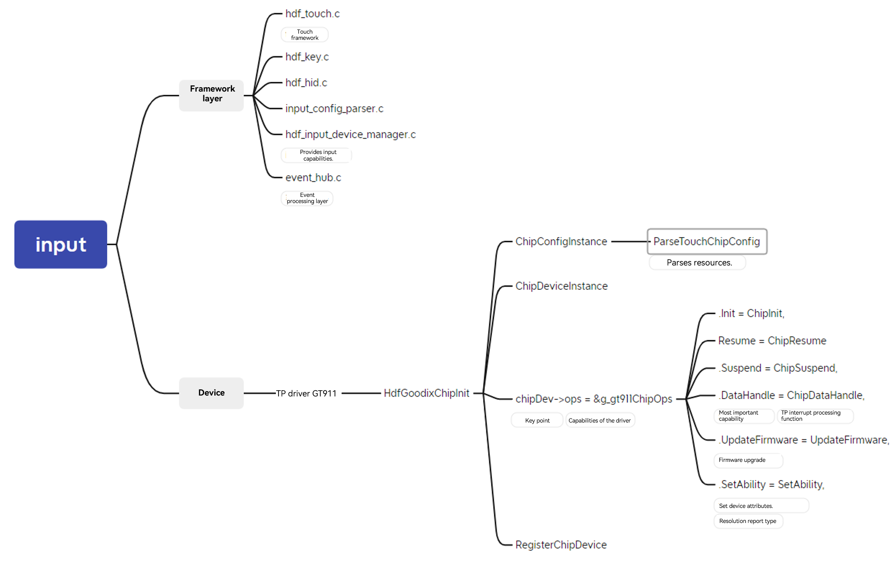

Due to the high abstraction and integration of the HDF input model, the adapted driver of the TP driver mainly involves the adaptation of the component driver layer.

Before adaptation, you need to determine the resources required by the TP.

For hardware resources, the TP module requires the following resources on the host:

1. Interrupt pin

2. Reset pin

3. Used I2C group and address of the slave device

4. TP initialization firmware (usually provided by IC vendors)

5. Touchscreen resolution

For software resources, TP adaptation on the HDF depends on the following HDF basic modules:

1. HDF GPIO subsystem: sets GPIO pins and interrupt resources.

2. HDF I2C subsystem: used for I2C communication.

3. Input model

The component driver is used based on the following structures:

```
static struct TouchChipOps g_gt911ChipOps = {
    .Init = ChipInit,
    .Detect = ChipDetect,
    .Resume = ChipResume,
    .Suspend = ChipSuspend,
    .DataHandle = ChipDataHandle,
    .UpdateFirmware = UpdateFirmware,
    .SetAbility = SetAbility,
};
```

**ChipInit** initializes the component driver.

**ChipDetect** checks the component validity after initialization.

**SetAbility** sets key attributes.

**ChipDataHandle** parses key values.

**UpdateFirmware** upgrades firmware.

**ChipSuspend** suspends components.

**ChipResume** resumes components.

Implement the preceding API callbacks based on the component features and register the structure with the input model.

#### HCS Configuration

Add a new component node to **device_info.hcs**.

```
device_touch_chip :: device {
                device0 :: deviceNode {
                    policy = 0;
                    priority = 180;
                    preload = 0; // The driver is loaded by default.
                    permission = 0660;
                    moduleName = "HDF_TOUCH_GT911";// The value must be the same as that in the component driver.
                    serviceName = "hdf_touch_gt911_service";
                    deviceMatchAttr = "zsj_gt911_5p5";
                }
            }
```

Add component features to **input_config.hcs**.

```
chipConfig {
                    template touchChip {
                        match_attr = "";
                        chipName = "gt911";
                        vendorName = "zsj";
                        chipInfo = "AAAA11222";  // 4-ProjectName, 2-TP IC, 3-TP Module
                        /* 0:i2c 1:spi*/
                        busType = 0;
                        deviceAddr = 0x5D;
                        /* 0:None 1:Rising 2:Failing 4:High-level 8:Low-level */
                        irqFlag = 2;
                        maxSpeed = 400;
                        chipVersion = 0; //parse Coord TypeA
                        powerSequence {
                            /* [type, status, dir , delay]
                                <type> 0:none 1:vcc-1.8v 2:vci-3.3v 3:reset 4:int
                                <status> 0:off or low  1:on or high  2:no ops
                                <dir> 0:input  1:output  2:no ops
                                <delay> meanings delay xms, 20: delay 20ms
                             */
                            powerOnSeq = [4, 0, 1, 5,
                                         3, 0, 1, 10,
                                         3, 1, 1, 60,
                                         4, 2, 0, 50];
                            suspendSeq = [3, 0, 2, 10];
                            resumeSeq = [3, 1, 2, 10];
                            powerOffSeq = [3, 0, 2, 10,
                                           1, 0, 2, 20];
                        }
                    }
```

## Display Adaptation

The following tasks need to be performed for display adaptation: graphics service HDI API adaptation, GPU adaptation, and LCD driver adaptation.

### Display HDI

[Display HDI](https://gitee.com/openharmony/drivers_peripheral/blob/master/display/README_zh.md) provides display driver capabilities for graphics services, including display layer management, display memory management, and hardware acceleration. Display HDI adaptation involves **gralloc** and **display_device**.

#### Gralloc Adaptation

The gralloc module provides the display memory management function. OpenHarmony provides the reference implementation of Hi3516D V300. Vendors can refer to and adapt the implementation based on the actual situation. The implementation is developed based on the DRM. [Source code link](https://gitee.com/openharmony/drivers_peripheral/tree/master/display/hal/default_standard)

The DRM device node is defined in the **//drivers_peripheral/display/hal/default_standard/srd/display_gralloc/display_gralloc_gbm.c** file. You can modify the file as required.

```
const char *g_drmFileNode = "/dev/dri/card0";
```

In this implementation, a HiSilicon private IOCTL command code **DRM_IOCTL_HISILICON_GEM_FD_TO_PHYADDR** is defined in the **//drivers_peripheral/display/hal/default_standard/src/display_gralloc/hisilicon_drm.h** file and called in the **//drivers_peripheral/display/hal/default_standard/src/display_gralloc/display_gralloc_gbm.c** file. This function is a HiSilicon private function and can be modified as required during adaptation.

```
...
    InitBufferHandle(bo, fd, info, priBuffer);
    priBuffer->hdl.phyAddr = GetPhysicalAddr(grallocManager->drmFd, fd);
    *buffer = &priBuffer->hdl;
...
```

####  Display Device Adaptation

The display device module provides functions such as display device management, layer management, and hardware acceleration.

OpenHarmony provides the [DRM-based Hi3516D V300 reference implementation](https://gitee.com/openharmony/drivers_peripheral/tree/master/display/hal/default_standard/src/display_device), which supports hardware composition by default.

If the development board does not support hardware composition, skip the initialization of the GFX in the **drm_display.cpp** file.

```
drivers_peripheral/blob/master/display/hal/default_standard/src/display_device/drm/drm_display.cpp
int32_t DrmDisplay::Init()
{
    ...
    ...
    ret = HdiDisplay::Init();
    DISPLAY_CHK_RETURN((ret != DISPLAY_SUCCESS), DISPLAY_FAILURE, DISPLAY_LOGE("init failed"));
    auto preComp = std::make_unique<HdiGfxComposition>();
    DISPLAY_CHK_RETURN((preComp == nullptr), DISPLAY_FAILURE,
        DISPLAY_LOGE("can not new HdiGfxComposition errno %{public}d", errno));
    ret = preComp->Init();                                                                                          // GFX initialization, which needs to be skipped.
    DISPLAY_CHK_RETURN((ret != DISPLAY_SUCCESS), DISPLAY_FAILURE, DISPLAY_LOGE("can not init HdiGfxComposition"));  // Or do not check the return value.

    ...
}
```

In addition, modify the **set_layers** method in the **//drivers_peripheral/display/hal/default_standard/src/display_device/hdi_gfx_composition.cpp** file to use the CPU composition display.

```
int32_t HdiGfxComposition::SetLayers(std::vector<HdiLayer *> &layers, HdiLayer &clientLayer)
{
    DISPLAY_LOGD("layers size %{public}zd", layers.size());
    mClientLayer = &clientLayer;
    mCompLayers.clear();
    for (auto &layer : layers) {
        if (CanHandle(*layer)) {
#if 0                                      // CPU composition.
            layer->SetDeviceSelect(COMPOSITION_CLIENT);
#else
            if ((layer->GetCompositionType() != COMPOSITION_VIDEO) &&
                (layer->GetCompositionType() != COMPOSITION_CURSOR)) {
                layer->SetDeviceSelect(COMPOSITION_DEVICE);
            } else {
                layer->SetDeviceSelect(layer->GetCompositionType());
            }
#endif
            mCompLayers.push_back(layer);
        }
    }
    DISPLAY_LOGD("composer layers size %{public}zd", mCompLayers.size());
    return DISPLAY_SUCCESS;
}
```

#### Test and Verification

hello_composer test module: It is a test program provided by the Rosen graphics framework and checks whether the functions such as the display process and HDI API are normal. By default, the module is compiled with the system.

Code path:

```
foundation/graphic/graphic/rosen/samples/composer/
├── BUILD.gn
├── hello_composer.cpp
├── hello_composer.h
├── layer_context.cpp
├── layer_context.h
└── main.cpp
```

The verification is as follows:

1. Disable the render service.

  ```
  service_control stop render_service
  ```

2. Disable the foundation process.

  ```
  service_control stop foundation
  ```

3. Run **hello_composer** to test related APIs.

   ```
   ./hello_composer
   ```

Test using devicetest: test module provided by the HDI display module. It is used to test the HDI API, display buffer, and driver capabilities. During the test, the render service and foundation processes also need to be stopped.

Code path: **/drivers/peripheral/display/test/unittest/standard**

```
├── BUILD.gn
├── common
│   ├── display_test.h
│   ├── display_test_utils.cpp
│   └── display_test_utils.h
├── display_device
│   ├── hdi_composition_check.cpp
│   ├── hdi_composition_check.h
│   ├── hdi_device_test.cpp
│   ├── hdi_device_test.h
│   ├── hdi_test_device_common.h
│   ├── hdi_test_device.cpp
│   ├── hdi_test_device.h
│   ├── hdi_test_display.cpp
│   ├── hdi_test_display.h
│   ├── hdi_test_layer.cpp
│   ├── hdi_test_layer.h
│   ├── hdi_test_render_utils.cpp
│   └── hdi_test_render_utils.h
└── display_gralloc
    ├── display_gralloc_test.cpp
    └── display_gralloc_test.h
```

### GPU

Compiler Clang

```
prebuilts/clang/ohos/linux-x86_64/llvm
```

musl Library

```
./build.sh --product-name rk3568 --build-target musl_all 
```

After the compilation is complete, the following header files and libraries are generated in the **out/{product_name}/obj/third_party/musl/usr/lib** directory:

```
32-bit: arm-linux-ohos

64-bit: aarch64-linux-ohos
```

Source code directory:

```
third_party/musl
```

GPU compilation parameter reference:

```
TARGET_CFLAGS=" -march=armv7-a -mfloat-abi=softfp -mtune=generic-armv7-a -mfpu=neon -mthumb --target=arm-linux-ohosmusl -fPIC -ftls-model=global-dynamic -mtls-direct-seg-refs -DUSE_MUSL"
```

## LCD

By default, the DAYU 200 platform supports an LCD screen with the MIPI API.

LCD adaptation mainly depends on the HDF display model. The display driver model is developed based on the HDF driver framework, platform API, and OSAL API. It can shield the differences between different kernel forms (LiteOS and Linux), apply to different chip platforms, and provide a unified driver platform for display components.

The following figure shows the hierarchy of the HDF display driver model.

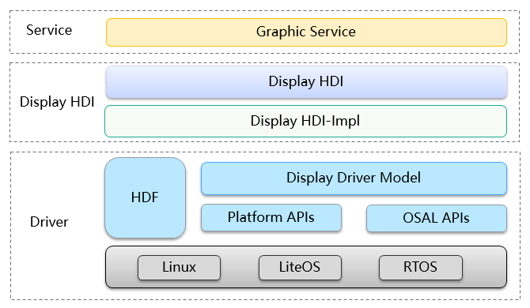

The current driver model is mainly deployed in kernel mode and connects to the display common HAL layer to assist HDI implementation. The display driver exposes the display driver capability to the graphics service through the display-HDI layer. The display driver connects to the display panel component downwards to drive the screen to work properly and streamlines the entire display process.

Therefore, the LCD adaptation mainly lies in the adaptation of the LCD panel component driver.

The adaptation of the component driver consists of two parts: panel driver and HCS configuration.

The following files are involved:

```
drivers/framework/model/display/driver/panel

vendor/hihope/rk3568/hdf_config/khdf/device_info

vendor/hihope/rk3568/hdf_config/khdf/input
```

### Panel Driver

The component driver is used based on the following APIs:

```
struct PanelData {
    struct HdfDeviceObject *object;
    int32_t (*init)(struct PanelData *panel);
    int32_t (*on)(struct PanelData *panel);
    int32_t (*off)(struct PanelData *panel);
    int32_t (*prepare)(struct PanelData *panel);
    int32_t (*unprepare)(struct PanelData *panel);
    struct PanelInfo *info;
    enum PowerStatus powerStatus;
    struct PanelEsd *esd;
    struct BacklightDev *blDev;
    void *priv;
};
```

Instantiate the data structure in the initialization API of the driver.

    panelSimpleDev->panel.init = PanelSimpleInit;
    panelSimpleDev->panel.on = PanelSimpleOn;
    panelSimpleDev->panel.off = PanelSimpleOff;
    panelSimpleDev->panel.prepare = PanelSimplePrepare;
    panelSimpleDev->panel.unprepare = PanelSimpleUnprepare;
PanelSimpleInit initializes panel software.

PanelSimpleOn turns on the screen.

PanelSimpleOff turns off the screen.

PanelSimplePrepare initializes the hardware time sequence for turning on the screen.

PanelSimpleUnprepare initializes the hardware time sequence for turning off the screen.

After instantiation, use the **RegisterPanel** API to register the panel driver with the display model.

Note that the LCD on DAYU 200 uses the DRM display framework.

### HCS Configuration

```
device4 :: deviceNode {
                    policy = 0;
                    priority = 100;
                    preload = 0;
                    moduleName = "LCD_PANEL_SIMPLE";
                }
```

## Backlight

The backlight driver model is developed based on the HDF framework.

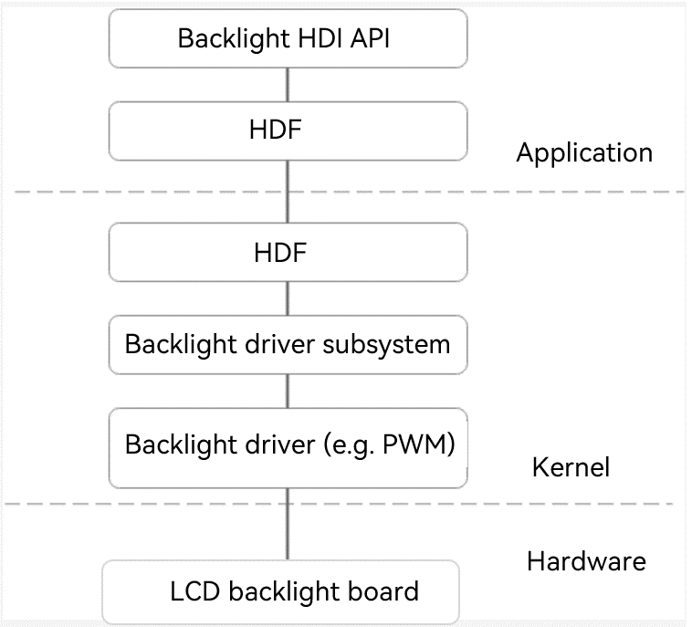

The RK3568 backlight is implemented by controlling the duty cycle by using PWM4.

Code path of the native backlight driver:

```c
linux-5.10/drivers/video/backlight/pwm_bl.c
linux-5.10/drivers/video/backlight/backlight.c
linux-5.10/drivers/pwm/pwm-rockchip.c
```

To use the backlight driver on the HDF framework, disable the native driver.

```c
# CONFIG_BACKLIGHT_PWM is not set
```

### HDF Implementation

Code Path

```c
drivers/framework/model/display/driver/backlight/hdf_bl.c
```

HDF BL Entry Function

```c
static int32_t BacklightInit(struct HdfDeviceObject *object)
{
    if (object == NULL) {
        HDF_LOGE("%s: object is null!", __func__);
        return HDF_FAILURE;
    }
    HDF_LOGI("%s success", __func__);
    return HDF_SUCCESS;
}

struct HdfDriverEntry g_blDevEntry = {
    .moduleVersion = 1,
    .moduleName = "HDF_BL",
    .Init = BacklightInit,
    .Bind = BacklightBind,
};

HDF_INIT(g_blDevEntry);
```

Code path:

```c
drivers/framework/model/display/driver/backlight/pwm_bl.c
```

HDF PWM Entry Function

```c
struct HdfDriverEntry g_pwmBlDevEntry = {
    .moduleVersion = 1,
    .moduleName = "PWM_BL",
    .Init = BlPwmEntryInit,
};

HDF_INIT(g_pwmBlDevEntry);
```

The backlight control APIs are as follows:

```c
static int32_t BlPwmUpdateBrightness(struct BacklightDev *blDev, uint32_t brightness)
{
    int32_t ret;
    uint32_t duty;
    struct BlPwmDev *blPwmDev = NULL;

    blPwmDev = ToBlDevPriv(blDev);
    if (blPwmDev == NULL) {
        HDF_LOGE("%s blPwmDev is null", __func__);
        return HDF_FAILURE;
    }
    if (blPwmDev->props.maxBrightness == 0) {
        HDF_LOGE("%s maxBrightness is 0", __func__);
        return HDF_FAILURE;
    }
    if (brightness == 0) {
        return PwmDisable(blPwmDev->pwmHandle);
    }
    duty = (brightness * blPwmDev->config.period) / blPwmDev->props.maxBrightness;
    ret = PwmSetDuty(blPwmDev->pwmHandle, duty);
    if (ret != HDF_SUCCESS) {
        HDF_LOGE("%s: PwmSetDuty failed, ret %d", __func__, ret);
        return HDF_FAILURE;
    }
    return PwmEnable(blPwmDev->pwmHandle);
}

static struct BacklightOps g_blDevOps = {
    .updateBrightness = BlPwmUpdateBrightness,
};
```

Actually, the API implemented by the HDF PWM is used to connect to the kernel PWM.

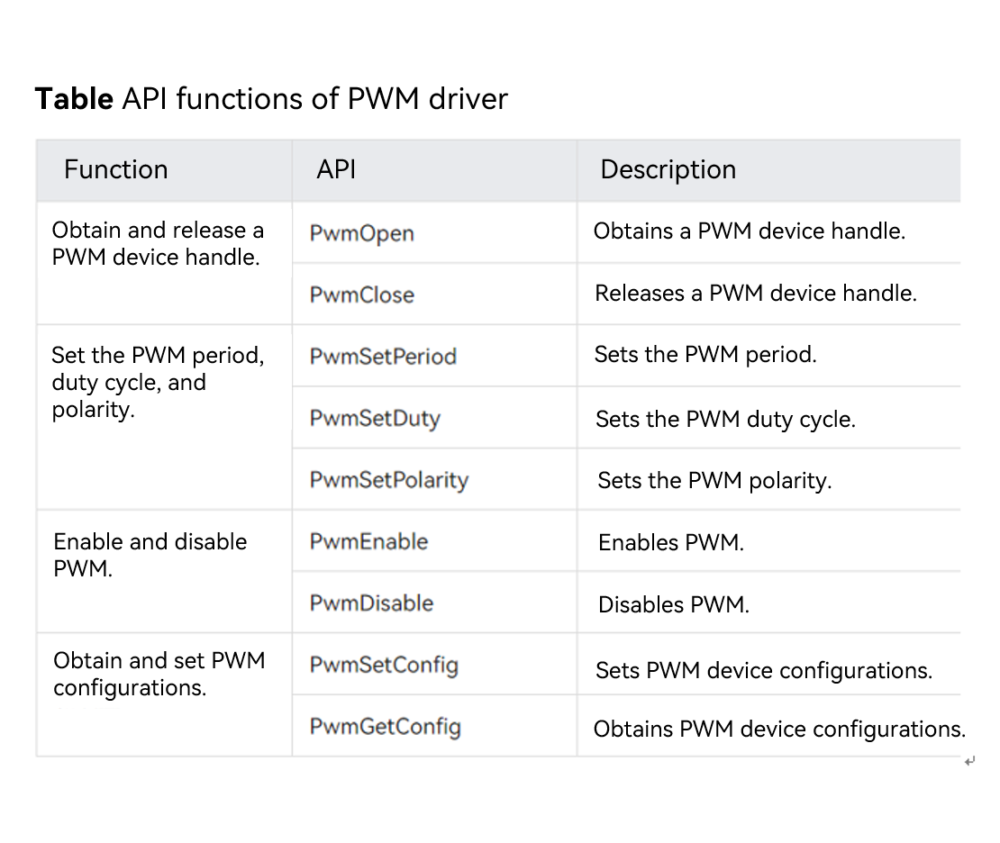

Register the backlight with the LCD HDF driver.

Code Path

```c
drivers/framework/model/display/driver/panel/ili9881c_boe.c
```

```c
ili9881cBoeDev->panel.blDev = GetBacklightDev("hdf_pwm");
if (ili9881cBoeDev->panel.blDev == NULL) {
    HDF_LOGE("%s GetBacklightDev fail", __func__);
    goto FAIL;
}
```

### HCS Configuration

HCS configuration of the driver

```c
device_pwm_bl :: device {
    device0 :: deviceNode {
        policy = 0;
        priority = 95;
        preload = 0;
        moduleName = "PWM_BL";
        deviceMatchAttr = "pwm_bl_dev";
    }
}
device_backlight :: device {
    device0 :: deviceNode {
        policy = 2;
        priority = 90;
        preload = 0;
        permission = 0660;
        moduleName = "HDF_BL";
        serviceName = "hdf_bl";
    }
}
```

HCS configuration for PWM backlight

```c
root {
    backlightConfig {
        pwmBacklightConfig {
            match_attr = "pwm_bl_dev";
            pwmDevNum = 1;
            pwmMaxPeriod = 25000;
            backlightDevName = "hdf_pwm";
            minBrightness = 0;
            defBrightness = 127;
            maxBrightness = 255;
        }
    }
}
```

### Testing

Run **cat /sys/kernel/debug/pwm** to check whether the HDF PWM has applied for PWM4.

If the application is successful, the following information is displayed:

**requested**: The application is successful.

**enabled**: PWM4 is enabled successfully.

```c
# cat /sys/kernel/debug/pwm

platform/fe6e0000.pwm, 1 PWM device
 pwm-0   ((null)              ): requested enabled period: 25000 ns duty: 9705 ns polarity: normal
```

## **Wi-Fi**

### HDF-based Wi-Fi Approach

Get familiar with the HDF Wi-Fi framework and main APIs to be implemented by referring to [OpenHarmony HDF Wi-Fi Driver Analysis](https://mp.weixin.qq.com/s/iiE97pqPtzWIZadcjrQtsw), including the implementation of the HDF driver initialization API, Wi-Fi control-side API set, AP mode API set, STA mode API set, network-side API set, and event reporting API.

Next, let's get familiar with the HCS file format and the code startup initialization process of the HDF Wi-Fi core driver framework. For details, see the Hi3881 code.

HDF Wi-Fi framework

​                       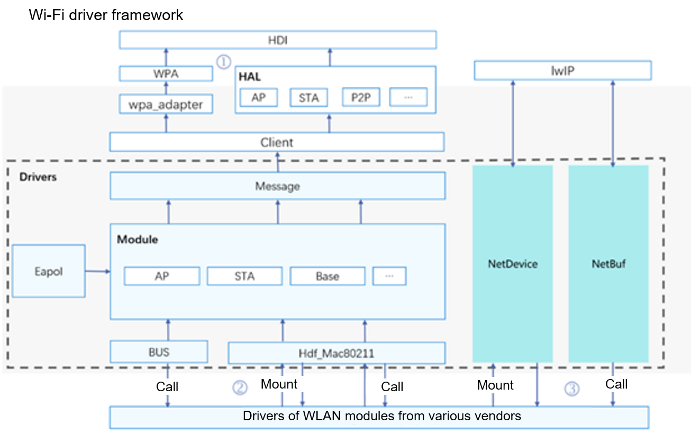        

### Code Process Analysis of the AP6275s Driver

####  Analysis of the Driver Module Initialization Process

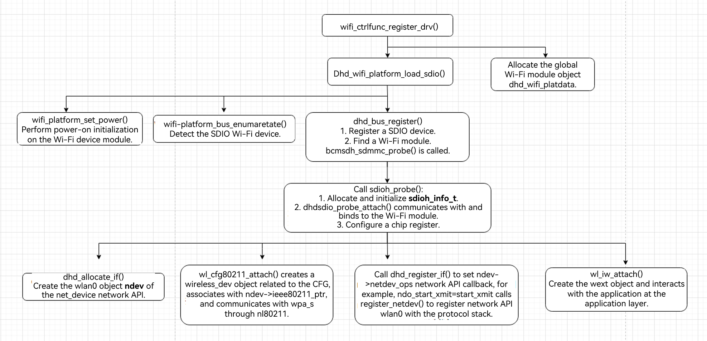

The AP6275s is a Wi-Fi module driver of the SDIO device. It uses the standard Linux SDIO device driver. The kernel module initialization entry **module_init()** calls the **dhd_wifi_platform_load_sdio()** function for initialization. Here, **wifi_platform_set_power()** is called to power on the GPIO, **dhd_wlan_set_carddetect()** is called to detect the SDIO card, and **sdio_register_driver(&bcmsdh_sdmmc_driver)** is called to register the SDIO device driver. The SDIO bus has detected that the Wi-Fi module matches the device driver based on the device ID and vendor ID. Therefore, the **bcmsdh_sdmmc_probe()** function of the driver is called back immediately to initialize the Wi-Fi module chip. Finally, create the net_device network API wlan0 and register it with the Linux kernel protocol stack.

l Create the wlan0 object of the net_device network API.

**dhd_allocate_if()** calls **alloc_etherdev()** to create a **net_device** object, that is, the wlan0 network API.

l Register wlan0 with the kernel protocol stack.

Call the **dhd_register_if()** function. Here, call **register_netdev(net)** to register the wlan0 network API with the protocol stack.

### HDF Wi-Fi Framework Adaptation Through Code Modification

To use the Wi-Fi function of the system, the AP mode, STA mode, and P2P mode need to be implemented. The **wpa_supplicant** application interacts with the Wi-Fi driver through the HDF Wi-Fi framework to implement the STA mode and P2P mode, and the **hostapd** application interacts with the Wi-Fi driver through the HDF Wi-Fi framework to implement the AP mode and P2P mode.

The AP6275s Wi-Fi 6 kernel driver depends on the platform capability, including the SDIO bus communication capability. The communication with the user mode depends on the HDF Wi-Fi framework capability. After ensuring that the preceding capabilities are normal, you can start the HDF adaptation and porting of the Wi-Fi driver. This part uses the open-source RK3568 code as the basic version for porting.

The files and directories involved in the adaptation and porting of the AP6275s Wi-Fi 6 driver are as follows:

1). Compile configuration files.

drivers/adapter/khdf/linux/model/network/wifi/Kconfig

drivers/adapter/khdf/linux/model/network/wifi/vendor/Makefile

2). Access the Wi-Fi driver source code directory.

The native driver code is stored in:

linux-5.10/drivers/net/wireless/rockchip_wlan/rkwifi/bcmdhd_wifi6/

The code files added and modified on the native driver are stored in the following directory:

device/hihope/rk3568/wifi/bcmdhd_wifi6/

Directory structure:

```
./device/hihope/rk3568/wifi/bcmdhd_wifi6/hdf
├── hdf_bdh_mac80211.c
├── hdf_driver_bdh_register.c
├── hdfinit_bdh.c    
├── hdf_mac80211_ap.c    
├── hdf_mac80211_sta.c          
├── hdf_mac80211_sta.h     
├── hdf_mac80211_sta_event.c     
├── hdf_mac80211_sta_event.h
├── hdf_mac80211_p2p.c
├── hdf_public_ap6275s.h
├── net_bdh_adpater.c  
├── net_bdh_adpater.h 
```

**hdf_bdh_mac80211.c** is used to fill in the functions required by **g_bdh6_baseOps**, **hdf_mac80211_ap.c** is used to fill in the functions required by **g_bdh6_staOps**, **hdf_mac80211_sta.c** is used to fill in the functions required by **g_bdh6_staOps**, and **hdf_mac80211_p2p.c** is used to fill in the functions required by **g_bdh6_p2pOps**. For details about the APIs required for basic Wi-Fi functions, see **openharmony/drivers/framework/include/wifi/wifi_mac80211_ops.h**.

####  Driver File Compilation

The HDF WLAN driver framework consists of seven parts: Module, NetDevice, NetBuf, BUS, HAL, Client, and Message. You can implement the following functions during HDF adaptation of the Wi-Fi driver:

1. Initialize the driver module that adapts the HDF WLAN framework.

   The following figure shows the code process.

   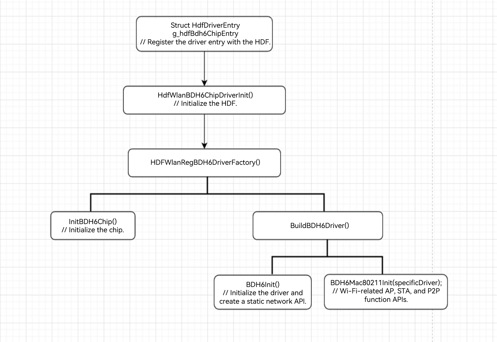

   The code is stored in **device/hihope/rk3568/wifi/bcmdhd_wifi6/hdf_driver_bdh_register.c**.

   ```
   struct HdfDriverEntry g_hdfBdh6ChipEntry = {
     .moduleVersion = 1,
     .Bind = HdfWlanBDH6DriverBind,
     .Init = HdfWlanBDH6ChipDriverInit,
     .Release = HdfWlanBDH6ChipRelease,
     .moduleName = "HDF_WLAN_CHIPS"
   };
   HDF_INIT(g_hdfBdh6ChipEntry);
   ```

   During driver initialization, the SDIO main control board scans and detects the card, initializes the Wi-Fi chip, and creates and initializes the main API.

2. Implement the HDF WLAN Base control-side APIs.

   The code is stored in **hdf_bdh_mac80211.c**.

   ```
      static struct HdfMac80211BaseOps g_bdh6_baseOps = {
     .SetMode = BDH6WalSetMode,
     .AddKey = BDH6WalAddKey,
     .DelKey = BDH6WalDelKey,
     .SetDefaultKey = BDH6WalSetDefaultKey,
     .GetDeviceMacAddr = BDH6WalGetDeviceMacAddr,
     .SetMacAddr = BDH6WalSetMacAddr,
     .SetTxPower = BDH6WalSetTxPower,
     .GetValidFreqsWithBand = BDH6WalGetValidFreqsWithBand,
     .GetHwCapability = BDH6WalGetHwCapability,
     .SendAction = BDH6WalSendAction,
     .GetIftype = BDH6WalGetIftype,
   };
   ```

   The preceding APIs are called in STA, AP, and P2P modes.

3. Implement APIs in HDF WLAN STA mode.

   The following figure shows the call process in STA mode.
   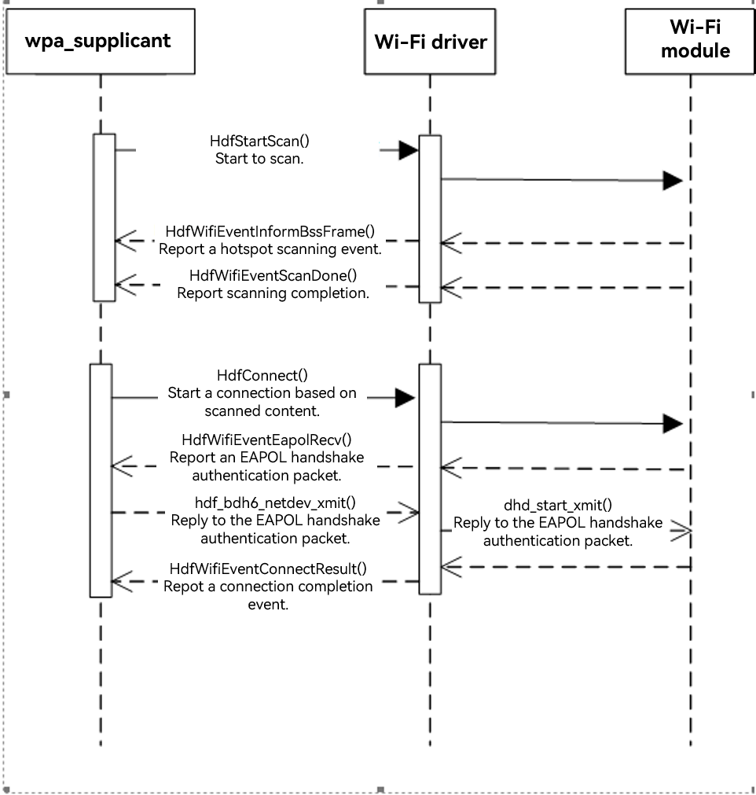         

   The code is stored in **hdf_mac80211_sta.c**.

   ```
   struct HdfMac80211STAOps g_bdh6_staOps = {
     .Connect = HdfConnect,
     .Disconnect = HdfDisconnect,
     .StartScan = HdfStartScan,
     .AbortScan = HdfAbortScan,
     .SetScanningMacAddress = HdfSetScanningMacAddress,
   };
   ```

4. Implement APIs in HDF WLAN AP mode.

   The following figure shows the call process in AP mode.

 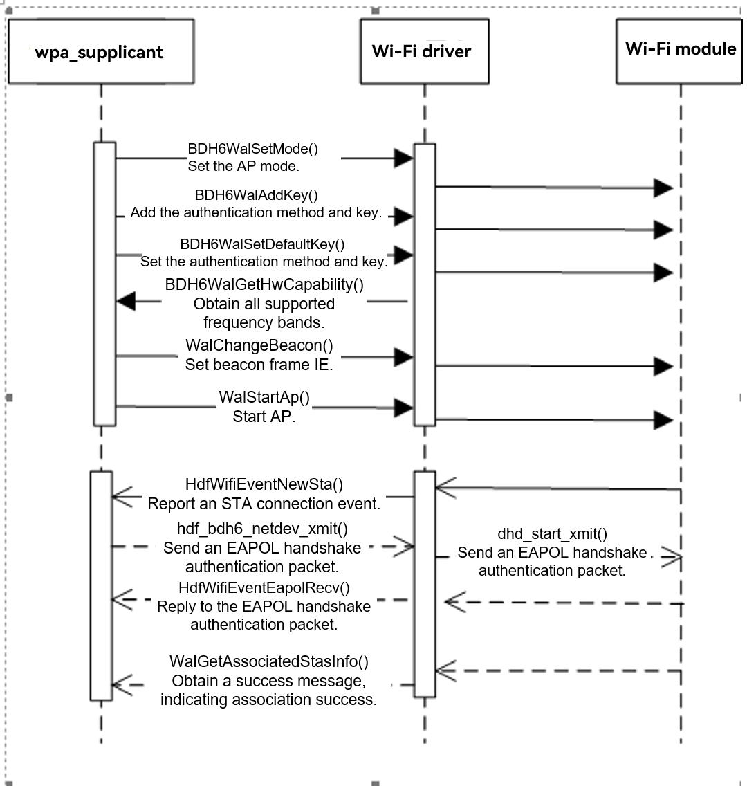

The code is stored in **hdf_mac80211_ap.c**.

```
struct HdfMac80211APOps g_bdh6_apOps = {
  .ConfigAp = WalConfigAp,
  .StartAp = WalStartAp,
  .StopAp = WalStopAp,
  .ConfigBeacon = WalChangeBeacon,
  .DelStation = WalDelStation,
  .SetCountryCode = WalSetCountryCode,
  .GetAssociatedStasCount = WalGetAssociatedStasCount,
  .GetAssociatedStasInfo = WalGetAssociatedStasInfo
};
```

5. Implement APIs in HDF WLAN P2P mode.

   The following figure shows the call process in P2P mode.

   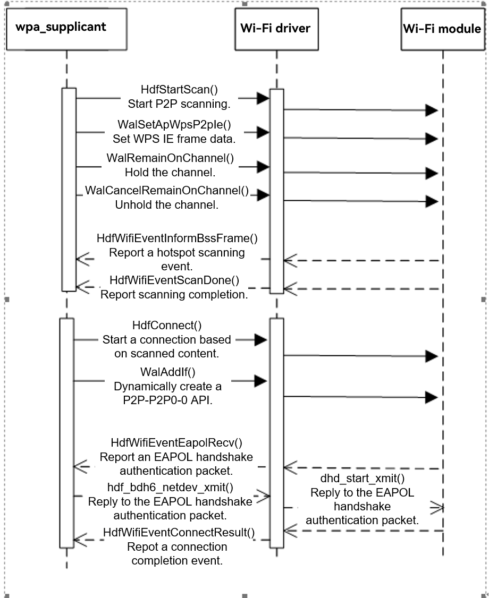

   ```
   struct HdfMac80211P2POps g_bdh6_p2pOps = {
     .RemainOnChannel = WalRemainOnChannel,
     .CancelRemainOnChannel = WalCancelRemainOnChannel,
     .ProbeReqReport = WalProbeReqReport,
     .AddIf = WalAddIf,
     .RemoveIf = WalRemoveIf,
     .SetApWpsP2pIe = WalSetApWpsP2pIe,
     .GetDriverFlag = WalGetDriverFlag,
   }; 
   ```

6. Implement the event reporting APIs of the HDF WLAN framework.

   The Wi-Fi driver needs to report events to the **wpa_supplicant** and **hostapd** applications, such as hotspot scanning results and association completion events of new STAs. For details about all APIs for reporting HDF WLAN events, see **drivers/framework/include/wifi/hdf_wifi_event.h**.

   The HDF WLAN APIs for reporting events are as follows.

| API in Header File hdf_wifi_event.h   | Description                |
| ----------------------------------- | ------------------------ |
| HdfWifiEventNewSta()                | Reports a new STA event.     |
| HdfWifiEventDelSta ()             | Reports an STA deletion event.     |
| HdfWifiEventInformBssFrame ()     | Reports a BSS scanning event.         |
| HdfWifiEventScanDone ()           | Reports a scanning completion event.        |
| HdfWifiEventConnectResult ()      | Reports a connection result event.        |
| HdfWifiEventDisconnected ()       | Reports a disconnection event.        |
| HdfWifiEventMgmtTxStatus ()       | Reports sending status events.        |
| HdfWifiEventRxMgmt ()             | Reports a receiving status event.        |
| HdfWifiEventCsaChannelSwitch ()   | Reports a CSA frequency band switching event.     |
| HdfWifiEventTimeoutDisconnected ()| Reports a connection timeout event.        |
| HdfWifiEventEapolRecv ()          | Reports an EAPOL receive event.       |
| HdfWifiEventResetResult ()        | Reports a WLAN driver reset result event.|
| HdfWifiEventRemainOnChannel ()    | Reports a channel holding event.        |
| HdfWifiEventCancelRemainOnChannel   | Reports a channel unholding event.    |

### Summary of All Key Issues

#### Method of Enabling the AP Mode During AP Module Debugging

Use the BusyBox and hostapd to configure the AP function as follows:

```
ifconfig wlan0 up
ifconfig wlan0 192.168.12.1 netmask 255.255.255.0
busybox udhcpd /data/udhcpd.conf
./hostapd -d /data/hostapd.conf
```

#### Method of Enabling the ATA Mode During STA Module Debugging

```
wpa_supplicant -iwlan0 -c /data/l2tool/wpa_supplicant.conf -d &
./busybox udhcpc -i wlan0 -s /data/l2tool/dhcpc.sh
```

#### Solution to the Failure to Report the Hotspot Scanning Event to wap_supplicant

When the **wpa_supplicant** application is started, the **-B** parameter cannot be added to start the application in the background. If the **-B** parameter is added to start the application in the background, the thread that calls **poll()** to wait for receiving events exits. As a result, the reported events cannot be received.

In this case, use **wpa_supplicant -iwlan0 -c /data/wpa_supplicant.conf &** to start the application in the background.

#### WPA2PSK Authentication Failure and Timeout

According to the process analysis, the hostapd process does not receive the **WIFI_WPA_EVENT_EAPOL_RECV = 13** event. Originally, the driver does not send the received EAPOL packet to the hostapd process through the HDF Wi-Fi framework. After the driver receives the packet, the EAPOL packet is sent to the HDF Wi-Fi framework before **netif_rx()** is called to trigger a software interrupt. The authentication is successful.

#### Location and Analysis of Connection Failure in P2P Mode

During the debugging of the P2P connection API, it is found that the P2P direct connection page of the mobile phone shows the invited state and the connection fails. By capturing and comparing the packets indicating that the connection between the mobile phone and the Wi-Fi module is successful and the packets indicating that the connection fails after HDF adaptation, you can find that the mobile phone responds with an extra ACTION packet, indicating that the parameter is invalid. Then, the P2P connection is terminated.

 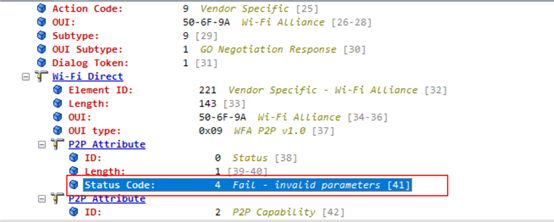

Check the content of the ACTION packet sent by the Wi-Fi module to the mobile phone. It is found that the MAC address in P2P Device Info is incorrect, as shown below.

Correct frame content

 

Incorrect frame content

 

Analyze the padding code of the MAC address. The MAC address is filled by **wpa_supplicant** based on the MAC address of p2p0. Therefore, the MAC address of the wdev object (p2p-dev-wlan0) is updated to the p2p0 API, and the two values must be the same. For details, see the call process of **wl_get_vif_macaddr(cfg, 7, p2p_hnetdev->macAddr)**.

### Connection Success Log

#### Connection Success Log in STA Mode

```
WPA: Key negotiation completed with 50:eb:f6:02:8e6:d4 [PTK=CCMP GTK=CCMP]
 06 wlan0: State: GROUP_HANDSHAKEc -> COMPLETED
wlan0: CTRL-E4VENT-CONNECTED - Connection to 50:eb:f6:02:8e:d4 completed 3[id=0 id_str=]
WifiWpaReceived eEapol done 
```

#### Connection Success Log in AP Mode

```
wlan0: STA 96:27:b3:95:b7:6e IEEE 802.1X: au:thorizing port
wlan0: STA 96:27:b3:95:b7:6e WPA: pairwise key handshake completed (RSN)
WifiWpaReceiveEapol done 
```

#### Connection Success Log in P2P Mode

```
P2P: cli_channels:
EAPOL: External notificationtion - portValid=1
EAPOL: External notification:tion - EAP success=1
EAPOL: SUPP_PAE entering state AUTHENTIwCATING
EAPOL: SUPP_BE enterilng state SUCCESS
EAP: EAP ent_ering state DISABLED
EAPOL: SUPP_PAE entering state AUTHENTICATED
EAPOL:n Supplicant port status: Authoorized
EAPOL: SUPP_BE entertaining IDLE
WifiWpaReceiveEapol donepleted - result=SUCCESS

\# ifconfig                                  

lo    Link encap:Local Loopback 
     inet addr:127.0.0.1 Mask:255.0.0.0 
     inet6 addr: ::1/128 Scope: Host
     UP LOOPBACK RUNNING MTU:65536 Metric:1
     RX packets:12 errors:0 dropped:0 overruns:0 frame:0 
     TX packets:12 errors:0 dropped:0 overruns:0 carrier:0 
     collisions:0 txqueuelen:1000 
     RX bytes:565 TX bytes:565  

wlan0   Link encap:Ethernet HWaddr 10:2c:6b:11:61:e0 Driver bcmsdh_sdmmc
     inet6 addr: fe80::122c:6bff:fe11:61e0/64 Scope: Link
     UP BROADCAST RUNNING MULTICAST MTU:1500 Metric:1
     RX packets:0 errors:0 dropped:0 overruns:0 frame:0 
     TX packets:0 errors:0 dropped:0 overruns:0 carrier:0 
     collisions:0 txqueuelen:1000 
     RX bytes:0 TX bytes:0 

p2p0   Link encap:Ethernet HWaddr 12:2c:6b:11:61:e0
     inet6 addr: fe80::102c:6bff:fe11:61e0/64 Scope: Link
     UP BROADCAST RUNNING MULTICAST MTU:1500 Metric:1
     RX packets:0 errors:0 dropped:0 overruns:0 frame:0 
     TX packets:0 errors:0 dropped:0 overruns:0 carrier:0 
     collisions:0 txqueuelen:1000 
     RX bytes:0 TX bytes:0 

p2p-p2p0-0 Link encap:Ethernet HWaddr 12:2c:6b:11:21:e0 Driver bcmsdh_sdmmc
     inet6 addr: fe80::102c:6bff:fe11:21e0/64 Scope: Link
     UP BROADCAST RUNNING MULTICAST MTU:1500 Metric:1
     RX packets:0 errors:0 dropped:9 overruns:0 frame:0 
     TX packets:0 errors:0 dropped:0 overruns:0 carrier:0 
     collisions:0 txqueuelen:1000 
     RX bytes:0 TX bytes:0 
```

## Bluetooth      

### HCI API

The overall Bluetooth hardware architecture consists of two parts: host (computer or MCU) and host controller (actual Bluetooth chipset). The communication between the host and controller complies with the HCI, as shown in the following figure.

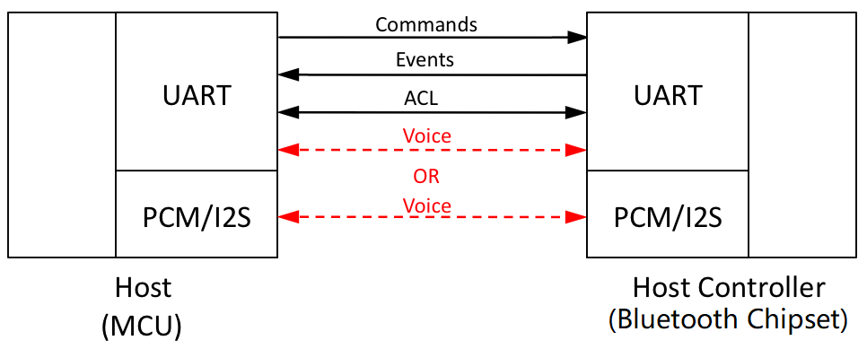

HCI defines how to exchange commands, events, and asynchronous and synchronous packets. Asynchronous connectionless links (ACLs) are used for data transmission, while synchronous connection oriented links (SCOs) are used for voice with headsets and hands-free profiles.

### Hardware Connection

According to the description of the RK3568 chip, the RK3568 chip does not integrate the Wi-Fi/Bluetooth function. The RK3568 chip needs to connect to an external Bluetooth chip to support the Bluetooth function, which complies with the preceding logical architecture. Regarding the physical connection between the host and the controller, you can consult the development board specifications.

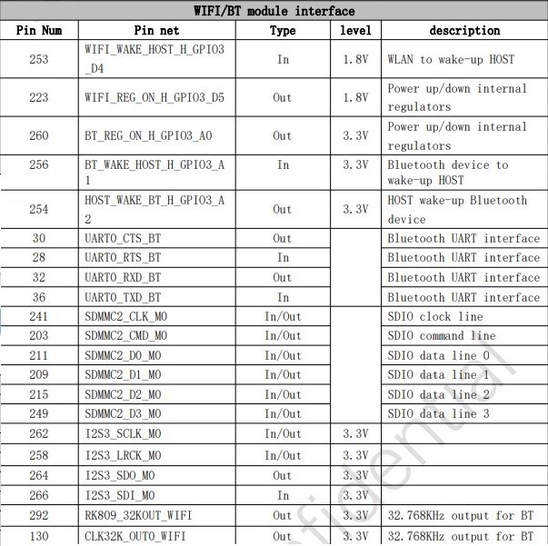

Pins 28-36 are UART (serial port). In addition, several pins are used for power supply and hibernation control.

### Bluetooth VENDORLIB Adaptation

#### What Is vendorlib?

vendorlib is deployed on the host, and may be considered as a Bluetooth chip driver layer on the host, to shield technical details of different Bluetooth chips. From the perspective of code, the main functions are as follows:

1. Provide a channel (file descriptor of the serial port) between Bluetooth chips for the protocol stack.

2. Provide specific control methods for specific chips.

#### Interpretation of vendorlib at the Code Level

**bt_vendor_lib.h**:

```
foundation/communication/bluetooth/services/bluetooth_standard/hardware/include
```

This file defines the interaction APIs between the protocol stack and **vendor_lib**, which are divided into two groups:

1. Implemented by vendorlib and called by the protocol stack

```c
typedef struct {
    /**
     * Set to sizeof(bt_vendor_interface_t)
     */
    size_t size;
    /**
     * Caller will open the interface and pass in the callback routines
     * to the implementation of this interface.
     */
    int (*init)(const bt_vendor_callbacks_t* p_cb, unsigned char* local_bdaddr);

    /**
     * Vendor specific operations
     */
    int (*op)(bt_opcode_t opcode, void* param);

    /**
     * Closes the interface
     */
    void (*close)(void);
} bt_vendor_interface_t;
```

The basic process of starting the protocol stack is as follows:

1.1. The protocol stack dynamically opens **libbt_vendor.z.so** and calls the **init** function to initialize **vendorlib**.

1.2. The protocol stack calls the OP function to call the OP codes **BT_OP_POWER_ON**, **BT_OP_HCI_CHANNEL_OPEN**, and **BT_OP_INIT**. In principle, if **BT_OP_INIT** is successful, the chip initialization is complete.

2. Implemented by the protocol stack and called by **vendorlib** (callback function)

```c
typedef struct {
    /**
   * set to sizeof(bt_vendor_callbacks_t)
    */
    size_t size;
         
    /* notifies caller result of init request */
    init_callback init_cb;

    /* buffer allocation request */
    malloc_callback alloc;

    /* buffer free request */
    free_callback dealloc;

    /* hci command packet transmit request */
    cmd_xmit_callback xmit_cb;
} bt_vendor_callbacks_t;
```

**init_cb** is called after **BT_OP_INIT** is complete.

**alloc/dealloc** is used to apply for or release message controls when HCI messages are sent.

**xmit_cb** sends HCI commands.

Important functions implemented by **vendor_lib**:

1. **init** function

```c
static int init(const bt_vendor_callbacks_t *p_cb, unsigned char *local_bdaddr)
{
     /* * ... */
    userial_vendor_init();
    upio_init();

	vnd_load_conf(VENDOR_LIB_CONF_FILE);

    /* store reference to user callbacks */
    bt_vendor_cbacks = (bt_vendor_callbacks_t *)p_cb;
        /* This is handed over from the stack */
    return memcpy_s(vnd_local_bd_addr, BD_ADDR_LEN, local_bdaddr, BD_ADDR_LEN);
}
```

The **init** function is the first function called by **vendorlib**. **vendorlib** only needs to save the callback and MAC addresses of the protocol stack.

2. **BT_OP_POWER_ON**

This operation needs to pull up the level of the power pin. In this function, the rfill device is used for processing, and the driver is not directly called to pull up the level.

```c
int upio_set_bluetooth_power(int on)
{
    int sz;
    int fd = -1;
    int ret = -1;
    char buffer = '0';
    
    switch (on) {
        case UPIO_BT_POWER_OFF:
            buffer = '0';
            break;

        case UPIO_BT_POWER_ON:
            buffer = '1';
            break;
        default:
            return 0;
    }

    /* check if we have rfkill interface */
    if (is_rfkill_disabled()) {
        return 0;
    }

    if (rfkill_id == -1) {
        if (init_rfkill()) {
            return ret;
        }
    }

    fd = open(rfkill_state_path, O_WRONLY);
    if (fd < 0) {
        return ret;
    }

    sz = write(fd, &buffer, 1);
    /* ... */
    return ret;
}
```

3. **BT_OP_HCI_CHANNEL_OPEN** processing

```c
case BT_OP_HCI_CHANNEL_OPEN: { // BT_VND_OP_USERIAL_OPEN
            int(*fd_array)[] = (int(*)[])param;
            int fd, idx;
            fd = userial_vendor_open((tUSERIAL_CFG *)&userial_init_cfg);
            if (fd != -1) {
                for (idx = 0; idx < HCI_MAX_CHANNEL; idx++)
                    (*fd_array)[idx] = fd;
                retval = 1;
        }
        /* retval contains numbers of open fd of HCI channels */
        break;
```

The **userial_vendor_open** function opens the serial port device (UART) to obtain the file descriptor (FD). The FD is returned through the **param** parameter of OP.

The name of the serial port device in the system must have been predefined in the development board. In this version, the device on the development board is **/dev/ttyS8**.

4. **BT_OP_INIT** processing

The operation code requires initialization of the Bluetooth chip, and specific processing to be performed is closely related to the Bluetooth chip. The AP6257S chip used in this debugging is used as an example. During initialization, the Bluetooth firmware is delivered.

After the initialization is complete, the **init_cb** callback function (see **bt_vendor_callbacks_t**) must be called to notify the protocol stack of the initialization result. Otherwise, the protocol stack thread is blocked and Bluetooth functions cannot be used properly. The protocol stack performs the following operations:

After calling **BT_OP_INIT**, the protocol stack waits for the semaphore. The semaphore is set by the **init_cb** function.

```c
static int HciInitHal()
{
    int result = BT_NO_ERROR;
    
    g_waitHdiInit = SemaphoreCreate(0);
    int ret = g_hdiLib->hdiInit(&g_hdiCallbacks);
    if (ret == SUCCESS) {
        SemaphoreWait(g_waitHdiInit);
    }
}
```

### vendorlib Porting Problem

1. Name of the .so file of vendorlib

   The .so file name of vendorlib must be **libbt_vendor.z.so** because it is used when the protocol stack opens the dynamic link library (DLL).

2. Firmware problem

   Pay attention to the chip firmware during development. The firmware of some Bluetooth chips may not need to be upgraded, but it's a must for some chips. During the adaptation of the AP6257S, the firmware is not delivered at the beginning. As a result, the received Bluetooth signals are poor. Pay attention to the following points when delivering firmware:

   2.1. For the AP6257S chip, the Bluetooth chip does not have a flash memory. Therefore, the firmware must be delivered again after the chip is powered on and off.

   2.2. The firmware is processed based on the chip requirements. It is recommended that the reference code of the vendor be found. Take the Broadcom series chips as an example. The firmware delivery process is complex and is driven by a state machine. There are nine states in total:

```c
/ Hardware Configuration State */
enum {
  HW_CFG_START = 1,
  HW_CFG_SET_UART_CLOCK,
  HW_CFG_SET_UART_BAUD_1,
  HW_CFG_READ_LOCAL_NAME,
  HW_CFG_DL_MINIDRIVER,
  HW_CFG_DL_FW_PATCH,
  HW_CFG_SET_UART_BAUD_2,
  HW_CFG_SET_BD_ADDR,
  HW_CFG_READ_BD_ADDR
};
```

Initialize the state machine after receiving the **BT_OP_INIT** message, send the **HCI_REST** command, and switch the state to **HW_CFG_START**.

```c
void hw_config_start(void)
{
    HC_BT_HDR *p_buf = NULL;
    uint8_t *p;
    hw_cfg_cb.state = 0;
    hw_cfg_cb.fw_fd = -1;
    hw_cfg_cb.f_set_baud_2 = FALSE;

    if (bt_vendor_cbacks) {
        p_buf = (HC_BT_HDR *)bt_vendor_cbacks->alloc(BT_HC_HDR_SIZE +
                                                     HCI_CMD_PREAMBLE_SIZE);
    }

    if (p_buf) {
        p_buf->event = MSG_STACK_TO_HC_HCI_CMD;
        p_buf->offset = 0;
        p_buf->layer_specific = 0;
        p_buf->len = HCI_CMD_PREAMBLE_SIZE;

        p = (uint8_t *)(p_buf + 1);
        UINT16_TO_STREAM(p, HCI_RESET);
        *p = 0;

        hw_cfg_cb.state = HW_CFG_START;
        bt_vendor_cbacks->xmit_cb(HCI_RESET, p_buf);
    } else {
        if (bt_vendor_cbacks) {
            HILOGE("vendor lib fw conf aborted [no buffer]");
            bt_vendor_cbacks->init_cb(BTC_OP_RESULT_FAIL);
        }
    }
}
```

After receiving the **HCI_RESET** completion event returned by the chip, the system switches to the next state machine and sends the next COMMAND until the state machine completes firmware delivery.

For details, see the **hw_config_cback** function.

3. Pay attention to inter-system API differences.

   The APIs may vary slightly by system, which requires special attention. For example, the definitions of the functions for **vendorlib** to call **xmit_cb** to send HCI commands are slightly different on different systems.

Certain system:

```c
/* define callback of the cmd_xmit_cb
 *

The callback function which HCI lib will call with the return of command

complete packet. Vendor lib is responsible for releasing the buffer passed

in at the p_mem parameter by calling dealloc callout function.
*/
typedef void (*tINT_CMD_CBACK)(void* p_mem);
typedef uint8_t (*cmd_xmit_cb)(uint16_t opcode, void* p_buf, tINT_CMD_CBACK p_cback);
```

OpenHarmony:

```c
/**

hci command packet transmit callback

Vendor lib calls cmd_xmit_cb function in order to send a HCI Command

packet to BT Controller. 
*

The opcode parameter gives the HCI OpCode (combination of OGF and OCF) of

HCI Command packet. For example, opcode = 0x0c03 for the HCI_RESET command

packet. */

typedef uint8_t (*cmd_xmit_callback)(uint16_t opcode, void* p_buf);
```

As shown above, after a command is sent in vendorlib, the certain system notifies the chip of the returned message through a callback, while OpenHarmony notifies the chip of the returned message through the **BT_OP_EVENT_CALLBACK** operation code (see the definition of **bt_opcode_t**). vendorlib needs to parse the message code in the packet to determine which message is to be processed by the chip, and then calls the corresponding processing function.

```c
void hw_process_event(HC_BT_HDR *p_buf)
{
    uint16_t opcode;
    uint8_t *p = (uint8_t *)(p_buf + 1) + HCI_EVT_CMD_CMPL_OPCODE;
    STREAM_TO_UINT16(opcode, p);
    switch (opcode) {
    case HCI_VSC_WRITE_BD_ADDR:
    #if (USE_CONTROLLER_BDADDR == TRUE)
        case HCI_READ_LOCAL_BDADDR:
    #endif
        case HCI_READ_LOCAL_NAME:
        case HCI_VSC_DOWNLOAD_MINIDRV:
        case HCI_VSC_WRITE_FIRMWARE:
        case HCI_VSC_LAUNCH_RAM:
        case HCI_RESET:
        case HCI_VSC_WRITE_UART_CLOCK_SETTING:
        case HCI_VSC_UPDATE_BAUDRATE:
            hw_config_cback(p_buf);
            break;
```

The returned messages are also different. OpenHarmony returns the number of bytes in the message. If the value is less than or equal to **0**, the message fails to be sent.

4. snoop log

   Like other systems, OpenHarmony logs HCI records, which are saved in the **/data/log/bluetooth/snoop.log** file. This allows you to use Wireshark or other packet analysis tools to examine the interaction process between the host and controller, facilitating fault analysis.

##    Sensor

  Sensor driver model developed based on the HDF driver framework

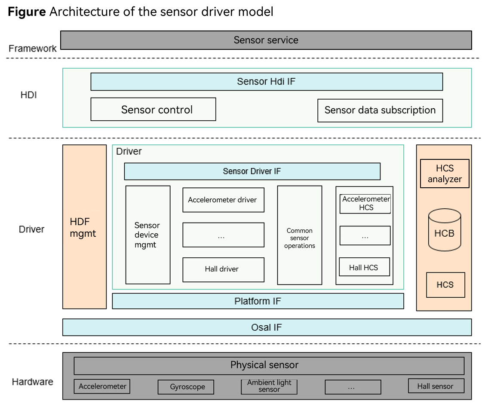

RK3568 supports the accel sensor. The OpenHarmony mainline version has the overall driver framework. You only need to implement the specific component driver.

### Implementation of the mcx5566xa HDF Driver

The RK3568 platform supports the acceleration sensor MXC6655XA. For details about the configuration, see the datasheet of the acceleration sensor. Before porting the HDF, ensure that the compilation of the sensor in the kernel is disabled.

The configuration file is stored in **kernel/linux/config/linux-5.10/arch/arm64/configs/rk3568_standard_defconfig**.

```c
# CONFIG_GS_MXC6655XA is not set
```

Code path:

```c
drivers/framework/model/sensor/driver/chipset/accel/accel_mxc6655xa.c
drivers/framework/model/sensor/driver/chipset/accel/accel_mxc6655xa.h
```

Compile the macros.

```c
CONFIG_DRIVERS_HDF_SENSOR_ACCEL_MXC6655XA=y
```

Implementation of the MXC6655XA accelerometer driver entry function

```c
struct HdfDriverEntry g_accelMxc6655xaDevEntry = {
    .moduleVersion = 1,
    .moduleName = "HDF_SENSOR_ACCEL_MXC6655XA",
    .Bind = Mxc6655xaBindDriver,
    .Init = Mxc6655xaInitDriver,
    .Release = Mxc6655xaReleaseDriver,
};

HDF_INIT(g_accelMxc6655xaDevEntry);
```

Next, let's look at the differentiated adaptation function.

```c
struct AccelOpsCall {
int32_t (*Init)(struct SensorCfgData *data);
int32_t (*ReadData)(struct SensorCfgData *data);
};
```

API for obtaining data on the X, Y, and Z axises:

```c
int32_t ReadMxc6655xaData(struct SensorCfgData *cfg, struct SensorReportEvent *event)
{
    int32_t ret;
    struct AccelData rawData = { 0, 0, 0 };
    static int32_t tmp[ACCEL_AXIS_NUM];

    CHECK_NULL_PTR_RETURN_VALUE(cfg, HDF_ERR_INVALID_PARAM);
    CHECK_NULL_PTR_RETURN_VALUE(event, HDF_ERR_INVALID_PARAM);

    ret = ReadMxc6655xaRawData(cfg, &rawData, &event->timestamp);
    if (ret != HDF_SUCCESS) {
        HDF_LOGE("%s: MXC6655XA read raw data failed", __func__);
        return HDF_FAILURE;
    }

    event->sensorId = SENSOR_TAG_ACCELEROMETER;
    event->option = 0;
    event->mode = SENSOR_WORK_MODE_REALTIME;

    rawData.x = rawData.x * MXC6655XA_ACC_SENSITIVITY_2G;
    rawData.y = rawData.y * MXC6655XA_ACC_SENSITIVITY_2G;
    rawData.z = rawData.z * MXC6655XA_ACC_SENSITIVITY_2G;

    tmp[ACCEL_X_AXIS] = (rawData.x * SENSOR_CONVERT_UNIT) / SENSOR_CONVERT_UNIT;
    tmp[ACCEL_Y_AXIS] = (rawData.y * SENSOR_CONVERT_UNIT) / SENSOR_CONVERT_UNIT;
    tmp[ACCEL_Z_AXIS] = (rawData.z * SENSOR_CONVERT_UNIT) / SENSOR_CONVERT_UNIT;

    ret = SensorRawDataToRemapData(cfg->direction, tmp, sizeof(tmp) / sizeof(tmp[0]));
    if (ret != HDF_SUCCESS) {
        HDF_LOGE("%s: MXC6655XA convert raw data failed", __func__);
        return HDF_FAILURE;
    }

    event->dataLen = sizeof(tmp);
    event->data = (uint8_t *)&tmp;

    return ret;
}
```

Initialization:

```c
static int32_t InitMxc6655xa(struct SensorCfgData *data)
{
    int32_t ret;

    CHECK_NULL_PTR_RETURN_VALUE(data, HDF_ERR_INVALID_PARAM);
    ret = SetSensorRegCfgArray(&data->busCfg, data->regCfgGroup[SENSOR_INIT_GROUP]);
    if (ret != HDF_SUCCESS) {
        HDF_LOGE("%s: MXC6655XA sensor init config failed", __func__);
        return HDF_FAILURE;
    }
    return HDF_SUCCESS;
}
```

### HCS Configuration

HCS configuration of the MXC6655XA accel sensor driver:

```c
device_sensor_mxc6655xa :: device {
    device0 :: deviceNode {
        policy = 1;
        priority = 120;
        preload = 0;
        permission = 0664;
        moduleName = "HDF_SENSOR_ACCEL_MXC6655XA";
        serviceName = "hdf_accel_mxc6655xa";
        deviceMatchAttr = "hdf_sensor_accel_mxc6655xa_driver";
    }
}
```

Register group configuration information of the MXC6655XA accel sensor:

```c
#include "../sensor_common.hcs"
root {
    accel_mxc6655xa_chip_config : sensorConfig {
        match_attr = "hdf_sensor_accel_mxc6655xa_driver";
        sensorInfo :: sensorDeviceInfo {
            sensorName = "accelerometer";
            vendorName = "memsi_mxc6655xa"; // max string length is 16 bytes
            sensorTypeId = 1; // enum SensorTypeTag
            sensorId = 1; // user define sensor id
            power = 230;
        }
        sensorBusConfig :: sensorBusInfo {
            busType = 0; // 0:i2c 1:spi
            busNum = 5;
            busAddr = 0x15;
            regWidth = 1; // 1byte
        }
        sensorIdAttr :: sensorIdInfo {
            chipName = "mxc6655xa";
            chipIdRegister = 0x0f;
            chipIdValue = 0x05;
        }
        sensorDirection {
            direction = 5; // chip direction range of value:0-7
            /* <sign> 1:negative  0:positive
               <map> 0:AXIS_X  1:AXIS_Y  2:AXIS_Z
            */
            /* sign[AXIS_X], sign[AXIS_Y], sign[AXIS_Z], map[AXIS_X], map[AXIS_Y], map[AXIS_Z] */
            convert = [
                0, 0, 0, 0, 1, 2,
                1, 0, 0, 1, 0, 2,
                0, 0, 1, 0, 1, 2,
                0, 1, 0, 1, 0, 2,
                1, 0, 1, 0, 1, 2,
                0, 0, 1, 1, 0, 2,
                0, 1, 1, 0, 1, 2,
                1, 1, 1, 1, 0, 2
            ];
        }
        sensorRegConfig {
            /*  regAddr: register address
                value: config register value
                len: size of value
                mask: mask of value
                delay: config register delay time (ms)
                opsType: enum SensorOpsType 0-none 1-read 2-write 3-read_check 4-update_bit
                calType: enum SensorBitCalType 0-none 1-set 2-revert 3-xor 4-left shift 5-right shift
                shiftNum: shift bits
                debug: 0-no debug 1-debug
                save: 0-no save 1-save
            */
            /* regAddr, value, mask, len, delay, opsType, calType, shiftNum, debug, save */
            initSeqConfig = [
                0x7e,    0xb6, 0xff,   1,     5,       2,       0,        0,     0,    0,
                0x7e,    0x10, 0xff,   1,     5,       2,       0,        0,     0,    0
            ];
            enableSeqConfig = [
                0x7e,    0x11, 0xff,   1,     5,       2,       0,        0,     0,    0,
                0x41,    0x03, 0xff,   1,     0,       2,       0,        0,     0,    0,
                0x40,    0x08, 0xff,   1,     0,       2,       0,        0,     0,    0
            ];
            disableSeqConfig = [
                0x7e,    0x10, 0xff,   1,     5,       2,       0,        0,     0,    0
            ];
        }
    }
}
```

### Testing

The three-axis data of the sensor can be obtained during the UT test.

Test code path:

```c
drivers/peripheral/sensor/test/unittest/common/hdf_sensor_test.cpp
```

Build UT code:

```c
./build.sh --product-name rk3568 --build-target hdf_test_sensor
```

Push **hdf_test_sensor.bin** to the **system/bin** directory, add the execute permission to the file, and execute the file.

If the following information is displayed, the sensor test is successful.

```c
SensorTestDataCallback enter
sensor id :[1], data[1]: 0.001877
sensor id :[1], data[2]: 0.160823
sensor id :[1], data[3]: 0.046122
```

##    Vibrator

### Vibrator Model

The vibrator driver model provides and implements vibrator-related HDIs. It supports the time sequence configuration in the static HCS and the duration configuration through dynamic parameters. The vibrator hardware service calls **StartOnce** to start one-shot vibration for a given duration and calls **StartEffect** to start vibration with a specified effect.

**Figure 1** Architecture of the vibrator driver module

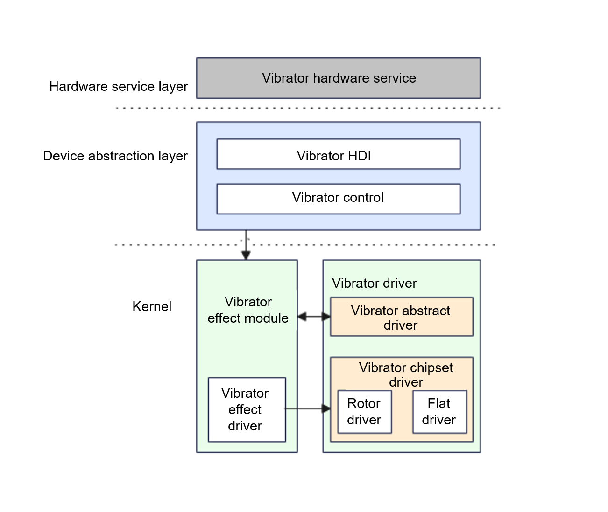

The RK3568 supports the linear vibrator. The OpenHarmony mainline version has the overall driver framework. You only need to implement the specific component driver.

### HDF Driver Implementation

Code path:

```c
drivers/framework/model/misc/vibrator/driver/chipset/vibrator_linear_driver.c
```

Implementation of the linear vibrator accelerometer driver entry function:

```c
struct HdfDriverEntry g_linearVibratorDriverEntry = {
    .moduleVersion = 1,
    .moduleName = "HDF_LINEAR_VIBRATOR",
    .Bind = BindLinearVibratorDriver,
    .Init = InitLinearVibratorDriver,
    .Release = ReleaseLinearVibratorDriver,
};

HDF_INIT(g_linearVibratorDriverEntry);
```

### HCS Configuration

HCS configuration of the driver:

```c
        vibrator :: host {
            hostName = "vibrator_host";
            device_vibrator :: device {
                device0 :: deviceNode {
                    policy = 2;
                    priority = 100;
                    preload = 0;
                    permission = 0664;
                    moduleName = "HDF_VIBRATOR";
                    serviceName = "hdf_misc_vibrator";
                    deviceMatchAttr = "hdf_vibrator_driver";
                }
            }
            device_linear_vibrator :: device {
                device0 :: deviceNode {
                    policy = 1;
                    priority = 105;
                    preload = 0;
                    permission = 0664;
                    moduleName = "HDF_LINEAR_VIBRATOR";
                    serviceName = "hdf_misc_linear_vibrator";
                    deviceMatchAttr = "hdf_linear_vibrator_driver";
                }
            }
        }
```

HCS configuration of the linear vibrator:

```c
root {
    linearVibratorConfig {
        boardConfig {
            match_attr = "hdf_linear_vibrator_driver";
            vibratorChipConfig {
                busType = 1; // 0:i2c 1:gpio
                gpioNum = 154;
                startReg = 0;
                stopReg = 0;
                startMask = 0;
            }
        }
    }
}
```

### UT Test

Test code path:

```c
drivers/peripheral/misc/vibrator/test/unittest/common/hdf_vibrator_test.cpp
```

Build UT code:

```c
./build.sh --product-name rk3568 --build-target hdf_test_vibrator
```

Push **hdf_test_vibrator.bin** to the **system/bin** directory, add the execute permission to the file, and execute the file.

```
[ RUN ] HdfVibratorTest.CheckVibratorInstanceIsEmpty
[ OK ] HdfVibratorTest.CheckVibratorInstanceIsEmpty (0 ms)
[ RUN ] HdfVibratorTest.PerformOneShotVibratorDuration001
[ OK ] HdfVibratorTest.PerformOneShotVibratorDuration001 (2001 ms)
[ RUN ] HdfVibratorTest.ExecuteVibratorEffect001
[ OK ] HdfVibratorTest.ExecuteVibratorEffect001 (5001 ms)
```
