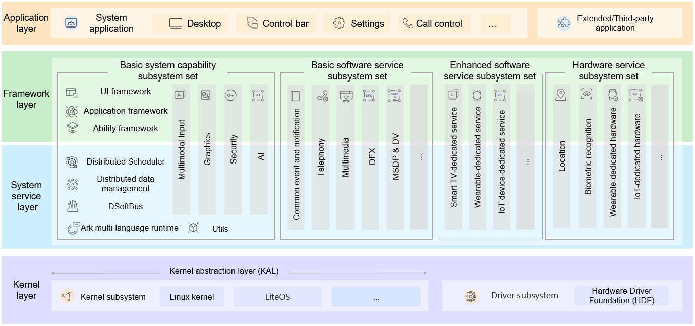

# A Method for Rapidly Porting the OpenHarmony Linux Kernel

## Overview

This document describes how to quickly port OpenHarmony to a third-party chip platform by using the existing capabilities of the Linux kernel of the third-party chip platform.

## Overall Porting Approach

### Kernel Mode Layer and User Mode Layer

For easy description, we divide the OpenHarmony architecture into two parts:

OpenHarmony = Kernel mode layer + User mode layer



The kernel mode layer is the OpenHarmony kernel layer \(purple part in the figure\). It consists of the kernel, such as Linux Kernel and LiteOS, and features, such as Hardware Driver Foundation \(HDF\), running in the kernel mode.

The user mode layer includes other parts except the OpenHarmony kernel layer. It consists of the system service layer, framework layer, and application layer from the bottom to the top.

The user mode layer of OpenHarmony is loosely coupled with the third-party chip platform and is easy to port. The kernel and HDF at the kernel mode layer are closely coupled with the third-party chip platform and are difficult to port. This document focus on the porting of the kernel mode layer. In addition, it describes only the quick porting of the Linux kernel. It does not include the porting of LiteOS.

### Composition of the Kernel Mode Layer

The OpenHarmony kernel mode layer can be further divided as follows:

OpenHarmony kernel mode layer = OpenHarmony Linux kernel + OpenHarmony kernel-mode features \(mandatory features, such as HDF, and optional features, such as HMDFS\)

OpenHarmony Linux kernel = Standard LTS Linux kernel + Third-party SoC platform code + OpenHarmony basic kernel-mode code \(most basic code required for running of the OpenHarmony user mode layer\)

Therefore, the OpenHarmony kernel mode layer includes the following:

-   Standard LTS Linux kernel
-   Third-party SoC platform code
-   OpenHarmony basic kernel-mode code
-   OpenHarmony kernel-mode features, such as HDF


The standard LTS Linux kernel and third-party SoC chip platform code constitute the basis of a third-party Linux kernel. The OpenHarmony kernel mode layer can be composed of either of the following:

-   OpenHarmony kernel mode layer = Third-party Linux kernel + OpenHarmony basic kernel-mode code + OpenHarmony kernel-mode features \(such as HDF and HMDFS\)

    In this case, the OpenHarmony kernel mode layer consists of the third-party Linux kernel and OpenHarmony basic code and features for the kernel mode.


-   OpenHarmony kernel mode layer = OpenHarmony Linux kernel + OpenHarmony kernel-mode features \(such as HDF and HMDFS\)

    In this case, the OpenHarmony kernel mode layer consists of OpenHarmony kernel and features. However, the OpenHarmony kernel supports few third-party chip platforms.


In the following, we elaborate how to port OpenHarmony that uses with the third-party Linux kernel.

### Overall Porting Process

The porting process is as follows:

1.  Prepare the build environment, including copying the existing kernel code of the third-party chip platform to the OpenHarmony build environment.
2.  Port the OpenHarmony basic kernel-mode code.
3.  Port OpenHarmony mandatory kernel-mode features \(such as HDF\).

## Procedure

The following uses Raspberry Pi 3b \(BCM2837\) as an example to describe how to port OpenHarmony to Raspberry Pi.

### Setting Up the Environment

1.  Copy the third-party kernel code to the OpenHarmony build environment.

    Build the standard Hi3516D V300 kernel, clone the Raspberry Pi kernel source code, and copy it to the manifest output directory.

    ```
    export PROJ_ROOT=[OpenHarmony manifest]
    git clone https://gitee.com/xfan1024/oh-rpi3b-kernel.git
    cp -r oh-rpi3b-kernel $PROJ_ROOT/out/KERNEL_OBJ/kernel/src_tmp/linux-rpi3b
    ```

2.  Configure the Raspberry Pi kernel build environment.

    ```
    # Go to the Raspberry Pi kernel directory.
    cd out/KERNEL_OBJ/kernel/src_tmp/linux-rpi3b
    
    # Configure the build environment, and use clang provided by the project to build the Raspberry Pi kernel source code.
    export PATH=$PROJ_ROOT/prebuilts/clang/ohos/linux-x86_64/llvm/bin:$PROJ_ROOT/prebuilts/gcc/linux-x86/arm/gcc-linaro-7.5.0-arm-linux-gnueabi/bin/:$PATH
    export MAKE_OPTIONS="ARCH=arm CROSS_COMPILE=arm-linux-gnueabi- CC=clang HOSTCC=clang"
    export PRODUCT_PATH=vendor/hisilicon/hispark_taurus_linux
    ```

3.  Comment out the flags that cannot be recognized by **clang**.

    In the **PROJ\_ROOT/out/KERNEL\_OBJ/kernel/src\_tmp/linux-rpi3b/arch/arm/Makefile** file, comment out the following line:

    ```
    KBUILD_CFLAGS  +=-fno-omit-frame-pointer -mapcs -mno-sched-prolog
    ```


### Porting Basic Kernel-Mode Code

Currently, the basic kernel-mode code of OpenHarmony is related to the log service. The lightweight kernel log service code includes the following:

```
drivers/staging/hilog
drivers/staging/hievent
```

Copy the preceding code from the **kernel/linux/linux-4.19/drivers/staging** directory of OpenHarmony to **out/KERNEL\_OBJ/kernel/src\_tmp/linux-rpi3b/drivers/staging**.

Add the following code to the third-party kernel file **Kconfig** in the **drivers/staging** directory:

```
source "drivers/staging/hilog/Kconfig"
source "drivers/staging/hievent/Kconfig"
```

Add the following code to the third-party kernel file **Makefile** in the **drivers/staging** directory:

```
obj-$(CONFIG_HILOG)             += hilog/
obj-$(CONFIG_HIEVENT)           += hievent/
```

Enable the CONFIG macros **CONFIG\_HILOG** and **CONFIG\_HIEVENT** in the kernel **config** section.

For details about how to use the logs, see [Hilog\_lite](https://gitee.com/openharmony/hiviewdfx_hilog_lite/blob/master/README.md).

### Porting the HDF Feature

1.  Install HDF patches.

    Run the shell script to apply HDF patches.

    1.  Set the four variables in the **patch\_hdf.sh** script.
    2.  Obtain the **patch\_hdf.sh** script.
    3.  Run the **patch\_hdf.sh** script to pass the four variables in sequence.

    Run the following command:

    ```
    ./patch_hdf.sh [Project root directory path] [Kernel directory path] [Kernel patch path] [Device name]
    ```

    The following uses Raspberry Pi 3b as an example:

    ```
    # Go to the Raspberry Pi kernel directory.
    PROJ_ROOT/drivers/hdf_core/adapter/khdf/linux/patch_hdf.sh \
    PROJ_ROOT # Specify the path of the project root directory.\
    PROJ_ROOT/out/KERNEL_OBJ/kernel/src_tmp/linux-rpi3b # Specify the kernel directory for applying the patch.\
    PROJ_ROOT/kernel/linux/patches/linux-4.19 # Kernel patch patch.\
    hi3516dv300 # Device name.
    ```

2.  Configure the **config** file.

    Configure basic HDF settings. If other functions are required, enable the corresponding driver switch by using **menuconfig**.

    After HDF patches are installed, the HDF function is disabled by default. To enable the HDF function, perform the following settings:

    ```
    CONFIG_DRIVERS_HDF=y
    CONFIG_HDF_SUPPORT_LEVEL=2
    CONFIG_DRIVERS_HDF_PLATFORM=y
    CONFIG_DRIVERS_HDF_PLATFORM_MIPI_DSI=y
    CONFIG_DRIVERS_HDF_PLATFORM_GPIO=y
    CONFIG_DRIVERS_HDF_PLATFORM_I2C=y
    CONFIG_DRIVERS_HDF_PLATFORM_UART=y
    CONFIG_DRIVERS_HDF_TEST=y
    ```

    Alternatively, run the following command to enable the HDF configuration on the **menuconfig** page:

    ```
    # Generate the .config file.
    make ${MAKE_OPTIONS} rpi3b_oh_defconfig
    
    # Modify the HDF kernel configuration.
    make ${MAKE_OPTIONS} menuconfig
    # [*] Device Drivers
    # [*]   HDF driver framework support --->
    ```

    The configuration \(in **Device Drivers** \> **HDF driver framework support**\) is as follows:

    


### Building the Image

```
# Run the following command:
make ${MAKE_OPTIONS} -j33 zImage
```

### \(Optional\) Building and Running HDF Test Cases

**Overview**

The HDF test cases are used to verify basic functions of the HDF framework and peripherals. This document describes the HDF kernel-mode test cases.

**Prerequisites**

-   In **menuconfig**, **CONFIG\_DRIVERS\_HDF\_TEST** is set to **y**.
-   The standard Hi3516D V300 kernel is built completely.

**Test Case Build and Test Method**

Use the [hdc_std](../subsystems/subsys-toolchain-hdc-guide.md) tool to push the test case execution file to the device and execute the test cases. The procedure is as follows:

1.  Build the HDF test cases.
2.  Use the **hdc_std** tool to push the test case execution file to the device.
3.  Go to the **data/test** directory of the device and execute the test file.

The procedure is as follows:

1.  Build the HDF test cases.

    Run the following command:

    ```
    ./build.sh --product-name hispark_taurus_standard --build-target hdf_test
    ```

    Wait until the build is complete.

2.  Copy the test files to the target device \(Raspberry Pi in this example\).

    Method 1: Use the [hdc_std](../subsystems/subsys-toolchain-hdc-guide.md) tool.

    1.  Create the **data/test** directory in Raspberry Pi.

        ```
        mkdir -p data/test
        ```

    2.  Push the dependencies and test cases to Raspberry Pi.

        ```
        hdc file send XXX\out\{device_name}\hdf\hdf\libhdf_test_common.z.so  /system/lib
        hdc file send XXX\out\{device_name}\tests\unittest\hdf\config\hdf_adapter_uhdf_test_config  /data/test
        hdc file send XXX\out\{device_name}\tests\unittest\hdf\devmgr\DevMgrTest  /data/test
        hdc file send XXX\out\{device_name}\tests\unittest\hdf\osal\OsalTest  /data/test
        hdc file send XXX\out\{device_name}\tests\unittest\hdf\sbuf\SbufTest  /data/test
        ```

    Method 2: Copy the test files to Raspberry Pi using its memory card.

    1.  Remove the serial port and USB cable of Raspberry Pi from the PC, and remove its memory card. The **zImage** file in the memory card will be replaced. Back it up in advance.
    2.  Insert the memory card into the port of the PC used for porting, download the **zImage** file and the **test/** folder to the PC, and then copy them to the root directory of the memory card.
    3.  Insert the memory card into Raspberry Pi.

        ```
        # Enable the Raspberry Pi file system to read the root directory of the memory card.
        mount -t vfat /dev/block/mmcblk0p1 /boot
        cd /boot/[Test file directory]
        # Enable system files to be modified.
        mount -o remount,rw /
        # Install the test library.
        mv libhdf_test_common.z.so /system/lib
        mkdir /data/test
        mv * /data/test
        ```

3.  Perform the test.
    1.  Go to the **data/test** directory.

        ```
        cd /data/test
        ```

    2.  Assign the execute permission on the test files.

        ```
        chmod 777 hdf_adapter_uhdf_test_config DevMgrTest OsalTest SbufTest
        ```

    3.  Start the test.

        ```
        ./hdf_adapter_uhdf_test_config
        ./DevMgrTest
        ./OsalTest
        ./SbufTest
        ```

    4.  If **PASSED** is displayed for all test items, HDF is functioning.

        Example: DevMgrTest case

        ```
        ./DevMgrTest
        Running main() from gmock_main.cc
        [==========] Running 1 test from 1 test case.
        [----------] Global test environment set-up.
        [----------] 1 test from DevMgrTest
        [ RUN      ] DevMgrTest.DriverLoaderTest_001
        [       OK ] DevMgrTest.DriverLoaderTest_001 (0 ms)
        [----------] 1 test from DevMgrTest (0 ms total)
        [----------] Global test environment tear-down
        Gtest xml output finished
        [==========] 1 test from 1 test case ran. (0 ms total)
        [  PASSED  ] 1 test.
        ```


