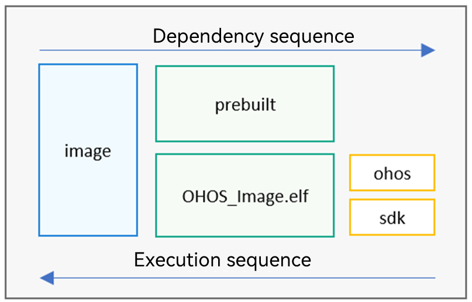

# Kernel Porting


## Porting the Chip Architecture

Chip architecture porting is the basis of kernel porting. It is required when the target chip architecture is not yet supported in OpenHarmony. You can check the supported architectures in the **liteos_m/arch** directory, as shown in Table 1.

  **Table 1** Architectures supported by OpenHarmony

| Series| Model|
| -------- | -------- |
| Arm| arm9<br>cortex-m3<br>cortex-m4<br>cortex-m7<br>cortex-m33 |
| C-SKY| v2 |
| RISC-V| nuclei<br>riscv32 |
| Xtensa| lx6 |


If the target chip architecture is not yet supported in OpenHarmony, it must be adapted by the chip vendor. The **arch/include** directory contains the functions that need to be implemented for common chip architecture adaptation. Some chip architecture code is implemented by assembly, and assembly code varies with compilers. Therefore, a specific chip architecture also includes architecture code compiled by using different compilers (such as IAR, Keil, and GCC).


```
kernel/liteos_m/arch          # The path varies according to the version.
├── arm                       # Arm series
│   ├── arm9
│   ├── cortex-m3
│   ├── cortex-m33
│   │   ├── gcc               # Architecture code compiled by the GCC compiler
│   │   └── iar               # Architecture code compiled by the IAR compiler
│   ├── cortex-m4
│   ├── cortex-m7
├── csky                      # C-SKY series
├── include                   # Functions to be implemented for common chip architecture adaptation.
│   ├── los_arch.h            # Definition of functions required for initializing the chip architecture.
│   ├── los_atomic.h          # Definition of the atomic operation functions to be implemented by the chip architecture.
│   ├── los_context.h         # Definition of the context-related functions to be implemented by the chip architecture.
│   ├── los_interrupt.h       # Definition of the interrupt- and exception-related functions to be implemented by the chip architecture.
│   └── los_timer.h           # Definition of the system clock–related functions to be implemented by the chip architecture.
├── risc-v                    # RISC-V series
│   ├── nuclei
│   └── riscv32
└── xtensa                    # Xtensa series
     └── lx6
```


## Porting the Chip SDK

Add the chip SDK to the OpenHarmony compilation framework you have set up, so as to build the file with the SDK (which does not contain the system information), which can then be burnt so that interfaces in the SDK can be called in OpenHarmony. To add the chip SDK to the OpenHarmony compilation framework, perform the following steps:

1. Place the chip SDK in a proper position in the **device** directory, and integrate the SDK build script and image packaging script into the compilation framework.
   Reference build script: **device/MyDeviceCompany/MyBoard/BUILD.gn**

   
   ```
   import("//build/lite/config/component/lite_component.gni")
    
   executable("OHOS_Image.elf") {    # Generate an executable program.
     libs = [
       "xxx/xxx/libxxx.a",           # Method 1 for connecting to the vendor's closed-source static library
     ]
     asmflags = [                    # Assembly compilation parameters
       "",
     ]
     ldflags = [
       "-T./xxx/xxx/xxx.ld",         # Link script file
       "-Lxxx/xxx/",                 # Static library path of the vendor.
       "-lxxx",                      # Method 2 for connecting to the vendor's closed-source static library
       "-Wl,--whole-archive",
       "-lmodule_xxx",
       "-Wl,--no-whole-archive",
     ]
     deps = [
       "//build/lite:ohos",          # Link the dependent OpenHarmony static library after the build process is complete.
       ":sdk",                       # Link the dependent static library generated from the vendor source code after the build process is complete.
     ]
   }
    
   copy("prebuilt") {                # Image generation tool. Generally, copy the image generation tool to the out directory.
     sources = [ ]                   # Source file copied
     outputs = [ ]                   # Target file copied
   }
   static_library("sdk") {
     sources = [ ]                   # Vendor source code to compile into a static library.
     include_dirs = [ ]              # Path of the header file included in the vendor source code
   }
   build_ext_component("image") {# Invoke the shell command to generate an image file that can be burnt.                            
     exec_path = rebase_path(root_out_dir)   # Directory where Shell commands are executed
     objcopy = "arm-none-eabi-objcopy"
     objdump = "arm-none-eabi-objdump"
     command = "$objcopy -O binary OHOS_Image.elf OHOS_Image.bin" 
     command += " && sh -c '$objdump -t OHOS_Image.elf | sort > OHOS_Image.sym.sorted'" 
     command += " && sh -c '$objdump -d OHOS_Image.elf > OHOS_Image.asm'"                  
     deps = [
       ":prebuilt",                  # Delete this dependency if you do not need to prepare the image generation tool.
       ":OHOS_Image.elf",            # ELF file dependency
     ]
   }
   group("MyBoard") {                # Same as the current path
   }
   ```

     **Figure 1** Dependency execution sequence of targets 
   

1. Customize the **target_config.h** file.
   Create the kernel configuration file **target_config.h** in a proper location in **device/MyDeviceCompany/MyBoard** and modify the parameter settings based on the hardware resources of the chip. For details about the parameters, see Table 2.

   Reference file path: **device/hisilicon/hispark_pegasus/sdk_liteos/platform/os/Huawei_LiteOS/targets/hi3861v100/include/target_config.h**

   >  **NOTE**
   > 1. If the existing configuration items do not meet the requirements, modify the **kernel/liteos_m/kernel/include/los_config.h** file as needed, which contains the full configuration of the LiteOS_M kernel.
   > 
   > 2. Configuration items in the **target_config.h** file will overwrite those in the **los_config.h** file.

     **Table 2** Main configuration items in the target_config.h file
   
   | Configuration Item| Description| Reference Value|
   | -------- | -------- | -------- |
   | OS_SYS_CLOCK | System clock| 40000000UL |
   | LOSCFG_BASE_CORE_TICK_PER_SECOND | Clock cycle of the operating system ticks.| 100UL |
   | LOSCFG_BASE_CORE_TICK_HW_TIME | External configuration item for timer tailoring.| YES |
   | LOSCFG_PLATFORM_HWI | Whether to use the takeover on interruption mode.| YES |
   | LOSCFG_BASE_CORE_TSK_LIMIT | Maximum number of supported tasks (excluding idle tasks).| 32 |
   | LOSCFG_BASE_CORE_TSK_IDLE_STACK_SIZE | Stack size of an idle task.| 0x180UL |
   | LOSCFG_BASE_CORE_TSK_DEFAULT_STACK_SIZE | Default size of the task stack. The task stack size is 8-byte aligned.| 0x1000UL |
   | LOSCFG_BASE_CORE_TSK_MIN_STACK_SIZE | Minimum stack size required by a task.| ALIGN(0x180,&nbsp;4) |
   | LOSCFG_BASE_CORE_TIMESLICE_TIMEOUT | Maximum execution duration of tasks with the same priority.| 2 |
   | LOSCFG_BASE_IPC_SEM_LIMIT | Maximum number of semaphores.| 100 |
   | LOSCFG_BASE_IPC_MUX_LIMIT | Maximum number of mutexes.| 64 |
   | LOSCFG_BASE_IPC_QUEUE_LIMIT | Maximum number of message queues.| 64 |
   | LOSCFG_BASE_CORE_SWTMR_LIMIT | Maximum number of supported software timers, not the number of available software timers.| 80 |
   | LOSCFG_BASE_MEM_NODE_SIZE_CHECK | Whether to enable the memory node size check.| NO |
   | LOSCFG_PLATFORM_EXC | Whether to enable configuration of the abnormal module.| YES |
   | LOSCFG_USE_SYSTEM_DEFINED_INTERRUPT | Whether to use the default interrupt of the OS.| NO |

1. Change the kernel interrupt.
   
   Use either of the following:
   
   - Use the default interrupt of the vendor.
   
     Set the **LOSCFG_USE_SYSTEM_DEFINED_INTERRUPT** macro in **target_config.h** to **NO** (**0**), and modify the xxx.s startup file as follows:
   
     - **PendSV_Handler**: interrupt entry point function provided by the vendor SDK. Replace it with the **HalPendSV** interface in OpenHarmony.
     - **SysTick_Handler**: clock interrupt entry point function provided by the vendor SDK. Replace it with the **OsTickHandler** interface in OpenHarmony.
   
   - Implement redirection interrupt during system initialization.
   
     Set the **LOSCFG_USE_SYSTEM_DEFINED_INTERRUPT** and **LOSCFG_PLATFORM_HWI** macros in **target_config.h** to **YES** (**1**).
   
   >  **NOTE**
   >
   > The interrupt vector table **g_hwiForm** after redirection needs to be byte-aligned according to the requirements in the Arch manual. Generally, the interrupt vector table is 0x200 byte-aligned.


## Adding the Kernel Subsystem

After adding the kernel subsystem, you can compile a project with the system. To add a kernel subsystem, perform the following steps:

1. Add the kernel subsystem to the **vendor/MyVendorCompany/MyProduct/config.json** file.

   The sample code is as follows:
   
   ```
   {
     "subsystem": "kernel",          # Kernel subsystem to add
     "components": [
       { 
         "component": "liteos_m", "features":[""] 
       }
     ]
   },
   ```

2. Enable or disable kernel features.

   The mini-system kernel provides the following features. This step describes how to view, enable, and disable these features.

   Features: switches for the file system, backtrace, and more

   Path: **kernel/liteos_m/BUILD.gn**

   
   ```
   declare_args() {
     enable_ohos_kernel_liteos_m_cppsupport = true        # Enable CPP.
     enable_ohos_kernel_liteos_m_cpup = true              # Enable CPU usage.
     enable_ohos_kernel_liteos_m_exchook = true           # Enable exception handling.
     enable_ohos_kernel_liteos_m_kal = true               # Enable KAL interfaces.
     enable_ohos_kernel_liteos_m_fs = true                # Enable the file system.
     enable_ohos_kernel_liteos_m_backtrace = true         # Enable backtrace.
   }
   group("kernel") {
   deps = [
       "components/bounds_checking_function:sec",
       "kernel:kernel",
       "utils:utils",
     ]
     if (enable_ohos_kernel_liteos_m_cppsupport == true) {
       deps += [ "components/cppsupport:cppsupport" ]     # If a kernel feature is set to true, the code corresponding to this feature is included in the build process.
     }
     ......
     if (enable_ohos_kernel_liteos_m_kal == true) {
       deps += [ "kal:kal" ]
     }
   }
   ```

   Features: CMSIS and POSIX support

   Path: **kernel/liteos_m/kal/BUILD.gn**

   
   ```
   declare_args() {
     enable_ohos_kernel_liteos_m_cmsis = true # Enable CMSIS support.
     enable_ohos_kernel_liteos_m_posix = true # Enable POSIX support.
   }
   static_library("kal") {
     sources = [ "kal.c" ]
     if (enable_ohos_kernel_liteos_m_cmsis == true) {
       deps += [ "cmsis/" ]                    # If cmsis is set to true, the code in the cmsis directory is included in the build process.
     }
     if (enable_ohos_kernel_liteos_m_posix == true) {
       deps += [ "posix/" ]                    # If posix is set to true, the code in the posix directory is included in the build process.
     }
   }
   ```

   Feature: FATFS support

   Path: **kernel/liteos_m/components/fs/BUILD.gn**

   
   ```
   declare_args() {
     enable_ohos_kernel_liteos_m_fatfs = true   # Enable FATFS support.
   }
   group("fs") {
     deps = []
     if (enable_ohos_kernel_liteos_m_fatfs == true) {
       deps += [ "fatfs:fatfs" ] 
     }
   }
   ```

   >  **NOTE**
   > 
   > A kernel feature, such as the FS and CPP support, can be enabled or disabled in the specific product module.
   > 
   > Path: **vendor/MyVendorCompany/MyProduct/config.json**
   > 
   >   
   > ```
   > "subsystem": "kernel",
   > "components": [
   >  { 
   >     "component": "liteos_m", 
   >     "features":["enable_ohos_kernel_liteos_m_fs = false",
   >     "enable_ohos_kernel_liteos_m_cppsupport = false"] 
   >   }
   > ]
   > }
   > ```
