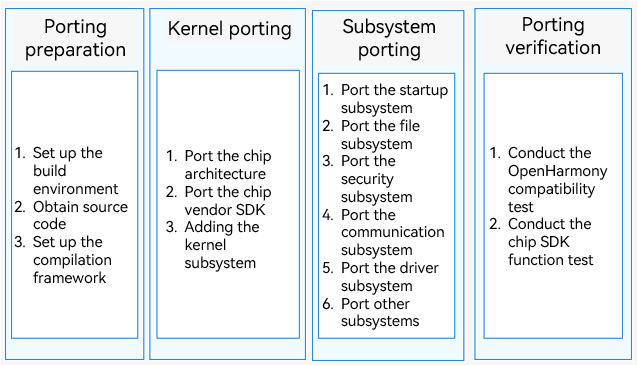

# Overview

This document provides chip/module vendors with a complete walkthrough of OpenHarmony-based chip adaptation from an end-to-end perspective. It applies to typical chip architectures, such as the chip architectures in the Cortex-M and RISC-V series.

## Constraints

This document applies to the adaptation of the mini system in OpenHarmony LTS 3.0.1 and earlier versions.

>  **NOTE**
>
> This document describes only the files and configuration items that you need to pay attention to during OpenHarmony porting and adaptation. Other files and configuration items are skipped.

## Adaptation Process

The adaptation process is divided into four steps: porting preparation, kernel porting, subsystem porting, and porting verification. For details, see Table 1.

**Table 1** Chip adaptation steps

| Step| Description|
| -------- | -------- |
| Porting preparation| Download code from the OpenHarmony community on Gitee and set up the build environment. You can familiarize yourself with the OpenHarmony compilation and building framework along the way.|
| Kernel porting| Port the chip SDK to the OpenHarmony platform and determine whether adaptation is required based on the chip architecture support.|
| Subsystem porting| Port the startup, file, security, communication, and driver subsystems.|
| Porting verification| After the adaptation is complete, conduct the compatibility test provided by OpenHarmony and the chip SDK function test of your own.|

  **Figure 1** Overall service process

  

## Basic Concepts

**Table 2** Basic concepts

| Term| Description|
| -------- | -------- |
| Subsystem| A subsystem, as a logical concept, consists of one or more components. OpenHarmony is designed with a layered architecture, which consists of the kernel layer, system service layer, framework layer, and application layer from the bottom up. System functions are built from components, subsystems, and then to the system. In a multi-device deployment, you can customize subsystems and components as required.|
| Component| A component is a reusable, configurable, and tailorable function unit. Each component has an independent directory, and can be built and tested independently and developed concurrently. |
| hb | hb is an OpenHarmony command line tool used to execute build commands.|
| KV | A key-value pair (KV) is a format of data storage.|
