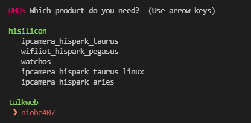
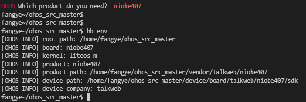
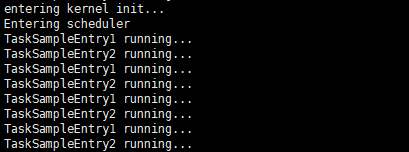

# Mini System STM32F407 SoC Porting Case

This document describes how to port the OpenHarmony LiteOS-M mini system on the Talkweb [Niobe407](https://gitee.com/openharmony-sig/device_board_talkweb) development board based on the `STM32F407IGT6` chip, to provide development board solutions for transportation and industrial fields. The porting architecture uses the `Board` and `SoC` separation solution and the `Newlib C` library of the `arm gcc` toolchain to implement adaptation of subsystems and components such as `lwip`, `littlefs`, and `hdf`. The matching application sample code is developed to support graphical configuration of compilation options through KConfig.

## Preparing for Adaptation

- Download the graphic tool [stm32cubemx](https://www.st.com/en/development-tools/stm32cubemx.html).
- Prepare the Ubuntu 20.04 system environment and install the [arm-none-eabi-gcc](https://gitee.com/openharmony/device_board_talkweb/blob/master/niobe407/docs/software/%E5%BC%80%E5%8F%91%E7%8E%AF%E5%A2%83%E6%90%AD%E5%BB%BA%E4%B8%8E%E5%9B%BA%E4%BB%B6%E7%BC%96%E8%AF%91.md#6%E5%AE%89%E8%A3%85%E4%BA%A4%E5%8F%89%E7%BC%96%E8%AF%91%E5%B7%A5%E5%85%B7%E9%93%BE) cross compilation toolchain.
### Generating an Available Project

Generate the Makefile project of the `STM32F407IGT6` chip by using the STM32CubeMX tool. You are advised to complete configurations as follows:

- Retain the default system settings.
- Set **SYSCLK** to 168 MHz in the clock configuration, to maximize the chip performance.
- Configure USART1 as the debugging serial port, to generate debugging information during adaptation.
- Set **Toolchain/IDE** to **Makefile** in STM32CubeMX configurations.

The generated project directory is as follows:

```
├── Core
│   ├── Inc
│   │    ├── main.h
│   │    ├── stm32f4xx_hal_conf.h
│   │    └── stm32f4xx_it.h
│   └── Src
│        ├── main.c                --- Main function
│        ├── stm32f4xx_hal_msp.c   --- Weak function configuration file in the HAL library
│        ├── stm32f4xx_it.c        --- Interrupt callback function file
│        └── system_stm32f4xx.c    --- System
├── Drivers
│   ├── CMSIS                      --- CMSIS API
│   └── STM32F4xx_HAL_Driver       --- HAL library driver
├── Makefile                       --- Makefile compilation
├── STM32F407IGTx_FLASH.ld         --- Link file
├── startup_stm32f407xx.s          --- Startup file
└── stm32f407_output.ioc           --- STM32CubeMX project file
```

### Verifying the Generated Project

Copy the generated project to Ubuntu, go to the project directory, and run the **make** command to compile the project. Ensure that the compilation is successful.

```
arm-none-eabi-gcc build/main.o build/stm32f4xx_it.o build/stm32f4xx_hal_msp.o build/stm32f4xx_hal_tim.o build/stm32f4xx_hal_tim_ex.o build/stm32f4xx_hal_uart.o build/stm32f4xx_hal_rcc.o build/stm32f4xx_hal_rcc_ex.o build/stm32f4xx_hal_flash.o build/stm32f4xx_hal_flash_ex.o build/stm32f4xx_hal_flash_ramfunc.o build/stm32f4xx_hal_gpio.o build/stm32f4xx_hal_dma_ex.o build/stm32f4xx_hal_dma.o build/stm32f4xx_hal_pwr.o build/stm32f4xx_hal_pwr_ex.o build/stm32f4xx_hal_cortex.o build/stm32f4xx_hal.o build/stm32f4xx_hal_exti.o build/system_stm32f4xx.o build/startup_stm32f407xx.o -mcpu=cortex-m4 -mthumb -mfpu=fpv4-sp-d16 -mfloat-abi=hard -specs=nano.specs -TSTM32F407IGTx_FLASH.ld  -lc -lm -lnosys  -Wl,-Map=build/stm32f407_output.map,--cref -Wl,--gc-sections -o build/stm32f407_output.elf
arm-none-eabi-size build/stm32f407_output.elf
   text    data     bss     dec     hex filename
   5000      20    1636    6656    1a00 build/stm32f407_output.elf
arm-none-eabi-objcopy -O ihex build/stm32f407_output.elf build/stm32f407_output.hex
arm-none-eabi-objcopy -O binary -S build/stm32f407_output.elf build/stm32f407_output.bin
```

After the compilation is complete, a .bin file is generated. To ensure that the program can run successfully on the development board, you need to initialize the serial port in the main function and output a string through the serial port. If the following information is generated during running, the development board is started successfully:
```
printf("hello world!!\r\n");
```

To generate logs using the **printf** function to the serial port, override the **_write** function. The sample code is as follows:

```c
#include <stdio.h>

int _write(int fd, char *ptr, int len)
{ 
      return HAL_UART_Transmit(&huart1, (uint8_t *)ptr, len, 0xFFFF); 
}
```
Recompile the code and burn it to the development board for verification.

## Compilation and Building
### Directory Planning

The chip adaptation directory is planned as follows:

```
device
├── board                                --- Board vendor directory
│   └── talkweb                          --- Board vendor: Talkweb
│       └── niobe407                     --- Board name, which is the same as the product name
└── soc									 --- SoC vendor directory
    └── st                               --- SoC vendor
        └── stm32f4xx					 --- SoC series: STM32F4xx, including SoC code
```

The planned product demo directory is as follows:

```
vendor
└── talkweb							     --- Vendor of the product sample
    └── niobe407         			     --- Product name: niobe407
```

Obtain the [OpenHarmony source code](../get-code/sourcecode-acquire.md) and create directories as planned.

### Precompilation Adaptation

This part describes adaptation using the `hb set` command to set environment variables such as the root directory, board directory, product directory, and board vendor, for subsequent adaptation compilation.

To be specific:

1. Add the `config.json` file to the `vendor/talkweb/niobe407` directory to describe the board and kernel information used by the product sample. The sample code is as follows:

```
{
  "product_name": "niobe407",           --- Product name displayed when using the **hb set** command.
  "type": "mini",                       --- System type, which can be mini, small, or standard.
  "version": "3.0",                     --- Version of the system, which can be 1.0, 2.0, or 3.0.
  "device_company": "talkweb",          --- Board vendor name, which is used to find the **/device/board/talkweb** directory during compilation.
  "board": "niobe407",                  --- Board name, which is used to find the **/device/board/talkweb/niobe407** directory during compilation.
  "kernel_type": "liteos_m",            --- Kernel type. The OpenHarmony supports multiple kernels, and one board may adapt multiple kernels. Therefore, you need to specify a kernel for compilation.
  "kernel_version": "3.0.0",            --- Kernel version. One board may adapt multiple Linux kernel versions. Therefore, you need to specify a kernel version for compilation.
  "subsystems": [ ]                     --- Subsystem to be built.
}
```

2. Create the `board` directory under `//device/board/talkweb/niobe407` and add the `config.gni` file to the created directory to describe the compilation configuration information of the product.

```
# Kernel type, e.g. "linux", "liteos_a", "liteos_m".
kernel_type = "liteos_m"                --- Kernel type, which corresponds to **kernel_type** in **config.json**.

# Kernel version.
kernel_version = "3.0.0"                --- Kernel version, which corresponds to **kernel_version** in **config.json**.
```

3. Check whether the `hb set` configuration is correct. If the following information is displayed after you enter `hb set`, the configuration is correct.

 

4. Run the `hb env` command to view the selected precompilation environment variables.

 

5. Introduction to **hb**

   `hb` is a Python script tool provided by OpenHarmony to facilitate code building and compilation. The source code of `hb` is stored in the `//build/lite` repository directory. When the `hb set` command is executed, the script traverses `config.json` in the `//vendor/<product_company>/<product_name>` directory and provides product compilation options. In the **config.json** file, `product_name` indicates the product name, and `device_company` and `board` are used to associate the `//device/board/<device_company>/<board>` directory and match the `<any_dir_name>/config.gni` file in the directory. The `<any_dir_name>` directory name can be any name, however, you are advised to name it as the adapted kernel name (for example, **liteos_m**, **liteos_a**, or **linux**). If multiple `config.gni` files are matched, the **hb** command matches the `kernel_type` and `kernel_version` fields with the fields in the `config.json` file in `vendor/<device_company>` to determine the `config.gni` file to be compiled.

So far, the precompilation adaptation is complete. However, the project cannot be compiled by running `hb build`. You need to prepare for the subsequent `LiteOS-M` kernel porting.

## Kernel Porting

Kernel porting requires `LiteOS-M Kconfig` adaptation, `gn` compilation and building, and minimum kernel startup adaptation.

### Kconfig File Adaptation

1. Create the **kernel_configs** directory in `//vendor/talkweb/niobe407` and create an empty file named **debug.config**.

2. Open the `//kernel/liteos_m/Kconfig` file. Multiple Kconfig files in `//device/board` and `//device/soc` have been imported using the **orsource** command. You need to create and modify these files later.

```
orsource "../../device/board/*/Kconfig.liteos_m.shields"
orsource "../../device/board/$(BOARD_COMPANY)/Kconfig.liteos_m.defconfig.boards"
orsource "../../device/board/$(BOARD_COMPANY)/Kconfig.liteos_m.boards"
orsource "../../device/soc/*/Kconfig.liteos_m.defconfig"
orsource "../../device/soc/*/Kconfig.liteos_m.series"
orsource "../../device/soc/*/Kconfig.liteos_m.soc"
```

3. Create the Kconfig files in `//device/board/talkweb` by referring to the following directory structure:

```
.
├── Kconfig.liteos_m.boards
├── Kconfig.liteos_m.defconfig.boards
├── Kconfig.liteos_m.shields
└── niobe407
    ├── Kconfig.liteos_m.board                --- Board configuration items
    ├── Kconfig.liteos_m.defconfig.board      --- Default board configuration items
    └── liteos_m
        └── config.gni
```

4. Modify the `Kconfig` files.

   - Add the following information to the `//device/board/talkweb/Kconfig.liteos_m.boards` file:

     ```
     if SOC_STM32F407
            orsource "niobe407/Kconfig.liteos_m.board"    --- Load the definition of the specified board directory based on SoC definitions.
     endif
     ```

   - Add the following information to the `//device/board/talkweb/Kconfig.liteos_m.defconfig.boards` file:

     ```
     orsource "*/Kconfig.liteos_m.defconfig.board"
     ```

   - Add the following information to the `//device/board/talkweb/Kconfig.liteos_m.defconfig.boards` file:

     ```
     orsource "shields/Kconfig.liteos_m.shields"
     ```

   - Add the following information to the `//device/board/talkweb/niobe407/Kconfig.liteos_m.board` file:

     ```
     menuconfig BOARD_NIOBE407
         bool "select board niobe407"
         depends on SOC_STM32F407	 --- niobe407 uses the SoC of STM32F407. Only when the SoC is selected, the configuration items of niobe407 are available and can be selected.
     ```

   - Add the following information to the `//device/board/talkweb/niobe407/Kconfig.liteos_m.defconfig.board` file:

     ```
     if BOARD_NIOBE407
         							 --- Used to add the default configuration of BOARD_NIOBE407.
     endif #BOARD_NIOBE407
     ```

5. Create Kconfig files in the `//device/soc/st` directory by referring to the following directory structure, and copy the **Drivers** directory in the project generated by `STM32CubeMX` to the `stm32f4xx/sdk` directory.

   ```
   .
   ├── Kconfig.liteos_m.defconfig
   ├── Kconfig.liteos_m.series
   ├── Kconfig.liteos_m.soc
   └── stm32f4xx
       ├── Kconfig.liteos_m.defconfig.series
       ├── Kconfig.liteos_m.defconfig.stm32f4xx
       ├── Kconfig.liteos_m.series
       ├── Kconfig.liteos_m.soc
       └── sdk
           └── Drivers
               ├── CMSIS
               └── STM32F4xx_HAL_Driver
   ```

6. Modify the Kconfig files.

   - Add the following information to the `//device/soc/st/Kconfig.liteos_m.defconfig` file:

     ```
     rsource "*/Kconfig.liteos_m.defconfig.series"
     ```

   - Add the following information to the `//device/soc/st/Kconfig.liteos_m.series` file:

     ```
     rsource "*/Kconfig.liteos_m.series"
     ```

   - Add the following information to the `//device/soc/st/Kconfig.liteos_m.soc` file:

     ```
     config SOC_COMPANY_STMICROELECTRONICS
         bool
     if SOC_COMPANY_STMICROELECTRONICS
     config SOC_COMPANY
         default "st"
     rsource "*/Kconfig.liteos_m.soc"
     endif # SOC_COMPANY_STMICROELECTRONICS
     ```

   - Add the following information to the `//device/soc/st/stm32f4xx/Kconfig.liteos_m.defconfig.series` file:

     ```
     if SOC_SERIES_STM32F4xx
     rsource "Kconfig.liteos_m.defconfig.stm32f4xx"
     config SOC_SERIES
         string
         default "stm32f4xx"
     endif
     ```

   - Add the following information to the `//device/soc/st/stm32f4xx/Kconfig.liteos_m.defconfig.stm32f4xx` file:

     ```
     config SOC
         string
         default "stm32f4xx"
         depends on SOC_STM32F4xx
     ```

   - Add the following information to the `//device/soc/st/stm32f4xx/Kconfig.liteos_m.series` file:

     ```
     config SOC_SERIES_STM32F4xx
         bool "STMicroelectronics STM32F4xx series"
         select ARCH_ARM
         select SOC_COMPANY_STMICROELECTRONICS
         select CPU_CORTEX_M4
         help
             Enable support for STMicroelectronics STM32F4xx series
     ```

   - Add the following information to the `//device/soc/st/stm32f4xx/Kconfig.liteos_m.soc` file:

     ```
     choice
         prompt "STMicroelectronics STM32F4xx series SoC"
         depends on SOC_SERIES_STM32F4xx
     config SOC_STM32F407
         bool "SoC STM32F407"
     endchoice
     ```

7. Run the `make menuconfig` command in the `kernel/liteos_m` directory to select `SoC Series`.

    

   The result is automatically saved in `$(PRODUCT_PATH)/kernel_configs/debug.config`. The saved result will be exported when you run the `make menuconfig` command next time.

### BUILD.gn File Adaptation

To quickly get familiar with **gn** compilation and adaptation, you are advised to read [LiteOS-M Kernel BUILD.gn Compilation Guide](https://gitee.com/caoruihong/kernel_liteos_m/wikis/LiteOS-M%E5%86%85%E6%A0%B8BUILD.gn%E7%BC%96%E5%86%99%E6%8C%87%E5%8D%97).

**(Note that no tab is allowed in the BUILD.gn file. All tabs are replaced with spaces.)**

1. In `kernel/liteos_m/BUILD.gn`, see that the compilation entries of `Board` and `SoC` are specified through `deps`.

   ```
   deps += [ "//device/board/$device_company" ]            --- Corresponds to **//device/board/talkweb**.
   deps += [ "//device/soc/$LOSCFG_SOC_COMPANY" ]          --- Corresponds to **//device/soc/st**.
   ```

2. Add the following information to the `//device/board/talkweb/BUILD.gn` file:

   ```
   if (ohos_kernel_type == "liteos_m") {
       import("//kernel/liteos_m/liteos.gni")
       module_name = get_path_info(rebase_path("."), "name")
       module_group(module_name) {
          modules = [ "niobe407" ]
       }
   }
   ```

3. Create a **BUILD.gn** file in the **niobe407** directory. To facilitate management, use the directory name as the module name.

   ```
   import("//kernel/liteos_m/liteos.gni")
   module_name = get_path_info(rebase_path("."), "name")
   module_group(module_name) {
       modules = [ 
       	"liteos_m",
       ]
   }
   ```

4. Copy the files in the **Core** directory of the sample project generated by STM32CubeMX, `startup_stm32f407xx.s`, and `STM32F407IGTx_FLASH.ld` link file to the `//device/board/talkweb/niobe407/liteos_m/` directory, create `BUILD.gn` in the directory, and add the following content:

   ```
   import("//kernel/liteos_m/liteos.gni")
   module_name = get_path_info(rebase_path("."), "name")
   kernel_module(module_name) {
       sources = [
           "startup_stm32f407xx.s",
           "Src/main.c",
           "Src/stm32f4xx_hal_msp.c",
           "Src/stm32f4xx_it.c",
           "Src/system_stm32f4xx.c",
       ]
       include_dirs = [ 
           "Inc",
       ]
   }
   
   config("public") {
       ldflags = [
           "-Wl,-T" + rebase_path("STM32F407IGTx_FLASH.ld"),
           "-Wl,-u_printf_float",
       ]
       libs = [
           "c",
           "m",
           "nosys",
       ]
   }
   ```

5. Configure `(Top) → Compat → Choose libc implementation` in **make menuconfig** and select `newlibc`.

6. The **\_write** function has the same name as the kernel file operation function. As a result, the compilation fails. Use another method to adapt the **printf** function. In this example, the **_write** function is deleted from the **main.c** file, and the **printf** function is used to perform the serial port printing test as follows:

   ```
   uint8_t test[]={"hello niobe407!!\r\n"};
   int len = strlen(test);
   HAL_UART_Transmit(&huart1, (uint8_t *)test, len, 0xFFFF);
   ```

7. The same is true for `//device/soc/st/BUILD.gn`. The file is included layer by layer based on the directory structure. The file to be compiled and compilation parameters are specified in `//device/soc/st/stm32f4xx/sdk/BUILD.gn` using the `kernel_module` template. The following is an example:

   ```
   import("//kernel/liteos_m/liteos.gni")
   module_name = "stm32f4xx_sdk"
   kernel_module(module_name) {
     asmflags = board_asmflags
     sources = [
       "Drivers/STM32F4xx_HAL_Driver/Src/stm32f4xx_hal_rcc.c",
       "Drivers/STM32F4xx_HAL_Driver/Src/stm32f4xx_hal_rcc_ex.c",
       "Drivers/STM32F4xx_HAL_Driver/Src/stm32f4xx_hal_gpio.c",
       "Drivers/STM32F4xx_HAL_Driver/Src/stm32f4xx_hal_dma_ex.c",
       "Drivers/STM32F4xx_HAL_Driver/Src/stm32f4xx_hal_dma.c",
       "Drivers/STM32F4xx_HAL_Driver/Src/stm32f4xx_hal_cortex.c",
       "Drivers/STM32F4xx_HAL_Driver/Src/stm32f4xx_hal.c",
       "Drivers/STM32F4xx_HAL_Driver/Src/stm32f4xx_hal_exti.c",
       "Drivers/STM32F4xx_HAL_Driver/Src/stm32f4xx_hal_uart.c",
     ]
   }
   #Specify the global header file search path.
   config("public") {
       include_dirs = [
           "Drivers/STM32F4xx_HAL_Driver/Inc",
           "Drivers/CMSIS/Device/ST/STM32F4xx/Include",
       ]
   }
   ```

### config.gni File Adaptation

In the precompilation phase, the **config.gni** file is created in the `//device/board/talkweb/niobe407/liteos_m` directory. The **config.gni** file is the header file of the GN script and can be regarded as the global configuration file for project building. The file contains important information such as the CPU model, cross compilation toolchain, global compilation, and link parameters.

```
# Kernel type, e.g. "linux", "liteos_a", "liteos_m".
kernel_type = "liteos_m"

# Kernel version.
kernel_version = "3.0.0"

# Board CPU type, e.g. "cortex-a7", "riscv32".
board_cpu = "cortex-m4"

# Board arch, e.g.  "armv7-a", "rv32imac".
board_arch = ""

# Toolchain name used for system compiling.
# E.g. gcc-arm-none-eabi, arm-linux-harmonyeabi-gcc, ohos-clang,  riscv32-unknown-elf.
# Note: The default toolchain is "ohos-clang". It's not mandatory if you use the default toolchain.
board_toolchain = "arm-none-eabi-gcc"

use_board_toolchain = true

# The toolchain path installed, it's not mandatory if you have added toolchain path to your ~/.bashrc.
board_toolchain_path = ""

# Compiler prefix.
board_toolchain_prefix = "arm-none-eabi-"

# Compiler type, "gcc" or "clang".
board_toolchain_type = "gcc"

#Debug compiler optimization level options
board_opt_flags = [
    "-mcpu=cortex-m4",
    "-mthumb",
    "-mfpu=fpv4-sp-d16",
    "-mfloat-abi=hard",
]

# Board related common compile flags.
board_cflags = [
    "-Og",
    "-Wall",
    "-fdata-sections",
    "-ffunction-sections",
    "-DSTM32F407xx",
]
board_cflags += board_opt_flags

board_asmflags = [
    "-Og",
    "-Wall",
    "-fdata-sections",
    "-ffunction-sections",
]
board_asmflags += board_opt_flags

board_cxx_flags = board_cflags

board_ld_flags = board_opt_flags

# Board related headfiles search path.
board_include_dirs = [ "//utils/native/lite/include" ]

# Board adapter dir for OHOS components.
board_adapter_dir = ""
```

The settings of parameters such as **board_opt_flags**, **board_cflags**, and **board_asmflags** are defined as follows. You can extract the parameters from the `Makefile` file in the project generated by STM32CubeMX by referring to the following:
```
**board_opt_flags**: compiler-related options, such as the chip architecture, floating-point type, and compilation debugging optimization level.
**board_asmflags**: assembly compilation options, corresponding to the **ASFLAGS** variable in **Makefile**.
**board_cflags**: C code compilation options, corresponding to the **CFLAGS** variable in **Makefile**.
**board_cxx_flags**: C++ code compilation options, corresponding to the **CXXFLAGS** variable in **Makefile**.
**board_ld_flags**: link options, corresponding to the **LDFLAGS** variable in **Makefile**.
```

### Kernel Subsystem Adaptation

Add the kernel subsystem and related configurations to the `//vendor/talkweb/niobe407/config.json` file as follows:

```
{
    "product_name": "niobe407",
    "type": "mini",
    "version": "3.0",
    "device_company": "talkweb",
    "board": "niobe407",
    "kernel_type": "liteos_m",
    "kernel_version": "3.0.0",
    "subsystems": [ 
        {
            "subsystem": "kernel",
            "components": [
                {
                    "component": "liteos_m"
                }
            ]
        }
    ],
    "product_adapter_dir": "",
    "third_party_dir": "//third_party"
}
```

### config.gni File Adaptation

The `//kernel/liteos_m/kernel/include/los_config.h` file contains a header file named **target_config.h**. If this header file does not exist, a compilation error occurs.

This header file is used to define macros related to the SoC. You can create an empty header file and determine the macros to be defined based on the compilation error message. It has been verified that the kernel can be compiled successfully after the `LOSCFG_BASE_CORE_TICK_RESPONSE_MAX` macro is defined and the `stm32f4xx.h` header file is included for Cortex-M4 core adaptation.

If you do not know how to configure, see the `//device/qemu/arm_mps2_an386/liteos_m/board/target_config.h` configuration in the VM QEMU example.

```
#ifndef _TARGET_CONFIG_H
#define _TARGET_CONFIG_H

#define LOSCFG_BASE_CORE_TICK_RESPONSE_MAX                  0xFFFFFFUL
#include "stm32f4xx.h"			// Contains a large number of macro definitions of the STM32f4.

#endif
```

The macro definition `LOSCFG_BASE_CORE_TICK_RESPONSE_MAX` is the configuration in the `//device/qemu/arm_mps2_an386/liteos_m/board/target_config.h` file, and `//device/qemu/arm_mps2_an386` is the VM project of `cortex-m4`. These can be used as references.

### Kernel Startup Adaptation

The kernel subsystem is compiled successfully, and the **OHOS_Image.bin** file is generated in the **out** directory. Burn the generated **OHOS_Image.bin** file to the development board to check whether the board can start and run properly. If the correct information output by the serial port in the main function can be printed, start kernel startup adaptation.

1. Allocate memory for **liteos_m** and adapt the memory allocation function.

   In the `//kernel/liteos_m/kernel/src/mm/los_memory.c` file, the `OsMemSystemInit` function initializes the memory through LOS_MemInit. Several key macros need to be specified. Add them to `target_config.h`.

   ```
   extern unsigned int __los_heap_addr_start__;
   extern unsigned int __los_heap_addr_end__;
   #define LOSCFG_SYS_EXTERNAL_HEAP 1
   #define LOSCFG_SYS_HEAP_ADDR ((void *)&__los_heap_addr_start__)
   #define LOSCFG_SYS_HEAP_SIZE (((unsigned long)&__los_heap_addr_end__) - ((unsigned long)&__los_heap_addr_start__))
   ```

   The `__los_heap_addr_start__` and `__los_heap_addr_end__` variables are defined in the `STM32F407IGTx_FLASH.ld` link file. Change the content in the braces of **_user_heap_stack** to the following:

   ```
   ._user_heap_stack :
   {
       . = ALIGN(0x40);
       __los_heap_addr_start__ = .;
       __los_heap_addr_end__ = ORIGIN(RAM) + LENGTH(RAM);
   } >RAM
   ```

   In addition, adapt the memory allocation function. The memory allocation functions such as **_malloc_r** have been implemented in the kernel, so you need to replace the memory allocation function in the standard library with that in the kernel. Modify the **board_ld_flags** variable in `//device/board/talkweb/niobe407/liteos_m/config.gni` as follows:

   ```
   board_ld_flags = [
       "-Wl,--wrap=_calloc_r",
       "-Wl,--wrap=_malloc_r",
       "-Wl,--wrap=_realloc_r",
       "-Wl,--wrap=_reallocf_r",
       "-Wl,--wrap=_free_r",
       "-Wl,--wrap=_memalign_r",
       "-Wl,--wrap=_malloc_usable_size_r",
   ]
   board_ld_flags += board_opt_flags
   ```

2. printf Function Adaptation

   To facilitate subsequent debugging, the **printf** function needs to be adapted first. Only simple adaptation is performed here. For details, see the source code of other development boards.

   Create the **dprintf.c** file in the same directory as **main.c**. The file content is as follows:

   ```
   #include <stdarg.h>
   #include "los_interrupt.h"
   #include <stdio.h>
   
   extern UART_HandleTypeDef huart1;
   
   INT32 UartPutc(INT32 ch, VOID *file)
   {
       char RL = '\r';
       if (ch =='\n') {
           HAL_UART_Transmit(&huart1, &RL, 1, 0xFFFF);
       }
       return HAL_UART_Transmit(&huart1, (uint8_t *)&ch, 1, 0xFFFF);
   }
   
   static void dputs(char const *s, int (*pFputc)(int n, FILE *cookie), void *cookie)
   {
       unsigned int intSave;
   
       intSave = LOS_IntLock();
       while (*s) {
           pFputc(*s++, cookie);
       }
       LOS_IntRestore(intSave);
   }
   
   int printf(char const  *fmt, ...)
   {
       char buf[1024] = { 0 };
       va_list ap;
       va_start(ap, fmt);
       int len = vsnprintf_s(buf, sizeof(buf), 1024 - 1, fmt, ap);
       va_end(ap);
       if (len > 0) {
           dputs(buf, UartPutc, 0);
       } else {
           dputs("printf error!\n", UartPutc, 0);
       }
       return len;
   }
   ```

   Add the **dprintf.c** file to the **BUILD.gn** script for compilation.

   ```
   kernel_module(module_name) {
       sources = [
           "startup_stm32f407xx.s",
       ]
   
       sources += [
           "Src/main.c",
           "Src/dprintf.c",
           "Src/stm32f4xx_hal_msp.c",
           "Src/stm32f4xx_it.c",
           "Src/system_stm32f4xx.c",
       ]
   }
   ```

   After the serial port is initialized, use the **printf** function to generate information and test whether the adaptation is successful.

3. Call **LOS_KernelInit** to initialize the kernel and enter task scheduling.

   After the serial port is initialized in the main function, call `LOS_KernelInit` for kernel initialization, create a task instance, and start task scheduling.

   ```
   #include "los_task.h"
   
   UINT32 ret;
   ret = LOS_KernelInit();  // Initialize the kernel.
   if (ret == LOS_OK) {
       TaskSample();  // Sample task function, in which a thread task is created.
       LOS_Start();   // Start task scheduling. Program execution is blocked here, and the kernel takes over the scheduling.
   }
   ```

   The content of the `TaskSample()` function is as follows: 

   ```
   VOID TaskSampleEntry2(VOID)
   {
       while (1) {
           printf("TaskSampleEntry2 running...\n");
           (VOID)LOS_TaskDelay(2000); /* 2000 millisecond */
       }
   }
   
   VOID TaskSampleEntry1(VOID)
   {
       while (1) {
           printf("TaskSampleEntry1 running...\n");
           (VOID)LOS_TaskDelay(2000); /* 2000 millisecond */
       }
   }
   VOID TaskSample(VOID)
   {
       UINT32 uwRet;
       UINT32 taskID1;
       UINT32 taskID2;
       TSK_INIT_PARAM_S stTask = {0};
   
       stTask.pfnTaskEntry = (TSK_ENTRY_FUNC)TaskSampleEntry1;
       stTask.uwStackSize = 0x1000;
       stTask.pcName = "TaskSampleEntry1";
       stTask.usTaskPrio = 6; /* Os task priority is 6 */
       uwRet = LOS_TaskCreate(&taskID1, &stTask);
       if (uwRet != LOS_OK) {
           printf("Task1 create failed\n");
       }
   
       stTask.pfnTaskEntry = (TSK_ENTRY_FUNC)TaskSampleEntry2;
       stTask.uwStackSize = 0x1000;
       stTask.pcName = "TaskSampleEntry2";
       stTask.usTaskPrio = 7; /* Os task priority is 7 */
       uwRet = LOS_TaskCreate(&taskID2, &stTask);
       if (uwRet != LOS_OK) {
           printf("Task2 create failed\n");
       }
   }
   ```

After the kernel startup is adapted, you can view the following information generated by serial port debugging:

 

In the future, detailed adaptation verification needs to be performed on the entire basic kernel.

### Basic Kernel Function Adaptation

The adaptation items of basic kernel functions include [interrupt management](../kernel/kernel-mini-basic-interrupt.md), [task management](../kernel/kernel-mini-basic-task.md), [memory management](../kernel/kernel-mini-basic-memory.md), [kernel communication mechanism](../kernel/kernel-mini-basic-ipc-event.md), [time management](../kernel/kernel-mini-basic-time.md), and [software timer](../kernel/kernel-mini-basic-soft.md). You can verify basic kernel functions by referring to the programming samples in the links. If any problem is found during the verification, perform specific adaptation.

According to the information generation interval in the previous section, the delay time of the `LOS_TaskDelay` function is inaccurate. You can define the following macros in `target_config.h` to adapt the kernel clock:

  ```
  #define OS_SYS_CLOCK                                        168000000
  #define LOSCFG_BASE_CORE_TICK_PER_SECOND                    (1000UL)
  ```
Most adaptation methods of other basic kernel functions are based on the macro definition in `target_config.h`. You need to explore the adaptation methods based on the source code in `//kernel/liteos_m`.

## Porting and Adaptation of LittleFS

 The `Niobe407` development board is connected to an external 16 MB SPI flash. The Niobe407 performs LittleFS adaptation based on the SPI flash.

The kernel has adapted LittleFS. You only need to enable the configuration in Kconfig files and adapt the following LittleFS APIs:

```
  int32_t LittlefsRead(const struct lfs_config *cfg, lfs_block_t block,
                          lfs_off_t off, void *buffer, lfs_size_t size)
  {
      W25x_BufferRead(buffer, cfg->context + cfg->block_size * block + off, size);
      return LFS_ERR_OK;
  }
  
  int32_t LittlefsProg(const struct lfs_config *cfg, lfs_block_t block,
                          lfs_off_t off, const void *buffer, lfs_size_t size)
  {
      W25x_BufferWrite((uint8_t *)buffer,cfg->context + cfg->block_size * block + off,size);
      return LFS_ERR_OK;
  }
  
  int32_t LittlefsErase(const struct lfs_config *cfg, lfs_block_t block)
  {
     W25x_SectorErase(cfg->context + cfg->block_size * block);
     return LFS_ERR_OK;
  }
  
  int32_t LittlefsSync(const struct lfs_config *cfg)
  {
      return LFS_ERR_OK;
  }
```

Functions such as `W25x_BufferRead` are APIs for SPI flash reading and writing. The implementation varies according to the SPI flash model. For details about the implementation of the SPI flash operation of Niobe407, please refer to `//device/board/talkweb/niobe407/liteos_m/drivers/spi_flash/src/w25qxx.c`.

The SPI uses the HDF, and LittleFS depends on the SPI driver. To facilitate the configuration of the file system, you can add the LittleFS configuration to the .hcs file. For details, please refer to the `//device/board/talkweb/niobe407/liteos_m/hdf_config/hdf_littlefs.hcs` file.

```
misc {
        littlefs_config {
            match_attr = "littlefs_config";
            mount_points = ["/talkweb"];
            partitions = [0x800000];
            block_size = [4096];
            block_count = [256];
        }
}
```

## Board-Level Driver Porting

Driver adaptation files are stored in `//drivers/adapter/platform`, including `gpio`, `i2c`, `pwm`, `spi`, `uart`, and `watchdog` drivers. These files are loaded using the `HDF` mechanism. This section uses `pwm` as an example.

### PWM Driver Adaptation
In the Hardware Driver Foundation (HDF), the PWM module uses the independent service mode for API adaptation. In this mode, each device independently publishes a service to process external access requests. When receiving an access request, the HDF DeviceManager extracts parameters from the request to call the internal APIs of the target device. In the independent service mode, the HDF DeviceManager provides service management capabilities. However, you need to configure a node for each device.

- API Description

  ```
  1. pwm open initialization function: DevHandle PwmOpen(uint32_t num);
      Parameters:
          **num**: PWM device ID.
          **return**: PWM device handle if the operation is successful; **NULL** otherwise.
  2. pwm close deinitialization function: void PwmClose(DevHandle handle);
      Parameters:
          **handle**: PWM device handle.
          **return**: none
  3. PWM device parameter set function: int32_t PwmSetConfig(DevHandle handle, struct PwmConfig *config);
      Parameters:
          **handle**: PWM device handle.
          ***config**: parameter pointer.
          **return**: **0** if the setting is successful; negative number otherwise.
  ```

- PWM HDF HCS Configuration File Parsing

  The `device_info.hcs` file is stored in `//device/board/talkweb/niobe407/liteos_m/hdf_config/device_info.hcs`. The following example shows how to use the TIM2, TIM3, and TIM7 timers to output PWM signals:

    ```
    device_pwm1 :: device {
        pwm1 :: deviceNode {
            policy = 2;
            priority = 100;
            moduleName = "ST_HDF_PLATFORM_PWM";
            serviceName = "HDF_PLATFORM_PWM_1";
            deviceMatchAttr = "config_pwm1";
        }
    }
    device_pwm2 :: device {
        pwm2 :: deviceNode {
            policy = 2;
            priority = 100;
            moduleName = "ST_HDF_PLATFORM_PWM";
            serviceName = "HDF_PLATFORM_PWM_2";
            deviceMatchAttr = "config_pwm2";
        }
    }
    device_pwm7 :: device {
        pwm7 :: deviceNode {
            policy = 2;
            priority = 100;
            moduleName = "ST_HDF_PLATFORM_PWM";
            serviceName = "HDF_PLATFORM_PWM_7";
            deviceMatchAttr = "config_pwm7";
        }
    }
    ```

  The `hdf.hcs` file is stored in `//device/board/talkweb/niobe407/liteos_m/hdf_config/hdf.hcs`. You can configure the following information about the TIM timer in this file:

    ```
    --- Note: The frequency of tim2-tim7 and tim12-tim14 is 84 MHz, and that of TIM1 and TIM8 to TIM11 is 168 MHz. tim6 and tim7 cannot output PWM signals.
    --- tim1 to tim5 and tim8 have four channels, tim9 and tim12 have two channels, and tim10, tim11, tim13, and tim14 have only one channel.
    
    pwm_config {
        pwm1_config {
            match_attr = "config_pwm1";
            pwmTim = 1; 		--- timer ID. It means tim2. (0: tim1, 1: tim2, ... tim6 and tim7 are unavailable.)
            pwmCh = 3; 			--- Number of channels. (0: ch1, 1: ch2, 2: ch3, 3: ch4)
            prescaler = 4199; 	--- prescaler. For example, if the tim2 frequency is 84 MHz, 20 kHz (84 MHz/(4199 + 1)) is used as the reference.
        }       
        pwm2_config {
            match_attr = "config_pwm2";
            pwmTim = 2;
            pwmCh = 0;
            prescaler = 8399;
        } 
        pwm3_config {
            match_attr = "config_pwm7";
            pwmTim = 7;
            pwmCh = 0;
            prescaler = 8399;
        }
    }
    ```

For details about the `hdf pwm` adaptation code, see **//drivers/adapter/platform/pwm/pwm_stm32f4xx.c**.

For details about the `hdf pwm` usage example, see **//device/board/talkweb/niobe407/applications/206_hdf_pwm**.

## Subsystem Adaptation

The `OpenHarmony` subsystem adaptation consists of two parts:

- Add the related subsystem and component to `config.json`, so that they can be included in compilation by the compilation system.
- Perform hardware adaptation or optional software function adaptation for the `HAL` layer API of the component.

### lwIP Adaptation

The `LiteOS-M kernel` can use the Kconfig configuration to enable the lwIP to participate in compilation and specify the `lwip` compilation adaptation directory in the `kernel` component. The sample code is as follows:

```
{
	"subsystem": "kernel",
	"components": [
		{
            "component": "liteos_m",
            "features": [
                "ohos_kernel_liteos_m_lwip_path = \"//device/board/talkweb/niobe407/liteos_m/lwip_adapter\"" --- Specify the adaptation path.
			]
		}
	]
}
```

In the specified compilation adaptation directory, intrude and modify the header file configuration of the lwIP third-party library in `#include_next "lwip/lwipopts.h"` mode. The detailed adaptation procedure for wired Ethernet lwIP adaptation will be supplemented later.

### Startup Subsystem Adaptation

For the startup subsystem, adapt the `bootstrap_lite` and `syspara_lite` components. Add the corresponding configuration items to the `//vendor/talkweb/niobe407/config.json` file, as shown below:

```
{
      "subsystem": "startup",
      "components": [
        {
          "component": "bootstrap_lite",
          "features": []
        },
        {
          "component": "syspara_lite",
          "features": []
        }
      ]
}
```

When adapting the `bootstrap_lite` component, manually add the following information to the link file `//device/board/talkweb/niobe407/liteos_m/STM32F407IGTx_FLASH.ld`:

```
__zinitcall_bsp_start = .;
KEEP (*(.zinitcall.bsp0.init))
KEEP (*(.zinitcall.bsp1.init))
KEEP (*(.zinitcall.bsp2.init))
KEEP (*(.zinitcall.bsp3.init))
KEEP (*(.zinitcall.bsp4.init))
__zinitcall_bsp_end = .;
__zinitcall_device_start = .;
KEEP (*(.zinitcall.device0.init))
KEEP (*(.zinitcall.device1.init))
KEEP (*(.zinitcall.device2.init))
KEEP (*(.zinitcall.device3.init))
KEEP (*(.zinitcall.device4.init))
__zinitcall_device_end = .;
__zinitcall_core_start = .;
KEEP (*(.zinitcall.core0.init))
KEEP (*(.zinitcall.core1.init))
KEEP (*(.zinitcall.core2.init))
KEEP (*(.zinitcall.core3.init))
KEEP (*(.zinitcall.core4.init))
__zinitcall_core_end = .;
__zinitcall_sys_service_start = .;
KEEP (*(.zinitcall.sys.service0.init))
KEEP (*(.zinitcall.sys.service1.init))
KEEP (*(.zinitcall.sys.service2.init))
KEEP (*(.zinitcall.sys.service3.init))
KEEP (*(.zinitcall.sys.service4.init))
__zinitcall_sys_service_end = .;
__zinitcall_sys_feature_start = .;
KEEP (*(.zinitcall.sys.feature0.init))
KEEP (*(.zinitcall.sys.feature1.init))
KEEP (*(.zinitcall.sys.feature2.init))
KEEP (*(.zinitcall.sys.feature3.init))
KEEP (*(.zinitcall.sys.feature4.init))
__zinitcall_sys_feature_end = .;
__zinitcall_run_start = .;
KEEP (*(.zinitcall.run0.init))
KEEP (*(.zinitcall.run1.init))
KEEP (*(.zinitcall.run2.init))
KEEP (*(.zinitcall.run3.init))
KEEP (*(.zinitcall.run4.init))
__zinitcall_run_end = .;
__zinitcall_app_service_start = .;
KEEP (*(.zinitcall.app.service0.init))
KEEP (*(.zinitcall.app.service1.init))
KEEP (*(.zinitcall.app.service2.init))
KEEP (*(.zinitcall.app.service3.init))
KEEP (*(.zinitcall.app.service4.init))
__zinitcall_app_service_end = .;
__zinitcall_app_feature_start = .;
KEEP (*(.zinitcall.app.feature0.init))
KEEP (*(.zinitcall.app.feature1.init))
KEEP (*(.zinitcall.app.feature2.init))
KEEP (*(.zinitcall.app.feature3.init))
KEEP (*(.zinitcall.app.feature4.init))
__zinitcall_app_feature_end = .;
__zinitcall_test_start = .;
KEEP (*(.zinitcall.test0.init))
KEEP (*(.zinitcall.test1.init))
KEEP (*(.zinitcall.test2.init))
KEEP (*(.zinitcall.test3.init))
KEEP (*(.zinitcall.test4.init))
__zinitcall_test_end = .;
__zinitcall_exit_start = .;
KEEP (*(.zinitcall.exit0.init))
KEEP (*(.zinitcall.exit1.init))
KEEP (*(.zinitcall.exit2.init))
KEEP (*(.zinitcall.exit3.init))
KEEP (*(.zinitcall.exit4.init))
__zinitcall_exit_end = .;
```

Adding the preceding content is because external APIs provided by `bootstrap_init` will be saved to the link segment. For details, see `//utils/native/lite/include/ohos_init.h`. The following table lists the automatic initialization macros of main services.

| API                | Description                            |
| ---------------------- | -------------------------------- |
| SYS_SERVICE_INIT(func) | Entry for initializing and starting a core system service.|
| SYS_FEATURE_INIT(func) | Entry for initializing and starting a core system feature.|
| APP_SERVICE_INIT(func) | Entry for initializing and starting an application-layer service.  |
| APP_FEATURE_INIT(func) | Entry for initializing and starting an application-layer feature.  |


The **lib** file compiled using the loaded components needs to be manually add to the forcible link.

If the `bootstrap_lite` component is configured in the `//vendor/talkweb/niobe407/config.json` file:

```
    {
      "subsystem": "startup",
      "components": [
        {
          "component": "bootstrap_lite"
        },
        ...
      ]
    },
```

​	The `bootstrap_lite` component will compile the `//base/startup/bootstrap_lite/services/source/bootstrap_service.c` file. In this file, `SYS_SERVICE_INIT` is used to inject the `Init` function symbol to `__zinitcall_sys_service_start` and `__zinitcall_sys_service_end`. Since the `Init` function does not support explicit call, you need to forcibly link it to the final image. The sample code is as follows:

```
static void Init(void)
{
    static Bootstrap bootstrap;
    bootstrap.GetName = GetName;
    bootstrap.Initialize = Initialize;
    bootstrap.MessageHandle = MessageHandle;
    bootstrap.GetTaskConfig = GetTaskConfig;
    bootstrap.flag = FALSE;
    SAMGR_GetInstance()->RegisterService((Service *)&bootstrap);
}
SYS_SERVICE_INIT(Init);   --- Forcible link to the generated lib file is required if **SYS_INIT** is used for startup.
```

​	The `//base/startup/bootstrap_lite/services/source/BUILD.gn` file describes how to generate `libbootstrap.a` in `//out/niobe407/niobe407/libs` as follows:

```
static_library("bootstrap") {
  sources = [
    "bootstrap_service.c",
    "system_init.c",
  ]
  ...
```

When the `syspara_lite` component is adapted, system parameters will be written into the file for persistent storage. In the mini system, file operation APIs include `POSIX` and `HalFiles`.

For access to the file system in the kernel, use the `POSIX` API, which means you need to add `enable_ohos_startup_syspara_lite_use_posix_file_api = true` to the `features` field.

If you are using the `HalFiles` API, no modification is required.
### DFX Subsystem Adaptation

To adapt the `DFX` subsystem, you need to add the `hilog_lite` and `hievent_lite` components to the `config.json` file.

```
{
    "subsystem": "hiviewdfx",
    "components": [
        {
            "component": "hilog_lite",
            "features": []
        },
        {
            "component": "hievent_lite",
            "features": []
        }
    ]
}
```

After the configuration is complete, you need to register the log output implementation function and add it for compilation.

```
bool HilogProc_Impl(const HiLogContent *hilogContent, uint32_t len)
{
    char tempOutStr[LOG_FMT_MAX_LEN];
    tempOutStr[0] = 0,tempOutStr[1] = 0;
    if (LogContentFmt(tempOutStr, sizeof(tempOutStr), hilogContent) > 0) {
        printf(tempOutStr);
    }
    return true;
}

HiviewRegisterHilogProc(HilogProc_Impl);
```

### System Service Management Subsystem Adaptation

To adapt the system service management subsystem, you need to add the `samgr_lite` component to the `config.json` file.

```
{
      "subsystem": "systemabilitymgr",
      "components": [
        {
          "component": "samgr_lite",
          "features": []
        }
      ]
}
```

In the mini system, the default size of the shared task stack configured for the `samgr_lite` is `2048`. During adaptation, you can use `config_ohos_systemabilitymgr_samgr_lite_shared_task_size` in features to reset the size of the shared task stack.

```
"config_ohos_systemabilitymgr_samgr_lite_shared_task_size = 4096"
```

### Security Subsystem Adaptation

To adapt the security subsystem, you need to add the `huks` component to the `config.json` file.

```
{
      "subsystem": "security",
      "components": [
        {
          "component": "huks",
          "features": [
            "huks_use_lite_storage = true",
            "huks_use_hardware_root_key = true",
            "huks_config_file = \"hks_config_lite.h\"",
            "huks_key_store_path = \"storage\""
          ]
        }
      ]
}
```

During `huks` adaptation, the `huks_key_store_path` configuration item specifies the path for storing the key, and `huks_config_file` indicates the name of the configuration header file.

### Utils Subsystem Adaptation

To adapt the utils subsystem, you need to add the `kv_store`, `file`, and `os_dump` components to the `config.json` file.

```
{
      "subsystem": "utils",
      "components": [
        {
          "component": "file",
          "features": []
        },
        {
          "component": "kv_store",
          "features": [
            "enable_ohos_utils_native_lite_kv_store_use_posix_kv_api = false"
          ]
        },
        {
          "component": "os_dump",
          "features": []
        }
      ]
},
```

Similar to the adaptation of the `syspara_lite` component, when the `kv_store` component is adapted, the key-value pair is written to the file. In the mini system, file operation APIs include `POSIX` and `HalFiles`. The `POSIX` API is used for access to the file system in the kernel, which means you need to add `enable_ohos_utils_native_lite_kv_store_use_posix_kv_api = true` to the `features` field. If you are using the `HalFiles` API, no modification is required.

### HDF Subsystem Adaptation

Similar to startup subsystem adaptation, you need to manually add the following information to the link file `//device/board/talkweb/niobe407/liteos_m/STM32F407IGTx_FLASH.ld`:

```
_hdf_drivers_start = .;
KEEP(*(.hdf.driver))
_hdf_drivers_end = .;
```

After the kernel is initialized, call the **DeviceManagerStart** function. After the execution is complete, the HDF API can be called to control peripherals.

```
#include "devmgr_service_start.h" --- Note that this header file must be included.

#ifdef LOSCFG_DRIVERS_HDF
    DeviceManagerStart();
#endif
```

The `devmgr_service_start.h` header file is stored in `//drivers/framework/core/common/include/manager`. To ensure that the header file can be found during compilation, add it to **include_dirs**.

### Adaptation of the XTS Compatibility Test Subsystem

#### Product Compatibility Specifications

For details about the product compatibility specifications, see [Introduction to Product Compatibility](https://gitee.com/openharmony-sig/compatibility/tree/master).

#### Adding an XTS Subsystem

For details about the `XTS` test reference, see [XTS Reference](../device-test/xts.md). To adapt the `XTS` subsystem, you need to add the `xts_acts` and `xts_tools` components to the `config.json` file. The configuration is as follows:

    {
          "subsystem": "xts",
          "components": [
            {
              "component": "xts_acts",
              "features": []
            },
            {
              "component": "xts_tools",
              "features": []
            }
          ]
    }

You can specify the following attributes in the features array of the **xts_acts** component:

- `config_ohos_xts_acts_utils_lite_kv_store_data_path`: name of the root directory of the mounted file system.
- `enable_ohos_test_xts_acts_use_thirdparty_lwip`: If the source code in the `thirdparty/lwip` directory is used for compilation, set this parameter to `true`. Otherwise, set this parameter to `false`.

#### Compiling the XTS

After the **config.json** file is configured, `hb build` does not compile the XTS. The XTS is compiled only when the debug version is compiled. In addition, the suite static library to be tested needs to be forcibly linked.

Add the following content to the **BUILD.gn** script that contains `kernel_module` in `//device/board/talkweb/liteos_m`:

```
config("public") {
	if (build_xts) {
        lib_dirs = [ "$root_out_dir/libs" ]
        ldflags += [
        "-Wl,--whole-archive",     --- After whole-archive is enabled, functions and variables of the static library can be output to the dynamic library.
        "-lbootstrap",
        "-lbroadcast",
        "-lhctest",

        #Utils
        # "-lmodule_ActsUtilsFileTest",
        # "-lmodule_ActsKvStoreTest",

        #DFX
        "-lmodule_ActsDfxFuncTest",
        "-lmodule_ActsHieventLiteTest",

        #Startup
        # "-lmodule_ActsBootstrapTest",
        # "-lmodule_ActsParameterTest",

        #Distributed scheduling
        # "-lmodule_ActsSamgrTest",

        "-Wl,--no-whole-archive",  --- Disable the whole-archive feature.
        ]
	}
}
```

The memory of the Niobe407 board is limited. Therefore, the XTS test needs to be performed by suite. Run the following compilation command to generate the firmware that contains the XTS test:

```
hb build -f -b debug --gn-args build_xts=true
```

In addition, you need to modify the `//vendor/talkweb/niobe407/hals/utils/sys_param/hal_sys_param.c` file to correctly define these character strings.

```
static const char OHOS_DEVICE_TYPE[] = {"Evaluation Board"};
static const char OHOS_DISPLAY_VERSION[] = {"OpenHarmony 3.1"};
static const char OHOS_MANUFACTURE[] = {"Talkweb"};
static const char OHOS_BRAND[] = {"Talkweb"};
static const char OHOS_MARKET_NAME[] = {"Niobe"};
static const char OHOS_PRODUCT_SERIES[] = {"Niobe"};
static const char OHOS_PRODUCT_MODEL[] = {"Niobe407"};
static const char OHOS_SOFTWARE_MODEL[] = {"1.0.0"};
static const char OHOS_HARDWARE_MODEL[] = {"2.0.0"};
static const char OHOS_HARDWARE_PROFILE[] = {"RAM:192K,ROM:1M,ETH:true"};
static const char OHOS_BOOTLOADER_VERSION[] = {"twboot-v2022.03"};
static const char OHOS_ABI_LIST[] = {"armm4_hard_fpv4-sp-d16-liteos"};
static const char OHOS_SERIAL[] = {"1234567890"};  // provided by OEM.
```

#### Verifying the XTS

After the compilation is complete, burn the firmware to the board. After the XTS is executed, information such as `xx Tests xx Failures xx Ignored` is displayed. The following uses the Utils test as an example:

```
../../../test/xts/acts/utils_lite/kv_store_hal/src/kvstore_func_test.c:590:testKvStoreClearCache002:PASS
../../../test/xts/acts/utils_lite/kv_store_hal/src/kvstore_func_test.c:625:testKvStoreCacheSize001:PASS
../../../test/xts/acts/utils_lite/kv_store_hal/src/kvstore_func_test.c:653:testKvStoreCacheSize002:PASS
../../../test/xts/acts/utils_lite/kv_store_hal/src/kvstore_func_test.c:681:testKvStoreCacheSize003:PASS
../../../test/xts/acts/utils_lite/kv_store_hal/src/kvstore_func_test.c:709:testKvStoreMaxSize001:PASS
../../../test/xts/acts/utils_lite/kv_store_hal/src/kvstore_func_test.c:737:testKvStoreMaxSize002:PASS
../../../test/xts/acts/utils_lite/kv_store_hal/src/kvstore_func_test.c:765:testKvStoreMaxSize003:PASS
../../../test/xts/acts/utils_lite/kv_store_hal/src/kvstore_func_test.c:793:testKvStoreMaxSize004:PASS
+-------------------------------------------+

-----------------------
32 Tests 0 Failures 0 Ignored 
OK
All the test suites finished!
```
