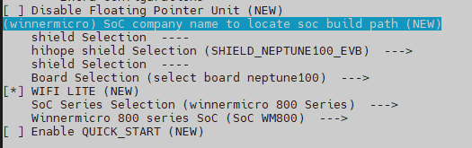

# Combo Solution – W800 Chip Porting Case

The combo solution is developed based on the OpenHarmony LiteOS-M kernel. This document exemplifies how to port code of the [Neptune100 development board](https://gitee.com/openharmony-sig/device_board_hihope) powered by the W800 chip from Winner Micro. The porting architecture uses the solution where Board and SoC are separated. Compilation options can be graphically configured through KConfig. The porting of the `ck804ef` architecture is added to adapt subsystems and components such as `HDF` and `XTS`.

## Adaptation Preparation

Prepare the ubuntu20.04 system environment and install the cross compilation toolchain [csky-abiv2-elf-gcc](https://occ.t-head.cn/community/download?id=3885366095506644992).

## Compilation and Building

### Directory Planning

This solution designs the directory structure using the [board and SoC decoupling idea](https://gitee.com/openharmony-sig/sig-content/blob/master/devboard/docs/board-soc-arch-design.md). 

The SoC adaptation directory is planned as follows:
   ```
   device
   ├── board                                --- Board vendor directory
   │   └── hihope                           --- Board vendor: HiHope
   │       └── neptune100                   --- Board name: Neptune100
   └── soc                                  --- SoC vendor directory
       └── winnermicro                      --- SoC vendor: Winner Micro
           └── wm800                        --- SoC series: W800
   ```

The planned product demo directory is as follows:

   ```
   vendor
   └── hihope                               --- Vendor of the product demo.
       ├── neptune_iotlink_demo             --- Product demo name: sample code of Neptune100
       └── ...
   ```

### Product Definition

The `vendor/hihope/neptune_iotlink_demo/config.json` file describes the kernel, board, and subsystem information used by the product. The kernel, board model, and board vendor are required by the precompilation command `hb set` and must be planned. Example:

   ```
   {
     "product_name": "neptune_iotlink_demo",   --- Product name
     "ohos_version": "OpenHarmony 3.1",        --- OS version in use
     "type":"mini",                            --- OS type: mini
     "version": "3.0",                         --- OS version: 3.0
     "device_company": "hihope",               --- Board vendor: hihope
     "board": "neptune100",                    --- Board name: neptune100
     "kernel_type": "liteos_m",                --- Kernel type: liteos_m
     "kernel_version": "3.0.0",                --- Kernel version: 3.0.0
     "subsystems": []                          --- Subsystem
   }
   ```
The filled information corresponds to the planned directory. In the information, `device_company` and `board` are used to associate the `device/board/<device_company>/` directory.

### Board Configuration

In the associated **\<board>** directory, place the `config.gni` file to the `device/board/hihope/neptune100/liteos_m` directory. This file is used to describe the board information, including the CPU model, cross compilation toolchain, global compilation, and link parameters.

```
# Kernel type, e.g. "linux", "liteos_a", "liteos_m".
kernel_type = "liteos_m"

# Kernel version.
kernel_version = "3.0.0"

# Board CPU type, e.g. "cortex-a7", "riscv32".
board_cpu = "ck804ef"

# Board arch, e.g.  "armv7-a", "rv32imac".
board_arch = "ck803"

# Toolchain name used for system compiling.
# E.g. gcc-arm-none-eabi, arm-linux-harmonyeabi-gcc, ohos-clang,  riscv32-unknown-elf.
# Note: The default toolchain is "ohos-clang". It's not mandatory if you use the default toolchain.
board_toolchain = "csky-elfabiv2-gcc"

#use_board_toolchain = true

# The toolchain path installed, it's not mandatory if you have added toolchain path to your ~/.bashrc.
board_toolchain_path = ""

# Compiler prefix.
board_toolchain_prefix = "csky-elfabiv2-"

# Compiler type, "gcc" or "clang".
board_toolchain_type = "gcc"

# config.json parse
if (product_path != "") {
  product_conf = read_file("${product_path}/config.json", "json")
  product_name = product_conf.product_name
  bin_list = product_conf.bin_list
}

# Board related common compile flags.
board_cflags = [
  "-mcpu=ck804ef",
  "-mhard-float",
  "-DGCC_COMPILE=1",
  "-DTLS_CONFIG_CPU_XT804=1",
  "-DNIMBLE_FTR=1",
  "-D__CSKY_V2__=1",
  "-DCPU_CK804",
  "-O2",
  "-g3",
  "-Wall",
  "-ffunction-sections",
  "-MMD",
  "-MP",
]

board_cxx_flags = board_cflags

board_asmflags = [
  "-mcpu=ck804ef",
  "-DCPU_CK804",
]

board_ld_flags = []

# Board related headfiles search path.
board_include_dirs = []

# Board adapter dir for OHOS components.
board_adapter_dir = ""

# Sysroot path.
board_configed_sysroot = ""

# Board storage type, it used for file system generation.
storage_type = ""
```

### Precompilation

Run the precompilation command `hb set` in the project root directory to show relevant product information, as shown below:

```
hb set
OHOS Which product do you need?  (Use arrow keys)

hihope
 > neptune_iotlink_demo

OHOS Which product do you need?  neptune_iotlink_demo
```

After `hb set` is executed, an `ohos_config.json` file will be automatically generated in the root directory. The file lists the product information to be compiled.

Run the `hb env` command to view the selected precompilation environment variables.

```
[OHOS INFO] root path: /home/xxxx/openharmony_w800
[OHOS INFO] board: neptune100
[OHOS INFO] kernel: liteos_m
[OHOS INFO] product: neptune_iotlink_demo
[OHOS INFO] product path: /home/xxxx/openharmony_w800/vendor/hihope/neptune_iotlink_demo
[OHOS INFO] device path: /home/xxxx/openharmony_w800/device/board/hihope/neptune100/liteos_m
[OHOS INFO] device company: hihope
```

So far, the precompilation adaptation is complete. However, the project cannot be compiled by running **hb build**. You also need to prepare for the subsequent LiteOS-M kernel porting.

## Kernel Porting

### Kconfig Adaptation

During the compilation of `kernel/liteos_m`, you need to use the `Kconfig` file for indexing in the corresponding board and SoC directory.

1. Create a **kernel_configs** directory in the `vendor/hihope/neptune_iotlink_demo` directory, and create an empty `debug.config` file.

2. Open the `kernel/liteos_m/Kconfig` file. Multiple `Kconfig` files in `device/board` and `device/soc` have been imported using the **orsource** command in this file. You need to create and modify these files later.

   ```
   orsource "../../device/board/*/Kconfig.liteos_m.shields"
   orsource "../../device/board/$(BOARD_COMPANY)/Kconfig.liteos_m.defconfig.boards"
   orsource "../../device/board/$(BOARD_COMPANY)/Kconfig.liteos_m.boards"
   orsource "../../device/soc/*/Kconfig.liteos_m.defconfig"
   orsource "../../device/soc/*/Kconfig.liteos_m.series"
   orsource "../../device/soc/*/Kconfig.liteos_m.soc"
   ```

3. Create corresponding `Kconfig` files in `device/board/hihope`.

   ```
   ├──  neptune100                                  --- neptune100 board configuration directory.
   │   ├── Kconfig.liteos_m.board                   --- Board configuration options.
   │   ├── Kconfig.liteos_m.defconfig.board         --- Default board configuration options.
   │   └── liteos_m
   │       └── config.gni                           --- Board configuration file.
   ├── Kconfig.liteos_m.boards                      --- Board configuration information of the board vendor.
   └── Kconfig.liteos_m.defconfig.boards            --- Default board configuration information of the board vendor.
   ```

4. Modify the `Kconfig` file in the `Board` directory.

   Add the following content to `neptune100/Kconfig.liteos_m.board`:

   ```
   config BOARD_NEPTUNE100
       bool "select board neptune100"
       depends on SOC_WM800
   ```

   Configure that **BOARD_NEPTUNE100** can be selected only when **SOC_WM800** is selected.

   Add the following content to `neptune100/Kconfig.liteos_m.defconfig.board`:

     ```
     if BOARD_NEPTUNE100

     endif #BOARD_NEPTUNE100
     ```

     This content is used to add the default configuration of **BOARD_NEPTUNE100**.

5. Create corresponding `Kconfig` files in `device/soc/winnermicro`.

   ```
   ├── wm800                                        --- W800 series.
   │   ├── Kconfig.liteos_m.defconfig.wm800         --- Default W800 SoC configuration.
   │   ├── Kconfig.liteos_m.defconfig.series        --- Default configuration of the W800 series.
   │   ├── Kconfig.liteos_m.series                  --- Configuration of the W800 series.
   │   └── Kconfig.liteos_m.soc                     --- W800 SoC configuration.
   ├── Kconfig.liteos_m.defconfig                   --- Default SoC configuration.
   ├── Kconfig.liteos_m.series                      --- Series configuration.
   └── Kconfig.liteos_m.soc                         --- SoC configuration.
   ```

6. Modify the `Kconfig` file in the `Soc` directory.

   Add the following content to `wm800/Kconfig.liteos_m.defconfig.wm800`:

   ```
    config SOC
       string
       default "wm800"
       depends on SOC_WM800
   ```

   Add the following content to `wm800/Kconfig.liteos_m.defconfig.series`:

   ```
   if SOC_SERIES_WM800

   rsource "Kconfig.liteos_m.defconfig.wm800"

   config SOC_SERIES
       string
       default "wm800"

   endif
   ```

   Add the following content to `wm800/Kconfig.liteos_m.series`:

   ```
   config SOC_SERIES_WM800
       bool "winnermicro 800 Series"
       select ARM
       select SOC_COMPANY_WINNERMICRO              --- Select SOC_COMPANY_WINNERMICRO.
       select CPU_XT804
       help
           Enable support for winnermicro 800 series
   ```

   **SOC_WM800** in the `wm800/Kconfig.liteos_m.soc` file can be selected only after **SOC_SERIES_WM800** is selected.

   ```
   choice
       prompt "Winnermicro 800 series SoC"
       depends on SOC_SERIES_WM800

   config SOC_WM800                         --- Select SOC_WM800.
       bool "SoC WM800"

   endchoice
   ```

   In conclusion, to compile **BOARD_NEPTUNE100**, you need to select **SOC_COMPANY_WINNERMICRO**, **SOC_SERIES_WM800**, and **SOC_WM800**.
7. Run `make menuconfig` in `kernel/liteos_m` for configuration selection. The SoC series can be selected.

   

   The configured file is saved to `vendor/hihope/neptune_iotlink_demo/kernel_configs/debug.config` by default. You can also directly configure `debug.config`.

   ```
   LOSCFG_PLATFORM_QEMU_CSKY_SMARTL=y
   LOSCFG_SOC_SERIES_WM800=y
   ```

### Modular Compilation

The compilation of `Board` and `SoC` adopts the modular compilation method, starting from `kernel/liteos_m/BUILD.gn` and increasing by level. The adaptation process of this solution is as follows:

1. Create the `BUILD.gn` file in `device/board/hihope` and add the following content to the file:

   ```
   if (ohos_kernel_type == "liteos_m") {
     import("//kernel/liteos_m/liteos.gni")
     module_name = get_path_info(rebase_path("."), "name")
     module_group(module_name) {
       modules = [
         "neptune100",                     --- Board module.
         "shields",
       ]
     }
   }
   ```

   In the preceding `BUILD.gn` file, **neptune100** and **shields** are the module names organized by directory level.

2. Create the `BUILD.gn` file in `device/soc/winnermicro` and add the following content to the file:

   ```
   if (ohos_kernel_type == "liteos_m") {
     import("//kernel/liteos_m/liteos.gni")
     module_name = get_path_info(rebase_path("."), "name")
     module_group(module_name) {
       modules = [
        "hals",
        "wm800",
       ]
     }
   }
   ```

3. In the `device/soc/winnermicro` module at each level, add the `BUILD.gn` file and compile the module. The following uses `device/soc/winnermicro/wm800/board/platform/sys/BUILD.gn` as an example:

   ```
   import("//kernel/liteos_m/liteos.gni")
   module_name = get_path_info(rebase_path("."), "name")
   kernel_module(module_name) {             --- Compiled module.
     sources = [                            --- Compiled source file.
       "wm_main.c",
     ]
     include_dirs = [                       --- Header file used in the module.
       ".",
     ]
   }
   
   ```

4. To organize links and some compilation options, set the following parameters in `config("board_config")` in `device/soc/winnermicro/wm800/board/BUILD.gn`:

   ```
   config("board_config") {
     ldflags = []                            --- Link parameters, including the Id file.
     libs = []                               --- Link library.
     include_dirs = []                       --- Common header file.
   ```


5. To organize some product applications, this solution adds a corresponding list to the `config.json` file of the vendor. The following uses `vendor/hihope/neptune_iotlink_demo/config.json` as an example to describe how to add a corresponding list to the `config.json` file:

   ```
    "bin_list": [                            --- demo list
      {
        "elf_name": "hihope",
        "enable": "false",                   --- List switch.
        "force_link_libs": [
          "bootstrap",
          "broadcast",
          ...
        ]
      }
   ```

   The demo is managed as a module. To enable or disable a demo, add or delete corresponding library files in **bin_list**. **bin_list** can be directly read in GN. You need to add the following content to `device/board/hihope/neptune100/liteos_m/config.gni`:

   ```
   # config.json parse
   if (product_path != "") {
     product_conf = read_file("${product_path}/config.json", "json")
     product_name = product_conf.product_name
     bin_list = product_conf.bin_list
   }
   ```

   After reading the list, you can add related component libraries to the corresponding link options. Add the following content to `//device/soc/winnermicro/wm800/BUILD.gn`:

   ```
   foreach(bin_file, bin_list) {
      build_enable = bin_file.enable
      ...
      if(build_enable == "true")
      {
        ...
        foreach(force_link_lib, bin_file.force_link_libs) {
        ldflags += [ "-l${force_link_lib}" ]
        }
        ...
      }
   }
   ```

### Kernel Subsystem Adaptation

Add the kernel subsystem and relevant configuration to `vendor/hihope/neptune_iotlink_demo/config.json`, as shown below:

   ```
   "subsystems": [
    {
      "subsystem": "kernel",
      "components": [
        { 
          "component": "liteos_m", "features":[] 
        }
      ]
   },
   ```

### Kernel Startup Adaptation

The Neptune100 development board uses the SoC architecture **ck804ef**, which is not supported by OpenHarmony. You need to port the architecture **ck804ef**. Adapt general files and function lists defined in `kernel\liteos_m\arch\include`, and place them to the `kernel\liteos_m\arch\csky\v2\ck804\gcc` directory.

The following is an example of kernel initialization:

   ```
   osStatus_t ret = osKernelInitialize();                    --- Kernel initialization.
   if(ret == osOK)
   {
     threadId = osThreadNew((osThreadFunc_t)sys_init,NULL,&g_main_task); --- Create the init thread.
     if(threadId!=NULL)
     {
       osKernelStart();                                          --- Thread scheduling.
     }
   }
   ```

Initialize necessary actions before **board_main** starts **OHOS_SystemInit**, as shown below:

   ```
   ...
   UserMain();         --- Initialize the driver before starting OHOS_SystemInit of OpenHarmony.
   ...
   OHOS_SystemInit();  --- Start OpenHarmony services and initialize components.
   ...
   ```

The **UserMain** function is in the `device/soc/winnermicro/wm800/board/app/main.c` file, as shown below:

   ```
   ...
   if (DeviceManagerStart()) {                                      --- HDF initialization.
       printf("[%s] No drivers need load by hdf manager!",__func__);
   }
   ...
   ```

### HDF Framework Adaptation

HDF provides a set of unified APIs for applications to access hardware, simplifying application development. To add the HDF component, you need to add it to `//vendor/hihope/neptune_iotlink_demo/kernel_configs`:

   ```
   LOSCFG_DRIVERS_HDF=y
   LOSCFG_DRIVERS_HDF_PLATFORM=y
   ```

Driver adaptation files are stored in `drivers/adapter/platform`, including the gpio, i2c, pwm, spi, uart, and watchdog drivers. These files are loaded using the HDF mechanism. This section uses GPIO and UART as an example.

#### GPIO Adaptation

1. The chip driver adaptation file is stored in the `drivers/adapter/platform` directory. Add the `gpio_wm.c` file to the **gpio** directory, and define the compilation adaptation of the W800 driver in `BUILD.gn`, as shown below:

   ```
   ...
   if (defined(LOSCFG_SOC_COMPANY_WINNERMICRO)) {
     sources += [ "gpio_wm.c" ]
   }
   ...
   ```

2. Define the driver description file in `gpio_wm.c` as follows:

   ```
   /* HdfDriverEntry definitions */
   struct HdfDriverEntry g_GpioDriverEntry = {
       .moduleVersion = 1,
       .moduleName = "WM_GPIO_MODULE_HDF",
       .Bind = GpioDriverBind,
       .Init = GpioDriverInit,
       .Release = GpioDriverRelease,
   };
   HDF_INIT(g_GpioDriverEntry);
   ```

3. Add the GPIO hardware description information to `device/board/hihope/shields/neptune100/neptune100.hcs`.

   ```
   root {
       platform {
        gpio_config {
            match_attr = "gpio_config";
            groupNum = 1;
            pinNum = 48;
        }
       }
   }
   ```

4. Obtain the **hcs** parameter from **GpioDriverInit** for initialization, as shown below:

   ```
    ...
    gpioCntlr = GpioCntlrFromHdfDev(device);        --- Obtain specific GPIO configurations through the **gpioCntlr** node variable.
    if (gpioCntlr == NULL) {
        HDF_LOGE("GpioCntlrFromHdfDev fail\r\n");
        return HDF_DEV_ERR_NO_DEVICE_SERVICE;
    }
    ...
   ```

#### UART Adaptation

1. The chip driver adaptation file is stored in the `drivers/adapter/platform` directory. Add the `uart_wm.c` file to the **uart** directory, and define the compilation adaptation of the W800 driver in `BUILD.gn`, as shown below:

   ```
   ...
   if (defined(LOSCFG_SOC_COMPANY_WINNERMICRO)) {
     sources += [ "uart_wm.c" ]
   }
   ...
   ```

2. Define the driver description file in `uart_wm.c` as follows:

   ```
   /* HdfDriverEntry definitions */
   struct HdfDriverEntry g_UartDriverEntry = {
       .moduleVersion = 1,
       .moduleName = "W800_UART_MODULE_HDF",
       .Bind = UartDriverBind,
       .Init = UartDriverInit,
       .Release = UartDriverRelease,
   };

   /* Initialize HdfDriverEntry */
   HDF_INIT(g_UartDriverEntry);
   ```

3. Add the UART hardware description information to `device/board/hihope/shields/neptune100/neptune100.hcs`.

   ```
   root {
       platform {
        uart_config {
        /*
            uart0 {
                match_attr = "uart0_config";
                num = 0;
                baudrate = 115200;
                parity = 0;
                stopBit = 1;
                data = 8;
            }*/
            uart1 {
                match_attr = "uart1_config";
                num = 1;
                baudrate = 115200;
                parity = 0;
                stopBit = 1;
                data = 8;
            }
         }
      }
   }
   ```

4. Obtain the **hcs** parameter from **UartDriverInit** for initialization, as shown below:

   ```
    ...
    host = UartHostFromDevice(device);
    if (host == NULL) {
        HDF_LOGE("%s: host is NULL", __func__);
        return HDF_ERR_INVALID_OBJECT;
    }
    ...
   ```

## OpenHarmony Subsystem Adaptation

Subsystem compilation options are configured in the `config.json` file of the corresponding product, for example, `vendor/hihope/neptune_iotlink_demo/config.json`.

### wifi_lite Component

Add the `wifi_lite` component of the `communication` subsystem to the `config.json` file, as shown below:

   ```
   {
     "subsystem": "communication",
     "components": [
       {
         "component": "wifi_lite",
         "optional": "true"
       }
     ]
   },
   ```

The `wifi_lite` component is in the `build/lite/components/communication.json` file, which is described as follows:

   ```
   {
     "component": "wifi_lite",
     "targets": [
       "//foundation/communication/wifi_lite:wifi"       --- Compilation target of the wifi_lite component.
     ]
   },
   ```

In this case, the `wifi` adaptation source code can be checked in `device/soc/winnermicro/wm800/board/src/wifi/wm_wifi.c`, which is shown below:

   ```
   int tls_wifi_netif_add_status_event(tls_wifi_netif_status_event_fn event_fn)   --- Used to add the wifi event function.
   {
     u32 cpu_sr;
     struct tls_wifi_netif_status_event *evt;
     //if exist, remove from event list first.
     tls_wifi_netif_remove_status_event(event_fn);
     evt = tls_mem_alloc(sizeof(struct tls_wifi_netif_status_event));
     if(evt==NULL)
         return -1;
     memset(evt, 0, sizeof(struct tls_wifi_netif_status_event));
     evt->status_callback = event_fn;
     cpu_sr = tls_os_set_critical();
     dl_list_add_tail(&wifi_netif_status_event.list, &evt->list);
     tls_os_release_critical(cpu_sr);

     return 0;
   }
   ```

### systemabilitymgr Subsystem Adaptation
To adapt the **systemabilitymgr** subsystem, you need to add the `samgr_lite` component to the `config.json` file, as shown below:

   ```
   {
     "subsystem": "systemabilitymgr",
     "components": [
       {
         "component": "samgr_lite"
       }
     ]
   },
   ```

### utils Subsystem Adaptation

To adapt the utils subsystem, you need to add the `kv_store` and `file` components to the `config.json` file, as shown below:

   ```
   {
     "subsystem": "utils",
     "components": [
       {
         "component": "kv_store",
         "features": [
           "enable_ohos_utils_native_lite_kv_store_use_posix_kv_api = true"
         ]
       },
       { "component": "file", "features":[] }
     ]
   },
   ```

When the `kv_store` component is adapted, key-value pairs will be written to the file. In the lite system, file operation APIs include `POSIX` and `HalFiles`.
The `POSIX` API is used for accessing the file system in the kernel. Therefore, you need to add `enable_ohos_utils_native_lite_kv_store_use_posix_kv_api = true` to `features`.

### Startup Subsystem Adaptation

To adapt the startup subsystem, you need to add the `bootstrap_lite` and `syspara_lite` components to the `config.json` file, as shown below:

   ```
   {
     "subsystem": "startup",
     "components": [
       {
         "component": "bootstrap_lite"
       },
       {
         "component": "syspara_lite",
         "features": [
           "enable_ohos_startup_syspara_lite_use_posix_file_api = true",
           "config_ohos_startup_syspara_lite_data_path = \"/data/\""
         ]
       }
     ]
   },
   ```

When adapting the **bootstrap_lite** component, you need to manually add the following content to the link script file `device/soc/winnermicro/wm800/board/ld/w800/gcc_csky.ld`:

   ```
   .zinitcall_array :
   {
    . = ALIGN(0x4) ;
    PROVIDE_HIDDEN (__zinitcall_core_start = .);
    KEEP (*(SORT(.zinitcall.core*)))
    KEEP (*(.zinitcall.core*))
    PROVIDE_HIDDEN (__zinitcall_core_end = .);
    . = ALIGN(0x4) ;
    PROVIDE_HIDDEN (__zinitcall_device_start = .);
    KEEP (*(SORT(.zinitcall.device*)))
    KEEP (*(.zinitcall.device*))
    PROVIDE_HIDDEN (__zinitcall_device_end = .);
    . = ALIGN(0x4) ;
    PROVIDE_HIDDEN (__zinitcall_bsp_start = .);
    KEEP (*(SORT(.zinitcall.bsp*)))
    KEEP (*(.zinitcall.bsp*))
    PROVIDE_HIDDEN (__zinitcall_bsp_end = .);
    . = ALIGN(0x4) ;
    PROVIDE_HIDDEN (__zinitcall_sys_service_start = .);
    KEEP (*(SORT(.zinitcall.sys.service*)))
    KEEP (*(.zinitcall.sys.service*))
    PROVIDE_HIDDEN (__zinitcall_sys_service_end = .);
    . = ALIGN(0x4) ;
    PROVIDE_HIDDEN (__zinitcall_app_service_start = .);
    KEEP (*(SORT(.zinitcall.app.service*)))
    KEEP (*(.zinitcall.app.service*))
    PROVIDE_HIDDEN (__zinitcall_app_service_end = .);
    . = ALIGN(0x4) ;
    PROVIDE_HIDDEN (__zinitcall_sys_feature_start = .);
    KEEP (*(SORT(.zinitcall.sys.feature*)))
    KEEP (*(.zinitcall.sys.feature*))
    PROVIDE_HIDDEN (__zinitcall_sys_feature_end = .);
    . = ALIGN(0x4) ;
    PROVIDE_HIDDEN (__zinitcall_app_feature_start = .);
    KEEP (*(SORT(.zinitcall.app.feature*)))
    KEEP (*(.zinitcall.app.feature*))
    PROVIDE_HIDDEN (__zinitcall_app_feature_end = .);
    . = ALIGN(0x4) ;
    PROVIDE_HIDDEN (__zinitcall_run_start = .);
    KEEP (*(SORT(.zinitcall.run*)))
    KEEP (*(.zinitcall.run*))
    PROVIDE_HIDDEN (__zinitcall_run_end = .);
    . = ALIGN(0x4) ;
    PROVIDE_HIDDEN (__zinitcall_test_start = .);
    KEEP (*(SORT(.zinitcall.test*)))
    KEEP (*(.zinitcall.test*))
    PROVIDE_HIDDEN (__zinitcall_test_end = .);
    . = ALIGN(0x4) ;
    PROVIDE_HIDDEN (__zinitcall_exit_start = .);
    KEEP (*(SORT(.zinitcall.exit*)))
    KEEP (*(.zinitcall.exit*))
    PROVIDE_HIDDEN (__zinitcall_exit_end = .);
   } > REGION_RODATA
   ```

Adding the preceding content is because external APIs provided by `bootstrap_init` uses the segment injection mode and will be saved to the link segment. For details, see `utils/native/lite/include/ohos_init.h`. The following table lists the automatic initialization macros of main services.

| API                | Description                            |
| ---------------------- | -------------------------------- |
| SYS_SERVICE_INIT(func) | Entry for initializing and starting a core system service.|
| SYS_FEATURE_INIT(func) | Entry for initializing and starting a core system feature.|
| APP_SERVICE_INIT(func) | Entry for initializing and starting an application-layer service.  |
| APP_FEATURE_INIT(func) | Entry for initializing and starting an application-layer feature.  |


The **lib** file compiled using the loaded components needs to be manually add to the forcible link.

If the `bootstrap_lite` component is configured in `vendor/hihope/neptune_iotlink_demo/config.json`:

   ```
   {
     "subsystem": "startup",
     "components": [
       {
         "component": "bootstrap_lite"
       },
       ...
     ]
   },
   ```

The `bootstrap_lite` component will compile the `base/startup/bootstrap_lite/services/source/bootstrap_service.c` file. In this file, `SYS_SERVICE_INIT` is used to inject the `Init` function symbol to `__zinitcall_sys_service_start` and `__zinitcall_sys_service_end`. Since the `Init` function does not support explicit call, you need to forcibly link it to the final image, as shown below:

   ```
   static void Init(void)
   {
       static Bootstrap bootstrap;
       bootstrap.GetName = GetName;
       bootstrap.Initialize = Initialize;
       bootstrap.MessageHandle = MessageHandle;
       bootstrap.GetTaskConfig = GetTaskConfig;
       bootstrap.flag = FALSE;
       SAMGR_GetInstance()->RegisterService((Service *)&bootstrap);
   }
   SYS_SERVICE_INIT(Init);   --- Forcible link to the generated lib file is required if SYS_INIT is used for startup.
   ```

The `base/startup/bootstrap_lite/services/source/BUILD.gn` file describes `libbootstrap.a` generated in `out/neptune100/neptune_iotlink_demo/libs`, as shown below:

   ```
   static_library("bootstrap") {
     sources = [
       "bootstrap_service.c",
       "system_init.c",
     ]
     ...
   ```


When the `syspara_lite` component is adapted, system parameters will be written into the file for persistent storage. In the lite system, file operation APIs include **POSIX** and **HalFiles**.

The **POSIX** API is used for accessing the file system in the kernel. Therefore, you need to add `enable_ohos_startup_syspara_lite_use_posix_file_api = true` to the **features** field.

### XTS Subsystem Adaptation

To adapt the XTS subsystem, add the following component options to `config.json`:

   ```
   {
    "subsystem": "xts",
    "components": [
      { 
        "component": "xts_acts",
        "features":
           [
          "config_ohos_xts_acts_utils_lite_kv_store_data_path = \"/data\"",
          "enable_ohos_test_xts_acts_use_thirdparty_lwip = true"
        ]
      },
      { "component": "xts_tools", "features":[] }
    ]
   }
   ```

The XTS function is also organized using **list**. You can add or delete relevant modules in the `config.json` file.

   ```
   "bin_list": [
     {
       "enable": "true",
       "force_link_libs": [
          "module_ActsParameterTest",
          "module_ActsBootstrapTest",
          "module_ActsDfxFuncTest",
          "module_ActsHieventLiteTest",
          "module_ActsSamgrTest",
          "module_ActsUtilsFileTest",
          "module_ActsKvStoreTest",
          "module_ActsWifiServiceTest"
       ]
     }
   ],
   ```

The adaptation process of other components is similar to that of other vendors.
