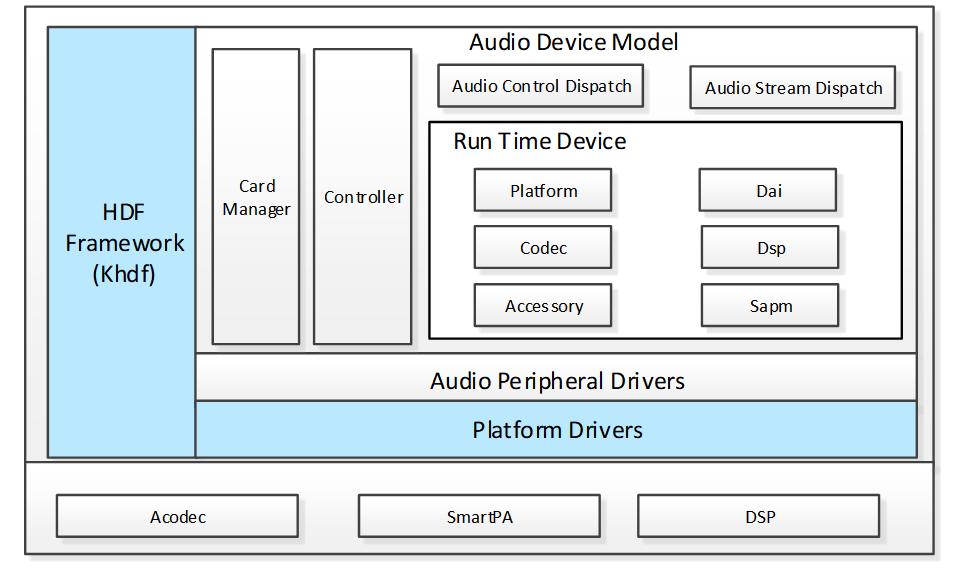
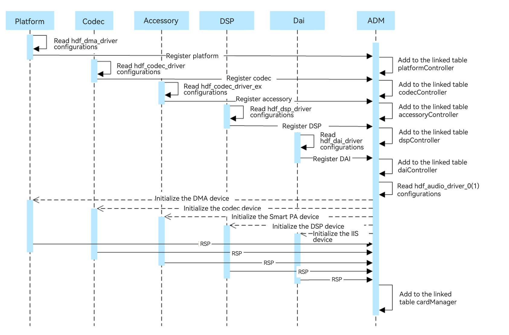
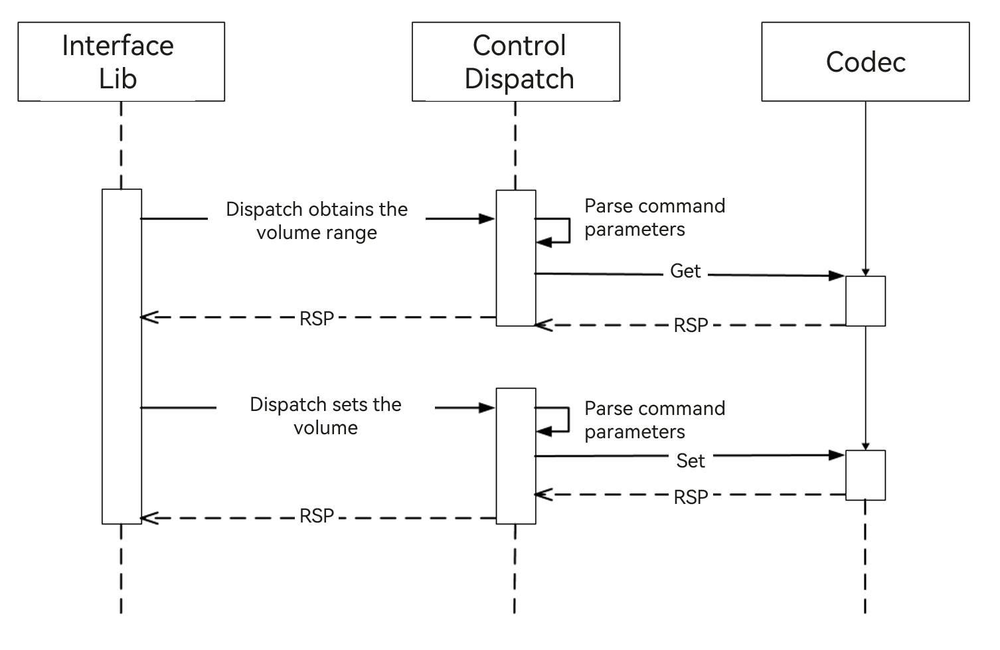
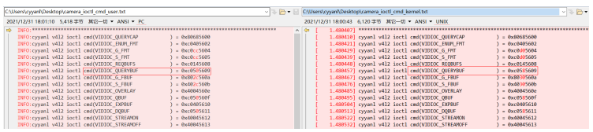

# Standard System Solution – Yangfan Porting Case

This document describes how to port standard system functions based on the yangfan development board of the RK3399 chip from Rockchip. The porting processing mainly includes product configuration adding, kernel startup and upgrade, ADM-based conversion of audio, case summary of the camera, TP, LCD, Wi-Fi, BT, vibrator, sensor, and graphics display modules, as well as related function adaptation.
The development board system porting uses the solution where the board warehouse and SoC code are separated. The board warehouse stores adaptation code of on-board modules, such as audio, camera, TP, and Wi-Fi. The SoC warehouse stores adaptation codes of SoC driver modules, such as I2C, ISP, and RGA.

## Product Configuration and Directory Planning

### Product Configuration

Create a **config.json** file in the `//vendor/yangfan` directory of the product and specify the CPU architecture. Configuration of `//vendor/yangfan/rk3399.json` is as follows:

```
{
    "product_name": "yangfan",--- Product name: yangfan
    "device_company": "rockchip",--- Board vendor: Rockchip
    "device_build_path": "device/board/isoftstone/yangfan",--- Device building path: device/board/isoftstone/yangfan
    "target_cpu": "arm",--- Target CPU: arm
    "type": "standard",--- OS type: standard
    "version": "3.0",--- Version: 3.0
    "board": "yangfan",--- Board name: yangfan
    "enable_ramdisk": true,--- Enable memory virtual disk: true
    "build_selinux": true,--- Build selinux: true
    "inherit": [ "productdefine/common/inherit/rich.json", "productdefine/common/inherit/chipset_common.json" ],
    "subsystems": [
    {
      "subsystem": "security",
      "components": [
        {
          "component": "selinux",
          "features": []
        }
      ]
    },
    {
      "subsystem": "communication",
      "components": [
        {
          "component": "netmanager_ext",
          "features": []
        }
      ]
    },
    ...
}
```


The main configurations are as follows:

1. "product_name": "yangfan",--- Product name: yangfan
2. "device_company": "rockchip",--- Board vendor: Rockchip
3. "device_build_path": "device/board/isoftstone/yangfan",--- Device building path: device/board/isoftstone/yangfan
4. "target_cpu": "arm",--- Target CPU: arm
5. "type": "standard",--- OS type: standard
6. "version": "3.0",--- Version: 3.0
7. "board": "yangfan",--- Board name: yangfan
8. "enable_ramdisk": true,--- Enable memory virtual disk: true

You can find defined subsystems in `//build/subsystem_config.json`. You can also customize subsystems.

You are advised to copy the configuration file of Hi3516DV300 and delete the **hisilicon_products** subsystem, which is used to compile the kernel for Hi3516DV300 and is not suitable for RK3568.

### Directory Planning

This solution designs the directory structure using the [board and SoC decoupling idea](https://gitee.com/openharmony-sig/sig-content/blob/master/devboard/docs/board-soc-arch-design.md), and plans the SoC adaptation directory as follows:

```
device
├── board                                --- Board vendor directory
│   └── isoftstone                       --- Board vendor
│       └── yangfan                      --- Board name: yangfan
└── soc									 --- SoC vendor directory
    └── rockchip                         --- SoC vendor: Rockchip
        └── rk3399						 --- SoC series: RK3399, mainly solutions provided by the SoC manufacturer and closed-source libraries
        
        
```
The planned product demo directory is as follows:
```
vendor
└── isoftstone					
    └── yangfan         			         --- Product name: product, HCS, and demo related
```

## **Kernel Startup**

### Secondary Boot

Unlike traditional boot that directly mounts **system** and boots using **init** of **system**, secondary boot is to mount **ramdsik**, boot using **init** of **ramdsik**, perform necessary initialization operations (such as mounting the **system** and **vendor** partitions, and then switch to **init** of **system**.

RK3399 adaptation is to pack **ramdisk** compiled in the mainline version into **boot_linux.img**. The procedure is as follows:

1. Enable secondary boot.

Enable **enable_ramdisk** in **//vendor/yangfan/rk3399.json**.

  ```
  {
      "product_name": "yangfan",
      "device_company": "rockchip",
      "device_build_path": "device/board/isoftstone/yangfan",
      "target_cpu": "arm",
      "type": "standard",
      "version": "3.0",
      "board": "yangfan",
      "enable_ramdisk": true,
      "build_selinux": true,
      ...
  }
  ```

2. Pack the **ramdsik.img** file compiled in the mainline version to **boot_linux.img**.

Configuration:

RK supports **uboot** from **ramdisk**. You only need to add **ramdisk.img** to the configuration file of the packed **boot_linux.img**. Therefore, the **its** format of the mainline version is not used. Specifically, add the following content to the kernel compilation script **make-ohos.sh**:

```
function make_extlinux_conf()
{
	dtb_path=$1
	uart=$2
	image=$3
	
	echo "label rockchip-kernel-5.10" > ${EXTLINUX_CONF}
	echo "	kernel /extlinux/${image}" >> ${EXTLINUX_CONF}
	echo "	fdt /extlinux/${TOYBRICK_DTB}" >> ${EXTLINUX_CONF}
	if [ "enable_ramdisk" == "${ramdisk_flag}" ]; then
		echo "	initrd /extlinux/ramdisk.img" >> ${EXTLINUX_CONF}
	fi
	cmdline="append earlycon=uart8250,mmio32,${uart} root=PARTUUID=614e0000-0000-4b53-8000-1d28000054a9 rw rootwait rootfstype=ext4"
	echo "  ${cmdline}" >> ${EXTLINUX_CONF}
}
```

### Packing

Add the **make-boot.sh** script for packing the boot image. This script can be called when the boot image is packed after **ramdisk** is compiled. The main content is as follows:

```
genext2fs -B ${blocks} -b ${block_size} -d boot_linux -i 8192 -U boot_linux.img
```

For details about modification for calling **make-boot.sh**, see [RK3568 adaptation to secondary boot]( https://gitee.com/openharmony/build/pulls/569/files).

### INIT Configuration

For details about the init configuration, see [Startup Subsystem](https://gitee.com/openharmony/docs/blob/master/zh-cn/readme/%E5%90%AF%E5%8A%A8%E6%81%A2%E5%A4%8D%E5%AD%90%E7%B3%BB%E7%BB%9F.md).

## **Audio**

### Introduction

This section describes how to develop the audio driver framework based on the Hardware Driver Foundation (HDF) in OpenHarmony 3.0, including detailed introduction to the composition of the audio driver framework, functional component implementation, and service nodes.



1. Audio Driver Model (ADM)

   The ADM helps system developers to develop scenario-specific applications for the multimedia audio subsystem. With the ADM, codec and DSP device vendors can adapt their driver code based on the APIs provided by the ADM and implement quick development and easy adaptation to HarmonyOS.

2. Audio Control Dispatch

   The Audio Control Dispatch dispatches the control instructions from the Audio Interface Lib to the driver layer.

3. Audio Stream Dispatch

   The Audio Control Dispatch receives data streams from the Audio Interface Lib and distributes the data streams to the driver layer.

4. Card Manager

   The Card Manager manages multiple audio adapters. Each audio adapter consists of the digital audio interface (DAI), platform, codec, accessory, DSP, and Smart Audio Power Manager (SAPM) modules.

5. Platform Driver

   The Platform Driver is the driver adaptation layer.

6. Smart Audio Power Manager (SAPM)

   The SAPM is the power manager module that optimizes the power consumption policies of the entire ADM power.

### Audio Driver Introduction

#### Code Directory

```
drivers
	├── framework
	│	└── model
	│	│	└── audio					# Framework code
	│	│		├─── common				# Common implementation
	│	│		├─── core				# Core
	│	│		├─── dispatch			# Control stream and data stream implementation
	│	│		└── sapm				# Power manager
	│	└── include
	│		└── audio					# External API
	├── adapter
    │	└──khdf
	│		└── linux
	│			└── model
	│				└── audio			# Compilation file
	└── peripheral
		└── audio
			└── chipsets		
				└── rk3399				# Driver implementation
					├── accessory		#SmartPA driver
					├── dai				#I2S driver
					└── soc				#Dma driver
```

#### Audio Process Description

##### Startup Process



1. When the system starts, the platform, codec, accessory, DSP, and DAI drivers of the audio module are loaded first. Each driver obtains the configuration information from its configuration file and saves the obtained information to the data structures.
2. Each driver module calls the ADM registration interface to add itself to the linked list of the driver module.
3. The ADM module reads configurations of hdf_audio_driver_0 (audio card_0) and hdf_audio_driver_1 (audio card_1), and loads specific devices of each module.
4. The ADM module initializes each module device by calling the initialization API of the respective module.
5. The initialized audio devices are added to the **cardManager** linked list.

##### Playback Process


1. The Interface Lib dispatches the **Render Open** instruction through the service launched by the driver for handling the playback streaming (referred to as driver service hereinafter). Upon receiving the instruction, the Stream Dispatch service calls the API of each module to deliver the instruction.
2. The Audio Interface Lib sends a path selection instruction to the Control Dispatch service. The Control Dispatch service calls the DAI API to set the path.
3. The Interface Lib dispatches hardware parameters through the driver service. Upon receiving the parameters, the Stream Dispatch service calls the API of each module to set hardware parameters.
4. The Interface Lib dispatches the start playing instruction through the driver service. Upon receiving the instruction, the Stream Dispatch service calls the API of each module to perform related settings for each module.
5. The Interface Lib dispatches audio data through the driver service. Upon receiving the data, the Stream Dispatch service calls the **Platform AudioPcmWrite** API to send the audio data to direct memory access (DMA).
6. The Interface Lib dispatches the stop playing instruction through the driver service. Upon receiving the instruction, the Stream Dispatch service calls the stop API of each module to perform related settings for each module.
7. The Interface Lib dispatches the **Render Close** instruction through the driver service. Upon receiving the instruction, the Stream Dispatch service calls the **Platform AudioRenderClose** API to release resources.

##### Control Process



1. To adjust the volume, the Audio Interface Lib sends an instruction for obtaining the volume range to the Control Dispatch service. The Control Dispatch service parses the instruction and calls **get()** of the codec module to obtain the volume range.
2. The Audio Interface Lib sends an instruction for setting the volume to the Control Dispatch service. The Control Dispatch service parses the instruction and calls **Set()** of the codec module to set the volume.

#### Implementation Description

1. Driver registration

   Take the registration function of codec as an example. When the codec driver is initialized, the following codec registration function is called to register codec with the **codecController** linked list.

   ```c
   int32_t AudioRegisterCodec(struct HdfDeviceObject *device, struct CodecData *codecData, struct DaiData *daiData)
   {
   ...
   
       codec = (struct CodecDevice *)OsalMemCalloc(sizeof(*codec));
   ...
   
       OsalMutexInit(&codec->mutex);
       codec->devCodecName = codecData->drvCodecName;
       codec->devData = codecData;
       codec->device = device;
   
       ret = AudioSocRegisterDai(device, daiData);
   ...
       DListInsertHead(&codec->list, &codecController); 
   ...
   }
   ```

2. Data stream data distribution

   During audio recording or playback, the Lib layer distributes or reads data using Dispatch. After receiving the request from the Lib layer, the API distributes or returns the data.

   ```c
   static int32_t StreamDispatch(struct HdfDeviceIoClient *client, int cmdId,
       struct HdfSBuf *data, struct HdfSBuf *reply)
   {
       unsigned int count = sizeof(g_streamDispCmdHandle) / sizeof(g_streamDispCmdHandle[0]);
       for (unsigned int i = 0; i < count; ++i) {
           if ((cmdId == (int)(g_streamDispCmdHandle[i].cmd)) && (g_streamDispCmdHandle[i].func != NULL)) {
               return g_streamDispCmdHandle[i].func(client, data, reply);
           }
       }
       ADM_LOG_ERR("invalid [cmdId=%d]", cmdId);
       return HDF_FAILURE;
   }
   ```

3. Control function registration API

   Control functions such as volume control, gain control, and channel control are added to the audio adapter control list using this API.

   ```c
   int32_t AudioAddControls(struct AudioCard *audioCard, const struct AudioKcontrol *controls, int32_t controlMaxNum)
   {
   ...
   
       for (i = 0; i < controlMaxNum; i++) {
           control = AudioAddControl(audioCard, &controls[i]);
           if (control == NULL) {
               ADM_LOG_ERR("Add control fail!");
               return HDF_FAILURE;
           }
           DListInsertHead(&control->list, &audioCard->controls);
       }
       ADM_LOG_DEBUG("Success.");
       return HDF_SUCCESS;
   }
   ```

4. Power management API

   Add component implementation:

   ```c
   int32_t AudioSapmNewComponents(struct AudioCard *audioCard,
       const struct AudioSapmComponent *component, int32_t cptMaxNum)
   {
   ...
   
       for (i = 0; i < cptMaxNum; i++) {
           ret = AudioSapmNewComponent(audioCard, component);
           if (ret != HDF_SUCCESS) {
               ADM_LOG_ERR("AudioSapmNewComponent fail!");
               return HDF_FAILURE;
           }
           component++;
       }
   
       return HDF_SUCCESS;
   }
   
   ```

   Add channel implementation:

   ```c
   
   int32_t AudioSapmAddRoutes(struct AudioCard *audioCard, const struct AudioSapmRoute *route, int32_t routeMaxNum)
   {
   ...
   
       for (i = 0; i < routeMaxNum; i++) {
           ret = AudioSapmAddRoute(audioCard, route);
           if (ret != HDF_SUCCESS) {
               ADM_LOG_ERR("AudioSapmAddRoute failed!");
               return HDF_FAILURE;
           }
           route++;
       }
       return HDF_SUCCESS;
   }
   
   ```

   Add control function implementation:

   ```c
   
   int32_t AudioSapmNewControls(struct AudioCard *audioCard)
   {
   ...
   
       DLIST_FOR_EACH_ENTRY(sapmComponent, &audioCard->components, struct AudioSapmComponent, list) {
           if (sapmComponent->newCpt) {
               continue;
           }
           if (sapmComponent->kcontrolsNum > 0) {
               sapmComponent->kcontrols = OsalMemCalloc(sizeof(struct AudioKcontrol*) * sapmComponent->kcontrolsNum);
               if (sapmComponent->kcontrols == NULL) {
                   ADM_LOG_ERR("malloc kcontrols fail!");
                   return HDF_FAILURE;
               }
           }
   
           switch (sapmComponent->sapmType) {
               case AUDIO_SAPM_ANALOG_SWITCH:
               case AUDIO_SAPM_MIXER:
               case AUDIO_SAPM_MIXER_NAMED_CTRL:
               case AUDIO_SAPM_SPK:
               case AUDIO_SAPM_PGA:
                   ret = AudioSapmNewMixerControls(sapmComponent, audioCard);
                   break;
               case AUDIO_SAPM_MUX:
               case AUDIO_SAPM_VIRT_MUX:
               case AUDIO_SAPM_VALUE_MUX:
                   ret = AudioSapmNewMuxControls(sapmComponent, audioCard);
                   break;
               default:
                   ret = HDF_SUCCESS;
                   break;
           }
   ...
   
           ReadInitComponentPowerStatus(sapmComponent);
           sapmComponent->newCpt = 1;
           DListInsertTail(&sapmComponent->dirty, &audioCard->sapmDirty);
       }
   
       ret = AudioSapmPowerComponents(audioCard);
   ...
   
       return HDF_SUCCESS;
   }
   
   ```

5. Control stream data distribution

   During audio recording or playback, the Lib layer delivers the control instruction using Dispatch. After receiving the instruction, the API distributes the instruction to each driver module.

   ```c
   static int32_t ControlDispatch(struct HdfDeviceIoClient *client, int cmdId,
       struct HdfSBuf *data, struct HdfSBuf *reply)
   {
   ...
   
       if (cmdId >= AUDIODRV_CTRL_IOCTRL_ELEM_BUTT || cmdId < 0) {
           ADM_LOG_ERR("Invalid [cmdId=%d].", cmdId);
           return HDF_FAILURE;
       }
   
       for (i = 0; i < HDF_ARRAY_SIZE(g_controlDispCmdHandle); ++i) {
           if ((cmdId == (int)(g_controlDispCmdHandle[i].cmd)) && (g_controlDispCmdHandle[i].func != NULL)) {
               return g_controlDispCmdHandle[i].func(client, data, reply);
           }
       }
       return HDF_FAILURE;
   }
   ```

### Audio Service Introduction

#### Service Node

Three services are provided for the HDI layer based on the audio driver of the ADM framework: hdf_audio_render, hdf_audio_capture, and hdf_audio_control.
The audio driver service nodes of the development board are as follows:

```
console:/dev # ls -al hdf_audio_*                                              
crw------- 1 system system 249,   5 1970-01-01 00:21 hdf_audio_capture  // Audio recording data stream service.
crw------- 1 system system 249,   3 1970-01-01 00:21 hdf_audio_codec_dev0  // Audio device name.
crw------- 1 system system 249,   4 1970-01-01 00:21 hdf_audio_control  // Audio control stream service.
crw------- 1 system system 249,   6 1970-01-01 00:21 hdf_audio_render  // Playback data stream service.
```

1. Audio control stream service

   This service receives control instructions from the Lib layer, including the volume control, gain control, and channel control instructions. These control instructions are distributed to the driver through the control stream service.

2. Audio data playback service

   This service receives audio data and playback parameters from the Lib layer, as well as instructions for starting, pausing, resuming, and stopping the playback. These instructions are distributed to the driver through the audio data and playback service.

3. Audio recording service

   This service transmits audio data to the Lib layer and receives audio recording parameters from the Lib layer, as well as receive instructions for starting, pausing, resuming, and stopping audio recording. These instructions are distributed to the driver through the audio recording service.

#### Driver Service

Each audio device includes the following services.

| **hdf_audio_codec_dev0** | **Audio Device**      |
| ------------------------ | ---------------------- |
| dma_service_0            | DMA driver service          |
| dai_service              | CPU DAI driver service      |
| codec_service_0          | Codec driver service        |
| dsp_service_0            | (Optional) DSP driver service|

| **hdf_audio_codec_dev1** | **Audio Device**                 |
| ------------------------ | --------------------------------- |
| dma_service_0            | DMA driver service                     |
| dai_service              | CPU DAI driver service                 |
| codec_service_1          | Accessory driver service (SmartPA)|
| dsp_service_0            | (Optional) DSP driver service           |

#### Code Path

```
vendor/rockchip/rk3399/hdf_config/khdf
├── audio 							# Audio private configuration file
├── device_info
|	└── device_info.hcs				# Device configuration file
└── hdf.hcs							# Reference the HCS configuration file		
```

#### Configuration Node Description

Take the codec driver as an example. Add the codec node information to the **audio host** node in the **device_info.hcs** file.

```
        audio :: host {
            hostName = "audio_host";
            priority = 60;
...
            device_codec :: device {
                device0 :: deviceNode {
                    policy = 1;
                    priority = 50;
                    preload = 0;
                    permission = 0666;
                    moduleName = "CODEC_ES8316";
                    serviceName = "codec_service_0";
                    deviceMatchAttr = "hdf_codec_driver";
                }
            }
...
        }
```

#### Driver Implementation

Modify the driver file to implement the driver logic that is the same as that of **moduleName** of **device_info.hcs**.

```
/* HdfDriverEntry implementations */
static int32_t Es8316DriverBind(struct HdfDeviceObject *device)
{
...
    return HDF_SUCCESS;
}

static int32_t Es8316DriverInit(struct HdfDeviceObject *device)
{
...
    return HDF_SUCCESS;
}

/* HdfDriverEntry definitions */
struct HdfDriverEntry g_es8316DriverEntry = {
    .moduleVersion = 1,
    .moduleName = "CODEC_ES8316",
    .Bind = Es8316DriverBind,
    .Init = Es8316DriverInit,
    .Release = NULL,
};
HDF_INIT(g_es8316DriverEntry);
```

### Summary

		A unified architecture is provided for audio development of OpenHarmony and unified APIs are provided for audio drivers of various platforms based on the ADM of the HDF framework. Audio drivers developed for one platform can be applied to multiple platforms, improving the development efficiency. This document briefly introduces the ADM to help developers develop their applications.

## **Camera**

### Introduction

This section describes how to develop the audio driver framework based on the Hardware Driver Foundation (HDF) in OpenHarmony 3.0, including detailed introduction to the composition of the camera driver framework, functional component implementation, and service nodes.

### Camera driver framework

                                                                  OpenHarmony HDF camera driver module architecture


The following uses the camera host as an example:

1. HDI implementation: implements standard device APIs for OpenHarmony cameras.
2. PipelineCorer: connects to the HDI implementation layer for control instruction and stream transfer, establishes data channels, and manages camera devices.
3. Platform Adaptation: shields the differences between bottom-layer chips and OSs for multi-platform adaptation.

According to analysis of the USB camera of RK3399E/T, Linux 4.19 is used as the kernel. The USB camera depends on the UVC of V4L2 under Linux. According to the architecture diagram, the HDF camera is compatible with the UVC of V4L2 under Linux. Therefore, you need to ensure that the USB and camera drivers required by the UVC are normal before debugging.


### Camera Driver Introduction

#### Configuration

arch/arm64/configs/rockchip_linux_defconfig

```c
CONFIG_VIDEO_V4L2_SUBDEV_API=y
CONFIG_MEDIA_USB_SUPPORT=y
CONFIG_USB_VIDEO_CLASS=y
```

#### Node Information

Before inserting the USB camera:

```
# ls -l dev/video*
crw-rw---- 1 root root 81,   0 2013-01-18 10:59 dev/video0
crw-rw---- 1 root root 81,   1 2013-01-18 10:59 dev/video1
crw-rw---- 1 root root 81,   2 2013-01-18 10:59 dev/video2
crw-rw---- 1 root root 81,   3 2013-01-18 10:59 dev/video3
crw-rw---- 1 root root 81,   4 2013-01-18 10:59 dev/video4
crw-rw---- 1 root root 81,   5 2013-01-18 10:59 dev/video5
crw-rw---- 1 root root 81,   6 2013-01-18 10:59 dev/video6
crw-rw---- 1 root root 81,   7 2013-01-18 10:59 dev/video7
crw-rw---- 1 root root 81,   8 2013-01-18 10:59 dev/video8
crw-rw---- 1 root root 81,   9 2013-01-18 10:59 dev/video9
#
```

After inserting the USB camera, add the **dev/video10** and **dev/video11** nodes.

```
# ls -l dev/video*
crw-rw---- 1 root root 81,   0 2013-01-18 10:59 dev/video0
crw-rw---- 1 root root 81,   1 2013-01-18 10:59 dev/video1
crw------- 1 root root 81,  10 2013-01-18 11:01 dev/video10
crw------- 1 root root 81,  11 2013-01-18 11:01 dev/video11
crw-rw---- 1 root root 81,   2 2013-01-18 10:59 dev/video2
crw-rw---- 1 root root 81,   3 2013-01-18 10:59 dev/video3
crw-rw---- 1 root root 81,   4 2013-01-18 10:59 dev/video4
crw-rw---- 1 root root 81,   5 2013-01-18 10:59 dev/video5
crw-rw---- 1 root root 81,   6 2013-01-18 10:59 dev/video6
crw-rw---- 1 root root 81,   7 2013-01-18 10:59 dev/video7
crw-rw---- 1 root root 81,   8 2013-01-18 10:59 dev/video8
crw-rw---- 1 root root 81,   9 2013-01-18 10:59 dev/video9
#
```

#### Opening a Device Node

In the code environment of OpenHarmony, compile the following code as an executable program and execute the program on the development board. The node is opened successfully if no error is reported.

```c
#include <stdio.h>
#include <sys/types.h>
#include <sys/stat.h>
#include <fcntl.h>
#include <stdlib.h>
#include <unistd.h>
#include <sys/ioctl.h>
#include <linux/videodev2.h>
#include <string.h>
#include <sys/mman.h>

int main(void)
{
	// 1. Open the device.
	int fd = open("/dev/video10", O_RDWR);
	if (fd < 0) {
		printf("open device fail\n");
		return -1;
	}

    close(fd);
    return 0;
}
```

#### Obtaining Parameters

```c
#include <stdio.h>
#include <sys/types.h>
#include <sys/stat.h>
#include <fcntl.h>
#include <stdlib.h>
#include <unistd.h>
#include <sys/ioctl.h>
#include <linux/videodev2.h>
#include <string.h>
#include <sys/mman.h>

int main(void)
{
	// 1. Open the device.
	int fd = open("/dev/video10", O_RDWR);
	if (fd < 0) {
		printf("open device fail\n");
		return -1;
	}

	// 2. Obtain the format ioctl (file descriptor, command, and structure corresponding to the command) supported by the camera.
    struct v4l2_fmtdesc v4fmt;
	v4fmt.type = V4L2_BUF_TYPE_VIDEO_CAPTURE;
    int i = 0;
    while(1) {
		v4fmt.index = i++;
		int ret = ioctl(fd, VIDIOC_ENUM_FMT, &v4fmt);
		if (ret < 0) {
			printf("get fmt fail\n");
		}
		unsigned char *p = (unsigned char*)&v4fmt.pixelformat;
		printf("index=%d\n", v4fmt.index);
		printf("flags=%d\n", v4fmt.flags);
		printf("description=%s\n", v4fmt.description);
		printf("pixelformat=%c%c%c%c\n", p[0], p[1], p[2], p[3]);
		printf("reserved=%d\n", v4fmt.reserved[0]);
	}

    close(fd);
    return 0;
}
```

In the code environment of OpenHarmony, compile the preceding code as an executable program and execute the program on the development board. The result shows that the YUYV and MJPEG formats are supported.

		index=0
		flags=0
		description=YUYV 4:2:2
		pixelformat=YUYV
		reserved=0
	
		index=1
		flags=1
		description=Motion-JPEG
		pixelformat=MJPG
		reserved=0
#### Setting the Buffer Queue

```c
#include <stdio.h>
#include <sys/types.h>
#include <sys/stat.h>
#include <fcntl.h>
#include <stdlib.h>
#include <unistd.h>
#include <sys/ioctl.h>
#include <linux/videodev2.h>
#include <string.h>
#include <sys/mman.h>

int main(void)
{
	// 1. Open the device.
	int fd = open("/dev/video10", O_RDWR);
	if (fd < 0) {
		printf("open device fail\n");
		return -1;
	}

	// 2. Set the collection format.
	struct v4l2_format vfmt;
	vfmt.type = V4L2_BUF_TYPE_VIDEO_CAPTURE;
	vfmt.fmt.pix.width = 640;
	vfmt.fmt.pix.height = 480;
	vfmt.fmt.pix.pixelformat = V4L2_PIX_FMT_YUYV; // Set the video capture format (which must be the same as the one obtained above).
	int ret = ioctl(fd, VIDIOC_S_FMT, &vfmt); // Set the format.
	if (ret < 0) {
		printf("set fmt fail\n");
        return -1;
	}
	memset(&vfmt, 0, sizeof(vfmt));
	vfmt.type = V4L2_BUF_TYPE_VIDEO_CAPTURE;
	ret = ioctl(fd, VIDIOC_G_FMT, &vfmt); // Obtain the format.
	if (ret < 0) {
		printf("set->get fmt fail\n");
        return -1;
	}

    // 3. Apply for the kernel buffer queue.
    struct v4l2_requestbuffers reqbuffer;
    reqbuffer.type = V4L2_BUF_TYPE_VIDEO_CAPTURE;
    reqbuffer.count = 4; // Apply for four buffers.
    reqbuffer.memory = V4L2_MEMORY_MMAP; // Memory mapping method: MMAP/USERPTR
    ret = ioctl(fd, VIDIOC_REQBUFS, &reqbuffer); // Allocate memory.
    if (ret < 0) {
        printf("req buffer fail\n");
        return -1;
    }

    // 4. Stop the device.
    close(fd);
    return 0;
}
```

In the code environment of OpenHarmony, compile the preceding code as an executable program and execute the program on the development board.

Execution result: **req buffer fail**

Cause analysis: ioctl(fd, VIDIOC_REQBUFS, &reqbuffer); failure

Troubleshooting method 1: Add logs to the kernel to locate the position where **VIDIOC_REQBUFS** fails. After the **ioctl** command is delivered, the **video_usercopy** API in **drivers/media/v4l2-core/v4l2-ioctl.c** will be used. However, the specific failure cause is still not found.

Troubleshooting method 2: Contact Smart Device Tech to check whether the USB camera of the debian version of the Linux 4.19 kernel works properly. Result: After using the **gst-launch-1.0 v4l2src device=/dev/video10 ! image/jpeg, width= 1280, height=720, framerate=30/1 ! jpegparse ! mppjpegdec ! kmssink sync=false** command in the debian version, the HDMI screen can display the preview image properly.

Through the preceding operations, you can determine that the UVC driver of V4L2 under Linux and the external USB camera driver work properly. Next, you need to debug the HDF camera of OpenHarmony.

#### API Introduction

Check the camera-related executable programs in OpenHarmony: **ohos_camera_demo** and **v4l2_main**.

##### ohos_camera_demo

Execution result: After you enter **o**, no preview image is displayed and no error logs are recorded.

```
# ohos_camera_demo
GetUintParameter debug.bytrace.tags.enableflags error.
Options:
-h | --help          Print this message
-o | --offline       stream offline test
-c | --capture       capture one picture
-w | --set WB        Set white balance Cloudy
-v | --video         capture Viedeo of 10s
-a | --Set AE        Set Auto exposure
-f | --Set Flashlight        Set flashlight ON 5s OFF
-q | --quit          stop preview and quit this app
o
Options:
-h | --help          Print this message
-o | --offline       stream offline test
-c | --capture       capture one picture
-w | --set WB        Set white balance Cloudy
-v | --video         capture Viedeo of 10s
-a | --Set AE        Set Auto exposure
-f | --Set Flashlight        Set flashlight ON 5s OFF
-q | --quit          stop preview and quit this app

```

Cause analysis: Currently, **ohos_camera_demo** supports only MPP and does not support V4L2. Therefore, the debugging of this demo is canceled.

##### v4l2_main

Execution result: After you enter **u**, error message **ERROR:main test:cannot open framebuffer /dev/fb0 file node** is displayed.

```
Options:
-h | --help          Print this message
-p | --preview       start preview on platform sensor
-c | --capture       capture one picture
-w | --set WB        Set white balance Cloudy
-e | --Set AE        Set exposure time
-v | --video         capture Viedeo of 10s
-u | --uvc           start preview on uvc preview
-a | --Set ATE       Set Auto exposure
-q | --quit          stop preview and quit this app
INFO:please input command(input -q exit this app)

u
ERROR:main test:cannot open framebuffer /dev/fb0 file node

INFO:V4L2OpenDevice /dev/video10
```

Cause analysis: Check whether the **dev/fb0** node exists. The **fb0** node does not exist. Check whether there are other **fb0** nodes in the root directory. The **dev/graphics/fb0** node exists.

```
# ls -l dev/fb0
ls: dev/fb0: No such file or directory

# find -name fb0
./dev/graphics/fb0
./sys/class/graphics/fb0
./sys/devices/platform/display-subsystem/graphics/fb0
```

You need to change **dev/fb0** in the executable program **v4l2_main** to **dev/graphics/fb0**. Here, **fb0** is **framebuffer**, which is used to display the preview image on the screen.

Modification: drivers/peripheral

```diff
diff --git a/camera/hal/adapter/platform/v4l2/src/driver_adapter/main_test/v4l2_main.cpp b/camera/hal/adapter/platform/v4l2/src/driver_adapter/main_test/v4l2_main.cpp
index b351f49..d9c4cb3 100755
--- a/camera/hal/adapter/platform/v4l2/src/driver_adapter/main_test/v4l2_main.cpp
+++ b/camera/hal/adapter/platform/v4l2/src/driver_adapter/main_test/v4l2_main.cpp
@@ -186,9 +186,9 @@ RetCode FBInit()
     if (g_fbFd)
         return RC_OK;

-    g_fbFd = open("/dev/fb0", O_RDWR);
+    g_fbFd = open("/dev/graphics/fb0", O_RDWR);
     if (g_fbFd < 0) {
-        CAMERA_LOGE("main test:cannot open framebuffer %s file node\n", "/dev/fb0");
+        CAMERA_LOGE("main test:cannot open framebuffer %s file node\n", "/dev/graphics/fb0");
         return RC_ERROR;
     }

diff --git a/camera/hal/test/v4l2/src/test_display.cpp b/camera/hal/test/v4l2/src/test_display.cpp
index db908e7..7025deb 100644
--- a/camera/hal/test/v4l2/src/test_display.cpp
+++ b/camera/hal/test/v4l2/src/test_display.cpp
@@ -114,9 +114,9 @@ void TestDisplay::FBLog()

 RetCode TestDisplay::FBInit()
 {
-    fbFd_ = open("/dev/fb0", O_RDWR);
+    fbFd_ = open("/dev/graphics/fb0", O_RDWR);
     if (fbFd_ < 0) {
-        CAMERA_LOGE("main test:cannot open framebuffer %s file node\n", "/dev/fb0");
+        CAMERA_LOGE("main test:cannot open framebuffer %s file node\n", "/dev/graphics/fb0");
         return RC_ERROR;
     }

@@ -439,4 +439,4 @@ void TestDisplay::StopStream(std::vector<int>& captureIds, std::vector<int>& str
             std::cout << "==========[test log]check Capture: ReleaseStreams fail, rc = " << rc << std::endl;
         }
     }
-}
\ No newline at end of file
+}
diff --git a/display/hal/default/display_layer.c b/display/hal/default/display_layer.c
index ee7a825..e12a653 100644
--- a/display/hal/default/display_layer.c
+++ b/display/hal/default/display_layer.c
@@ -24,7 +24,7 @@

 #define DEV_ID             0
 #define LAYER_ID           0
-#define FB_PATH            "/dev/fb0"
+#define FB_PATH            "/dev/graphics/fb0"
 #define DISP_WIDTH         800
 #define DISP_HEIGHT        480
 #define BITS_PER_PIXEL     32
```

Run the **./build.sh --product-name rk3399 --ccache --build-target v4l2_main** command to recompile **v4l2_main** after modification.

The executable program path after successful compilation is **./out/rk3399/hdf/hdf/v4l2_main**.

Push the newly compiled **v4l2_main** to the **system/bin** directory on the development board.

```
hdc shell "mount -o rw,remount /"
hdc file send D:\cyyanl\work\RockChip\bin\v4l2_main /system/bin
```

Continue to execute **v4l2_main**. If no **framebuffer** error is reported, the issue has been resolved. (Another idea is to analyze why **fb0** is in **/dev/graphics/fb0** instead of **/dev/fb0**, and then change **fb0** to **/dev/fb0**. This idea will be debugged later.)

New error: **ERROR:error: ioctl VIDIOC_QUERYBUF failed.**

```
Options:
-h | --help          Print this message
-p | --preview       start preview on platform sensor
-c | --capture       capture one picture
-w | --set WB        Set white balance Cloudy
-e | --Set AE        Set exposure time
-v | --video         capture Viedeo of 10s
-u | --uvc           start preview on uvc preview
-a | --Set ATE       Set Auto exposure
-q | --quit          stop preview and quit this app
INFO:please input command(input -q exit this app)
u
INFO:the fixed information is as follow:
INFO:id=
INFO:sem_start=0
INFO:smem_len=2457600
...
INFO:V4L2AllocBuffer
INFO:V4L2AllocBuffer:memoryType_ = 2
INFO:V4L2AllocBuffer:V4L2_MEMORY_USERPTR = 2
INFO:V4L2AllocBuffer:VIDIOC_QUERYBUF = 3226490377
ERROR:error: ioctl VIDIOC_QUERYBUF failed.
ERROR:error: Creatbuffer: V4L2AllocBuffer error
ERROR:main test:V4L2PreviewThread CreatBuffer fail i = 0
```

Cause analysis: ioctl(fd, VIDIOC_QUERYBUF, &buf) failure. In the section for setting the format and applying for the buffer queue in the Linux L4V2 UVC driver chapter, the following error is reported:

ioctl(fd, VIDIOC_REQBUFS, &reqbuffer). Therefore, we can conclude that **ioctl VIDIOC_REQBUFS** on OpenHarmony will always report an error. The differences between the two failures are as follows:

The memory mapping methods are different: V4L2_MEMORY_MMAP and V4L2_MEMORY_USERPTR

According to issues of OpenHarmony, memory mapping method V4L2_MEMORY_MMAP is not supported. Next, we still use V4L2_MEMORY_USERPTR of **v4l2_main** for debugging and analysis.

For details, see [Method of Applying for Memory by Adding MMAP on V4L2 Devices](https://gitee.com/openharmony/drivers_peripheral/issues/I4EFWP).


Now, analyze the **ioctl(fd, VIDIOC_QUERYBUF, &buf)** failure. View the definition of VIDIOC_QUERYBUF: **videodev2.h**

```c
#define VIDIOC_QUERYBUF_IOWR('V',  9, struct v4l2_buffer)
```

Insert the **ioctl** definition **int ioctl(int fd, int cmd, …); VIDIOC_QUERYBUF** as the input parameter of **cmd**. The input parameter is of the **int** type. This is a digital command code. After the code is sent to the kernel using **ioctl**, the corresponding function operation will be performed. Therefore, the command code delivered in the user state must be consistent with that received by the kernel. Next, let's check the command code consistency.

**videodev2.h** contains 77 command codes for interaction with the kernel. Print the command codes in kernel state and compare them with those in the user state.

Printing in user state: drivers/peripheral

```diff
diff --git a/camera/hal/adapter/platform/v4l2/src/driver_adapter/src/v4l2_buffer.cpp b/camera/hal/adapter/platform/v4l2/src/driver_adapter/src/v4l2_buffer.cpp
index d7dd15f..f7254b4 100644
--- a/camera/hal/adapter/platform/v4l2/src/driver_adapter/src/v4l2_buffer.cpp
+++ b/camera/hal/adapter/platform/v4l2/src/driver_adapter/src/v4l2_buffer.cpp
@@ -162,37 +162,119 @@ RetCode HosV4L2Buffers::V4L2DequeueBuffer(int fd)
     return RC_OK;
 }
 
+static void cyyanl_printf_cmd(void)
+{
+#if 1
+    CAMERA_LOGD("*************************************************************************************");
+    CAMERA_LOGD("cyyanl v4l2 ioctl cmd(VIDIOC_QUERYCAP           ) = 0x%x\n", VIDIOC_QUERYCAP           );
+    CAMERA_LOGD("cyyanl v4l2 ioctl cmd(VIDIOC_ENUM_FMT           ) = 0x%x\n", VIDIOC_ENUM_FMT           );
+    CAMERA_LOGD("cyyanl v4l2 ioctl cmd(VIDIOC_G_FMT              ) = 0x%x\n", VIDIOC_G_FMT              );
+    CAMERA_LOGD("cyyanl v4l2 ioctl cmd(VIDIOC_S_FMT              ) = 0x%x\n", VIDIOC_S_FMT              );
+    CAMERA_LOGD("cyyanl v4l2 ioctl cmd(VIDIOC_REQBUFS            ) = 0x%x\n", VIDIOC_REQBUFS            );
+    CAMERA_LOGD("cyyanl v4l2 ioctl cmd(VIDIOC_QUERYBUF           ) = 0x%x\n", VIDIOC_QUERYBUF           );
+    CAMERA_LOGD("cyyanl v4l2 ioctl cmd(VIDIOC_G_FBUF             ) = 0x%x\n", VIDIOC_G_FBUF             );
+    CAMERA_LOGD("cyyanl v4l2 ioctl cmd(VIDIOC_S_FBUF             ) = 0x%x\n", VIDIOC_S_FBUF             );
+    CAMERA_LOGD("cyyanl v4l2 ioctl cmd(VIDIOC_OVERLAY            ) = 0x%x\n", VIDIOC_OVERLAY            );
+    CAMERA_LOGD("cyyanl v4l2 ioctl cmd(VIDIOC_QBUF               ) = 0x%x\n", VIDIOC_QBUF               );
+    CAMERA_LOGD("cyyanl v4l2 ioctl cmd(VIDIOC_EXPBUF             ) = 0x%x\n", VIDIOC_EXPBUF             );
+    CAMERA_LOGD("cyyanl v4l2 ioctl cmd(VIDIOC_DQBUF              ) = 0x%x\n", VIDIOC_DQBUF              );
+    CAMERA_LOGD("cyyanl v4l2 ioctl cmd(VIDIOC_STREAMON           ) = 0x%x\n", VIDIOC_STREAMON           );
+    CAMERA_LOGD("cyyanl v4l2 ioctl cmd(VIDIOC_STREAMOFF          ) = 0x%x\n", VIDIOC_STREAMOFF          );
+    CAMERA_LOGD("cyyanl v4l2 ioctl cmd(VIDIOC_G_PARM             ) = 0x%x\n", VIDIOC_G_PARM             );
+    CAMERA_LOGD("cyyanl v4l2 ioctl cmd(VIDIOC_S_PARM             ) = 0x%x\n", VIDIOC_S_PARM             );
+    CAMERA_LOGD("cyyanl v4l2 ioctl cmd(VIDIOC_G_STD              ) = 0x%x\n", VIDIOC_G_STD              );
+    CAMERA_LOGD("cyyanl v4l2 ioctl cmd(VIDIOC_S_STD              ) = 0x%x\n", VIDIOC_S_STD              );
+    CAMERA_LOGD("cyyanl v4l2 ioctl cmd(VIDIOC_ENUMSTD            ) = 0x%x\n", VIDIOC_ENUMSTD            );
+    CAMERA_LOGD("cyyanl v4l2 ioctl cmd(VIDIOC_ENUMINPUT          ) = 0x%x\n", VIDIOC_ENUMINPUT          );
+    CAMERA_LOGD("cyyanl v4l2 ioctl cmd(VIDIOC_G_CTRL             ) = 0x%x\n", VIDIOC_G_CTRL             );
+    CAMERA_LOGD("cyyanl v4l2 ioctl cmd(VIDIOC_S_CTRL             ) = 0x%x\n", VIDIOC_S_CTRL             );
+    CAMERA_LOGD("cyyanl v4l2 ioctl cmd(VIDIOC_G_TUNER            ) = 0x%x\n", VIDIOC_G_TUNER            );
+    CAMERA_LOGD("cyyanl v4l2 ioctl cmd(VIDIOC_S_TUNER            ) = 0x%x\n", VIDIOC_S_TUNER            );
+    CAMERA_LOGD("cyyanl v4l2 ioctl cmd(VIDIOC_G_AUDIO            ) = 0x%x\n", VIDIOC_G_AUDIO            );
+    CAMERA_LOGD("cyyanl v4l2 ioctl cmd(VIDIOC_S_AUDIO            ) = 0x%x\n", VIDIOC_S_AUDIO            );
+    CAMERA_LOGD("cyyanl v4l2 ioctl cmd(VIDIOC_QUERYCTRL          ) = 0x%x\n", VIDIOC_QUERYCTRL          );
+    CAMERA_LOGD("cyyanl v4l2 ioctl cmd(VIDIOC_QUERYMENU          ) = 0x%x\n", VIDIOC_QUERYMENU          );
+    CAMERA_LOGD("cyyanl v4l2 ioctl cmd(VIDIOC_G_INPUT            ) = 0x%x\n", VIDIOC_G_INPUT            );
+    CAMERA_LOGD("cyyanl v4l2 ioctl cmd(VIDIOC_S_INPUT            ) = 0x%x\n", VIDIOC_S_INPUT            );
+    CAMERA_LOGD("cyyanl v4l2 ioctl cmd(VIDIOC_G_EDID             ) = 0x%x\n", VIDIOC_G_EDID             );
+    CAMERA_LOGD("cyyanl v4l2 ioctl cmd(VIDIOC_S_EDID             ) = 0x%x\n", VIDIOC_S_EDID             );
+    CAMERA_LOGD("cyyanl v4l2 ioctl cmd(VIDIOC_G_OUTPUT           ) = 0x%x\n", VIDIOC_G_OUTPUT           );
+    CAMERA_LOGD("cyyanl v4l2 ioctl cmd(VIDIOC_S_OUTPUT           ) = 0x%x\n", VIDIOC_S_OUTPUT           );
+    CAMERA_LOGD("cyyanl v4l2 ioctl cmd(VIDIOC_ENUMOUTPUT         ) = 0x%x\n", VIDIOC_ENUMOUTPUT         );
+    CAMERA_LOGD("cyyanl v4l2 ioctl cmd(VIDIOC_G_AUDOUT           ) = 0x%x\n", VIDIOC_G_AUDOUT           );
+    CAMERA_LOGD("cyyanl v4l2 ioctl cmd(VIDIOC_S_AUDOUT           ) = 0x%x\n", VIDIOC_S_AUDOUT           );
+    CAMERA_LOGD("cyyanl v4l2 ioctl cmd(VIDIOC_G_MODULATOR        ) = 0x%x\n", VIDIOC_G_MODULATOR        );
+    CAMERA_LOGD("cyyanl v4l2 ioctl cmd(VIDIOC_S_MODULATOR        ) = 0x%x\n", VIDIOC_S_MODULATOR        );
+    CAMERA_LOGD("cyyanl v4l2 ioctl cmd(VIDIOC_G_FREQUENCY        ) = 0x%x\n", VIDIOC_G_FREQUENCY        );
+    CAMERA_LOGD("cyyanl v4l2 ioctl cmd(VIDIOC_S_FREQUENCY        ) = 0x%x\n", VIDIOC_S_FREQUENCY        );
+    CAMERA_LOGD("cyyanl v4l2 ioctl cmd(VIDIOC_CROPCAP            ) = 0x%x\n", VIDIOC_CROPCAP            );
+    CAMERA_LOGD("cyyanl v4l2 ioctl cmd(VIDIOC_G_CROP             ) = 0x%x\n", VIDIOC_G_CROP             );
+    CAMERA_LOGD("cyyanl v4l2 ioctl cmd(VIDIOC_S_CROP             ) = 0x%x\n", VIDIOC_S_CROP             );
+    CAMERA_LOGD("cyyanl v4l2 ioctl cmd(VIDIOC_G_JPEGCOMP         ) = 0x%x\n", VIDIOC_G_JPEGCOMP         );
+    CAMERA_LOGD("cyyanl v4l2 ioctl cmd(VIDIOC_S_JPEGCOMP         ) = 0x%x\n", VIDIOC_S_JPEGCOMP         );
+    CAMERA_LOGD("cyyanl v4l2 ioctl cmd(VIDIOC_QUERYSTD           ) = 0x%x\n", VIDIOC_QUERYSTD           );
+    CAMERA_LOGD("cyyanl v4l2 ioctl cmd(VIDIOC_TRY_FMT            ) = 0x%x\n", VIDIOC_TRY_FMT            );
+    CAMERA_LOGD("cyyanl v4l2 ioctl cmd(VIDIOC_ENUMAUDIO          ) = 0x%x\n", VIDIOC_ENUMAUDIO          );
+    CAMERA_LOGD("cyyanl v4l2 ioctl cmd(VIDIOC_ENUMAUDOUT         ) = 0x%x\n", VIDIOC_ENUMAUDOUT         );
+    CAMERA_LOGD("cyyanl v4l2 ioctl cmd(VIDIOC_G_PRIORITY         ) = 0x%x\n", VIDIOC_G_PRIORITY         );
+    CAMERA_LOGD("cyyanl v4l2 ioctl cmd(VIDIOC_S_PRIORITY         ) = 0x%x\n", VIDIOC_S_PRIORITY         );
+    CAMERA_LOGD("cyyanl v4l2 ioctl cmd(VIDIOC_G_SLICED_VBI_CAP   ) = 0x%x\n", VIDIOC_G_SLICED_VBI_CAP   );
+    CAMERA_LOGD("cyyanl v4l2 ioctl cmd(VIDIOC_LOG_STATUS         ) = 0x%x\n", VIDIOC_LOG_STATUS         );
+    CAMERA_LOGD("cyyanl v4l2 ioctl cmd(VIDIOC_G_EXT_CTRLS        ) = 0x%x\n", VIDIOC_G_EXT_CTRLS        );
+    CAMERA_LOGD("cyyanl v4l2 ioctl cmd(VIDIOC_S_EXT_CTRLS        ) = 0x%x\n", VIDIOC_S_EXT_CTRLS        );
+    CAMERA_LOGD("cyyanl v4l2 ioctl cmd(VIDIOC_TRY_EXT_CTRLS      ) = 0x%x\n", VIDIOC_TRY_EXT_CTRLS      );
+    CAMERA_LOGD("cyyanl v4l2 ioctl cmd(VIDIOC_ENUM_FRAMESIZES    ) = 0x%x\n", VIDIOC_ENUM_FRAMESIZES    );
+    CAMERA_LOGD("cyyanl v4l2 ioctl cmd(VIDIOC_ENUM_FRAMEINTERVALS) = 0x%x\n", VIDIOC_ENUM_FRAMEINTERVALS);
+    CAMERA_LOGD("cyyanl v4l2 ioctl cmd(VIDIOC_G_ENC_INDEX        ) = 0x%x\n", VIDIOC_G_ENC_INDEX        );
+    CAMERA_LOGD("cyyanl v4l2 ioctl cmd(VIDIOC_ENCODER_CMD        ) = 0x%x\n", VIDIOC_ENCODER_CMD        );
+    CAMERA_LOGD("cyyanl v4l2 ioctl cmd(VIDIOC_TRY_ENCODER_CMD    ) = 0x%x\n", VIDIOC_TRY_ENCODER_CMD    );
+    CAMERA_LOGD("cyyanl v4l2 ioctl cmd(VIDIOC_S_HW_FREQ_SEEK     ) = 0x%x\n", VIDIOC_S_HW_FREQ_SEEK     );
+    CAMERA_LOGD("cyyanl v4l2 ioctl cmd(VIDIOC_CREATE_BUFS        ) = 0x%x\n", VIDIOC_CREATE_BUFS        );
+    CAMERA_LOGD("cyyanl v4l2 ioctl cmd(VIDIOC_PREPARE_BUF        ) = 0x%x\n", VIDIOC_PREPARE_BUF        );
+    CAMERA_LOGD("cyyanl v4l2 ioctl cmd(VIDIOC_G_SELECTION        ) = 0x%x\n", VIDIOC_G_SELECTION        );
+    CAMERA_LOGD("cyyanl v4l2 ioctl cmd(VIDIOC_S_SELECTION        ) = 0x%x\n", VIDIOC_S_SELECTION        );
+    CAMERA_LOGD("cyyanl v4l2 ioctl cmd(VIDIOC_DECODER_CMD        ) = 0x%x\n", VIDIOC_DECODER_CMD        );
+    CAMERA_LOGD("cyyanl v4l2 ioctl cmd(VIDIOC_TRY_DECODER_CMD    ) = 0x%x\n", VIDIOC_TRY_DECODER_CMD    );
+    CAMERA_LOGD("cyyanl v4l2 ioctl cmd(VIDIOC_ENUM_DV_TIMINGS    ) = 0x%x\n", VIDIOC_ENUM_DV_TIMINGS    );
+    CAMERA_LOGD("cyyanl v4l2 ioctl cmd(VIDIOC_QUERY_DV_TIMINGS   ) = 0x%x\n", VIDIOC_QUERY_DV_TIMINGS   );
+    CAMERA_LOGD("cyyanl v4l2 ioctl cmd(VIDIOC_DV_TIMINGS_CAP     ) = 0x%x\n", VIDIOC_DV_TIMINGS_CAP     );
+    CAMERA_LOGD("cyyanl v4l2 ioctl cmd(VIDIOC_ENUM_FREQ_BANDS    ) = 0x%x\n", VIDIOC_ENUM_FREQ_BANDS    );
+    CAMERA_LOGD("cyyanl v4l2 ioctl cmd(VIDIOC_DBG_G_CHIP_INFO    ) = 0x%x\n", VIDIOC_DBG_G_CHIP_INFO    );
+    CAMERA_LOGD("cyyanl v4l2 ioctl cmd(VIDIOC_QUERY_EXT_CTRL     ) = 0x%x\n", VIDIOC_QUERY_EXT_CTRL     );
+    CAMERA_LOGD("cyyanl v4l2 ioctl cmd(BASE_VIDIOC_PRIVATE       ) = 0x%x\n", BASE_VIDIOC_PRIVATE       );
+    CAMERA_LOGD("*************************************************************************************");
+#endif
+}
+
 RetCode HosV4L2Buffers::V4L2AllocBuffer(int fd, const std::shared_ptr<FrameSpec>& frameSpec)
 {
     struct v4l2_buffer buf = {};
     struct v4l2_plane planes[1] = {};
-    CAMERA_LOGD("V4L2AllocBuffer\n");
+    CAMERA_LOGD("V4L2AllocBuffer enter\n");
 
+    cyyanl_printf_cmd();
     if (frameSpec == nullptr) {
         CAMERA_LOGE("V4L2AllocBuffer frameSpec is NULL\n");
         return RC_ERROR;
     }
-
     switch (memoryType_) {
         case V4L2_MEMORY_MMAP:
             // to do something
             break;
         case V4L2_MEMORY_USERPTR:
+            CAMERA_LOGD("V4L2AllocBuffer:V4L2_MEMORY_USERPTR = %d\n", V4L2_MEMORY_USERPTR);
             buf.type = bufferType_;
             buf.memory = memoryType_;
             buf.index = (uint32_t)frameSpec->buffer_->GetIndex();
-
             if (bufferType_ == V4L2_BUF_TYPE_VIDEO_CAPTURE_MPLANE) {
+                CAMERA_LOGD("V4L2AllocBuffer:V4L2_BUF_TYPE_VIDEO_CAPTURE_MPLANE = %d\n", V4L2_BUF_TYPE_VIDEO_CAPTURE_MPLANE);
                 buf.m.planes = planes;
                 buf.length = 1;
             }
```

Printing in kernel state: kernel/linux/linux-4.19/

```diff
diff --git a/drivers/media/usb/uvc/uvc_driver.c b/drivers/media/usb/uvc/uvc_driver.c
index 0842a47c6..8aa60407f 100644
--- a/drivers/media/usb/uvc/uvc_driver.c
+++ b/drivers/media/usb/uvc/uvc_driver.c
@@ -2902,10 +2902,93 @@ struct uvc_driver uvc_driver = {
 	},
 };
 
+static void cyyanl_printk_cmd(void)
+{
+    printk("*************************************************************************************");
+    printk("cyyanl v4l2 ioctl cmd(VIDIOC_QUERYCAP           ) = %ld\n", VIDIOC_QUERYCAP           );
+    printk("cyyanl v4l2 ioctl cmd(VIDIOC_ENUM_FMT           ) = %ld\n", VIDIOC_ENUM_FMT           );
+    printk("cyyanl v4l2 ioctl cmd(VIDIOC_G_FMT              ) = %ld\n", VIDIOC_G_FMT              );
+    printk("cyyanl v4l2 ioctl cmd(VIDIOC_S_FMT              ) = %ld\n", VIDIOC_S_FMT              );
+    printk("cyyanl v4l2 ioctl cmd(VIDIOC_REQBUFS            ) = %ld\n", VIDIOC_REQBUFS            );
+    printk("cyyanl v4l2 ioctl cmd(VIDIOC_QUERYBUF           ) = %ld\n", VIDIOC_QUERYBUF           );
+    printk("cyyanl v4l2 ioctl cmd(VIDIOC_G_FBUF             ) = %ld\n", VIDIOC_G_FBUF             );
+    printk("cyyanl v4l2 ioctl cmd(VIDIOC_S_FBUF             ) = %ld\n", VIDIOC_S_FBUF             );
+    printk("cyyanl v4l2 ioctl cmd(VIDIOC_OVERLAY            ) = %ld\n", VIDIOC_OVERLAY            );
+    printk("cyyanl v4l2 ioctl cmd(VIDIOC_QBUF               ) = %ld\n", VIDIOC_QBUF               );
+    printk("cyyanl v4l2 ioctl cmd(VIDIOC_EXPBUF             ) = %ld\n", VIDIOC_EXPBUF             );
+    printk("cyyanl v4l2 ioctl cmd(VIDIOC_DQBUF              ) = %ld\n", VIDIOC_DQBUF              );
+    printk("cyyanl v4l2 ioctl cmd(VIDIOC_STREAMON           ) = %ld\n", VIDIOC_STREAMON           );
+    printk("cyyanl v4l2 ioctl cmd(VIDIOC_STREAMOFF          ) = %ld\n", VIDIOC_STREAMOFF          );
+    printk("cyyanl v4l2 ioctl cmd(VIDIOC_G_PARM             ) = %ld\n", VIDIOC_G_PARM             );
+    printk("cyyanl v4l2 ioctl cmd(VIDIOC_S_PARM             ) = %ld\n", VIDIOC_S_PARM             );
+    printk("cyyanl v4l2 ioctl cmd(VIDIOC_G_STD              ) = %ld\n", VIDIOC_G_STD              );
+    printk("cyyanl v4l2 ioctl cmd(VIDIOC_S_STD              ) = %ld\n", VIDIOC_S_STD              );
+    printk("cyyanl v4l2 ioctl cmd(VIDIOC_ENUMSTD            ) = %ld\n", VIDIOC_ENUMSTD            );
+    printk("cyyanl v4l2 ioctl cmd(VIDIOC_ENUMINPUT          ) = %ld\n", VIDIOC_ENUMINPUT          );
+    printk("cyyanl v4l2 ioctl cmd(VIDIOC_G_CTRL             ) = %ld\n", VIDIOC_G_CTRL             );
+    printk("cyyanl v4l2 ioctl cmd(VIDIOC_S_CTRL             ) = %ld\n", VIDIOC_S_CTRL             );
+    printk("cyyanl v4l2 ioctl cmd(VIDIOC_G_TUNER            ) = %ld\n", VIDIOC_G_TUNER            );
+    printk("cyyanl v4l2 ioctl cmd(VIDIOC_S_TUNER            ) = %ld\n", VIDIOC_S_TUNER            );
+    printk("cyyanl v4l2 ioctl cmd(VIDIOC_G_AUDIO            ) = %ld\n", VIDIOC_G_AUDIO            );
+    printk("cyyanl v4l2 ioctl cmd(VIDIOC_S_AUDIO            ) = %ld\n", VIDIOC_S_AUDIO            );
+    printk("cyyanl v4l2 ioctl cmd(VIDIOC_QUERYCTRL          ) = %ld\n", VIDIOC_QUERYCTRL          );
+    printk("cyyanl v4l2 ioctl cmd(VIDIOC_QUERYMENU          ) = %ld\n", VIDIOC_QUERYMENU          );
+    printk("cyyanl v4l2 ioctl cmd(VIDIOC_G_INPUT            ) = %ld\n", VIDIOC_G_INPUT            );
+    printk("cyyanl v4l2 ioctl cmd(VIDIOC_S_INPUT            ) = %ld\n", VIDIOC_S_INPUT            );
+    printk("cyyanl v4l2 ioctl cmd(VIDIOC_G_EDID             ) = %ld\n", VIDIOC_G_EDID             );
+    printk("cyyanl v4l2 ioctl cmd(VIDIOC_S_EDID             ) = %ld\n", VIDIOC_S_EDID             );
+    printk("cyyanl v4l2 ioctl cmd(VIDIOC_G_OUTPUT           ) = %ld\n", VIDIOC_G_OUTPUT           );
+    printk("cyyanl v4l2 ioctl cmd(VIDIOC_S_OUTPUT           ) = %ld\n", VIDIOC_S_OUTPUT           );
+    printk("cyyanl v4l2 ioctl cmd(VIDIOC_ENUMOUTPUT         ) = %ld\n", VIDIOC_ENUMOUTPUT         );
+    printk("cyyanl v4l2 ioctl cmd(VIDIOC_G_AUDOUT           ) = %ld\n", VIDIOC_G_AUDOUT           );
+    printk("cyyanl v4l2 ioctl cmd(VIDIOC_S_AUDOUT           ) = %ld\n", VIDIOC_S_AUDOUT           );
+    printk("cyyanl v4l2 ioctl cmd(VIDIOC_G_MODULATOR        ) = %ld\n", VIDIOC_G_MODULATOR        );
+    printk("cyyanl v4l2 ioctl cmd(VIDIOC_S_MODULATOR        ) = %ld\n", VIDIOC_S_MODULATOR        );
+    printk("cyyanl v4l2 ioctl cmd(VIDIOC_G_FREQUENCY        ) = %ld\n", VIDIOC_G_FREQUENCY        );
+    printk("cyyanl v4l2 ioctl cmd(VIDIOC_S_FREQUENCY        ) = %ld\n", VIDIOC_S_FREQUENCY        );
+    printk("cyyanl v4l2 ioctl cmd(VIDIOC_CROPCAP            ) = %ld\n", VIDIOC_CROPCAP            );
+    printk("cyyanl v4l2 ioctl cmd(VIDIOC_G_CROP             ) = %ld\n", VIDIOC_G_CROP             );
+    printk("cyyanl v4l2 ioctl cmd(VIDIOC_S_CROP             ) = %ld\n", VIDIOC_S_CROP             );
+    printk("cyyanl v4l2 ioctl cmd(VIDIOC_G_JPEGCOMP         ) = %ld\n", VIDIOC_G_JPEGCOMP         );
+    printk("cyyanl v4l2 ioctl cmd(VIDIOC_S_JPEGCOMP         ) = %ld\n", VIDIOC_S_JPEGCOMP         );
+    printk("cyyanl v4l2 ioctl cmd(VIDIOC_QUERYSTD           ) = %ld\n", VIDIOC_QUERYSTD           );
+    printk("cyyanl v4l2 ioctl cmd(VIDIOC_TRY_FMT            ) = %ld\n", VIDIOC_TRY_FMT            );
+    printk("cyyanl v4l2 ioctl cmd(VIDIOC_ENUMAUDIO          ) = %ld\n", VIDIOC_ENUMAUDIO          );
+    printk("cyyanl v4l2 ioctl cmd(VIDIOC_ENUMAUDOUT         ) = %ld\n", VIDIOC_ENUMAUDOUT         );
+    printk("cyyanl v4l2 ioctl cmd(VIDIOC_G_PRIORITY         ) = %ld\n", VIDIOC_G_PRIORITY         );
+    printk("cyyanl v4l2 ioctl cmd(VIDIOC_S_PRIORITY         ) = %ld\n", VIDIOC_S_PRIORITY         );
+    printk("cyyanl v4l2 ioctl cmd(VIDIOC_G_SLICED_VBI_CAP   ) = %ld\n", VIDIOC_G_SLICED_VBI_CAP   );
+    printk("cyyanl v4l2 ioctl cmd(VIDIOC_LOG_STATUS         ) = %ld\n", VIDIOC_LOG_STATUS         );
+    printk("cyyanl v4l2 ioctl cmd(VIDIOC_G_EXT_CTRLS        ) = %ld\n", VIDIOC_G_EXT_CTRLS        );
+    printk("cyyanl v4l2 ioctl cmd(VIDIOC_S_EXT_CTRLS        ) = %ld\n", VIDIOC_S_EXT_CTRLS        );
+    printk("cyyanl v4l2 ioctl cmd(VIDIOC_TRY_EXT_CTRLS      ) = %ld\n", VIDIOC_TRY_EXT_CTRLS      );
+    printk("cyyanl v4l2 ioctl cmd(VIDIOC_ENUM_FRAMESIZES    ) = %ld\n", VIDIOC_ENUM_FRAMESIZES    );
+    printk("cyyanl v4l2 ioctl cmd(VIDIOC_ENUM_FRAMEINTERVALS) = %ld\n", VIDIOC_ENUM_FRAMEINTERVALS);
+    printk("cyyanl v4l2 ioctl cmd(VIDIOC_G_ENC_INDEX        ) = %ld\n", VIDIOC_G_ENC_INDEX        );
+    printk("cyyanl v4l2 ioctl cmd(VIDIOC_ENCODER_CMD        ) = %ld\n", VIDIOC_ENCODER_CMD        );
+    printk("cyyanl v4l2 ioctl cmd(VIDIOC_TRY_ENCODER_CMD    ) = %ld\n", VIDIOC_TRY_ENCODER_CMD    );
+    printk("cyyanl v4l2 ioctl cmd(VIDIOC_S_HW_FREQ_SEEK     ) = %ld\n", VIDIOC_S_HW_FREQ_SEEK     );
+    printk("cyyanl v4l2 ioctl cmd(VIDIOC_CREATE_BUFS        ) = %ld\n", VIDIOC_CREATE_BUFS        );
+    printk("cyyanl v4l2 ioctl cmd(VIDIOC_PREPARE_BUF        ) = %ld\n", VIDIOC_PREPARE_BUF        );
+    printk("cyyanl v4l2 ioctl cmd(VIDIOC_G_SELECTION        ) = %ld\n", VIDIOC_G_SELECTION        );
+    printk("cyyanl v4l2 ioctl cmd(VIDIOC_S_SELECTION        ) = %ld\n", VIDIOC_S_SELECTION        );
+    printk("cyyanl v4l2 ioctl cmd(VIDIOC_DECODER_CMD        ) = %ld\n", VIDIOC_DECODER_CMD        );
+    printk("cyyanl v4l2 ioctl cmd(VIDIOC_TRY_DECODER_CMD    ) = %ld\n", VIDIOC_TRY_DECODER_CMD    );
+    printk("cyyanl v4l2 ioctl cmd(VIDIOC_ENUM_DV_TIMINGS    ) = %ld\n", VIDIOC_ENUM_DV_TIMINGS    );
+    printk("cyyanl v4l2 ioctl cmd(VIDIOC_QUERY_DV_TIMINGS   ) = %ld\n", VIDIOC_QUERY_DV_TIMINGS   );
+    printk("cyyanl v4l2 ioctl cmd(VIDIOC_DV_TIMINGS_CAP     ) = %ld\n", VIDIOC_DV_TIMINGS_CAP     );
+    printk("cyyanl v4l2 ioctl cmd(VIDIOC_ENUM_FREQ_BANDS    ) = %ld\n", VIDIOC_ENUM_FREQ_BANDS    );
+    printk("cyyanl v4l2 ioctl cmd(VIDIOC_DBG_G_CHIP_INFO    ) = %ld\n", VIDIOC_DBG_G_CHIP_INFO    );
+    printk("cyyanl v4l2 ioctl cmd(VIDIOC_QUERY_EXT_CTRL     ) = %ld\n", VIDIOC_QUERY_EXT_CTRL     );
+    printk("cyyanl v4l2 ioctl cmd(BASE_VIDIOC_PRIVATE       ) = %ld\n", BASE_VIDIOC_PRIVATE       );
+    printk("*************************************************************************************");
+}
+
 static int __init uvc_init(void)
 {
 	int ret;
-
+    printk("cyyanl enter uvc_init\n");
+    cyyanl_printk_cmd();
 	uvc_debugfs_init();
 
 	ret = usb_register(&uvc_driver.driver);
```

Printing result comparison: **VIDIOC_QUERYBUF** is **0xc0505609** in user state and **0xc0585609** in kernel state. There are several other inconsistent command codes.



Analyze the cause for command code inconsistency. First, find the differences during compilation of **VIDIOC_QUERYBUF** in user state and kernel state.

User state: kernel/linux/patches/linux-5.10/prebuilts/usr/include/linux/videodev2.h +1358

Kernel state: kernel/linux/linux-4.19/include/uapi/linux/videodev2.h +2361

The possible cause is that **VIDIOC_QUERYBUF** inconsistency is caused by header file differences. (Currently, whether the issue can be solved by using linux-4.19 is not verified.) Seek help from the customer and check whether there are similar issues in OpenHarmony.

A similar issue is found: https://gitee.com/openharmony/drivers_peripheral/issues/I4NI4M?from=project-issue


Now, there are two debugging ideas:

1. Unify **VIDIOC_QUERYBUF** in user state with that in kernel state.

   Solution: Change **0xc0505609** in user state to **0xc0585609** in kernel state.

   Modification: drivers/peripheral

   ```diff
   diff --git a/camera/hal/adapter/platform/v4l2/src/driver_adapter/src/v4l2_buffer.cpp b/camera/hal/adapter/platform/v4l2/src/driver_adapter/src/v4l2_buffer.cpp
   index d7dd15f..f7254b4 100644
   --- a/camera/hal/adapter/platform/v4l2/src/driver_adapter/src/v4l2_buffer.cpp
   +++ b/camera/hal/adapter/platform/v4l2/src/driver_adapter/src/v4l2_buffer.cpp
                    buf.m.planes = planes;
                    buf.length = 1;
                }
   -            CAMERA_LOGD("V4L2_MEMORY_USERPTR Print the cnt: %{public}d\n", buf.index);
   -
   -            if (ioctl(fd, VIDIOC_QUERYBUF, &buf) < 0) {
   -                CAMERA_LOGE("error: ioctl VIDIOC_QUERYBUF failed: %{public}s\n", strerror(errno));
   +            if (ioctl(fd, /*VIDIOC_QUERYBUF*/0xc0585609, &buf) < 0) {
   +                CAMERA_LOGE("error: ioctl VIDIOC_QUERYBUF failed.\n");
                    return RC_ERROR;
                }
   ```

   Run **v4l2_main** again. Result: Signal 4 reports an error.

   Cause analysis: **ioctl(fd, /*****VIDIOC_QUERYBUF*****/0xc0585609, &buf)** is successful. According to Signal 4 analysis, the error is possibly still caused by the command codes of **cmd**.

   This idea can solve the current issue, but it will cause a new Signal 4 error.

   ```
   INFO:main test:allocating display buffer memory
   INFO:main test:do_mmap: pmem mmap fd 5 ptr 0xf7508000 len 2457600
   INFO:V4L2OpenDevice /dev/video10
   INFO:V4L2ReqBuffers buffCont 4
   INFO:Creatbuffer frameSpec->buffer index == 0
   INFO:V4L2AllocBuffer
   Signal 4
   ```

2. Analyze the root cause of command code inconsistency and make modifications.

   Cause analysis: The size of the structure varies according to the 32-bit and 64-bit compilation, which affects the value of **VIDIOC_QUERYBUF**.

   Modification: Modify the timestamp definition of the **v4l2_buffer** structure compiled in user state, and replace the header file **#include <linux/videodev2.h>** compiled in user state with

   the modified **videodev2.h** file, that is, **#include "videodev2.h"**. (The actual operation is to copy the modified **videodev2.h** file to the **v4l2_main** compilation directory.)

   kernel/linux/linux-4.19/

   ```diff
   diff --git a/include/uapi/linux/videodev2.h b/include/uapi/linux/videodev2.h
   index ba548d7f0..b0fb48f65 100644
   --- a/include/uapi/linux/videodev2.h
   +++ b/include/uapi/linux/videodev2.h
   @@ -958,13 +958,20 @@ struct v4l2_plane {
     * Contains data exchanged by application and driver using one of the Streaming
     * I/O methods.
     */
   +
   +struct timeval_user {
   +    long tv_sec;
   +    long tv_usec;
   +};
   +
    struct v4l2_buffer {
           __u32                   index;
           __u32                   type;
           __u32                   bytesused;
           __u32                   flags;
           __u32                   field;
   -       struct timeval          timestamp;
   +       //struct timeval                timestamp;
   +       struct timeval_user             timestamp;
           struct v4l2_timecode    timecode;
           __u32                   sequence;
   
   ```

   drivers/peripheral

   ```diff
   diff --git a/camera/hal/adapter/chipset/rpi/rpi3/device/camera/src/driver_adapter/main_test/project_v4l2_main.h b/camera/hal/adapter/chipset/rpi/rpi3/device/camera/src/driver_adapter/main_test/project_v4l2_main.h
   index 00ddea7..962ebc3 100755
   --- a/camera/hal/adapter/chipset/rpi/rpi3/device/camera/src/driver_adapter/main_test/project_v4l2_main.h
   +++ b/camera/hal/adapter/chipset/rpi/rpi3/device/camera/src/driver_adapter/main_test/project_v4l2_main.h
   @@ -15,7 +15,8 @@
    
    #ifndef HOS_CAMERA_PROJET_HARDWARE_H
    #define HOS_CAMERA_PROJET_HARDWARE_H
   -#include <linux/videodev2.h>
   +//#include <linux/videodev2.h>
   +#include "videodev2.h"
    
    namespace OHOS::Camera {
    #define PREVIEW_PIXEL_FORMAT V4L2_PIX_FMT_YUV420
   diff --git a/camera/hal/adapter/platform/v4l2/src/driver_adapter/include/v4l2_buffer.h b/camera/hal/adapter/platform/v4l2/src/driver_adapter/include/v4l2_buffer.h
   index 6f45882..a8d6819 100644
   --- a/camera/hal/adapter/platform/v4l2/src/driver_adapter/include/v4l2_buffer.h
   +++ b/camera/hal/adapter/platform/v4l2/src/driver_adapter/include/v4l2_buffer.h
   @@ -19,7 +19,8 @@
    #include <mutex>
    #include <map>
    #include <cstring>
   -#include <linux/videodev2.h>
   +//#include <linux/videodev2.h>
   +#include "videodev2.h"
    #include <sys/ioctl.h>
    #include "v4l2_common.h"
    #if defined(V4L2_UTEST) || defined (V4L2_MAIN_TEST)
   diff --git a/camera/hal/adapter/platform/v4l2/src/driver_adapter/include/v4l2_control.h b/camera/hal/adapter/platform/v4l2/src/driver_adapter/include/v4l2_control.h
   index 5b93f36..05191a7 100644
   --- a/camera/hal/adapter/platform/v4l2/src/driver_adapter/include/v4l2_control.h
   +++ b/camera/hal/adapter/platform/v4l2/src/driver_adapter/include/v4l2_control.h
   @@ -16,7 +16,8 @@
    #ifndef HOS_CAMERA_V4L2_CONTROL_H
    #define HOS_CAMERA_V4L2_CONTROL_H
    
   -#include <linux/videodev2.h>
   +//#include <linux/videodev2.h>
   +#include "videodev2.h"
    #include <errno.h>
    #include <sys/ioctl.h>
    #include "v4l2_common.h"
   diff --git a/camera/hal/adapter/platform/v4l2/src/driver_adapter/include/v4l2_dev.h b/camera/hal/adapter/platform/v4l2/src/driver_adapter/include/v4l2_dev.h
   index 10dc9b4..e3b3056 100644
   --- a/camera/hal/adapter/platform/v4l2/src/driver_adapter/include/v4l2_dev.h
   +++ b/camera/hal/adapter/platform/v4l2/src/driver_adapter/include/v4l2_dev.h
   @@ -19,7 +19,8 @@
    #include <mutex>
    #include <thread>
    #include <vector>
   -#include <linux/videodev2.h>
   +//#include <linux/videodev2.h>
   +#include "videodev2.h"
    #include <sys/epoll.h>
    #include <sys/ioctl.h>
    #include <sys/types.h>
   diff --git a/camera/hal/adapter/platform/v4l2/src/driver_adapter/include/v4l2_fileformat.h b/camera/hal/adapter/platform/v4l2/src/driver_adapter/include/v4l2_fileformat.h
   index de892e9..44bb1b4 100644
   --- a/camera/hal/adapter/platform/v4l2/src/driver_adapter/include/v4l2_fileformat.h
   +++ b/camera/hal/adapter/platform/v4l2/src/driver_adapter/include/v4l2_fileformat.h
   @@ -19,7 +19,8 @@
    #include <vector>
    #include <cstring>
    #include <fcntl.h>
   -#include <linux/videodev2.h>
   +//#include <linux/videodev2.h>
   +#include "videodev2.h"
    #include <sys/ioctl.h>
    #include <sys/stat.h>
    #include <unistd.h>
   diff --git a/camera/hal/adapter/platform/v4l2/src/driver_adapter/include/v4l2_uvc.h b/camera/hal/adapter/platform/v4l2/src/driver_adapter/include/v4l2_uvc.h
   index 1a62f37..96c70aa 100644
   --- a/camera/hal/adapter/platform/v4l2/src/driver_adapter/include/v4l2_uvc.h
   +++ b/camera/hal/adapter/platform/v4l2/src/driver_adapter/include/v4l2_uvc.h
   @@ -18,7 +18,8 @@
    #include <thread>
    #include <fcntl.h>
    #include <linux/netlink.h>
   -#include <linux/videodev2.h>
   +//#include <linux/videodev2.h>
   +#include "videodev2.h"
    #include <sys/ioctl.h>
    #include <sys/select.h>
    #include <linux/netlink.h>zz
   diff --git a/camera/hal/adapter/platform/v4l2/src/driver_adapter/main_test/v4l2_main.cpp b/camera/hal/adapter/platform/v4l2/src/driver_adapter/main_test/v4l2_main.cpp
   index b351f49..5483b85 100755
   --- a/camera/hal/adapter/platform/v4l2/src/driver_adapter/main_test/v4l2_main.cpp
   +++ b/camera/hal/adapter/platform/v4l2/src/driver_adapter/main_test/v4l2_main.cpp
   @@ -22,7 +22,8 @@
    #include <sys/mman.h>
    #include <sys/time.h>
    #include <linux/fb.h>
   -#include <linux/videodev2.h>
   +//#include <linux/videodev2.h>
   +#include "videodev2.h"
    #include "securec.h"
    #include "v4l2_uvc.h"
    #include "v4l2_dev.h"
   diff --git a/camera/hal/adapter/platform/v4l2/src/driver_adapter/src/v4l2_stream.cpp b/camera/hal/adapter/platform/v4l2/src/driver_adapter/src/v4l2_stream.cpp
   index 778cf05..96618be 100644
   --- a/camera/hal/adapter/platform/v4l2/src/driver_adapter/src/v4l2_stream.cpp
   +++ b/camera/hal/adapter/platform/v4l2/src/driver_adapter/src/v4l2_stream.cpp
   @@ -14,7 +14,8 @@
     */
    
    #include <cstring>
   -#include <linux/videodev2.h>
   +//#include <linux/videodev2.h>
   +#include "videodev2.h"
    #include <sys/ioctl.h>
    
    #include "v4l2_stream.h"
   diff --git a/camera/hal/test/v4l2/include/test_display.h b/camera/hal/test/v4l2/include/test_display.h
   index d437e26..8e5205e 100644
   --- a/camera/hal/test/v4l2/include/test_display.h
   +++ b/camera/hal/test/v4l2/include/test_display.h
   @@ -44,7 +44,8 @@
    #include <errno.h>
    #include <getopt.h>
    #include <linux/fb.h>
   -#include <linux/videodev2.h>
   +//#include <linux/videodev2.h>
   +#include "videodev2.h"
    #include <mutex>
    #include <pthread.h>
    #include <stdlib.h>
   @@ -138,4 +139,4 @@ public:
        void StartCapture(int streamId, int captureId, bool shutterCallback, bool isStreaming);
        float calTime(struct timeval start, struct timeval end);
    };
   -#endif
   \ No newline at end of file
   +#endif
   ```

   Compile **v4l2_main** again and execute it. No error is recorded in logs. The HDMI screen displays the preview image.

   

According to the entire debugging process, the camera supports the YUYV and MJPEG formats. By default, preview in **v4l2_main** uses the YUYV format. Change the format to MJPEG and try again.

Modification:

```diff
diff --git a/camera/hal/adapter/platform/v4l2/src/driver_adapter/main_test/v4l2_main.cpp b/camera/hal/adapter/platform/v4l2/src/driver_adapter/main_test/v4l2_main.cpp
index b351f49..5483b85 100755
--- a/camera/hal/adapter/platform/v4l2/src/driver_adapter/main_test/v4l2_main.cpp
+++ b/camera/hal/adapter/platform/v4l2/src/driver_adapter/main_test/v4l2_main.cpp
@@ -394,7 +395,9 @@ void V4L2SetDeviceFormat(DeviceFormat& format, const std::string devname)
 
     if (devname == "uvcvideo" || devname == "uvcvideo1") {
         if (g_isPreviewOnUvc) {
-            format.fmtdesc.pixelformat = V4L2_PIX_FMT_YUYV;
+            CAMERA_LOGD("cyyanl enter V4L2SetDeviceFormat : g_isPreviewOnUvc\n");
+            //format.fmtdesc.pixelformat = V4L2_PIX_FMT_YUYV;
+            format.fmtdesc.pixelformat = V4L2_PIX_FMT_MJPEG;
             format.fmtdesc.width = width;
             format.fmtdesc.height = height;
         }
```

Execution result of **v4l2_main**: The display is abnormal. Currently, do not analyze the MJPEG format.


So far, **v4l2_main** runs properly and images can be previewed. (The abnormal color of the preview image is related to the screen display format and does not need to be modified currently.) Next, debug photographing and video recording.

After **v4l2_main** is executed, enter **u** to preview the UVC, run **c** to take photos, and then run **v** to record videos. The photo and video files are generated in the current execution path.

```
# ls -l *.jpeg
-rwxrw-rw- 1 root 29034400 614400 2013-01-18 15:20 UVC0.jpeg
-rwxrw-rw- 1 root 29034400 614400 2013-01-18 15:20 UVC1.jpeg
-rwxrw-rw- 1 root 29034400 614400 2013-01-18 15:20 UVC2.jpeg
-rwxrw-rw- 1 root 29034400 614400 2013-01-18 15:20 UVC3.jpeg
#
# ls -l *.h264
-rwxrw-rw- 1 root 29034400 85401600 2013-01-18 15:20 uvc.h264
```

Export the preceding files to the PC and check them.

image **uvc0.jpeg**


The video file **uvc.h264** can be viewed on the mobile phone and played properly.

### Appendixes

```c
/**
 * struct v4l2_buffer - video buffer info
 * @index:  id number of the buffer
 * @type:   enum v4l2_buf_type; buffer type (type == *_MPLANE for
 *      multiplanar buffers);
 * @bytesused:  number of bytes occupied by data in the buffer (payload);
 *      unused (set to 0) for multiplanar buffers
 * @flags:  buffer informational flags
 * @field:  enum v4l2_field; field order of the image in the buffer
 * @timestamp:  frame timestamp
 * @timecode:   frame timecode
 * @sequence:   sequence count of this frame
 * @memory: enum v4l2_memory; the method, in which the actual video data is
 *      passed
 * @offset: for non-multiplanar buffers with memory == V4L2_MEMORY_MMAP;
 *      offset from the start of the device memory for this plane,
 *      (or a "cookie" that should be passed to mmap() as offset)
 * @userptr:    for non-multiplanar buffers with memory == V4L2_MEMORY_USERPTR;
 *      a userspace pointer pointing to this buffer
 * @fd:     for non-multiplanar buffers with memory == V4L2_MEMORY_DMABUF;
 *      a userspace file descriptor associated with this buffer
 * @planes: for multiplanar buffers; userspace pointer to the array of plane
 *      info structs for this buffer
 * @length: size in bytes of the buffer (NOT its payload) for single-plane
 *      buffers (when type != *_MPLANE); number of elements in the
 *      planes array for multi-plane buffers
 *
 * Contains data exchanged by application and driver using one of the Streaming
 * I/O methods.
 */

struct v4l2_buffer {
    __u32           index;
    __u32           type;
    __u32           bytesused;
    __u32           flags;
    __u32           field;
    struct timeval    timestamp;
    struct v4l2_timecode    timecode;
    __u32           sequence;

    /* memory location */
    __u32           memory;
    union {
        __u32           offset;
        unsigned long   userptr;
        struct v4l2_plane *planes;
        __s32       fd;
    } m;
    __u32           length;
    __u32           reserved2;
    __u32           reserved;
}
```

##     TP 

### TP Driver Model

This model mainly defines and implements the following types of Hardware Driver Interfaces (HDIs) of the input module, allowing upper-layer input services to perform operations for the input devices:

- **Input Manager**: manages input devices, including enabling and disabling input devices and obtaining the device list.
- **Input Reporter**: reports input events, including registering and unregistering data reporting callbacks.
- **Input Controller**: controls input devices, including obtaining the device information and device type, and setting power status.

**Figure 1** HDI architecture of the input module


The source code directory structure is as follows:

```
/drivers/peripheral/input
├── hal                # HAL code
│   └── include       # HAL header files
│   └── src           # HAL code implementation
├── interfaces         # Driver capability APIs provided for upper-layer services
│   └── include       # APIs exposed
├── test               # Test code
│   └── unittest      # Unit test code
```

For details, see [README](https://gitee.com/openharmony/drivers_peripheral/blob/master/input/README_zh.md) of the input subsystem.

### TP HDF Driver Adaptation

#### Configuration Adaptation

Disable the Linux TP driver by disabling **TOUCHSCREEN_GT9XX** in the **<rockchip_linux_defconfig>** file. Specifically, change **CONFIG_TOUCHSCREEN_GT9XX=y** as follows:
```makefile
# CONFIG_TOUCHSCREEN_GT9XX is not set
```
#### Driver Adaptation

1. Modify content in **vendor/rockchip/rk3399/hdf_config/khdf/device_info/device_info.hcs** as follows or add the following content to the file:

   ```json
   	device_touch_chip :: device {
               device0 :: deviceNode {
                   policy = 0;
                   priority = 130;
                   preload = 0;
                   permission = 0660;
                   moduleName = "HDF_TOUCH_GT911";
                   serviceName = "hdf_touch_gt911_service";
                   deviceMatchAttr = "zsj_gt911_5p5";
               }
           }
   ```

   

2. Modify content in **vendor/rockchip/rk3399/hdf_config/khdf/input/input_config.hcs** as follows or add the following content to the file:

   ```json
    busConfig {
        // 0:i2c 1:spi
        busType = 0;                            // I2C communication method
        busNum = 7;							 // I2C code of the touch chip corresponding to the CPU
        clkGpio = 72;							 // I/O pin code corresponding to I2C clk
        dataGpio = 71;							 // I/O pin code corresponding to I2C data
        i2cClkIomux = [0xFF77E004, 0x2];		 // I2C [reuse register corresponding to the clk pin, which is configured to the I2C7_clk function]
        i2cDataIomux = [0xFF77E000, 0x8000];	 // I2C [reuse register corresponding to the data pin, which is configured to the I2C7_DATA function]
    }
    
    pinConfig {
        rstGpio = 150;							// I/O pin code corresponding to rst of the touch chip
        intGpio = 52;							// I/O pin code corresponding to int of the touch chip
        rstRegCfg = [0xFF77E028, 0x00000000];	// Reuse register corresponding to the rst pin, which is configured to the common I/O port
        intRegCfg = [0xFF770018, 0x00000000];	// Reuse register corresponding to the int pin, which is configured to the common I/O port
    }
   ```
#### FAQs

##### How to solve the problem that the portrait and landscape modes are reversed for the touchscreen?

Modify the **ParsePointData** function in **drivers/framework/model/input/driver/touchscreen/touch_gt911.c** to exchange the position of **x** and **y**.

##### Modify the **InputPinMuxCfg** function:

```c
static int32_t InputPinMuxCfg(uint32_t regAddr, int32_t regSize, uint32_t regValue)
{
    uint8_t *base = NULL;
    uint32_t data = 0;
    if (regAddr == 0) {
        HDF_LOGE("%s: regAddr invalid", __func__);
        return HDF_FAILURE;
    }

    HDF_LOGE("regAddr = 0x%x, regSize = 0x%x", regAddr, regSize);
    base = OsalIoRemap(regAddr, regSize);
    if (base == NULL) {
        HDF_LOGE("%s: ioremap failed", __func__);
        return HDF_FAILURE;
    }
    // Read and save the original configurations before writing new configurations to the register. Modify the original other pin function configurations.
    data = OSAL_READL(base);
    data |= regValue;
    OSAL_WRITEL(data, base);
    OsalIoUnmap((void *)base);
    return HDF_SUCCESS;
}
```

##### How to determine the pin GPIOn_KK code of RK3399?

```shell
num = 32n+(K-A)8+X
# GPIO1_B2 = 1 * 32 + (B-A)*8 + 2 = 32 + 8 + 1 = 42
```

| Function  | I/O Name  | I/O Code|
| ------ | -------- | ------ |
| TP_INT | GPIO1_C4 | 52     |
| TP_RST | GPIO4_C6 | 150    |
| TP_SDA | GPIO2_A7 | 71     |
| TP_SCL | GPIO2_B0 | 72     |


##### How to configure the pin GPIOn_KX reuse function of RK3399?

1. Find the base address of the GPIO reuse function register, which is **FF77_0000**.
2. Find the register offset of the GPIOn_K reuse function.
3. Determine the GPIOn_K reuse function register by **adding the base address and offset**.
4. Write the reuse function of the corresponding pin based on the reuse function register introduction.

| Function  | I/O Name  | Reuse Register Address| Control Bit| Value           |
| ------ | -------- | -------------- | ------ | ------------------- |
| TP_INT | GPIO1_C4 | 0xFF770018     | 9:8    | 2'b00: GPIO        |
| TP_RST | GPIO4_C6 | 0xFF77E028     | 13:12  | 2'b00: GPIO        |
| TP_SDA | GPIO2_A7 | 0xFF77E000     | 15:14  | 2'b10: i2c7nfc_sda|
| TP_SCL | GPIO2_B0 | 0xFF77E004     | 1:0    | 2'b10: i2c7nfc_scl|
