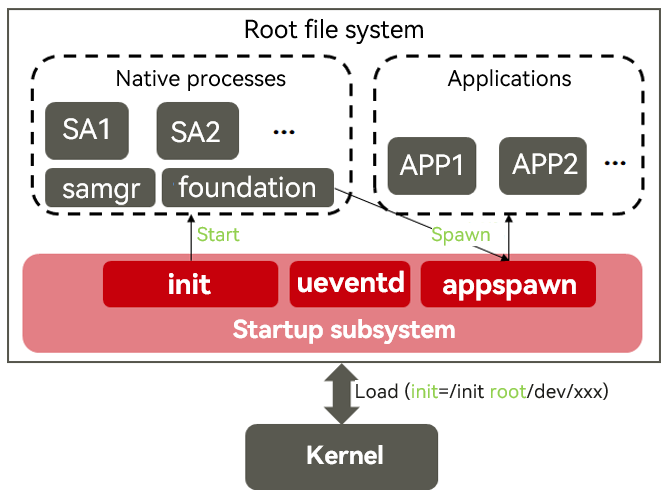

# Standard System Porting Guide


This document describes the general process for porting a development board, rather than the porting process specific to a System on Chip (SoC). In the future, the community will provide more development board porting examples for your reference.


## Defining a Development Board

This document uses the process of porting a development board named **MyProduct** as an example. This development board is provided by **MyProductVendor** and uses the SoC **MySOC** produced by **MySoCVendor**.


### Defining a Product

Create a file named **config.json** in the **//vendor/MyProductVendor/*{product_name}*** directory. This file is used to describe the SoC used by the product and the required subsystems. For example, if **product_name** is **MyProduct**, configure the **//vendor/MyProductVendor/MyProduct/config.json** file as follows:

//vendor/MyProductVendor/MyProduct/config.json


```
{
    "product_name": "MyProduct",
    "version": "3.0",
    "type": "standard",
    "target_cpu": "arm",
    "ohos_version": "OpenHarmony 1.0",
    "device_company": "MyProductVendor",
    "board": "MySOC",
    "enable_ramdisk": true,
    "subsystems": [
      {
        "subsystem": "ace",
        "components": [
          { "component": "ace_engine_lite", "features":[] }
        ]
      },
	...
    ]
}


```
The main configurations are as follows:

| Item| Description|
|-------|----------|
|product_name |(Mandatory) Product name.|
|version|(Mandatory) Version.|
|type|(Mandatory) System level, such as **small** and **standard**.|
|target_cpu |(Mandatory) CPU type of the device, such as **arm64**, **riscv**, or **x86**.|
|ohos_version|(Optional) Operating system version.|
|device_company|(Mandatory) Device manufacturer name.|
|board|(Mandatory) Development board name.|
|enable_ramdisk|(Mandatory) Whether to start the RAM disk.|
|kernel_type|(Optional) Kernel type.|
|kernel_version|(Optional) Kernel version. The values of both **kernel_type** and **kernel_version** are fixed in the standard system.|
|subsystems|(Mandatory) Subsystem to enable. A subsystem can be treated as an independently built functional block.|
|product_company|Device manufacturer name. It is not set in the configuration, but in the directory name, next to the vendor name. It can be accessed from **build.gn script**.|


You can find predefined subsystems in **//build/subsystem_config.json**. You can also customize subsystems.

You are advised to copy the configuration file of Hi3516D V300 and delete the **hisilicon_products** subsystem, which is used to compile the kernel for Hi3516D V300.


### Verifying the Porting

  Run the following command to start the build of your product:

```
./build.sh --product-name MyProduct 
```

After the build is complete, you can view the built image file in **//out/{*device_name*}/packages/phone/images**.


## Porting the Kernel

Now, you need to port the Linux kernel to enable it to run successfully.


### Adding a Kernel-built Subsystem to the SoC

Modify the **//build/subsystem_config.json** file to add a subsystem. For example, if **product_name** is **MyProduct**, configure the **//vendor/MyProductVendor/MyProduct/config.json** file as follows:


```
  "MySOCVendor_products": {
    "project": "hmf/MySOCVendor_products",
    "path": "device/MySOCVendor/MySOC/build",
    "name": "MySOCVendor_products",
    "dir": "device/MySOCVendor"
  },
```

Then, open the configuration file **//vendor/MyProductVendor/MyProduct/config.json** and add the new subsystem to the product.


### Building the Kernel

The OpenHarmony source code provides the Linux kernel 4.19, which is archived in **//kernel/linux-4.19**. This section uses this kernel version as an example to describe how to build the kernel.

The path for building the subsystem is defined when you define the subsystem in the previous step. In this example, the path is `//device/MySOCVendor/MySOC/build`. Now, you need to create a build script in this path to instruct the build system to build the kernel.

The recommended directory structure is as follows:


```
├── build
│ ├── kernel
│ │     ├── linux
│ │           ├──standard_patch_for_4_19.patch // Patch for the Linux kernel 4.19
│ ├── BUILD.gn
│ ├── ohos.build
```

The **BUILD.gn** file is the only entry for building the subsystem.

The expected build result described in the table below.

| File| Description| 
| -------- | -------- |
| $root_build_dir/packages/phone/images/uImage | Kernel image.| 
| $root_build_dir/packages/phone/images/uboot | Bootloader image.| 


### Verifying the Porting

Now start build, and check whether the kernel image is generated as expected.

## User-mode Boot

1. Overview of user-mode boot process

   


   When the system is powered on, the kernel loads and starts services and applications as follows:

   1. The kernel loads the init process, which is specified by **cmdline** of the kernel when the bootloader starts the kernel, for example, **init=/init root/dev/xxx**.
   2. After the init process is started, **tmpfs** and **procfs** are mounted and basic **dev** nodes are created to establish a basic root file system.
   3. The init process starts the ueventd process to listen for device hot-swap events in the kernel and creates **dev** nodes for related devices as well as partitions for the block device.
   4. After mounting partitions (**system** and **vendor**) of the block device, the init process scans for the init startup script of each system service and launches the respective service ability (SA).
   5. Each SA registers with the samgr process, which serves as the service registration center. The samgr process assigns each SA with an ID, which will be used by an application to access the desired SA.
   6. The foundation process implements application lifecycle management. It is a special SA service process that provides the user program management framework and basic services.
   7. The appspawn process directly spawns the application process, eliminating the need for the application to load the JS runtime environment. This reduces the application startup time.  

2. init module

   The configuration file of the init module contains service names, executable file paths, permissions, and other information of all key system services that need to be started by the init process. The boot script of each system service is installed in the **/system/etc/init** directory.

   When porting a new chip platform, you need to add the **/vendor/etc/init/init.{hardware}.cfg** file that contains the platform-level initialization configuration. This file is used to implement platform-level initialization, for example, installing the ko driver and configuring information on the related **/proc** nodes.

   The code of the init process is stored in the **//base/startup/init_lite** directory. This process is the first process in the system and does not depend on other processes.

   For details about how to develop the initialization configuration file, see [Startup](../subsystems/subsys-boot-overview.md).


## Porting the HDF Driver


### LCD

This section describes how to port a Liquid Crystal Display (LCD) driver. The hardware driver framework (HDF) designs a driver model for the LCD. To support an LCD, you must compile a driver, generate a model instance in the driver, and register the instance.

The LCD drivers are stored in the **//drivers/hdf_core/framework/model/display/driver/panel** directory.

1. Create a panel driver.

   In the **Init** method of the driver, call **RegisterPanel** to register the model instance. For example:


   ```
   int32_t XXXInit(struct HdfDeviceObject *object)
   {
       struct PanelData *panel = CreateYourPanel();

       // Registration
       if (RegisterPanel(panel) != HDF_SUCCESS) {
           HDF_LOGE("%s: RegisterPanel failed", __func__);
           return HDF_FAILURE;
       }
       return HDF_SUCCESS;
   }

   struct HdfDriverEntry g_xxxxDevEntry = {
       .moduleVersion = 1,
       .moduleName = "LCD_XXXX",
       .Init = XXXInit,
   };

   HDF_INIT(g_xxxxDevEntry);
   ```

2. Configure and load the panel driver. All device information about the product is defined in the **//vendor/MyProductVendor/MyProduct/config/device_info/device_info.hcs** file. Modify the file by adding configurations for the device named **device_lcd** to the host named **display**.

   Note: The value of **moduleName** must be the same as that in the panel driver.

   ```
   root {
       ...
       display :: host {
           device_lcd :: device {
               deviceN :: deviceNode {
                   policy = 0;
                   priority = 100;
                   preload = 2;
                   moduleName = "LCD_XXXX";
               }
           }
       }
   }
   ```

   For details about driver development, see [LCD](../driver/driver-peripherals-lcd-des.md).


### Touchscreen

This section describes how to port a touchscreen driver. The touchscreen driver is stored in the **//drivers/hdf_core/framework/model/input/driver/touchscreen** directory. To port a touchscreen driver, register a **ChipDevice** model instance.

1. Create a touchscreen driver.

   Create the **touch_ic_name.c** file in the directory. Replace **ic_name** with the name of your chip. The file template is as follows:


   ```
   #include "hdf_touch.h"

   static int32_t HdfXXXXChipInit(struct HdfDeviceObject *device)
   {
       ChipDevice *tpImpl = CreateXXXXTpImpl();
       if(RegisterChipDevice(tpImpl) != HDF_SUCCESS) {
           ReleaseXXXXTpImpl(tpImpl);
           return HDF_FAILURE;
       }
       return HDF_SUCCESS;
   }

   struct HdfDriverEntry g_touchXXXXChipEntry = {
       .moduleVersion = 1,
       .moduleName = "HDF_TOUCH_XXXX",
       .Init = HdfXXXXChipInit,
   };

   HDF_INIT(g_touchXXXXChipEntry);
   ```

   Implement the following interfaces in **ChipDevice**:

   | API| Description| 
   | -------- | -------- |
   | int32_t (\*Init)(ChipDevice \*device) | Initializes a touchscreen.| 
   | int32_t (\*Detect)(ChipDevice \*device) | Detects a touchscreen.| 
   | int32_t (\*Suspend)(ChipDevice \*device) | Suspends a touchscreen.| 
   | int32_t (\*Resume)(ChipDevice \*device) | Resumes a touchscreen.| 
   | int32_t (\*DataHandle)(ChipDevice \*device) | Reads data from a touchscreen and writes the touch point data to **device** > **driver** > **frameData**.| 
   | int32_t (\*UpdateFirmware)(ChipDevice \*device) | Upgrades the firmware.| 

2. Configure the product and load the driver.
  
   All device information about the product is defined in the **//vendor/MyProductVendor/MyProduct/config/device_info/device_info.hcs** file. Modify the file by adding configurations for the device named **device_touch_chip** to the host named **input**. Note: The value of **moduleName** must be the same as that in the touchscreen driver.

  
   ```
   deviceN :: deviceNode {
       policy = 0;
       priority = 130;
       preload = 0;
       permission = 0660;
       moduleName = "HDF_TOUCH_XXXX";
       deviceMatchAttr = "touch_XXXX_configs";
   }
   ```

   For details about driver development, see [Touchscreen](../driver/driver-peripherals-touch-des.md).


### WLAN

The WLAN driver is divided into two parts. One of the parts manages WLAN devices, and the other part manages WLAN traffic. HDF WLAN provides abstraction for the two parts. Currently, only the WLAN with the SDIO interface is supported.

  **Figure 1** WLAN chip

  

To support a chip, implement a **ChipDriver** for it. The major task is to implement the following interfaces provided by **HDF_WLAN_CORE** and **NetDevice**.

| API| Header File| Description|
| -------- | -------- | -------- |
| HdfChipDriverFactory | //drivers/hdf_core/framework/include/wifi/hdf_wlan_chipdriver_manager.h | Supports multiple WLAN interfaces of a chip.|
| HdfChipDriver | //drivers/hdf_core/framework/include/wifi/wifi_module.h | Manages a specific WLAN interface. Each WLAN interface corresponds to an **HdfChipDriver**.|
| NetDeviceInterFace | //drivers/hdf_core/framework/include/net/net_device.h | Communicates with the protocol stack, such as sending data and setting the status of network interfaces.|

To port a WLAN driver, perform the following steps:

1. Create an HDF driver. You are advised to place the code file in the **//device/MySoCVendor/peripheral/wifi/chip_name/** directory. The file template is as follows:


   ```
   static int32_t HdfWlanXXXChipDriverInit(struct HdfDeviceObject *device) {
       static struct HdfChipDriverFactory factory = CreateChipDriverFactory();
       struct HdfChipDriverManager *driverMgr = HdfWlanGetChipDriverMgr();
       if (driverMgr->RegChipDriver(&factory) != HDF_SUCCESS) {
           HDF_LOGE("%s fail: driverMgr is NULL!", __func__);
           return HDF_FAILURE;
       }
       return HDF_SUCCESS;
   }

   struct HdfDriverEntry g_hdfXXXChipEntry = {
       .moduleVersion = 1,
       .Init = HdfWlanXXXChipDriverInit,
       .Release = HdfWlanXXXChipRelease,
       .moduleName = "HDF_WIFI_CHIP_XXX"
   };

   HDF_INIT(g_hdfXXXChipEntry);
   ```

   Create an **HdfChipDriverFactory** in the **CreateChipDriverFactory**. The APIs are as follows:


   | API| Description| 
   | -------- | -------- |
   | const char \*driverName | Indicates the driver name.| 
   | int32_t (\*InitChip)(struct HdfWlanDevice \*device) | Initializes a chip.| 
   | int32_t (\*DeinitChip)(struct HdfWlanDevice \*device) | Deinitializes a chip.| 
   | void (_ReleaseFactory)(struct HdfChipDriverFactory _factory) | Releases the **HdfChipDriverFactory** object.| 
   | struct HdfChipDriver _(_Build)(struct HdfWlanDevice \*device, uint8_t ifIndex) | Creates an **HdfChipDriver**. In the input parameters, **device** indicates the device information, and **ifIndex** indicates the sequence number of this interface in the chip.| 
   | void (_Release)(struct HdfChipDriver _chipDriver) | Releases the **HdfChipDriver**.| 
   | uint8_t (\*GetMaxIFCount)(struct HdfChipDriverFactory \*factory) | Obtains the maximum number of APIs supported by the current chip.| 

   Implement the following APIs in the **HdfChipDriver**.

   | API| Description| 
   | -------- | -------- |
   | int32_t (\*init)(struct HdfChipDriver \*chipDriver, NetDevice \*netDev) | Initializes the current network interface. The **NetDeviceInterFace** needs to be provided for the **netDev**.| 
   | int32_t (\*deinit)(struct HdfChipDriver \*chipDriver, NetDevice \*netDev) | Deinitializes the current network interface.| 
   | struct HdfMac80211BaseOps \*ops | Provides the WLAN basic capability interface set.| 
   | struct HdfMac80211STAOps \*staOps | Provides the interface set required for supporting the standalone (STA) mode.| 
   | struct HdfMac80211APOps \*apOps | Provides the interface set required for supporting the access point (AP) mode.| 

2. Compile the configuration file to describe the devices supported by the driver.

   Create the chip configuration file **//vendor/MyProductVendor/MyProduct/config/wifi/wlan_chip_chip_name.hcs** in the product configuration directory.

   Replace **MyProductVendor**, **MyProduct**, and **chip_name** in the path with the actual names.

   The sample code is as follows:

   ```
   root {
       wlan_config {
           chip_name :& chipList {
               chip_name :: chipInst {
                   match_attr = "hdf_wlan_chips_chip_name"; /* Configure the matching attribute, which is used to provide the configuration root of the driver.*/
                   driverName = "driverName"; /* The value must be the same as that of driverName in HdfChipDriverFactory.*/
                   sdio {
                       vendorId = 0x0296;
                       deviceId = [0x5347];
                   }
               }
           }
       }
   }
   ```

3. Edit the configuration file and load the driver.

   All device information about the product is defined in the **//vendor/MyProductVendor/MyProduct/config/device_info/device_info.hcs** file. Modify the file by adding configurations for the device named **device_wlan_chips** to the host named **network**.

   Note: The value of **moduleName** must be the same as that in the touchscreen driver.

   ```
   deviceN :: deviceNode {
       policy = 0;
       preload = 2;
       moduleName = "HDF_WLAN_CHIPS";
       deviceMatchAttr = "hdf_wlan_chips_chip_name";
       serviceName = "driverName";
   }
   ```

4. Build the driver.

   - Create a kernel configuration menu. Create a **Kconfig** file in the **//device/MySoCVendor/peripheral** directory. The file template is as follows:
  
     ```
     config DRIVERS_WLAN_XXX
         bool "Enable XXX WLAN Host driver"
         default n
         depends on DRIVERS_HDF_WIFI
         help
           Answer Y to enable XXX Host driver. Support chip xxx
     ```

     Add the following configuration to the end of the **//drivers/hdf_core/adapter/khdf/linux/model/network/wifi/Kconfig** file:


     ```
     source "../../../../../device/MySoCVendor/peripheral/Kconfig"
     ```

   - Create a build script.
  
     Add the following configuration to the end of the **//drivers/hdf_core/adapter/khdf/linux/model/network/wifi/Makefile** file:

  
     ```
     HDF_DEVICE_ROOT := $(HDF_DIR_PREFIX)/../device
     obj-$(CONFIG_DRIVERS_WLAN_XXX) += $(HDF_DEVICE_ROOT)/MySoCVendor/peripheral/build/standard/
     ```

     When **DRIVERS_WLAN_XXX** is enabled in the kernel, **makefile** in **//device/MySoCVendor/peripheral/build/standard/** is called. For details about the development, see [LED Peripheral Control](../guide/device-wlan-led-control.md).

