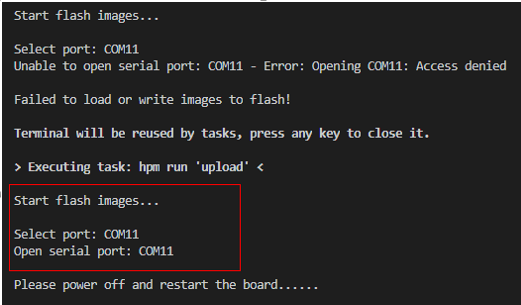

# FAQ on Hi3518<a name="EN-US_TOPIC_0000001058898620"></a>

-   [What should I do when the images failed to be burnt over the selected serial port?](#section1498892119619)
-   [What should I do when Windows-based PC failed to be connected to the board?](#section8512971816)
-   [What should I do when the image failed to be burnt?](#section1767804111198)
-   [What should I do when the message indicating Python cannot be found is displayed during compilation and building?](#en-us_topic_0000001053466255_section1039835245619)
-   [What should I do when no command output is displayed?](#en-us_topic_0000001053466255_section14871149155911)

## What should I do when the images failed to be burnt over the selected serial port?<a name="section1498892119619"></a>

-   **Symptom**

    **Error: Opening COMxx: Access denied**  is displayed after clicking  **Burn**  and selecting a serial port.

    **Figure  1**  Failed to open the serial port<a name="en-us_topic_0000001053466255_fig066333283916"></a>  
    

-   **Possible Causes**

    The serial port has been used.

-   **Solutions**

1.  Search for the terminal using serial-xx from the drop-down list in the  **TERMINAL**  panel.

    **Figure  2**  Checking whether the serial port is used<a name="en-us_topic_0000001053466255_fig165994164420"></a>  
    

2.  Click the dustbin icon as shown in the following figure to disable the terminal using the serial port.

    **Figure  3**  Disabling the terminal using the serial port<a name="en-us_topic_0000001053466255_fig7911282453"></a>  
    

3.  Click  **Burn**, select the serial port, and start burning images again.

    **Figure  4**  Restarting burning<a name="en-us_topic_0000001053466255_fig1138624316485"></a>  
    

    


## What should I do when Windows-based PC failed to be connected to the board?<a name="section8512971816"></a>

-   **Symptom**

    The file image cannot be obtained after clicking  **Burn**  and selecting a serial port.

    **Figure  5**  Failed to obtain the image file due to unavailable connection<a name="en-us_topic_0000001053466255_fig5218920223"></a>  
    

-   **Possible Causes**

    The board is disconnected from the Windows-based PC.

    Windows Firewall does not allow Visual Studio Code to access the network.

-   **Solutions**

1.  Check whether the network cable is properly connected.
2.  Click  **Windows Firewall**.

    **Figure  6**  Network and firewall setting<a name="en-us_topic_0000001053466255_fig62141417794"></a>  
    

3.  Click  **Firewall & network protection**, and on the displayed page, click  **Allow applications to communicate through Windows Firewall**.

    **Figure  7**  Firewall and network protection<a name="en-us_topic_0000001053466255_fig20703151111116"></a>  
    

4.  Select the Visual Studio Code application

    **Figure  8**  Selecting the Visual Studio Code application<a name="en-us_topic_0000001053466255_fig462316612165"></a>  
    

5.  Select the  **Private**  and  **Public**  network access rights for the Visual Studio Code application.

    **Figure  9**  Allowing the Visual Studio Code application to access the network<a name="en-us_topic_0000001053466255_fig132725269184"></a>  
    


## What should I do when the image failed to be burnt?<a name="section1767804111198"></a>

-   **Symptom**

    The burning status is not displayed after clicking  **Burn**  and selecting a serial port.

-   **Possible Causes**

    The IDE is not restarted after the DevEco plug-in is installed.

-   **Solutions**

    Restart the IDE.


## What should I do when the message indicating Python cannot be found is displayed during compilation and building?<a name="en-us_topic_0000001053466255_section1039835245619"></a>

-   **Symptom**

    


-   **Possible Cause 1**

    Python is not installed.

-   **Solutions**

    Install the Python environment by referring to  [Installing a Python Environment](basic-os-environment-setup.md#section11255767343).

-   **Possible Cause 2**

    

-   **Solutions**

    Run the following commands:

    ```
    # cd /usr/bin/
    # which python3
    # ln -s /usr/local/bin/python3 python
    # python --version
    ```

    Example:

    


## What should I do when no command output is displayed?<a name="en-us_topic_0000001053466255_section14871149155911"></a>

-   **Symptom**

    The serial port shows that the connection has been established. After the board is restarted, nothing is displayed when you press  **Enter**.

-   **Possible Cause 1**

    The serial port is connected incorrectly.

-   **Solutions**

    Change the serial port number.

    Start  **Device Manager**  to check whether the serial port connected to the board is the same as that connected to the terminal device. If the serial ports are different, perform step  [1](developing-the-first-example-program-running-on-hi3518.md#li744118533233)  in the  **Running an Image**  section to change the serial port number.


-   **Possible Cause 2**

    The U-boot of the board is damaged.

-   **Solutions**

    Burn the U-boot.

    If the fault persists after you perform the preceding operations, the U-boot of the board may be damaged. You can burn the U-boot by performing the following steps:


1.  Obtain the U-boot file.

    > **NOTICE:** 
    >The U-boot file of the two boards can be obtained from the following paths, respectively.
    >-   Hi3516D V300: vendor\\hisi\\hi35xx\\hi3516dv300\\uboot\\out\\boot\\u-boot-hi3516dv300.bin
    >-   Hi3518E V300: vendor\\hisi\\hi35xx\\hi3518ev300\\uboot\\out\\boot\\u-boot-hi3518ev300.bin

2.  Burn the U-boot file by following the procedures for burning a U-boot file over USB.

    Select the U-boot files of corresponding development boards for burning by referring to  [Programming Flash Memory on the Hi3516](https://device.harmonyos.com/en/docs/ide/user-guides/hi3516_upload-0000001052148681)/[Programming Flash Memory on the Hi3518](https://device.harmonyos.com/en/docs/ide/user-guides/hi3518_upload-0000001057313128)

3.  Log in to the serial port after the burning is complete.

    


