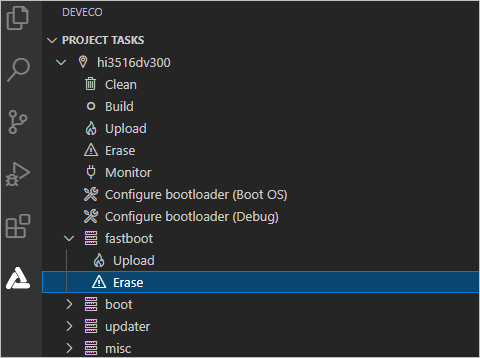
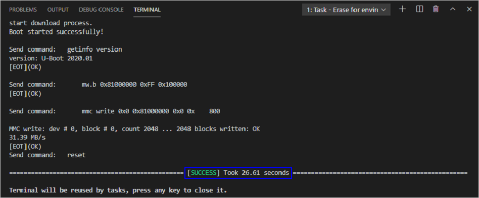

# How to Develop<a name="EN-US_TOPIC_0000001135402541"></a>

-   [Environment Setup](#section1246439101710)
-   [Build](#section375234715135)
-   [Burning](#section111671738101213)
    -   [Prerequisites](#section1458192114718)
    -   [Programming Flash Memory Through the USB Port](#section18423113662120)

-   [Development Example](#section5600113114323)

## Environment Setup<a name="section1246439101710"></a>

For details about setting up the standard OpenHarmony environment, see  [Setting Up the Environment](overview-9.md). 

> **NOTE:** 
>For details about the environment requirements of the third-party development board, refer to the official guide of the development board.

## Build<a name="section375234715135"></a>

If you are using the Docker environment, refer to the Docker usage guide to build the system. If you are using the installation package, perform the following operations in the Linux environment.

1.  Go to the root directory of the source code and run the following command to build the distribution.

    ```
    ./build.sh --product-name Hi3516DV300
    ```

    **product\_name**  indicates the platform supported by the current distribution,

2.  Check the build result. After the build is complete, the following information is displayed in the log:

    ```
     build system image successful.
    =====build Hi3516DV300 successful.
    ```

    Files generated during the build are stored in the  **out/ohos-arm-release/**  directory, and the generated image is stored in the  **out/ohos-arm-release/packages/phone/images/**  directory.

    > **NOTE:** 
    >For details about module-specific build operations, see  [Compilation and Building Overview](../subsystems/building-guidelines-for-the-standard-system.md).


## Burning<a name="section111671738101213"></a>

Programming flash memory of a regular system requires DevEco Device Tool v2.2 Beta1 or later.

The Hi3516DV300 of the Hi3516 series development boards supports programming flash memory of a regular system through the USB port, network port, or serial port, where:

-   **Windows system: Supports programming through the USB port, serial port, or network port**
-   **Linux system: Supports programming through the serial port or network port \(Linux+Windows dual system: Also supports programming through the USB port\)**

Except for environment setup, the burning operations are the same for Windows and Linux.

> **NOTE:** 
>Currently, the Hi3516D V300 development board supports system burning over the USB port, network port, or serial port. This document uses the USB port as an example. For details about system burning over other ports, see  [Programming Flash Memory on the Hi3516](https://device.harmonyos.com/en/docs/ide/user-guides/hi3516_upload-0000001052148681).

### Prerequisites<a name="section1458192114718"></a>

[Open a project](https://device.harmonyos.com/en/docs/ide/user-guides/open_project-0000001071680043)  in DevEco Device Tool and select the folder where the file to be programmed is located. Select  **Hi3516DV300**  for the development board type and  **Hb**  for  **Framework**.

### Programming Flash Memory Through the USB Port<a name="section18423113662120"></a>

The Hi3516DV300 supports programming through the USB port in Windows or Linux+Windows environment.

1.  Connect the PC and the target development board through the serial port and USB port. In this section, the Hi3516DV300 is used as an example. For details, please refer to  [Introduction to the Hi3516 Development Board](https://device.harmonyos.com/en/docs/start/introduce/oem_camera_start_3516-0000001052670587).
2.  Open Device Manager, then check and record the serial port number corresponding to the development board.

    > **NOTE:** 
    >If the serial port number is not displayed correctly, follow the steps described in  [Installing the Serial Port Driver on the Hi3516 or Hi3518 Series Development Boards](https://device.harmonyos.com/en/docs/ide/user-guides/hi3516_hi3518-drivers-0000001050743695).

    

3.  Open DevEco Device Tool and go to  **Projects**  \>  **Settings**.

    

4.  On the  **Partition Configuration**  tab page, enter the information about the files to be programmed, including the following.

    <a name="en-us_topic_0000001056443961_table165522468109"></a>
    <table><thead align="left"><tr id="en-us_topic_0000001056443961_row955394615107"><th class="cellrowborder" valign="top" width="12.5%" id="mcps1.1.9.1.1"><p id="en-us_topic_0000001056443961_p179582053201013"><a name="en-us_topic_0000001056443961_p179582053201013"></a><a name="en-us_topic_0000001056443961_p179582053201013"></a>Name</p>
    </th>
    <th class="cellrowborder" valign="top" width="12.5%" id="mcps1.1.9.1.2"><p id="en-us_topic_0000001056443961_p11958125331010"><a name="en-us_topic_0000001056443961_p11958125331010"></a><a name="en-us_topic_0000001056443961_p11958125331010"></a>Binary</p>
    </th>
    <th class="cellrowborder" valign="top" width="12.5%" id="mcps1.1.9.1.3"><p id="en-us_topic_0000001056443961_p13958115331012"><a name="en-us_topic_0000001056443961_p13958115331012"></a><a name="en-us_topic_0000001056443961_p13958115331012"></a>Memory</p>
    </th>
    <th class="cellrowborder" valign="top" width="12.5%" id="mcps1.1.9.1.4"><p id="en-us_topic_0000001056443961_p1395845361014"><a name="en-us_topic_0000001056443961_p1395845361014"></a><a name="en-us_topic_0000001056443961_p1395845361014"></a>System</p>
    </th>
    <th class="cellrowborder" valign="top" width="12.5%" id="mcps1.1.9.1.5"><p id="en-us_topic_0000001056443961_p595855381010"><a name="en-us_topic_0000001056443961_p595855381010"></a><a name="en-us_topic_0000001056443961_p595855381010"></a>Address</p>
    </th>
    <th class="cellrowborder" valign="top" width="12.5%" id="mcps1.1.9.1.6"><p id="en-us_topic_0000001056443961_p59584533106"><a name="en-us_topic_0000001056443961_p59584533106"></a><a name="en-us_topic_0000001056443961_p59584533106"></a>Length</p>
    </th>
    <th class="cellrowborder" valign="top" width="12.5%" id="mcps1.1.9.1.7"><p id="en-us_topic_0000001056443961_p11553246171019"><a name="en-us_topic_0000001056443961_p11553246171019"></a><a name="en-us_topic_0000001056443961_p11553246171019"></a>Board</p>
    </th>
    <th class="cellrowborder" valign="top" width="12.5%" id="mcps1.1.9.1.8"><p id="en-us_topic_0000001056443961_p195531146161018"><a name="en-us_topic_0000001056443961_p195531146161018"></a><a name="en-us_topic_0000001056443961_p195531146161018"></a>Type</p>
    </th>
    </tr>
    </thead>
    <tbody><tr id="en-us_topic_0000001056443961_row3553154691019"><td class="cellrowborder" valign="top" width="12.5%" headers="mcps1.1.9.1.1 "><p id="en-us_topic_0000001056443961_p17958115371017"><a name="en-us_topic_0000001056443961_p17958115371017"></a><a name="en-us_topic_0000001056443961_p17958115371017"></a>fastboot</p>
    </td>
    <td class="cellrowborder" valign="top" width="12.5%" headers="mcps1.1.9.1.2 "><p id="en-us_topic_0000001056443961_p89586532106"><a name="en-us_topic_0000001056443961_p89586532106"></a><a name="en-us_topic_0000001056443961_p89586532106"></a>Select <strong id="en-us_topic_0000001056443961_b1437145020335"><a name="en-us_topic_0000001056443961_b1437145020335"></a><a name="en-us_topic_0000001056443961_b1437145020335"></a>u-boot-hi3516dv300_emmc.bin</strong>.</p>
    </td>
    <td class="cellrowborder" valign="top" width="12.5%" headers="mcps1.1.9.1.3 "><p id="en-us_topic_0000001056443961_p8958115314102"><a name="en-us_topic_0000001056443961_p8958115314102"></a><a name="en-us_topic_0000001056443961_p8958115314102"></a>emmc</p>
    </td>
    <td class="cellrowborder" valign="top" width="12.5%" headers="mcps1.1.9.1.4 "><p id="en-us_topic_0000001056443961_p79581153171020"><a name="en-us_topic_0000001056443961_p79581153171020"></a><a name="en-us_topic_0000001056443961_p79581153171020"></a>none</p>
    </td>
    <td class="cellrowborder" valign="top" width="12.5%" headers="mcps1.1.9.1.5 "><p id="en-us_topic_0000001056443961_p6958195341010"><a name="en-us_topic_0000001056443961_p6958195341010"></a><a name="en-us_topic_0000001056443961_p6958195341010"></a>0x000000</p>
    </td>
    <td class="cellrowborder" valign="top" width="12.5%" headers="mcps1.1.9.1.6 "><p id="en-us_topic_0000001056443961_p795875318101"><a name="en-us_topic_0000001056443961_p795875318101"></a><a name="en-us_topic_0000001056443961_p795875318101"></a>0x100000</p>
    </td>
    <td class="cellrowborder" rowspan="7" valign="top" width="12.5%" headers="mcps1.1.9.1.7 "><p id="en-us_topic_0000001056443961_p13951154061115"><a name="en-us_topic_0000001056443961_p13951154061115"></a><a name="en-us_topic_0000001056443961_p13951154061115"></a>Select <strong id="en-us_topic_0000001056443961_b16219141853414"><a name="en-us_topic_0000001056443961_b16219141853414"></a><a name="en-us_topic_0000001056443961_b16219141853414"></a>hi3516dv300</strong>.</p>
    </td>
    <td class="cellrowborder" valign="top" width="12.5%" headers="mcps1.1.9.1.8 "><p id="en-us_topic_0000001056443961_p135531468109"><a name="en-us_topic_0000001056443961_p135531468109"></a><a name="en-us_topic_0000001056443961_p135531468109"></a>NA</p>
    </td>
    </tr>
    <tr id="en-us_topic_0000001056443961_row1255314611102"><td class="cellrowborder" valign="top" headers="mcps1.1.9.1.1 "><p id="en-us_topic_0000001056443961_p995885319102"><a name="en-us_topic_0000001056443961_p995885319102"></a><a name="en-us_topic_0000001056443961_p995885319102"></a>boot</p>
    </td>
    <td class="cellrowborder" valign="top" headers="mcps1.1.9.1.2 "><p id="en-us_topic_0000001056443961_p88121709145"><a name="en-us_topic_0000001056443961_p88121709145"></a><a name="en-us_topic_0000001056443961_p88121709145"></a>Select <strong id="en-us_topic_0000001056443961_b136621723153417"><a name="en-us_topic_0000001056443961_b136621723153417"></a><a name="en-us_topic_0000001056443961_b136621723153417"></a>uImage</strong>.</p>
    </td>
    <td class="cellrowborder" valign="top" headers="mcps1.1.9.1.3 "><p id="en-us_topic_0000001056443961_p109581753101014"><a name="en-us_topic_0000001056443961_p109581753101014"></a><a name="en-us_topic_0000001056443961_p109581753101014"></a>emmc</p>
    </td>
    <td class="cellrowborder" valign="top" headers="mcps1.1.9.1.4 "><p id="en-us_topic_0000001056443961_p10958175313102"><a name="en-us_topic_0000001056443961_p10958175313102"></a><a name="en-us_topic_0000001056443961_p10958175313102"></a>none</p>
    </td>
    <td class="cellrowborder" valign="top" headers="mcps1.1.9.1.5 "><p id="en-us_topic_0000001056443961_p1959185316100"><a name="en-us_topic_0000001056443961_p1959185316100"></a><a name="en-us_topic_0000001056443961_p1959185316100"></a>0x100000</p>
    </td>
    <td class="cellrowborder" valign="top" headers="mcps1.1.9.1.6 "><p id="en-us_topic_0000001056443961_p10959135314102"><a name="en-us_topic_0000001056443961_p10959135314102"></a><a name="en-us_topic_0000001056443961_p10959135314102"></a>0xf00000</p>
    </td>
    <td class="cellrowborder" valign="top" headers="mcps1.1.9.1.7 "><p id="en-us_topic_0000001056443961_p0554546111013"><a name="en-us_topic_0000001056443961_p0554546111013"></a><a name="en-us_topic_0000001056443961_p0554546111013"></a>NA</p>
    </td>
    </tr>
    <tr id="en-us_topic_0000001056443961_row19554104611015"><td class="cellrowborder" valign="top" headers="mcps1.1.9.1.1 "><p id="en-us_topic_0000001056443961_p139598532103"><a name="en-us_topic_0000001056443961_p139598532103"></a><a name="en-us_topic_0000001056443961_p139598532103"></a>updater</p>
    </td>
    <td class="cellrowborder" valign="top" headers="mcps1.1.9.1.2 "><p id="en-us_topic_0000001056443961_p1781314013140"><a name="en-us_topic_0000001056443961_p1781314013140"></a><a name="en-us_topic_0000001056443961_p1781314013140"></a>Select <strong id="en-us_topic_0000001056443961_b9127234183412"><a name="en-us_topic_0000001056443961_b9127234183412"></a><a name="en-us_topic_0000001056443961_b9127234183412"></a>updater.img</strong>.</p>
    </td>
    <td class="cellrowborder" valign="top" headers="mcps1.1.9.1.3 "><p id="en-us_topic_0000001056443961_p395995311105"><a name="en-us_topic_0000001056443961_p395995311105"></a><a name="en-us_topic_0000001056443961_p395995311105"></a>emmc</p>
    </td>
    <td class="cellrowborder" valign="top" headers="mcps1.1.9.1.4 "><p id="en-us_topic_0000001056443961_p129591153181015"><a name="en-us_topic_0000001056443961_p129591153181015"></a><a name="en-us_topic_0000001056443961_p129591153181015"></a>ext3/4</p>
    </td>
    <td class="cellrowborder" valign="top" headers="mcps1.1.9.1.5 "><p id="en-us_topic_0000001056443961_p169591532101"><a name="en-us_topic_0000001056443961_p169591532101"></a><a name="en-us_topic_0000001056443961_p169591532101"></a>0x1000000</p>
    </td>
    <td class="cellrowborder" valign="top" headers="mcps1.1.9.1.6 "><p id="en-us_topic_0000001056443961_p7959953151017"><a name="en-us_topic_0000001056443961_p7959953151017"></a><a name="en-us_topic_0000001056443961_p7959953151017"></a>0x1400000</p>
    </td>
    <td class="cellrowborder" valign="top" headers="mcps1.1.9.1.7 "><p id="en-us_topic_0000001056443961_p45547467107"><a name="en-us_topic_0000001056443961_p45547467107"></a><a name="en-us_topic_0000001056443961_p45547467107"></a>NA</p>
    </td>
    </tr>
    <tr id="en-us_topic_0000001056443961_row65541460107"><td class="cellrowborder" valign="top" headers="mcps1.1.9.1.1 "><p id="en-us_topic_0000001056443961_p6959125319108"><a name="en-us_topic_0000001056443961_p6959125319108"></a><a name="en-us_topic_0000001056443961_p6959125319108"></a>misc</p>
    </td>
    <td class="cellrowborder" valign="top" headers="mcps1.1.9.1.2 "><p id="en-us_topic_0000001056443961_p481318071415"><a name="en-us_topic_0000001056443961_p481318071415"></a><a name="en-us_topic_0000001056443961_p481318071415"></a>Leave it blank.</p>
    </td>
    <td class="cellrowborder" valign="top" headers="mcps1.1.9.1.3 "><p id="en-us_topic_0000001056443961_p795918532103"><a name="en-us_topic_0000001056443961_p795918532103"></a><a name="en-us_topic_0000001056443961_p795918532103"></a>emmc</p>
    </td>
    <td class="cellrowborder" valign="top" headers="mcps1.1.9.1.4 "><p id="en-us_topic_0000001056443961_p1695919534108"><a name="en-us_topic_0000001056443961_p1695919534108"></a><a name="en-us_topic_0000001056443961_p1695919534108"></a>none</p>
    </td>
    <td class="cellrowborder" valign="top" headers="mcps1.1.9.1.5 "><p id="en-us_topic_0000001056443961_p12959205317102"><a name="en-us_topic_0000001056443961_p12959205317102"></a><a name="en-us_topic_0000001056443961_p12959205317102"></a>0x2400000</p>
    </td>
    <td class="cellrowborder" valign="top" headers="mcps1.1.9.1.6 "><p id="en-us_topic_0000001056443961_p6959125331017"><a name="en-us_topic_0000001056443961_p6959125331017"></a><a name="en-us_topic_0000001056443961_p6959125331017"></a>0x100000</p>
    </td>
    <td class="cellrowborder" valign="top" headers="mcps1.1.9.1.7 "><p id="en-us_topic_0000001056443961_p65546468102"><a name="en-us_topic_0000001056443961_p65546468102"></a><a name="en-us_topic_0000001056443961_p65546468102"></a>NA</p>
    </td>
    </tr>
    <tr id="en-us_topic_0000001056443961_row145541746191011"><td class="cellrowborder" valign="top" headers="mcps1.1.9.1.1 "><p id="en-us_topic_0000001056443961_p1595945313105"><a name="en-us_topic_0000001056443961_p1595945313105"></a><a name="en-us_topic_0000001056443961_p1595945313105"></a>system</p>
    </td>
    <td class="cellrowborder" valign="top" headers="mcps1.1.9.1.2 "><p id="en-us_topic_0000001056443961_p2813160161420"><a name="en-us_topic_0000001056443961_p2813160161420"></a><a name="en-us_topic_0000001056443961_p2813160161420"></a>Select <strong id="en-us_topic_0000001056443961_b15994111173812"><a name="en-us_topic_0000001056443961_b15994111173812"></a><a name="en-us_topic_0000001056443961_b15994111173812"></a>system.img</strong>.</p>
    </td>
    <td class="cellrowborder" valign="top" headers="mcps1.1.9.1.3 "><p id="en-us_topic_0000001056443961_p395985317100"><a name="en-us_topic_0000001056443961_p395985317100"></a><a name="en-us_topic_0000001056443961_p395985317100"></a>emmc</p>
    </td>
    <td class="cellrowborder" valign="top" headers="mcps1.1.9.1.4 "><p id="en-us_topic_0000001056443961_p295955331017"><a name="en-us_topic_0000001056443961_p295955331017"></a><a name="en-us_topic_0000001056443961_p295955331017"></a>ext3/4</p>
    </td>
    <td class="cellrowborder" valign="top" headers="mcps1.1.9.1.5 "><p id="en-us_topic_0000001056443961_p129591853111013"><a name="en-us_topic_0000001056443961_p129591853111013"></a><a name="en-us_topic_0000001056443961_p129591853111013"></a>0x2500000</p>
    </td>
    <td class="cellrowborder" valign="top" headers="mcps1.1.9.1.6 "><p id="en-us_topic_0000001056443961_p109591753131011"><a name="en-us_topic_0000001056443961_p109591753131011"></a><a name="en-us_topic_0000001056443961_p109591753131011"></a>0xceb00000</p>
    </td>
    <td class="cellrowborder" valign="top" headers="mcps1.1.9.1.7 "><p id="en-us_topic_0000001056443961_p75551646171014"><a name="en-us_topic_0000001056443961_p75551646171014"></a><a name="en-us_topic_0000001056443961_p75551646171014"></a>NA</p>
    </td>
    </tr>
    <tr id="en-us_topic_0000001056443961_row655564620109"><td class="cellrowborder" valign="top" headers="mcps1.1.9.1.1 "><p id="en-us_topic_0000001056443961_p12960155351019"><a name="en-us_topic_0000001056443961_p12960155351019"></a><a name="en-us_topic_0000001056443961_p12960155351019"></a>vendor</p>
    </td>
    <td class="cellrowborder" valign="top" headers="mcps1.1.9.1.2 "><p id="en-us_topic_0000001056443961_p1881360181418"><a name="en-us_topic_0000001056443961_p1881360181418"></a><a name="en-us_topic_0000001056443961_p1881360181418"></a>Select <strong id="en-us_topic_0000001056443961_b715941813818"><a name="en-us_topic_0000001056443961_b715941813818"></a><a name="en-us_topic_0000001056443961_b715941813818"></a>vendor.img</strong>.</p>
    </td>
    <td class="cellrowborder" valign="top" headers="mcps1.1.9.1.3 "><p id="en-us_topic_0000001056443961_p796013532101"><a name="en-us_topic_0000001056443961_p796013532101"></a><a name="en-us_topic_0000001056443961_p796013532101"></a>emmc</p>
    </td>
    <td class="cellrowborder" valign="top" headers="mcps1.1.9.1.4 "><p id="en-us_topic_0000001056443961_p119607538107"><a name="en-us_topic_0000001056443961_p119607538107"></a><a name="en-us_topic_0000001056443961_p119607538107"></a>ext3/4</p>
    </td>
    <td class="cellrowborder" valign="top" headers="mcps1.1.9.1.5 "><p id="en-us_topic_0000001056443961_p11960165321019"><a name="en-us_topic_0000001056443961_p11960165321019"></a><a name="en-us_topic_0000001056443961_p11960165321019"></a>0xd1000000</p>
    </td>
    <td class="cellrowborder" valign="top" headers="mcps1.1.9.1.6 "><p id="en-us_topic_0000001056443961_p16960653141017"><a name="en-us_topic_0000001056443961_p16960653141017"></a><a name="en-us_topic_0000001056443961_p16960653141017"></a>0x10000000</p>
    </td>
    <td class="cellrowborder" valign="top" headers="mcps1.1.9.1.7 "><p id="en-us_topic_0000001056443961_p955584631011"><a name="en-us_topic_0000001056443961_p955584631011"></a><a name="en-us_topic_0000001056443961_p955584631011"></a>NA</p>
    </td>
    </tr>
    <tr id="en-us_topic_0000001056443961_row6555646161014"><td class="cellrowborder" valign="top" headers="mcps1.1.9.1.1 "><p id="en-us_topic_0000001056443961_p196065341017"><a name="en-us_topic_0000001056443961_p196065341017"></a><a name="en-us_topic_0000001056443961_p196065341017"></a>userdata</p>
    </td>
    <td class="cellrowborder" valign="top" headers="mcps1.1.9.1.2 "><p id="en-us_topic_0000001056443961_p16813140141420"><a name="en-us_topic_0000001056443961_p16813140141420"></a><a name="en-us_topic_0000001056443961_p16813140141420"></a>Select <strong id="en-us_topic_0000001056443961_b182717279384"><a name="en-us_topic_0000001056443961_b182717279384"></a><a name="en-us_topic_0000001056443961_b182717279384"></a>userdata.img</strong>.</p>
    </td>
    <td class="cellrowborder" valign="top" headers="mcps1.1.9.1.3 "><p id="en-us_topic_0000001056443961_p896065318103"><a name="en-us_topic_0000001056443961_p896065318103"></a><a name="en-us_topic_0000001056443961_p896065318103"></a>emmc</p>
    </td>
    <td class="cellrowborder" valign="top" headers="mcps1.1.9.1.4 "><p id="en-us_topic_0000001056443961_p12960155361018"><a name="en-us_topic_0000001056443961_p12960155361018"></a><a name="en-us_topic_0000001056443961_p12960155361018"></a>ext3/4</p>
    </td>
    <td class="cellrowborder" valign="top" headers="mcps1.1.9.1.5 "><p id="en-us_topic_0000001056443961_p1596013531108"><a name="en-us_topic_0000001056443961_p1596013531108"></a><a name="en-us_topic_0000001056443961_p1596013531108"></a>0xe1000000</p>
    </td>
    <td class="cellrowborder" valign="top" headers="mcps1.1.9.1.6 "><p id="en-us_topic_0000001056443961_p89601753161016"><a name="en-us_topic_0000001056443961_p89601753161016"></a><a name="en-us_topic_0000001056443961_p89601753161016"></a>0x5b800000</p>
    </td>
    <td class="cellrowborder" valign="top" headers="mcps1.1.9.1.7 "><p id="en-us_topic_0000001056443961_p8556194619109"><a name="en-us_topic_0000001056443961_p8556194619109"></a><a name="en-us_topic_0000001056443961_p8556194619109"></a>NA</p>
    </td>
    </tr>
    </tbody>
    </table>

    

5.  On the  **hi3516dv300**  tab page, configure the programming options.

    -   **upload\_port**: Select the serial port number obtained in step 2.
    -   **upload\_protocol**: Select the programming protocol  **hiburn-usb**.
    -   **upload\_partitions**: Select the file to be programmed, including the following: fastboot, boot, updater, misc, system, vendor, and userdata.

    

6.  When you finish modifying, click  **Save**  in the upper right corner.
7.  Open the project file, go to    \>  **PROJECT TASKS**  \>  **fastboot**  \>  **Erase**  to erase U-boot.

    

8.  When the following message is displayed, power off the development board and then power it on.

    

9.  If the following message is displayed, it indicates that U-Boot is erased successfully.

    

10. Go to  **hi3516dv300**  \>  **Upload**  to start programming.

    > **NOTE:** 
    >If this is the first time you program flash memory on the Hi3516 or Hi3518 board, the message "not find the Devices" may be displayed. In this case, follow the steps in  [Installing the USB Driver on the Hi3516 or Hi3518 Series Development Boards](https://device.harmonyos.com/en/docs/ide/user-guides/usb_driver-0000001058690393)  and start programming again.

    

11. If the following message is displayed, it indicates that the programming is successful.

    


## Development Example<a name="section5600113114323"></a>

You have completed the quick start for the standard system. Get yourself familiar with OpenHarmony by a  [Development Example for Platform Drivers](../guide/overview-10.md).

